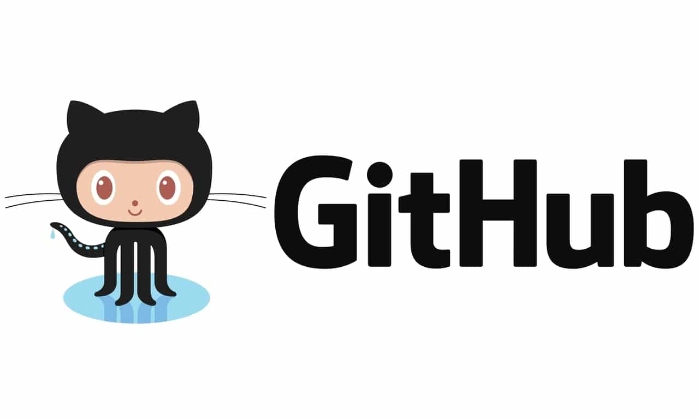
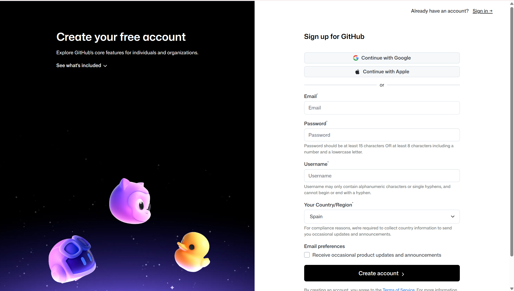
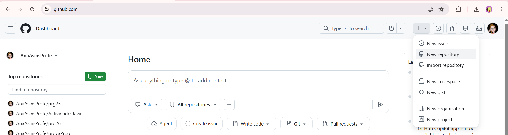
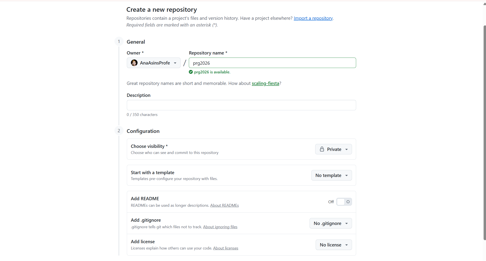
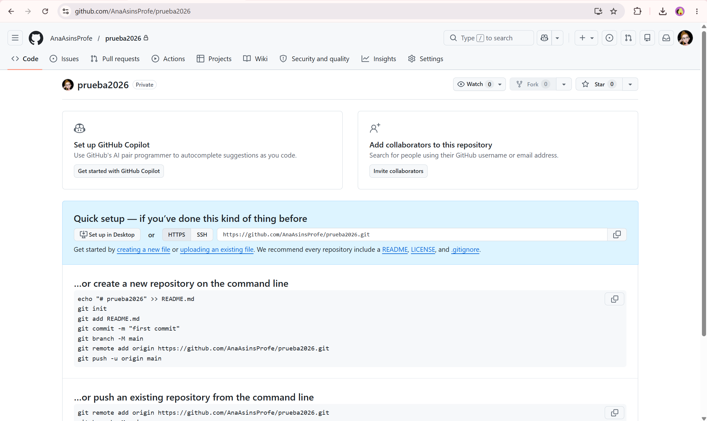
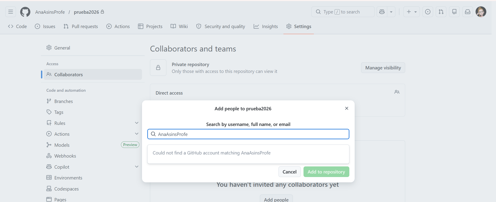

[⬅️ Tornar a l'índex de Programació](./) | [🏠 Portal Principal](../) | [🎨 **Obrir versió interactiva Material (amb índex lateral i mode fosc)**](./guia-completa/ut00/) | [➡️ UT1](ut1-estructura-programes.md)

# ☕ UT0 — Prerrequisitos y Configuración del Entorno (Git, GitHub y VS Code)

> 📌 **Resultat d'Aprenentatge i Continguts de la Unitat (UT0)**
> * **Referència Curricular:** Configuración de herramientas profesionales: Git, GitHub, GitHub Desktop y Visual Studio Code
> * **Qualificació i Entorn:** `Inicial · Entorn de Desenvolupament · Git & VS Code`

## 📑 Índex d'Apartats d'aquesta Unitat

* **[0.1 Introducción](./ut00/ut0001.md)** | *([🎨 Versió Web Material](./guia-completa/ut00/ut0001.html))*
* **[0.2 GitHub](./ut00/ut0002.md)** | *([🎨 Versió Web Material](./guia-completa/ut00/ut0002.html))*
* **[0.3 Git](./ut00/ut0003.md)** | *([🎨 Versió Web Material](./guia-completa/ut00/ut0003.html))*
* **[0.4 Visual Studio Code](./ut00/ut0004.md)** | *([🎨 Versió Web Material](./guia-completa/ut00/ut0004.html))*
* **[0.5 GitHub Desktop](./ut00/ut0005.md)** | *([🎨 Versió Web Material](./guia-completa/ut00/ut0005.html))*

---

# 0.1 Introducción

Bienvenidos al curso de **Programación** **PRG** del *Ciclo Formativo Superior de Desarrollo de Aplicaciones Web* **DAW**.

Antes de entrar en materia, sería conveniente e interesante introducir *un par* de conceptos para realizar nuestro trabajo en clase y en casa de forma más organizada.

Esta primera unidad estará dedicada a este menester. En ella, comentaremos, a modo "*manual de supervivencia*", conceptos como:

| SOFTWARE |  |  |
| --- | --- | --- |
| **Git** |  | Sistema de control de versiones |
| **Github** |  | Plataforma web para alojar y compartir proyectos de software y código fuente |
| **Github Desktop** |  | Aplicación gratuita en que se puede realizar comandos de Git, como confirmar e insertar cambios, en una interfaz gráfica de usuario, en lugar de mediante la línea de comandos |
| **Visual Studio Code** |  | Editor de código fuente desarrollado por*Microsoft* |
| **Antigravity** |  | Editor de código fuente desarrollado por*Google* |


---


# 0.2 Github

Existen muchos proveedores de alojamiento para repositorios Git pero los más usados son [GitHub](https://github.com/) y [GitLab](https://about.gitlab.com/).

## ¿Qué es GitHub?

    

[GitHub](https://github.com/) es el proveedor de alojamiento en la nube para repositorios gestionados con git más usado y el que actualmente tiene alojados más proyectos de desarrollo de software de código abierto en el mundo.

La principal ventaja de *GitHub* es que permite albergar un número ilimitado de repositorios tanto públicos como privados, y que además ofrece servicios de registro de errores, solicitud de nuevas funcionalidades, gestión de tareas, wikis o publicación de páginas web, para cada proyecto, incluso con el plan básico que es gratuito.

## 1. Registro de usuario en GitHub

Acceder a la página oficial de [GitHub](https://github.com/).

    

## 2. Crear un repositorio remoto en GitHub

Accedemos a nuestra cuenta de GitHub.

En la **esquina superior derecha**, pulsamos en el signo **+** y luego en **New repository**

    

Escogemos el nombre del repositorio. No tiene porqué coincidir con el nombre del repositorio local, aunque es lo aconsejable para no hacernos un lío.

    


> ⚠️ **Importante**
>
> Es importante que el repositorio sea privado para que no pueda acceder a él cualquier persona.


> ⚠️ **Importante**
>
> Es muy importante que **NO INICIALICES EL REPOSITORIO**. Si el repositorio no estuviese vacío podría darnos un conflicto.


Pulsaremos en **Create Repository** y nos aparecerá una página como la siguiente:

    

Ahí podemos ver la URL del repositorio remoto. Hay 2 formas de acceso:

- **mediante HTTPS**
- **mediante SSH**

Más abajo se indican los comandos a ejecutar en nuestro repositorio local. Lo vemos en el siguiente punto.

## 3. Añadir colaboradores a un repositorio


> ⚠️ **Importante**
>
> Es obligatorio añadir a la profesora como colaboradora para que pueda ver y corregir tus actividades.


Para añadir colaboradores al repositorio, seguiremos los siguientes pasos:

1. Pulsar en la pestaña Settings
2. Pulsar en el botón Collaborators
3. Introducir el nombre de usuario de la colaboradora
4. Pulsar en el botón Add collaborator

    


---


# 0.3 Git

Una vez creado el repositorio en GitHub, debemos unirlo a nuestro repositorio local.

El primer paso será acceder, mediante la línea de comandos, al directorio que contiene el repositorio local.

```java
cd /ruta/al/repositorio/local
```

Una vez dentro, seguiremos los siguientes pasos:

## 1. Configuración (`git config`)

Establecer el nombre de usuario:

```bash
git config --global user.name "Your-Full-Name"
```

Establecer el correo del usuario:

```bash
git config --global user.email "your-email-address"
```

Activar el coloreado de la salida:

```bash
git config --global color.ui auto
```

Mostrar el estado original en los conflictos

```bash
git config --global merge.conflictstyle diff3
```

Mostrar la configuración

```bash
git config --list
```

---

## 2. Creación de repositorios

### 2.1 Creación de un repositorio nuevo (`git init`)

Este comando crea una nueva carpeta con el nombre del repositorio, que a su vez contiene otra carpeta oculta llamada .git que contiene la base de datos donde se registran los cambios en el repositorio.

`git init <nombre-repositorio>` crea un repositorio nuevo con el nombre `<nombre-repositorio>`.

### 2.2 Copia de repositorios (`git clone`)

**No es nuestro caso ahora mismo**

A partir de que se hace la copia, los dos repositorios, el original y la copia, son independientes, es decir, cualquier cambio en uno de ellos no se verá reflejado en el otro.

`git clone <url-repositorio>` crea una copia local del repositorio ubicado en la dirección `<url-repositorio>`.

---

## 3. Añadir un repositorio remoto (`git remote add`)

**`git remote add <repositorio-remoto> <url>`** crea un enlace con el nombre `<repositorio-remoto>` a un repositorio remoto ubicado en la dirección `<url>`.

Cuando se añade un repositorio remoto a un repositorio, Git seguirá también los cambios del repositorio remoto de manera que se pueden descargar los cambios del repositorio remoto al local y se pueden subir los cambios del repositorio local al remoto.

    


<details markdown="1">
<summary><strong>📝 Nota</strong></summary>

El nombre por defecto del repositorio remoto es `origin`. Si no se especifica un nombre, se usará `origin`.

</details>


---

## 4. Añadir cambios al repositorio local

Con *Git*, cualquier cambio que hagamos en un proyecto tiene que pasar por tres estados hasta que guarde definitivamente en el repositorio.

- **Directorio de trabajo**: Es el directorio que contiene una copia de una versión concreta del proyecto en la que se está trabajando. Puede contener ficheros que no pertenecen al repositorio.
- **Zona temporal de intercambio (staging area)**: es una zona donde se guardan los cambios temporalmente desde el directorio de trabajo antes de hacerlos definitivos y registrarlos en el repositorio.
- **Repositorio**: Es donde finalmente se guardan los cambios confirmados desde la zona temporal de intercambio.

    

### 4.1 Añadir cambios a la zona de intercambio temporal (`git add`)

**`git add <fichero>`** añade los cambios en el fichero `<fichero>` del directorio de trabajo a la zona de intercambio temporal. `git add <carpeta>` añade los cambios en todos los ficheros de la carpeta `<carpeta>` del directorio de trabajo a la zona de intercambio temporal. **`git add .`** añade todos los cambios de todos ficheros no guardados aún en la zona de intercambio temporal.

### 4.2 Confirmar los cambios en el repositorio (`git commit`)

**`git commit -m "mensaje"`** confirma todos los cambios de la zona de intercambio temporal añadiéndolos al repositorio y creando una nueva versión del proyecto. `"mensaje"` es un breve mensaje describiendo los cambios realizados que se asociará a la nueva versión del proyecto.

---

## 5. Subir cambios a un repositorio remoto (`git push`)

**`git push <remoto> <rama>`** sube al repositorio remoto `<remoto>` los cambios de la rama `<rama>` en el repositorio local.

    

## 6. Descargar cambios desde un repositorio remoto (`git pull`)

**`git pull <remoto> <rama>`** descarga los cambios de la rama `<rama>` del repositorio remoto `<remoto>` y los integra en la última versión del repositorio local, es decir, en el HEAD.


<details markdown="1">
<summary><strong>💡 Otros comandos útiles</strong></summary>

- **`git status`**: Muestra el estado de los cambios en el repositorio desde la última versión guardada. En particular, muestra los ficheros con cambios en el directorio de trabajo que no se han añadido a la zona de intercambio temporal y los ficheros en la zona de intercambio temporal que no se han añadido al repositorio.
- **`git log`**: Muestra el historial de commits de un repositorio ordenado cronológicamente. Para cada *commit* muestra su código hash, el autor, la fecha, la hora y el mensaje asociado. Este comando es muy versátil y muestra la historia del repositorio en distintos formatos dependiendo de los parámetros que se le den. Los más comunes son:
    - `--oneline`: muestra cada *commit* en una línea produciendo una salida más compacta.
    - **`--graph`**: muestra la historia en forma de grafo.
- **`git show`**: Muestra el usuario, el día, la hora y el mensaje del último *commit*, así como las diferencias con el anterior.
    - **`git show <commit>`**: Muestra el usuario, el día, la hora y el mensaje del `commit` indicado, así como las diferencias con el anterior.

</details>


---


# 0.4 VS Code

## ¿Qué es Visual Studio Code?

**Visual Studio Code** (*VS Code*) es un editor de código fuente desarrollado por *Microsoft*. Es ampliamente utilizado por programadores debido a su flexibilidad, rendimiento y gran cantidad de extensiones que permiten personalizarlo para diferentes lenguajes y tecnologías.

### Características clave de VS Code

- **Editor de código fuente ligero**: A diferencia de los entornos de desarrollo integrados (*IDE*) como *Eclipse* o *IntelliJ*, *VS Code* es un editor más ligero, lo que lo hace más rápido y menos demandante de recursos.
- **Soporte para múltiples lenguajes**: Aunque no está diseñado exclusivamente para Java, *VS Code* soporta muchos lenguajes de programación (como *Python*, *JavaScript*, *C++*, y más) a través de extensiones.
- **Extensiones**: Su mayor fortaleza es el soporte de extensiones, que le permite agregar funcionalidades según el lenguaje o tecnología que se esté utilizando. Para *Java*, existen extensiones específicas que facilitan el desarrollo.
- **Depuración y control de versiones**: Incluye herramientas para depurar código, así como integración con sistemas de control de versiones como *Git*.
- **Multiplataforma**: Está disponible para *Windows*, *macOS* y *Linux*.

### ¿Por qué lo vamos a usar para programar en Java?

1. **Facilidad de uso**: *VS Code* tiene una interfaz muy intuitiva y fácil de usar, lo que es ideal si estás empezando en la programación.
2. **Extensiones para Java**: Existen extensiones oficiales de Microsoft y Red Hat que añaden soporte completo para Java, incluyendo herramientas como IntelliSense (autocompletado de código), depuración, y manejo de proyectos Java.
3. **Ligero y rápido**: A diferencia de otros IDEs para Java como Eclipse o IntelliJ IDEA, VS Code consume menos recursos, por lo que puede ser más cómodo si no tienes una máquina muy potente.
4. **Personalizable**: Puedes adaptar VS Code a tus necesidades y agregar nuevas funcionalidades según avances en tu aprendizaje de Java.
5. **Integración con Maven y Gradle**: Si en el futuro necesitas trabajar con herramientas de construcción como Maven o Gradle, VS Code tiene soporte para ellas.
6. **Terminal integrada**: Tiene una terminal integrada donde puedes compilar y ejecutar tus programas de Java sin necesidad de salir del editor.

### Instalación VS Code


> ☕ **En Sistemas Operativos:**
>
> === ""
>     **Paso 1: Descargar el archivo .deb**:  
>
>     Ve a [https://code.visualstudio.com/](https://code.visualstudio.com/) y descarga el archivo `.deb` para distribuciones de *Debian*/*Ubuntu*.  
>
>     **Paso 2: Instalar el archivo .deb**:  
>
>     Abre una terminal y navega hasta el directorio donde descargaste el archivo. Usa el siguiente comando para instalarlo:
>
>     ```bash
>     sudo dpkg -i nombre-del-archivo.deb
>     ```
>
>     Si aparece algún error de dependencias, corrígelo con el siguiente comando:
>
>     ```bash
>     sudo apt --fix-broken install
>     ```
>
> === ""
>     **Paso 1: Descargar el instalador**:  
>
>     Ve a la página oficial de Visual Studio Code: [https://code.visualstudio.com/](https://code.visualstudio.com/)  
>
>     Haz clic en el botón "**Download for Windows**". Esto descargará el archivo .exe para la instalación.  
>
>     **Paso 2: Ejecutar el instalador**:  
>
>     Una vez descargado el archivo, haz doble clic en él para abrir el instalador.  
>
>     Acepta los términos de licencia y sigue los pasos del asistente de instalación.  
>
>     **Paso 3: Configurar opciones durante la instalación**:  
>
>     Durante el proceso, puedes elegir algunas opciones adicionales como:  
>
>         - Crear un acceso directo en el escritorio.  
>
>         - Añadir VS Code al **Path** (recomendado para abrir VS Code desde la línea de comandos).  
>
>         - Habilitar la opción de abrir archivos desde el menú contextual (clic derecho).  
>
>         Selecciona las opciones que prefieras y luego haz clic en **Instalar**.  
>
>         **Paso 4: Finalizar la instalación**:  
>
>             Una vez completada la instalación, puedes hacer clic en **Finalizar**. VS Code se abrirá automáticamente si seleccionas la opción "Iniciar Visual Studio Code".
>     **Instalar extensiones**:  
>
>         Para trabajar con *Java*, ve a la pestaña de **Extensiones** (icono en la barra lateral izquierda) y busca la extensión **Java Extension Pack**. Instálala para habilitar el soporte completo para *Java*.


### Creación de un nuevo proyecto java

Para ejecutar la mayoría de los comandos, usamos la tecla Ctrl+ Shift + P (también se puede desde: menú *Ver → Paleta de comandos*).

Para iniciar un nuevo proyecto Java, abrir la paleta de comandos y alegir la opción Java: Create Java Project....

    

Se puede observar que abre una nueva pantalla con varias opciones de proyectos Java. El Código VS tiene una extensión para facilitar la creación con cualquier opción elegida: *Maven, Gradle, Spring Boot, Quarkus o MicroProfile*.

    

Eligiremos la opción **No build tools** solo para ver algunas opciones básicas del VS Code.

La carpeta que se elige es la carpeta donde se va a generar el proyecto javav y, después de este paso, se pedirá el nombre del proyecto. Al proceder, se creará una estructura de paquete, con las carpetas `.vscode` (que contiene el archivo settings.json), la carpeta `bin` (que contendrá los archivos con extensión .class), la carpeta `lib`( donde se encuentran los recursos o bibliotecas que se utilizan en la aplicación) y la carpeta **`src`** (donde se encuentra el código fuente, en nuestro caso, las clases).

Se crea por defecto, dentro del proyecto, la primera clase, la **App.java**, con el método *main* es nuestro famoso **¡Hello, World!**

    

## GitHub integrado en VS Code

Entre las funcionalidades integradas en VS Code podemos encontrar el manejo de repositorios Git, función que nos permite gestionar nuestros repositorios de una forma mucho más cómoda y visual.

    


---


# 0.5 Github Desktop

## 1. GitHub Desktop

**GitHub Desktop** es una aplicación gratuita de código abierto que ayuda a trabajar con código hospedado en GitHub u otros servicios de hospedaje de *Git*. Con *GitHub Desktop*, puedes realizar comandos de *Git*, como confirmar e insertar cambios, en una interfaz gráfica de usuario, en lugar de mediante la línea de comandos.

Más información en [Acerca de GitHub de escritorio](https://docs.github.com/es/desktop/installing-and-configuring-github-desktop/overview/about-github-desktop).

    

### 1.1. Instalación GitHub Desktop

Descarga de la página oficial de [GitHub Desktop](https://desktop.github.com/).

Descarga el instalable en función del sistema operativo en el que estés.

    

### 1.2. Inicio de sesión

Después de la instalación puedes iniciar sesión con tu cuenta de GitHub. Para ello, primero se te redirigirá a la página web oficial de GitHub, donde podrás introducir tus datos de acceso.

Seguidamente, tienes que **autorizar GitHub Desktop** para que la aplicación acceda mediante tu cuenta y a tus repositorios. Para ello, haz clic en el botón “*Authorize desktop*”.

Una vez se te haya redirigido a *GitHub Desktop*, puedes completar el proceso de inicio de sesión introduciendo un nombre de cuenta y una dirección de correo electrónico o transfiriendo los datos correspondientes desde tu cuenta de GitHub. Al hacer clic en el botón “*Finish*”, accederás a la interfaz de usuario de *GitHub Desktop*.

Ahora podemos clonar nuestro repositorio de *GitHub* en uno local:

    

    

Elegimos, de nuestro repositorios remotos en *GitHub*, el que queremos clonar; y pulsamos "*Clone*":

    

Cuando esté clonado nuestro repositorio (*punto 1*) podremos observar si existen modificaciones a *subir* a nuestro repositorio remoto (*punto 2*). Si es así, ponemos un nombre a nuestro *commit* (*punto 3*) y pulsamos "*Commit to master*" (*punto 4*). En este momento tenemos el *commit* realizado en nuestro repositorio local; listo para actualizar al repositorio remoto en *GitHub*.

    

Para subir este(os) *commits* a remoto, pulsaremos el botón "*Publish branch*", y el cambio estará listo en el repositorio de *GitHub*:

    


---

