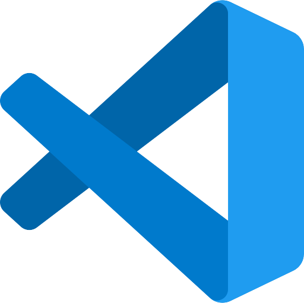

# 0.1 Introducción

Bienvenidos al curso de **Programación** **PRG** del *Ciclo Formativo Superior de Desarrollo de Aplicaciones Web* **DAW**.

Antes de entrar en materia, sería conveniente e interesante introducir *un par* de conceptos para realizar nuestro trabajo en clase y en casa de forma más organizada.

Esta primera unidad estará dedicada a este menester. En ella, comentaremos, a modo "*manual de supervivencia*", conceptos como:

| SOFTWARE |  |  |
| --- | --- | --- |
| **Git** |  | Sistema de control de versiones |
| **Github** |  | Plataforma web para alojar y compartir proyectos de software y código fuente |
| **Github Desktop** |  | Aplicación gratuita en que se puede realizar comandos de Git, como confirmar e insertar cambios, en una interfaz gráfica de usuario, en lugar de mediante la línea de comandos |
| **Visual Studio Code** |  | Editor de código fuente desarrollado por *Microsoft* |
| **Antigravity** |  | Editor de código fuente desarrollado por *Google* |
