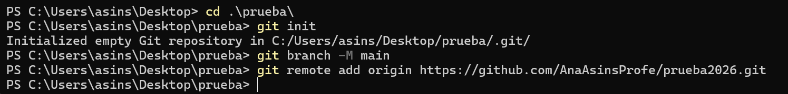
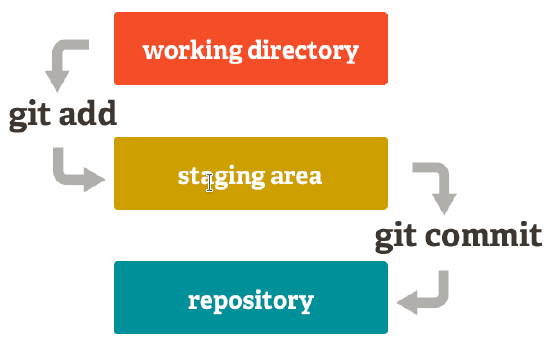
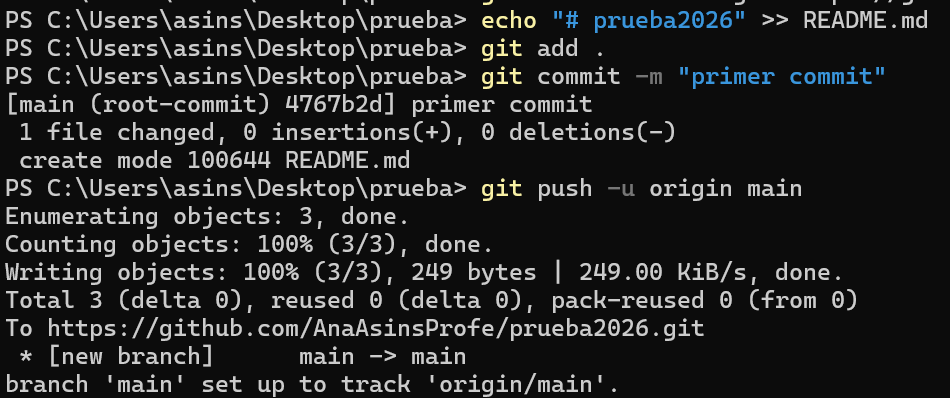

# 0.3 Git

Una vez creado el repositorio en GitHub, debemos unirlo a nuestro repositorio local.

El primer paso será acceder, mediante la línea de comandos, al directorio que contiene el repositorio local.

```java
cd /ruta/al/repositorio/local
```

Una vez dentro, seguiremos los siguientes pasos:

## 1. Configuración (`git config`)

Establecer el nombre de usuario:

Terminal / Consola

📋 Copiar
BASH

`git config --global user.name "Your-Full-Name"`

Establecer el correo del usuario:

Terminal / Consola

📋 Copiar
BASH

`git config --global user.email "your-email-address"`

Activar el coloreado de la salida:

Terminal / Consola

📋 Copiar
BASH

`git config --global color.ui auto`

Mostrar el estado original en los conflictos

Terminal / Consola

📋 Copiar
BASH

`git config --global merge.conflictstyle diff3`

Mostrar la configuración

Terminal / Consola

📋 Copiar
BASH

`git config --list`

---

## 2. Creación de repositorios

### 2.1 Creación de un repositorio nuevo (`git init`)

Este comando crea una nueva carpeta con el nombre del repositorio, que a su vez contiene otra carpeta oculta llamada .git que contiene la base de datos donde se registran los cambios en el repositorio.

`git init <nombre-repositorio>` crea un repositorio nuevo con el nombre `<nombre-repositorio>`.

### 2.2 Copia de repositorios (`git clone`)

**No es nuestro caso ahora mismo**

A partir de que se hace la copia, los dos repositorios, el original y la copia, son independientes, es decir, cualquier cambio en uno de ellos no se verá reflejado en el otro.

`git clone <url-repositorio>` crea una copia local del repositorio ubicado en la dirección `<url-repositorio>`.

---

## 3. Añadir un repositorio remoto (`git remote add`)

**`git remote add <repositorio-remoto> <url>`** crea un enlace con el nombre `<repositorio-remoto>` a un repositorio remoto ubicado en la dirección `<url>`.

Cuando se añade un repositorio remoto a un repositorio, Git seguirá también los cambios del repositorio remoto de manera que se pueden descargar los cambios del repositorio remoto al local y se pueden subir los cambios del repositorio local al remoto.



> **📌 Nota**
> El nombre por defecto del repositorio remoto es `origin`. Si no se especifica un nombre, se usará `origin`.

---

## 4. Añadir cambios al repositorio local

Con *Git*, cualquier cambio que hagamos en un proyecto tiene que pasar por tres estados hasta que guarde definitivamente en el repositorio.

- **Directorio de trabajo** : Es el directorio que contiene una copia de una versión concreta del proyecto en la que se está trabajando. Puede contener ficheros que no pertenecen al repositorio.
- **Zona temporal de intercambio (staging area)** : es una zona donde se guardan los cambios temporalmente desde el directorio de trabajo antes de hacerlos definitivos y registrarlos en el repositorio.
- **Repositorio** : Es donde finalmente se guardan los cambios confirmados desde la zona temporal de intercambio.



### 4.1 Añadir cambios a la zona de intercambio temporal (`git add`)

**`git add <fichero>`** añade los cambios en el fichero `<fichero>` del directorio de trabajo a la zona de intercambio temporal. `git add <carpeta>` añade los cambios en todos los ficheros de la carpeta `<carpeta>` del directorio de trabajo a la zona de intercambio temporal. **`git add .`** añade todos los cambios de todos ficheros no guardados aún en la zona de intercambio temporal.

### 4.2 Confirmar los cambios en el repositorio (`git commit`)

**`git commit -m "mensaje"`** confirma todos los cambios de la zona de intercambio temporal añadiéndolos al repositorio y creando una nueva versión del proyecto. `"mensaje"` es un breve mensaje describiendo los cambios realizados que se asociará a la nueva versión del proyecto.

---

## 5. Subir cambios a un repositorio remoto (`git push`)

**`git push <remoto> <rama>`** sube al repositorio remoto `<remoto>` los cambios de la rama `<rama>` en el repositorio local.



## 6. Descargar cambios desde un repositorio remoto (`git pull`)

**`git pull <remoto> <rama>`** descarga los cambios de la rama `<rama>` del repositorio remoto `<remoto>` y los integra en la última versión del repositorio local, es decir, en el HEAD.

> **💡 Otros comandos útiles**
> - **`git status`** : Muestra el estado de los cambios en el repositorio desde la última versión guardada. En particular, muestra los ficheros con cambios en el directorio de trabajo que no se han añadido a la zona de intercambio temporal y los ficheros en la zona de intercambio temporal que no se han añadido al repositorio.
> - **`git log`** : Muestra el historial de commits de un repositorio ordenado cronológicamente. Para cada *commit* muestra su código hash, el autor, la fecha, la hora y el mensaje asociado. Este comando es muy versátil y muestra la historia del repositorio en distintos formatos dependiendo de los parámetros que se le den. Los más comunes son:
>   - `--oneline` : muestra cada *commit* en una línea produciendo una salida más compacta.
>   - **`--graph`** : muestra la historia en forma de grafo.
> - **`git show`** : Muestra el usuario, el día, la hora y el mensaje del último *commit* , así como las diferencias con el anterior.
>   - **`git show <commit>`** : Muestra el usuario, el día, la hora y el mensaje del `commit` indicado, así como las diferencias con el anterior.
