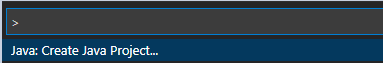
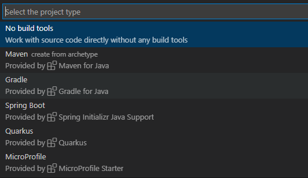
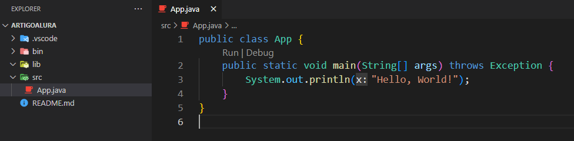
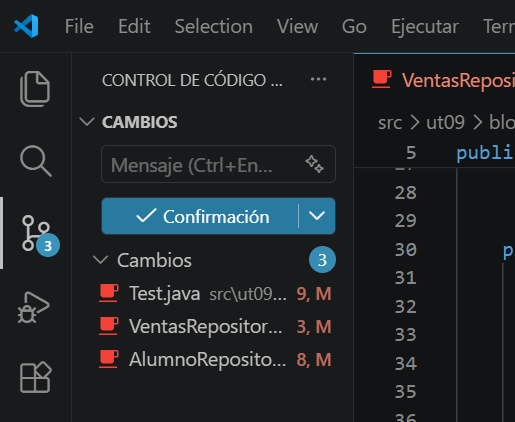

# 0.4 VS Code

## ¿Qué es Visual Studio Code?

**Visual Studio Code** (*VS Code*) es un editor de código fuente desarrollado por *Microsoft*. Es ampliamente utilizado por programadores debido a su flexibilidad, rendimiento y gran cantidad de extensiones que permiten personalizarlo para diferentes lenguajes y tecnologías.

### Características clave de VS Code

- **Editor de código fuente ligero** : A diferencia de los entornos de desarrollo integrados ( *IDE* ) como *Eclipse* o *IntelliJ* , *VS Code* es un editor más ligero, lo que lo hace más rápido y menos demandante de recursos.
- **Soporte para múltiples lenguajes** : Aunque no está diseñado exclusivamente para Java, *VS Code* soporta muchos lenguajes de programación (como *Python* , *JavaScript* , *C++* , y más) a través de extensiones.
- **Extensiones** : Su mayor fortaleza es el soporte de extensiones, que le permite agregar funcionalidades según el lenguaje o tecnología que se esté utilizando. Para *Java* , existen extensiones específicas que facilitan el desarrollo.
- **Depuración y control de versiones** : Incluye herramientas para depurar código, así como integración con sistemas de control de versiones como *Git* .
- **Multiplataforma** : Está disponible para *Windows* , *macOS* y *Linux* .

### ¿Por qué lo vamos a usar para programar en Java?

1. **Facilidad de uso** : *VS Code* tiene una interfaz muy intuitiva y fácil de usar, lo que es ideal si estás empezando en la programación.
2. **Extensiones para Java** : Existen extensiones oficiales de Microsoft y Red Hat que añaden soporte completo para Java, incluyendo herramientas como IntelliSense (autocompletado de código), depuración, y manejo de proyectos Java.
3. **Ligero y rápido** : A diferencia de otros IDEs para Java como Eclipse o IntelliJ IDEA, VS Code consume menos recursos, por lo que puede ser más cómodo si no tienes una máquina muy potente.
4. **Personalizable** : Puedes adaptar VS Code a tus necesidades y agregar nuevas funcionalidades según avances en tu aprendizaje de Java.
5. **Integración con Maven y Gradle** : Si en el futuro necesitas trabajar con herramientas de construcción como Maven o Gradle, VS Code tiene soporte para ellas.
6. **Terminal integrada** : Tiene una terminal integrada donde puedes compilar y ejecutar tus programas de Java sin necesidad de salir del editor.

### Instalación VS Code

> **📌 En Sistemas Operativos:**
> 
>
> 
> **Paso 1: Descargar el archivo .deb**:
>
> Ve a [https://code.visualstudio.com/](https://code.visualstudio.com/) y descarga el archivo `.deb` para distribuciones de *Debian*/*Ubuntu*.
>
> **Paso 2: Instalar el archivo .deb**:
>
> Abre una terminal y navega hasta el directorio donde descargaste el archivo. Usa el siguiente comando para instalarlo:
>
> Código Java
>
> 📋 Copiar
> JAVA
>
> `sudo dpkg -i nombre-del-archivo.deb`
>
> Si aparece algún error de dependencias, corrígelo con el siguiente comando:
>
> Código Java
>
> 📋 Copiar
> JAVA
>
> `sudo apt --fix-broken install`
> **Paso 1: Descargar el instalador**:
>
> Ve a la página oficial de Visual Studio Code: [https://code.visualstudio.com/](https://code.visualstudio.com/)
>
> Haz clic en el botón "**Download for Windows**". Esto descargará el archivo .exe para la instalación.
>
> **Paso 2: Ejecutar el instalador**:
>
> Una vez descargado el archivo, haz doble clic en él para abrir el instalador.
>
> Acepta los términos de licencia y sigue los pasos del asistente de instalación.
>
> **Paso 3: Configurar opciones durante la instalación**:
>
> Durante el proceso, puedes elegir algunas opciones adicionales como:
>
>  - Crear un acceso directo en el escritorio.
>
>  - Añadir VS Code al **Path** (recomendado para abrir VS Code desde la línea de comandos).
>
>  - Habilitar la opción de abrir archivos desde el menú contextual (clic derecho).
>
>  Selecciona las opciones que prefieras y luego haz clic en **Instalar**.
>
> **Paso 4: Finalizar la instalación**:
>
>  Una vez completada la instalación, puedes hacer clic en **Finalizar**. VS Code se abrirá automáticamente si seleccionas la opción "Iniciar Visual Studio Code".
> **Instalar extensiones**:
>
>  Para trabajar con *Java*, ve a la pestaña de **Extensiones** (icono en la barra lateral izquierda) y busca la extensión **Java Extension Pack**. Instálala para habilitar el soporte completo para *Java*.

### Creación de un nuevo proyecto java

Para ejecutar la mayoría de los comandos, usamos la tecla Ctrl+ Shift + P (también se puede desde: menú *Ver → Paleta de comandos*).

Para iniciar un nuevo proyecto Java, abrir la paleta de comandos y alegir la opción Java: Create Java Project....

Se puede observar que abre una nueva pantalla con varias opciones de proyectos Java. El Código VS tiene una extensión para facilitar la creación con cualquier opción elegida: *Maven, Gradle, Spring Boot, Quarkus o MicroProfile*.

Eligiremos la opción **No build tools** solo para ver algunas opciones básicas del VS Code.

La carpeta que se elige es la carpeta donde se va a generar el proyecto javav y, después de este paso, se pedirá el nombre del proyecto. Al proceder, se creará una estructura de paquete, con las carpetas `.vscode` (que contiene el archivo settings.json), la carpeta `bin` (que contendrá los archivos con extensión .class), la carpeta `lib`( donde se encuentran los recursos o bibliotecas que se utilizan en la aplicación) y la carpeta **`src`** (donde se encuentra el código fuente, en nuestro caso, las clases).

Se crea por defecto, dentro del proyecto, la primera clase, la **App.java**, con el método *main* es nuestro famoso **¡Hello, World!**

## GitHub integrado en VS Code

Entre las funcionalidades integradas en VS Code podemos encontrar el manejo de repositorios Git, función que nos permite gestionar nuestros repositorios de una forma mucho más cómoda y visual.

