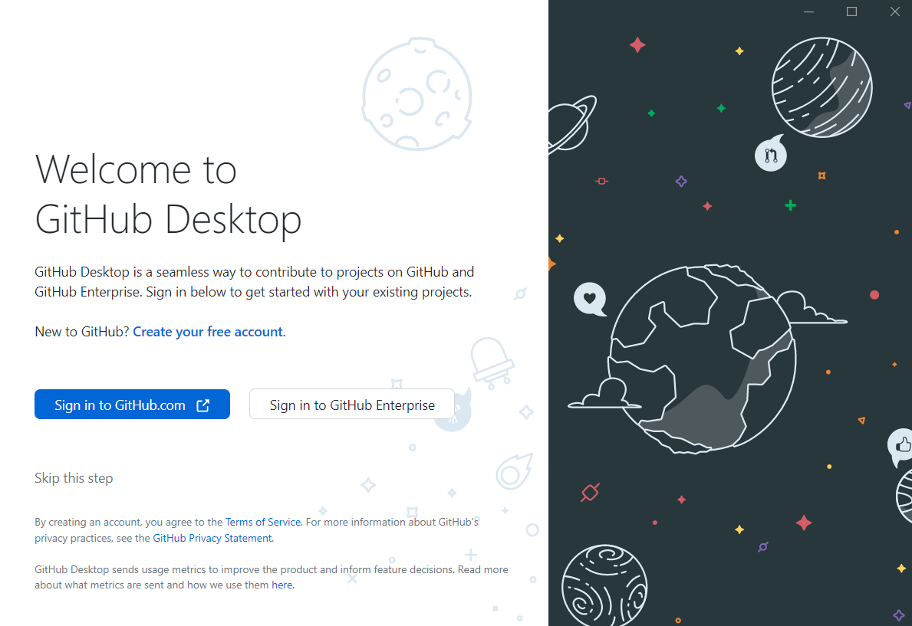
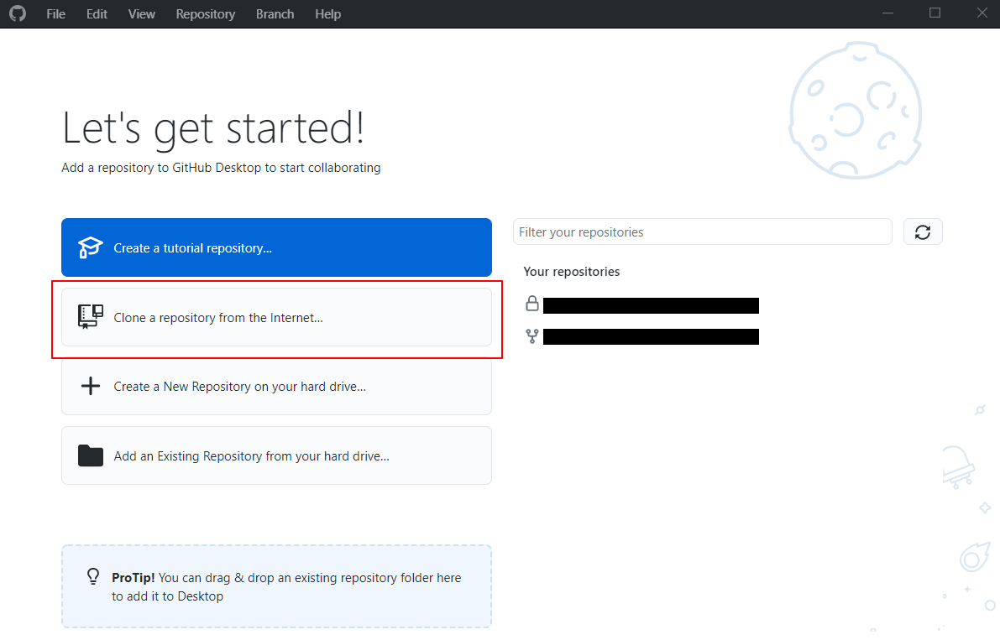
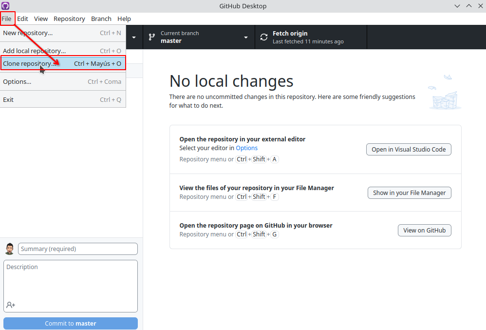
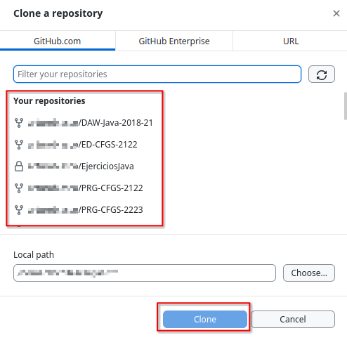
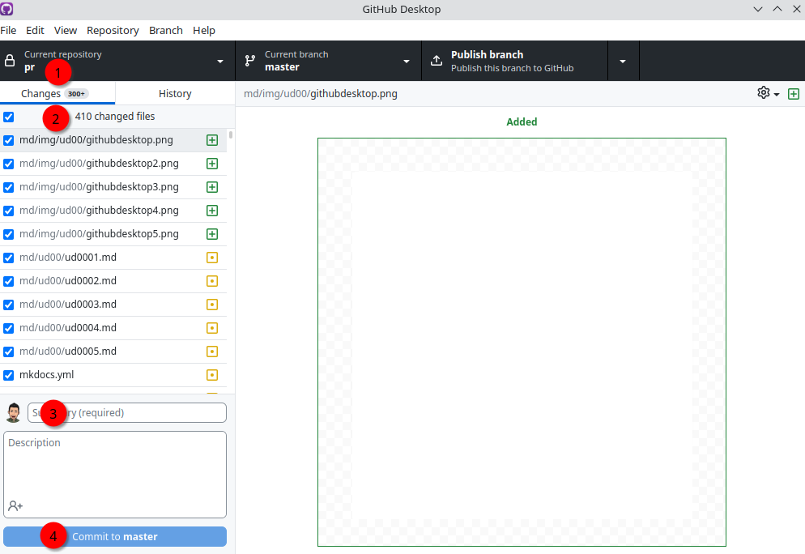
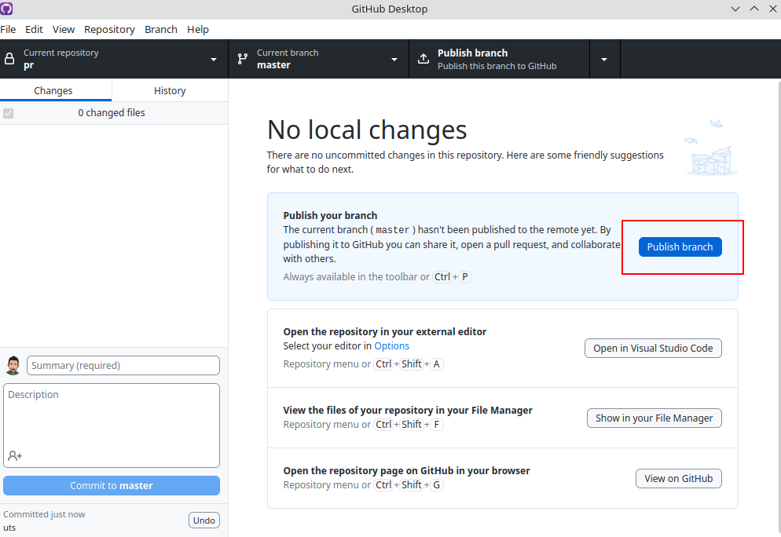

# 0.5 Github Desktop

## 1. GitHub Desktop

**GitHub Desktop** es una aplicación gratuita de código abierto que ayuda a trabajar con código hospedado en GitHub u otros servicios de hospedaje de *Git*. Con *GitHub Desktop*, puedes realizar comandos de *Git*, como confirmar e insertar cambios, en una interfaz gráfica de usuario, en lugar de mediante la línea de comandos.

Más información en [Acerca de GitHub de escritorio](https://docs.github.com/es/desktop/installing-and-configuring-github-desktop/overview/about-github-desktop).

### 1.1. Instalación GitHub Desktop

Descarga de la página oficial de [GitHub Desktop](https://desktop.github.com/).

Descarga el instalable en función del sistema operativo en el que estés.

### 1.2. Inicio de sesión

Después de la instalación puedes iniciar sesión con tu cuenta de GitHub. Para ello, primero se te redirigirá a la página web oficial de GitHub, donde podrás introducir tus datos de acceso.

Seguidamente, tienes que **autorizar GitHub Desktop** para que la aplicación acceda mediante tu cuenta y a tus repositorios. Para ello, haz clic en el botón “*Authorize desktop*”.

Una vez se te haya redirigido a *GitHub Desktop*, puedes completar el proceso de inicio de sesión introduciendo un nombre de cuenta y una dirección de correo electrónico o transfiriendo los datos correspondientes desde tu cuenta de GitHub. Al hacer clic en el botón “*Finish*”, accederás a la interfaz de usuario de *GitHub Desktop*.

Ahora podemos clonar nuestro repositorio de *GitHub* en uno local:

Elegimos, de nuestro repositorios remotos en *GitHub*, el que queremos clonar; y pulsamos "*Clone*":

Cuando esté clonado nuestro repositorio (*punto 1*) podremos observar si existen modificaciones a *subir* a nuestro repositorio remoto (*punto 2*). Si es así, ponemos un nombre a nuestro *commit* (*punto 3*) y pulsamos "*Commit to master*" (*punto 4*). En este momento tenemos el *commit* realizado en nuestro repositorio local; listo para actualizar al repositorio remoto en *GitHub*.

Para subir este(os) *commits* a remoto, pulsaremos el botón "*Publish branch*", y el cambio estará listo en el repositorio de *GitHub*:

