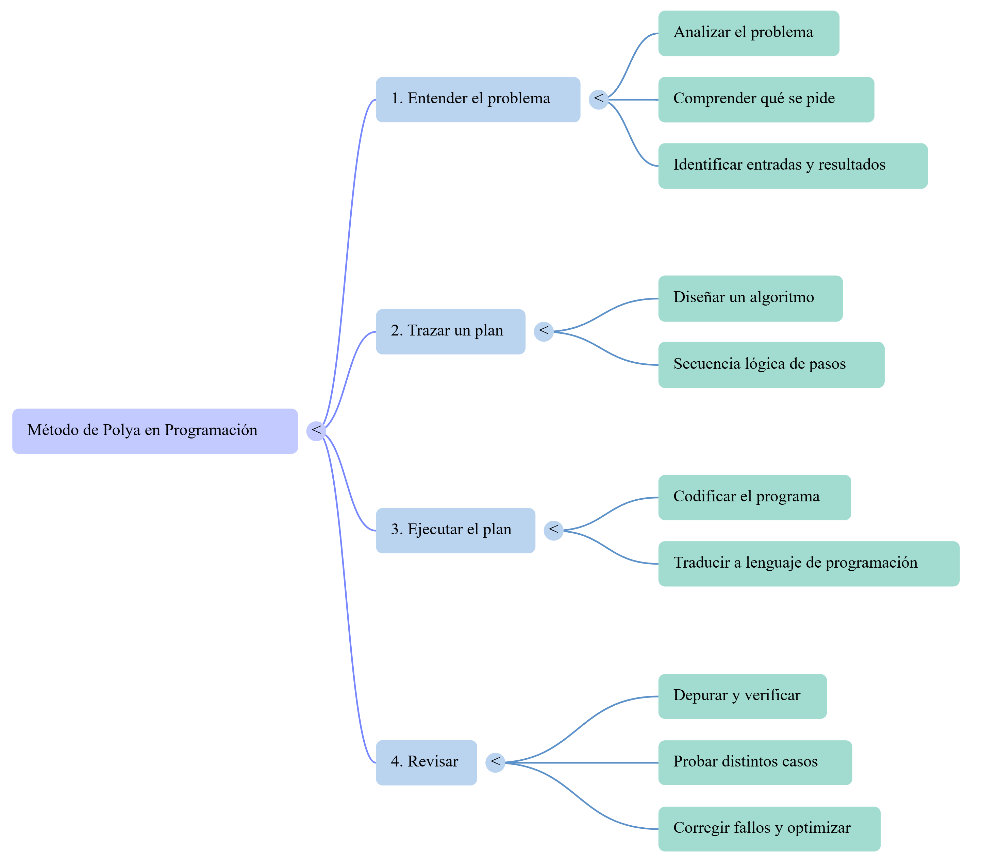
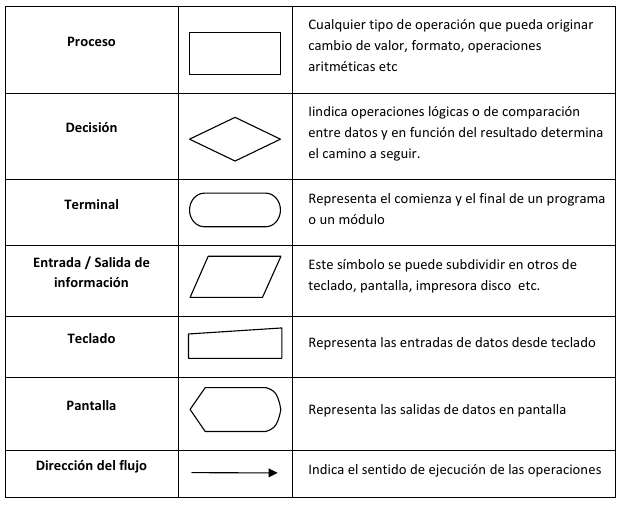
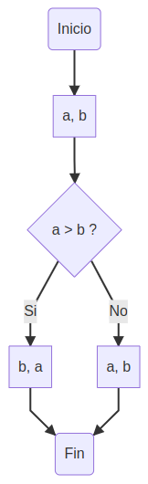
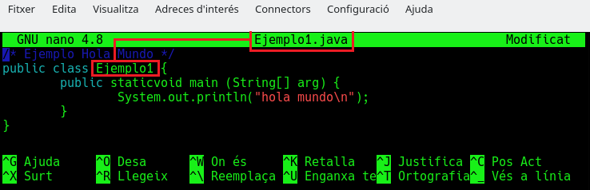
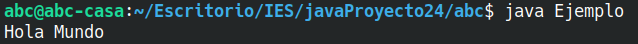
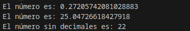
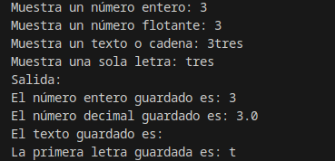
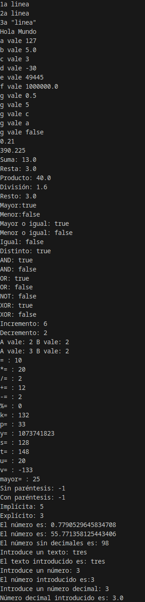
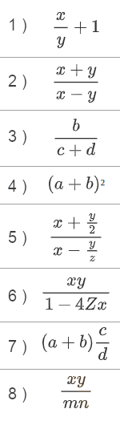
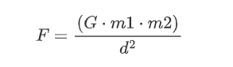

# ☕ UT1 — Estructura de Programas Informáticos en Java

> **📌 Informació Curricular de la Unitat (UT1)**
> **Resultat d'Aprenentatge:** RA1. Reconoce la estructura de un programa informático, identificando y relacionando los elementos propios del lenguaje de programación utilizado.
>
> **Índex ràpid d'apartats en aquesta pàgina:**
>
> - [**1.0 RA y Criterios de Evaluación**](#ut01ras) — [*(Obrir apartat individual)*](./ut01ras.md)
> - [**1.1 Piensa como un programador y diseña algoritmos**](#ut0101) — [*(Obrir apartat individual)*](./ut0101.md)
> - [**1.2 El lenguaje Java**](#ut0102) — [*(Obrir apartat individual)*](./ut0102.md)
> - [**1.3 Variables, identificadores y convenciones (Clean Code)**](#ut0103) — [*(Obrir apartat individual)*](./ut0103.md)
> - [**1.4 Tipos de datos primitivos**](#ut0104) — [*(Obrir apartat individual)*](./ut0104.md)
> - [**1.5 Operadores y expresiones (incl. Operador Ternario ? :)**](#ut0105) — [*(Obrir apartat individual)*](./ut0105.md)
> - [**1.6 Conversiones de tipo (Casting)**](#ut0106) — [*(Obrir apartat individual)*](./ut0106.md)
> - [**1.7 Comentarios y documentación**](#ut0107) — [*(Obrir apartat individual)*](./ut0107.md)
> - [**1.8 Herramientas útiles y E/S por consola**](#ut0108) — [*(Obrir apartat individual)*](./ut0108.md)
> - [**Ejemplos guiados UT1**](#ut01ejemplos) — [*(Obrir apartat individual)*](./ut01ejemplos.md)
> - [**Actividades prácticas UT1**](#ut01actividades) — [*(Obrir apartat individual)*](./ut01actividades.md)
> - [**Retos de programación UT1**](#ut01retos) — [*(Obrir apartat individual)*](./ut01retos.md)
> - [**Trazas de ejecución UT1**](#ut01trazas) — [*(Obrir apartat individual)*](./ut01trazas.md)
> - [**Proyecto Intermodular UT1**](#ut01pi) — [*(Obrir apartat individual)*](./ut01pi.md)

---

# RA 1 - Reconoce la estructura de un programa informático, identificando y relacionando los elementos propios del lenguaje de programación utilizado.

| Criterio de Evaluación | Apartado |
| --- | --- |
| a) Se han identificado los bloques que componen la estructura de un programa informático. | [1.1 Piensa como un programador y diseña algoritmos](./ut0101.md) [1.2 Java](./ut0102.md) |
| b) Se han creado proyectos de desarrollo de aplicaciones. | A lo largo de toda la UT |
| c) Se han utilizado entornos integrados de desarrollo. | A lo largo de toda la UT |
| d) Se han identificado los distintos tipos de variables y la utilidad específica de cada uno. | [1.3 Identificadores, constantes y variables](./ut0103.md) [1.4 Tipos de datos](./ut0104.md) |
| e) Se ha modificado el código de un programa para crear y utilizar variables. | [1.3 Identificadores, constantes y variables](./ut0103.md) [1.4 Tipos de datos](./ut0104.md) |
| f) Se han creado y utilizado constantes y literales. | [1.3 Identificadores, constantes y variables](./ut0103.md) [1.4 Tipos de datos](./ut0104.md) |
| g) Se han clasificado, reconocido y utilizado en expresiones los operadores del lenguaje. | [1.5 Operadores y expresiones](./ut0105.md) |
| h) Se ha comprobado el funcionamiento de las conversiones de tipo explícitas e implícitas. | [1.6 Conversiones de tipo](./ut0106.md) |
| i) Se han introducido comentarios en el código. | A lo largo de toda la UT |

---

# 1.1 Piensa como un programador y diseña algoritmos

## 1. Piensa como un programador y diseña algoritmos

La **programación** es, en esencia, una forma sistemática de resolver **problemas** mediante ordenadores. Para que un problema sea resoluble por una computadora, debe poder expresarse de forma mecánica y automática, sin ambigüedades.

---

### 1.1. Resolución de Problemas: El Método de Polya

El matemático George Polya formuló un método heurístico de cuatro operaciones mentales para resolver problemas, el cual se alinea perfectamente con las fases de desarrollo de software:

| Fase del Método de Polya | Operación en Programación | Objetivo principal |
| --- | --- | --- |
| **1. Entender el problema** | **Analizar el problema** | Comprender qué se pide, identificar datos de entrada y resultados esperados. |
| **2. Trazar un plan** | **Diseñar un algoritmo** | Encontrar una secuencia lógica de pasos para resolver el problema. |
| **3. Ejecutar el plan** | **Codificar el programa** | Traducir el algoritmo diseñado a un lenguaje de programación (ej. Java). |
| **4. Revisar** | **Depurar y verificar** | Probar el programa con distintos casos para corregir fallos y optimizarlo. |



---

### 1.2. ¿Qué es un Algoritmo?

Un **algoritmo** es un conjunto de pasos o instrucciones lógicas, ordenadas y acotadas, diseñadas para resolver un problema o realizar una tarea.

> **📌 Ejemplo**
> Un ejemplo de un algoritmo clásico y sencillo de la vida cotidiana son los pasos a seguir para desayunar:
>
> ```java
> Inicio
>     Sentarse en la mesa
>     Servir café con leche y azúcar
>     Si tengo tiempo Entonces
>         Mientras tenga apetito Hacer
>             Untar mantequilla y mermelada en una tostada
>             Comer la tostada
>         Fin Mientras
>     Fin Si
>     Beber café con leche
>     Levantarse
> Fin
> ```

#### 1.2.1. Características Fundamentales de un Algoritmo

- **Generalidad:** Debe servir para resolver cualquier caso del problema (usando variables), no solo uno concreto.
- **Finitud:** Debe terminar obligatoriamente tras un número determinado de pasos.
- **Definibilidad:** Cada paso debe ser claro y no dar pie a dobles interpretaciones (sin ambigüedades).
- **Eficiencia:** Debe resolver el problema consumiendo el mínimo tiempo y recursos posibles.

---

### 1.3. Representación de Algoritmos

Los algoritmos son **independientes de los lenguajes de programación** y del hardware. Para diseñarlos antes de programar, se utilizan principalmente dos métodos estructurados:

#### 1.3.1. Pseudocódigo

Es un lenguaje descriptivo intermedio entre el lenguaje humano y el de programación, ideal para estructurar la lógica sin preocuparse por la sintaxis estricta del compilador.

> **📌 Ejemplo: Mostrar dos números ordenados de menor a mayor:**
> ```java
> Inicio
>     Leer (A, B)
>     Si (A > B) Entonces
>         Escribir (B, A)
>     SiNo
>         Escribir (A, B)
>     FinSi
> Fin
> ```

#### 1.3.2. Diagrama de Flujo

Es una representación gráfica que utiliza símbolos estándar conectados por flechas (líneas de flujo) para indicar la secuencia de operaciones:



> **📌 Ejemplo: Mostrar dos números ordenados de menor a mayor:**
> 

---

### 1.4. Algoritmos frente a Programas

La diferencia fundamental es que un **algoritmo** es la lógica abstracta de solución, mientras que un **programa** es la plasmación física de dicho algoritmo escrita en un lenguaje de programación específico para que la computadora pueda ejecutarlo.

Cuando un problema es complejo, aplicamos la estrategia de **"Divide y vencerás"** con dos variantes:

- **Diseño descendente (Top-Down):** Descomponer un problema grande en subproblemas más sencillos.
- **Diseño modular:** Resolver cada subproblema de forma independiente mediante módulos o subprogramas para luego integrarlos.

---

# 1.2 Java

## 1. ¿Qué y cómo es Java?

Java es un lenguaje sencillo de aprender, con una sintaxis parecida a la de C++, pero en la que se han eliminado elementos complicados y que pueden originar errores. Java es un lenguaje orientado a objetos, con lo que elimina muchas preocupaciones al programador y permite la utilización de gran cantidad de bibliotecas ya definidas, evitando reescribir código que ya existe. Es un lenguaje de programación creado para satisfacer nuevas necesidades que los lenguajes existentes hasta el momento no eran capaces de solventar.

Una de las principales virtudes de Java es su independencia del hardware, ya que el código que se genera es válido para cualquier plataforma. Este código será ejecutado sobre una máquina virtual denominada Maquina Virtual Java (*MVJ* o *JVM* – *Java Virtual Machine*), que interpretará el código convirtiéndolo a código específico de la plataforma que lo soporta. De este modo el programa se escribe una única vez y puede hacerse funcionar en cualquier lugar. Lema del lenguaje: "*Write once, run everywhere*".

Antes de que apareciera Java, el lenguaje C era uno de los más extendidos por su versatilidad. Pero cuando los programas escritos en C aumentaban de volumen, su manejo comenzaba a complicarse. Mediante las técnicas de programación estructurada y programación modular se conseguían reducir estas complicaciones, pero no era suficiente.

Fue entonces cuando la Programación Orientada a Objetos (*POO*) entra en escena, aproximando notablemente la construcción de programas al pensamiento humano y haciendo más sencillo todo el proceso. Los problemas se dividen en objetos que tienen propiedades e interactúan con otros objetos, de este modo, el programador puede centrarse en cada objeto para programar internamente los elementos y funciones que lo componen.

Las características principales de lenguaje Java se resumen a continuación:

- El código generado por el compilador Java es independiente de la arquitectura.
- Está totalmente orientado a objetos.
- Su sintaxis es similar a C y C++.
- Es distribuido, preparado para aplicaciones TCP/IP.
- Dispone de un amplio conjunto de bibliotecas.
- Es robusto, realizando comprobaciones del código en tiempo de compilación y de ejecución.
- La seguridad está garantizada, ya que las aplicaciones Java no acceden a zonas delicadas de memoria o de sistema. (*ejem, ejem!*).

## 2. Estructura y Bloques Fundamentales de un Programa Java

En Java, toda instrucción ejecutable se organiza en clases y métodos.

> **📌 Ejemplo: HolaMundo**
> Veamos el clásico ejemplo para mostrar un saludo por consola:
>
> Código Java
>
> 📋 Copiar
> JAVA
>
> `public class HolaMundo {
>  // Punto de entrada: el método main es lo primero que ejecuta Java
>  public static void main(String[] args) {
>  /* Muestra el mensaje por pantalla e introduce 
>  un salto de línea al final */
>  System.out.println("Hola Mundo!");
>  }
> }`

- **Clase (`public class HolaMundo`):** En Java, el nombre de la clase pública debe coincidir exactamente con el nombre del archivo ( `HolaMundo.java` ).
- **Método `main`:** Es el punto de inicio obligatorio de cualquier aplicación Java estándar.
- **Instrucciones:** Todas las sentencias y llamadas a métodos terminan obligatoriamente con punto y coma ( `;` ).

### 2.1. Sangrado o Indentación

La indentación consiste en dejar una sangría en el margen izquierdo de cada línea dentro de un bloque `{ ... }`. Esto mejora drásticamente la lectura del código.

- Se recomienda usar entre **2 y 4 espacios** (o un tabulador).
- Se aconseja limitar el ancho de las líneas de código a unos **70-90 caracteres** para que quepan completas en cualquier pantalla o editor sin necesidad de scroll horizontal.

## 3. Compilar y ejecutar un programa Java. Uso de la consola.

Veamos los pasos para compilar e interpretar nuestro primer programa escrito en lenguaje Java:

Paso 1. Creación del código fuente --> Paso 2. Compilación del programa --> Paso 3. Ejecución del programa.

### Paso 1: Creación del código fuente

Abrimos un editor de texto (da igual cual sea, siempre que sea capaz de almacenar “texto sin formato” en código ASCII). Una vez abierto escribiremos nuestro primer programa, que mostrará un texto “Hola Mundo” en la consola. De momento no te preocupes si no entiendes lo que escribes, más adelante le daremos sentido. Ahora solo queremos ver si podemos ejecutar java en nuestro equipo.

El código de nuestro programa en Java será el siguiente:

```java
/* Ejemplo Hola Mundo */
public class HolaMundo {
    public static void main(String[ ] arg) {
        System.out.println("Hola Mundo");
    }
}
```

A continuación guardamos nuestro archivo y le ponemos como nombre `HolaMundo.java`. Debemos seguir una norma dictada por Java, **hemos de hacer coincidir nombre del archivo y nombre del programa**, tanto en mayúsculas como en minúsculas, y la extensión del archivo habrá de ser siempre `.java`.



> **📌 **
> Debemos recordar exactamente la ruta donde guardamos el archivo de ejemplo `HolaMundo.java`.

### Paso 2: Compilación del programa

Vamos a proceder a compilar e interpretar este pequeño programa Java (no te preocupes si todavía no entiendes el significado de las palabras compilar e interpretar, lo verás en el módulo de *Entornos de Desarrollo*). Para ello usaremos la consola. Una vez en la consola debemos colocarnos en la ruta donde previamente guardamos el archivo `HolaMundo.java`.

A continuación daremos la instrucción para que se realice **el proceso de compilación del programa**, para lo que escribiremos `javac HolaMundo.java`, donde `javac` es el nombre del compilador (***java c**ompiler*) que transformará el programa que hemos escrito nosotros en lenguaje Java al lenguaje de la máquina virtual Java (`bytecode`), dando como resultado un nuevo archivo `HolaMundo.class` que se creará en este mismo directorio. Comprueba que no aparezca ningún error y que javac esté instalado en tu sistema (desde la consola lo puedes comprobar con el comando `javac --version` y debería aparece el número de versión que tienes instalada). Si aparecen los dos archivos tanto `HolaMundo.java` (código fuente) como `HolaMundo.class` (bytecode creado por el compilador) puedes continuar.

```bash
$ javac HolaMundo.java
```

### Paso 3: Ejecución del programa

Finalmente, vamos a pedirle al intérprete que ejecute el programa, es decir, que transforme el código de la máquina virtual Java en código máquina interpretable por nuestro ordenador y lo ejecute. Para ello escribiremos en la ventana consola: `java HolaMundo`.

El resultado será que se nos muestra la cadena `Hola Mundo`. Si logramos visualizar este texto en pantalla, ya hemos desarrollado nuestro primer programa en Java.

sh

Resultado
```bash
$ java HolaMundo
```


---

# 1.3 Variables, identificadores, convenciones

## 1. Variables

Una **variable** es un espacio reservado en la memoria del ordenador que tiene un nombre, un tipo y un valor. Gracias a ella, el programa puede guardar datos y recuperarlos más adelante.

Toda variable queda definida por tres características:

| Característica | Descripción |
| --- | --- |
| **Nombre** (identificador) | Permite referenciar la variable en el código |
| **Tipo de dato** | Indica qué clase de información almacena (`int`, `double`, `String`…) |
| **Valor** | El dato concreto guardado en ese momento |

> **📌 Ejemplo**
> ```java
> int edad = 17;          // nombre: edad       |  tipo: int     |  valor: 17
> String nombre = "Ana";  // nombre: nombre     |  tipo: String  |  valor: "Ana"
> double precio = 9.99;   // nombre: precio     |  tipo: double  |  valor: 9.99
> ```

### 1.1.Ámbito (scope) de una variable

El **ámbito** o **scope** es la zona del código donde una variable es accesible. En Java, una variable declarada dentro de un bloque `{ }` solo existe dentro de ese bloque.

> **📌 Ejemplo**
> ```java
> public static void main(String[] args) {
>     int x = 10;          // x es accesible en todo el método main
>
>     if (x > 5) {
>         int y = 20;      // y solo existe dentro de este bloque if
>         System.out.println(x + y); // correcto
>     }
>
>     System.out.println(y); // ERROR: y no existe aquí
> }   
> ```

---

## 2. Constantes

Una **constante** es como una variable, pero su valor **no puede cambiar** una vez asignado. Se usa para datos fijos que deben permanecer igual durante toda la ejecución del programa.

En Java se declaran con la palabra clave `final`:

> **📌 Ejemplo**
> ```java
> final double PI = 3.14159;
> final int TAM_MAX = 100;
> final String MENSAJE_ERROR = "Operación no permitida";
> ```

Si intentamos cambiar su valor, el compilador lo impide:

> **📌 Ejemplo**
> ```java
> final int MAX = 50;
> MAX = 60;   // ERROR: no se puede reasignar una constante
> ```

### 2.1. ¿Cuándo usar una constante en lugar de una variable?

- Cuando el valor **nunca debe cambiar** (el valor de π, un límite máximo, un código de error, etc.)
- Para evitar escribir el mismo número "mágico" en varios sitios del código.
- Para que el código sea **más legible** : `TAM_MAX` comunica más que un `100` suelto.

> **📌 Ejemplo**
> ```java
> // Sin constante — ¿qué significa 365?
> int diasAnio = dias * 365;
>
> // Con constante — queda claro y no puede cambiar por error
> final int DIAS_POR_ANIO = 365;
> int diasAnio = dias * DIAS_POR_ANIO;
> ```

---

## 3. Identificadores

Un **identificador** es el nombre que le damos a un elemento del programa: una variable, una constante, una clase, un método, etc.

### 3.1. Reglas obligatorias en Java

Para que un identificador sea válido, debe cumplir estas reglas sin excepción:

- Solo puede contener **letras, dígitos, `_` y `$`** .
- Debe **empezar por una letra** , `_` o `$` (nunca por un dígito).
- **No puede contener espacios** .
- **Distingue mayúsculas de minúsculas** : `edad` y `Edad` son identificadores distintos.
- **No puede coincidir con una palabra reservada** de Java ( `int` , `class` , `for` , etc.)

| Identificador | ¿Válido? | Motivo |
| --- | --- | --- |
| `numAlumnos` | ✅ | Correcto |
| `_contador` | ✅ | Empieza por `_` |
| `3errores` | ❌ | Empieza por dígito |
| `mi variable` | ❌ | Contiene espacio |
| `class` | ❌ | Es palabra reservada |
| `$precio` | ✅ | Técnicamente válido (no recomendado) |

> **Nota sobre Unicode:** Java acepta letras de cualquier alfabeto (griego, árabe, etc.), por lo que identificadores como `ατη` son válidos. En la práctica, se usan siempre letras del alfabeto latino para garantizar compatibilidad.

---

## 4. Convenciones de nombrado

Las convenciones no son obligatorias, pero **todo el mundo las sigue** en Java. Respetarlas hace el código más legible y profesional.

### 4.1. lowerCamelCase — variables y métodos

Empieza en **minúscula**. Cada palabra siguiente comienza en mayúscula. Sin guiones ni espacios.

> **📌 Ejemplo**
> ```java
> // Variables
> int numAlumnos;
> double precioFinal;
> String nombreCompleto;
>
> // Métodos
> void calcularMedia() { ... }
> int obtenerEdad() { ... }
> ```

### 4.2. UpperCamelCase — clases

Empieza en **mayúscula**. Igual que el anterior pero la primera letra también va en mayúscula.

> **📌 Ejemplo**
> ```java
> class Alumno { ... }
> class CuentaBancaria { ... }
> class GestorDeArchivos { ... }
> ```

### 4.3. UPPER_SNAKE_CASE — constantes

Todo en **mayúsculas**, palabras separadas por `_`.

**Todas las constantes deben seguir esta nomenclatura**

> **📌 Ejemplo**
> ```java
> final int TAM_MAX = 100;
> final double PI = 3.14159;
> final String RUTA_FICHERO = "/datos/alumnos.txt";
> ```

### 4.4. Comparativa: bien vs. mal

| Nombre no correcto | Nombre correcto | Tipo |
| --- | --- | --- |
| `x` | `edadAlumno` | variable |
| `Cl33` | `fichaCliente` | variable |
| `METODO` | `calcularMedia` | método |
| `mi_clase` | `GestorAlumnos` | clase |
| `maximo` | `VALOR_MAXIMO` | constante |

> **Regla de oro:** el nombre debe dejar claro **qué contiene o qué hace**, sin necesidad de leer el resto del código.

---

## 5. Palabras reservadas

Las **palabras reservadas** (*keywords*) son términos que Java usa internamente. **No se pueden usar como identificadores**.

Están organizadas por categoría para que sea más fácil memorizarlas:

| Categoría | Palabras |
| --- | --- |
| **Tipos de dato** | `boolean`, `byte`, `char`, `double`, `float`, `int`, `long`, `short` |
| **Control de flujo** | `if`, `else`, `switch`, `case`, `default`, `for`, `while`, `do`, `break`, `continue`, `return` |
| **Clases y objetos** | `class`, `interface`, `extends`, `implements`, `new`, `this`, `super`, `instanceof`, `enum` |
| **Modificadores** | `public`, `private`, `protected`, `static`, `final`, `abstract`, `synchronized`, `volatile`, `transient`, `strictfp`, `native` |
| **Gestión de errores** | `try`, `catch`, `finally`, `throw`, `throws` |
| **Paquetes** | `package`, `import` |
| **Otros** | `void`, `const`*, `goto`*, `assert` |

> **📌 Ejemplo de error frecuente**
> ```java
> int class = 5;      // ERROR: 'class' es palabra reservada
> int for = 10;       // ERROR: 'for' es palabra reservada
>
> int miClase = 5;    // correcto
> int contador = 10;  // correcto
> ```

---

# 1.4 Tipos de datos

## 1. Tipos de datos primitivos

Los tipos de datos se utilizan para declarar variables y que el compilador sepa de antemano qué tipo de información contendrá la variable.

Java dispone de los siguientes tipos de datos simples:

| **Tipo** | **Representación** | **Rango de valores** | **Valor por defecto** | **Clase asociada** | **Ejemplo de declaración** |
| --- | --- | --- | --- | --- | --- |
| `byte` | Entero con signo | -128 a 127 | 0 | `Byte` | `byte a;` |
| `short` | Entero con signo | -32.768 a 32.767 | 0 | `Short` | `short b, c = 3;` |
| `int` | Entero con signo | -2.147.483.648 a 2.147.483.647 | 0 | `Integer` | `int d = -30;` `int e = 0xC125; // 0x indica hexadecimal` |
| `long` | Entero con signo | -9,2×1018 a 9,2×1018 | 0 | `Long` | `long b = 46240;` `long b = 5L; // la L indica que es long` |
| `float` | Decimal precisión simple | -3,4×10-38 a 3,4×1038 | 0.0 | `Float` | `float pi = 3.14F; // la F indica float` |
| `double` | Decimal precisión doble | -1,8×10-308 a 1,8×10308 | 0.0 | `Double` | `double millon = 1e6;` `double z = .123; // la parte entera 0 se puede omitir` |
| `char` | Carácter Unicode | `\u0000` a `\uFFFF` | `\u0000` | `Character` | `char car1 = 'c';` `char car2 = 99; // 'c' equivale al ASCII 99` `char letra = '\u0063'; // código unicode de 'c'` |
| `boolean` | Dato lógico | `true` o `false` | `false` | `Boolean` | `boolean primero;` `boolean par = false;` |

### 1.2. Inicialización: variables locales vs. globales

> **📌 Variables locales vs. globales**
> Variable local (debe inicializarse)
>
> Variable global (tiene valor por defecto)
> ```java
> public class ClaseEjemplo {
>     public static void main(String[] args) {
>         int a;
>         System.out.println(a); // ERROR: variable local no inicializada
>     }
> }
> ```
> ```java
> public class ClaseEjemplo {
>     static int a; // atributo de clase → valor por defecto: 0
>     public static void main(String[] args) {
>         System.out.println(a); // correcto: imprime 0
>     }
> }
> ```

---

## 2. Tipos referenciados

A partir de los ocho tipos primitivos, Java permite construir otros tipos más complejos llamados **tipos referenciados**. En lugar de almacenar el dato directamente, estas variables guardan la **dirección de memoria** donde se encuentra el dato.

Los tipos referenciados más habituales son:

| Tipo | Descripción |
| --- | --- |
| **Arrays** | Lista de elementos del mismo tipo (`int[]`, `String[]`…) |
| **Objetos** | Instancias de clases (`Cuenta`, `Alumno`…) |
| **String** | Cadena de texto (tratada de forma especial por Java) |
| Colecciones | `List`, `Map`, `Set`… (se verán en unidades posteriores) |

> **📌 Declaración de tipos referenciados**
> ```java
> int[] arrayDeEnteros;   // referencia a un array de enteros
> Cuenta cuentaCliente;   // referencia a un objeto de tipo Cuenta
> ```

### 2.1. El tipo `String`

Aunque técnicamente es un objeto (tipo referenciado), Java lo trata de forma especial: puede usarse **como si fuera un tipo primitivo**.

> **📌 El tipo String**
> ```java
> String mensaje = "El primer programa";
> String nombre = "Ana";
> int longitud = nombre.length(); // los String tienen métodos propios
> ```

### 2.2. Mostrar datos por pantalla

Para mostrar valores por consola se usa `System.out`:

| Método | Comportamiento |
| --- | --- |
| `System.out.print(…)` | Muestra el texto **sin** salto de línea al final |
| `System.out.println(…)` | Muestra el texto **con** salto de línea al final |

> **📌 Mostrar datos por pantalla**
> ```java
> String nombre = "Ana";
> int edad = 17;
>
> System.out.print("Nombre: ");
> System.out.println(nombre);         // Nombre: Ana
> System.out.println("Edad: " + edad); // Edad: 17
> ```

---

## 3. Tipos enumerados (`enum`)

Los tipos enumerados permiten declarar una variable que solo puede tomar un conjunto **restringido y predefinido** de valores. Son útiles cuando hay un número fijo de opciones posibles (días de la semana, estaciones, estados…).

Se declaran con la palabra clave `enum`:

> **📌 Declaración de tipos enumerados**
> ```java
> public enum Dia { Lunes, Martes, Miercoles, Jueves, Viernes, Sabado, Domingo }
> ```

Los valores del enum son constantes, por eso se escriben en `UpperCamelCase` o, según el contexto, en `MAYUSCULAS`.

### 3.1. Uso básico

> **📌 Ejemplo de tipos enumerados**
> Java
>
> Resultado
> ```java
> public class TiposEnumerados {
>     public enum Dia { Lunes, Martes, Miercoles, Jueves, Viernes, Sabado, Domingo }
>
>     public static void main(String[] args) {
>         Dia diaActual   = Dia.Martes;
>         Dia diaSiguiente = Dia.Miercoles;
>
>         System.out.println("Hoy es: " + diaActual);
>         System.out.println("Mañana es: " + diaSiguiente);
>     }
> }
> ```
> ```java
> Hoy es: Martes
> Mañana es: Miercoles
> ```

Para acceder a un valor del enum se usa `NombreEnum.Valor`. El compilador controla que solo se asignen valores válidos, evitando errores en tiempo de ejecución.

> **Nota:** En Java un `enum` no es un simple listado — tiene el mismo tratamiento que una clase, por lo que puede incluir métodos, constructores y atributos propios. Lo veremos en unidades más avanzadas.

---

## 4. Literales

Un **literal** es un valor concreto escrito directamente en el código. Puede ser de cualquier tipo primitivo, `null` o `String`.

> **📌 Ejemplos de literales**
> ```java
> int edad       = 17;          // literal entero
> double precio  = 9.99;        // literal decimal
> char letra     = 'A';         // literal carácter
> boolean activo = true;        // literal booleano
> String texto   = "Hola";      // literal String
> Object obj     = null;        // literal nulo
> ```

---

## 5. Secuencias de escape

Dentro de un literal de tipo `char` o `String` hay caracteres que no se pueden escribir directamente (salto de línea, tabulador, comillas…). Para representarlos se usan **secuencias de escape**, que empiezan siempre con `\`:

| Secuencia | Significado |
| --- | --- |
| `\n` | Salto de línea |
| `\t` | Tabulador horizontal |
| `\r` | Retorno de carro |
| `\\` | Barra diagonal inversa (`\`) |
| `\"` | Comillas dobles (`"`) |
| `\'` | Comillas simples (`'`) |
| `\b` | Retroceso (*backspace*) |
| `\f` | Salto de página |
| `\uXXXX` | Carácter Unicode (p. ej. `\u0041` = `'A'`) |

> **📌 Ejemplo de uso**
> ```java
> System.out.println("Línea 1\nLínea 2");   // salto de línea
> System.out.println("Col1\tCol2\tCol3");   // columnas con tabulador
> System.out.println("Dice: \"Hola\"");     // comillas dentro de String
> char barra = '\\';                        // el carácter \
> ```

---

# 1.5 Operadores y expresiones

## 1. Operadores Aritméticos

Los **Operadores Aritméticos** permiten realizar operaciones matemáticas:

| Operador | Uso | Operación |
| --- | --- | --- |
| + | A + B | Suma |
| - | A - B | Resta |
| * | A * B | Multiplicación |
| / | A / B | División |
| % | A % B | Módulo o resto de una división entera |

> **📌 Ejemplo:**
> ```java
> double num1, num2, suma, resta, producto, division, resto;
> num1 =8;
> num2 =5;
> suma = num1 + num2;      // 13
> resta = num1 - num2;     // 3
> producto = num1 * num2;  // 40
> division = num1 / num2;  // 1.6
> resto = num1 % num2;     // 3
> ```

## 2. Operadores Relacionales

Los **Operadores Relacionales** permiten evaluar *(la respuesta es un booleano: true o false)* la igualdad de los operandos:

| Operador | Uso | Operación |
| --- | --- | --- |
| < | A < B | A menor que B |
| > | A > B | A mayor que B |
| <= | A <= B | A menor o igual que B |
| >= | A >= B | A mayor o igual que B |
| != | A != B | A distinto de B |
| == | A == B | A igual a B |

> **📌 Por ejemplo:**
> ```java
> int valor1 = 10;
> int valor2 = 3;
> boolean compara;
> compara = valor1 > valor2;  // true
> compara = valor1 < valor2;  // false
> compara = valor1 >= valor2; // true
> compara = valor1 <= valor2; // false
> compara = valor1 == valor2; // false
> compara = valor1 != valor2; // true
> ```

## 3. Operadores Lógicos

Los **Operadores Lógicos** permiten realizar operaciones lógicas:

| Operador | Manejo | Operación |
| --- | --- | --- |
| && o & | A && B ó A & B | A AND B. El resultado será true si ambos operadores son true y false en caso contrario. |
| \|\| o \| | A \|\| B ó A \| B | A OR B. El resultado será false si ambos operandos son false y true en caso contrario |
| ! | !A | NOT A. Si el operando es true el resultado es false y si el operando es false el resultado es true. |
| ^ | A ^ B | A XOR B. El resultado será true si un operando es true y el otro false, y false en caso contrario. |

> **📌 Ejemplo:**
> ```java
> double sueldo = 1400;
> int edad = 34;
> boolean logica;
>
> logica = (sueldo>1000 & edad<40);   //true
> logica = (sueldo>1000 && edad>40);  //false
> logica = (sueldo>1000 | edad>40);   //true
> logica = (sueldo<1000 || edad>40);  //false
> logica = !(edad<40);                //false
> logica = (sueldo>1000 ^ edad>40);   //true
> logica = (sueldo<1000 ^ edad>40);   //false
> ```

Para representar resultados de operadores Lógicos también se pueden usar tablas de verdad a las que conviene acostumbrarse:

| A | B | A && B | A \|\| B | !A |
| --- | --- | --- | --- | --- |
| false | false | *false* | *false* | *true* |
| true | false | *false* | *true* | *false* |
| false | true | *false* | *true* | *true* |
| true | true | *true* | *true* | *false* |

> **📌 ¿ & o && ? ¿ | o || ?**
> Aunque producen el mismo resultado lógico, hay una diferencia clave en cómo los evalúa Java:
>
> | Operador | Nombre | Comportamiento |
> | --- | --- | --- |
> | `&&` | AND cortocircuito | Si el **primer operando es `false`**, Java **no evalúa el segundo** |
> | `&` | AND bit a bit | **Siempre evalúa los dos** operandos |
> | `\|\|` | OR cortocircuito | Si el **primer operando es `true`**, Java **no evalúa el segundo** |
> | `\|` | OR bit a bit | **Siempre evalúa los dos** operandos |
>
> **¿Por qué importa?** Con `&&` y `||` el programa es más eficiente y evita errores:
>
> ```java
> int[] numeros = null;
>
> // Con &  → ERROR: evalúa ambos lados aunque numeros sea null
> if (numeros != null & numeros.length > 0) { ... }
>
> // Con && → SEGURO: si numeros es null, no llega a mirar .length
> if (numeros != null && numeros.length > 0) { ... }
> ```
>
> **Regla práctica:** usa siempre `&&` y `||` para condiciones lógicas. Reserva `&` y `|` solo para operaciones a nivel de bits.

## 4. Operadores Unarios o Unitarios

Los **Operadores Unarios** o **Unitarios** permiten realizar incrementos y decrementos:

| Operador | Uso | Operación |
| --- | --- | --- |
| ++ | A++ o ++A | Incremento de A |
| -- | A-- o --A | Decremento de A |

> **📌 Ejemplo:**
> ```java
> int m = 5, n = 3;
> m++; // 6
> n--; // 2
> ```

> **📌 Prefijo (++A) vs. sufijo (A++)**
> La posición del operador cambia **cuándo** se aplica el incremento:
>
> - **Prefijo (`++A`)** → primero incrementa, luego usa el nuevo valor.
> - **Sufijo (`A++`)** → primero usa el valor actual, luego incrementa.
>
> ```java
> int A = 1, B;
>
> B = ++A;
> // Paso 1: A se incrementa → A vale 2
> // Paso 2: B recibe el valor de A → B vale 2
> // Resultado: A=2, B=2
>
> B = A++;
> // Paso 1: B recibe el valor ACTUAL de A → B vale 2
> // Paso 2: A se incrementa → A vale 3
> // Resultado: A=3, B=2
> ```

## 5. Operadores de Asignación

Los **Operadores de Asignación** permiten asignar valores:

| Operador | Uso | Operación |
| --- | --- | --- |
| = | A = B | Asignación (*como ya hemos visto*) |
| += | A += B | Suma y asignación. La operación A+=B equivale a A=A+B |
| -= | A -= B | Resta y asignación. La operación A-=B equivale a A=A-B |
| *= | A *= B | Multiplicación y asignación. La operación A*=B equivale a A=A*B |
| %= | A %= B | Módulo y asignación. La operación A%=B equivale a A=A%B |
| /= | A /= B | División y asignación. La operación A/=B equivale a A=A/B |

> **📌 Ejemplo:**
> ```java
> int dato1 = 10, dato2 = 2, dato;
> dato=dato1;   // dato vale 10
> dato2+=dato1; // dato2 vale 12
> dato2-=dato1; // dato2 vale 2
> dato2*=dato1; // dato2 vale 20
> dato2/=dato1; // datos2 vale 2
> dato1%=dato2; // dato1 vale0
> ```

> **📌 Prioridad de operadores**
> Los operadores tienen diferente Prioridad por lo que es interesante utilizar paréntesis para controlar las operaciones sin necesidad de depender de la prioridad de los operadores.

## 6. Operador condicional `?:`

El **operador condicional** `?:` sirve para evaluar una condición y devolver un resultado en función de si es verdadera o falsa dicha condición. Es el único operador ternario de Java, y como tal, necesita tres operandos para formar una expresión:

- El **primer operando** se sitúa a la izquierda del símbolo de interrogación, y siempre será una expresión booleana, también llamada **condición** .
- El **siguiente operando** se sitúa a la derecha del símbolo de interrogación y antes de los dos puntos, y es el valor que devolverá el operador condicional **si la condición es verdadera** .
- El **último operando** , que aparece después de los dos puntos, es la expresión cuyo resultado se devolverá **si la condición evaluada es falsa** .

```java
condición ? exp1 : exp2
```

> **📌 Ejemplo,  en la expresión:**
> ```java
> (x>y)?x:y;
> ```
>
> Se evalúa la condición de si x es mayor que y, en caso afirmativo se devuelve el valor de la variable x, y en caso contrario se devuelve el valor de y.

> **📌 Ejemplo para calcular qué número es mayor:**
> ```java
> int mayor, exp1 = 15, exp2 = 25;
> mayor=(exp1>exp2)?exp1:exp2;
> // mayor valdrá 25
> ```

### 6.1. Ternarios anidados e indentación (*Clean Code*)

Cuando necesitamos elegir entre **tres o más opciones**, podemos encadenar otro operador ternario después de los dos puntos (`:`). Para que el código sea legible y fácil de mantener, **nunca lo escribas en una sola línea larga**; indéntalo en varias líneas alineando los signos `?` y `:` como una escalera de decisión:

> **📌 ☕ Ejemplo de ternario anidado bien indentado:**
> ```java
> int numero = 0;
>
> // ❌ Mal: difícil de leer en una sola línea
> // String signo = (numero > 0) ? "Positivo" : (numero < 0) ? "Negativo" : "Cero";
>
> // ✅ Bien: indentado por niveles de decisión
> String signo = (numero > 0) ? "Positivo"
>              : (numero < 0) ? "Negativo"
>              : "Cero";
>
> System.out.println("El número es: " + signo);
> ```

> **✍️ Actividad: ClasificadorNotas (Entregar en Aules)**
> Escribe un programa en Java llamado `ClasificadorNotas.java` que pida al usuario una nota entera entre `0` y `10` por teclado (`Scanner`) y, **utilizando únicamente el operador ternario (`? :`)** (sin usar sentencias `if`), muestre por pantalla:
>
> 1. **Ternario simple:** Una variable `estado` que almacene `"Aprobado"` si la nota es mayor o igual a 5, o `"Suspendido"` en caso contrario.
> 2. **Ternario anidado (indentado en varias líneas):** Una variable `calificacion` que almacene:
>   - `"Insuficiente"` si la nota es menor que 5.
>   - `"Suficiente"` si es menor que 6.
>   - `"Bien"` si es menor que 7.
>   - `"Notable"` si es menor que 9.
>   - `"Sobresaliente"` en caso contrario.
>
> ```text
> Introduce tu nota (0-10): 7
> Estado: Aprobado
> Calificación: Notable
> ```
>
> **💡 Pista:** Si en el primer nivel ya has comprobado `nota < 5`, en el siguiente escalón (`:`) ya sabes que la nota es como mínimo 5, por lo que basta con evaluar `nota < 6`.
>
> **📥 Entrega:** Sube el archivo `ClasificadorNotas.java` a la tarea correspondiente en **Aules**.

El operador condicional se puede sustituir por la sentencia `if...then...else` que veremos más adelante.

## 7. Prevalencia de operadores

Los operadores tienen diferente **Prioridad** por lo que es interesante utilizar paréntesis para controlar las operaciones sin necesidad de depender de la prioridad de los operadores.

Prevalencia de operadores, ordenados de arriba a abajo de más a menos prioridad:

| Descripción | Operadores |
| --- | --- |
| operadores posfijos | op++ op-- |
| operadores unarios | ++op --op +op -op ~ ! |
| multiplicación y división | * / % |
| suma y resta | + - |
| desplazamiento | << >> >>> |
| operadores relacionales | < > <= => |
| equivalencia | == != |
| operador AND | & |
| operador XOR | ^ |
| operador OR | \| |
| AND booleano | && |
| OR booleano | \|\| |
| condicional | ?: |
| operadores de asignación | = += -= *= /= %= &= ^= \|= <<= >>= >>>= |

> **📌 Ejemplo:**
> ```java
> int x, y1 = 6, y2 = 2, y3 =8;
> x = y1 + y2 * y3;   // 22
> x = (y1 + y2) * y3; // 64
> ```

---

# 1.6 Conversiones de tipo

Existen dos tipos de conversiones: Implícitas y Explicitas. Debemos evitar las conversiones de tipos ya que pueden suponer perdidas de información.

## 1. Conversiones Implícitas

Las **Conversiones Implícitas** se realizan de forma automática y requiere que la variable destino tenga más precisión que la variable origen para poder almacenar el valor.

> **📌 Ejemplo:**
> ```java
> // Conversión Implícita
> byte origen = 5;
> short destino;
> destino=origen;  // 5
> ```

---

## 2. Conversión Explícita

En la **Conversión Explícita** el programador fuerza la conversión con la operación llamada "*cast*":

> **📌 Ejemplo1:**
> ```java
> // Conversión Explícita
> short origen2 = 3;
> byte destino2;
> destino2=(byte)origen2; // 3
> ```

> **📌 Ejemplo2:**
> ```java
> // Conversión Explícita
> int numero1 = 5, numero2 = 8;
> double division;
>
> division=(double)numero1 / (double)numero2; // Sin casting la expresión sería int y el valor de division sería 0
> ```

---

# 1.7 Comentarios

Los comentarios son muy importantes a la hora de describir qué hace un determinado programa. A lo largo de la unidad los hemos utilizado para documentar los ejemplos y mejorar la comprensión del código. Para lograr ese objetivo, es normal que cada programa comience con unas líneas de comentario que indiquen, al menos, una breve descripción del programa, el autor del mismo y la última fecha en que se ha modificado.

Todos los lenguajes de programación disponen de alguna forma de introducir comentarios en el código. En el caso de Java, nos podemos encontrar los siguientes tipos de comentarios:

- Comentarios de **una sola línea** . Utilizaremos el delimitador `//` para introducir comentarios de sólo una línea.

```java
// comentario de una sola línea
```

- Comentarios de **múltiples líneas** . Para introducir este tipo de comentarios, utilizaremos una barra inclinada y un asterisco ( `/*` ), al principio del párrafo y un asterisco seguido de una barra inclinada ( `*/` ) al final del mismo.

```java
/* Esto es un comentario
de varias líneas */
```

- Comentarios **Javadoc** . Utilizaremos los delimitadores `/**` y `*/` . Al igual que con los comentarios tradicionales, el texto entre estos delimitadores será ignorado por el compilador. Este tipo de comentarios se emplean para generar documentación automática del programa. A través del programa javadoc, incluido en JavaSE, se recogen todos estos comentarios y se llevan a un documento en formato .html.

```java
/** Comentario de documentación.
Javadoc extrae los comentarios del código y
genera un archivo html a partir de este tipo de comentarios
*/
```

---

# 1.8 Herramientas útiles

## 1. La librería Math

Java proporciona de forma nativa la clase **`Math`** (perteneciente al paquete `java.util`) para realizar operaciones matemáticas avanzadas, cálculo de potencias, raíces, redondeos y generación de números aleatorios.

---

### 1.1. Constantes matemáticas (`Math.PI` y la gravedad)

La clase `Math` incorpora constantes matemáticas fundamentales definidas con alta precisión (`double`):

- **`Math.PI`** : Número $\pi$ ($3.141592653589793\dots$).
- **`Math.E`** : Base de los logaritmos naturales o número de Euler ($2.718281828459045\dots$).

```java
// Ejemplo de uso de constantes:
System.out.println("Número PI: " + Math.PI);
System.out.println("Número E:  " + Math.E);

// Ejemplo: Conversión de grados sexagesimales a radianes (rad = grados * (PI / 180))
double grados = 180.0;
double radianes = grados * (Math.PI / 180.0);
System.out.println(grados + " grados equivalen a: " + radianes + " radianes");
```

---

### 1.2. Métodos matemáticos imprescindibles

| Método | Descripción | Ejemplo | Resultado |
| --- | --- | --- | --- |
| **`Math.pow(base, exp)`** | Eleva la `base` al `exponente`. Devuelve siempre un `double`. | `Math.pow(2, 3)` | `8.0` |
| **`Math.sqrt(x)`** | Calcula la raíz cuadrada de $x$. Devuelve `double`. | `Math.sqrt(25)` | `5.0` |
| **`Math.abs(x)`** | Devuelve el valor absoluto (elimina el signo negativo). | `Math.abs(-15)` | `15` |
| **`Math.max(a, b)`** | Devuelve el número mayor entre dos valores. | `Math.max(10, 20)` | `20` |
| **`Math.min(a, b)`** | Devuelve el número menor entre dos valores. | `Math.min(10, 20)` | `10` |
| **`Math.round(x)`** | Redondea al entero más próximo (al alza si el decimal es $\ge .5$). | `Math.round(4.6)` | `5` |
| **`Math.floor(x)`** | Redondea hacia abajo (suelo matemático). | `Math.floor(4.9)` | `4.0` |
| **`Math.ceil(x)`** | Redondea hacia arriba (techo matemático). | `Math.ceil(4.1)` | `5.0` |

> **💡 Casting con Math.pow()**
> Dado que `Math.pow()` devuelve siempre un valor de tipo `double`, si deseas guardar el resultado en una variable entera (`int`) deberás realizar un *cast* explícito:
>
> Código Java
>
> 📋 Copiar
> JAVA
>
> `int potencia = (int) Math.pow(2, 3); // 8`

---

### 1.3. Generación de números aleatorios (`Math.random`)

El método `Math.random()` genera un número decimal pseudoaleatorio de tipo `double` en el rango semiabierto **$[0.0, 1.0)$**, es decir, mayor o igual que `0.0` y estrictamente menor que `1.0`.

```java
double aleatorio = Math.random(); // Ejemplo: 0.73481293847
```

#### Obtención de enteros mediante escalado y casting

Para transformar ese número decimal en un entero utilizable dentro de un juego o aplicación:

- **Decimal entre 0.0 y 100.0 (excluido el 100):** Código Java 📋 Copiar JAVA `double decimal0a100 = Math.random() * 100;`
- **Entero entre 0 y 99:** Código Java 📋 Copiar JAVA `int entero0a99 = (int)(Math.random() * 100);`
- **Entero entre 1 y 100:** Código Java 📋 Copiar JAVA `int entero1a100 = (int)(Math.random() * 100) + 1;`

#### Fórmula general para generar un entero en el rango `[min, max]`

Para obtener un entero aleatorio entre cualquier mínimo y máximo (ambos incluidos):

`numero = (int) Math.random() * (max - min + 1) + min;`

```java
// Ejemplo: Tirada de un dado estándar de 6 caras (1 a 6)
int dado = (int)(Math.random() * (6 - 1 + 1)) + 1; // (int)(Math.random() * 6) + 1
```

> **📌 Ejemplo demostrativo:**
> Java
>
> Resultado
> ```java
> double numero;
> int entero;
> numero = Math.random();
> System.out.println("El número es: " + numero);
> numero = Math.random() * 100;
> System.out.println("El número es: " + numero);
> entero = (int)(Math.random() * 100);
> System.out.println("El número sin decimales es: " + entero);
>
> // Simulación de un dado (1 a 6):
> int dado = (int)(Math.random() * 6) + 1;
> System.out.println("Tirada de dado: " + dado);
> ```
> 

---

## 2. La clase Scanner

La clase `Scanner` permite leer datos introducidos por el usuario desde el teclado.

1º) Para ello deberemos, primero, importar la librería `util`:
 

Código Java

📋 Copiar
JAVA

`import java.util.*;`

2º) Seguidamente inicializar una variable (en el ejemplo `sc`) de tipo Scanner:
 

Código Java

📋 Copiar
JAVA

`Scanner sc = new Scanner (System.in);`

3º) Para guardar en las variables correspondientes (int, float, double, string, char...):
 

Código Java

📋 Copiar
JAVA

`entero = sc.nextInt();

decimal = sc.nextFloat();
//o
decimal = sc.nextDouble();

cadena = sc.nextLine();

letra = sc.next().charAt(0);

booleano = sc.nextBoolean(); //Solo admite como respuesta 'true' o 'false'`

> **⚠️ ¡Atención! Limpieza del búfer tras leer números**
> Al utilizar `nextInt()`, `nextFloat()` o `nextDouble()`, el método lee únicamente el valor numérico y **deja el salto de línea (Enter) en el búfer**.
>
> Si a continuación usas `sc.nextLine()`, este recogerá de inmediato ese salto de línea residual y no esperará a que el usuario escriba, provocando fallos o capturando una cadena vacía.
>
> **Solución:** Coloca un `sc.nextLine();` de limpieza después del número y antes de leer el texto:
>
> Código Java
>
> 📋 Copiar
> JAVA
>
> `entero = sc.nextInt();
> sc.nextLine(); // Limpia el salto de línea pendiente del búfer
> cadena = sc.nextLine(); // Ahora sí esperará a que el usuario escriba`

> **📌 En el siguiente ejemplo podemos observar mejor lo expuesto:**
> Java
>
> Resultado
> ```java
> // importar libreria
> import java.util.*;
>
> public class Mostrarinformacion {
>     public static void main (String[] args){
>         Scanner sc = new Scanner (System.in);
>         int entero;
>         float decimal;
>         String cadena;
>         char letra;
>
>         // guardar cadena y convertir a valores y tipos correspondientes:
>         System.out.print("Muestra un número entero: ");
>         entero = sc.nextInt();
>
>         System.out.print("Muestra un número flotante: ");
>         decimal = sc.nextFloat(); //recordar poner coma para el decimal
>
>         System.out.print("Muestra un texto o cadena: ");
>         cadena = sc.next(); //solo mostrará la primera palabra
>         cadena = sc.nextLine(); //solo mostrará la primera palabra       
>
>         System.out.print("Muestra una sola letra: ");
>         letra = sc.next().charAt(0); //solo mostrará la primera letra
>
>         // mostrar en ventana los valores:
>         System.out.println("Salida:");
>         System.out.println("El número entero guardado es: "+entero);     
>         System.out.println("El número decimal guardado es: "+decimal);     
>         System.out.println("El texto guardado es: "+cadena);     
>         System.out.println("La primera letra guardada es: "+letra);    
>     }
> }
> ```
> 

---

# Ejemplos

> **📌 Ejemplo unidad 01**
> Java
>
> Resultado
> ```java
>     // variable de clase precisa static para poder usarse dentro de la funcion main()
>     static double dto = 0.25;
>
>     public static void main(String[] args) {
>
>         // Declaración y asignación de valores a variables
>         byte a;
>         a = 127;
>         short c = 3;
>         int d = -30;
>         int e = 0xC125;
>         long l = 5L;
>         char car1 = 99; //car1 es la letra "c" equivale al ascii 99
>         char letra = '\u0061'; //código unicode del carácter "a"
>         double b = 5F;
>         double f = 1e6;
>         float g = 1 / 2F;
>         boolean par = false;
>
>         // Declaración y asignación constantes y literales
>         final double IVA = 0.21;
>         System.out.println("1a linea\n2a linea\n3a \"linea\"");
>
>         //Muestra por pantalla literales y contenidos de variables.
>         System.out.println("Hola Mundo");
>         System.out.println("a vale " + a);
>         System.out.println("b vale " + b);
>         System.out.println("c vale " + c);
>         System.out.println("d vale " + d);
>         System.out.println("e vale " + e);
>         System.out.println("f vale " + f);
>         System.out.println("g vale " + g);
>         System.out.println("g vale " + l);
>         System.out.println("g vale " + car1);
>         System.out.println("g vale " + letra);
>         System.out.println("g vale " + par);
>
>         // uso de la constante
>         double precio = 430;
>         double preciofinal = precio + ((precio - (precio * dto)) * IVA) - (precio * dto);
>         System.out.println(IVA);
>         System.out.println(preciofinal);
>
>         // Operadores aritméticos
>         double num1, num2, suma, resta, producto, division, resto;
>         num1 = 8;
>         num2 = 5;
>         suma = num1 + num2;     // 13
>         resta = num1 - num2;    // 3
>         producto = num1 * num2; // 40
>         division = num1 / num2; // 1.6
>         resto = num1 % num2;    // 3
>         System.out.println("Suma: " + suma);
>         System.out.println("Resta: " + resta);
>         System.out.println("Producto: " + producto);
>         System.out.println("División: " + division);
>         System.out.println("Resto: " + resto);
>
>         // Operadores Relacionales
>         int valor1 = 10;
>         int valor2 = 3;
>         boolean compara;
>         compara = valor1 > valor2; // true
>         System.out.println("Mayor:" + compara);
>         compara = valor1 < valor2; // false
>         System.out.println("Menor:" + compara);
>         compara = valor1 >= valor2; // true
>         System.out.println("Mayor o igual: " + compara);
>         compara = valor1 <= valor2; // false
>         System.out.println("Menor o igual: " + compara);
>         compara = valor1 == valor2; // false
>         System.out.println("Igual: " + compara);
>         compara = valor1 != valor2; // true
>         System.out.println("Distinto: " + compara);
>
>         //Operadores Lógicos
>         double sueldo = 1400;
>         int edad = 34;
>         boolean logica;
>         logica = (sueldo > 1000 & edad < 40);  //true
>         System.out.println("AND: " + logica);
>         logica = (sueldo > 1000 && edad > 40); //false
>         System.out.println("AND: " + logica);
>         logica = (sueldo > 1000 | edad > 40);  //true
>         System.out.println("OR: " + logica);
>         logica = (sueldo < 1000 || edad > 40); //false
>         System.out.println("OR: " + logica);
>         logica = !(edad < 40);                 //false
>         System.out.println("NOT: " + logica);
>         logica = (sueldo > 1000 ^ edad > 40);  //true
>         System.out.println("XOR: " + logica);
>         logica = (sueldo < 1000 ^ edad > 40);  //false
>         System.out.println("XOR: " + logica);
>
>         //Operadores Unarios o Unitarios
>         int m = 5, n = 3;
>         m++; // 6
>         n--; // 2
>         System.out.println("Incremento: " + m);
>         System.out.println("Decremento: " + n);
>
>         int A = 1, B;
>         B = ++A; // A vale 2 y B vale 2
>         System.out.println("A vale: " + A + " B vale: " + B);
>         B = A++; // A vale 3 y B vale 2
>         System.out.println("A vale: " + A + " B vale: " + B);
>
>         //Operadores de Asignación
>         int dato1 = 10, dato2 = 2, dato;
>         dato = dato1;   // dato vale 10
>         System.out.println("= : " + dato);
>         dato2 *= dato1; // dato2 vale20
>         System.out.println("*= : " + dato2);
>         dato2 /= dato1; // datos2 vale 2
>         System.out.println("/= : " + dato2);
>         dato2 += dato1; // dato2 vale 12
>         System.out.println("+= : " + dato2);
>         dato2 -= dato1; // dato2 vale 2
>         System.out.println("-= : " + dato2);
>         dato1 %= dato2; // dato1 vale 0
>         System.out.println("%= : " + dato1);
>
>         // Operadores de desplazamiento
>         int j = 33;
>         int k = j << 2;
>         // 00000000000000000000000000100001 : j = 33
>         // 00000000000000000000000010000100 : k = 33 << 2 ; k = 132
>         System.out.println("k= : " + k);
>         int o = 132;
>         int p = o >> 2;
>         // 00000000000000000000000010000100 : o = 132  
>         // 00000000000000000000000000100001 : p = 132 >> 2 ; p = 33
>         System.out.println("p= : " + p);
>         int x = -1;
>         int y = x >>> 2;
>         // 11111111111111111111111111111111 : x = -1
>         // 00111111111111111111111111111111 : y = x >>> 2; y = 1073741823
>         System.out.println("y= : " + y);
>         int q = 132;   // q: 00000000000000000000000010000100
>         int r = 144;   // r: 00000000000000000000000010010000
>         int s = q & r; // s: 00000000000000000000000010000000 
>         // El resultado da 128
>         System.out.println("s= : " + s);
>         int t = q | r; // t: 00000000000000000000000010010100 
>         // El resultado da 148
>         System.out.println("t= : " + t);
>         int u = q ^ r; // u: 00000000000000000000000000010100 
>         // El resultado da 20 
>         System.out.println("u= : " + u);
>         int v = ~q;    // v: 11111111111111111111111101111011 
>         // El resultado da -133 
>         System.out.println("v= : " + v);
>
>         // Operador condicional
>         int mayor, exp1 = 15, exp2 = 25;
>         mayor=(exp1>exp2)?exp1:exp2;
>         // mayor valdrá 25
>         System.out.println("mayor= : " + mayor);
>
>         // Prioridad de los operadores
>         int x1, y1 = 6, y2 = 2, y3 = 8;
>         x1 = y1 + y2 * y3; //22
>         System.out.println("Sin paréntesis: " + x);
>         x1 = (y1 + y2) * y3; // 64
>         System.out.println("Con paréntesis: " + x);
>
>         // Conversión Implícita
>         byte origen = 5;
>         short destino;
>         destino = origen; // 5
>         System.out.println("Implícita: " + destino);
>
>         // Conversión Explícita
>         byte destino2;
>         short origen2 = 3;
>         destino2 = (byte) origen2; // 3
>         System.out.println("Explícito: " + destino2);
>
>         // comentario de una sola línea
>
>         /* Esto es un comentario
>         de varias líneas */
>
>         /** Comentario de documentación.
>         Javadoc extrae los comentarios del código y
>         genera un archivo html a partir de este tipo de comentarios
>         */
>
>         //Generar número aleatorios
>         double numero;
>         int entero;
>         numero = Math.random();
>         System.out.println("El número es: "+numero);
>         numero = Math.random()*100;
>         System.out.println("El número es: "+numero);
>         entero = (int)(Math.random()*100);
>         System.out.println("El número sin decimales es: "+entero);
>
>         //Introducir texto desde teclado
>         String texto;
>         System.out.print("Introduce un texto: ");
>         texto = System.console().readLine();
>         System.out.println("El texto introducido es: "+ texto);
>
>         //Introducir un número entero desde teclado
>         String texto2;
>         int entero2;
>         System.out.print("Introduce un número: ");
>         texto2 = System.console().readLine();
>         entero2 = Integer.parseInt(texto2);
>         System.out.println("El número introducido es:"+entero2);
>
>         //Introducir un número decimal desde teclado
>         String texto3;
>         double doble3;
>         System.out.print("Introduce un número decimal: ");
>         texto3 = System.console().readLine();
>         doble3 = Double.parseDouble(texto3); // convertimos texto a doble
>         System.out.println("Número decimal introducido es: "+doble3);
>     }
> }
> ```
> 

---

# Actividades UT01

> **📌 Empaquetar actividades**
> Empaqueta las actividades, dentro de la carpeta **`ut01/bloqueX`**

---

## Bloque 1.0

> **📌 Empaquetar actividades**
> Estas actividades pueden ser realizadas en papel si lo consideras oportuno. También se admite en programas como 'Draw.io'.

### Actividad 01

Usando los ejemplos de representación de algoritmos edtudiados en los primeros apartados de la unidad, crea **el pseudocódigo y diagrama de flujo** de los siguientes ejercicios. *Son ejercicios relativamente sencillos, el objetivo es que pensemos qué pasos son necesarios y de qué condiciones deberíamos evaluar para continuar:*

1. Calcular el mayor de tres números.
2. Verificar si un número es positivo, negativo o cero.
3. Intercambio de valores de dos variables.
4. Comprobar si un número está dentro de un rango.
5. Determinar si una persona es mayor de edad.
6. Comprobar si un número de 5 cifras es capicúa.
7. Verificar si un número es par o impar.
8. Calcular la media de 3 números.
9. Determinar si un año es bisiesto.
10. Calcular el área de un triangulo.

---

## Bloque 1.1

> **📌 Empaquetar actividades**
> Crea un documento PDF con la solución a las siguientes actividades.

### Actividad 02

Escribe las siguientes expresiones siguiendo la sintaxis de Java.



### Actividad 03

Indica cuales serán los valores de las variables después de ejecutar cada uno de los siguientes fragmentos de código. **Resuelve el ejercicio sin escribir los programas correspondientes y probarlos:**

prueba 1
 `int a=3, b = 2; a = b + b; b = a + a;`

prueba 2
 `int a=3,b=0; b = b - 1; a = a + b;`

prueba 3
 `int a, b=5; b++; ++b; a= b+1;`

prueba 4
 `int a = 5,b; b = a++;`

prueba 5
 `int a = 5,b; b = ++a;`

prueba 6
 `int a=2, b=3; b+=a;`

prueba 7
 `int a=2, b=3; b-=a; a=-b;`

prueba 8
 `int a=2, b=3; b%=a;`

prueba 9
 `int a=2,b=3,c=4; a = --b + c++; b+=a;`

### Actividad 04

Sean 4 variables enteras:

```java
int m, j, p, v ;
```

que contienen respectivamente la edad de Miguel, Julio, Pablo y Vicente.

Expresar las siguientes afirmaciones utilizando operadores lógicos y relacionales

> Ejemplo: `Miguel es mayor de edad.`
>
> Solución: `m >= 18`

1. *Miguel es menor de edad.*
2. *Miguel es mayor que Julio*
3. *Miguel es el más viejo.*
4. *Miguel es el más joven.*
5. *Miguel no es el más joven.*
6. *Miguel no es el más viejo.*
7. *Alguno de ellos es mayor de edad.*
8. *Miguel y Julio son los más jóvenes.*
9. *Entre todos tienen más de 100 años.*
10. *Entre Miguel y Julio suman más edad que Pablo.*
11. *Entre Miguel y Julio suman más edad que Pablo y Vicente juntos.*
12. *Si los ordenamos por edades de menor a mayor, Julio es el segundo.*
13. *Si los ordenamos por edades de menor a mayor, Julio es el segundo y Pablo el tercero.*
14. *Al menos uno de ellos es menor de edad.*
15. *Al menos dos de ellos son menores de edad.*
16. *Todos son menores de edad.*
17. *Solo dos de ellos son menores de edad.*
18. *Al menos dos de ellos nacieron el mismo año.*
19. *Solo dos de ellos nacieron el mismo año.*
20. *Al menos uno de ellos es menor que Julio*
21. *Solo uno de ellos es menor que Julio*
22. *Miguel es mayor de edad y alguno de los otros es menor de edad.*

---

## Bloque 1.2

### Actividad 05

En tu entorno de trabajo, crea el programa siguiente. Observa qué pasa exactamente. Entonces, intenta arreglar el problema.

<div class="terminal-box">
 <div class="terminal-bar">
 <div class="terminal-dots">
 <span class="dot dot-red"></span>
 <span class="dot dot-yellow"></span>
 <span class="dot dot-green"></span>
 </div>
 <div class="terminal-title">Código Java</div>
 <div class="terminal-actions">
 <button class="btn-copy" onclick="copyCode(this)" title="Copiar código">📋 Copiar</button>
 <span class="terminal-lang">JAVA</span>
 </div>
 </div>
 <pre><code><span class="tok-comment">// Un programa que usa un entero muuuuy grande</span>
<span class="tok-key">public</span> <span class="tok-key">class</span> TresMilMilions {
 <span class="tok-key">public</span> <span class="tok-key">static</span> <span class="tok-key">void</span> main (<span class="tok-key">String</span> [] args) {
 <span class="tok-key">System</span>.out.println (<span class="tok-bool">3000000000</span>);
 }
}</code></pre>
</div>

### Actividad 06

Indicar qué valor devolverá la ejecución del siguiente programa:

```java
public class activ06 {
    public static void main(String[] args) {
        int num = 5;
        num += num - 1 * 4 + 1;
        System.out.println(num);
    }
}
```

### Actividad 07

Indicar qué valor devolverá la ejecución del siguiente programa:

```java
public class activ07 {
    public static void main(String[] args) {
        int num = 4;
        num %= 7 * num % 3 * 3;
        System.out.println(num);
    }
}
```

### Actividad 08

Probar la E/S elemental: Escribe el pequeño programa que aparece a continuación.

```java
import java.util.*;

public class EntradaSalida {
    public static void main (String arg[]){
        Scanner sc = new Scanner(System.in);
        int a, b;
        System.out.println("Introduce un número entero");
        a = sc.nextInt();
        System.out.println("Introduce otro número entero");
        b = sc.nextInt();
        System.out.println("Los números introducidos son " + a + " y " + b);
    }
}
```

Ejecútalo para ver cómo se comporta el programa.

- ¿Qué ocurre si cuando nos pide un número entero le damos un número real? ¿Y si le damos un carácter no numérico?
- ¿Qué ocurre si eliminamos la instrucción `import java.util.*` ;

### Actividad 09

Averigua mediante pruebas:

1. ¿Es posible escribir dos instrucciones en la misma línea de un programa?
2. ¿Se puede "romper" una instrucción entre varias líneas?
3. Algunos lenguajes de programación dan un valor por defecto a las variables cuando las declaramos sin inicializarlas. Otros no permiten usar el contenido de una variable que no haya sido previamente inicializada. ¿Cuál es comportamiento de Java?

### Actividad 10

Crea un programa donde crees variables para los siguientes datos:

- Nombre
- Inicial del nombre
- Apellidos
- Iniciales (nombre y apellidos)
- Población
- Edad
- Indicador de si cree que va a aprobar programación
- Horas a la semana que dedica a estudiar (mínimo un cuarto de hora).

Puedes utilizar el siguiente código para empezar y rellenar el cuerpo del método `main` con lo que consideres.

```java
public class DatosPersonales {
    public static void main (String arg[]){

    }
}
```

### Actividad 11

Modifica el programa anterior para que sea el usuario el que introduzca la información a almacenar en las variables. Utiliza la libreria 'Scanner' importandola con la orden `import java.util.*`

---

## Bloque 1.3

> **📌 Empaquetar actividades**
> Empaqueta las actividades, dentro de la carpeta **`ut01/bloque3`**

### Actividad 12

Modificar el siguiente programa para que compile y funcione:

```java
public class activ12 {
    public static void main(String[] args) {
        int n1 = 50, n2 = 30,
        boolean suma = 0;
        suma = n1 + n2;
        System.out.println("LA SUMA ES: " + suma);
    }
}
```

### Actividad 13

Modificar el siguiente programa para que compile y funcione:

```java
public class activ13 {
    public static void main(String[] args) { 
        int numero = 2;
        cuad = numero * número;
        System.out.println("EL CUADRADO DE "+NUMERO+" ES: "+cuad);
    }
}
```

### Actividad 14

Haz un programa que pida al usuario tres números reales y muestre por pantalla el resultado de multiplicarlos.

### Actividad 15

Realiza un conversor de pesetas a euros (`euros = pesetas / 166.386`). 
La cantidad de pesetas que se quiere convertir debe ser introducida por el usuario. Una vez hecha la conversión, se mostrará por pantalla el resultado en pesetas y en euros.

### Actividad 16

Escribe un programa que calcule el área de un triángulo ( `area = (base * altura) / 2` ).
La base y la altura deben ser introducidas por el usuario. Al finalizar el calculo, el programa mostrará el resultado por pantalla.

### Actividad 17

Realiza un conversor de KB a MB. ( `MB = KB/1024` ). La cantidad de KB debe ser introducida por el usuario.

### Actividad 18

Experimenta qué pasa si en el siguiente programa inicializas la variable *realLlarg* con un valor con varios decimales. ¿El programa continúa compilando?. ¿Qué resultado da? Después inténtalo asignando un valor superior al rango de los enteros (*por ejemplo, 3000000000.0*).

```java
public class ConversionExplicita {
    public static void main (String [] args) {
        double realLlarg = 300.0;
        // Asignación incorrecta. ¿Un real tiene decimales, no?
        long enterLlarg = (long) realLlarg;
        // Asignación incorrecta. ¿Un entero largo tiene un rango mayor que un entero, no?
        int enter = (int) enterLlarg;
        System.out.println (enter);
    }
}
```

---

## Bloque 1.4

> **📌 Empaquetar actividades**
> Empaqueta las actividades, dentro de la carpeta **`ut01/bloque4`**

### Actividad 19

Haz un programa que muestre en pantalla de forma tabulada la tabla de verdad de una expresión de disyunción entre dos variables booleanas.

### Actividad 20 `Fuerza`

La fuerza de atracción entre dos masas m1 y m2 separadas por una distancia d, está dada por la fórmula:


*donde G es la constante de gravitación universal G= 6.693 · 10 ^(–11).*

Escribir un programa que lea la masa de dos cuerpos y la distancia entre ellos y a continuación obtenga su fuerza de atracción.

### Actividad 21 `Circulo`

Escribir un programa que calcule la longitud de la circunferencia y el área del círculo para un valor del radio introducido por teclado.

### Actividad 22

Realizar un programa que calcule el precio de un producto teniendo en cuenta que el producto vale 120 €, tiene un descuento del 15% y el IVA que se le aplica es del 21%.

---

## Bloque 1.5

> **📌 Empaquetar actividades**
> Empaqueta las actividades, dentro de la carpeta **`ut01/bloque5`**

### Actividad 23 `Medidas`

Escribir un programa que convierta una medida dada en pies a sus equivalentes en *yardas*, *pulgadas*, *centímetros* y *metros*, sabiendo que:

1 *pie* = 12 *pulgadas*

1 *yarda* = 3 *pies*

1 *pulgada* = 2.54 *cm*

1 *m* = 100 *cm*

### Actividad 24 `UltimaCifra`

Escribir un programa que muestre la última cifra de un número entero que introduce el usuario por teclado. *Pista: ¿Qué devuelve a%10 ?*

```text
Introduce un número entero: 3761
La última cifra de 3761 es 1
```

### Actividad 25 `PenultimaCifra`

Escribir un programa que muestre la penúltima cifra de un número entero que introduce el usuario por teclado.

```text
Introduce un número entero: 3761
La última cifra de 3761 es 6
```
Una vez hayas comprobado que el programa funciona correctamente, prueba qué ocurre si el usuario introduce un valor de una sola cifra (por ejemplo 4). Explica el resultado mostrado por el programa.

### Actividad 26 `Redondear1`

`Math.round(x)` redondea x de manera que este queda sin decimales. (*`Math.round(35.5289)` da como resultado `36`)*

Trata de escribir un programa en el que el usuario introduzca un número real y a continuación se muestre redondeado a un solo decimal.

*Pista : combinar productos, divisiones y Math.round()*

Ejemplo de ejecución:

```java
Introduce un número real: 35.5289
El número 35.5289, redondeado a un decimal es 35.5
```

### Actividad 27

Realiza un programa en Java que genere el número premiado del Cupón de la ONCE.

*Pista: Usa Math.random()*

---

# Retos

> **📌 Empaquetar retos**
> Empaqueta las actividades, dentro de la carpeta **`ut01/retos`**.
>
> Las actividades programadas en esta sección**Retos** no son obligatorias.

### Reto 01

¿Cuáles de los siguientes identificadores son válidos y cuales no (puedes probarlos cuando tengas duda)?

1. `n`
2. `MiProblema`
3. `MiJuego`
4. `Mi Juego`
5. `Int`
6. `Jose&Co`
7. `A b`
8. `1rApellido`
9. `aaaaaaaaaaaa`
10. `Nombre_Apellidos`
11. `Saldo-actual`
12. `Universidad Alicante`
13. `Juan=Rubio`
14. `Edad5`
15. `_5Java`

---

### Reto 02

Realizar un programa que muestre por pantalla respetando los saltos de carro el siguiente texto (con un solo `println`):

```java
Me gusta la programación
cada día más
```

---

### Reto 03 `Tablas multiplicar`

Escribe un programa que muestre por pantalla todas las tablas de multiplicar (del 1 al 10) usando ÚNICAMENTE dos bucles `for`.

---

### Reto 04

Realiza un programa que evalúe una expresión que contenga literales de los cuatro tipos de datos (booleano, entero, real y carácter) y la muéstralo por pantalla.

---

### Reto 05

Haz un programa con dos variables que, sin usar ningún literal en ninguna parte excepto para inicializar estas variables, ves estimando e imprimiendo sucesivamente los 5 primeros valores de la tabla de multiplicar del 4. Puedes usar operadores aritméticos y de asignación, si deseas.

---

### Reto 06

La famosa ecuación de Einstein para la conversión de una masa m en energía viene dada por la fórmula E=mc2, donde c es la velocidad de la luz que vale 2.997925 · 108 m/s. Escribir un programa que lea el valor de la masa y obtenga la energía correspondiente según la anterior fórmula.

---

### Reto 07

Cuál es el valor resultante de dada una de las siguientes expresiones:

a. `5 * 4 – 3 * 6`

b. `4 * 5 * 2`

c. `(24 + 2 * 6) / 4`

d. `8 / 2 / 2 * 5`

e. `3 + 4 * (8 * (4 – (9 + 3) / 6 ))`

f. `4 * 3 * 5 + 8 * 4 * 2`

g. `4 – 40 % 5`

h. `4 * 3 / 2`

i. `4 / 2 * 3`

j. `213 /100`

---

### Reto 08 `Dados`

Escribir un programa que simula el lanzamiento de dos dados.

```java
Dado 1: 5
Dado 2: 4
Puntuación total: 9
```

---

### Reto 10 `Superficie`

Escribe un programa que solicite al usuario la longitud y la anchura de una habitación y a continuación muestra su superficie (longitud por anchura).

---

### Reto 11

Escribir un programa que lea un entero desde teclado, lo multiplique por 2, y a continuación escribe el resultado en la pantalla:

Ejemplo de ejecución:

```java
Escribe un número: 
3
El doble de 3 es 6
```

---

### Reto 12 `Intercambio`

Escribir un programa que …

1. Lea desde teclado dos valores enteros. Llama a las variables `v1` y `v2` .
2. Muestra los valores introducidos por el usuario.
3. Intercambia el valor de `v1` y `v2` ( *v1 pasa a valer lo que valía v2 y viceversa* ).
4. Muestra de nuevo los valores, ahora con su valor intercambiado.

Ejemplo de ejecución:

```java
Escribe un número para v1: 2
Escribe un número para v2: 9
Antes de intercambiar    v1: 2   y   v2: 9
Después de intercambiar  v1: 9   y   v2: 2
```

---

### Reto 13

Realiza un programa que calcule la nota que hace falta sacar en el segundo examen de la asignatura Programación para obtener la media deseada. Hay que tener en cuenta que la nota del primer examen cuenta el 40% y la del segundo examen un 60%.

Ejemplo:

```java
Introduce la nota del primer examen: 8
¿Qué nota quieres sacar en el trimestre? 7
Para tener un 7 en el trimestre necesitas sacar un 6.33 en el segundo examen.
```

---

### Reto 14

Realiza un conversor de euros a pesetas. La cantidad de euros que se quiere convertir debe ser introducida por teclado.

---

### Reto 15

Escribe un programa que calcule el área de un rectángulo ( `area = base * altura` ).

---

### Reto 16

Escribe un programa que calcule el área de un triángulo ( `area = (base * altura) /2` ).

---

### Reto 17

Escribe un programa para determinar si un número de 5 cifras es capicúa.

---

# Trazas

> **📌 Empaquetar trazas**
> Empaqueta las actividades, dentro de la carpeta **`ut01`**, en la carpeta **`trazas`**.
>
> Las actividades programadas en esta sección **trazas** no son obligatorias.

### Traza 01

**Datos de entrada: 2 y 5**

#### 1.

```java
public static void main (String[] args){
    Scanner sc = new Scanner(System.in);
    int x,y,a;
    x = sc.nextInt();
    y = sc.nextInt();
    a = x+y;
    System.out.println(a);
}
```

#### 2.

```java
public static void main (String[] args){
    Scanner sc = new Scanner(System.in);
    int x,a;
    x = sc.nextInt();
    x = sc.nextInt();
    a= x+x;
    System.out.println(a);
}
```

#### 3.

```java
public static void main (String[] args){
    Scanner sc = new Scanner(System.in);
    int x,y,a;
    x = sc.nextInt();
    y = sc.nextInt();
    a = x+y;
    a = x*y;
    System.out.println(a);
}
```

#### 4.

```java
public static void main (String[] args){
    Scanner sc = new Scanner(System.in);
    int x,y,a;
    x = sc.nextInt();
    y = sc.nextInt();
    a = x+y;
    System.out.println(a);
    a = x*y;
    System.out.println(a);
}
```

#### 5.

```java
public static void main (String[] args){
    Scanner sc = new Scanner(System.in);
    int x,y,a;
    x = sc.nextInt();
    y = sc.nextInt();
    a = x+y;
    a = a+x+y;
    a = a+a;
    System.out.println(a);
}
```

#### 6.

```java
public static void main (String[] args){
    Scanner sc = new Scanner(System.in);
    int x,y,a;
    x = sc.nextInt();
    y = sc.nextInt();
    a = x;
    a = doble(x);
    System.out.format ("%d%n%d%n%d",x,y,a);
}
public static int doble(int num){
    return 2*num;
}
```

#### 7.

```java
public static void main (String[] args) {
    Scanner sc = new Scanner(System.in);
    int x,y,a;
    x = sc.nextInt();
    y = sc.nextInt();
    a = x;
    doble(a);
    System.out.format("%d%n%d%n%d%n",x,y,a);
}
public static void doble(int x){
    x = 2*x;
}
```

#### 8.

```java
public static void main (String[] args){
    Scanner sc = new Scanner(System.in);
    int x,y,a;
    x = sc.nextInt();
    y = sc.nextInt();
    a = calcular(y,x);
    System.out.format("%d%n%d%n%d%n",x,y,a);
}
public static int calcular (int x, int y){
    return x-y;
}
```

#### 9.

```java
public static void main (String[] args){
    Scanner sc = new Scanner(System.in);
    int x,y,a;
    x = sc.nextInt();
    y = sc.nextInt();
    y = calcular(x);
    a = calcular(y);
    System.out.format("%d%n%d%n%d%n",x,y,a);
}
public static int calcular (int x){
    return x*x;
}
```

---

---

# Ut01pi

- [Curso Java. Estructuras principales I. Vídeo 4](https://youtu.be/w2RMHSNZe-k?si=yYIJ1BXg6BEqj9XL)
- [Curso Java. Estructuras principales II. Vídeo 5](https://youtu.be/ZJEHc8oQw_0?si=t8gcfr_3WyMbdqEE)
- [Curso Java. Estructuras principales III. Declaración variables Eclipse Vídeo 6](https://youtu.be/DY1GbOM7rqs?si=Y9Zf7kpT6KlEzaKZ)
- [Curso Java. Estructuras principales IV. Constantes y Operadores. Vídeo 7](https://youtu.be/0SG9exLJub8?si=3gvjGqQ7moCEMdc5)
- [Curso Java. Estructuras principales V. Constantes y Operadores II. Vídeo 8](https://youtu.be/5vWUjGbUslE?si=IBkN_MjybbtjdyEn)

---
