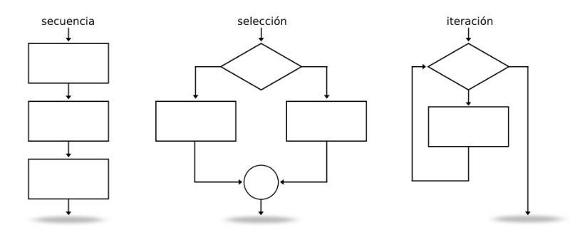

# 2.1 Introducción

En unidades anteriores has podido aprender cuestiones básicas sobre el lenguaje JAVA: definición de variables, tipos de datos, asignación de valores, uso de literales, diferentes operadores que se pueden aplicar, conversiones de tipos, inserción de comentarios, etc.

Vale, parece ser que tenemos los elementos suficientes para comenzar a generar programas escritos en JAVA, ¿Seguro?

Si has programado alguna vez o tienes ciertos conocimientos básicos sobre lenguajes de programación, sabes que **la gran mayoría de lenguajes poseen estructuras que permiten a los programadores controlar el flujo de la información de sus programas**. Esto realmente es una ventaja para la persona que está aprendiendo un nuevo lenguaje, o tiene previsto aprender más de uno, ya que estas estructuras suelen ser comunes a todos (con algunos cambios de sintaxis o conjunto de reglas que definen las secuencias correctas de los elementos de un lenguaje de programación.). Es decir, si conocías sentencias de control de flujo en otros lenguajes, lo que vamos a ver a lo largo de esta unidad te va a sonar bastante.

Para alguien que no ha programado nunca, un ejemplo sencillo le va a permitir entender qué es eso de las sentencias de control de flujo. Piensa en un fontanero (*programador*), principalmente trabaja con agua (*datos*) y se encarga de hacer que ésta fluya por donde él quiere (*programa*) a través de un conjunto de tuberías, codos, latiguillos, llaves de paso, etc. (*sentencias de control de flujo*).

Pues esas estructuras de control de flujo son las que estudiaremos, conoceremos su estructura, funcionamiento, cómo utilizarlas y dónde. A través de ellas, al construir nuestros programas podremos hacer que los datos (agua) fluyan por los caminos adecuados para representar la realidad del problema y obtener un resultado adecuado.

Los tipos de estructuras de programación que se emplean para el control del flujo de los datos son los siguientes:

- **Secuencia** : compuestas por 0, 1 o N sentencias que se ejecutan en el orden en que han sido escritas. Es la estructura más sencilla y sobre la que se construirán el resto de estructuras.
- **Selección** : es un tipo de sentencia especial de decisión y de un conjunto de secuencias de instrucciones asociadas a ella. Según la evaluación de la sentencia de decisión se generará un resultado (que suele ser verdadero o falso) y en función de éste, se ejecutarán una secuencia de instrucciones u otra. Las estructuras de selección podrán ser simples, compuestas y múltiples.
- **Iteración** : es un tipo de sentencia especial de decisión y una secuencia de instrucciones que pueden ser repetidas según el resultado de la evaluación de la sentencia de decisión. Es decir, la secuencia de instrucciones se ejecutará repetidamente si la sentencia de decisión arroja un valor correcto, en otro la estructura de repetición se detendrá.

Además de las sentencias típicas de control de flujo, en esta unidad haremos una revisión de las **sentencias de salto**, que aunque no son demasiado recomendables, es necesario conocerlas. Como nuestros programas podrán generar errores y situaciones especiales, echaremos un vistazo al **manejo de excepciones** en JAVA. Posteriormente, analizaremos la mejor manera de llevar a cabo las **pruebas** de nuestros programas **y** la **depuración** de los mismos. Y finalmente, aprenderemos a valorar y utilizar las **herramientas de documentación de programas**.

> **📌 Un poquito de ...**
