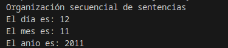
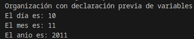
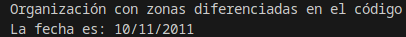

# 2.2 Sentencias y bloques

Este epígrafe lo utilizaremos para reafirmar cuestiones que son obvias y que en el transcurso de anteriores unidades se han dado por sabidas. Aunque, a veces, es conveniente recordar. Lo haremos como un conjunto de FAQs:

- **¿Cómo se escribe un programa sencillo?** Si queremos que un programa sencillo realice instrucciones o sentencias para obtener un determinado resultado, es necesario colocar éstas una detrás de la otra, exactamente en el orden en que deben ejecutarse.
- **¿Podrían colocarse todas las sentencias una detrás de otra, separadas por puntos y comas en una misma línea?** Claro que sí, pero no es muy recomendable. Cada sentencia debe estar escrita en una línea, de esta manera tu código será mucho más legible y la localización de errores en tus programas será más sencilla y rápida. De hecho, cuando se utilizan herramientas de programación, los errores suelen asociarse a un número o números de línea.
- **¿Puede una misma sentencia ocupar varias líneas en el programa?** Sí. Existen sentencias que, por su tamaño, pueden generar varias líneas. Pero siempre finalizarán con un punto y coma.
- **¿En Java todas las sentencias se terminan con punto y coma?** Sí. Si detrás de una sentencia ha de venir otra, pondremos un punto y coma. Escribiendo la siguiente sentencia en una nueva línea. Pero en algunas ocasiones, sobre todo cuando utilizamos estructuras de control de flujo, detrás de la cabecera de una estructura de este tipo no debe colocarse punto y coma. No te preocupes, lo entenderás cuando analicemos cada una de ellas.
- **¿Qué es la sentencia nula en Java?** La sentencia nula es una línea que no contiene ninguna instrucción y en la que sólo existe un punto y coma. Como su nombre indica, esta sentencia no hace nada.
- **¿Qué es un bloque de sentencias?** Es un conjunto de sentencias que se encierra entre llaves y que se ejecutaría como si fuera una única orden. Sirve para agrupar sentencias y para clarificar el código. Los bloques de sentencias son utilizados en Java en la práctica totalidad de estructuras de control de flujo, clases, métodos, etc. La siguiente tabla muestra dos formas de construir un bloque de sentencias.

| Bloque de sentencias 1 | Bloque de sentencias 2 |
| --- | --- |
| `{sentencia1; sentencia2; ...; sentenciaN;}` | `{` `sentencia1;` `sentencia2;` `...;` `sentenciaN;` } |

- **¿En un bloque de sentencias, éstas deben estar colocadas con un orden exacto?** En ciertos casos sí, aunque si al final de su ejecución se obtiene el mismo resultado, podrían ocupar diferentes posiciones en nuestro programa.

> **📌 Debes conocer**
> Observa los tres archivos que te ofrecemos a continuación y compara su código fuente. Verás que los tres obtienen el mismo resultado, pero la organización de las sentencias que los componen es diferente entre ellos.

> **📌 Ejemplo 1**
> En este primer archivo, las sentencias están colocadas en orden secuencial.
>
> Java
>
> Resultado
> ```java
> package organizacion_sentencias1;
>     /*
>      * Organización de sentencias secuencial
>      */
>     public class Organizacion_sentencias_1 {
>       public static void main(String[] args) {
>         System.out.println ("Organización secuencial de sentencias");
>         int dia=12;
>         System.out.println ("El día es: " + dia);
>         int mes=11;
>         System.out.println ("El mes es: " + mes);
>         int anio=2011;
>          System.out.println ("El anio es: " + anio);
>     }
> }
> ```
> 

> **📌 Ejemplo 2**
> En este segundo archivo, se declaran al principio las variables necesarias. En Java no es imprescindible hacerlo así, pero sí que antes de utilizar cualquier variable ésta debe estar previamente declarada. Aunque la declaración de dicha variable puede hacerse en cualquier lugar de nuestro programa.
>
> Java
>
> Resultado
> ```java
> package organizacion_sentencias2;
>     /*
>      * Organización de sentencias con declaración previa de variables
>      */
>     public class Organizacion_sentencias_2 {
>       public static void main(String[] args) {
>         // Zona de declaración de variables
>         int dia=10;
>         int mes=11;
>         int anio=2011;
>         System.out.println ("Organización con declaración previa de variables");
>         System.out.println ("El día es: " + dia);
>         System.out.println ("El mes es: " + mes);
>         System.out.println ("El anio es: " + anio);
>     }
> }
> ```
> 

> **📌 Ejemplo 3**
> En este tercer archivo, podrás apreciar que se ha organizado el código en las siguientes partes: declaración de variables, petición de datos de entrada, procesamiento de dichos datos y obtención de la salida. Este tipo de organización está más estandarizada y hace que nuestros programas ganen en legibilidad.
>
> Java
>
> Resultado
> ```java
> package organizacion_sentencias3;
>     /*
>      * Organización de sentencias en zonas diferenciadas
>      * según las operaciones que se realicen en el código
>      */
>     public class Organizacion_sentencias_3 {
>       public static void main(String[] args) {
>         // Zona de declaración de variables
>         int dia;
>         int mes;
>         int anio;
>         String fecha;
>         //Zona de inicialización o entrada de datos
>         dia=10;
>         mes=11;
>         anio=2011;
>         fecha="";
>         //Zona de procesamiento
>         fecha=dia+"/"+mes+"/"+anio;
>         //Zona de salida
>         System.out.println ("Organización con zonas diferenciadas en el código");
>         System.out.println ("La fecha es: " + fecha);
>     }
> }
> ```
> 
