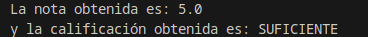
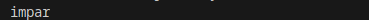
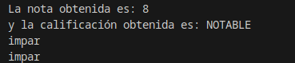

# 2.3 Estructuras de selección

¿Cómo conseguimos que nuestros programas puedan tomar decisiones? Para comenzar, lo haremos a través de las estructuras de selección. Estas estructuras constan de una sentencia especial de decisión y de un conjunto de secuencias de instrucciones.

El funcionamiento es sencillo, la sentencia de decisión será evaluada y ésta devolverá un valor (verdadero o falso), en función del valor devuelto se ejecutará una secuencia de instrucciones u otra.

> **📌 Ejemplo**
> Por ejemplo, si el valor de una variable es mayor o igual que 5 se imprime por pantalla la palabra APROBADO y si es menor, se imprime SUSPENSO. Para este ejemplo, la comprobación del valor de la variable será la sentencia especial de decisión. La impresión de la palabra APROBADO será una secuencia de instrucciones y la impresión de la palabra SUSPENSO será otra. Cada secuencia estará asociada a cada uno de los resultados que puede arrojar la evaluación de la sentencia especial de decisión.

Las estructuras de selección se dividen en:

- Estructuras de selección simples o estructura **if**.
- Estructuras de selección compuesta o estructura **if­else**.
- Estructuras de selección basadas en el **operador condicional**.
- Estructuras de selección múltiples o estructura **switch**.

A continuación, detallaremos las características y funcionamiento de cada una de ellas. Es importante que a través de los ejemplos que vamos a ver, puedas determinar en qué circunstancias utilizar cada una de estas estructuras. Aunque un mismo problema puede ser resuelto con diferentes estructuras e incluso, con diferentes combinaciones de éstas.

## 1. Estructura `if`, `if ­else`, `if else if`

La estructura `if` es una estructura de selección o estructura condicional, en la que se evalúa una expresión lógica o sentencia de decisión y en función del resultado, se ejecuta una sentencia o un bloque de éstas.
La estructura `if` puede presentarse de las siguientes formas:

### 1.1 Estructura `if` simple

```java
if (expresión-lógica)
    sentencia1;
```

```java
if (expresión-lógica)
{
    sentencia1;
    sentencia2;
    ...;
    sentenciaN;
}
```

Si la evaluación de la expresión‐lógica ofrece un resultado verdadero, se ejecuta la sentencia1 o bien el bloque de sentencias asociado. Si el resultado de dicha evaluación es falso, no se ejecutará ninguna instrucción asociada a la estructura condicional.

> **📌 Ejemplo if**
> Java
>
> Resultado
> ```java
> int edad = 22;
> if (edad > 18) {
>     System.out.printf("%d es mayor que 18\n", edad);
> }
> ```
> 

### 1.2 Estructura `if` de doble alternativa

```java
if (expresión-lógica)
    sentencia1;
else
    sentencia2;
```

```java
if (expresión-lógica){
    sentencia1;
    ...;
    sentenciaN;
} else {
    sentencia1;
    ...;
    sentenciaN;
}
```

Si la evaluación de la expresión‐lógica ofrece un resultado verdadero, se ejecutará la primera sentencia o el primer bloque de sentencias. Si, por el contrario, la evaluación de la expresión‐lógica ofrece un resultado falso, no se ejecutará la primera sentencia o el primer bloque y sí se ejecutará la segunda sentencia o el segundo bloque.

> **📌 Funcionamiento de un if**
> Haciendo una interpretación cercana al pseudocódigo tendríamos que si se cumple la condición (expresión lógica), se ejecutará un conjunto de instrucciones y si no se cumple, se ejecutará otro conjunto de instrucciones.

> **📌 Ejemplo if-else**
> Java
>
> Resultado
> ```java
> int temperatura = 22;
> if (temperatura > 25) {
>     System.out.println("Debemos abrigarnos!");
> } else {
>     System.out.println("Voy a ponerme pantalón corto.");
> }
> ```
> 

Hay que tener en cuenta que la cláusula `else` de la sentencia `if` no es obligatoria. En algunos casos no necesitaremos utilizarla, pero sí se recomienda cuando es necesario llevar a cabo alguna acción en el caso de que la expresión lógica no se cumpla.

En aquellos casos en los que no existe cláusula `else`, si la expresión lógica es falsa, simplemente se continuarán ejecutando las siguientes sentencias que aparezcan bajo la estructura condicional `if`.

Los condicionales `if` e `if-else` pueden anidarse, de tal forma que dentro de un bloque de sentencias puede incluirse otro `if` o `if-else`. El nivel de anidamiento queda a criterio del programador, pero si éste es demasiado profundo podría provocar problemas de eficiencia y legibilidad en el código. En otras ocasiones, un nivel de anidamiento excesivo puede denotar la necesidad de utilización de otras estructuras de selección más adecuadas.

Cuando se utiliza anidamiento de este tipo de estructuras, es necesario poner especial atención en saber a qué `if` está asociada una cláusula `else`. Normalmente, un `else` estará asociado con el `if` inmediatamente superior o más cercano que exista dentro del mismo bloque y que no se encuentre ya asociado a otro `else`.

**Estructura `if else if`.**

Esta estructura es una alternativa a la anidación de sentencias `if else` funciona de modo que si se cumple una condición ejecuta unas sentencias y el caso contrario comprueba otra condición ejecutando unas sentencias si se cumple y así sucesivamente. Veamos un ejemplo con `if` anidados:

```java
if (condicion1) {
    sentencias1;
} else {
    if (condicion2) {
        sentencias2;
    } else {
        if (condicion3) {
            sentencias3;
        } else {
            sentencias4;
        }
    }
}
```

El mismo ejemplo usando `if else if` quedaría de este modo:

```java
if (condicion1) {
    sentencias1;
} else if (condicion2) {
    sentencias2;
} else if (condicion3) {
    sentencias3;
} else {
    sentencias4;
}
```

> **📌 Ejemplo if-else-if**
> Java
>
> Resultado
> ```java
> int temperatura = 3;
> boolean nevando = true;
>
> if (temperatura > 25) {
>     // Si la temperatura es mayor que 25 ...
>     System.out.println("A la playa!!!");
>
> } else if (temperatura > 15) {
>     // si es mayor que 15 y no es mayor que 25 ..
>     System.out.println("A la montaña!!!");
>
> } else if (temperatura < 5 && nevando) {
>     // si es menor que 5 y esta nevando y no es mayor que 15 ni mayor que 25
>     System.out.println("A esquiar!!!");
>
> } else {
>     // si la tempera  no es mayor que 25 ni que 15 ni menor que 5 si esta nevando
>     System.out.println("A descansar... zZz");
> }
> ```
> 

> **📌 Ejemplo completo if e if-else**
> Para completar la información que debes saber sobre las estructuras `if` e `if‐else`, observa el siguiente código. En él podrás analizar el programa que realiza el cálculo de la nota de un examen de tipo test. Además de calcular el valor de la nota, se ofrece como salida la calificación no numérica de dicho examen. Para obtenerla, se combinarán las diferentes estructuras condicionales aprendidas hasta ahora.
> Presta especial atención a los comentarios incorporados en el código fuente, así como a la forma de combinar las estructuras condicionales y a las expresiones lógicas utilizadas en ellas.
>
> Java
>
> Resultado
> ```java
> public class Sentencias_Condicionales {
>     /* Realizar el cálculo de la nota de un examen de tipo test.
>      * Para ello, tendremos en cuenta el númerototal de pregunta, 
>      * los aciertos y los errores. Dos errores anulan una respuesta correcta.
>      * Finalmente, se muestra por pantalla la nota obtenida, así
>      * como su calificación no numérica.
>      *
>      * La obtención de la calificación no numérica se ha realizado
>      * combinando varias estructuras condicionales, mostrando expresiones
>      * lógicas compuestas, así como anidamiento.
>      */
>     public static void main(String[] args) {
>         // Declaración e inicialización de variables
>         int num_aciertos = 12;
>         int num_errores = 3;
>         int num_preguntas = 20;
>         float nota = 0;
>         String calificacion = "";
>
>         //Procesamiento de datos
>         nota = ((num_aciertos - (num_errores / 2)) * 10) / num_preguntas;
>
>         if (nota < 5) {
>             calificacion = "INSUFICIENTE";
>         } else {
>             /* Cada expresión lógica de estos if está compuesta por dos
>              * expresiones lógicas combinadas a través del operador Y o AND
>              * que se representa con el símbolo &&. De tal manera, que para
>              * que la expresión lógica se cumpla (sea verdadera) la variable
>              * nota debe satisfacer ambas condiciones simultáneamente
>              */
>             if (nota >= 5 && nota < 6) {
>                 calificacion = "SUFICIENTE";
>             }
>             if (nota >= 6 && nota < 7) {
>                 calificacion = "BIEN";
>             }
>             if (nota >= 7 && nota < 9) {
>                 calificacion = "NOTABLE";
>             }
>             if (nota >= 9 && nota <= 10) {
>                 calificacion = "SOBRESALIENTE";
>             }
>         }
>
>         //Salida de información
>         System.out.println("La nota obtenida es: " + nota);
>         System.out.println("y la calificación obtenida es: " + calificacion);
>     }
> }
> ```
> 

## 2. Operador ternario `(?:)`

El **operador condicional (`? :`)** evalúa una condición booleana y devuelve un valor si se cumple (`true`) u otro si no se cumple (`false`), todo en una única expresión:

```java
resultado = (condicion) ? valorSiVerdadero : valorSiFalso;
```

**Condiciones:**

- La condición debe ser una expresión booleana, es decir, que se evalúe como `true` o `false`.
- Si la condición se cumple (true), el operador devuelve el valor indicado después del signo de interrogación `?`.
- Si la condición no se cumple (false), devuelve el valor indicado después de los dos puntos `:`.
- El operador condicional puede utilizarse tanto para asignar valores a variables como dentro de expresiones más complejas.
- Los valores devueltos en ambas ramas (verdadero y falso) deben ser del mismo tipo o de tipos compatibles.

> **📌 Ejemplo operador condicional (?:)**
> Java
>
> Resultado
> ```java
>     int numero = 8;
>     String resultado = (numero % 2 == 0) ? "par" : "impar";
>     System.out.println("El número es " + resultado);
> ```
> El número es par

### 2.1 Ternarios anidados e indentación (*Clean Code*)

Cuando necesitamos elegir entre **tres o más opciones**, podemos encadenar otro operador ternario después de los dos puntos (`:`).

Para que el código sea legible y fácil de mantener, **nunca lo escribas en una sola línea larga**; indéntalo en varias líneas alineando los signos `?` y `:` como una escalera de decisión:

> **📌 Ejemplo: Indentación de ternarios anidados**
> ```java
> int numero = 0;
>
> // ❌ Mal: difícil de leer en una sola línea
> // String signo = (numero > 0) ? "Positivo" : (numero < 0) ? "Negativo" : "Cero";
>
> // ✅ Bien: indentado por niveles de decisión
> String signo = (numero > 0) ? "Positivo"
>              : (numero < 0) ? "Negativo"
>              : "Cero";
>
> System.out.println("El número es: " + signo);
> ```

> **📌 Actividad ClasificadorNotas**
> Enunciado
>
> Ejemplo de ejecución
>
> Pista
>
> Entrega
> Escribe un programa en Java llamado `ClasificadorNotas.java` que pida al usuario una nota entera entre `0` y `10` por teclado (`Scanner`) y, **utilizando únicamente el operador ternario (`? :`)** (sin usar sentencias `if`), muestre por pantalla:
>
> 1. **Ternario simple:** Una variable `estado` que almacene `"Aprobado"` si la nota es mayor o igual a 5, o `"Suspendido"` en caso contrario.
> 2. **Ternario anidado (indentado en varias líneas):** Una variable `calificacion` que almacene:
> 3. `"Insuficiente"` si la nota es menor que 5.
> 4. `"Suficiente"` si es menor que 6.
> 5. `"Bien"` si es menor que 7.
> 6. `"Notable"` si es menor que 9.
> 7. `"Sobresaliente"` en caso contrario.
> ```java
> Introduce tu nota (0-10): 7
> Estado: Aprobado
> Calificación: Notable
> ```
> Si en el primer nivel ya has comprobado `nota < 5`, en el siguiente escalón (`:`) ya sabes que la nota es como mínimo 5, por lo que basta con evaluar `nota < 6`.
> Revisa que los nombres de clase y variables cumplan las convenciones de Java (`UpperCamelCase` y `lowerCamelCase`), comprueba la indentación en VSCode y **sube el archivo `ClasificadorNotas.java` a la tarea correspondiente en Aules**.

---

## 3. Estructura `switch`

¿Qué podemos hacer cuando nuestro programa debe elegir entre más de dos alternativas? Una posible solución podría ser emplear estructuras if anidadas, aunque no siempre esta solución es la más eficiente. Cuando estamos ante estas situaciones podemos utilizar la estructura de selección múltiple `switch`. En la siguiente tabla se muestra tanto la sintaxis, como el funcionamiento de esta estructura.

**Sintaxis:**

```java
switch (expresion) {
    case valor1:
        sentencia1_1;
        sentencia1_2;
        ....
        break;
    case valor2:
    ....
        case valorN:
        sentenciaN_1;
        sentenciaN_2;
        ....
        break;
    default:
        sentencias-default;
}
```

**Condiciones:**

- Donde *expresión* debe ser del tipo `char` , `byte` , `short` o `int` , y las *constantes* de cada `case` deben ser de este tipo o de un tipo compatible.
- La `expresion` debe ir entre paréntesis.
- Cada `case` llevará asociado un `valor` y se finalizará con dos puntos ( `:` ).
- El bloque de sentencias asociado a la cláusula `default` puede finalizar con una sentencia de ruptura `break` o no.

**Funcionamiento:**

- Las diferentes alternativas de esta estructura estarán precedidas de la cláusula *case* que se ejecutará cuando el valor asociado al case coincida con el valor obtenido al evaluar la expresión del switch.
- En las cláusulas *case* , no pueden indicarse expresiones condicionales, rangos de valores o listas de valores (otros lenguajes de programación sí lo permiten). Habrá que asociar una cláusula *case* a cada uno de los valores que deban ser tenidos en cuenta.
- La cláusula *default* será utilizada para indicar un caso por defecto, las sentencias asociadas a la cláusula *default* se ejecutarán si ninguno de los valores indicados en las cláusulas *case* coincide con el resultado de la evaluación de la expresión de la estructura switch.
- La cláusula *default* puede no existir, y por tanto, si ningún case ha sido activado finalizaría el switch.
- Cada cláusula *case* puede llevar asociadas una o varias sentencias, sin necesidad de delimitar dichos bloques por medio de llaves.
- En el momento en el que el resultado de la evaluación de la expresión coincide con alguno de los valores asociados a las cláusulas *case* , se ejecutarán todas las instrucciones asociadas hasta la aparición de una sentencia break de ruptura (la sentencia break se analizará en epígrafes posteriores).

### 3.1. Expresiones switch mejoradas

En las [novedades de Java 12](https://picodotdev.github.io/blog-bitix/2019/03/novedades-de-java-12/) se añadió la posibilidad de los switch fueran expresiones que retornan un valor en vez de sentencias y se evita el uso de la palabra reservada break.

> **📌 Ejemplo switch mejorada**
> Java
>
> Resultado
> ```java
> int entero = 5;
>
> String numericString = switch (entero) {
>     case 0 -> "cero";
>     case 1, 3, 5, 7, 9 -> "impar";
>     case 2, 4, 6, 8, 10 -> "par";
>     default -> "error";
> };
> System.out.println(numericString); //impar
> ```
> 

En Java 13 en vez de únicamente el valor a retornar se permite crear bloques de sentencias para cada rama `case` y retornar el valor con la palabra reservada `yield`. En los bloques de sentencias puede haber algún cálculo más complejo que directamente retornar el valor deseado.

> **📌 Ejemplo switch con yield**
> ```java
> int entero2 = 4;
>
> String numericString2 = switch (entero2) {
>     case 0 -> {
>         String value = calculaCero();
>         yield value;
>     }
>     case 1, 3, 5, 7, 9 -> {
>         String value = calculaImpar();
>         yield value;
>     }
>
>     case 2, 4, 6, 8, 10 -> {
>         String value = calculaPar();
>         yield value;
>     }
>
>     default -> {
>         String value = calculaDefecto();
>         yield value;
>     }
> };
> System.out.println(numericString); //calculaPar()
> ```

En resumen, se ha de comparar el valor de una expresión con un conjunto de constantes, si el valor de la expresión coincide con algún valor de dichas constantes, se ejecutarán los bloques de instrucciones asociados a cada una de ellas. Si no existiese coincidencia, se ejecutarían una serie de instrucciones por defecto.

> **📌 Ejemplo completo switch**
> Comprueba el siguiente fragmento de código en el que se resuelve el cálculo de un examen de tipo test, utilizando la estructura `switch`.
>
> Java
>
> Resultado
> ```java
> public class P3_2_condicional_switch {
>
>     /*
>      * Realizar el cálculo de la nota de un examen de tipo test. 
>      * Para ello, tendremos en cuenta el número total de preguntas, los aciertos y
>      * los errores. Dos errores anulan una respuesta correcta.
>      *
>      * La nota que vamos a obtener será un número entero.
>      *
>      * Finalmente, se muestra por pantalla la nota obtenida, así como su
>      * calificación no numérica.
>      *
>      * La obtención de la calificación no numérica se ha realizado utilizando la
>      * estructura condicional múltiple o switch.
>      *
>      */
>     public static void main(String[] args) {
>         // Declaración e inicialización de variables
>         int num_aciertos = 17;
>         int num_errores = 3;
>         int num_preguntas = 20;
>         int nota = 0;
>         String calificacion = "";
>         //Procesamiento de datos
>         nota = ((num_aciertos - (num_errores / 2)) * 10) / num_preguntas;
>         switch (nota) {
>             case 5:
>                 calificacion = "SUFICIENTE";
>                 break;
>             case 6:
>                 calificacion = "BIEN";
>                 break;
>             case 7:
>                 calificacion = "NOTABLE";
>                 break;
>             case 8:
>                 calificacion = "NOTABLE";
>                 break;
>             case 9:
>                 calificacion = "SOBRESALIENTE";
>                 break;
>             case 10:
>                 calificacion = "SOBRESALIENTE";
>                 break;
>             default:
>                 calificacion = "INSUFICIENTE";
>         }
>         //Salida de información
>         System.out.println("La nota obtenida es: " + nota);
>         System.out.println("y la calificación obtenida es: " + calificacion);
>
>         //Expresiones switch mejoradas JAVA 12
>         int entero = 5;
>
>         String numericString = switch (entero) {
>             case 0 -> "cero";
>             case 1, 3, 5, 7, 9 -> "impar";
>             case 2, 4, 6, 8, 10 -> "par";
>             default -> "error";
>         };
>         System.out.println(numericString); //impar
>
>         //Expresiones switch mejoradas JAVA 13
>
>         int entero2 = 4;
>
>         String numericString2 = switch (entero2) {
>             case 0 -> {
>                 String value = calculaCero();
>                 yield value;
>             }
>             case 1, 3, 5, 7, 9 -> {
>                 String value = calculaImpar();
>                 yield value;
>             }
>
>             case 2, 4, 6, 8, 10 -> {
>                 String value = calculaPar();
>                 yield value;
>             }
>
>             default -> {
>                 String value = calculaDefecto();
>                 yield value;
>             }
>         };
>         System.out.println(numericString); //calculaPar()
>     }
>     static String calculaCero() {return "";};
>     static String calculaImpar() {return "";};
>     static String calculaPar() {return "";};
>     static String calculaDefecto() {return "";};
> }
> ```
> 
