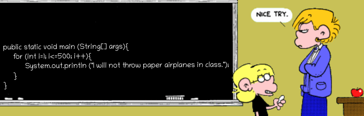
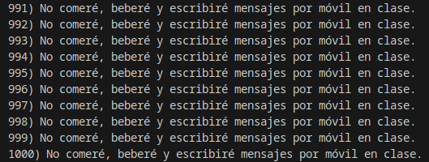
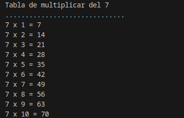
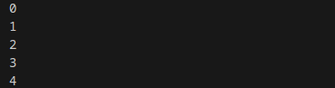
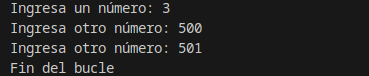
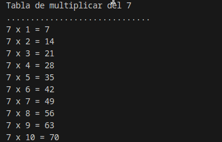
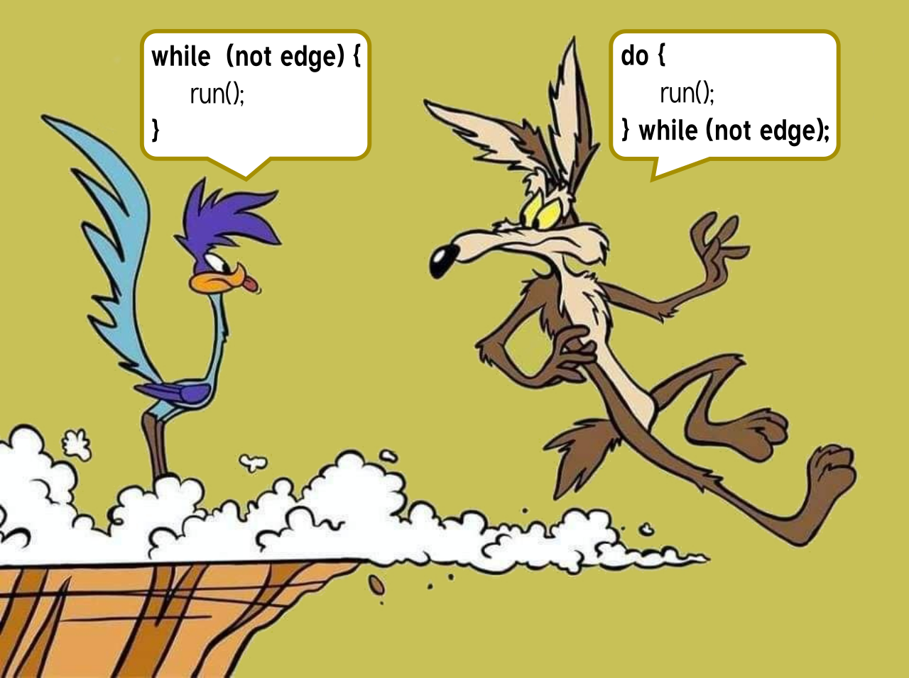
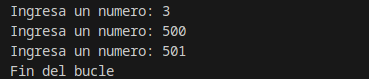
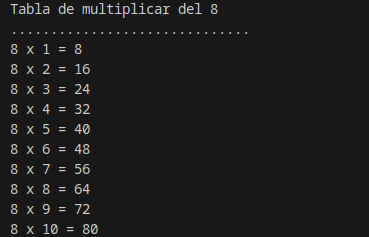
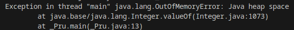

# 2.4 Estructuras de repetición

Nuestros programas ya son capaces de controlar su ejecución teniendo en cuenta determinadas condiciones, pero aún hemos de aprender un conjunto de estructuras que nos permita repetir una secuencia de instrucciones determinada. La función de estas estructuras es repetir la ejecución de una serie de instrucciones teniendo en cuenta una condición.
A este tipo de estructuras se las denomina estructuras de repetición, estructuras repetitivas, bucles o estructuras iterativas. En Java existen cuatro clases de bucles:

- Bucle `for` (repite para).
- Bucle `for/in` (repite para cada).
- Bucle `while` (repite mientras).
- Bucle `do while` (repite hasta).

Los bucles `for` y `for/in` se consideran bucles controlados por contador. Por el contrario, los bucles `while` y `do...while` se consideran bucles controlados por sucesos.

La utilización de unos bucles u otros para solucionar un problema dependerá en gran medida de las siguientes preguntas:

- ¿Sabemos a priori cuántas veces necesitamos repetir un conjunto de instrucciones?
- ¿Sabemos si hemos de repetir un conjunto de instrucciones si una condición satisface un conjunto de valores?
- ¿Sabemos hasta cuándo debemos estar repitiendo un conjunto de instrucciones?
- ¿Sabemos si hemos de estar repitiendo un conjunto de instrucciones mientras se cumpla una condición?

Estas y otras preguntas tendrán su respuesta en cuanto analicemos cada una de estructuras repetitivas en detalle.

> **📌 Equivalencia entre estructuras repetitivas**
> Estudia cada tipo de estructura repetitiva, conoce su funcionamiento y podrás llegar a la conclusión de que algunos de estos bucles son equivalentes entre sí. Un mismo problema, podrá ser resuelto empleando diferentes tipos de bucles y obtener los mismos resultados.

## 1. Estructura `for`

Hemos indicado anteriormente que el bucle `for` es un bucle controlado por contador. Este tipo de bucle tiene las siguientes características:

- Se ejecuta un número determinado de veces.
- Utiliza una variable contadora que controla las iteraciones del bucle.

En general, existen tres operaciones que se llevan a cabo en este tipo de bucles:

- Se inicializa la variable contadora.
- Se evalúa el valor de la variable contador, por medio de una comparación de su valor con el número de iteraciones especificado.
- Se modifica o actualiza el valor del contador a través de incrementos o decrementos de éste, en cada una de las iteraciones.

> **📌 Consideraciones**
> - La inicialización de la variable contadora debe realizase correctamente para garantizar que el bucle lleve a cabo, al menos, la primera repetición de su código interno.
> - La condición de terminación del bucle debe variar en el interior del mismo; de no ser así, podemos caer en la creación de un bucle infinito. Cuestión que se debe evitar por todos los medios.
> - Es necesario estudiar el número de veces que se repite el bucle, pues debe ajustarse al número de veces estipulado.

Sintaxis estructura `for` con una única sentencia:

```java
for (inicialización; condición; iteración)
    sentencia;
```

Sintaxis estructura `for` con un bloque de sentencias:

```java
for (inicialización; condición; iteración) {
    sentencia1;
    sentencia2;
    ...
    sentenciaN;
}
```

donde:

- `inicialización` es una expresión en la que se inicializa una variable de control, que será la encargada de controlar el final del bucle.
- `condición` es una expresión que evaluará la variable de control. Mientras la condición sea falsa, el cuerpo del bucle estará repitiéndose. Cuando la condición se cumpla, terminará la ejecución del bucle.
- `iteración` indica la manera en la que la variable de control va cambiando en cada iteración del bucle. Podrá ser mediante incremento o decremento, y no solo de uno en uno.



> **📌 Ejemplo for**
> Ejemplo `for`
>
> Resultado
> ```java
> for(int i=1;i<=1000;i++)
>     System.out.printf(i + ") No comeré, beberé y escribiré mensajes por móvil en clase.");
> ```
> 

> **📌 Ejemplo repetición for para realizar la tabla de multiplicar**
> Observa el siguiente archivo Java y podrás analizar un ejemplo de utilización del bucle `for` para la impresión por pantalla de la tabla de multiplicar del siete. Lee atentamente los comentarios incluidos en el código, pues aclaran algunas cuestiones interesantes sobre este bucle.
>
> Java
>
> Resultado
> ```java
> public class Repetitiva_For {
>     /* 
>      * En este ejemplo se utiliza la estructura repetitiva for
>      * para representar en pantalla la tabla de multiplicar del siete
>      */
>      public static void main(String[] args) {
>         // Declaración e inicialización de variables
>         int numero = 7;
>         int contador;
>         int resultado = 0;
>
>         //Salida de información
>         System.out.println("Tabla de multiplicar del " + numero);
>         System.out.println(".............................. ");
>
>         //Utilizamos ahora el bucle for
>         for (contador = 1; contador <= 10; contador++) {
>             /* La cabecera del bucle incorpora la inicialización de la variable
>             * de control, la condición de multiplicación hasta el 10 y el
>             * incremento de dicha variable de uno en uno en cada iteración del
>             * bucle.
>             * En este caso contador++ incrementará en una unidad el valor de
>             * dicha variable.
>             */
>             resultado = contador * numero;
>             System.out.println(numero + " x " + contador + " = " + resultado);
>             /* A través del operador + aplicado a cadenas de caracteres,
>             * concatenamos los valores de las variables con las cadenas de
>             * caracteres que necesitamos para representar correctamente la
>             * salida de cada multiplicación.
>             */
>         }
>     }
> }
> ```
> 

## 2. Estructura `for`/`in`

Junto a la estructura `for`, `for`/`in` también se considera un bucle controlado por contador. Este bucle es una mejora incorporada en la versión 5.0. de Java.

Este tipo de bucles permite realizar recorridos sobre arrays y colecciones de objetos. Los arrays son colecciones de variables que tienen el mismo tipo y se referencian por un nombre común. Así mismo, las colecciones de objetos son objetos que se dice son iterables, o que se puede iterar sobre ellos.
Este bucle es nombrado también como bucle `for` mejorado, o bucle `foreach`. En otros lenguajes de programación existen bucles muy parecidos a este.

La sintaxis es la siguiente:

```java
for (declaración: expresión) {
    sentencia1;
    ...
    sentenciaN;
}
```

Donde...:

- `expresion` es un array o una colección de objetos.
- `declaración` es la declaración de una variable cuyo tipo sea compatible con expresión. Normalmente, será el tipo y el nombre de la variable a declarar.

> **📌 Ejemplo foreach**
> Java
>
> Resultado
> ```java
> for (int i : Arrays.asList(0, 1, 2, 3, 4)) {
>     System.out.println(i);
> }
> ```
> 

El funcionamiento consiste en que para cada elemento de la expresión, guarda el elemento en la variable declarada y haz las instrucciones contenidas en el bucle. Después, en cada una de las iteraciones del bucle tendremos en la variable declarada el elemento actual de la expresión. Por tanto, para el caso de los arrays y de las colecciones de objetos, se recorrerá desde el primer elemento que los forma hasta el último.

Observa el contenido del código representado en la siguiente imagen, puedes apreciar cómo se construye un bucle de este tipo y su utilización sobre un array.

Los bucles `for`/`in` permitirán al programador despreocuparse del número de veces que se ha de iterar, pero no sabremos en qué iteración nos encontramos salvo que se añada artificialmente alguna variable contadora que nos pueda ofrecer esta información.

> **📌 Uso de la sentencia foreach**
> Esta estructura tomará sentido cuando avancemos en el curso y veamos los **Arrays** y las **colecciones de Objetos**.

## 3. Estructura `while`

El bucle `while` es la primera de las estructuras de repetición controladas por sucesos que vamos a estudiar. La utilización de este bucle responde al planteamiento de la siguiente pregunta: ¿Qué podemos hacer si lo único que sabemos es que se han de repetir un conjunto de instrucciones mientras se cumpla una determinada condición?.

La característica fundamental de este tipo de estructura repetitiva estriba en ser útil en aquellos casos en los que las instrucciones que forman el cuerpo del bucle podría ser necesario ejecutarlas o no. Es decir, en el bucle `while` siempre se evaluará la condición que lo controla, y si dicha condición es cierta, el cuerpo del bucle se ejecutará una vez, y se seguirá ejecutando mientras la condición sea cierta. Pero si en la evaluación inicial de la condición ésta no es verdadera, el cuerpo del bucle no se ejecutará.

> **⚠️ **
> Es imprescindible que en el interior del bucle `while` se realice alguna acción que modifique la condición que controla la ejecución del mismo, en caso contrario estaríamos ante un bucle infinito.

Sintaxis estructura `while` con una única sentencia:

```java
while (condición)
    sentencia;
```

Sintaxis estructura `while` con un bloque de sentencias:

```java
while (condición) {
    sentencia1;
    ...
    sentenciaN;
}
```

**Funcionamiento:**
Mientras la condición sea cierta, el bucle se repetirá, ejecutando la/s instrucción/es de su interior.

En el momento en el que la condición no se cumpla, el control del flujo del programa pasará a la siguiente instrucción que exista justo detrás del bucle `while`.

La condición se evaluará siempre al principio, y podrá darse el caso de que las instrucciones contenidas en él no lleguen a ejecutarse nunca si no se satisface la condición de partida.

> **📌 Ejemplo while**
> Java
>
> Resultado
> ```java
> Scanner sc = new Scanner(System.in);
>
> System.out.print("Ingresa un número: ");
> int numero = sc.nextInt();
>
> while(numero <= 500) {
>     System.out.print("Ingresa otro número: ");
>     numero = sc.nextInt();
> }
> System.out.println("Fin del bucle");
> ```
> 

> **📌 Ejemplo repetición while para realizar la tabla de multiplicar**
> Java
>
> Resultado
> ```java
> public class Repetitiva_While {
>
>     public static void main(String[] args) {
>         // Declaración e inicialización de variables
>         int numero = 7;
>         int contador;
>         int resultado = 0;
>         //Salida de información
>         System.out.println("Tabla de multiplicar del " + numero);
>         System.out.println(".............................. ");
>         //Utilizamos ahora el bucle while
>         contador = 1; //inicializamos la variable contadora
>         while (contador <= 10) //Establecemos la condición del bucle
>         {
>             resultado = contador * numero;
>             System.out.println(numero + " x " + contador + " = " + resultado);
>             //Modificamos el valor de la variable contadora, para hacer que el
>             //bucle pueda seguir iterando hasta llegar a finalizar
>             contador++;
>         }
>     }
> }
> ```
> 

## 4. Estructura `do-while`

La segunda de las estructuras repetitivas controladas por sucesos es `do-while`. En este caso, la pregunta que nos planteamos es la siguiente: ¿Qué podemos hacer si lo único que sabemos es que se han de ejecutar, **al menos una vez**, un conjunto de instrucciones y seguir repitiéndose hasta que se cumpla una determinada condición?.

La característica fundamental de este tipo de estructura repetitiva estriba en ser útil en aquellos casos en los que las instrucciones que forman el cuerpo del bucle necesitan ser ejecutadas, al menos, una vez y repetir su ejecución hasta que la condición sea verdadera. Por tanto, en esta estructura repetitiva siempre se ejecuta el cuerpo del bucle una primera vez.

> **⚠️ **
> Es imprescindible que en el interior del bucle se realice alguna acción que modifique la condición que controla la ejecución del mismo, en caso contrario estaríamos ante un bucle infinito.

Sintaxis estructura `while` con una única sentencia:

```java
do
    sentencia;
while (condición);
```

Sintaxis estructura `while` con un bloque de sentencias:

```java
do {
    sentencia1;
    ...
    sentenciaN;
} while (condición);
```

**Funcionamiento:**

El cuerpo del bucle se ejecuta la primera vez, a continuación se evaluará la condición y, si ésta es falsa, el cuerpo el bucle volverá a repetirse. El bucle finalizará cuando la evaluación de la condición sea verdadera.

En ese momento el control del flujo del programa pasará a la siguiente instrucción que exista justo detrás del bucle do‐while. La condición se evaluará siempre después de una primera ejecución del cuerpo del bucle, por lo que no se dará el caso de que las instrucciones contenidas en él no lleguen a ejecutarse nunca.



> **📌 Ejemplo do-while**
> Java
>
> Resultado
> ```java
> public class Repetitiva_While {
>
>     public static void main(String[] args) {
>         Scanner sc = new Scanner(System.in);
>         int numero;
>         do {
>             System.out.print("Ingresa un numero: ");
>             numero = sc.nextInt();
>         }
>         while(numero <= 500);
>         System.out.println("Fin del bucle");
>     }
> }
> ```
> 

> **📌 Ejemplo repetición do-while para realizar la tabla de multiplicar**
> Java
>
> Resultado
> ```java
> public class Repetitiva_DoWhile {
>
>     public static void main(String[] args) {
>         // Declaración e inicialización de variables
>         int numero = 7;
>         int contador;
>         int resultado = 0;
>
>         //Salida de información
>         System.out.println("Tabla de multiplicar del " + numero);
>         System.out.println(".............................. ");
>         //Utilizamos ahora el bucle do-while
>         contador = 1; //inicializamos la variable contadora
>         do {
>             resultado = contador * numero;
>             System.out.println(numero + " x " + contador + " = " + resultado);
>             //Modificamos el valor de la variable contadora, para hacer que el
>             //bucle pueda seguir iterando hasta llegar a finalizar
>             contador++;
>         } while (contador <= 10); //Establecemos la condición del bucle
>     }
> }
> ```
> 

> **⚠️ Bucles infinitos**
> ## 5. Bucles infinitos
>
> Uno de los errores más comunes al implementar cualquier tipo de bucle es que nunca pueda salir, es decir, el bucle se ejecuta durante un número infinito de veces. Esto sucede cuando la condición falla por alguna razón.
>
> > **📌 Ejemplo 1**
> > ```java
> > // bucle infinito porque la condición no es apta
> > // la condición; debería haber sido i>0.
> > for (int i = 5; i != 0; i -= 2) {
> >         System.out.println(i);
> > }
> > ```
>
> > **📌 Ejemplo 2**
> > ```java
> > int x = 5; 
> > // bucle infinito porque la actualización
> > // no se proporciona
> > while (x == 5) {
> >     System.out.println("En el bucle");
> > }
> > ```
>
> Otro inconveniente es que puede estar agregando algo en su objeto de colección a través de un bucle y puede **quedarse sin memoria**. Si intentas ejecutar el siguiente programa, después de un tiempo, se producirá una excepción de falta de memoria.
>
> > **📌 Ejemplo 3**
> > Java
> >
> > Resultado
> > ```java
> > /* Se hace uso de la colección ArrayList, pero de momento solo necesitamos saber que se comporta como un casillero al que vamos asignando elementos (que evidentemente ocupan memoria).*/
> > // Programa Java para la excepción de falta de memoria.
> > import java.util.ArrayList;
> > public class HeapSpace {
> >     public static void main(String[] args) {
> >         ArrayList<Integer> ar = new ArrayList<>();
> >         for (int i = 0; i < Integer.MAX_VALUE; i++) {
> >             ar.add(i);
> >         }
> >     }
> > }
> > ```
> > 
