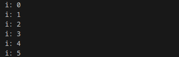
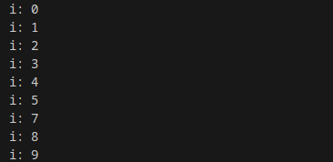
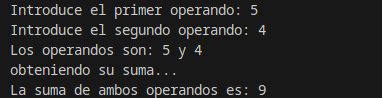

# 2.5 Sentencias de salto

¿Saltar o no saltar? he ahí la cuestión. En la gran mayoría de libros de programación y publicaciones de Internet, siempre se nos recomienda que prescindamos de sentencias de salto incondicional, es más, se desaconseja su uso por provocar una mala estructuración del código y un incremento en la dificultad para el mantenimiento de los mismos. Pero Java incorpora ciertas sentencias o estructuras de salto que es necesario conocer y que pueden sernos útiles en algunas partes de nuestros programas.

Estas estructuras de salto corresponden a las sentencias `break`, `continue`, las etiquetas de salto y la sentencia `return`. Pasamos ahora a analizar su sintaxis y funcionamiento.

## 1. Sentencias `break` y `continue`

Se trata de dos instrucciones que permiten modificar el comportamiento de otras estructuras o sentencias de control, simplemente por el hecho de estar incluidas en algún punto de su secuencia de instrucciones.

La sentencia **`break`** incidirá sobre las estructuras de control `switch`, `while`, `for` y `do- while` del siguiente modo:

- Si aparece una sentencia `break` dentro de la secuencia de instrucciones de cualquiera de las estructuras mencionadas anteriormente, dicha estructura terminará inmediatamente.
- Si aparece una sentencia `break` dentro de un bucle anidado sólo finalizará la sentencia de iteración más interna, el resto se ejecuta de forma normal.

Es decir, que `break` sirve para romper el flujo de control de un bucle, aunque no se haya cumplido la condición del bucle. Si colocamos un `break` dentro del código de un bucle, cuando se alcance el `break`, automáticamente se saldrá del bucle pasando a ejecutarse la siguiente instrucción inmediatamente después de él.

> **📌 Ejemplo break**
> Java
>
> Resultado
> ```java
> public class EjemploBreak {
>     public static void main(String args[]){
>         for (int i = 0; i < 10; i++) {
>             if(i == 6) {
>                 break;
>             }
>             System.out.println("i: " + i);
>         }
>     }
> }
> ```
> 

La sentencia **`continue`** incidirá sobre las sentencias o estructuras de control `while`, `for` y `do while` del siguiente modo:

- Si aparece una sentencia `continue` dentro de la secuencia de instrucciones de cualquiera de las sentencias anteriormente indicadas, dicha sentencia dará por terminada la iteración actual y se ejecuta una nueva iteración, evaluando de nuevo la expresión condicional del bucle.
- Si aparece en el interior de un bucle anidado solo afectará a la sentencia de iteración más interna, el resto se ejecutaría de forma normal.

Es decir, la sentencia `continue` forzará a que se ejecute la siguiente iteración del bucle, sin tener en cuenta las instrucciones que pudiera haber después del `continue`, y hasta el final del código del bucle.

> **📌 Ejemplo continue**
> Java
>
> Resultado
> ```java
> public class EjemploContinueFor {
>
>     public static void main(String args[]){
>         for (int i = 0; i < 10; i++) {
>             if(i == 6) {
>                 continue;
>             }
>             System.out.println("i: " + i);
>         }
>     }
> }
> ```
> 

## 2. Sentencia `return`

Ya sabemos cómo modificar la ejecución de bucles y estructuras condicionales múltiples, pero ¿*Podríamos modificar la ejecución de un método*? ¿*Es posible hacer que éstos detengan su ejecución antes de que finalice el código asociado a ellos*? Sí, es posible, a través de la sentencia `return` podremos conseguirlo.
La sentencia `return` puede utilizarse de dos formas:

- Para terminar la ejecución del método donde esté escrita, con lo que transferirá el control al punto desde el que se hizo la llamada al método, continuando el programa por la sentencia inmediatamente posterior.
- Para devolver o retornar un valor, siempre que junto a `return` se incluya una expresión de un tipo determinado. Por tanto, en el lugar donde se invocó al método se obtendrá el valor resultante de la evaluación de la expresión que acompañaba al método.

En general, una sentencia `return` suele aparecer al final de un método, de este modo el método tendrá una entrada y una salida. También es posible utilizar una sentencia `return` en cualquier punto de un método, con lo que éste finalizará en el lugar donde se encuentre dicho `return`.

> **⚠️ **
> No será recomendable incluir más de un `return` en un método y por regla general, deberá ir al final del método como hemos comentado.

El valor de retorno es opcional, si lo hubiera debería de ser del mismo tipo o de un tipo compatible al tipo del valor de retorno definido en la cabecera del método, pudiendo ser desde un entero a un objeto creado por nosotros. Si no lo tuviera, el tipo de retorno sería `void`, y `return` serviría para salir del método sin necesidad de llegar a ejecutar todas las instrucciones que se encuentran después del `return`.

> **📌 Ejemplo return**
> En el siguiente archivo java encontrarás el código de un programa que obtiene la suma de dos números, empleando para ello un método sencillo que retorna el valor de la suma de los números que se le han pasado como parámetros.
>
> Presta atención a los comentarios y fíjate en las conversiones a entero de la entrada de los operandos por consola.
>
> Java
>
> Resultado
> ```java
> import java.io.*;
>
> public class Sentencia_Return {
>
>     private static BufferedReader stdin = new BufferedReader(
>             new InputStreamReader(System.in));
>
>     public static int suma(int numero1, int numero2) {
>         int resultado;
>         resultado = numero1 + numero2;
>         return resultado; //Mediante return devolvemos el resultado de la suma
>     }
>
>     public static void main(String[] args) throws IOException {
>         //Declaración de variables
>         String input; //Esta variable recibirá la entrada de teclado
>         int primer_numero, segundo_numero; //Estas variables almacenarán los operandos
>
>         // Solicitamos que el usuario introduzca dos números por consola
>         System.out.print("Introduce el primer operando: ");
>         input = stdin.readLine(); //Leemos la entrada como cadena de caracteres
>         primer_numero = Integer.parseInt(input); //Transformamos a entero lo introducido
>         System.out.print("Introduce el segundo operando: ");
>         input = stdin.readLine(); //Leemos la entrada como cadena de caracteres
>         segundo_numero = Integer.parseInt(input); //Transformamos a entero lo introducido
>
>         //Imprimimos los números introducidos
>         System.out.println("Los operandos son: " + primer_numero + " y " + segundo_numero);
>         System.out.println("obteniendo su suma... ");
>
>         //Invocamos al método que realiza la suma, pasándole los parámetros adecuados
>         System.out.println("La suma de ambos operandos es: " + 
>                 suma(primer_numero, segundo_numero));
>     }
> }
> ```
> 
