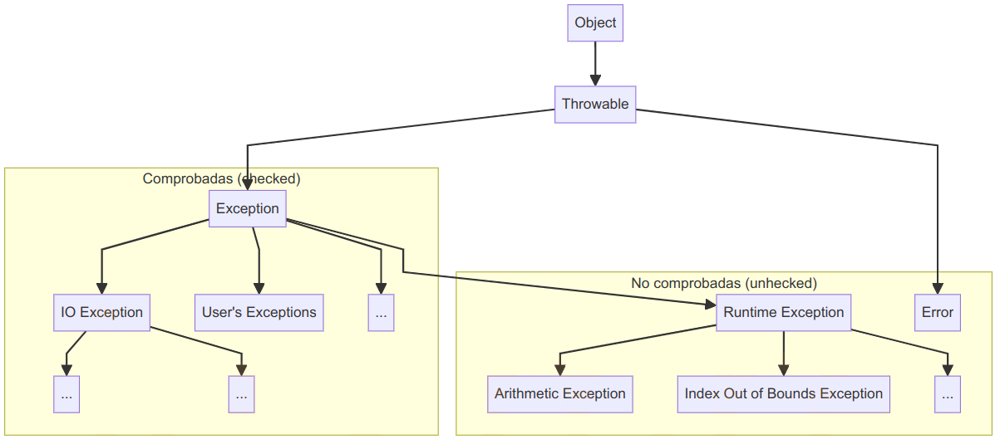

# 2.6 Control de excepciones

## 1. ¿Qué es una Excepción?

A lo largo de nuestro aprendizaje de Java, hemos lidiado con errores de sintaxis, como la falta de un *punto y coma* o un *nombre de variable incorrecto*. Estos errores son detectados y señalados por el compilador, y podemos corregirlos para lograr que el programa compile correctamente.

Pero, ¿existen otros tipos de errores? ¿*Podrían existir errores no sintácticos en nuestros programas*? Sí, un programa puede estar libre de errores de sintaxis y aun así **fallar en tiempo de ejecución**. Estos errores, que suelen aparecer cuando algo inesperado sucede mientras se ejecuta el programa, se conocen como **excepciones**.

Java cuenta con un sistema de manejo de excepciones robusto que permite detectar, capturar y gestionar estos errores de manera específica.

### 1.1. Tipos de excepciones

Los errores de tiempo de ejecución pueden ser de dos tipos principales:

- **Errores** : en este caso hablamos de errores *fatales* que ocurren durante la ejecución de un programa, como errores de hardware, errores de memoria… Estos errores no se pueden gestionar desde dentro de una aplicación *Java* .
- **Excepciones** : son errores no críticos que se pueden gestionar (archivos no encontrados, errores de análisis…). Dentro de este tipo de errores podemos hablar de: _ **Excepciones en tiempo de ejecución** : no es necesario detectarlas y, en general, son difíciles de predecir. Por ejemplo, asignar un valor nulo a una variable o sobrepasar los límites de una matriz. _ **Excepciones comprobadas** : estas excepciones deben detectarse o declararse para que se generen. En otras palabras, si usamos una función que puede generar este tipo de excepciones, el compilador se quejará si no detectamos la excepción o la generamos nuevamente. Por ejemplo, siempre que llamamos a la instrucción `Thread.sleep` , debemos capturar o generar una excepción `InterruptedException` .


Sin embargo, cada tipo de excepción es una subclase del tipo principal `Exception`. Esta clase almacena el mensaje de error producido por la excepción. Existen otras subclases que almacenan información más específica. Por ejemplo, `ParseException` es una subclase de `Exception` que se genera cuando los datos no se pueden analizar correctamente. Almacena el mensaje de error junto con la posición en la que se encontró el error.

### 1.2. Tipos de gestión de excepciones

Siempre que se produce una excepción en un programa, podemos decidir cómo tratarla. Básicamente, tenemos dos opciones en nuestro código:

​ a) **Capturar la excepción**. Esto significa que la excepción se “destruye” y podemos mostrar en su lugar un mensaje de error personalizado y controlado.

​ b) **Lanzar la excepción**. En este caso, no queremos preocuparnos por la excepción y delegamos en otro fragmento de código para que la trate.

En las siguientes secciones de este documento aprenderemos cómo gestionar estas dos opciones.

## 2. Capturar excepciones: `try-catch-finally`

Para capturar excepciones, *Java* utiliza la estructura `try-catch-finally`, donde:

- `try` contiene el código que puede generar una excepción.
- `catch` captura y maneja la excepción lanzada.
- `finally` (opcional) ejecuta código que debe correr siempre, haya o no una excepción.

### Sintaxis

```java
try {
    // Código que puede lanzar una excepción

} catch (Tipo_excepcion_1 objeto_excepcion) {
    // Manejo de Tipo_excepcion_1

} catch (Tipo_excepcion_2 objeto_excepcion) {
    // Manejo de Tipo_excepcion_2

} finally {
    // Código que se ejecuta siempre

}
```

Podemos agregar tantas cláusulas `catch` como necesitemos, y cada una puede representar un tipo de excepción específico. Sin embargo, debemos ordenar estas cláusulas `catch`, de forma que las más genéricas se coloquen al final; pues el programa entrará en la primera cláusula `catch` que coincida con la excepción producida. Es decir, si ponemos la cláusula `catch(Exception)` al principio, el resto de cláusulas no tendrán efecto, ya que cualquiera de ellas es subtipo de `Exception` y, por tanto, serán capturadas por la primera cláusula.

> **📌 Ejemplo básico**
> Este programa captura dos tipos de excepciones, `IOException` y `NumberFormatException`, y asegura que las instrucciones de `finally` se ejecuten siempre:
>
> ```java
> import java.io.*;
>
> public class EjemploExcepciones {
>   public static void main(String[] args) {
>     BufferedReader tec = new BufferedReader(new InputStreamReader(System.in));
>     int numero = -1;
>
>     try {
>       System.out.print("Introduce un número: ");
>       String entrada = tec.readLine();
>       numero = Integer.parseInt(entrada);
>       System.out.println("Número introducido: " + numero);
>
>     } catch (IOException e) {
>         System.err.println("Error al leer entrada: " + e.getMessage());
>
>     } catch (NumberFormatException e) {
>       System.err.println("Error: se esperaba num entero: " + e.getMessage() );
>
>     } finally {
>       System.err.println("Programa finalizado.");
>     }
>   }
> }
> ```
>
> El método `getMessage` obtiene el mensaje de error producido por la excepción. Observa que estamos usando `System.err` en lugar de `System.out` porque estamos imprimiendo un error y, en ese caso, deberíamos usar la salida de error predeterminada en lugar de la salida *normal* predeterminada.
>
> También podemos usar el método `printStackTrace` para imprimir un seguimiento completo de la pila del error; de modo que podamos ver la pila de llamadas que produjeron el error (es decir, los métodos que se llamaron hasta que se produjo el error).

## 3. Lanzar excepciones. Delegación de excepciones con `throws`

Cuando un método puede lanzar una excepción, pero no la captura, podemos delegar la gestión al método que llama, usando `throws`.

> **📌 Ejemplo:**
> Código Java
>
> 📋 Copiar
> JAVA
>
> `public class DelegacionExcepciones {
>
>  public static int dividir(int a, int b) throws ArithmeticException {
>  if (b == 0) {
>  throw new ArithmeticException("No se puede dividir entre cero");
>  }
>  return a / b;
>  }
>
>  public static void main(String[] args) {
>  try {
>  int resultado = dividir(10, 0);
>  System.out.println("Resultado: " + resultado);
>
>  } catch (ArithmeticException e) {
>  System.out.println("Error de división: " + e.getMessage());
>  }
>  }
> }`
>
> Puede observarse en la linea 4 que se verifica si b es igual a cero. Si lo es, se lanza manualmente una excepción `ArithmeticException` con el mensaje "*No se puede dividir entre cero*". Esto detendrá la ejecución del método `dividir` y transferirá el control al bloque `catch` que pueda estar manejando esta excepción.

> **📌 Ejercicio 1: Captura de excepciones**
> Crea un programa llamado **`CalculateDensity`** que pida al usuario que escriba un *peso* (en *gramos*) y un *volumen* (en *litros*). Luego, el programa debe generar la *densidad*, que se calcula dividiendo el *peso* entre el *volumen*.
>
> El programa debe capturar todos los tipos de excepciones posibles: **`NumberFormatException`** y **`ArithmeticException`** siempre que se puedan generar.
>
> **Solución:**
>
> ```java
> import java.util.Scanner;
>
> public class CalculateDensity {
>     public static void main(String[] args) {
>         Scanner sc = new Scanner(System.in);
>         double peso = 0;
>         double volumen = 0;
>         double densidad = 0;
>
>         try {
>             System.out.print("Introduce el peso en gramos: ");
>             peso = Double.parseDouble(sc.nextLine());
>
>             System.out.print("Introduce el volumen en litros: ");
>             volumen = Double.parseDouble(sc.nextLine());
>
>             densidad = peso / volumen;
>             System.out.println("La densidad es: " + densidad + " g/L");
>         } catch (NumberFormatException e) {
>             System.out.println("Error: Entrada no válida. Asegúrate de introducir un número.");
>         } catch (ArithmeticException e) {
>             System.out.println("Error: No se puede dividir por cero. Introduce un volumen válido.");
>         } finally {
>             sc.close();
>         }
>     }
> }
> ```

> **📌 Ejercicio 2: Lanzar excepciones**
> Crea un programa llamado **`WaitApp`** con un método llamado **`waitSeconds`** que recibirá una cantidad de *segundos* (entero) como parámetro. Internamente, este método llamará al método **`Thread.sleep`** para pausar el programa la cantidad de segundos dada (esta función trabaja con milisegundos, por lo que debes convertir segundos a milisegundos al llamarla). Como el método **`sleep`** puede lanzar un elemento **`InterruptedException`** (tendrás que lidiar con él).
>
> En este caso, se te pide que lances la excepción desde el método **`waitSeconds`** y la captures en el método **`main`** , que llamará a **`waitSeconds`** con la cantidad de segundos especificada como parámetro **`main`** (dentro del parámetro **`String[] args`**).
>
> Después de esperar la cantidad de segundos especificada, el programa mostrará un mensaje de "*Finalizar*" antes de salir.
>
> **Solución:**
>
> Código Java
>
> 📋 Copiar
> JAVA
>
> `public class WaitApp {
>
>  // Método que pausa el programa por una cantidad de segundos especificada
>  public static void waitSeconds(int seconds) throws InterruptedException {
>  // Convierte segundos a milisegundos y utiliza Thread.sleep
>  Thread.sleep(seconds * 1000);
>  }
>
>  public static void main(String[] args) {
>  // Verifica que se haya pasado un argumento para la cantidad de segundos
>  if (args.length != 1) {
>  System.out.println("Uso: java WaitApp <segundos>");
>  return;
>  }
>
>  try {
>  // Convierte el argumento a un entero
>  int seconds = Integer.parseInt(args[0]);
>  System.out.println("Esperando " + seconds + " segundos...");
>
>  // Llama al método que pausa el programa
>  waitSeconds(seconds);
>
>  // Muestra el mensaje de finalización después de la espera
>  System.out.println("Finalizar");
>  } catch (NumberFormatException e) {
>  System.out.println("Por favor, proporciona un número válido de segundos.");
>  } catch (InterruptedException e) {
>  System.out.println("La espera fue interrumpida.");
>  }
>  }
> }`

## 4. Excepciones Comunes en Java

| **Nombre** | **Descripción** |
| --- | --- |
| `FileNotFoundException` | Se lanza cuando el archivo especificado no se encuentra. |
| `ClassNotFoundException` | Se lanza cuando la clase especificada no está disponible. |
| `EOFException` | Se lanza cuando se llega al final de un archivo inesperadamente. |
| `ArrayIndexOutOfBoundsException` | Se lanza cuando se accede a un índice de matriz no válido. |
| `StringIndexOutOfBoundsException` | Se lanza cuando se accede a una posición de un string que está fuera de su rango válido. |
| `NumberFormatException` | Se lanza al intentar convertir un dato alfanumérico a numérico. |
| `NullPointerException` | Se lanza cuando se accede a un objeto que no ha sido inicializado. |
| `IOException` | Generaliza las excepciones de entrada/salida. |
| `ArithmeticException` | Se lanza al intentar dividir un número entre cero. |
| `InputMismatchException` | Permite manejar errores de entrada y guiar al usuario para que proporcione el tipo de dato correcto |

Cada excepción es capturada según su tipo específico, y las más generales se colocan al final.

> **📌 Ejemplo de Múltiples Excepciones:**
> ```java
> import java.io.*;
>
> public class EjemploMultiplesExcepciones {
>     public static void main(String[] args) {
>         try {
>             BufferedReader br = new BufferedReader(new FileReader("archivo.txt"));
>             String linea = br.readLine();
>             int numero = Integer.parseInt(linea);
>             System.out.println("Número leído: " + numero);
>         } catch (FileNotFoundException e) {
>             System.out.println("Archivo no encontrado.");
>         } catch (IOException e) {
>             System.out.println("Error de entrada/salida.");
>         } catch (NumberFormatException e) {
>             System.out.println("Formato incorrecto, se esperaba un número.");
>         }
>     }
> }
> ```
>
> En este ejemplo, el programa intenta abrir un archivo y leer un número. Los errores posibles son `FileNotFoundException` si el archivo no existe, `IOException` si ocurre un problema de lectura, y `NumberFormatException` si el contenido no es un número válido.

## 5. Excepciones Personalizadas

Para crear y lanzar excepciones personalizadas en *Java*, puedes seguir un patrón bastante común que consiste en extender (heredar de) la clase `Exception` o `RuntimeException`.

> **📌 Ejemplo de Excepción Personalizada:**
> ```java
> public class PruebaExcepcionPersonalizada {
>
>     public static void verificarEdad(int edad) throws FueraDeRangoException {
>         if (edad < 0 || edad > 120) {
>             throw new FueraDeRangoException("Edad fuera del rango permitido (0-120)");
>         }
>         System.out.println("Edad válida: " + edad);
>     }
>
>     public static void main(String[] args) {
>         try {
>             int edad = 150;
>             verificarEdad(edad);
>
>         } catch (FueraDeRangoException e) {
>             System.out.println(e.getMessage());
>
>         }
>     }
> }
>
> // clase excepción FueraDeRangoException
> class FueraDeRangoException extends Exception {
>     public FueraDeRangoException(String mensaje) {
>         super(mensaje);
>     }
> }
> ```
