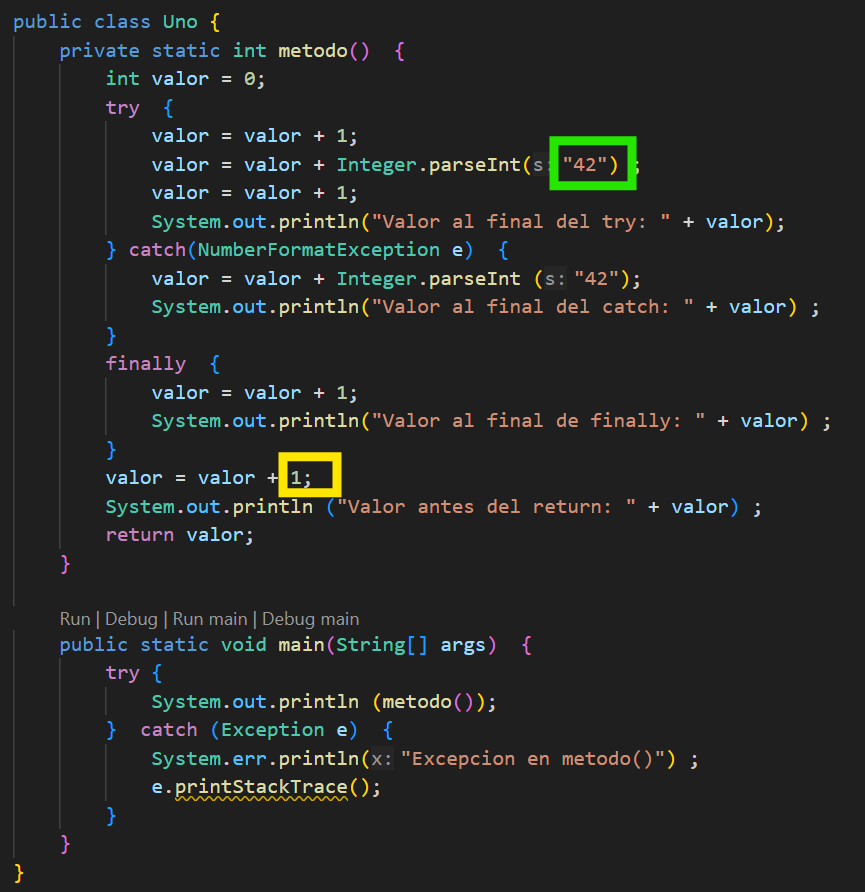

# Actividades UT02

> **📌 Empaquetar actividades**
> Empaqueta las actividades, dentro de la carpeta **`ut02/bloqueX`**

---

## Bloque 2.1 - Estructuras de selección

### Actividad 28

Realiza un programa en Java que tenga las variables *edad*, *nivel de estudios* e *ingresos*. En ellas almacenará los valores introducidos por el usuario.

A continuación, crea una variable `boolean` llamada *jasp* . Esta almacenará el valor verdadero si la edad es menor o igual a 28 y el nivel de estudios es mayor a 3, o bien la edad es menor de 30 y los ingresos superiores a 28000. En caso contrario almacenar el valor falso.

### Actividad 01 `MenorDeDos`

Escribe un programa que muestre el menor de dos números enteros introducidos por teclado.

### Actividad 02 `MenorDeTres`

Escribe un programa que muestre el menor de tres números enteros introducidos por teclado.

Haz dos versiones:

- una utilizando los operadores lógicos necesarios ( `&&` , `||` , ...) y
- otra sin utilizar ninguno (habrá que usar sentencias `if else` anidadas)

### Actividad 03 `NotasTexto`

Escribe un programa que acepte del usuario la *nota* de un examen (valor numérico entre *1* y *10*) y muestre el literal correspondiente a dicha nota según (*insuficiente*, *suficiente*, *bien*, *notable*, *sobresaliente*).

Hacerlo utilizando la sentencia `if...else if...else`.

La nota que introduce el usuario tendrá que ser un valor entero.

### Actividad 04 `NotasTexto2`

Escribe un programa que acepte del usuario la *nota* de un examen (valor numérico entre 1 y 10) y muestre el literal correspondiente a dicha nota según (insuficiente, suficiente, bien, notable, sobresaliente).

Hacerlo utilizando la sentencia `switch`.

La nota que introduce el usuario tendrá que ser un valor entero.

### Actividad 05 `Hora`

Realiza un programa que pida una *hora* por teclado y que muestre luego *buenos días*, *buenas tardes* o *buenas noches* según la hora.

Se utilizarán los tramos de *6* a *12*, de *13* a *20* y de *21* a 5 respectivamente.

Sólo se tienen en cuenta las horas, los minutos no se deben introducir por teclado.

### Actividad 06 `DiasDelMes2`

Escribir un programa que lea de teclado el número de un *mes* (*1* a *12*) y visualice el número de días que tiene el mes. Resolver utilizando la sentencia `switch`.

### Actividad 07 `ParImpar`

Escribe un programa en Java que pida al usuario un número entero y muestre por pantalla si el número es par o impar, utilizando el operador condicional `(? :)` en lugar de una estructura `if`.

### Actividad 08 `Bisiesto`

Escribe un programa que determine si un año introducido por teclado es o no bisiesto.

> Un año es bisiesto si es múltiplo de 4 (por ejemplo 1984). Sin embargo, los años múltiplos de 100 no son bisiestos, salvo que sean múltiplos de 400, en cuyo caso si lo son (por ejemplo 1800 no es bisiesto y 2000 si lo es).

Para hacer el programa, implementa un método dentro de la clase que reciba un *año* y devuelva *true* si el año es bisiesto y *false* en caso de que no los sea.

En pseudocódigo sería algo así:

```java
    SI ((año divisible por 4 Y año no divisible por 100) O (año divisible por 400))ENTONCES
        es bisiesto
    SINO
        no es bisiesto
    FIN_SI
```

### Actividad 09 `LetraNif`

Escribe un programa que lea de teclado un *nif* (sin guiones ni puntos).

- Si el *nif* introducido lleva la letra, se comprobará si esta es correcta y se le indicará al usuario si lo es o no.
- Si el *nif* no lleva letra, se calculará la que le corresponde y se mostrará al usuario.

> **📌 Pista**
> Algunos métodos que te ayudaran son:
>
> ```text
> - String.charAt(index);
> - Integer.parseInt(String);
> - String.toUpperCase();
> - String.length();
> - String.substring(index1, index2);
> ```

---

## Bloque 2.2 - Estructuras de repetición

### Actividad 10 `SencillosWhile`

Crea una clase llamada `SencillosWhile` y crea en ella métodos que realicen las siguientes tareas usando la sentencia `while`:

- **`imparesHastaN`** : Dado un nº entero `n` introducido por el usuario, mostrar los números impares que hay entre 1 y `n` .
  - Por ejemplo, si n es 8, mostrará 1 3 5 7
- **`nImpares`** : Dado un nº entero `n` introducido por el usuario, mostrar los `n` primeros números impares.
  - Por ejemplo, si `n` es 3, mostrará 1 3 5 (3 primeros impares)
- **`cuentaAtras`** : Dado un entero `n` introducido por el usuario, mostrar una cuenta atrás partiendo de `n` : `n` , `n-1` , …. 5, 4, 3, 2, 1, 0
  - Por ejemplo, si `n` es 7, mostrará 7 6 5 4 3 2 1 0
- **`sumaNPrimeros`** : Dado un entero `n` introducido por el usuario, mostrar la suma de los números entre 1 y `n` .
  - Por ejemplo, si n es 4, mostrará 10.
- **`mostrarDivisoresN`** : Dado un entero `n` introducido por el usuario, mostrar todos sus divisores, incluidos el 1 y el mismo `n` .
  - Por ejemplo, si `n` es 12 mostraría 1, 2, 3, 4, 6 y 12
- **`sumaDivisoresN`** : Dado un entero `n` introducido por el usuario, mostrar la suma de todos sus divisores, sin incluir al propio `n` .
  - Por ejemplo, si `n` es 12 sumará 1, 2, 3, 4 y 6 = 16

Después crea un método `main` que compruebe el funcionamiento de cada uno de los anteriores.

### Actividad 11 `SencillosFor`

Crea una clase llamada `SencillosFor` y crea en ella los mismos métodos que en el Actividad anterior, pero utilizando la sentencia `for` en lugar de `while`.

### Actividad 12 `Tablas de multiplicar`

Haz dos programas, uno que muestre por pantalla la tabla de multiplicar del 3, y otro, la del 5. Los dos deben ser exactamente iguales, letra por letra, excepto en un único literal dentro de todo el código. Debes usar las estructuras de repetición `for.`

### Actividad 13

Transforma el siguiente bucle for en un bucle while:

```java
for (int i=5; i<15; i++) { 
    System.out.println(i);
}
```

### Actividad 14

Crea un programa que muestre por pantalla los *5* primeros números pares.

### Actividad 15

Crea un programa que muestre los números del *1* al *100* sin mostrar los múltiplos de *5*.

### Actividad 16 `Primo`

Escribe un programa en el que el usuario escriba un número entero y se le diga si se trata o no de un número primo. 
Recuerda que un nº primo es aquel que solo es divisible por *1* y por sí mismo.

### Actividad 17 `Signo`

Leer un número e indicar si es positivo o negativo. El proceso se repetirá hasta que se introduzca un *0*.

> **📌 Consejo**
> Usa el operador `do...while` para que el proceso se repita hasta introducir un *0*

### Actividad 18 `Containers`

La capacidad de un buque que transporta containers está limitada tanto por la cantidad de containers como por el peso, pudiendo transportar un máximo de *100* containers y un máximo de *700* toneladas.

Realiza un programa en el que se vaya introduciendo el peso de los containers (en toneladas) a medida que se cargan en el barco, hasta que se llegue al máximo de capacidad. Muestra al final la cantidad de containers cargados y el peso total.

En el momento en que se desee cargar un container que haga que la carga total supere las 700 toneladas, se dará por finalizada la carga, aunque pudieran existir containers menos pesados con posibilidad de ser cargados.

### Actividad 19 `Notas`

Realiza un programa que permita introducir las notas de un examen de los alumnos de un curso. El usuario irá introduciendo las notas una tras otra. Se considerará finalizado el proceso de introducción de notas cuando el usuario introduzca una nota negativa.

Al final, el programa mostrará:

- El número de notas introducidas.
- El número de aprobados (mayor o igual a *5* puntos)
- La nota media

### Actividad 20 `Billetes`

Realizar un programa que dado un importe en euros nos indique el mínimo número de billetes y la cantidad sobrante de euros. Debes usar `while.`

```java
¿Cuántos euros tienes?: 232
1 billete de 200 €
1 billete de 20 €
1 billete de 10 €
Sobran 2 €
```

### Actividad 21 `Segundos`

Escribir un programa que, dada una cantidad de segundos, introducida por teclado, la desglose en días, horas, minutos y segundos Debes usar `while`.

Ejemplo de ejecución:

```java
Introduce cantidad de segundos: 3661
3661 segundos son:
0 dias
1 horas
1 minutos
1 segundos
```

---

## Bloque 2.3 - Estructuras de selección y repetición

### Actividad 22 `CuentaAdelante`

Escribe un programa que pida al usuario dos enteros: `inicio` y `salto`. Luego, mediante un bucle `while`, muestre todos los números empezando en `inicio`, sumando `salto` cada vez, mientras el número sea `<=100`.

- Por ejemplo, si `inicio = 5` y `salto = 7` , mostrará: 5, 12, 19, 26, ..., <=100.

### Actividad 23 `CalculoIMC`

Pide al usuario su *peso (kg)* y *altura (m)* y calcula el `IMC = peso / (altura²)`. Usa condicionales `if-else` para clasificarlo según:

- < 18,5 → “bajo peso”
- 18,5-24,9 → “peso normal”
- 25-29,9 → “sobrepeso”
- >= 30 → “obesidad”

Luego, repite el proceso en un bucle `do-while` hasta que el usuario quiera salir (introduciendo altura = 0).

### Actividad 24 `TablaMultiplicar`

Escribe un programa que pida un número entero `n` (mayor que 0), y otro entero `fin` (mayor que 0). Mediante un bucle `for`, muestra la tabla de multiplicar de `n`, *desde n × 1 hasta n × fin*.

### Actividad 25 `ContadorLetras`

Pide al usuario que introduzca una cadena de texto (String). Recorre cada carácter con un bucle `for` y cuenta, usando `condicionales`:

- Cuántas vocales hay (a, e, i, o, u — puedes ignorar tildes).
- Cuántas consonantes hay (letras que no son vocales).
- Cuántos números hay.
- Cuántos caracteres que no sean letras ni números.

Muestra los resultados al final.

### Actividad 26 `FizzBuzz`

Escribe un programa que recorra los números del 1 al 50 con un bucle for. Para cada número:

- si es múltiplo de 3 y de 5 → imprime “FizzBuzz”
- si es múltiplo solo de 3 → imprime “Fizz”
- si es múltiplo solo de 5 → imprime “Buzz”
- en otro caso → imprime el número.

### Actividad 27 `FizzBuzz2`

Modifica el programa anterior para que el usuario pueda introducir los múltiplos `a` y `b` en lugar de 3 y 5, y el límite `superior` (en lugar de 50).

### Actividad 28 `NumeroPerfecto`

Pide al usuario un entero `n` (mayor que 0). Usa un bucle `while` para hallar todos sus *divisores propios* (menores que n) y usa `condicionales` para sumarlos.

Luego informa si n es *perfecto* (la suma de sus divisores propios es igual a n), *defectivo* (la suma es menor que n) o *excesivo* (la suma es mayor que n).

### Actividad 29 `Fibonacci`

Pide al usuario un entero `limite`. Utilizando un bucle `while`, genera la secuencia de *Fibonacci (1, 1, 2, 3, 5, 8…)* hasta que el siguiente número sería **mayor que limite**.

### Actividad 30 `Adivinar`

El programa genera un número aleatorio entre **1 y 100** (puedes usar `Random` o `Math.random()`).

Luego, en un bucle `do-while`, solicita al usuario que adivine el número. Tras cada intento, usa `condicionales` para decirle al usuario *más alto*, *más bajo*, o *correcto*.

Cuando lo adivine, muestra cuántos intentos ha necesitado.

### Actividad 31 `ValidaContra`

Pide al usuario que introduzca una contraseña. Usa un bucle para que vuelva a pedir la contraseña hasta que cumpla todas estas condiciones:

- Longitud mínima de 8 caracteres.
- Contiene al menos una letra mayúscula.
- Contiene al menos un dígito.

> **📌 Consejo**
> Usa condicionales para analizar cada condición, y cuando la contraseña sea válida termina el bucle y muestra “Contraseña aceptada”.

### Actividad 32 `Edades`

Crea un programa que pida al usuario la `cantidad` de edades que desea almacenar.

Luego, mediante un bucle `for` irá pidiendo cada una de las edades y hará un recuento de cuántas pertenecen a cada uno de los siguientes grupos:

- Menor de 18
- Entre 18 y 35
- Entre 36 y 60
- Mayor de 60

Al final muestra cuántas perdonas hay en cada grupo.

### Actividad 33 `Edades2`

Repite el programa anterior con un bucle `do ... while` que finalice cuando el usuario introduzca una **edad negativa**.

---

## Bloque 2.4 - Sentencias de salto

### Actividad 34 `Calculadora`

Escribe una clase que contenga un método para simular una calculadora.

Considera que los cálculos posibles son del tipo *num1* *operador* *num2*, donde *num1* y *num2* son dos números reales cualesquiera y *operador* es una de entre: +, -, * y /.

El programa pedirá al usuario en primer lugar el valor *num1*, a continuación el *operador* y finalmente el valor *num2*.

Estos datos se pasaran a un método, que devolverá la solución de la operación usando la estructura de salto `return`.

Resolver utilizando instrucciones `if else`.

### Actividad 35 `dibujarFiguras2`

Escribe una clase que contenga los métodos que se indican a continuación.

En el método `main` solicita al usuario las dimensiones de las figuras necesarias en cada caso y llama al método correspondiente para que se muestre por pantalla.

1. `void dibRectNumeros3 (int ancho, int alto)` : dibuja un rectángulo utilizando números, como el siguiente. En el ejemplo ancho es *7* y alto es *3* :

```java
1 2 3 4 5 6 7 7 6 5 4 3 2 1
1 2 3 4 5 6 7 7 6 5 4 3 2 1
1 2 3 4 5 6 7 7 6 5 4 3 2 1
```

1. `void dibRectAsteriscos1 (int ancho, int alto)` : dibuja un rectángulo utilizando asteriscos ( *) y espacios en blanco, como el siguiente. En el ejemplo ancho es* 7 *y alto es* 3*:

```java
* * * * * * *
* * * * * * *
* * * * * * *
```

1. `void dibRectAsteriscos2 (int ancho, int alto)` : dibuja un rectángulo utilizando asteriscos ( *), espacios en blanco y el carácter ‘+’, como el siguiente. En el ejemplo ancho es* 7 *y alto es* 3*:

```java
* + * + * + *
* + * + * + *
* + * + * + *
```

1. `void dibTriangulo1 (int base)` : dibuja un triángulo utilizando asteriscos ( *) y espacios en blanco, como el siguiente. En el ejemplo base es* 5*:

```java
*
* *
* * * 
* * * * 
* * * * *
```

### Actividad 36

Realiza un juego para adivinar un número `X`. El usuario cuenta con 10 intentos.

Para ello pedir un número `n`, y luego ir pidiendo números indicando "*mayor*" o "*menor*" según sea mayor o menor con respecto a `X`, hasta que lo adivine o pierda los 10 intentos.

Cuando el usuario acierta, el proceso termina usando la sentencia `break`.

### Actividad 37

Realiza el control de acceso a una caja fuerte. La combinación será un número de 4 cifras (aleatoria).

El programa nos pedirá la combinación para abrirla. Si no acertamos, se nos mostrará el mensaje "*Lo siento, esa no es la combinación*" y si acertamos se nos dirá "*La caja fuerte se ha abierto satisfactoriamente*". Tendremos cuatro oportunidades para abrir la caja fuerte.

---

## Bloque 2.5 - Control de excepciones

### Actividad 38 `Division`

Programa que solicita dos números enteros (*a* y *b*) y muestra el resultado de su división (a/b).

Asegúrate de controlar las excepciones siguientes: `ArithmeticException` y `NumberFormatException` o `InputMismatchException`

Ejecútalo indroduciendo los siguientes datos:

1. El usuario introduce *0* como valor de *b* .
2. El usuario introduce letras cuando el programa espera números enteros.
3. El usuario introduce un número real cuando el programa espera un entero.

### Actividad 39 `PrecioVehiculo`

Crea una clase vehículo con los atributos: marca, modelo y precio. Además, esta contendrá un constructor que recibirá los datos por parámetro y los getters y setters de los tres atributos.

Crea un método extra para devolver el precio del vehículo con IVA.

Controlar con excepciones que el precio del vehículo introducido son números y que el cálculo del método *Precio Final con IVA* no devuelva error.

Los datos del vehículo serán introducidos por el usuario en la función `main`. Después se sacará por pantalla la marca, el modelo y el precio final (con IVA).

### Actividad 40 `NotaMedia`

Introduce *códigos de alumnos, nombre* y *nota* hasta que se introduzca un código de alumno negativo. Devolver la nota media de los alumnos de la clase. Controlar con Excepciones que las notas introducidas son números y que si no se introducen alumnos el cálculo de la media no devuelva error (división entre 0).

### Actividad 41 `Posicion`

Crea un programa que solicita al usuario su *nombre* y una *posición* dentro del nombre. Se muestra al usuario la letra del nombre cuya posición se ha indicado. Por ejemplo:

```java
Introduce nombre: Javi
Introduce posición: 2
En la posición 2 de Javi está la letra a
```

Imagina que el usuario introduce el nombre *Javi* y la posición *10*. Captura esta excepción para sacar un mensaje de error por pantalla.

> Ayuda: La excepción producida será de tipo: `StringIndexOutOfBoundsException`.

---

## Bloque 2.6

### Actividad 42 `Transportes`

Una empresa de transportes cobra 30€ por cada bulto que transporta. Además, si el peso total de todos los bultos supera los 300 kilos, cobra 0.9€ por cada kg extra. Por último si el trasporte debe realizarse en sábado, cobra un plus de 60€. La empresa no realiza el pedido si hay que transportar más de 30 bultos, si el peso total supera los 1000 kg o si se solicita hacerlo en domingo.

Realizar un programa que solicite el número de bultos, el día de la semana (valor entre 1 y 7) y el peso de cada uno de los bultos y muestre el coste del transporte en caso de que pueda realizarse o un mensaje adecuado en caso contrario.

### Actividad 43 `Compra`

Crea una función o método llamado `impFinal`, que calcule el importe final de una compra.

Los parámetros que se le pasarán a la función son:

- El `precio` del producto
- Las `cantidad de unidades` compradas
- El `porcentaje de iva`
- El `porcentaje de descuento`

El método `main` debe pedir por teclado el precio del producto, las unidades adquiridas, el porcentaje de IVA y el porcentaje de descuento y sacar por pantalla el `Importe final` de la Factura. Controla las excepciones para asegurarte de que los datos introducidos son del tipo correcto.

### Actividad 44 `Salario`

Escribe un programa que calcule el salario semanal de un trabajador teniendo en cuenta que las horas ordinarias (40 primeras horas de trabajo) se pagan a 12 euros la hora. A partir de la hora 41, se pagan a 16 euros la hora.

### Actividad 45 `Pregunta45`

Indica qué se mostrará por pantalla cuando se ejecute esta clase y por qué:



- ¿Que pasa si cambias el *42* enmarcado en verde por un String? ¿Cuál es la salida ahora?
- ¿Y si cambias el *1* enmarcado en amarillo por `Integer.parseInt("a")`? ¿Qué sacará en ese caso?

### Actividad 46 `SumaTope`

Escribe un programa que permita ir introduciendo una serie indeterminada de números mientras su suma no supere el valor 10000. Cuando esto último ocurra, se debe mostrar el total acumulado, el contador de los números introducidos y la media.

> Recuerda controlar las excepciones en caso de que el valor introducido no sea un número o que al calcular la media se divida entre 0.

### Actividad 47 `NotaProgramacion`

Calcula la nota de un trimestre de la asignatura Programación. El programa pedirá las dos notas que ha sacado el alumno en los dos primeros controles.

- Si la media de los dos controles da un número mayor o igual a 5, el alumno está aprobado y se mostrará la media.
- En caso de que la media sea un número menor que 5, el alumno habrá tenido que hacer el examen de recuperación que se califica como apto o no apto, por tanto se debe preguntar al usuario ¿Cuál ha sido el resultado de la recuperación? (apto/no apto).
  - Si el resultado de la recuperación es apto, la nota será un 5; en caso contrario, la nota será 1.

Ejemplo 1:

```java
Nota del primer control: 7 Nota del segundo control: 10
Tu nota de Programación es 8.5
```

Ejemplo 2:

```java
Nota del primer control: 6 Nota del segundo control: 3
¿Cuál ha sido el resultado de la recuperación? (apto/no apto): apto
Tu nota de Programación es 5
```

Ejemplo 3:

```java
Nota del primer control: 6 Nota del segundo control: 3
¿Cuál ha sido el resultado de la recuperación? (apto/no apto): no apto
Tu nota de Programación es 1
```

### Actividad 48 `SumaSiguientes`

Realiza un programa que sume los 100 números siguientes a un número entero y positivo introducido por teclado. Se debe comprobar que el dato introducido es correcto (que es un número positivo) y sacar la excepción correspondiente en caso contrario.
