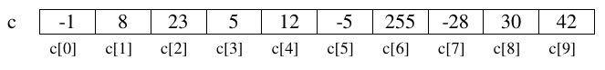

[⬅️ Tornar a l'índex de Programació](../) | [🏠 Portal Principal](../../) | [📘 UT3 Completa](../ut3-tipus-avancats.md) | [🎨 **Obrir versió interactiva Material (amb índex lateral i mode fosc)**](../guia-completa/ut03/ut0301.html)

[⬅️ Anterior: 3.1 Introducción a las estructuras de datos](../ut03/ut0306.md) | [➡️ Següent: 3.2.2 Recorrido, búsqueda y ordenación en arrays](../ut03/ut0303.md)

---

# 3.2.1 Uso de arrays

Un array es una colección de elementos del mismo tipo, que tienen un nombre o identificador común.

- Se puede acceder a cada componente del array de forma individual para consultar o modificar su valor.
- El acceso a los componentes se realiza mediante un subíndice, que viene dado por la posición que ocupa el elemento dentro del array.

En la siguiente figura se muestra un array `c` de enteros:

    


> 📝 **Se ordenan a partir del índice 0**
>
> El primer subíndice de un array es el cero. El último subíndice es la longitud del array menos uno.
>
> 


El número de componentes de un array se establece inicialmente al crearlo y no es posible cambiarlo de tamaño. Es por esto que reciben el nombre de estructuras de datos estáticas.

## Declaración y creación

Para poder utilizar un array hay que **declararlo y crearlo**:

```java
tipo nombreVariable[] = new tipo[numElementos];
// o
tipo[] nombreVariable = new tipo[numElementos];
```

En la **declaración** se establece el nombre de la variable y el tipo de los componentes. Por ejemplo:

```java
double lluvia1[];   // lluvia1 es un array de double
double[] lluvia2;   // lluvia2 es un array de double
```

En la declaración anterior no se ha establecido el número de componentes. El número de componentes se indica en la **creación**, que se hace utilizando el operador **`new`**:

```java
lluvia1 = new double[31];
```

Con esta instrucción se establece que el número de elementos del array `lluvia` son 31, reservando con ello el compilador espacio consecutivo para 31 componentes individuales de tipo `double`.

Las dos instrucciones anteriores se pueden unir en una sola:

```java
double lluvia2[] = new double[31];
```

El valor mediante el cual se define el número de elementos del array tiene que ser una expresión entera, pero no tiene por qué ser un literal como en el ejemplo anterior. El tamaño de un array se puede establecer durante la ejecución, como en el siguiente ejemplo:

```java
// usamos un array para almacenar las edades de un grupo de personas
// la variable numPersonas contiene el número de personas del grupo
// y se asigna en tiempo de ejecución
Scanner teclado = new Scanner(System.in);

System.out.print("Introduce cuantos elementos debe tener el array edad[]:");
int numPersonas = teclado.nextInt();

int edad[] = new int[numPersonas];
```

## Acceso a los componentes

Como ya hemos dicho, el acceso a los componentes del array se realiza mediante subíndices. La sintaxis para referirse a un componente del array es la siguiente:

```java
nombreVariable[subíndice]
```

Tras declarar el array `lluvia`, se dispone de 31 componentes de tipo `double` numeradas desde la *0* a la *30* y accesibles mediante la notación: `lluvia[0]` (componente primera), `lluvia[1]` (componente segunda) y así sucesivamente hasta la última componente `lluvia[30]`.

Con cada una de las componentes del array de `double` lluvia es posible efectuar todas las operaciones que podrían realizarse con variables individuales de tipo `double`, por ejemplo, dadas las declaraciones anteriores, las siguientes instrucciones serían válidas:

```java
System.out.print("Introduce el dato para el componente 0: ");
edad[0] = teclado.nextInt(); //25

System.out.println("El componente [0] vale " + edad[0]);
edad[1] = edad[0] + 1;
edad[2] = edad[0] + edad[1];
edad[2]++;
System.out.println("El componente [1] vale " + edad[1]); //26
System.out.println("El componente [2] vale " + edad[2]); //52
```

Además, hay que tener en cuenta que el subíndice ha de ser una expresión entera, por lo que también son válidas expresiones como las siguientes:

```java
int i;
...
edad[i] = edad[i + 1];
edad[i + 2] = edad[i];
```

## Inicialización

Cuando creamos un array, Java inicializa automáticamente sus componentes:

- Con *0* cuando los componentes son de tipo numérico.
- Con *false* cuando los componentes son `boolean`.
- Con el carácter de ASCII, cuando los componentes son `char`.
- Con `null` cuando son objetos (`Strings`, etc).

Aun así, es probable que estos no sean los valores con los que queremos inicializar el array. Tenemos entonces dos posibilidades:

a) Acceder individualmente a los componentes del array para darles valor:

```java
int edad2[] = new int[10];
edad2[0] = 25;
edad2[1] = 10;
...
edad2[9] = 12;
```

b) inicializar el array en la declaración de la siguiente forma:

```java
int edad3[] = {25,10,23,34,65,23,1,67,54,12};
```

Enumerando los valores con los que se quiere inicializar cada componente, encerrados entre llaves. De hacerlo así, no hay que crear el array con el operador `new`. Java crea el array con tantos componentes como valores hemos puesto entre llaves.


> ☕ **Un ejemplo práctico**
>
> Ya hemos resuelto en temas anteriores el problema de devolver el nombre de un mes dado su número.
>
> Vamos a resolverlo ahora ayudándonos de arrays:
>
> ```java
> public static String nombreMes(int mes){
>     String nombre[] = {" " ,"enero", "febrero", "marzo", "abril",
>                        "mayo", "junio", "julio","agosto",
>                        "septiembre", "octubre", "noviembre", "diciembre"};
>     return nombre[mes];
> }
> ```
>
> El método define un array de `String` que se inicializa con los nombres de los doce meses. La primera componente del array (`nombre[0]`) se deja vacía, de forma que enero quede almacenado en `nombre[1]`.  
>
> Devolver el nombre del mes indicado se reduce a devolver el componente del array cuyo número indica el parámetro mes: `nombre[mes]`.


## Arrays como parámetros. Paso de parámetros por referencia

Hasta el momento sólo se ha considerado el paso de parámetros por valor; de manera que cualquier cambio que el método realice sobre los parámetros formales no modifica el valor que tiene el parámetro real con el que se llama al método. En java, todos los parámetros de tipos simples/primitivos (`byte`, `short`, `int`, `long`, `float`, `double`,  `boolean`, `char`) se pasan por valor.

Por el contrario, los **arrays no son variables de tipo primitivo**, y como cualquier otro objeto, **se pasan siempre por referencia**.

**En** el paso de **parámetros por referencia** lo que **se pasa** en realidad al método es **la dirección de la variable u objeto**. Es por esto que el papel del parámetro formal es el de ser una referencia al parámetro real; la llamada al método no provoca la creación de una nueva variable. De esta forma, las modificaciones que el método pueda realizar sobre estos parámetros se realizan efectivamente sobre los parámetros reales. En este caso, ambos parámetros (formal y real) se pueden considerar como la misma variable con dos nombres, uno en el método llamante y otro en el llamado o invocado, pero hacen referencia a la misma posición de memoria.


> ☕ **Ejemplo**
>
> En el siguiente ejemplo, la variable `a`, de tipo primitivo, no cambia de valor tras la llamada al método. Sin embargo la variable `v`, array de enteros, si se ve afectada por los cambios que se han realizado sobre ella en el método:
>
> ```java
> public static void main(String[] args){
>     int p = 1;
>     int v[] = {1,1,1};
> 
>     metodo(v,p);                //Pasar un array como parámetro
> 
>     System.out.println(p);      // Muestra 1
>     System.out.println(v[0]);   // Muestra 2
> }
> 
> public static void metodo(int x[], int y){ //recibir un array como parámetro
>     x[0]++;
>     y++;
> }
> ```


> 📝 **Pasar un array como argumento en un método**
>
> Como podemos observar, para pasar un array a un método, simplemente usamos el nombre de la variable en la llamada.  
>
> En la cabecera del método, sin embargo, tenemos que utilizar los corchetes `[]` para indicar que el parámetro es un array.


## El atributo `length`

Todas las variables de tipo array tienen un atributo `length` que permite consultar el número de componentes del array. Su uso se realiza posponiendo `.length` al nombre de la variable:

```java
double estatura[] = new double[25];
...
System.out.println(estatura.length); // Mostrará por pantalla: 25
```

## `String[] args` en el `main`

El método `main` puede recibir argumentos desde la línea de comandos. Para ello, el método `main` recibe un parámetro (`String args[]`). Vemos que se trata de un array de `Strings`. El uso del atributo `length` nos permite comprobar si se ha llamado al programa de forma correcta o no. Veamos un ejemplo para saber si es Navidad. Se habrá llamado correctamente si el array `args` contiene dos componentes (día, mes):

```java
public class EsNavidad {
    public static void main(String[] args) {
        if (args.length != 2) {
            System.out.println("ERROR:");
            System.out.println("Llame al programa de la siguiente forma:");
            System.out.println("java EsNavidad dia mes");

        } else {
            // args[0] es el día
            // args[1] es el mes
            if ((Integer.valueOf(args[0]) == 25) && (Integer.valueOf(args[1]) == 12)) {
                    System.out.println("ES NAVIDAD!");
            } else {
                System.out.println("No es navidad :(");
            }
        }
    }
}
```


> 🎬 **Un poquito de ...**
>


---

[⬅️ Anterior: 3.1 Introducción a las estructuras de datos](../ut03/ut0306.md) | [➡️ Següent: 3.2.2 Recorrido, búsqueda y ordenación en arrays](../ut03/ut0303.md) | [📑 Índex de Programació](../) | [🎨 Versió Web Material](../guia-completa/ut03/ut0301.html)
