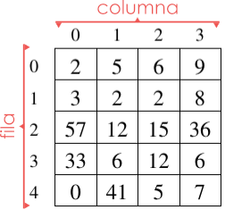
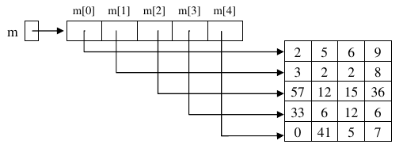
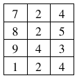

Los arrays bidimensionales, también llamados matrices, son muy similares a los arrays que hemos visto hasta ahora. También son una colección de elementos del mismo tipo que se agrupan bajo un mismo nombre de variable.

Sin embargo:

- Sus elementos están organizados en **filas** y **columnas**. Tienen, por tanto una altura (filas) y una anchura (columnas), y por ello se les llama bidimensionales.
- A cada componente de una matriz se accede mediante dos subíndices: el primero se refiere al número de fila y el segundo al número de columna.

En la siguiente figura: `m[0][0]` es `2`, `m[0][3]` es `9` y `m[2][0]` es `57`.



- Como vemos, filas y columnas se numeran a partir del `0` .

Siguiendo el ejemplo de los puntos anteriores, si se quisiera extender el tratamiento el estudio de la pluviosidad, para abarcar no solo los días de un mes sino los de todo un año, se podría definir, por ejemplo, un array de 366 elementos, que mantuviera de forma correlativa los datos de pluviosidad de una zona día a día. Con ello, por ejemplo, el dato correspondiente al día 3 de febrero ocuparía la posición 34 del array, mientras que el correspondiente al 2 de julio ocuparía el 184.

Una aproximación más conveniente para la representación de estos datos consistiría en utilizar una matriz con 12 filas (una por mes) y 31 columnas (una por cada día del mes). Esto permitiría una descripción más ajustada a la realidad y, sobre todo, simplificaría los cálculos de la posición real de cada día en la estructura de datos. El elemento `[0][3]` correspondería, por ejemplo, a las lluvias del 4 de enero.

## Matrices en Java

> **📌 Matriz ó Array?**
> En Java, una matriz es, en realidad un array en el que cada componente es, a su vez, un array. Dicho de otra manera, una matriz de enteros es un array de arrays de enteros.

Esto, que no es igual en otros lenguajes de programación, tiene ciertas consecuencias en la declaración, creación y uso de las matrices en Java:

- Una matriz, en Java, puede tener distinto número de elementos en cada fila.
- La creación de la matriz se puede hacer en un solo paso o fila por fila.
- Si `m` es una matriz de enteros... _ `m[i][j]` es el entero de la fila `i`, columna `j`. _ `m[i]` es un array de enteros. _ `m.length` es el número de filas de `m`. _ `m[i].length` es el número de columnas de la fila `i`.
- Podríamos dibujar la matriz `m` del ejemplo anterior de una forma más cercana a cómo Java las representa internamente:



## Declaración de matrices

El código siguiente declara una matriz (array bidimensional) de elementos de tipo `double`, y la crea para que tenga `5` filas y `4` columnas (matriz de 5x4):

```java
double m1[][] = new double[5][4];
```

La siguiente declaración es equivalente a la anterior aunque en la práctica es menos utilizada a no ser que queramos que cada fila tenga un número distinto de elementos:

```java
double m2[][] = new double [5][];
m2[0] = new double[4];
m2[1] = new double[4];
m2[2] = new double[4];
m2[3] = new double[4];
m2[4] = new double[4];
```

Es posible inicializar cada uno de los subarrays con un tamaño diferente (aunque el tipo base elemental debe ser siempre el mismo para todos los componentes). Por ejemplo:

```java
double m3[][] = new double [5][];
m3[0] = new double[3];
m3[1] = new double[4];
m3[2] = new double[14];
m3[3] = new double[10];
m3[4] = new double[9];
```

## Inicialización

La forma de inicializar una matriz de enteros de, por ejemplo [4][3], sería:

```java
int m4[][] = {
                {7,2,4},
                {8,2,5},
                {9,4,3},
                {1,2,4}
              };
```



## Recorrido

El recorrido se hace de forma similar al de un array aunque, dado que hay dos subíndices, será necesario utilizar dos bucles anidados: uno que se ocupe de recorrer las filas y otro que se ocupe de recorrer las columnas.

El siguiente fragmento de código recorre una matriz `m4` para imprimir sus elementos uno a uno.

JAVA

SALIDA
```java
//recorrido por filas
System.out.println("\nRecorrido por filas: ");
for (int f = 0; f < m4.length; f++) {
    for (int c = 0; c < m4[f].length; c++) {
        System.out.print(m4[f][c] + " ");
    }
    System.out.println("");
}
```
```java
//Recorrido por filas:
7 2 4 
8 2 5 
9 4 3 
1 2 4 
```
El recorrido se ha hecho por filas, es decir, se imprimen todos los elementos de una fila y luego se pasa a la siguiente. Como habíamos indicado anteriormente, `m.length` representa el número de filas de `m`, mientras que `m[i].length` el número de columnas de la fila `i`.

También es posible hacer el recorrido por columnas: imprimir la columna 0, luego la 1, etc:

JAVA

SALIDA
```java
System.out.println("\nRecorrido por columnas: ");
int numFilas = m4.length;
int numColumnas = m4[0].length;
for (int c = 0; c < numColumnas; c++) {
    for (int f = 0; f < numFilas; f++) {
        System.out.print(m4[f][c] + " ");
    }
    System.out.println("");
}
```
```java
//Recorrido por columnas: 
7 8 9 1 
2 2 4 2 
4 5 3 4
```
o, directamente ...

JAVA

SALIDA
```java
System.out.println("\nRecorrido por columnas versión 2: ");
for (int c = 0; c < m4[0].length; c++) {
    for (int f = 0; f < m4.length; f++) {
        System.out.print(m4[f][c] + " ");
    }
    System.out.println("");
}
```
```java
//Recorrido por columnas versión 2: 
7 8 9 1 
2 2 4 2 
4 5 3 4
```
En este caso, para un funcionamiento correcto del recorrido sería necesario que todas las columnas tuvieran igual número de elementos, pues en el bucle externo, se toma como referencia para el número de columnas la longitud de m[0], es decir el número de elementos de la primera fila.

> **📌 Ejemplo completo de Arrays y sus recorridos**
> [Enlace a ejercicio completo de Arrays y sus recorridos](../../others/code/ut04/EjemploUT04.txt).

# Arrays multidimensionales

En el punto anterior hemos visto que podemos definir arrays cuyos elementos son a la vez arrays, obteniendo una estructura de datos a la que se accede mediante dos subíndices, que hemos llamado arrays bidimensionales o matrices.

Este *anidamiento* de estructuras se puede generalizar, de forma que podríamos construir arrays de más de dos dimensiones. En realidad Java no pone límite al número de subíndices de un array. Podríamos hacer declaraciones como las siguientes:

```java
//Notas de 10 alum. en 5 asign. en 3 eval.
int notas[][][] = new int[10][5][3]; 

//El alumno 2, para la asignatura 3 de la primera evaluación ha sacado un 5
notas[2][3][1]=5;

double w[][][][][] = new double [2][7][10][4][10];
```

> **📌 Arrays con más de 3 dimensiones**
> Sin embargo, encontrar ejemplos en los que sean necesarios arrays de más de tres dimensiones es bastante raro, y aún cuando los encontramos solemos utilizar arrays de uno o dos subíndices porque nos resulta menos complejo manejarlos.
