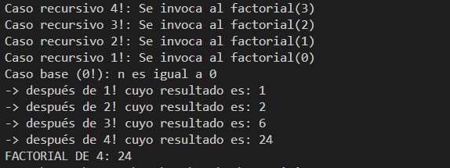
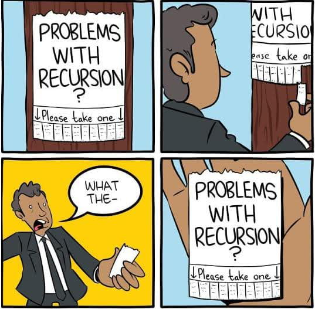
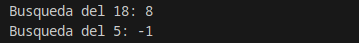

# 3.4 Recursividad

A la hora de crear programas complejos, uno de los aspectos que diferencia el buen programador del aficionado es su capacidad de hacer algoritmos eficientes. O sea, que sean capaces de resolver el problema planteado en el mínimo de pasos. En el caso de un programa, esto significa la necesidad de ejecutar el mínimo número de instrucciones posible. Ciertamente, si el resultado tiene que ser exactamente el mismo, siempre será mejor hacer una tarea en 10 pasos que en 20, intentando evitar pasos que en realidad son innecesarios. Por lo tanto, la etapa de diseño de un algoritmo es bastante importante y hay que pensar bien una estrategia eficiente. Ahora bien, normalmente, los algoritmos más eficientes también son más difíciles de pensar y codificar, ya que no siempre son evidentes.

## Aplicación de la recursividad

A menudo encontraréis que explicar de palabra la idea general de una estrategia puede ser sencillo, pero traducirla a instrucciones de Java ya no lo es tanto.

Retomamos ahora el caso de la búsqueda dicotómica o binaria, dado que hay que ir repitiendo unos pasos en sucesivas iteraciones, está más o menos claro que el problema planteado para realizar búsquedas eficientes se basa en una estructura de repetición. Pero no se recorren todos los elementos y el índice no se incrementa uno a uno, sino que se va cambiando a valores muy diferentes para cada iteración. No es un caso evidente. Precisamente, este ejemplo no se ha elegido al azar, ya que es un caso en el que os puede ir bien aplicar un nuevo concepto que permite facilitar la definición de algoritmos complejos donde hay repeticiones.

> **📌 Definición**
> La **recursividad** es una forma de describir un proceso para resolver un problema de manera que, a lo largo de esta descripción, se usa el proceso mismo que se está describiendo, pero aplicado a un caso más simple.


De hecho, tal vez sin darse cuenta de ello, ya se ha usado recursividad para describir cómo resolver un problema. Para ver qué significa exactamente la definición formal apenas descrita, se repetirá el texto en cuestión, pero remarcando el aspecto recursivo de la descripción:

"*Generalmente, la mejor estrategia para adivinar un número secreto entre 0 y N sería primero probar N/2. Si no se ha acertado, entonces si el número secreto es más alto se intenta adivinar entre (N/2 + 1) y N. Si era más bajo, se intenta adivinar el valor entre 0 y N-1. Para cada caso, se vuelve a probar el valor que hay en el centro del nuevo intervalo. Y así sucesivamente, hasta adivinarlo.*"

O sea, **el proceso de adivinar un número se basa en el proceso de intentar adivinar un número!** Esto parece hacer trampas, ya que es como usar la misma palabra que se quiere definir a su propia definición. Pero fíjate en un detalle muy importante; los nuevos usos del proceso de "*adivinar*" son casos más simples, ya que primero se adivina entre *N* valores posibles, luego entre N/2 valores, después entre *N/4*, etc. Este hecho no es casual y de él depende poder definir un proceso recursivo de manera correcta.

> **📌 **
> Otro ejemplo de recursividad en Informática es la definición de las iniciales del sistema operativo *GNU* quieren decir "**G**NU is **N**ot **U**nix"

## Implementación de la recursividad

La implementación de la recursividad dentro del código fuente de un programa se realiza a nivel de método.

> **📌 Otra definición**
> Un **método recursivo** es aquel que, dentro de su bloque de instrucciones, tiene alguna invocación a él mismo.

El bloque de código de un método recursivo siempre se basa en una **estructura de selección múltiple**, donde cada rama es de alguno de los dos casos posibles descritos a continuación.

- Por un lado, en el **caso base** , que contiene un bloque instrucciones dentro de las cuales no hay ninguna llamada al método mismo. Se ejecuta cuando se considera que, a partir de los parámetros de entrada, el problema ya es suficientemente simple como para ser resuelto directamente.

En el caso de la *búsqueda binaria*, sería cuando la posición intermedia es exactamente el valor que se está buscando, o bien cuando ya se puede decidir que el elemento a buscar no existe.

- Por otra parte, existe el **caso recursivo** , que contiene un bloque de instrucciones dentro de las cuales hay una llamada al método mismo, dado que se considera que aún no se puede resolver el problema fácilmente. Ahora bien, los valores usados como parámetros de esta nueva llamada deben ser diferentes a los originales. Concretamente, serán unos valores que tiendan a acercarse al caso base.

En el caso de la *búsqueda binaria*, se corresponde a la búsqueda sobre la mitad de los valores originales, ya sea hacia la mitad inferior o superior. Este es un caso en el que el intervalo de posiciones donde se hará la nueva búsqueda se va acercando al caso base, ya que tarde o temprano, llamada tras llamada, el espacio de búsqueda se irá reduciendo hasta que, o bien se encuentra el elemento, o queda claro que no está.

> **📌 Metodología de los casos recursivos**
> Dentro de la estructura de selección siempre debe haber, **al menos**, **un caso base** y **uno recursivo**. 
>
> Normalmente, los algoritmos recursivos más sencillos tienen uno de cada. 
>
> Es imprescindible que los casos recursivos siempre garanticen que sucesivas llamadas van aproximando los valores de los parámetros de entrada a algún caso base, ya que, de lo contrario, el programa nunca termina y se produce el mismo efecto que en un bucle infinito.

### Cálculo recursivo de la operación factorial

Como ejemplo del funcionamiento de un método recursivo, se empezará con un caso sencillo. Se trata del cálculo de la llamada operación **factorial** de un valor entero positivo. Esta es unaria y se expresa con el operador exclamación (por ejemplo, *4!*, 20!, *3!*). El resultado de esta operación es la multiplicación de todos los valores desde el *1* hasta el indicado (7! = *1 * 2 * 3 * 4 * 5 * 6 * 7*). Normalmente, la definición matemática de esta operación se hace de manera recursiva:

- **caso base** : `0! = 1`
- **caso recursivo** : `n! = N * (n - 1)!`

Así pues, tened en cuenta que el caso recursivo realiza un cálculo que depende de usar la propia definición de la operación, pero cuando lo hace es con un nuevo valor inferior al original, por lo que se garantiza que, en algún momento, se hará una llamada recursiva que desembocará en el caso base. Cuando esto ocurra, la cadena de llamadas recursivas acabará. Una manera de ver esto es desarrollando paso a paso esta definición:

| llamada | implementación |  |
| --- | --- | --- |
| 1ª llamada) | 4! = 4 * (4 - 1)! | 4 * **(3)!** |
| 2ª llamada) | 4 * 3! = 4 * (3 * (3-1))! | 4 * 3 * **(2)!** |
| 3ª llamada) | 4 * 3 * 2! = 4 * 3 * (2 * (2-1))! | 4 * 3 * 2 * **(1)!** |
| 4ª llamada) | 4 * 3 * 2 * 1! = 4 * 3 * 2 * (1 * (1 - 1))! | 4 * 3 * 2 * 1 * **(0)!** |
| retorno) | 4 * 3 * 2 * 1 * 0! = 4 * 3 * 2 * 1 * (1) | 24 |

En este código se han añadido algunas sentencias para escribir información por pantalla, de forma que se vea con más detalle cómo funciona un método recursivo. Veréis que, inicialmente, se llevan a cabo una serie de invocaciones del caso recursivo, uno tras otro, hasta que se llega a una llamada que ejecuta el caso base. Es a partir de entonces cuando, a medida que se van ejecutando las sentencias `return` del caso recursivo, realmente se va acumulando el cálculo. Otra forma de verlo es depurando el programa.

Su implementación en Java sería la siguiente:

Java

Salida
```java
package UT04;

public class Recursividad {

public static void main(String[] args) {
   //factorial
   System.out.println("FACTORIAL DE 4: " + factorial(4));
   [...]      
}

/*
 * Método recursivo que calcula el factorial
 */
public static int factorial(int n) {
   if (n == 0) {
      //Caso base: Se sabe el resultat directamente
      System.out.println("Caso base: n es igual a 0");
      return 1;
   } else {
      //Caso recursivo: Para calcularlo hay que invocar al método recursivo
      //El valor del nuevo parámetro de entradad se ha de modificar, de
      //manera que se vaya acercando al caso base
      System.out.println("Caso recursivo " + n + "!: Se invoca al factorial(" + (n - 1) + ")");
      int res = n * factorial(n - 1);
      System.out.println("-> después de " + n + "! cuyo resultado es: " + res);
      return res;
   }
}
// [...]
```



### Cálculo recursivo de la búsqueda dicotómica

A continuación se muestra el código del algoritmo recursivo de búsqueda dicotómica o binaria sobre un array. Observad atentamente los comentarios, los cuales identifican los casos base y recursivos. En este caso, hay más de un caso base y recursivo.

Java

Salida
```java
package UT04;

public class RecursividadBusquedaBinaria {

    public static void main(String[] args) {
        // [...]
        // busqueda binaria recursiva
        int array[] = {2, 4, 6, 8, 10, 12, 14, 16, 18, 20};

        int buscaDieciocho = BusquedaBinaria(array, 0, array.length - 1, 18);
        System.out.println("Busqueda del 18: " + buscaDieciocho);

        int buscaCinco = BusquedaBinaria(array, 0, array.length - 1, 5);
        System.out.println("Busqueda del 5: " + buscaCinco);
        // [...]
    }

    // [...]
    public static int BusquedaBinaria(int array[], int izq, int der, int valor) {
        if (izq > der) {
            // Caso base: No se ha encontrado el valor
            return -1;
        }
        // Se calcula la posición central entre los dos índices de búsqueda
        int medio = (izq + der) / 2;
        if (array[medio] == valor){
            // caso base: Es igual, por tanto, se ha encontrado
            return medio;
        } else if (array[medio] > valor) {
            // Caso recursivo: Si el valor es menor que la posición que se ha 
            // consultado, entonces hay que seguir buscando por la parte 
            // "derecha" del array
            return BusquedaBinaria(array, izq, medio - 1, valor);
        } else {
            // Caso recursivo: Si el valor es mayor que la posición que se ha
            // consultado, entonces hay que seguir buscando por la parte 
            // "izquierda" del array
            return BusquedaBinaria(array, medio + 1, der, valor);
        } else {

        }
    }
    // [...]
}
```

Prácticamente cualquier problema que se puede resolver con un algoritmo recursivo también se puede resolver con sentencias de estructuras de repetición (de manera iterativa). Pero muy a menudo su implementación será mucho menos evidente y las interacciones entre instrucciones bastante más complejas que la opción recursiva (una vez se entiende este concepto, claro).

#### Algoritmo ya existente

Más allá de ser un ejercicio de algorítmica, resultaría mucho más adecuado utilizar la versión ya incorporada en la librería estándar del lenguaje de programación Java:

```java
import java.util.Arrays;

[...]

public int busquedaBinaria (int numeros[], int numero) {
    return Arrays.binarySearch(numeros, numero);
}
```

## Desbordamiento de pila (stack overflow)

Las versiones recursivas de muchas rutinas pueden ejecutarse un poco más lentamente que sus equivalentes iterativos debido a la sobrecarga adicional de las llamadas a métodos adicionales. Demasiadas llamadas recursivas a un método podrían causar un **desbordamiento de la pila**.

Como el almacenamiento para los parámetros y las variables locales están en la pila y cada llamada nueva crea una nueva copia de estas variables, es posible que la pila se haya agotado. Si esto ocurre, el sistema de tiempo de ejecución (run-time) de Java causará una excepción. Sin embargo, probablemente no tendrás que preocuparte por esto a menos que una rutina recursiva se vuelva *loca*.

La principal ventaja de la recursividad es que algunos tipos de algoritmos se pueden implementar de forma más clara y más recursiva de lo que pueden ser iterativamente. Por ejemplo, el algoritmo de clasificación [Quicksort](https://es.wikipedia.org/wiki/Quicksort) es bastante difícil de implementar de forma iterativa. Además, algunos problemas, especialmente los relacionados con la **IA**, parecen prestarse a **soluciones recursivas**.

```java
package UT04;

public class Recursividad {

    public static void main(String[] args) {
        [...]        
        //desbordamiento de pila
        desbordamientoPila(10);
    }

    [...]

    public static int desbordamientoPila(int n) {
        // condición base incorrecta (esto provoca un desbordamiento de la pila).
        if (n == 100) {
            return 1;
        } else {
            return n * desbordamientoPila(n - 1);
        }
    }
}
```

En el ejemplo anterior si se llama a `desbordamientoPila(10)`, llamará a `desbordamientoPila (9)`, `desbordamientoPila(8)`, `desbordamientoPila(7)`, etc., pero el número nunca llegará a 100. Por lo tanto, no se alcanza la condición base. Si la memoria se agota con estos métodos en la pila, provocará un error de desbordamiento de pila (`java.lang.StackOverflowError`).

> **📌 **
> Al escribir métodos recursivos, debe tener una instrucción condicional, como un `if`, en algún lugar para forzar el retorno del método sin que se ejecute la llamada recursiva. Si no lo hace, una vez que llame al método, nunca retornará. Este tipo de error es muy común cuando se trabaja con recursividad.

> **📌 Ejemplo completo de recursividad**
> [Enlace a ejercicio completo de recursividad](../../others/code/ut04/Recursividad.java).
