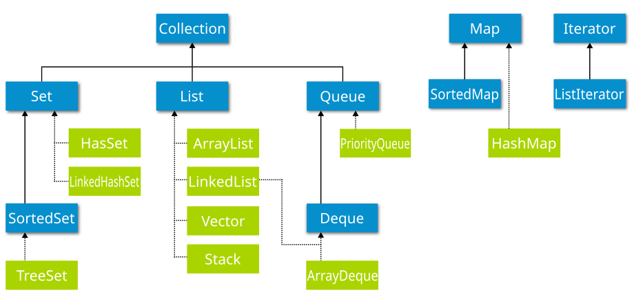
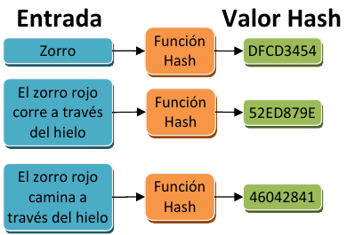
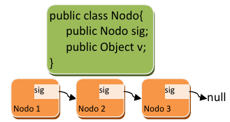
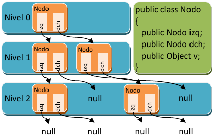
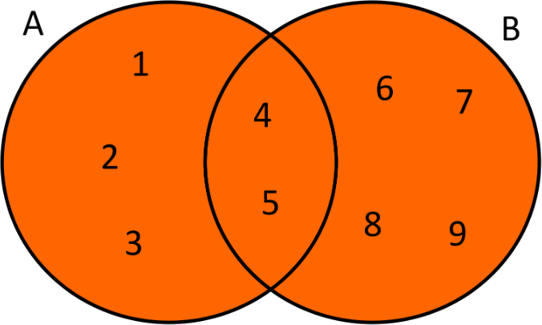
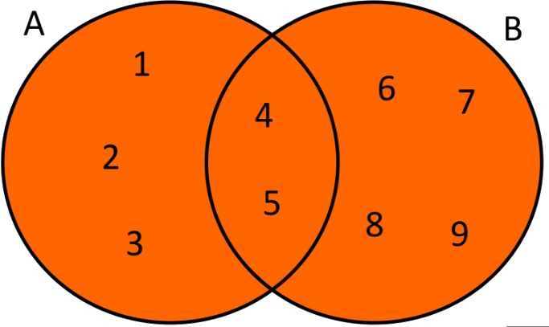
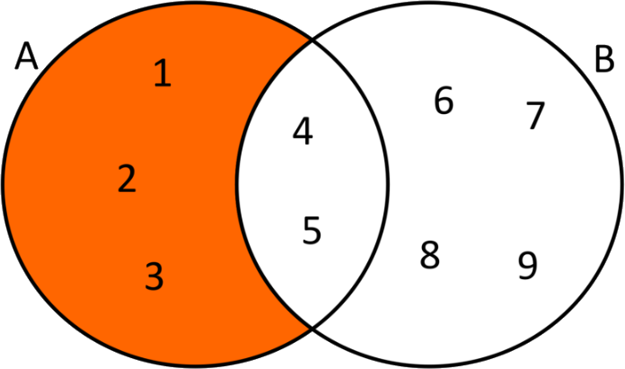
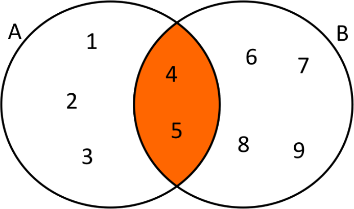

[⬅️ Tornar a l'índex de Programació](../) | [🏠 Portal Principal](../../) | [📘 UT3 Completa](../ut3-tipus-avancats.md) | [🎨 **Obrir versió interactiva Material (amb índex lateral i mode fosc)**](../guia-completa/ut03/ut0306.html)

[⬅️ Anterior: 3.0 RA y Criterios de Evaluación](../ut03/ut03ras.md) | [➡️ Següent: 3.2.1 Uso de arrays unidimensionales](../ut03/ut0301.md)

---

# 3.1 Introducción

## 1. Introducción

    

¿*Qué consideras una colección*? Pues seguramente al pensar en el término se te viene a la cabeza una colección de libros o algo parecido, y la idea no va muy desencaminada. **Una colección a nivel de software es un grupo de elementos almacenados de forma conjunta en una misma estructura**; eso son las **colecciones**.

Las colecciones definen un conjunto de interfaces, clases genéricas y algoritmos que permiten manejar grupos de objetos, todo ello enfocado a potenciar la reusabilidad del software y facilitar las tareas de programación. Te parecerá increíble el tiempo que se ahorra empleando colecciones y cómo se reduce la complejidad del software usándolas adecuadamente. Las colecciones permiten almacenar y manipular grupos de objetos que, a priori, están relacionados entre sí (aunque no es obligatorio que estén relacionados, lo lógico es que si se almacenan juntos es porque tienen alguna relación entre sí), pudiendo trabajar con cualquier tipo de objeto (de ahí que se empleen los genéricos en las colecciones).

Además, las colecciones permiten realizar algunas operaciones útiles sobre los elementos almacenados, tales como búsqueda u ordenación. En algunos casos es necesario que los objetos almacenados cumplan algunas condiciones (que implementen algunas interfaces), para poder hacer uso de estos algoritmos.

Las colecciones son en general elementos de programación que están disponibles en muchos lenguajes de programación. En algunos lenguajes de programación su uso es algo más complejo (como es el caso de C++), pero en Java su uso es bastante sencillo.

Las colecciones en Java parten de una serie de interfaces básicas. Cada interfaz define un modelo de colección y las operaciones que se pueden llevar a cabo sobre los datos almacenados, por lo que es necesario conocerlas. La interfaz inicial, a través de la cual se han construido el resto de colecciones, es la interfaz **`java.util.Collection`**, que define las operaciones comunes a todas las colecciones derivadas.

A continuación se muestran los métodos más importantes definidos por esta interfaz, ten en cuenta que `Collection` es una interfaz genérica donde `<E>` es el parámetro de tipo (podría ser cualquier clase):

| método | descripción |
| --- | --- |
| **`int size()`** | retorna el número de elementos de la colección. |
| **`boolean isEmpty()`** | retornará verdadero si la colección está vacía. |
| **`boolean contains (Object element)`** | retornará verdadero si la colección tiene el elemento pasado como parámetro. |
| **`boolean add(E element)`** | permitirá añadir elementos a la colección. |
| **`boolean remove(Object element)`** | permitirá eliminar elementos de la colección. |
| **`Iterator<E> iterator()`** | permitirá crear un*iterador*para recorrer los elementos de la colección (esto se ve más adelante, no te preocupes). |
| **`Object[] toArray()`** | permite pasar la colección a un*array*de objetos tipo`Object`. |
| **`boolean containsAll(Collection<?> c)`** | permite comprobar si una colección contiene los elementos existentes en otra colección, si es así, retorna verdadero. |
| **`boolean addAll(Collection<?> extends E> c)`** | permite añadir todos los elementos de una colección a otra colección, siempre que sean del mismo tipo (o deriven del mismo tipo base). |
| **`boolean removeAll(Collection<?> c)`** | si los elementos de la colección pasada como parámetro están en nuestra colección, se eliminan, el resto se quedan. |
| **`boolean retainAll(Collection<?> c)`** | si los elementos de la colección pasada como parámetro están en nuestra colección, se dejan, el resto se eliminan. |
| **`void clear()`** | vaciar la colección. |

Más adelante veremos cómo se usan estos métodos, será cuando veamos las implementaciones (clases genéricas que implementan alguna de las interfaces derivadas de la interfaz `Collection`).


<details markdown="1">
<summary><strong>☕ Ejemplo 2.01: utilización de métodos de la interfaz Collection</strong></summary>

Para ello, utilizaremos un `TreeSet`:

```java
package UT07.P2_Collection;

import java.util.TreeSet;
import java.util.Collection;
import java.util.Iterator;

public class EjemploColeccion {
    public static void main(String[] args) {
        // Crear una colección de tipo TreeSet
        Collection<String> nombres = new TreeSet<>();

        // Añadir elementos con add(E element)
        nombres.add("Ana");
        nombres.add("Luis");
        nombres.add("Carlos");

        // Imprimir la colección
        System.out.println("Colección inicial: " + nombres);

        // Tamaño de la colección con size()
        System.out.println("Número de elementos: " + nombres.size());

        // Verificar si está vacía con isEmpty()
        System.out.println("¿Está vacía?: " + nombres.isEmpty());

        // Verificar si contiene un elemento con contains(Object element)
        System.out.println("¿Contiene 'Luis'?: " + nombres.contains("Luis"));

        // Eliminar un elemento con remove(Object element)
        nombres.remove("Carlos");
        System.out.println("Después de eliminar 'Carlos': " + nombres);

        // Convertir la colección en un array con toArray()
        Object[] array = nombres.toArray();
        System.out.print("Elementos convertidos en array: ");
        for (Object item : array) {
            System.out.print(item + " ");
        }
        System.out.println();

        // Crear otra colección
        Collection<String> otrosNombres = new TreeSet<>();
        otrosNombres.add("Ana");
        otrosNombres.add("Pepe");

        // Verificar si contiene todos los elementos de otra colección con containsAll(Collection<?> c)
        System.out.println("¿Contiene todos los elementos de 'otrosNombres'?: " + nombres.containsAll(otrosNombres));

        // Añadir todos los elementos de otra colección con addAll(Collection<?> extends E> c)
        nombres.addAll(otrosNombres);
        System.out.println("Después de añadir 'otrosNombres': " + nombres);

        // Eliminar todos los elementos de otra colección con removeAll(Collection<?> c)
        nombres.removeAll(otrosNombres);
        System.out.println("Después de eliminar 'otrosNombres': " + nombres);

        // Volver a agregar elementos para probar retainAll()
        nombres.add("Ana");
        nombres.add("Pepe");
        nombres.add("Juan");

        // Retener solo los elementos que están en otra colección con retainAll(Collection<?> c)
        nombres.retainAll(otrosNombres);
        System.out.println("Después de retener solo 'otrosNombres': " + nombres);

        // Crear un iterador con iterator()
        Iterator<String> iterador = nombres.iterator();
        System.out.print("Elementos recorridos con iterator(): ");
        while (iterador.hasNext()) {
            System.out.print(iterador.next() + " ");
        }
        System.out.println();

        // Vaciar la colección con clear()
        nombres.clear();
        System.out.println("Después de clear(): " + nombres);
        System.out.println("¿Está vacía ahora?: " + nombres.isEmpty());
    }
}
```

</details>


## 2. Conjuntos (sets)

*¿Con qué relacionarías los conjuntos?* Seguro que con las matemáticas. Los conjuntos son un **tipo de colección que no admite duplicados**, derivados del concepto matemático de conjunto.

La interfaz **`java.util.Set`** define cómo deben ser los conjuntos, e implementa la interfaz `Collection`, aunque **no añade ninguna operación nueva**. Las implementaciones (clases genéricas que implementan la interfaz `Set`) más usadas son las siguientes:

#### 🔄  **java.util.HashSet**

Conjunto que almacena los objetos usando tablas hash (estructura de datos formada básicamente por un array donde la posición de los datos va determinada por una función hash, permitiendo localizar la información de forma extraordinariamente rápida. Los datos están ordenados en la tabla en base a un resumen numérico de los mismos (en hexadecimal generalmente) obtenido a partir de un algoritmo para cálculo de resúmenes, denominadas funciones hash. El resumen no tiene significado para un ser humano, se trata simplemente de un mecanismo para obtener un número asociado a un conjunto de datos. El resumen, de un buen algoritmo hash, no se parece en nada al contenido almacenado) lo cual acelera enormemente el acceso a los objetos almacenados.

**Inconvenientes**:  

- Los datos se ordenan por el resumen obtenido, y no por el valor almacenado, así que no almacenan los objetos de forma ordenada (al contrario, pueden aparecer completamente desordenados).  

- Necesitan bastante memoria.




<details markdown="1">
<summary><strong>☕ Ejemplo 2.02: uso de HashSet</strong></summary>

Para crear un conjunto, simplemente creamos el `HashSet` indicando el tipo de objeto que va a almacenar, dado que es una clase genérica que puede trabajar con cualquier tipo de dato debemos crearlo como sigue (no olvides hacer la importación de **`java.util.HashSet`** primero):

```java
HashSet<Integer> conjunto = new HashSet<Integer>();

HashSet<Integer> conjunto = new HashSet<>();         //a partir de Java 7
```

Después podremos ir almacenando objetos dentro del conjunto usando el método `add` (definido por la interfaz `Set`). Los objetos que se pueden insertar serán siempre del tipo especificado al crear el conjunto:

```java
int n = 10;
if ( !conjunto.add(n) ){
    System.out.println("Número ya en la lista.");
}
```

Si el elemento ya está en el conjunto, el método `add` retornará `false` indicando que no se pueden insertar duplicados. Si todo va bien, retornará `true`.

</details>


<details markdown="1">
<summary><strong>☕ Ejemplo 2.03: uso de HashSet</strong></summary>

Realiza un pequeño programa que pregunte al usuario 5 números diferentes (almacenándolos en un `HashSet`), y que después calcule la suma de los mismos (usando un bucle `for‐each`).  

**Solución**  
   Una solución posible podría ser la siguiente. Fíjate en la solución y verás que el uso de conjuntos ha simplificado enormemente el ejercicio, permitiendo al programador o la programadora centrarse en otros aspectos:

```java
package UT07.P2_Sets;

import java.util.HashSet;
import java.util.Scanner;

public class EjemploHashSet {

    public static void main(String[] args) {
        HashSet<Integer> conjunto = new HashSet<Integer>();
        Scanner teclado = new Scanner(System.in);
        int numero;
        do {
            try {
                System.out.print("Introduce un número " + (conjunto.size() + 1) + ": ");
                numero = teclado.nextInt();
                if (!conjunto.add(numero)) {
                    System.out.println("Número ya en la lista. Introducir otro.");
                }
            } catch (NumberFormatException e) {
                System.out.println("Número erróneo.");
            }
        } while (conjunto.size() < 5);
        // Calcular la suma
        Integer suma = 0;
        for (Integer i : conjunto) {
            suma = suma + i;
        }
        System.out.println("La suma es: " + suma);
    }
}
```

</details>


#### 🔗 **java.util.LinkedHashSet**

Conjunto que almacena objetos combinando tablas hash, para un acceso rápido a los datos, y listas enlazadas (estructura de datos que almacena los objetos enlazándolos entre sí a través de un apuntador de memoria o puntero, manteniendo un orden, que generalmente es el del momento de inserción, pero que puede ser otro. Cada dato se almacena en una estructura llamada **nodo** en la que existe un *campo*, generalmente llamado *siguiente*, que contiene la dirección de memoria del siguiente nodo (con el siguiente dato) para conservar el orden. El orden de almacenamiento es el de inserción, por lo que se puede decir que es una estructura ordenada a medias.

Si no hay siguiente nodo, se indica poniendo nulo (null) en la variable que contiene el siguiente nodo.

Las listas enlazadas tienen un montón de operaciones asociadas en las que no vamos a profundizar: eliminación de un nodo de la lista, inserción de un nodo al final, al principio o entre dos nodos, etc.

Gracias a las colecciones podremos utilizar listas enlazadas sin tener que complicarnos en detalles de programación.

**Inconvenientes**: necesitan bastante memoria y es algo más lenta que `HashSet`.




<details markdown="1">
<summary><strong>☕ Ejemplo 2.04: uso de LinkedHashSet</strong></summary>

```java
package UT07.P2_Sets;

import java.util.LinkedHashSet;

public class EjemploLinkedHashSet {

    public static void main(String[] args) {
        LinkedHashSet<Integer> ls = new LinkedHashSet<>();
        ls.add(4);
        ls.add(3);
        ls.add(1);
        ls.add(99);
        for (Integer item : ls) {
            System.out.print(item + " ");
        }
    }
}
```

Al ser un LinkedHashSet, los valores salen ordenados según el momento de inserción en el conjunto).

Resultado mostrado por pantalla:

```java
4 3 1 99
```

</details>


#### 🌲 **java.util.TreeSet**

Conjunto que almacena los objetos usando unas estructuras conocidas como árboles rojo‐negro. Son más lentas que los dos tipos anteriores. pero tienen una gran ventaja: los datos almacenados se ordenan por valor. Es decir, que aunque se inserten los elementos de forma desordenada, internamente se ordenan dependiendo del valor de cada uno.

La estructura `TreeSet` internamente árboles. Los árboles son como las listas pero mucho más complejos. En vez de tener un único elemento siguiente, pueden tener dos o más elementos siguientes, formando estructuras organizadas y jerárquicas.

Los nodos se diferencian en dos tipos: nodos padre y nodos hijo; un nodo padre puede tener varios nodos hijo asociados (depende del tipo de árbol), dando lugar a una estructura que parece un árbol invertido (de ahí su nombre).

En la figura de abajo se puede apreciar un árbol donde cada nodo puede tener dos hijos, denominados izquierdo (izq) y derecho (dch). Puesto que un nodo hijo puede también ser padre a su vez, los árboles se suelen visualizar para su estudio por niveles para entenderlos mejor, donde cada nivel contiene hijos de los nodos del nivel anterior, excepto el primer nivel (que no tiene padre).

  

Los árboles son estructuras complejas de manejar y que permiten operaciones muy sofisticadas. Los árboles usados en los `TreeSet`, los árboles rojo‐negro, son árboles auto-ordenados, es decir, que al insertar un elemento, este queda ordenado por su valor de forma que al recorrer el árbol, pasando por todos los nodos, los elementos salen ordenados. El ejemplo mostrado en la imagen es simplemente un árbol binario, el más simple de todos.


<details markdown="1">
<summary><strong>☕ Ejemplo 2.05: uso de TreeSet</strong></summary>

```java
package UT07.P2_Sets;

import java.util.TreeSet;

public class EjemploTreeSet {

    public static void main(String[] args) {
        TreeSet<Integer> ts = new TreeSet<>();
        ts.add(4);
        ts.add(3);
        ts.add(1);
        ts.add(99);
        for (Integer item : ts) {
            System.out.print(item + " ");
        }
    }
```

Al ser un TreeSet el resultado sale ordenado por valor.

Resultado mostrado por pantalla:

```java
1 3 4 99
```

</details>


| Característica | 🔄**HashSet** | 🔗**LinkedHashSet** | 🌲**TreeSet** |
| --- | --- | --- | --- |
| **Orden de elementos** | No mantiene orden | Mantiene orden de inserción | **Ordenado de forma natural** |
| **Velocidad de búsqueda** | **Muy rápida (O(1))** | Rápida (O(1)) | Más lenta (O(log n)) |
| **Velocidad de inserción** | **Muy rápida (O(1))** | Rápida (O(1)) | Más lenta (O(log n)) |
| **Uso de memoria** | **Bajo** | Alto (por la lista enlazada) | Alto (por la estructura de árbol) |
| **Uso recomendado** | Cuando la velocidad es prioridad y no importa el orden | Cuando se necesita orden de inserción | Cuando se necesita ordenar automáticamente los elementos |
| **Estructura interna** | Tabla Hash | Tabla Hash + Lista enlazada | Árbol rojo-negro |

### 2.2.  Acceso

Y ahora te preguntarás, *¿cómo accedo a los elementos almacenados en un conjunto?* Para obtener los elementos almacenados en un conjunto **hay que usar iteradores**, que permiten obtener los elementos del conjunto uno a uno de forma secuencial (no hay otra forma de acceder a los elementos de un conjunto, es su inconveniente).

Los iteradores se ven en mayor profundidad más adelante, de momento, vamos a usar iteradores de forma transparente, a través de una estructura `for` especial, denominada bucle **`for-each`** o bucle "*para cada*". En el siguiente código se usa un bucle *foreach*, en él la variable i va tomando todos los valores almacenados en el conjunto hasta que llega al último:

```java
for (Integer item: conjunto) {
    System.out.println("Elemento almacenado:" + item);
}
```

### 2.3. Operar con elementos

¿Cómo podría copiar los elementos de un conjunto de uno a otro? ¿Hay que usar un bucle for y recorrer toda la lista para ello? ¡Qué va! Para facilitar esta tarea, los conjuntos, y las colecciones en general, facilitan un montón de operaciones para poder combinar los datos de varias colecciones. Ya se vieron en un apartado anterior, aquí simplemente vamos poner un ejemplo de su uso.

Partimos del siguiente ejemplo, en el que hay dos colecciones de diferente tipo, cada una con 4 números enteros:

    

```java
TreeSet<Integer> a = new TreeSet<Integer>();
a.add(1); a.add(2); a.add(3); a.add(4); a.add(5);           // a: 1, 2, 3, 4 y 5

LinkedHashSet<Integer> b = new LinkedHashSet<Integer>();
b.add(4); b.add(5); b.add(6); b.add(7); b.add(8); b.add(9); // b: 4, 5, 6, 7, 8 y 9
```

En el ejemplo anterior, el literal de número se convierte automáticamente a la clase envoltorio `Integer` sin tener que hacer nada, lo cual es una ventaja. Veamos las formas de combinar ambas colecciones:

- **Unión**. Añadir todos los elementos del conjunto **b** en el conjunto **a**.

```java
 a.addAll(b);
```

       
   

En el conjunto **`a`** estarán todos los del conjunto **a**, añadiendo los del **b**, pero sin repetir los que ya están (4, 5):

```java
1, 2, 3, 4, 5, 6, 7, 8, 9, 10
```

- **Diferencia**. Eliminar los elementos del conjunto **b** que puedan estar en el conjunto **a**.

```java
 a.removeAll(b);
```

       
   

En el conjunto **`a`** estarán todos los elementos del conjunto **a**, que no estén en el conjunto **b**:

```java
1, 2, 3
```

- **Intersección**. Retiene los elementos comunes a ambos conjuntos.

```java
 a.retainAll(b);
```

       
   

En el conjunto **`a`** estarán todos los elementos del conjunto **a**, que también están en el conjunto **b**:

```java
4, 5
```


> 📝 **Recuerda**
>
> Estas operaciones son comunes a todas las colecciones.


<details markdown="1">
<summary><strong>☕ Ejemplo 2.06: operaciones en conjuntos (sets)</strong></summary>

```java
package UT07.P2_Sets;

import java.util.Collection;
import java.util.LinkedHashSet;
import java.util.TreeSet;

public class EjemploSets {

    private static void imprimirColeccion(Collection<?> c) {
        for (Object item : c) {
            System.out.print(item.toString() + " ");
        }
        System.out.println("");
    }

    public static void main(String[] args) {
        TreeSet<Integer> conjuntoA = new TreeSet<>();
        conjuntoA.add(1);
        conjuntoA.add(2);
        conjuntoA.add(3);
        conjuntoA.add(4);
        conjuntoA.add(5); // Elementos del conjunto A: 1, 2, 3, 4, 5

        LinkedHashSet<Integer> conjuntoB = new LinkedHashSet<>();
        conjuntoB.add(4);
        conjuntoB.add(5);
        conjuntoB.add(6);
        conjuntoB.add(7); 
        conjuntoB.add(8); 
        conjuntoB.add(9); // Elementos del conjunto B: 4, 5, 6, 7, 8 y 9

        conjuntoA.addAll(conjuntoB);
        imprimirColeccion(conjuntoA); // Unión: 1 2 3 4 5 6 7 8 9

        conjuntoA.removeAll(conjuntoB);
        imprimirColeccion(conjuntoA); // Diferencia: 1 2 3

        //recolocamos todo como al principio
        conjuntoA.add(4);
        conjuntoA.add(5);
        conjuntoA.add(6);

        conjuntoA.retainAll(conjuntoB);
        imprimirColeccion(conjuntoA); // Intersección: 4 5

    }
}
```

</details>


### 2.4. Ordenación

Por defecto, los `TreeSet` ordenan sus elementos de forma ascendente, pero, ¿*se podría cambiar el orden de ordenación*? Los `TreeSet` tienen un conjunto de operaciones adicionales, además de las que incluye por el hecho de ser un conjunto, que permite entre otras cosas, cambiar la forma de ordenar los elementos. Esto es especialmente útil cuando el tipo de objeto que se almacena no es un simple número, sino algo más complejo (un artículo por ejemplo). **`TreeSet` es capaz de ordenar tipos básicos (números, cadenas y fechas) pero otro tipo de objetos no puede ordenarlos con tanta facilidad**.

Para indicar a un `TreeSet` cómo tiene que ordenar los elementos, debemos decirle cuándo un elemento va antes o después que otro, y cuándo son iguales. Para ello, **utilizamos la interfaz genérica** **`java.util.Comparator`**, usada en general en algoritmos de ordenación, como veremos más adelante.

Se trata de crear una clase que implemente dicha interfaz, así de fácil. Dicha interfaz requiere de un único método que debe calcular si un objeto pasado por parámetro es mayor, menor o igual que otro del mismo tipo. Veamos un ejemplo general de cómo implementar un comparador para una hipotética clase `Objeto`:

```java
class ComparadorDeObjetos implements Comparator<Objeto> {

    public int compare(Objeto o1, Objeto o2) { 
        // ... implementación del método compare
    }
}
```

La interfaz `Comparator` obliga a implementar un único método, es el método `compare` , el cual tiene dos parámetros: los dos elementos a comparar. Las reglas son sencillas, a la hora de personalizar dicho método:

- Si el primer objeto (o1) **<** el segundo (o2), debe retornar un número **entero negativo**.
- Si el primer objeto (o1) **>** el segundo (o2), debe retornar un número **entero positivo**.
- Si ambos son iguales, debe retornar **0**.

A veces, cuando el orden que deben tener los elementos es diferente al orden real (por ejemplo cuando ordenamos los números en orden inverso), la definición de antes puede ser un poco liosa, así que es recomendable en tales casos pensar de la siguiente forma:

- Si el primer objeto (o1) debe ir antes que el segundo objeto (o2), retornar entero negativo.
- Si el primer objeto (o1) debe ir después que el segundo objeto (o2), retornar entero positivo.
- Si ambos son iguales, debe retornar 0.

Una vez creado el comparador simplemente tenemos que pasarlo como parámetro en el momento de la creación al `TreeSet` , y los datos internamente mantendrán dicha ordenación:

```java
TreeSet<Objeto> ts = new TreeSet<Objeto>(new ComparadorDeObjetos());
```


> 📝 **Otra forma de ordenación**
>
> Hay otra manera de definir esta ordenación, pero lo estudiaremos más a fondo en el punto **7.4 Comparadores**.


<details markdown="1">
<summary><strong>☕ Ejemplo 2.07: uso interfaz genérica Comparator</strong></summary>

=== "Clase Estudiante"
    ```java
    package UT07.P2_Comparator;

    import java.io.*;
    import java.util.*;

    class Estudiante {
      private int id;
      private String nombre;

      public Estudiante(int valor, String nombre) {
        this.id = valor;
        this.nombre = nombre;
      }

      public String getNombre() {
        return this.nombre;
      }

      public int getId() {
        return this.id;
      }
    }

    // Comparador mediante atributo entero
    class IdComparator implements Comparator<Estudiante> {
      public int compare(Estudiante e1, Estudiante e2) {
        return e1.getId()-e2.getId();
      }
    }
    // Comparador mediante atributo String 
    class NombreComparator implements Comparator<Estudiante> {
      public int compare(Estudiante e1, Estudiante e2) {
        return e1.getNombre().compareTo(e2.getNombre());
      }
    }
    ```

=== "Clase TestEstudiante"
    ```java
    package UT07.P2_Comparator;

    class TestEstudiante {

      public static void main (String[] args){
        // Crear TreeSet con Comparador con objeto Estudiante
        TreeSet<Estudiante> tsId = new TreeSet<Estudiante>(new IdComparator());

        tsId.add(new Estudiante(450,"Laura"));
        tsId.add(new Estudiante(341,"Esther"));
        tsId.add(new Estudiante(134,"Daniel"));
        tsId.add(new Estudiante(590,"Jorge"));

        System.out.println("Ordenación por marca:");
        for(Estudiante elemento : tsId) {
        System.out.print(elemento.getNombre()+"\t"+elemento.getId());
           System.out.println();
        }  

        System.out.println();
        TreeSet<Estudiante> tsNombre= new TreeSet<Estudiante>(new NombreComparator());

        tsNombre.add(new Estudiante(450,"Laura"));
        tsNombre.add(new Estudiante(341,"Esther"));
        tsNombre.add(new Estudiante(134,"Daniel"));
        tsNombre.add(new Estudiante(590,"Jorge"));

        System.out.println("Ordenación por nombre:");
        for(students elemento : tsNombre) {
           System.out.print(elemento.getNombre() +"\t"+ elemento.getId());
           System.out.println();
        }
      }
    }
    ```

=== "Salida"
    ```java
    Ordenación por marca:
    Daniel  134
    Esther  341
    Laura   450
    Jorge   590

    Ordenación por nombre:
    Daniel  134
    Esther  341
    Jorge   590
    Laura   450
    ```

</details>


---

## 3. Listas

    

¿*En qué se diferencia una lista de un conjunto*? Las listas son elementos de programación un poco más avanzados que los conjuntos. Su ventaja es que amplían el conjunto de operaciones de las colecciones añadiendo operaciones extra. Veamos algunas de ellas:

- Sí **pueden almacenar duplicados**. Si no queremos duplicados, hay que verificar manualmente que el elemento no esté en la lista antes de su inserción.
- **Acceso posicional**. Podemos acceder a un elemento indicando su posición en la lista.
- **Búsqueda**. Es posible buscar elementos en la lista y obtener su posición. En los conjuntos, al ser colecciones sin aportar nada nuevo, solo se podía comprobar si un conjunto contenía o no un elemento, retornando verdadero o falso. Las listas mejoran este aspecto.
- **Extracción de sublistas**. Es posible obtener una lista que contenga solo una parte de los elementos de forma muy sencilla.

En Java, para las listas se dispone de una interfaz llamada **`java.util.List`**, y dos implementaciones (**`java.util.LinkedList`** y **`java.util.ArrayList`**), con diferencias significativas entre ellas. Los métodos de la interfaz **`List`**, que obviamente estarán en todas las implementaciones, y que permiten las operaciones anteriores son:

| método | descripción |
| --- | --- |
| **`E get(int index)`** | el método`get`permite obtener un elemento partiendo de su posición (index). |
| **`E set(int index, E element)`** | el método`set`permite cambiar el elemento almacenado en una posición de la lista (index), por otro (element). |
| **`void add(int index, E element)`** | se añade otra versión del método`add`, en la cual se puede insertar un elemento (element) en la lista en una posición concreta (index), desplazando los existentes. |
| **`E remove(int index)`** | se añade otra versión del método`remove`, esta versión permite eliminar un elemento indicando su posición en la lista (desplazando los existentes a izquierda). |
| **`boolean addAll(int index, Collection<? extends E> c)`** | se añade otra versión del método`addAll`, que permite insertar una colección pasada por parámetro en una posición de la lista, desplazando el resto de elementos. |
| **`int indexOf(Object o)`** | el método`indexOf`permite conocer la posición (índice) de un elemento, si dicho elemento no está en la lista retornará`‐1`. |
| **`int lastIndexOf(Object o)`** | el método`lastIndexOf`nos permite obtener la última ocurrencia del objeto en la lista (dado que la lista sí puede almacenar duplicados). |
| **`List<E> subList(int from, int to)`** | el método`subList`genera una sublista (una vista parcial de la lista) con los elementos comprendidos entre la posición inicial (incluida) y la posición final (no incluida). |


> ⚠️ **A tener en cuenta sobre List**
>
> Ten en cuenta que los elementos de una lista empiezan a numerarse por *0*. Es decir, que el primer elemento de la lista es el *0*.  
>
> Ten en cuenta también que `List` es una interfaz genérica, por lo que `<E>` corresponde con el tipo base usado como parámetro genérico al crear la lista.


### 3.1. Uso

Y, ¿*cómo se usan las listas*? Pues para usar una lista haremos uso de sus implementaciones **`LinkedList`** y **`ArrayList`**. Veamos un ejemplo de su uso y después obtendrás respuesta a esta pregunta.


<details markdown="1">
<summary><strong>☕ Ejemplo 2.08: uso de clase LinkedList (válido también para ArrayList)</strong></summary>

Antes de nada no olvides importar las clases `java.util.LinkedList` y `java.util.ArrayList` según sea necesario. 
En este ejemplo se usan los métodos de acceso posicional a la lista:

```java
// declaración y creación del LinkedList de enteros.
LinkedList<Integer> ll = new LinkedList<>();

ll.add(1);   // añade un elemento al final de la lista.
ll.add(3);   // añade otro elemento al final de la lista.

ll.add(1,2); // añade en la posición 1 el elemento 2.

// suma los valores contenidos en la posición 1 y 2, y lo agrega al final.
ll.add(ll.get(1) + ll.get(2)); 

ll.remove(0); // elimina el primer elementos de la lista.

// contenido final de la lista:
// recorrer la colección:
for (Integer elemento: ll){
    System.out.print(elemento + " ");
}
// devuelve: 2 3 5
```

</details>


<details markdown="1">
<summary><strong>☕ Ejemplo 2.09: uso de ArrayList, obtener posición de elemento en la lista</strong></summary>

```java
ArrayList<Integer> al = new ArrayList<>(); // declaración y creación del ArrayList de enteros.

al.add(10); 
al.add(11); // añadimos dos elementos a la lista.

al.set(al.indexOf(11), 12); // sustituimos el 11 por el 12, primero lo buscamos y luego lo reemplazamos.
```

En el ejemplo anterior, se emplea tanto el método `indexOf` para obtener la posición de un elemento, como el método `set` para reemplazar el valor en una posición, una combinación muy habitual.

El ejemplo anterior generará un `ArrayList` que contendrá dos números, el 10 y el 12.

</details>


<details markdown="1">
<summary><strong>☕ Ejemplo 2.10: uso ArrayList, más complejo</strong></summary>

```java
al.addAll(0, ll.subList(1, ll.size()));
```


> 🚨 **Cuidado**
>
> `subList` ==> Devuelve una vista de la porción de esta lista entre el especificado `fromIndex`, inclusive, y `toIndex`, exclusivo ([API de Java](https://docs.oracle.com/javase/8/docs/api/java/util/List.html#subList-int-int-)).


Este ejemplo es especial porque usa sublistas. Se usa el método `size` para obtener el tamaño de la lista. Después el método `subList` para extraer una sublista de la lista (que incluía en origen los números 2, 3 y 5), desde la posición 1 hasta el final de la lista (lo cual dejaría fuera al primer elemento). Y por último, se usa el método `addAll` para añadir todos los elementos de la sublista al `ArrayList` anterior desde su posición 0. Y quedaría:

```java
3, 5, 10 y 12.
```

Debes saber que las operaciones aplicadas a una sublista repercuten sobre la lista original. Por ejemplo, si ejecutamos el método `clear` sobre una sublista, se borrarán todos los elementos de la sublista, pero también se borrarán dichos elementos de la lista original:

```java
al.subList(0, 2).clear();
```

Lo mismo ocurre al añadir un elemento, se añade en la sublista y en la lista original.

</details>


<details markdown="1">
<summary><strong>☕ Ejemplo 2.11: uso de LinkedList y ArrayList</strong></summary>

```java
package UT07.P2_Lists;

import java.util.ArrayList;
import java.util.Collection;
import java.util.LinkedList;

public class EjemploListas2 {

    // método para imprimir colecciones:
    private static void imprimirColeccion(Collection<?> c) {
        for (Object elemento : c) {
            System.out.print(elemento.toString() + " ");
        }
        System.out.println("");
    }

    public static void main(String[] args) {
      LinkedList<Integer> ll = new LinkedList<>(); //declaración+creación LinkedList
      ll.add(1);        //añade un elemento al final de la lista
      ll.add(3);        //añade otro elemento al final de la lista
      ll.add(1, 2);     //añade en la posición 1 el elemento 2
      ll.add(t.get(1) + ll.get(2)); //suma contendio de posición 1 y 2, y agrega al final
      ll.remove(0);     //elimina el primer elementos de la lista
      imprimirColeccion(ll); //2 3 5 

      ArrayList<Integer> al = new ArrayList<>(); //declaración+creación ArrayList
      al.add(10);
      al.add(11);   //añadimos dos elementos a la lista.
      al.set(al.indexOf(11), 12); //sustituimos el 11 por el 12, primero lo buscamos y luego lo reemplazamos.

      al.addAll(0, t.subList(1, t.size()));
      imprimirColeccion(al); //3 5 10 12 

      al.subList(0, 2).clear();
      imprimirColeccion(al); //10 12 
    }
}
```

</details>


### 3.2. `LinkedList` y `ArrayList`

¿*Y en qué se diferencia un* `LinkedList` *de un* `ArrayList` ?

#### 🔗 LinkedList

Utilizan listas doblemente enlazadas, que son listas enlazadas (como se vió en un apartado anterior), pero que permiten ir hacia atrás en la lista de elementos. Los elementos de la lista se encapsulan en los llamados nodos.

Los nodos van enlazados unos a otros para no perder el orden y no limitar el tamaño de almacenamiento. Tener un doble enlace significa que en cada nodo se almacena la información de cuál es el siguiente nodo y además, de cuál es el nodo anterior. Si un nodo no tiene nodo siguiente o nodo anterior, se almacena `null`(o nulo) para ambos casos.

#### 🔢 ArrayList

Estos se implementan utilizando arrays que se van redimensionando conforme se necesita más espacio o menos. La redimensión es transparente a nosotros, no nos enteramos cuándo se produce, pero eso redunda en una diferencia de rendimiento notable dependiendo del uso. Los **ArrayList** son más rápidos en cuanto a acceso a los elementos, acceder a un elemento según su posición es más rápido en un array que en una lista doblemente enlazada (hay que recorrer la lista). En cambio, eliminar un elemento implica muchas más operaciones en un array que en una lista enlazada de cualquier tipo.

¿*Y esto qué quiere decir*? Que si se van a realizar muchas operaciones de eliminación de elementos sobre la lista, conviene usar una lista enlazada (`LinkedList`), pero si no se van a realizar muchas eliminaciones, sino que solamente se van a insertar y consultar elementos por posición, conviene usar una lista basada en arrays redimensionados (`ArrayList` ).

| Característica | 🔗**LinkedList** | 🔢**ArrayList** |
| --- | --- | --- |
| **Estructura** | Lista doblemente enlazada (nodos con referencias al anterior y siguiente). | Array redimensionable (elementos contiguos en memoria). |
| **Acceso a elementos** | **Lento**(O(n)), hay que recorrer la lista. | **Rápido**(O(1)), acceso directo por índice. |
| **Inserción/Eliminación** | **Rápida**(O(1) si se tiene el nodo, O(n) si hay que buscarlo). | **Lenta**(O(n)), ya que hay que desplazar elementos. |
| **Uso de memoria** | Más memoria por referencias adicionales (`next`y`prev`). | Menos memoria, solo almacena los datos. |
| **Redimensionamiento** | No necesita, se expande dinámicamente sin copias. | Puede requerir redimensionamiento y copia de datos. |
| **Ideal para...** | Muchas inserciones/eliminaciones en el medio de la lista. | Muchas consultas y acceso rápido a elementos por índice. |
| **Interfaces adicionales** | Implementa`Queue`y`Deque`(uso como pila o cola). | No implementa`Queue`ni`Deque`. |

`LinkedList` tiene otras ventajas que nos puede llevar a su uso. Implementa las interfaces `java.util.Queue` y `java.util.Deque`. Dichas interfaces permiten hacer uso de las listas como si fueran una cola de prioridad o una pila, respectivamente.

#### ➡️ colas

También conocidas como colas de prioridad, son una lista pero que aportan métodos para trabajar de forma diferente. ¿*Tú sabes lo que es hacer cola para que te atiendan en una ventanilla*? Pues igual. Se trata de que el primero que llega es el primero en ser atendido (`FIFO`, *First In First Out* en inglés). Simplemente se aportan tres métodos nuevos:

| método | descripción |
| --- | --- |
| **`boolean add(E e)`**y**`boolean offer(E e)`** | retornarán true si se ha podido insertar el elemento al final de la`LinkedList`. |
| **`E poll()`** | retornará el primer elemento de la`LinkedList`y lo eliminará de la misma. Al insertar al final, los elementos más antiguos siempre están al principio. Retornará null si la lista está vacía. |
| **`E peek()`** | retornará el primer elemento de la`LinkedList`pero no lo eliminará, permite examinarlo. Retornará null si la lista está vacía. |

Dichos métodos están disponibles en las listas enlazadas `LinkedList` .

#### 📚 pilas

Mucho menos usadas, son todo lo contrario a las listas. Una pila es igual que una montaña de libros o de hojas en blanco, para añadir libros/hojas nuevas se ponen encima del resto, y para retirar una se coge la primera que hay encima de todas. En las pilas el último en llegar es el primero en ser atendido (`LIFO`, *Last In First Out* en inglés). Para ello se proveen de tres métodos:

| **Método** | **Descripción** | **Ejemplo de Uso** | **Resultado** |
| --- | --- | --- | --- |
| **`void push(E item)`** | Agrega un elemento en la parte superior de la pila. | `stack.push(10);` | Inserta`10`en la pila. |
| **`E pop()`** | Elimina y devuelve el elemento en la parte superior de la pila. | `int x = stack.pop();` | Extrae y devuelve el último elemento insertado. Si la pila está vacía, lanza`EmptyStackException`. |
| **`E peek()`** | Muestra el elemento en la parte superior sin eliminarlo. | `int y = stack.peek();` | Devuelve el elemento en la cima sin modificar la pila. Si la pila está vacía, lanza`EmptyStackException`. |


<details markdown="1">
<summary><strong>☕ Ejemplo 2.12: uso Stack (pila)</strong></summary>

```java
import java.util.Stack;

public class EjemploStack {
    public static void main(String[] args) {
        Stack<Integer> stack = new Stack<>();

        // Agregar elementos a la pila
        stack.push(10);
        stack.push(20);
        stack.push(30);

        System.out.println("Elemento en la cima: " + stack.peek()); // 30
        System.out.println("Elemento eliminado: " + stack.pop());  // 30
        System.out.println("Elemento en la cima después de pop: " + stack.peek()); // 20
    }
}
```

</details>


Las pilas se usan menos y haremos menos hincapié en ellas. Simplemente ten en mente que, tanto las colas como las pilas, son una lista enlazada sobre la que se hacen operaciones especiales.

### 3.3. A tener en cuenta

No es lo mismo usar las colecciones (listas y conjuntos) con objetos inmutables (`Strings`, `Integer`, etc.) que con objetos mutables. Los objetos inmutables no pueden ser modificados después de su creación, por lo que cuando se incorporan a la lista, a través de los métodos `add` , se pasan por copia (es decir, se realiza una copia de los mismos). En cambio los objetos mutables (como las clases que tú puedes crear), no se copian, y eso puede producir efectos no deseados.

Imagínate la siguiente clase, que contiene un número:

```java
class Test {
    public Integer num;
    Test (int num) {
        this.num = new Integer(num); 
    }
}
```

La clase de antes es mutable, por lo que no se pasa por copia a la lista. Ahora imagina el siguiente código en el que se crea una lista que usa este tipo de objeto, y en el que se insertan dos objetos:

```java
Test p1 = new Test(11); // se crea un objeto Test donde el entero que contiene vale 11.
Test p2 = new Test(12); // se crea otro objeto Test donde el entero que contiene vale 12.
LinkedList<Test> lista = new LinkedList<Test>(); // creamos una lista enlazada para objetos tipo Test.

lista.add(p1); // añadimos el primero objeto test.
lista.add(p2); // añadimos el segundo objeto test.

for (Test p:lista){
    System.out.println(p.num); // mostramos la lista de objetos.
}
```

¿*Qué mostraría por pantalla el código anterior*? Simplemente mostraría los números 11 y 12.

Ahora bien, ¿*qué pasa si modificamos el valor de uno de los números de los objetos test*? ¿*Qué se mostrará al ejecutar el siguiente código*?

```java
p1.num = 44;

for (Test p:lista){
    System.out.println(p.num);
}
```

El resultado de ejecutar el código anterior es que se muestran los números 44 y 12. El número ha sido modificado y no hemos tenido que volver a insertar el elemento en la lista para que en la lista se cambie también. Esto es porque en la lista no se almacena una copia del objeto Test, sino un apuntador a dicho objeto (solo hay una copia del objeto a la que se hace referencia desde distintos lugares).


> 📝 **Cita**
>
> *Controlar la complejidad es la esencia de la programación.* [Brian Kernighan](https://es.wikipedia.org/wiki/Brian_Kernighan)


<details markdown="1">
<summary><strong>☕ Ejemplo 2.13: uso de ArrayList</strong></summary>

Tenemos la clase `Producto` con:

- Dos atributos: *nombre* (`String`) y *cantidad* (`int`).
- Un constructor con parámetros.
- Un constructor sin parámetros.
- Métodos `get` y `set` asociados a los atributos.

=== "Producto.java"
    ```java
    package UT07.P2_Lists;

    public class Producto {

      //Atributos
      private String nombre;
      private int cantidad;

      //Métodos
      //Constructor con parámetros donde asignamos el valor dado a los atributos
      public Producto(String nombre, int cantidad) {
        this.nombre = nombre;
        this.cantidad = cantidad;
      }

      //Constructor sin parámetros donde inicializamos los atributos
      public Producto() {
        //La palabra reservada null se utiliza para inicializar los objetos,
        //indicando que el puntero del objeto no apunta a ninguna dirección
        //de memoria. No hay que olvidar que String es una clase.
        this.nombre = null;
        this.cantidad = 0;
      }

      //Metodo get y set
      public String getNombre() {
        return nombre;
      }

      public void setNombre(String nombre) {
        this.nombre = nombre;
      }

      public int getCantidad() {
        return cantidad;
      }

      public void setCantidad(int cantidad) {
        this.cantidad = cantidad;
      }
    }
    ```

=== "Clase Ejemplo06.java"
    En el programa principal creamos una lista de productos y realizamos operaciones sobre ella:

    ```java
    package UT07.P2_Lists;

    import java.util.ArrayList;

    public class EjemploListas {

      public static void main(String[] args) {

        //Definimos 5 instancias de la clase Producto
        Producto p1 = new Producto("Pan", 6);
        Producto p2 = new Producto("Leche", 2);
        Producto p3 = new Producto("Manzanas", 5);
        Producto p4 = new Producto("Brocoli", 2);
        Producto p5 = new Producto("Carne", 2);

        //Definir un ArrayList
        ArrayList<Producto> lista = new ArrayList<>();

        //Colocar instancias de producto en ArrayList
        lista.add(p1);
        lista.add(p2);
        lista.add(p3);
        lista.add(p4);

        //Añadimos "Carne" en la posición 1 de la lista
        lista.add(1, p5);

        //Añadimos "Carne" en la última posición
        lista.add(p5);

        //Imprimir el contenido del ArrayList
        System.out.println(" - Lista con " + lista.size() + " elementos");

        for (Producto p : lista) {
          System.out.println(p.getNombre() + " : " + p.getCantidad());
        }

        p5.setCantidad(99); //cambiamos la cantidad al producto, ¿cambiará la lista?

        ((Producto)lista.get(1)).setCantidad(66);

        System.out.println(p5.getCantidad());

        //Imprimir el contenido del ArrayList
        System.out.println(" - Lista con " + lista.size() + " elementos");

        for (Producto p : lista) {
           System.out.println(p.getNombre() + " : " + p.getCantidad());
        }

        //Eliminar todos los valores del ArrayList
        lista.clear();
        System.out.println(" - Lista final con " + lista.size() + " elementos");
      }
    }
    ```

</details>


---

## 4. Mapas - conjuntos de pares [clave/valor]

¿*Cómo almacenarías los datos de un diccionario*? Tenemos por un lado cada palabra y por otro su significado. Para resolver este problema existen precisamente los arrays asociativos. Un tipo de array asociativo son los **mapas** o diccionarios, que permiten almacenar pares de valores conocidos como *clave* y *valor*. La clave se utiliza para acceder al valor, como una entrada de un diccionario permite acceder a su definición.

En Java existe la interfaz **`java.util.Map`** que define los métodos que deben tener los mapas, y existen tres implementaciones principales de dicha interfaz: 🔀 **`java.util.HashMap`**, 🌳 **`java.util.TreeMap`** y 🔗 **`java.util.LinkedHashMap`**. ¿*Te suenan*? Claro que sí. Cada una de ellas, respectivamente, tiene características similares a `HashSet` , `TreeSet` y `LinkedHashSet` , tanto en funcionamiento interno como en rendimiento.

Los mapas utilizan clases genéricas para dar extensibilidad y flexibilidad, y permiten definir un tipo base para la clave, y otro tipo diferente para el valor. Veamos un ejemplo de cómo crear un mapa, que es extensible a los otros dos tipos de mapas:

```java
HashMap<String,Integer> t = new HashMap<>();
```

El mapa anterior permite usar cadenas como llaves y almacenar de forma asociada a cada llave, un número entero. Veamos los métodos principales de la interfaz `Map`, disponibles en todas las implementaciones. En los ejemplos, `V` es el tipo base usado para el valor (`Value`) y `K` el tipo base usado para la llave (`Key`):

| Método. | Descripción. |
| --- | --- |
| `V put(k key, v value);` | Inserta un par de objetos llave (key) y valor (value) en el mapa. Si la llave ya existe en el mapa, entonces retornará el valor asociado que tenía antes, si la llave no existía, entonces retornará null. |
| `V get(Object key);` | Obtiene el valor asociado a una llave ya almacenada en el mapa. Si no existe la llave, retornará null. |
| `V remove(Object key);` | Elimina la llave y el valor asociado. Retorna el valor asociado a la llave, por si lo queremos utilizar para algo, o null, si la llave no existe. |
| `boolean containsKey(Object key);` | Retornará true si el mapa tiene almacenada la llave pasada por parámetro, false en cualquier otro caso. |
| `boolean containsValue(Object value);` | Retornará true si el mapa tiene almacenado el valor pasado por parámetro, false en cualquier otro caso. |
| `int size();` | Retornará el número de pares llave y valor almacenado en el mapa. |
| `boolean isEmpty();` | Retornará true si el mapa está vacío, false en cualquier otro caso. |
| `void clear();` | Vacía el mapa. |


<details markdown="1">
<summary><strong>☕ Ejemplo 2.14: uso de HashMap</strong></summary>

```java
package UT07.P2_Maps;

import java.util.HashMap;

public class EjemploMaps {

  public static void main(String[] args) {
     HashMap<String, Integer> hm = new HashMap<>();

     //Insertamos un solo elemento A con valor 1
     hm.put("A", 1);

     //Busqueda por clave
     if (hm.containsKey("A")) {
       System.out.printf("Contiene la clave A. Su valor es: %d\n", hs.get("A"));
     }

     //Busqueda por valor
     if (hm.containsValue(0)) {
       System.out.println("Contiene el valor 0");
     }

     //Eliminar el elemento con clave A
     hm.remove("A");

     //Ahora añadimos varios elementos para imprimirlos
     hm.put("A", 1);
     hm.put("E", 12);
     hm.put("I", 15);
     hm.put("O", 0);
     hm.put("U", 0);

     //Recorremos el mapa y lo imprimimos
     for (String elemento : hm.keySet()) {
        System.out.printf( "Clave: %s. Valor: %d\n",
                            elemento, 
                            hm.get(elemenoto) );
     }
  }
}
```

</details>


> 🎬 **Un poquito de ...**
>


---

[⬅️ Anterior: 3.0 RA y Criterios de Evaluación](../ut03/ut03ras.md) | [➡️ Següent: 3.2.1 Uso de arrays unidimensionales](../ut03/ut0301.md) | [📑 Índex de Programació](../) | [🎨 Versió Web Material](../guia-completa/ut03/ut0306.html)
