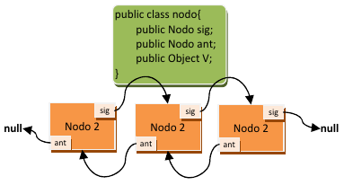

# 3.2.5 La librería ArrayList

## 1. Listas


¿*En qué se diferencia una lista de un conjunto*? Las listas son elementos de programación un poco más avanzados que los conjuntos. Su ventaja es que amplían el conjunto de operaciones de las colecciones añadiendo operaciones extra. Veamos algunas de ellas:

- Sí **pueden almacenar duplicados** . Si no queremos duplicados, hay que verificar manualmente que el elemento no esté en la lista antes de su inserción.
- **Acceso posicional** . Podemos acceder a un elemento indicando su posición en la lista.
- **Búsqueda** . Es posible buscar elementos en la lista y obtener su posición. En los conjuntos, al ser colecciones sin aportar nada nuevo, solo se podía comprobar si un conjunto contenía o no un elemento, retornando verdadero o falso. Las listas mejoran este aspecto.
- **Extracción de sublistas** . Es posible obtener una lista que contenga solo una parte de los elementos de forma muy sencilla.

En Java, para las listas se dispone de una interfaz llamada **`java.util.List`**, y dos implementaciones (**`java.util.LinkedList`** y **`java.util.ArrayList`**), con diferencias significativas entre ellas. Los métodos de la interfaz **`List`**, que obviamente estarán en todas las implementaciones, y que permiten las operaciones anteriores son:

| método | descripción |
| --- | --- |
| **`E get(int index)`** | el método `get` permite obtener un elemento partiendo de su posición (index). |
| **`E set(int index, E element)`** | el método `set` permite cambiar el elemento almacenado en una posición de la lista (index), por otro (element). |
| **`void add(int index, E element)`** | se añade otra versión del método `add`, en la cual se puede insertar un elemento (element) en la lista en una posición concreta (index), desplazando los existentes. |
| **`E remove(int index)`** | se añade otra versión del método `remove`, esta versión permite eliminar un elemento indicando su posición en la lista (desplazando los existentes a izquierda). |
| **`boolean addAll(int index, Collection<? extends E> c)`** | se añade otra versión del método `addAll` , que permite insertar una colección pasada por parámetro en una posición de la lista, desplazando el resto de elementos. |
| **`int indexOf(Object o)`** | el método `indexOf` permite conocer la posición (índice) de un elemento, si dicho elemento no está en la lista retornará `‐1`. |
| **`int lastIndexOf(Object o)`** | el método `lastIndexOf` nos permite obtener la última ocurrencia del objeto en la lista (dado que la lista sí puede almacenar duplicados). |
| **`List<E> subList(int from, int to)`** | el método `subList` genera una sublista (una vista parcial de la lista) con los elementos comprendidos entre la posición inicial (incluida) y la posición final (no incluida). |

> **⚠️ A tener en cuenta sobre List**
> Ten en cuenta que los elementos de una lista empiezan a numerarse por *0*. Es decir, que el primer elemento de la lista es el *0*.
>
> Ten en cuenta también que `List` es una interfaz genérica, por lo que `<E>` corresponde con el tipo base usado como parámetro genérico al crear la lista.

### 1.1. Uso

Y, ¿*cómo se usan las listas*? Pues para usar una lista haremos uso de sus implementaciones **`LinkedList`** y **`ArrayList`**. Veamos un ejemplo de su uso y después obtendrás respuesta a esta pregunta.

> **📌 Ejemplo 2.08: uso de clase ArrayList**
> Antes de nada no olvides importar la clase `java.util.ArrayList`. 
> En este ejemplo se usan los métodos de acceso posicional a la lista:
>
> ```java
> //declaració
> ArrayList<Integer> al = new ArrayList<>();
> ArrayList<Integer> al2 = new ArrayList<>();
> ArrayList<Empleado> em = new ArrayList<>();
> ArrayList<String> sr = new ArrayList<>();
>
> //Afegir elements
> al.add(10); 
> al.add(11);
> al2.add(8);
> al2.add(9);
> em.add(new Empleado("33445666V", "Pepe", "Martínez", "mañana", 1700));
> sr.add("Hola");
> sr.add("Adios");
>
> //Acceder a elemento
> em.get(0);
>
> //buscar elemento
> int indice = al.indexOf(11);
> int indice2 = sr.indexOf("Hola");
>
> //reemplazar elemento (buscado arriba)
> al.set(indice, 15);
> sr.set(indice2, "ey");
>
> //Recorrer array --> foreach
> for (String string : sr) {
>     System.out.println(sr);
> }
>
> //Recorrer array --> for
> for (int i = 0; i < al.size(); i++) {
>     System.out.println(al.get(i));
> }
>
> //Combinar dos Arrays
> al.addAll(0, al2);
>
> //Eliminar elemento
> al.remove(0);
> sr.removeFirst();
> em.removeLast();
> al.clear();
> ```

> **📌 Ejemplo 2.11: uso de LinkedList y ArrayList**
> ```java
> package UT07.P2_Lists;
>
> import java.util.ArrayList;
> import java.util.Collection;
> import java.util.LinkedList;
>
> public class EjemploListas2 {
>
>     // método para imprimir colecciones:
>     private static void imprimirColeccion(Collection<?> c) {
>         for (Object elemento : c) {
>             System.out.print(elemento.toString() + " ");
>         }
>         System.out.println("");
>     }
>
>     public static void main(String[] args) {
>       LinkedList<Integer> ll = new LinkedList<>(); //declaración+creación LinkedList
>       ll.add(1);        //añade un elemento al final de la lista
>       ll.add(3);        //añade otro elemento al final de la lista
>       ll.add(1, 2);     //añade en la posición 1 el elemento 2
>       ll.add(t.get(1) + ll.get(2)); //suma contendio de posición 1 y 2, y agrega al final
>       ll.remove(0);     //elimina el primer elementos de la lista
>       imprimirColeccion(ll); //2 3 5 
>
>       ArrayList<Integer> al = new ArrayList<>(); //declaración+creación ArrayList
>       al.add(10);
>       al.add(11);   //añadimos dos elementos a la lista.
>       al.set(al.indexOf(11), 12); //sustituimos el 11 por el 12, primero lo buscamos y luego lo reemplazamos.
>
>       al.addAll(0, t.subList(1, t.size()));
>       imprimirColeccion(al); //3 5 10 12 
>
>       al.subList(0, 2).clear();
>       imprimirColeccion(al); //10 12 
>     }
> }
> ```

### 1.2. `LinkedList` y `ArrayList`

¿*Y en qué se diferencia un* `LinkedList` *de un* `ArrayList` ?

#### 🔗 LinkedList

Utilizan listas doblemente enlazadas, que son listas enlazadas (como se vió en un apartado anterior), pero que permiten ir hacia atrás en la lista de elementos. Los elementos de la lista se encapsulan en los llamados nodos.

Los nodos van enlazados unos a otros para no perder el orden y no limitar el tamaño de almacenamiento. Tener un doble enlace significa que en cada nodo se almacena la información de cuál es el siguiente nodo y además, de cuál es el nodo anterior. Si un nodo no tiene nodo siguiente o nodo anterior, se almacena `null`(o nulo) para ambos casos.

#### 🔢 ArrayList

Estos se implementan utilizando arrays que se van redimensionando conforme se necesita más espacio o menos. La redimensión es transparente a nosotros, no nos enteramos cuándo se produce, pero eso redunda en una diferencia de rendimiento notable dependiendo del uso. Los **ArrayList** son más rápidos en cuanto a acceso a los elementos, acceder a un elemento según su posición es más rápido en un array que en una lista doblemente enlazada (hay que recorrer la lista). En cambio, eliminar un elemento implica muchas más operaciones en un array que en una lista enlazada de cualquier tipo.

¿*Y esto qué quiere decir*? Que si se van a realizar muchas operaciones de eliminación de elementos sobre la lista, conviene usar una lista enlazada (`LinkedList`), pero si no se van a realizar muchas eliminaciones, sino que solamente se van a insertar y consultar elementos por posición, conviene usar una lista basada en arrays redimensionados (`ArrayList` ).

| Característica | 🔗 **LinkedList** | 🔢 **ArrayList** |
| --- | --- | --- |
| **Estructura** | Lista doblemente enlazada (nodos con referencias al anterior y siguiente). | Array redimensionable (elementos contiguos en memoria). |
| **Acceso a elementos** | **Lento** (O(n)), hay que recorrer la lista. | **Rápido** (O(1)), acceso directo por índice. |
| **Inserción/Eliminación** | **Rápida** (O(1) si se tiene el nodo, O(n) si hay que buscarlo). | **Lenta** (O(n)), ya que hay que desplazar elementos. |
| **Uso de memoria** | Más memoria por referencias adicionales (`next` y `prev`). | Menos memoria, solo almacena los datos. |
| **Redimensionamiento** | No necesita, se expande dinámicamente sin copias. | Puede requerir redimensionamiento y copia de datos. |
| **Ideal para...** | Muchas inserciones/eliminaciones en el medio de la lista. | Muchas consultas y acceso rápido a elementos por índice. |
| **Interfaces adicionales** | Implementa `Queue` y `Deque` (uso como pila o cola). | No implementa `Queue` ni `Deque`. |

`LinkedList` tiene otras ventajas que nos puede llevar a su uso. Implementa las interfaces `java.util.Queue` y `java.util.Deque`. Dichas interfaces permiten hacer uso de las listas como si fueran una cola de prioridad o una pila, respectivamente.

### 1.3. A tener en cuenta

No es lo mismo usar las colecciones (listas y conjuntos) con objetos inmutables (`Strings`, `Integer`, etc.) que con objetos mutables. Los objetos inmutables no pueden ser modificados después de su creación, por lo que cuando se incorporan a la lista, a través de los métodos `add` , se pasan por copia (es decir, se realiza una copia de los mismos). En cambio los objetos mutables (como las clases que tú puedes crear), no se copian, y eso puede producir efectos no deseados.

Imagínate la siguiente clase, que contiene un número:

```java
class Test {
    public Integer num;
    Test (int num) {
        this.num = new Integer(num); 
    }
}
```

La clase de antes es mutable, por lo que no se pasa por copia a la lista. Ahora imagina el siguiente código en el que se crea una lista que usa este tipo de objeto, y en el que se insertan dos objetos:

```java
Test p1 = new Test(11); // se crea un objeto Test donde el entero que contiene vale 11.
Test p2 = new Test(12); // se crea otro objeto Test donde el entero que contiene vale 12.
LinkedList<Test> lista = new LinkedList<Test>(); // creamos una lista enlazada para objetos tipo Test.

lista.add(p1); // añadimos el primero objeto test.
lista.add(p2); // añadimos el segundo objeto test.

for (Test p:lista){
    System.out.println(p.num); // mostramos la lista de objetos.
}
```

¿*Qué mostraría por pantalla el código anterior*? Simplemente mostraría los números 11 y 12.

Ahora bien, ¿*qué pasa si modificamos el valor de uno de los números de los objetos test*? ¿*Qué se mostrará al ejecutar el siguiente código*?

```java
p1.num = 44;

for (Test p:lista){
    System.out.println(p.num);
}
```

El resultado de ejecutar el código anterior es que se muestran los números 44 y 12. El número ha sido modificado y no hemos tenido que volver a insertar el elemento en la lista para que en la lista se cambie también. Esto es porque en la lista no se almacena una copia del objeto Test, sino un apuntador a dicho objeto (solo hay una copia del objeto a la que se hace referencia desde distintos lugares).

> **📌 Cita**
> *Controlar la complejidad es la esencia de la programación.* [Brian Kernighan](https://es.wikipedia.org/wiki/Brian_Kernighan)

> **📌 Ejemplo 2.13: uso de ArrayList**
> Tenemos la clase `Producto` con:
>
> - Dos atributos: *nombre* ( `String` ) y *cantidad* ( `int` ).
> - Un constructor con parámetros.
> - Un constructor sin parámetros.
> - Métodos `get` y `set` asociados a los atributos.
>
> `Producto.java`
>
> Clase `Ejemplo06.java`
> ```java
> package UT07.P2_Lists;
>
> public class Producto {
>
>   //Atributos
>   private String nombre;
>   private int cantidad;
>
>   //Métodos
>   //Constructor con parámetros donde asignamos el valor dado a los atributos
>   public Producto(String nombre, int cantidad) {
>     this.nombre = nombre;
>     this.cantidad = cantidad;
>   }
>
>   //Constructor sin parámetros donde inicializamos los atributos
>   public Producto() {
>     //La palabra reservada null se utiliza para inicializar los objetos,
>     //indicando que el puntero del objeto no apunta a ninguna dirección
>     //de memoria. No hay que olvidar que String es una clase.
>     this.nombre = null;
>     this.cantidad = 0;
>   }
>
>   //Metodo get y set
>   public String getNombre() {
>     return nombre;
>   }
>
>   public void setNombre(String nombre) {
>     this.nombre = nombre;
>   }
>
>   public int getCantidad() {
>     return cantidad;
>   }
>
>   public void setCantidad(int cantidad) {
>     this.cantidad = cantidad;
>   }
> }
> ```
> En el programa principal creamos una lista de productos y realizamos operaciones sobre ella:
>
> ```java
> package UT07.P2_Lists;
>
> import java.util.ArrayList;
>
> public class EjemploListas {
>
>   public static void main(String[] args) {
>
>     //Definimos 5 instancias de la clase Producto
>     Producto p1 = new Producto("Pan", 6);
>     Producto p2 = new Producto("Leche", 2);
>     Producto p3 = new Producto("Manzanas", 5);
>     Producto p4 = new Producto("Brocoli", 2);
>     Producto p5 = new Producto("Carne", 2);
>
>     //Definir un ArrayList
>     ArrayList<Producto> lista = new ArrayList<>();
>
>     //Colocar instancias de producto en ArrayList
>     lista.add(p1);
>     lista.add(p2);
>     lista.add(p3);
>     lista.add(p4);
>
>     //Añadimos "Carne" en la posición 1 de la lista
>     lista.add(1, p5);
>
>     //Añadimos "Carne" en la última posición
>     lista.add(p5);
>
>     //Imprimir el contenido del ArrayList
>     System.out.println(" - Lista con " + lista.size() + " elementos");
>
>     for (Producto p : lista) {
>       System.out.println(p.getNombre() + " : " + p.getCantidad());
>     }
>
>     p5.setCantidad(99); //cambiamos la cantidad al producto, ¿cambiará la lista?
>
>     ((Producto)lista.get(1)).setCantidad(66);
>
>     System.out.println(p5.getCantidad());
>
>     //Imprimir el contenido del ArrayList
>     System.out.println(" - Lista con " + lista.size() + " elementos");
>
>     for (Producto p : lista) {
>        System.out.println(p.getNombre() + " : " + p.getCantidad());
>     }
>
>     //Eliminar todos los valores del ArrayList
>     lista.clear();
>     System.out.println(" - Lista final con " + lista.size() + " elementos");
>   }
> }
> ```

---
