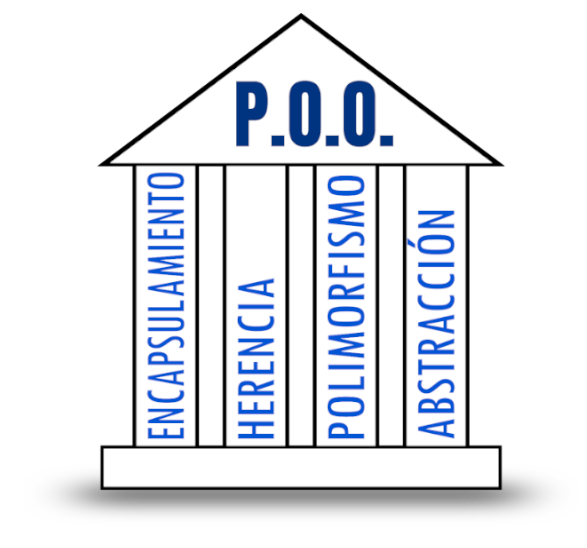

# 4.1 Introducción

**Orientado a objetos** hace referencia a una forma diferente de acometer la tarea del desarrollo de software, frente a otros modelos como el de la programación imperativa, la programación funcional o la programación lógica. Supone una reconsideración de los métodos de programación, de la forma de pensar en la resolución de problemas y, ante todo, de la forma de estructurar la información.

La **programación orientada a objetos (POO)** es un modelo para la elaboración de programas que se ha impuesto en los últimos años. Este auge se debe, en parte, a que esta forma de programar está fuertemente basada en la representación de la realidad; pero también a que refuerza el uso de buenos criterios aplicables al desarrollo de programas.

> **⚠️ **
> La orientación a objetos no es un tipo de lenguaje de programación. Es una metodología de trabajo para crear programas.

En POO, un programa es una colección de objetos que se relacionan entre sí de distintas formas.

> **📌 Un poquito de ...**
