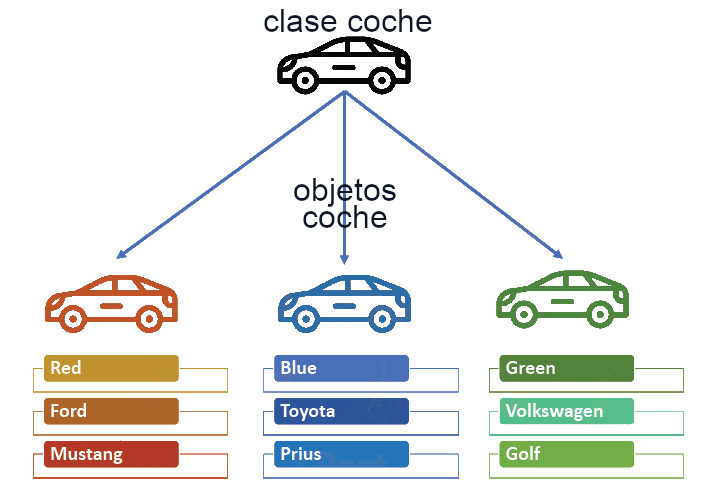

[⬅️ Tornar a l'índex de Programació](../) | [🏠 Portal Principal](../../) | [📘 UT4 Completa](../ut4-poo.md) | [🎨 **Obrir versió interactiva Material (amb índex lateral i mode fosc)**](../guia-completa/ut04/ut0403.html)

[⬅️ Anterior: 4.2 Principios fundamentales de la POO](../ut04/ut0402.md) | [➡️ Següent: 4.4.1 Estructura y miembros de una clase](../ut04/ut0404.md)

---

# 4.3 Objetos y clases

    

Las clases están compuestas por atributos y métodos. Una clase especifíca las características comunes de un conjunto de objetos.

De esta forma los programas que escribas estarán formados por un conjunto de clases a partir de las cuales irás creando objetos que se interrelacionarán unos con otros.

## 1. El concepto de objeto

Desde el comienzo del módulo llevas utilizando el concepto de objeto para desarrollar tus programas de ejemplo.

Podemos describir un **objeto** como una **entidad que contiene información y que es capaz de realizar ciertas operaciones con esa información**. Según los valores que tenga esa información el objeto tendrá un estado determinado y según las operaciones que pueda llevar a cabo con esos datos serán responsables de un comportamiento concreto.

> 📝 **Nota**
>
> Entre las características fundamentales de un objeto se encuentran:  
>    - la identidad, los objetos son únicos y por tanto distinguibles entre sí, aunque pueda haber objetos exactamente iguales,   
>    - un estado, los atributos que describen al objeto y los valores que tienen en cada momento, y   
>    - un determinado comportamiento, acciones que se pueden realizar sobre el objeto.

Algunos ejemplos de objetos que podríamos imaginar podrían ser:

- Un coche de color rojo, marca *SEAT*, modelo *León* , del año *2021*. En este ejemplo tenemos una serie de atributos, como el color (en este caso rojo), la marca, el modelo, el año, etc. Así mismo también podríamos imaginar determinadas características como la cantidad de combustible que le queda, o el número de kilómetros recorridos hasta el momento.
- Un coche de color amarillo, marca *Opel*, modelo *Moka*, del año *2019*.
- Otro coche de color amarillo, marca *Opel*, modelo *Moka* y también del año *2019*. Se trataría de otro objeto con las mismas propiedades que el anterior, pero sería un segundo objeto.
- Un cocodrilo de cuatro metros de longitud y de veinte años de edad.
- Un círculo de radio 2 centímetros, con centro en las coordenadas (0,0) y relleno de color amarillo.
- Un círculo de radio 3 centímetros, con centro en las coordenadas (1,2) y relleno de color verde.

Si observas los ejemplos anteriores podrás distinguir sin demasiada dificultad al menos tres familias de objetos diferentes, que no tienen nada que ver una con otra:

- Los coches.
- Los círculos.
- Los cocodrilos.

Es de suponer entonces que cada objeto tendrá determinadas posibilidades de comportamiento (acciones) dependiendo de la familia a la que pertenezcan. Por ejemplo, en el caso de los coches podríamos imaginar acciones como: *arrancar*, *frenar*, *acelerar*, *cambiar de marcha*, *etc*. En el caso de los cocodrilos podrías imaginar otras acciones como: *desplazarse*, *comer*, *dormir*, *cazar*, *etc*. Para el caso del círculo se podrían plantear acciones como: *cálculo de la superficie del círculo*, *cálculo de la longitud de la circunferencia que lo rodea*, *etc*.

Por otro lado, también podrías imaginar algunos atributos cuyos valores podrían ir cambiando en función de las acciones que se realizaran sobre el objeto: *ubicación del coche* (*coordenadas*), *velocidad* *instantánea*, *kilómetros recorridos*, *velocidad media*, *cantidad de combustible en el depósito*, *etc*. En el caso de los cocodrilos podrías imaginar otros atributos como: *peso actual*, el *número de dientes actuales* (irá perdiendo algunos a lo largo de su vida), el *número de presas que ha cazado hasta el momento*, *etc*.

Como puedes ver, un objeto puede ser cualquier cosa que puedas describir en términos de atributos y acciones.

> 📝 **Nota**
>
> Un objeto no es más que la representación de cualquier entidad concreta o abstracta que puedas percibir o imaginar y que pueda resultar de utilidad para modelar los elementos el entorno del problema que deseas resolver.

## 2. El concepto de clase

Está claro que dentro de un mismo programa tendrás la oportunidad de encontrar decenas, cientos o incluso miles de objetos. En algunos casos no se parecerán en nada unos a otros, pero también podrás observar que habrá muchos que tengan un gran parecido, compartiendo un mismo comportamiento y unos mismos atributos. Habrá muchos objetos que sólo se diferenciaran por los valores que toman algunos de esos atributos.

Es aquí donde entra en escena el concepto de **clase**. Está claro que no podemos definir la estructura y el comportamiento de cada objeto cada vez que va a ser utilizado dentro de un programa, pues la escritura del código sería una tarea interminable y redundante. La idea es poder disponer de una **plantilla o modelo para cada conjunto de objetos que sean del mismo tipo, es decir, que tengan los mismos atributos y un comportamiento similar.**

> 📝 **Nota**
>
> Una clase consiste en la definición de un tipo de objeto. Se trata de una descripción detallada de cómo van a ser los objetos que pertenezcan a esa clase indicando qué tipo de información contendrán (atributos) y cómo se podrá interactuar con ellos (comportamiento).

Como resumen, una clase consiste en un plantilla en la que se especifican:

- Los atributos que van a ser comunes a todos los objetos que pertenezcan a esa clase (información).
- Los métodos que permiten interactuar con esos objetos (comportamiento).

A partir de este momento podrás hablar ya sin confusión de objetos y de clases,sabiendo que los primeros son instancias concretas de las segundas, que no son más que una abstracción o definición.

Si nos volvemos a fijar en los ejemplos de objetos del apartado anterior podríamos observar que las clases serían lo que clasificamos como "familias" de objetos (*coches*, *cocodrilos* y *círculos*).

> 📝 **Clase vs Objeto**
>
> En el lenguaje cotidiano de muchos programadores puede ser habitual la confusión entre los términos **clase** y **objeto**. Aunque normalmente el contexto nos permite distinguir si nos estamos refiriendo realmente a una clase (definición abstracta) o a un objeto (instancia concreta), hay que tener cuidado con su uso para no dar lugar a interpretaciones erróneas, especialmente durante el proceso de aprendizaje.

> 🎬 **Un poquito de ...**
>

---

[⬅️ Anterior: 4.2 Principios fundamentales de la POO](../ut04/ut0402.md) | [➡️ Següent: 4.4.1 Estructura y miembros de una clase](../ut04/ut0404.md) | [📑 Índex de Programació](../) | [🎨 Versió Web Material](../guia-completa/ut04/ut0403.html)
