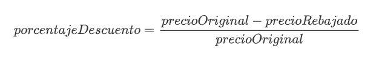
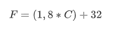
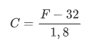

[⬅️ Tornar a l'índex de Programació](../) | [🏠 Portal Principal](../../) | [📘 UT4 Completa](../ut4-poo.md) | [🎨 **Obrir versió interactiva Material (amb índex lateral i mode fosc)**](../guia-completa/ut04/ut04actividades.html)

[⬅️ Anterior: 4.6 Empaquetado de clases y librerías (packages)](../ut04/ut0410.md) | [➡️ Següent: Retos de programación UT4](../ut04/ut04retos.md)

---

# Actividades UT04


> 💻 **Empaquetar actividades**
>
> Empaqueta las actividades, dentro de la carpeta **`ut04/bloqueX`**


---

## Bloque 4.0

### Actividad 01 `Rebajas`

Crea una clase **`Rebajas`** con un método `descubrePorcentaje()` que descubra el descuento aplicado en un producto. El método recibe el precio original del producto y el rebajado y devuelve el porcentaje aplicado. Podemos calcular el descuento realizando la operación:

    

> Ayuda:  Implementa el método como método de clase (`static`).

### Actividad 02 `Numero`

Realiza una clase **`Numero`** que almacene un número entero y tenga las siguientes características:

- Constructor por defecto que inicializa a 0 el número interno.
- Constructor que inicializa el número interno.
- Método `anyade` que permite sumarle un número al valor interno.
- Método `resta` que resta un número al valor interno.
- Método `getValor`. Devuelve el valor interno.
- Método `getDoble`. Devuelve el doble del valor interno.
- Método `getTriple`. Devuelve el triple del valor interno.
- Método `setNumero`. Inicializa de nuevo el valor interno.

### Actividad 03 `Rectangulo`

Crea una clase **`Rectangulo`** que represente un rectángulo con atributos `ancho` y `alto` (de tipo decimal). Implementa:

- Un constructor por defecto que inicialice a 1 las dimensiones del rectángulo.
- Un constructor con parámetros que reciba la anchura y la altura por parámetros.
- Getters y setters para ambos atributos.
- Métodos `calcularArea()` y `calcularPerimetro()` que devuelvan dichos valores.
- Escribe el método principal `main` en otra clase ejecutable llamada **`TestRectangulo`** para verificar que todo funciona correctamente instanciando un rectángulo de cada tipo.

### Actividad 04 `Circulo`

Crea una clase **`Circulo`** que represente una figura circular con un atributo `radio` (tipo decimal). Implementa:

- Un constructor por defecto que inicialice el radio a 1.0.
- Un constructor que acepte el radio personalizado por parámetro.
- Getters y setters.
- Métodos `calcularArea()` (`Math.PI * radio * radio`) y `calcularLongitud()` (`2 * Math.PI * radio`).
- Escribe una clase ejecutable **`TestCirculo`** para probar el correcto funcionamiento.

---

## Bloque 4.1

### Actividad 05 `MiNumero`

Realiza una clase **`MiNumero`** que proporcione el doble, triple y cuádruple de un número proporcionado en su constructor (realiza un método para `doble`, otro para `triple` y otro para `cuádruple`). Haz que la clase tenga un método `main` y comprueba los distintos métodos.

### Actividad 06 `CalculoPrecio`

Diseña una clase **`CalculoPrecio`** que calcule la factura de venta de un producto. La clase debe almacenar la cantidad comprada y el precio unitario del artículo. Implementa:

- Un constructor que reciba ambos atributos.
- Un método `calcularTotal()` que multiplique el precio por la cantidad.
- Un método `calcularTotalConDescuento()` que aplique un descuento del 10% si el importe total calculado previamente supera los 100€; en caso contrario, no aplicará ningún descuento.
- Crea un método `main` que compruebe ambas situaciones pidiendo la información al usuario.

---

## Bloque 4.2

### Actividad 07 `Coche`

Crea la clase **`Coche`** con dos atributos: `marca` y `modelo`.

Crea dos constructores: Uno no toma parámetros y el otro sí. Los dos constructores inicializarán los atributos de la clase.

Crea también los getters y setters de ambos atributos.

Dentro de la funcion main, crea dos objetos (cada objeto llama a un constructor distinto) y verifica que todo funciona correctamente.

### Actividad 08 `Cuenta`

Crea una clase llamada **`Cuenta`** que tendrá los siguientes atributos: `titular` y `cantidad` (puede tener decimales).

Al crear una instancia del objeto Cuenta, el titular será obligatorio y la cantidad es opcional. Crea dos constructores que cumplan lo anterior, es decir, debemos crear dos métodos constructores con el mismo nombre (el de la clase), pero distintos parámetros.

Crea sus métodos *get*, *set* y el método `mostrarDatos` que muestre TODOS los datos de la cuenta por pantalla (println).

Además, tendrá dos métodos especiales:

- `ingresar(double cantidad)`: se ingresa una cantidad a la cuenta, **si la cantidad introducida es negativa, no se hará nada.**
- `retirar(double cantidad)`: se retira una cantidad a la cuenta, **si restando la cantidad actual a la que nos pasan es negativa, la cantidad de la cuenta pasa a ser 0 retirando el importe máximo en función de la cantidad disponible en el objeto**.

Crear una clase principal **`TestCuenta`** ejecutable (función main):

- Crear una instancia del objeto Cuenta llamada `cuentaParticular1` con el nombre del titular.
- Crear una instancia del objeto Cuenta llamada `cuentaEmpresa1` con el nombre del titular y una cantidad inicial de dinero.
- Mostrar el titular de la instancia `cuentaParticular1`.
- Mostrar el saldo de la instancia `cuentaEmpresa1`.
- Ingresar 1000 € en la instancia `cuentaParticular1`.
- Retirar 500 € en la instancia `cuentaEmpresa1`.
- Mostrar los datos de las dos instancias del objeto `Cuenta`.

### Actividad 09 `Libro`

Crea una clase llamada **`Libro`** que guarde la información de cada uno de los libros de una biblioteca. La clase debe guardar las siguientes propiedades:

- `título`
- `autor`
- `editorial`
- `número de ejemplares totales`
- `número de prestados`

La clase contendrá los siguientes métodos:

- Constructor por defecto.
- Constructor con parámetros.
- Métodos Setters/getters.
- Método `prestamo` que incremente el atributo correspondiente cada vez que se realice un préstamo del libro. No se podrán prestar libros de los que no queden ejemplares disponibles para prestar. Devuelve `true` si se ha podido realizar la operación y `false` en caso contrario.
- Método `devolucion` que decremente el atributo correspondiente cuando se produzca la devolución de un libro. No se podrán devolver libros que no se hayan prestado. Devuelve `true` si se ha podido realizar la operación y `false` en caso contrario.
- Método `perdido` que decremente el atributo número de ejemplares por perdida de ejemplar. No se podrán devolver libros que no tengan ejemplares. Devuelve `true` si se ha podido realizar la operación y `false` en caso contrario.
- Método `mostrarDatos` para mostrar los datos de los libros.

Crear una clase principal **`TestLibro`** ejecutable (método main):

- Crear una instancia del objeto libro `libroInformatica1` con los datos de un libro.
- Consultar el título de la instancia `libroInformatica1`.
- Cambiar la editorial de la instancia `libroInformatica1` por Anaya.
- Realiza el préstamo de la instancia `libroInformatica1`.
- Realiza otro préstamo de la instancia `libroInformatica1`.
- Muestra los libros prestados de la instancia `libroInformatica1`.
- Realiza la devolución de la instancia `libroInformatica1`.
- Muestra los libros prestados de la instancia `libroInformatica1`.
- Gestiona la pérdida de un ejemplar de la instancia `libroInformatica1`.
- Muestra los ejemplares de la instancia `libroInformatica1`.
- Muestra todos los datos de la instancia `libroInformatica1`.

### Actividad 10 `Mascota`

Crea una clase **`Mascota`** con los atributos: `nombre` (String), `especie` (String) y `edad` (int). Implementa:

- Un constructor con parámetros para inicializar todos los atributos del objeto.
- Getters y setters para cada atributo.
- Un método `hacerSonido()` que imprima por pantalla un sonido genérico (por ejemplo, "¡Haciendo un sonido de mascota!").
- Crea una clase principal llamada **`TestMascota`** donde se instancien 3 objetos de tipo `Mascota` (por ejemplo, un perro, un gato y un loro), se muestren sus atributos y se ejecute el método `hacerSonido()` para cada una.

### Actividad 11 `Pelicula`

Crea una clase **`Pelicula`** para almacenar información cinematográfica. Debe poseer:

- Atributos: `titulo` (String), `director` (String), `duracion` (int, en minutos) y `genero` (String).
- Constructor con parámetros.
- Métodos getters y setters.
- Un método `esLarga()` que devuelva `true` si la duración de la película es superior a 120 minutos, y `false` en caso contrario.
- Crea una clase ejecutable **`TestPelicula`** que instancie varias películas y compruebe cuáles de ellas superan el límite llamando al método `esLarga()`.

---

## Bloque 4.3

### Actividad 12 `Password`

Crear una clase llamada **`Password`** con las siguientes características:

Propiedades:

- `clave`
- `longitud`

Los métodos que implementa serán:

- Un constructor sin parámetros que generará una clave aleatoria con longitud 8.
- Un constructor que recibirá por parámetro un `int` que le indicará la longitud de la clave a generar.
- `generarClave()`: genera la clave del objeto con la longitud que tenga.
- Método *get* para clave y longitud.
- Método *set* para clave y longitud.

Crear una clase principal **`TestPassword`** que compruebe todos los métodos creados.

### Actividad 13 `Producto`

Crear una clase llamada **`Producto`** con:

Atributos:

- `codProducto`
- `nombreProducto`
- `descripcion`
- `categoria`
- `peso`
- `precio`
- `stock`

Métodos:

- `Producto`: Permite crear una instancia con los datos de un producto.
- `aumentaStock`: Permite aumentar el stock de unidades del producto. Se le pasa el dato de *unidades* que aumentamos.
- `disminuyeStock`: Permite disminuir el stock de unidades del producto. Se le pasa el dato de *unidades* que disminuimos.
- `ivaProducto`: Permite calcular el IVA aplicado al precio del producto. Se le pasa el dato del *porcentaje* *de IVA*.
- `mostrarDatos`: Muestra los datos del producto.

Crear una clase principal **`TestProducto`** ejecutable que:

- Crear dos instancias de la clase `Producto` llamadas `productoHardware` y `productoSoftware`.
- Mostrar los datos de los dos objetos `Producto` que hemos creado.
- Aumenta el stock de unidades del `productoHardware` en 12 unidades.
- Disminuir el stock de unidades del `productoSoftware` en 5 unidades.
- Calcula el IVA de los dos objetos `Producto` que hemos creado.
- Mostrar los datos de los dos objetos `Producto`, así como sus importes de IVA y los precios finales de cada una de las instancias.

### Actividad 14 `Empleado`

Diseña una clase llamada **`Empleado`** con:

- Atributos: `nombre`, `cargo` (String), `salarioBase` (double) y `antiguedad` (int, en años).
- Constructor para inicializar todos los atributos del empleado.
- Getters y setters.
- Un método `calcularSalarioNeto()` que calcule y devuelva el salario final aplicando la siguiente lógica: se suma un plus de 50€ al `salarioBase` por cada año de antigüedad (`antiguedad * 50`) y se le resta un 15% en concepto de retención fiscal.
- Crea una clase principal **`TestEmpleado`** que instancie varios empleados y muestre el desglose y resultado final por pantalla.

---

## Bloque 4.4

### Actividad 15 `Calculadora`

Crea una clase llamada **`Calculadora`** que contenga métodos estáticos para realizar operaciones matemáticas básicas: `suma`, `resta`, `multiplicación` y `división`. Todos ellos recibiran los números necesarios como parámetros. Luego, escribe el método principal `main` que haga uso de estos métodos.

### Actividad 16 `Temperatura`

Crear una clase llamada **`Temperatura`** con dos métodos estáticos:

- `celsiusToFarenheit`: Convierte grados *Celsius* a *Farenheit*.

      
  

- `farenheitToCelsius`: Convierte grados *Farenheit* a *Celsius*.

      
  

> Ayuda:  Implementa los métodos como métodos de clase.

### Actividad 17 `ConversorUnidades`

Crea una clase llamada **`ConversorUnidades`** que contenga métodos estáticos de conversión sin necesidad de instanciar la clase:

- `kilometrosAMillas(double km)`: convierte kilómetros a millas marinas (1 milla = 1.852 km).
- `litrosAGalones(double litros)`: convierte litros a galones (1 galón = 3.785 litros).
- `kgALibras(double kg)`: convierte kilogramos a libras (1 kg = 2.204 libras).
- Desarrolla el método `main` que llame a estos métodos de clase utilizando valores introducidos por código.

---

## Bloque 4.5

### Actividad 18 `Moto`

A partir de la siguiente clase **`Moto`**:

```java
  public class Moto {

      private int velocidad;

      public Moto() {
        this.velocidad=0;
      }
  }
```

Añade los siguientes métodos:

- `int getVelocidad`: Devuelve la velocidad del objeto moto.
- `void acelera(int mas)`: Permite aumentar la velocidad del objeto moto.
- `void frena(int menos)`: Permite reducir la velocidad del objeto moto.

### Actividad 19 `Consumo`

Implementa una clase **`Consumo`**, la cual forma parte del "ordenador de a bordo" de un coche y tiene las siguientes características:

Atributos:

- `kilometros`
- `litros`:. Litros de combustible consumido.
- `vmed`: Velocidad media.
- `pgas`: Precio de la gasolina.

Métodos:

- `getTiempo`: Indicará el tiempo empleado en realizar el viaje.
- `consumoMedio`: Consumo medio del vehículo (en litros cada 100 kilómetros).
- `consumoEuros`: Consumo medio del vehículo (en euros cada 100 kilómetros).

> Recuerda: No olvides crear un constructor para la clase que establezca el valor de los atributos. Elige el tipo de datos más apropiado para cada atributo.

### Actividad 20 `Viaje`

Crea una clase llamada **`Viaje`** que represente los costes de transporte de un recorrido. Debe contar con:

- Atributos: `distancia` (double, en km) y `precioCombustible` (double).
- Constructor con parámetros.
- Un método `calcularCostePeajes(int numPeajes, double precioPeaje)` que calcule y devuelva el coste total en concepto de peajes.
- Un método `calcularCosteTotal(int numPeajes, double precioPeaje)` que devuelva la suma del coste de peajes y el coste del combustible consumido. (Asume que el vehículo tiene un consumo fijo de 6.5 litros cada 100 kilómetros).
- Comprueba su funcionamiento en la clase principal `main` pasando diferentes parámetros.

---

## Bloque 4.6

### Actividad 21 `Calculadora2`

Modifica la Actividad 15 `Calculadora` (crea **`Calculadora`**) para que se añadan otras operaciones matemáticas como `potencia` (se le pasará la `base` y la `potencia`) , `generaAleatorio` (se le pasarán el límite mínimo y el límite máximo en el que crear este número entero). Luego, modifica el método principal que haga uso de estos métodos.

### Actividad 22 `AnalisisTexto`

Diseña una clase **`AnalisisTexto`** que reciba un String en su constructor. Utilizando métodos predefinidos de la clase `String`, implementa los siguientes métodos dinámicos:

- `int contarPalabras()`: devuelve el número de palabras que componen el texto (puedes buscar los espacios en blanco).
- `String reemplazarEspacios(char nuevoChar)`: devuelve la cadena con todos los espacios sustituidos por el nuevo carácter.
- `boolean contienePalabra(String palabra)`: devuelve `true` si el texto original contiene la palabra indicada, sin distinguir entre mayúsculas y minúsculas.
- Comprueba su funcionamiento en una clase ejecutable de prueba.

---

## Bloque 4.7

### Actividad 23 `Finanzas`

Realiza una clase **`Finanzas`** que convierta dólares a euros y viceversa. Codifica los métodos `dolaresToEuros(double dolares)` y `eurosToDolares(double euros)`. Prueba que dicha clase funciona correctamente haciendo conversiones entre euros y dólares. La clase tiene que tener:

- Un constructor `finanzas()` por defecto el cual establece el cambio Dólar-Euro en *1.02*.
- Un constructor `finanzas(double cambio)`, el cual permitirá configurar el cambio Dólar-euro a una cantidad personalizada.

### Actividad 24 `Persona`

Crea una clase llamada **`Persona`** con un constructor que reciba parámetros para el `nombre` y la `edad`, así como sus `getters` y `setters`y un método `mostrarDatos()` que muestre todos los datos por pantalla. Luego, en el método principal, crea 3 instancias de la clase `Persona` utilizando el constructor y muestra la información de cada persona.

### Actividad 25 `Estudiante`

Diseña una clase **`Estudiante`** que almacene `nombre`, `matricula` y tres notas decimales (`nota1`, `nota2`, `nota3`). Implementa:

- Un constructor por defecto que deje los datos vacíos.
- Un constructor que inicialice únicamente el `nombre` y la `matricula`.
- Un constructor completo que reciba todos los atributos y las tres notas.
- Un método `calcularPromedio()` que devuelva la nota media.
- Comprueba el funcionamiento instanciando estudiantes con cada constructor y visualizando el promedio en la función ejecutable.

---

## Bloque 4.8

### Actividad 26 - Paquete: gestionHospital.

#### Clase Paciente

La clase `Paciente` permite representar un paciente mediante los atributos: `nombre` (cadena), `edad` (entero), `estado` (entero entre 1 -más grave- y 5 -menos grave-, 6 si está curado), y con las siguientes operaciones:

- `public Paciente (String n, int e)`. Constructor de un objeto `Paciente` de nombre `n`, de `e` años y cuyo estado es un valor aleatorio entre 1 y 5.
- `public int getEdad()`. Consultor que devuelve edad.
- `public int getEstado()`. Consultor que devuelve estado.
- `public void mejorar()`. Modificador que incrementa en uno el estado del paciente (mejora al paciente)
- `public void empeorar()`. Modificador que decrementa en uno el estado del paciente (empeora al paciente)
- `public String toString()`. Transforma el paciente en un `String`. Por ejemplo,

```java
Pepe Pérez 46 5
```

- `public int compareTo(Paciente o)`. Permite comparar dos pacientes. Se considera menor el paciente más leve. A igual gravedad, se considera menor el paciente más joven. Ejemplo:
- Teniendo a `David 40 3`, `Pepe 25 3` y `Juan 35 5`:

  ```java
  David.compareTo(Juan) = 2
  Juan.compareTo(Pepe) = -2
  David.compareTo(Pepe) = 15
  ```

#### Clase TestPaciente

Diseñar una clase Java `TestPaciente` que permita probar la clase `Paciente` y sus métodos. Para ello se desarrollará el método `main` en el que:

- Se crearán dos pacientes: *"Antonio" de 20 años* y *"Miguel" de 30 años*.
- Imprimir el estado inicial de los dos pacientes.
- Mostrar los datos del que se considere menor (según el criterio de `compareTo` de la clase `Paciente`).
- Aplicar "mejoras" al paciente más grave hasta que los dos pacientes tengan el mismo estado.
- Imprimir el estado final de los dos pacientes.


> ⚠️ **Importante**
>


ARRAYS

#### Clase Hospital

La clase **Hospital** contiene la información de las camas de un hospital, así como de los pacientes que las ocupan. Un Hospital tiene un número máximo de camas `MAXC` = 200 y para representarlas se utilizará un array (llamado `listaCamas`) de objetos de tipo Paciente junto con un atributo (`numLibres`) que indique el número de camas libres del hospital en un momento dado. El número de cada cama coincide con su posición en el array de pacientes (la posición 0 no se utiliza), de manera que `listaCamas[i]` es el Paciente que ocupa la cama `i` o es `null` si la cama está libre. Las operaciones de esta clase son:

- `public Hospital()`: Constructor de un hospital. Cuando se crea un hospital, todas las camas están libres.
- `public int getNumLibres()`: Consultor del número de camas libres.
- `public boolean hayLibres()`: Devuelve true si en el hospital hay camas libres y devuelve false en caso contrario.
- `public int primeraLibre()`: Devuelve el número de la primera cama libre del array `listaCamas` si hay camas libres o devuelve un 0 si no las hay.
- `public void ingresarPaciente(String n, int e) throws HospitalLlenoException`: Si hay camas libres, la primera de ellas (la de número menor) pasa a estar ocupada por el paciente de nombre `n` y edad `e`. Si no hay camas libres, lanza una excepción.
- `private void darAltaPaciente(int i)`: La cama `i` del hospital pasa a estar libre. (Afectará al número de camas libres)
- `public void darAltas()`: Se mejora el estado (método `mejorar()` de `Paciente`) de cada uno de los pacientes del hospital y a aquellos pacientes sanos (cuyo estado es 6) se les da el alta médica (invocando al método `darAltaPaciente`).
- `public String toString()`: Devuelve un `String` con la información de las camas del hospital. Por ejemplo,

```java
1 María Medina 30 4
2 Pepe Pérez 46 5
3 libre
4 Juan López 50 1
5 libre
...
199 Andrés Sánchez 29 3
```

#### Clase GestorHospital

En la clase `GestorHospital` se probará el comportamiento de las clases anteriores. El programa deberá:

- Crear un hospital.
- Ingresar a cinco pacientes con los datos simulados introducidos directamente en el programa.
- Realizar el proceso de `darAltas` mientras que el número de habitaciones libres del hospital no llegue a una cantidad (por ejemplo 198).
- Mostrar los datos del hospital cuando se considere oportuno para comprobar la corrección de las operaciones que se hacen.

### Actividad 27 - Paquete: gestorCorreoElectronico

#### Clase Mensaje

La clase `Mensaje`. De un mensaje conocemos:

- `Codigo (int)` Número que permite identificar a los mensajes.
- `Emisor (String)`: email del emisor.
- `Destinatario (String)`: email del destinatario.
- `Asunto (String)`
- `Texto (String)`

Desarrollar los siguientes métodos:

- Constructor que reciba todos los datos, excepto el código, que se generará automáticamente (nº consecutivo). Ayuda: utiliza una variable de clase `static`.
- Consultores de todos los atributos.
- `public boolean equals(Object o)`: Dos mensajes son iguales si tienen el mismo código.
- `public static boolean validarEMail(String email)`: Método estático que devuelve true o false indicando si la dirección de correo indicada es válida o no. Una dirección es válida si tiene la forma `direccion@subdominio.dominio`.
- `public String toString()`.

#### Clase TestCorreo

Con la clase `TestCorreo` probaremos las clases y métodos desarrollados.

- Crea varios mensajes con los datos que introduzca el usuario y muéstralos por pantalla.
- Prueba el método `validarEMail` de la clase Mensaje con las direcciones siguientes (solo la primera es correcta) :  

         - `tuCorreo@gmail.com`   

         - `tuCorreogmail.com`  

         - `tuCorreo@gmail`   

         - `tuCorreo.com@gmail`


> ⚠️ **Importante**
>


ARRAYS

#### Clase TestCarpetas

Con la clase `TestCarpetas` probaremos las clases y métodos desarrollados:

- Crea dos carpetas de correo de nombre `Mensajes recibidos` y `Mensajes eliminados respectivamente`.
- Crea varios mensajes y añádelos a `Mensajes recibidos`.
- Mueve el mensaje de código 1 desde la `Mensajes recibidos` a `Mensajes elimiminados`.
- Muestra el contenido de las carpetas antes y después de cada operación (*añadir*, *mover*,...).

### Actividad 28 - Paquete: contrarreloj

#### Clase Corredor

La clase `Corredor` representa a un participante en la carrera. Sus atributos son el dorsal (entero), el nombre (string) y el tiempo en segundos (double) que le ha costado completar el recorrido. Los métodos con los que cuenta son:

- `public Corredor(int d, String n)`: Constructor a partir del dorsal y el nombre. Por defecto el tiempo tardado es 0.
- `public double getTiempo()`: Devuelve el tiempo tardado por el corredor.
- `public int getDorsal()`: Devuelve el dorsal del corredor.
- `public String getNombre()`: Devuelve el nombre del corredor.
- `public void setTiempo(double t) throws IllegalArgumentException`: Establece el tiempo tardado por el corredor. Lanzará la excepción si el tiempo indicado es negativo.
- `public void setTiempo(double t1, double t2) throws IllegalArgumentException`: Establece el tiempo tardado por el corredor.

`t1` indica la hora de comienzo y `t2` la hora de finalización (expresadas en segundos). La diferencia en segundos entre los dos datos servirá para establecer el tiempo tardado por el `Corredor`.

Lanzará la excepción si el tiempo resultante es negativo.

- `public String toString()`: Devuelve un String con los datos del corredor, de la forma:

```java
(234) - Juan Ramirez - 2597 segundos
```

- `public boolean equals(Object o)`: Devuelve true si los corredores tienen el mismo dorsal y false en caso contrario.
- `public int compareTo (Corredor o)`: Un corredor es menor que otro si tiene menor dorsal.
- `public static int generarDorsal()`: Devuelve un número de dorsal generado secuencialmente. Para ello la clase hará uso de un atributo `static int siguienteDorsal` que incrementará cada vez que se genere un nuevo dorsal.

#### Clase TestCorredor

Diseñar una clase Java `TestCorredor` que permita probar la clase Corredor y sus métodos. Para ello se desarrollará el método `main` en el que:

- Se crearán dos corredores: El nombre lo indicará el usuario mientras que el dorsal se generará utilizando el método `generarDorsal()` de la clase.
- Se establecerá el tiempo de llegada del primer corredor a 300 segundos y el del segundo a 400.
- Se mostrarán los datos de ambos corredores (`toString`).


> ⚠️ **Importante**
>


ARRAYS

#### Clase ListaCorredores

La clase `ListaCorredores` permite representar a un conjunto de corredores. En la lista, como máximo habrá 200 corredores, aunque puede haber menos de ese número. Se utilizará un array, llamado lista, de 200 elementos junto con una propiedad `numCorredores` que permita saber cuentos corredores hay realmente. Métodos:

- `public ListaCorredores()`: Constructor. Crea la lista de corredores, inicialmente vacía.
- `public void anyadir(Corredor c) throws ElementoDuplicadoException`: Añade un corredor al final de la lista de corredores, siempre y cuando el corredor no esté ya en la lista, en cuyo caso se lanzará `ElementoDuplicadoException`
- `public void insertarOrdenado(Corredor c)`: Inserta un corredor en la posición adecuada de la lista de manera que esta se mantenga ordenada crecientemente por el tiempo de llegada. Para poder realizar la inserción debe averiguarse la posición que debe ocupar el nuevo elemento y, antes de añadirlo al array, desplazar el elemento que ocupa esa posición y todos los posteriores, una posición a la derecha.
- `public Corredor quitar(int dorsal) throws ElementoNoEncontradoException`: Quita de la lista al corredor cuyo dorsal se indica. El array debe mantenerse compacto, es decir, todos los elementos posteriores al eliminado deben desplazarse una posición a la izquierda. El método devuelve el Corredor quitado de la lista. Si no se encuentra se lanza `ElementoNoEncontradoException`.
- `public String toString()`: Devuelve un `String` con la información de la lista de corredores. Los minutos aparecerán formateados con 2 decimales. Por ejemplo:

```java
Posición: 0
 Dorsal: 234
 Nombre: Juan Ramirez
 Tiempo: 25.97 minutos

Posición: 1
 Dorsal: 26
 Nombre: José González
 Tiempo: 29.70 minutos
```

(Clase `Contrarreloj`) Realizar un programa que simule una contrarreloj. Para llevar el control de una carrera contrarreloj se mantienen dos listas de corredores (dos objetos de tipo `ListaCorredores`):

- (`hanSalido`) Una con los que han salido, que tiene a los corredores por orden de salida. El atributo tiempo de estos corredores será 0. Para que los corredores se mantengan por orden de salida, se añadirán a la lista utilizando el método añadir.
- (`hanLlegado`) Otra con los corredores que hay llegado a la meta. A medida que los corredores llegan a la meta se les extrae de la primera lista, se les asigna un tiempo y se les inserta ordenadamente en esta segunda lista.

En el método `main` realizar un programa que muestre un menú con las siguientes opciones:

1. `Salida`: Para registrar que un corredor ha comenzado la contrarreloj y sale de la línea de salida. Solicita al usuario el nombre de un corredor y su dorsal, y lo añade a la lista de corredores que han salido.
2. `Llegada`: Para registrar que un corredor ha llegado a la meta. Solicita al usuario el dorsal de un corredor y el tiempo de llegada (en segundos). Quita al corredor de la lista de corredores que `hanSalido`, le asigna el tiempo que ha tardado y lo inserta (ordenadamente) en la lista de corredores que `hanLlegado`
3. `Clasificación`: Muestra la lista de corredores que `hanLlegado`. Dado que esta lista está ordenada por tiempo, mostrarla por pantalla nos da la clasificación.
4. `Salir`: Sale del programa.

### Actividad 29 - Paquete: reservasLibreria

#### Clase Cliente

Cuando un `cliente` pide un libro y la librería no lo tiene, el cliente puede hacer una reserva de manera que cuando lo reciban en la librería le avisen por teléfono.

De cada reserva se almacena:

- `Nif` del cliente (`String`).
- `Nombre` del cliente (`String`).
- `Teléfono` del cliente (`String`).
- `Código` del libro reservado. (`entero`).
- Numero de `ejemplares` (`entero`).

#### Clase Reserva

Diseñar la clase `Reserva`, de manera que contemple la información descrita e implementar:

- `public Reserva(String nif, String nombre, String tel, int codigo, int ejemplares)`: Constructor que recibe todos los datos de la reserva.
- `public Reserva(String nif, String nombre, String tel, int codigo)`: Constructor que recibe los datos del cliente y el código del libro. Establece el número de ejemplares a uno.
- Consultores de todos los atributos.
- `public void setEjemplares(int ejemplares)`: Modificador del número de ejemplares. Establece el número de ejemplares al valor indicado como parámetro.
- `public String toString(): que devuelva un`String` con los datos de la reserva
- `public boolean equals(Object o)`: Dos reservas son iguales si son del mismo cliente y reservan el mismo libro.
- `public int compareTo(Object o)`: Es menor la reserva cuyo código de libro es menor. El parámetro es de tipo `Object` así que revisa si debes hacer alguna "adaptación".

#### Clase TestReservas

Diseñar una clase Java `TestReservas` que permita probar la clase `Reserva` y sus métodos.

Para ello se desarrollará el método `main` en el que:

- Se creen dos reservas con los datos que introduce el usuario. Las reservas no pueden ser iguales (equals). Si la segunda reserva es igual a la primera se pedirá de nuevo los datos de la segunda al usuario.
- Se incremente en uno el número de ejemplares de ambas reservas.
- Se muestre la menor y a continuación la mayor.


> ⚠️ **Importante**
>


ARRAYS

#### Clase ListaReservas

Diseñar una clase `ListaReservas` que implemente una lista de reservas. Como máximo puede haber 100 reservas en la lista. Se utilizará un array de Reservas que ocuparemos a partir de la posición 0 y un atributo que indique el número de reservas. Las reservas existentes ocuparán las primeras posiciones del array (sin espacios en blanco). Implementar los siguientes métodos:

- `public void reservar(String nif, String nombre, String telefono, int libro, int ejemplares) throws ListaLlenaException, ElementoDuplicadoException`: Crea una reserva y la añade a la lista. Lanza `ElementoDuplicadoException` si la reserva ya estaba en la lista. Lanza `ListaLlenaException` si la lista de reservas está llena.
- `public void cancelar(String nif, int libro) throws ElementoNoEncontradoException`. Dado un nif de cliente y un código de libro, anular la reserva correspondiente. Lanzar `ElementoNoEncontradoException` si la reserva no existe.
- `public String toString()`: Devuelve un `String` con los datos de todas las reservas de la lista.
- `public int numEjemplaresReservadosLibro(int codigo)`: Devuelve el número de ejemplares que hay reservados en total de un libro determinado.
- `public void reservasLibro(int codigo)`: Dado un código de libro, muestra el nombre y el teléfono de todos los clientes que han reservado el libro.

#### Clase GestionReservas

Realizar un programa `GestionReservas` que, utilizando un menú, permita:

- Realizar reserva. Permite al usuario realizar una reserva.
- Anular reserva: Se anula la reserva que indique el usuario (Nif de cliente y código de libro).
- Pedido: El usuario introduce un código de libro y el programa muestra el nº de reservas que se han hecho del libro. Esta opción de menú le resultará útil al usuario para poder hacer el pedido de un libro determinado.
- Recepción: Cuando el usuario recibe un libro quiere llamar por teléfono a los clientes que lo reservaron. Solicitar al usuario un código de libro y mostrar los datos (nombre y teléfono) de los clientes que lo tienen reservado.

---

[⬅️ Anterior: 4.6 Empaquetado de clases y librerías (packages)](../ut04/ut0410.md) | [➡️ Següent: Retos de programación UT4](../ut04/ut04retos.md) | [📑 Índex de Programació](../) | [🎨 Versió Web Material](../guia-completa/ut04/ut04actividades.html)
