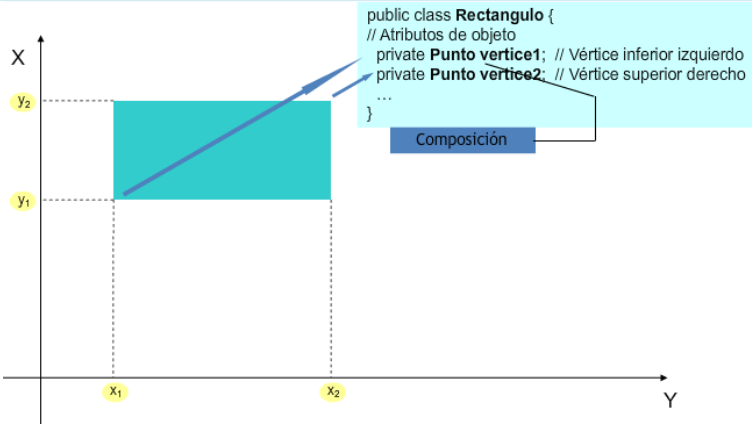
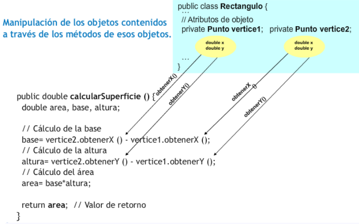
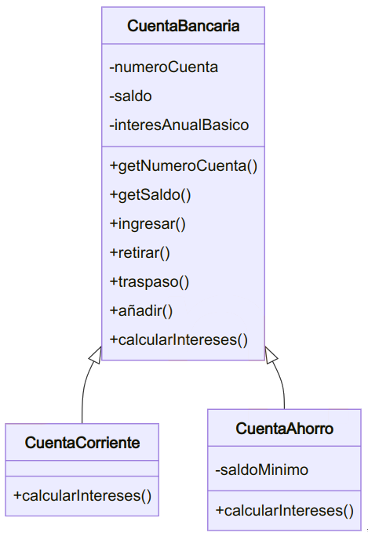
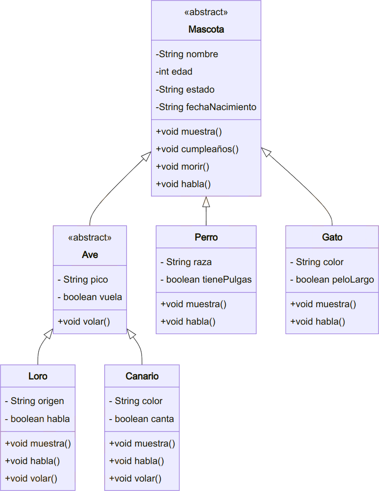

# ☕ UT5 — Características Avanzadas de POO: Composición, Herencia, Interfaces y Polimorfismo

> **📌 Informació Curricular de la Unitat (UT5)**
> **Resultat d'Aprenentatge:** RA7. Desarrolla programas aplicando características avanzadas de los lenguajes orientados a objetos y del entorno de programación.
>
> **Índex ràpid d'apartats en aquesta pàgina:**
>
> - [**5.0 RA y Criterios de Evaluación**](#ut05ras) — [*(Obrir apartat individual)*](./ut05ras.md)
> - [**5.1 Relaciones entre clases (Asociación, Agregación, Herencia)**](#ut0501) — [*(Obrir apartat individual)*](./ut0501.md)
> - [**5.2 Composición de clases**](#ut0502) — [*(Obrir apartat individual)*](./ut0502.md)
> - [**5.3 Herencia y jerarquías de clases (extends, super)**](#ut0503) — [*(Obrir apartat individual)*](./ut0503.md)
> - [**5.4 Clases y métodos abstractos (abstract)**](#ut0504) — [*(Obrir apartat individual)*](./ut0504.md)
> - [**5.5 Interfaces (interface, implements)**](#ut0505) — [*(Obrir apartat individual)*](./ut0505.md)
> - [**5.6 Polimorfismo y ligadura dinámica**](#ut0506) — [*(Obrir apartat individual)*](./ut0506.md)
> - [**Actividades prácticas UT5**](#ut05actividades) — [*(Obrir apartat individual)*](./ut05actividades.md)
> - [**Retos de programación UT5**](#ut05retos) — [*(Obrir apartat individual)*](./ut05retos.md)
> - [**Simulacro práctico UT5**](#ut05acSimulacro) — [*(Obrir apartat individual)*](./ut05acSimulacro.md)
> - [**Proyecto Intermodular UT5**](#ut05pi) — [*(Obrir apartat individual)*](./ut05pi.md)

---

# RA 4 - Desarrolla programas organizados en clases analizando y aplicando los principios de la programación orientada a objetos.

| Criterio de Evaluación | Apartado | Bloque de actividades |
| --- | --- | --- |
| g) Se han definido y utilizado clases heredadas. | [5.3 Herencia](./ut0503.md) | [Bloque 5.1](./ut05actividades.md#bloque-51) |

# RA 7 - Desarrolla programas aplicando características avanzadas de los lenguajes orientados a objetos y del entorno de programación.

| Criterio de Evaluación | Apartado | Bloque de actividades |
| --- | --- | --- |
| a) Se han identificado los conceptos de herencia, superclase y subclase. | [5.1 Relaciones entre clases](./ut0501.md) | Todos los bloques |
| b) Se han utilizado modificadores para bloquear y forzar la herencia de clases y métodos. | [5.1 Relaciones entre clases](./ut0501.md) | [Bloque 5.0](./ut05actividades.md#bloque-50) [Bloque 5.1](./ut05actividades.md#bloque-51) |
| c) Se ha reconocido la incidencia de los constructores en la herencia. | [5.3 Herencia](./ut0503.md) | Todos los bloques |
| d) Se han creado clases heredadas que sobrescriben la implementación de métodos de la superclase. | [5.3 Herencia](./ut0503.md) [5.4 Clases abstractas](./ut0504.md) | [Bloque 5.1](./ut05actividades.md#bloque-51) |
| e) Se han diseñado y aplicado jerarquías de clases. | A lo largo de toda la UT | Todos los bloques |
| f) Se han probado y depurado las jerarquías de clases. | A lo largo de toda la UT | Todos los bloques |
| g) Se han realizado programas que implementen y utilicen jerarquías de clases. | A lo largo de toda la UT | Todos los bloques |
| h) Se ha comentado y documentado el código. | A lo largo de toda la UT | Todos los bloques |
| i) Se han identificado y evaluado los escenarios de uso de interfaces. | [5.5 Interfaces](./ut0505.md) | [Bloque 5.2](./ut05actividades.md#bloque-52) |
| j) Se han identificado y evaluado los escenarios de utilización de la herencia y la composición. | [5.2 Composición](./ut0503.md) [5.3 Herencia](./ut0503.md) | Todos los bloques |

---

# 5.1 Relaciones entre clases


Cuando estudiaste el concepto de *clase*, esta fue descrita como una especie de mecanismo de definición (plantillas), en el que se basaría el entorno de ejecución a la hora de construir un objeto: un mecanismo de definición de objetos.

Por tanto, a la hora de diseñar un conjunto de clases para modelar el conjunto de información cuyo tratamiento se desea automatizar, es importante establecer apropiadamente las posibles relaciones que puedan existir entre unas clases y otras.

En algunos casos es posible que no exista relación alguna entre unas clases y otras, pero lo más habitual es que sí exista: una clase puede ser una **especialización** (relación entre dos clases donde una de ellas, la subclase, es una versión más especializada que la otra, la superclase, compartiendo características en común pero añadiendo ciertas características específicas que la especializan). El punto de vista inverso sería la **generalización** (relación entre dos clases donde una de ellas, la superclase, es una versión más genérica que la otra, la subclase, compartiendo características en común pero sin las propiedades específicas que caracterizan a la subclase). Es decir, que entre unas clases y otras habrá que definir cuál es su relación (si es que existe alguna).

Se pueden distinguir diversos **tipos de relaciones** entre clases:

- **Clientela** : cuando una clase utiliza objetos de otra clase (por ejemplo al pasarlos como parámetros a través de un método).
- **Composición** : cuando alguno de los atributos de una clase es un objeto de otra clase.
- **Anidamiento** : cuando se definen clases en el interior de otra clase.
- **Herencia** : cuando una clase comparte determinadas características con otra (clase base), añadiéndole alguna funcionalidad específica (especialización).

La relación de **clientela** la llevas utilizando desde que has empezado a programar en Java, pues desde tu clase principal (clase con método `main` ) has estado declarando, creando y utilizando objetos de otras clases.

> **📌 Ejemplo clientela**
> Si utilizas un objeto `String` dentro de la clase principal de tu programa, este será **cliente** de la clase `String` (como sucederá con prácticamente cualquier programa que se escriba en Java). Es la relación fundamental y más habitual entre clases (la utilización de unas clases por parte de otras) y, por supuesto, la que más vas a utilizar tú también; de hecho, ya la has estado utilizando y lo seguirás haciendo.

La relación de **composición** es posible que ya la hayas tenido en cuenta si has definido clases que contenían (tenían como atributos) otros objetos en su interior, lo cual es bastante habitual.

> **📌 Ejemplo composición**
> Si escribes una clase donde alguno de sus atributos es un objeto de tipo `String` , ya se está produciendo una relación de tipo composición (tu clase "tiene" un `String` , es decir, está compuesta por un objeto `String` y por algunos elementos más).

La relación de **anidamiento** (o *anidación*) es quizá menos habitual, pues implica declarar unas clases dentro de otras (clases internas o anidadas). En algunos casos puede resultar útil para tener un nivel más de encapsulamiento (ocultamiento del estado de un objeto, de sus datos miembro o atributos) de manera que sólo se puede cambiar mediante las operaciones (métodos) definidas para ese objeto. Cada objeto está aislado del exterior de manera que se protegen los datos contra su modificación por quien no tenga derecho a acceder a ellos, eliminando efectos secundarios y colaterales no deseados. Este modo de proceder permite que el usuario de una clase pueda obviar la implementación de los métodos y propiedades para concentrarse sólo en cómo usarlos. Por otro lado se evita que el usuario pueda cambiar su estado de manera imprevista e incontrolada, y oculta información (efecto que se consigue gracias a la encapsulación: se evita la visibilidad de determinados miembros de una clase al resto del código del programa para de ese modo comunicarse con los objetos de la clase únicamente a través de su interfaz/métodos).

> **📌 Ejemplo anidamiento**
> ```java
> // Clase externa Persona
> public class Persona {
>
>     private String nombre;
>     private Direccion direccion;
>
>     // Constructor
>     public Persona(String nombre, String calle, String ciudad) {
>         this.nombre = nombre;
>         this.direccion = new Direccion(calle, ciudad);
>     }
>
>     public void mostrarDatos() {
>         System.out.println("Nombre: " + nombre);
>         System.out.println("Dirección: " + direccion.obtenerDireccionCompleta());
>     }
>
>     // Clase interna anidada Direccion
>     private class Direccion {
>         private String calle;
>         private String ciudad;
>
>         public Direccion(String calle, String ciudad) {
>             this.calle = calle;
>             this.ciudad = ciudad;
>         }
>
>         public String obtenerDireccionCompleta() {
>             return calle + ", " + ciudad;
>         }
>     }
>
>     public static void main(String[] args) {
>         Persona p = new Persona("María García", "Av. Principal 123", "Valencia");
>         p.mostrarDatos();
>
>         // La siguiente línea generaría un error ya que Direccion es privada:
>         // Persona.Direccion direccion = p.new Direccion("Calle Secundaria", "Madrid");
>     }
> }
> ```

En el caso de la relación de **herencia** también la has visto ya, pues seguro que has utilizado unas clases que derivaban de otras, sobre todo, en el caso de los objetos que forman parte de las interfaces gráficas. Lo más probable es que hayas tenido que declarar clases que derivaban de algún componente gráfico (`JFrame`, `JDialog`, etc.).

Podría decirse que tanto la composición como la anidación son casos particulares de clientela, pues en realidad en todos esos casos una clase está haciendo uso de otra (al contener atributos que son objetos de la otra clase, al definir clases dentro de otras clases, al utilizar objetos en el paso de parámetros, al declarar variables locales utilizando otras clases, etc.).

A lo largo de la unidad, irás viendo distintas posibilidades de implementación de clases haciendo uso de todas estas relaciones, centrándonos especialmente en el caso de la herencia, que es la que permite establecer las relaciones más complejas.

## 1. Composición

Cuando en un sistema de información, una determinada **entidad `A` contiene a otra `B`** como una de sus partes, se suele decir que se está produciendo una relación de composición. Es decir, el objeto de la clase `A` contiene a uno o varios objetos de la clase `B`.

> **📌 Ejemplo composición**
> Si describes una entidad `Pais` compuesta por una serie de atributos, entre los cuales se encuentra una lista de comunidades autónomas, podrías decir que los objetos de la clase `Pais` contienen varios objetos de la clase `ComunidadAutonoma`. Por otro lado, los objetos de la clase `ComunidadAutonoma` podrían contener como atributos objetos de la clase `Provincia`, la cual a su vez también podría contener objetos de la clase `Municipio`.
>
> Código Java
>
> 📋 Copiar
> JAVA
>
> `public class Municipio {
>  private String nombre;
>  // ...
> }`
>
> Código Java
>
> 📋 Copiar
> JAVA
>
> `public class ComunidadAutonoma {
>  private String nombre;
>  private Municipio[] municipios;
>  // ...
> }`
>
> Código Java
>
> 📋 Copiar
> JAVA
>
> `public class Pais {
>  private String nombre;
>  private ComunidadAutonoma[] comunidades;
>  // ...
> }`

Como puedes observar, la composición puede encadenarse todas las veces que sea necesario hasta llegar a objetos básicos del lenguaje o hasta tipos primitivos que ya no contendrán otros objetos en su interior. Ésta es la forma más habitual de definir clases: mediante otras clases ya definidas anteriormente. Es una manera eficiente y sencilla de gestionar la reutilización de todo el código ya escrito. Si se definen clases que describen entidades distinguibles y con funciones claramente definidas, podrán utilizarse cada vez que haya que representar objetos similares dentro de otras clases.

> **📌 Anotación**
> La composición se da cuando una clase contiene algún atributo que es una referencia a un objeto de otra clase.

Una forma sencilla de plantearte si la relación que existe entre dos clases A y B es de composición podría ser mediante la expresión idiomática "***tiene un***": "*la clase A tiene uno o varios objetos de la clase B*", o visto de otro modo: "*Objetos de la clase B pueden formar parte de la clase A*".

> **📌 Algunos ejemplos ...**
> - Un coche tiene un motor y tiene cuatro ruedas.
> - Una persona tiene un nombre, una fecha de nacimiento, una cuenta bancaria asociada para ingresar la nómina, etc.
> - Un cocodrilo bajo investigación científica que tiene un número de dientes determinado, una edad, unas coordenadas de ubicación geográfica (medidas con GPS), etc.

> **📌 Recuperando algunos ejemplos de clases que ya hemos utilizado anteriormente ...**
> - Una clase `Rectangulo` podría contener en su interior dos objetos de la clase `Punto` para almacenar los vértices inferior izquierdo y superior derecho.
> - Una clase `Empleado` podría contener en su interior un objeto de la clase `DNI` para almacenar su DNI/NIF, y otro objeto de la clase `CuentaBancaria` para guardar la cuenta en la que se realizan los ingresos en nómina.

> **📌 ¿Podría decirse que la relación que existe entre la clase Ave y la clase Loro es una relación de composición?**
> No. Aunque claramente existe algún tipo de relación entre ambas, no parece que sea la de composición. No parece que se cumpla la expresión "tiene un": "Un loro tiene un ave". Se cumpliría más bien una expresión del tipo "es un": "Un loro es un ave". Algunos objetos que cumplirían la relación de composición podrían ser `Pico` o `Alas`, pues "un loro tiene un pico y dos alas", del mismo modo que "un ave tiene pico y dos alas". Este tipo de relación parece más de herencia (un loro es un tipo de ave).

## 2. Herencia

El mecanismo que permite crear clases basándose en otras que ya existen es conocido como herencia. Como ya has visto en unidades anteriores, Java implementa la herencia mediante la utilización de la palabra reservada `extends`.

El concepto de herencia es algo bastante simple y sin embargo muy potente: cuando se desea definir una nueva clase y ya existen clases que, de alguna manera, implementan parte de la funcionalidad que se necesita, es posible crear una nueva clase derivada de la que ya tienes. Al hacer esto se posibilita la reutilización de todos los atributos y métodos de la clase que se ha utilizado como base (clase madre o superclase), sin la necesidad de tener que escribirlos de nuevo.

Una subclase hereda todos los miembros de su clase madre (atributos, métodos y clases internas). Los constructores no se heredan, aunque se pueden invocar desde la subclase.

> **📌 Algunos ejemplos ...**
> - Un *coche* es un *vehículo* (heredará atributos como la *velocidad máxima* o métodos como *parar* y *arrancar* ).
> - Un *empleado* es una *persona* (heredará atributos como el *nombre* o la *fecha de nacimiento* ).
> - Un *rectángulo* es una *figura geométrica* en el plano (heredará métodos como el *cálculo de la superficie* o de su *perímetro* ).
> - Un cocodrilo es un reptil (heredará atributos como por ejemplo el *número de dientes* ).

En este caso la expresión idiomática que puedes usar para plantearte si el tipo de relación entre dos clases A y B es de herencia podría ser "***es un***": "*la clase B es un tipo específico de la clase A*" (especialización), o visto de otro modo: "*la clase A es un caso general de la clase B*" (generalización).

> **📌 Recuperando algunos ejemplos de clases que ya hemos utilizado anteriormente ...**
> - Una ventana en una aplicación gráfica puede ser una clase que herede de `JFrame` (componente `Swing` : `javax.swing.JFrame` ), de esta manera esa clase será un marco que dispondrá de todos los métodos y atributos de `JFrame` más aquellos que tú decidas incorporarle al rellenarlo de componentes gráficos.
> - Una caja de diálogo puede ser un tipo de `JDialog` (otro componente `Swing` : `javax.swing.JDialog` ).

En Java, la clase `Object` (dentro del paquete `java.lang`) define e implementa el comportamiento común a todas las clases (incluidas aquellas que tú escribas). Como recordarás, ya se dijo que en Java cualquier clase deriva en última instancia de la clase `Object`.

Todas las clases tienen una clase madre, que a su vez también posee una superclase, y así sucesivamente hasta llegar a la clase `Object` . De esta manera, se construye lo que habitualmente se conoce como una jerarquía de clases, que en el caso de Java tendría a la clase `Object` en la raíz.

> **📌 Anotación**
> Cuando escribas una clase en Java, puedes hacer que herede de una determinada clase madre (mediante el uso de `extends`) o bien no indicar ninguna herencia. En tal caso, aunque no indiques explícitamente ningún tipo de herencia, el compilador asumirá entonces de manera implícita que tu clase hereda de la clase `Object`, que define e implementa el comportamiento común a todas las clases.

## 3. ¿Herencia o composición?

Cuando escribas tus propias clases, debes intentar tener claro en qué casos utilizar la composición y cuándo la herencia:

- **Composición** : cuando una clase está formada por objetos de otras clases. En estos casos se incluyen objetos de esas clases, pero no necesariamente se comparten características con ellos (no se heredan características de esos objetos, sino que directamente se utilizarán sus atributos y sus métodos). Esos objetos incluidos no son más que atributos miembros de la clase que se está definiendo.
- **Herencia** : cuando una clase cumple todas las características de otra. En estos casos la clase derivada es una especialización (o particularización, extensión o restricción) de la clase base. Desde otro punto de vista se diría que la clase base es una generalización de las clases derivadas.

> **📌 Ejemplo herencia**
> Imagina que dispones de una clase `Punto` (ya la has utilizado en otras ocasiones) y decides definir una nueva clase llamada `Círculo`. Dado que un punto tiene como atributos sus coordenadas en plano (x1, y1), decides que es buena idea aprovechar esa información e incorporarla en la clase `Circulo` que estás escribiendo. Para ello utilizas la herencia, de manera que al derivar la clase `Círculo` de la clase `Punto`, tendrás disponibles los atributos x1 e y1. Ahora solo faltaría añadirle algunos atributos y métodos más como por ejemplo el radio del círculo, el cálculo de su área y su perímetro, etc.
>
> En principio parece que la idea pueda funcionar pero es posible que más adelante, si continúas construyendo una jerarquía de clases, observes que puedas llegar a conclusiones incongruentes al suponer que un círculo es una especialización de un punto (un tipo de punto). ¿Todas aquellas figuras que contengan uno o varios puntos deberían ser tipos de punto? ¿Y si tienes varios puntos? ¿Cómo accedes a ellos? ¿Un rectángulo también tiene sentido que herede de un punto? No parece muy buena idea.
>
> Parece que en este caso habría resultado mejor establecer una relación de *composición*. Analízalo detenidamente: ¿cuál de estas dos situaciones te suena mejor?
>
> 1. " *Un círculo es un punto (su centro)* ", y por tanto heredará las coordenadas x1 e y1 que tiene todo punto. Además tendrá otras características específicas como el radio o métodos como el cálculo de la longitud de su perímetro o de su área.
> 2. " *Un círculo tiene un punto (su centro)* ", junto con algunos atributos más como por ejemplo el radio. También tendrá métodos para el cálculo de su área o de la longitud de su perímetro.
>
> Parece que en este caso la composición refleja con mayor fidelidad la relación que existe entre ambas clases. Normalmente suele ser suficiente con plantearse las preguntas "¿*B es un tipo de A*?" o "¿*B contiene elementos de tipo A*?".

> **📌 Un poquito de ...**

---

# 5.2 Composición

## 1. Sintaxis de la composición

Para indicar que una clase contiene objetos de otra clase no es necesaria ninguna sintaxis especial. Cada uno de esos objetos no es más que un atributo y, por tanto, debe ser declarado como tal:

```java
class <nombreClase> {
  [modificadores] <NombreClase1> nombreAtributo1;
  [modificadores] <NombreClase2> nombreAtributo2;
  <NombreClase3>[] listado;
  ...    
}
```

En unidades anteriores has trabajado con la clase `Punto`, que definía las coordenadas de un punto en el plano, y con la clase `Rectangulo`, que definía una figura de tipo rectángulo también en el plano a partir de dos de sus vértices (inferior izquierdo y superior derecho). Tal y como hemos formalizado ahora los tipos de relaciones entre clases, parece bastante claro que aquí tendrías un caso de composición: "*un rectángulo contiene puntos*". Por tanto, podrías ahora redefinir los atributos de la clase `Rectangulo` (cuatro números reales) como dos objetos de tipo `Punto`:

```java
class Rectangulo {
  private Punto vertice1;
  private Punto vertice2;
  ...
}
```

Ahora los métodos de esta clase deberán tener en cuenta que ya no hay cuatro atributos de tipo `double`, sino dos atributos de tipo `Punto` (cada uno de los cuales contendrá en su interior dos atributos de tipo `double`).

> **📌 Ejemplo 2.01: Revisa con cuidado el siguiente ejemplo**
> Intenta reescribir los siguientes los métodos de la clase `Rectangulo` teniendo en cuenta ahora su nueva estructura de atributos (dos objetos de la clase `Punto`, en lugar de cuatro elementos de tipo `double`):
>
> - Método `calcularSuperfice`, que calcula y devuelve el área de la superficie encerrada por la figura.
> - Método `calcularPerimetro`, que calcula y devuelve la longitud del perímetro de la figura.
>
> **Solución**
>
> En ambos casos la interfaz no se ve modificada en absoluto (desde fuera su funcionamiento es el mismo), pero internamente deberás tener en cuenta que ya no existen los atributos `x1`, `y1`, `x2`, `y2`, de tipo `double`, sino los atributos `vertice1` y `vertice2` de tipo `Punto`.
>
> ```java
> public class Punto {
>     private double x;
>     private double y;
>
>     public Punto(double x, double y) {
>         this.x = x;
>         this.y = y;
>     }
>
>     public double getX() {
>         return x;
>     }
>
>     public void setX(double x) {
>         this.x = x;
>     }
>
>     public double getY() {
>         return y;
>     }
>
>     public void setY(double y) {
>         this.y = y;
>     }
> }
> ```
>
> En la siguiente presentación puedes observar detalladamente el proceso completo de elaboración de la clase `Rectangulo` haciendo uso de la clase `Punto`:
>
> 1) Objetos de tipo `Rectangulo` compuesto por objetos de tipo `Punto`:
>
> 
>
> 2) Clase `Rectangulo` y su método `calcularSuperficie`:
>
> 
>
> ```java
> public class Rectangulo {
>     // Atributos de objeto
>     private Punto vertice1;  // Vértice inferior izquierdo
>     private Punto vertice2;  // Vértice superior derecho
>
>     public double calcularSuperficie (){
>         // cálculo de la base
>         double base = vertice2.obtenerX() - vertice1.obtenerX();
>         // cálculo de la altura
>         double altura = vertice2.obtenerY() - vertice1.obtenerY();
>         // cálculo del área
>         double area = base * altura;
>         return area;   // valor de retorno
>     }
> }
> ```

## 2. Uso de la composición

### 2.1. Preservación de la ocultación

Como ya has observado, la relación de composición no tiene más misterio a la hora de implementarse que simplemente declarar atributos de las clases que necesites dentro de la clase que estés diseñando.

Ahora bien, cuando escribas clases que contienen objetos de otras clases (lo cual será lo más habitual) deberás tener un poco de **precaución con aquellos métodos que devuelvan información acerca de los atributos de la clase** (métodos *consultores* o de tipo *get*).

Como ya viste en la unidad dedicada a la creación de clases, lo normal suele ser declarar los atributos como privados (o protegidos, como veremos un poco más adelante) para ocultarlos a los posibles clientes de la clase (otros objetos que en el futuro harán uso de la clase). Para que otros objetos puedan acceder a la información contenida en los atributos, o al menos a una parte de ella, deberán hacerlo a través de métodos que sirvan de interfaz, de manera que sólo se podrá tener acceso a aquella información que el creador de la clase haya considerado oportuna. Del mismo modo, los atributos solamente serán modificados desde los métodos de la clase, que decidirán cómo y bajo qué circunstancias deben realizarse esas modificaciones. Con esa metodología de acceso se tenía perfectamente separada la parte de manipulación interna de los atributos de la interfaz con el exterior.

Hasta ahora los métodos de tipo *get* devolvían tipos primitivos, es decir, copias del contenido (a veces con algún tipo de modificación o de formato) que había almacenado en los atributos, pero los atributos seguían "a salvo" como elementos privados de la clase. Pero, a partir de este momento, al tener objetos dentro de las clases y no sólo tipos primitivos, es posible que en un determinado momento interese devolver un objeto completo.

> **🚨 Cuidado al devolver atributos de tipo objeto**
> Cuando vayas a devolver un objeto habrás de obrar con mucha precaución. Si en un método de la clase devuelve directamente un objeto que es un atributo, **estarás ofreciendo directamente una referencia a un objeto atributo que probablemente has definido como privado**.
>
> ¡De esta forma estás volviendo a hacer público un atributo que inicialmente era privado!
>
> Para evitar ese tipo de situaciones (ofrecer al exterior referencias a objetos privados) puedes optar por diversas alternativas, procurando siempre evitar la devolución directa de un atributo que sea un objeto:
>
> opción 1) Devolver siempre tipos primitivos.
>
> opción 2) Dado que siempre no va a ser posible devolver tipos primitivos, otra posibilidad es **crear un nuevo objeto que sea una copia del atributo que quieres devolver y utilizar ese objeto como valor de retorno**. Es decir, crear una copia del objeto especialmente para devolverlo. De esta manera, el código cliente de ese método podrá manipular a su antojo ese nuevo objeto, pues no será una referencia al atributo original, sino un nuevo objeto con el mismo contenido.
>
> opción 3) Debes tener en cuenta que es posible que en algunos casos sí se necesite realmente la referencia al atributo original (algo muy habitual en el caso de atributos estáticos). En tales casos, no habrá problema en devolver directamente el atributo para que el código *llamante* (cliente) haga el uso que estime oportuno de él.
>
> **Resumiendo**:
> Debes evitar por todos los medios la devolución de un atributo que sea un objeto, pues estarías dando directamente una referencia al atributo, visible y manipulable desde fuera; salvo que se trate de un caso en el que deba ser así.

Para entender estas situaciones un poco mejor, podemos volver a la clase `Rectangulo` y observar sus nuevos métodos de tipo *get*.

> **📌 Ejemplo 2.02: Revisa con cuidado el siguiente ejemplo**
> Dada la clase `Rectangulo`, escribe sus nuevos métodos `getVertice1` y `getVertice2` para que devuelvan los vértices inferior izquierdo y superior derecho del rectángulo (objetos de tipo `Punto`), teniendo en cuenta su nueva estructura de atributos (dos objetos de la clase `Punto`, en lugar de cuatro elementos de tipo `double`):
>
>  Solución
>
>  Solución
> **Solución incorrecta**
>
> Los métodos de obtención de vértices devolverán objetos de la clase `Punto`:
>
> ```java
> public Punto getVertice1 (){
>     return vertice1;
> }
>
> public Punto getVertice2 (){
>     return vertice2;
> }
> ```
>
> Esto funcionaría perfectamente, pero deberías tener cuidado con este tipo de métodos que devuelven directamente una referencia a un objeto atributo que probablemente has definido como privado.
>
> > Cuidado!! estás de alguna manera haciendo público un atributo que fue declarado como privado**.
> **Solución correcta**
>
> Para evitar que esto suceda bastaría con **crear un nuevo objeto que fuera una copia del atributo que se desea devolver** (en este caso un objeto de la clase `Punto`).
>
> Aquí tienes la solución para la nueva clase `Rectangulo`:
>
> ```java
> class Rectangulo {
>     private Punto vertice1;
>     private Punto vertice2;
>
>     public double calcularSuperficie() {
>         double area, base, altura; // Variables locales
>         base = vertice2.getX() - vertice1.getX(); // Antes era x2 - x1
>         altura = vertice2.getY() - vertice1.getY(); // Antes era y2 - y1
>         area = base * altura;
>         return area;
>     }
>
>     public double calcularPerimetro() {
>         double perimetro, base, altura; // Variables locales
>         base = vertice2.getX() - vertice1.getX(); // Antes era x2 - x1
>         altura = vertice2.getY() - vertice1.getY(); // Antes era y2 - y1
>         perimetro = 2 * base + 2 * altura;
>         return perimetro;
>     }
>
>     /*
>     * ASÍ NO!!
>     *
>     *public Punto getVertice1mal() {
>     *    return vertice1;
>     *}
>     *
>     *public Punto getVertice2mal() {
>     *    return vertice2;
>     *}  
>     */
>
>     // Método 1:
>     public Punto getVertice1() {
>         // Creación de un nuevo punto extrayendo sus atributos:
>         double x, y;
>         Punto p;
>         x = this.vertice1.getX();
>         y = this.vertice1.getY();
>         p = new Punto(x, y);
>         return p;
>     }
>
>     // Método 2 (mucho mejor este método):
>     public Punto getVertice2() {
>         // Utilizando el constructor copia de Punto (si es que está definido)
>
>         // Punto p;
>         // p = new Punto(this.vertice2);
>         // return p;
>
>         // o más corto:
>         // Uso del constructor copia
>         return new Punto(this.vertice2);
>     }
>
>     public Rectangulo(Punto vertice1, Punto vertice2) {
>         // para evitar aliasing (compartir referencia)
>         this.vertice1 = new Punto(vertice1); // copia del punto
>         this.vertice2 = new Punto(vertice2); // copia del punto
>     }
>
>     public static void main(String[] args) {
>         Punto puntoA = new Punto(0, 0);
>         Punto puntoB = new Punto(5, 5);
>
>         Rectangulo rectA = new Rectangulo(puntoA, puntoB);
>         System.out.println("Perímetro del rectanculo A: " + rectA.calcularPerimetro());  //20
>
>         puntoA.setX(4);
>         puntoA.setY(4);
>
>         Rectangulo rectB = new Rectangulo(puntoA, puntoB);
>         System.out.println("Creo un nuevo rectangulo, pero cambia el Perímetro del anterior");
>         System.out.println("Perímetro del rectanculo A: " + rectA.calcularPerimetro());  //20
>         System.out.println("Perímetro del rectanculo B: " + rectB.calcularPerimetro());  //4
>     }
> }
> ```
>
> De esta manera, se devuelve un punto totalmente nuevo que podrá ser manipulado sin ningún temor por parte del código cliente de la clase pues es una copia para él.

### 2.2. Llamadas a constructores

Otro factor que debes considerar, a la hora de escribir clases que contengan como atributos objetos de otras clases, es su comportamiento a la hora de instanciarse. Durante el proceso de creación de un objeto (constructor) de la clase contenedora habrá que tener en cuenta también la creación (llamadas a constructores) de aquellos objetos que son contenidos.

> **📌 A tener en cuenta**
> El constructor de la clase contenedora debe invocar a los constructores de las clases de los objetos contenidos.

En este caso hay que tener cuidado con las referencias a objetos que se pasan como parámetros para rellenar el contenido de los atributos. **Es conveniente hacer una copia de esos objetos y utilizar esas copias para los atributos pues si se utiliza la referencia que se ha pasado como parámetro, el código cliente de la clase podría tener acceso a ella sin necesidad de pasar por la interfaz de la clase (volveríamos a dejar abierta una puerta pública a algo que quizá sea privado)**.

Además, si el objeto parámetro que se pasó al constructor formaba parte de otro objeto, esto podría ocasionar un desagradable efecto colateral si esos objetos son modificados en el futuro desde el código cliente de la clase, ya que no sabes de dónde provienen esos objetos, si fueron creados especialmente para ser usados por el nuevo objeto creado o si pertenecen a otro objeto que podría modificarlos más tarde. Es decir, correrías el riesgo de estar "compartiendo" esos objetos con otras partes del código, sin ningún tipo de control de acceso y con las nefastas consecuencias que eso podría tener: cualquier cambio de ese objeto afectaría a partes del programa supuestamente independientes, que entienden ese objeto como suyo.

> **📌 A tener en cuenta**
> En el fondo, los objetos no son más que variables de tipo referencia a la zona de memoria en la que se encuentra toda la información del objeto en sí mismo. Esto es, puedes tener un único objeto y múltiples referencias a él. Pero sólo se trata de un objeto, y cualquier modificación desde una de sus referencias afectaría a todas las demás, pues estamos hablando del mismo objeto.

Recuerda también que sólo se crean objetos cuando se llama a un constructor (uso de `new`). Si realizas asignaciones o pasos de parámetros, no se están copiando o pasando copias de los objetos, sino simplemente de las referencias, y por tanto se tratará siempre del mismo objeto.

Se trata de un efecto similar al que sucedía en los métodos de tipo *get*, pero en este caso en sentido contrario (en lugar de que nuestra clase "*regale*" al exterior uno de sus atributos objeto mediante una referencia, en esta ocasión se "*adueña*" de un parámetro objeto que probablemente pertenezca a otro objeto y que es posible que en el futuro haga uso de él).

Para entender mejor estos posibles efectos podemos continuar con el ejemplo de la clase `Rectangulo` que contiene en su interior dos objetos de la clase `Punto`. En los constructores del rectángulo habrá que incluir todo lo necesario para crear dos instancias de la clase `Punto` evitando las referencias a parámetros (haciendo copias).

> **📌 Ejemplo 2.03: Revisa con cuidado el siguiente ejemplo**
> Intenta reescribir los constructores de la clase `Rectangulo` teniendo en cuenta ahora su nueva estructura de atributos (dos objetos de la clase `Punto`, en lugar de cuatro elementos de tipo `double`):
>
> **1º**) Un constructor sin parámetros (para sustituir al constructor por defecto) que haga que los valores iniciales de las esquinas del rectángulo sean (0,0) y (1,1).
>
> **2º**) Un constructor con cuatro parámetros, `x1`, `y1`, `x2`, `y2`, que cree un rectángulo con los vértices (`x1`, `y1`) y (`x2`, `y2`).
>
> **3º**) Un constructor con dos parámetros, `punto1`, `punto2`, que rellene los valores iniciales de los atributos del rectángulo con los valores proporcionados a través de los parámetros.
>
> **4º**) Un constructor con dos parámetros, `base` y `altura`, que cree un rectángulo donde el vértice inferior derecho esté ubicado en la posición (0,0) y que tenga una base y una altura tal y como indican los dos parámetros proporcionados.
>
> **5º**) Un constructor copia.
>
> **Solución**
>
> Durante el proceso de creación de un objeto (constructor) de la clase contenedora (en este caso `Rectangulo`) hay que tener en cuenta también la creación (llamada a constructores) de aquellos objetos que son contenidos (en este caso objetos de la clase `Punto`).
>
> **1º**) En el caso del primer constructor, habrá que crear dos puntos con las coordenadas (0,0) y (1,1) y asignarlos a los atributos correspondientes (`vertice1` y `vertice2`):
>
> Código Java
>
> 📋 Copiar
> JAVA
>
> `public Rectangulo (){
>  this.vertice1 = new Punto (0,0);
>  this.vertice2 = new Punto (1,1);
> }`
>
> **2º**) Para el segundo constructor habrá que crear dos puntos con las coordenadas x1, y1, x2, y2 que han sido pasadas como parámetros:
>
> Código Java
>
> 📋 Copiar
> JAVA
>
> `public Rectangulo (double x1, double y1, double x2, double y2){
>  this.vertice1 = new Punto (x1, y1);
>  this.vertice2 = new Punto (x2, y2);
> }`
>
> **3º**) En el caso del tercer constructor puedes utilizar directamente los dos puntos que se pasan como parámetros para construir los vértices del rectángulo.
>
> ```java
> public Rectangulo (Punto vertice1, Punto vertice2) {
>     this.vertice1 = vertice1;
>     this.vertice2 = vertice2;
> }
> ```
>
> Ahora bien, **esto podría ocasionar un efecto colateral no deseado si esos objetos de tipo `Punto` son modificados en el futuro desde el código cliente del constructor** (no sabes si esos puntos fueron creados especialmente para ser usados por el rectángulo o si pertenecen a otro objeto que podría modificarlos más tarde).
>
> Por tanto, para este caso quizá fuera recomendable **crear dos nuevos puntos a imagen y semejanza de los puntos que se han pasado como parámetros**. Para ello tendrías dos opciones:
>
> a) Llamar al constructor de la clase `Punto` con los valores de los atributos (x, y).
>
> Código Java
>
> 📋 Copiar
> JAVA
>
> `public Rectangulo(Punto vertice1, Punto vertice2) {
>  this.vertice1 = new Punto(vertice1.getX(), vertice1.getY());
>  this.vertice2 = new Punto(vertice2.getX(), vertice2.getY());
> }`
>
> b) Llamar al constructor copia de la clase `Punto`, si es que se dispone de él.
>
> Código Java
>
> 📋 Copiar
> JAVA
>
> `public Rectangulo (Punto vertice1, Punto vertice2) {
>  this.vertice1 = new Punto (vertice1);
>  this.vertice2 = new Punto (vertice2);
> }`
>
> **4º**) Para el cuarto caso, el caso del constructor que recibe como parámetros la *base* y la *altura*, habrá que crear sendos vértices con valores (0,0) y (0 + base, 0 + altura), o lo que es lo mismo: (0,0) y (base, altura).
>
> Código Java
>
> 📋 Copiar
> JAVA
>
> `public Rectangulo(double base, double altura) {
>  this.vertice1 = new Punto(0,0);
>  this.vertice2 = new Punto(base, altura);
> }`
>
> **5º**) Quedaría finalmente por implementar el constructor copia, quinto caso:
>
> ```java
> public Rectangulo (Rectangulo r) {
>     this.vertice1 = new Punto (r.getVertice1());
>     this.vertice2 = new Punto (r.getVertice2());
> }
> ```
>
> En este caso nuevamente volvemos a clonar los atributos `vertice1` y `vertice2` del objeto `r` que se ha pasado como parámetro para evitar tener que compartir esos atributos en los dos rectángulos.
>
> Así ahora el método `main` que comprueba la clase `Rectangulo` funciona correctamente:
>
> ```java
> public static void main(String[] args) {
>     Punto puntoA = new Punto(0, 0);
>     Punto puntoB = new Punto(5, 5);
>
>     Rectangulo rectA = new Rectangulo(puntoA, puntoB);
>     System.out.println("Perímetro del rectanculo A: " + rectA.calcularPerimetro());//20
>
>     puntoA.setX(4);
>     puntoA.setY(4);
>
>     Rectangulo rectB = new Rectangulo(puntoA, puntoB);
>     System.out.println("Creo un nuevo rectangulo, pero cambia el Perímetro del anterior");
>     System.out.println("Perímetro del rectanculo A: " + rectA.calcularPerimetro());//20
>     System.out.println("Perímetro del rectanculo B: " + rectB.calcularPerimetro());//4
> }
> ```

## 3. Clases anidadas o internas

En algunos lenguajes, es posible definir una clase dentro de otra clase (clases internas):

```java
class ClaseContenedora {
  // Cuerpo de la clase
  ...
  class ClaseInterna {
    // Cuerpo de la clase interna
    ...
  }
}
```

Se pueden distinguir varios tipos de clases internas:

- Clases **internas estáticas** (o clases **anidadas**), declaradas con el modificador `static`. Estas clases anidadas, como miembros de una clase que son (miembros de `ClaseContenedora`), pueden ser declaradas con los modificadores `public`, `protected`, `private` o de `paquete`, como el resto de miembros.
- Clases **internas miembro**, conocidas habitualmente como clases **internas**. Declaradas al máximo nivel de la clase contenedora y no estáticas. Estas clases internas (no estáticas) tienen acceso a otros miembros de la clase dentro de la que está definida aunque sean privados (se trata en cierto modo de un miembro más de la clase), mientras que las anidadas (estáticas) no. Las clases internas se utilizan en algunos casos para: - Agrupar clases que sólo tiene sentido que existan en el entorno de la clase en la que han sido definidas, de manera que se oculta su existencia al resto del código. - Incrementar el nivel de encapsulación y ocultamiento. - Proporcionar un código fuente más legible y fácil de mantener (el código de las clases internas y anidadas está más cerca de donde es usado).
- Clases **internas locales**, que se declaran en el interior de un bloque de código (normalmente dentro de un método).
- Clases **anónimas**, similares a las internas locales, pero sin nombre (sólo existirá un objeto de ellas y, al no tener nombre, no tendrán constructores). Se suelen usar en la gestión de eventos en los interfaces gráficos.

```java
class ClaseContenedora {
  ...
  static class ClaseAnidadaEstatica {
     ...
  }
  class ClaseInterna {
    ...
  }
}
```

> **📌 Nota**
> En Java es posible definir clases internas y anidadas, permitiendo todas esas posibilidades. Aunque para los ejemplos con los que vas a trabajar no las vas a necesitar por ahora.

> **📌 Ejemplo 2.04: ClaseContenedora y ClaseInterna**
> Código Java
>
> 📋 Copiar
> JAVA
>
> `public class ClaseContenedora {
>  private int valorExterno;
>
>  // Constructor de la clase contenedora
>  public ClaseContenedora(int valorExterno) {
>  this.valorExterno = valorExterno;
>  }
>
>  // Método de la clase contenedora para imprimir el valor externo
>  public void imprimirValorExterno() {
>  System.out.println("Valor externo: " + valorExterno);
>  }
>
>  // Clase interna dentro de la clase contenedora
>  public class ClaseInterna {
>  private int valorInterno;
>
>  // Constructor de la clase interna
>  public ClaseInterna(int valorInterno) {
>  this.valorInterno = valorInterno;
>  }
>
>  // Método de la clase interna para imprimir el valor interno y externo
>  public void imprimirValores() {
>  System.out.println("Valor externo: " + valorExterno);
>  System.out.println("Valor interno: " + valorInterno);
>  }
>  }
> }`
>
> Código Java
>
> 📋 Copiar
> JAVA
>
> `public class Ejemplo {
>  public static void main(String[] args) {
>  // Crear una instancia de la clase contenedora
>  ClaseContenedora contenedor = new ClaseContenedora(5);
>
>  // Crear una instancia de la clase interna utilizando la instancia de la clase contenedora
>  ClaseContenedora.ClaseInterna interna = contenedor.new ClaseInterna(10);
>
>  // Llamar al método para imprimir el valor interno y externo desde la clase interna
>  interna.imprimirValores();
>  }
> }`

---

# 5.3 Herencia

Como ya has estudiado, la herencia es el mecanismo que permite definir una nueva clase a partir de otra, pudiendo añadir nuevas características, sin tener que volver a escribir todo el código de la clase base.

La clase de la que se hereda suele ser llamada *clase base*, *clase madre* o *superclase* (de la que hereda otra clase, y se heredarán todas aquellas características que la clase madre permita). A la clase que hereda se le suele llamar *clase hija*, clase derivada o *subclase* (que hereda de otra clase, y se heredan todas aquellas características que la clase madre permita).

Una clase derivada puede ser a su vez clase madre de otra que herede de ella y así sucesivamente dando lugar a una jerarquía de clases, excepto aquellas que estén en la parte de arriba de la jerarquía (sólo serán clases madre) o en la parte de abajo (sólo serán clases hijas).

Una clase hija no tiene acceso a los miembros privados de su clase madre, tan solo a los públicos (como cualquier parte del código tendría) y a los protegidos (a los que sólo tienen acceso las clases derivadas y las del mismo paquete). Aquellos miembros que sean privados en la clase base también habrán sido heredados, pero el acceso a ellos estará restringido al propio funcionamiento de la superclase y sólo se podrá acceder a ellos si la superclase ha dejado algún medio indirecto para hacerlo (por ejemplo a través de algún método).

Todos los miembros de la superclase, tanto atributos como métodos, son heredados por la subclase. Algunos de estos miembros heredados podrán ser redefinidos o sobrescritos (overriden) y también podrán añadirse nuevos miembros. De alguna manera podría decirse que estás "ampliando" la clase base con características adicionales o modificando algunas de ellas (proceso de especialización).

> **📌 A tener en cuenta**
> Una clase derivada **extiende** la funcionalidad de la clase base sin tener que volver a escribir el código de la clase base.

## 1. Sintaxis de la herencia

En Java la herencia se indica mediante la palabra reservada `extends`:

```java
[modificador] class ClaseMadre {
  // Cuerpo de la clase
  ...
}

[modificador] class ClaseHija extends ClaseMadre {
  // Cuerpo de la clase
  ...
}
```

Imagina que tienes una clase `Persona` que contiene atributos como `nombre`, `apellidos` y `fecha de nacimiento`:

Clase Persona

Ejemplo de herencia en Persona 😄
```java
public class Persona {
    String nombre;
    String apellidos;
    LocalDate fechaNacim;
    // ...
}
```
Tu navegador no soporta la reproducción de videos.
Es posible que, más adelante, necesites una clase `Alumno` que compartirá esos atributos (dado que todo alumno es una persona, pero con algunas características específicas que lo especializan). En tal caso tendrías la posibilidad de crear una clase `Alumno` que repitiera todos esos atributos o bien heredar de la clase `Persona`:

```java
public class Alumno extends Persona {
  String grupo;
  double notaMedia;
  ...
}
```

A partir de ahora, un objeto de la clase `Alumno` contendrá los atributos `grupo` y `notaMedia` (propios de la clase `Alumno`), pero también `nombre`, `apellidos` y `fechaNacim` (propios de su clase base `Persona` y que por tanto ha heredado).

> **📌 Ejemplo 3.01: Revisa con cuidado el siguiente ejemplo**
> Imagina que también necesitas una clase `Profesor`, que contará con atributos como *nombre*, *apellidos*, *fecha de nacimiento*, *especialidad* y *salario*. ¿*Cómo crearías esa nueva clase y qué atributos le añadirías*?
>
> **Solución**
>
> Está claro que un `Profesor` es otra especialización de `Persona`, al igual que lo era `Alumno`, así que podrías crear otra clase derivada de `Persona` y así aprovechar los atributos genéricos (*nombre*, *apellidos*, *fecha de nacimiento*) que posee todo objeto de tipo `Persona`. Tan solo faltaría añadirle sus atributos específicos (*especialidad* y *salario*):
>
> ```java
> public class Profesor extends Persona {
>     String especialidad;
>     double salario;
>     ...
> }
> ```

## 2. Acceso a miembros heredados

Como ya has visto anteriormente, *no es posible acceder a miembros privados de una superclase*. Para poder acceder a ellos podrías pensar en hacerlos públicos, pero entonces estarías dando la opción de acceder a ellos a cualquier objeto externo y es probable que tampoco sea eso lo deseable. Para ello se inventó el modificador `protected` (*protegido*) que permite el acceso desde clases heredadas, pero no desde fuera de las clases (estrictamente hablando, desde fuera del paquete), que serían como miembros privados.

En la unidad dedicada a la utilización de clases ya estudiaste los posibles modificadores de acceso que podía tener un miembro: sin modificador (acceso de paquete), público, privado o protegido.

Aquí tienes de nuevo el resumen:

| modificador | Misma clase | Mismo paquete | Subclase | Otro paquete |
| --- | --- | --- | --- | --- |
| `public` | ✔ | ✔ | ✔ | ✔ |
| `protected` | ✔ | ✔ | ✔ | ❌ |
| Sin modificador (`package`) | ✔ | ✔ | ❌ | ❌ |
| `private` | ✔ | ❌ | ❌ | ❌ |

> **⚠️ Los modificadores de acceso son excluyentes**
> Sólo se puede utilizar uno de ellos en la declaración de un atributo.

Si en el ejemplo anterior de la clase `Persona` se hubieran definido sus atributos como `private`:

```java
public class Persona {
  private String nombre;
  private String apellidos;
  ...
}
```

Al definir la clase `Alumno` como heredera de `Persona`, no habrías tenido acceso a esos atributos, pudiendo ocasionar un grave problema de operatividad al intentar manipular esa información. Por tanto, en estos casos lo más recomendable habría sido **declarar esos atributos como `protected` o bien sin modificador** (para que también tengan acceso a ellos otras clases del mismo paquete, si es que se considera oportuno):

```java
public class Persona {
  protected String nombre;
  protected String apellidos;
  ...
}
```

> **⚠️ Privacidad de atributos**
> Sólo en aquellos casos en los que se desea explícitamente que un miembro de una clase no pueda ser accesible desde una clase derivada debería utilizarse el modificador `private`. En el resto de casos es recomendable utilizar `protected`, o bien no indicar modificador (acceso a nivel de paquete).

> **📌 Ejemplo 3.02: Revisa con cuidado el siguiente ejemplo**
> Reescribe las clases `Alumno` y `Profesor` utilizando el modificador protected para sus atributos del mismo modo que se ha hecho para su superclase `Persona`.
>
> **Solución**
>
> 1) Clase `Alumno`. Se trata simplemente de añadir el modificador de acceso protected a los nuevos atributos que añade la clase:
>
> Código Java
>
> 📋 Copiar
> JAVA
>
> `public class Alumno extends Persona {
>  protected String grupo;
>  protected double notaMedia;
>  ...
> }`
>
> 2) Clase `Profesor` (exactamente igual que en la clase `Alumno`):
>
> Código Java
>
> 📋 Copiar
> JAVA
>
> `public class Profesor extends Persona {
>  protected String especialidad;
>  protected double salario;
>  ...
> }`

## 3. Utilización de miembros heredados

### 3.1. Atributos

Los atributos heredados por una clase son, a efectos prácticos, iguales que aquellos que sean definidos específicamente en la nueva clase derivada.

En el ejemplo anterior la clase `Persona` disponía de tres atributos y la clase `Alumno`, que heredaba de ella, añadía dos atributos más. Desde un punto de vista funcional podrías considerar que la clase `Alumno` tiene cinco atributos: tres por ser `Persona` (*nombre*, *apellidos*, *fecha de nacimiento*) y otros dos más por ser `Alumno` (*grupo* y *nota media*).

> **📌 Ejemplo 3.03: Revisa con cuidado el siguiente ejemplo**
> Dadas las clases `Alumno` y `Profesor` que has utilizado anteriormente, implementa métodos *get* y *set* en las clases `Alumno` y `Profesor` para trabajar con sus cinco atributos (tres heredados más dos específicos).
>
> **Solución**
>
> 1) Clase `Alumno`.
> Se trata de heredar de la clase `Persona` y por tanto utilizar con normalidad sus atributos heredados como si pertenecieran a la propia clase (de hecho se puede considerar que le pertenecen, dado que los ha heredado).
>
> Código Java
>
> 📋 Copiar
> JAVA
>
> `import java.time.LocalDate;
>
> public class Alumno extends Persona {
>
>  protected String grupo;
>  protected double notaMedia;
>
>  // Método getXXXXX
>  public String getNombre() {
>  return nombre;
>  }
>
>  public String getApellidos() {
>  return apellidos;
>  }
>
>  public LocalDate getFechaNacimiento() {
>  return this.fechaNacimiento;
>  }
>
>  public String getGrupo() {
>  return grupo;
>  }
>
>  public double getNotaMedia() {
>  return notaMedia;
>  }
>
>  // Métodos setXXXXX
>  public void setNombre(String nombre) {
>  this.nombre = nombre;
>  }
>
>  public void setApellidos(String apellidos) {
>  this.apellidos = apellidos;
>  }
>
>  public void setFechaNacimiento(LocalDate fechaNacimiento) {
>  this.fechaNacimiento = fechaNacimiento;
>  }
>
>  public void setGrupo(String grupo) {
>  this.grupo = grupo;
>  }
>
>  public void setNotaMedia(double notaMedia) {
>  this.notaMedia = notaMedia;
>  }
> }`
>
> Si te fijas, puedes utilizar sin problema la referencia `this` a la propia clase con esos atributos heredados, pues pertenecen a la clase: `this.nombre`, `this.apellidos`, etc.
>
> 2) Clase `Profesor`.
> Seguimos exactamente el mismo procedimiento que con la clase `Alumno`.
>
> Código Java
>
> 📋 Copiar
> JAVA
>
> `import java.time.LocalDate;
>
> public class Profesor extends Persona {
>  String especialidad;
>  double salario;
>
>  // Métodos getXXXXX
>  public String getNombre() {
>  return nombre;
>  }
>
>  public String getApellidos() {
>  return apellidos;
>  }
>
>  public LocalDate getFechaNacimiento() {
>  return this.fechaNacimiento;
>  }
>
>  public String getEspecialidad() {
>  return especialidad;
>  }
>
>  public double getSalario() {
>  return salario;
>  }
>
>  // Métodos setXXXXX
>  public void setNombre(String nombre) {
>  this.nombre = nombre;
>  }
>
>  public void setApellidos(String apellidos) {
>  this.apellidos = apellidos;
>  }
>
>  public void setFechaNacimiento(LocalDate fechaNacimiento) {
>  this.fechaNacimiento = fechaNacimiento;
>  }
>
>  public void setSalario(double salario) {
>  this.salario = salario;
>  }
>
>  public void setESpecialidad(String especialidad) {
>  this.especialidad = especialidad;
>  }
> }`
>
> Una conclusión que puedes extraer de este código es que has tenido que escribir los métodos `get` y `set` para los tres atributos heredados, pero ¿no habría sido posible definir esos seis métodos en la clase base y así estas dos clases derivadas hubieran también heredado esos métodos? La respuesta es afirmativa y de hecho es como lo vas a hacer a partir de ahora. De esa manera te habrías evitado tener que escribir seis métodos en la clase `Alumno` y otros seis en la clase `Profesor`.
>
> > Así que, **recuerda!** 
> >
> > **Se pueden heredar tanto los atributos como los métodos**.
>
> Aquí tienes un ejemplo de cómo podrías haber definido la clase `Persona` para que luego se hubieran podido heredar de ella sus métodos (y no sólo sus atributos):
>
> **Solución implementada correctamente (I)**
>
> Código Java
>
> 📋 Copiar
> JAVA
>
> `import java.time.LocalDate;
>
> public class Persona {
>  protected String nombre;
>  protected String apellidos;
>  protected LocalDate fechaNacimiento;
>
>  // Métodos getXXXXX
>  public String getNombre() {
>  return nombre;
>  }
>
>  public String getApellidos() {
>  return apellidos;
> }
>
>  public LocalDate getFechaNacimiento() {
>  return this.fechaNacimiento;
>  }
>
>  // Métodos setXXXXX
>  public void setNombre(String nombre) {
>  this.nombre = nombre;
>  }
>
>  public void setApellidos(String apellidos) {
>  this.apellidos = apellidos;
>  }
>
>  public void setFechaNacimiento(LocalDate fechaNacimiento) {
>  this.fechaNacimiento = fechaNacimiento;
>  }
> }`

### 3.2. Métodos

Así que, visto el ejemplo del punto anterior, del mismo modo que se heredan los atributos, **también se heredan los métodos**, convirtiéndose a partir de ese momento en otros métodos más de la clase derivada, junto a los que hayan sido definidos específicamente.

En el ejemplo de la clase `Persona`, si dispusiéramos de métodos *get* y *set* para cada uno de sus tres atributos (*nombre*, *apellidos*, *fechaNacim*), tendrías seis métodos que podrían ser heredados por sus clases derivadas. Podrías decir entonces que la clase `Alumno`, derivada de `Persona`, tiene diez métodos:

- Seis por ser Persona ( `getNombre` , `getApellidos` , `getFechaNacim` , `setNombre` , `setApellidos` , `setFechaNacim` ).
- Oros cuatro más por ser Alumno ( `getGrupo` , `setGrupo` , `getNotaMedia` , `setNotaMedia` ).

Sin embargo, solo tendrías que definir esos cuatro últimos (los específicos) pues los genéricos ya los has heredado de la superclase.

> **📌 Ejemplo 3.04: Revisa con cuidado el siguiente ejemplo**
> ```java
> public class Profesor extends Persona {
>     String especialidad;
>     double salario;
>
>     // Métodos getXXXXX
>     public String getEspecialidad() {
>       return especialidad;
>     }
>
>     public double getSalario() {
>       return salario;
>     }
>
>     // Métodos setXXXXX
>     public void setSalario(double salario) {
>       this.salario = salario;
>     }
>
>     public void setESpecialidad(String especialidad) {
>       this.especialidad = especialidad;
>     }
> }    
> ```

## 4. Redefinición de métodos heredados

Una clase puede redefinir algunos de los métodos que ha heredado de su clase base. El nuevo método (especializado) sustituye al heredado. Esto se conoce como sobrescritura de métodos.

En cualquier caso, aunque un método sea sobrescrito o redefinido, aún es posible acceder a él a través de la referencia **`super`**, aunque sólo se podrá acceder a métodos de la clase madre y no a métodos de clases superiores en la jerarquía de herencia.

> **⚠️ Accesibilidad de los métodos redefinidos**
> Los métodos redefinidos pueden ampliar su accesibilidad con respecto a la que ofrezca el método original de la superclase, pero nunca restringirla. Por ejemplo, si un método es declarado como protected o de paquete en la clase base, podría ser redefinido como public en una clase derivada.

> **⚠️ Métodos estáticos**
> Los métodos estáticos o de clase no pueden ser sobrescritos. Los originales de la clase base permanecen inalterables a través de toda la jerarquía de herencia.

> **📌 Ejemplo 3.05: método obtener atributo apellidos de Alumno**
> En el ejemplo de la clase `Alumno`, podrían redefinirse algunos de los métodos heredados. Por ejemplo, imagina que el método *getApellidos* devuelva la cadena "*Alumno:*" junto con los apellidos del alumno. En tal caso habría que reescribir ese método para realizara esa modificación:
>
> Código Java
>
> 📋 Copiar
> JAVA
>
> `public String getApellidos () {
>  return "Alumno: " + apellidos;
> }`

Cuando sobrescribas un método heredado en Java puedes (**no es necesario)** incluir la anotación **`@Override`**. Esto indicará al compilador que tu intención es sobrescribir el método de la clase madre. De este modo, si te equivocas (por ejemplo, al escribir el nombre del método) y no lo estás realmente sobrescribiendo, el compilador producirá un error y así podrás darte cuenta del fallo. En el caso del ejemplo anterior quedaría:

> **📌 Ejemplo 3.06: método obtener atributo apellidos de Alumno sobreescrito**
> ```java
> @Override
> public String getApellidos () {
>     return "Alumno: " + apellidos;
> }
> ```

> **📌 Ejemplo 3.07: Revisa con cuidado el siguiente ejemplo**
> Dadas las clases `Persona`, `Alumno` y `Profesor` que has utilizado anteriormente, redefine el método `getNombre` para que devuelva la cadena "*Alumno:*", junto con el nombre del alumno, si se trata de un objeto de la clase `Alumno` o bien "*Profesor:*", junto con el nombre del profesor, si se trata de un objeto de la clase `Profesor`.
>
> **Solución**
>
> 1) Clase `Alumno`.
> Al heredar de la clase `Persona` tan solo es necesario escribir métodos para los nuevos atributos (métodos especializados de acceso a los atributos especializados), pues los métodos genéricos (de acceso a los atributos genéricos) ya forman parte de la clase al haberlos heredado. Esos son los métodos que se implementaron en el ejercicio anterior (`getGrupo`, `setGrupo`, etc.).
>
> Ahora bien, hay que escribir otro método más, pues tienes que redefinir el método `getNombre` para que tenga un comportamiento un poco diferente al `getNombre` que se hereda de la clase base `Persona`:
>
> Código Java
>
> 📋 Copiar
> JAVA
>
> `// Método getNombre
> @Override
> public String getNombre (){
>  return "Alumno: " + this.nombre;
> }`
>
> En este caso podría decirse que se "renuncia" al método heredado para redefinirlo con un comportamiento más especializado y acorde con la clase derivada.
>
> 2) Clase `Profesor`.
> Seguimos exactamente el mismo procedimiento que con la clase Alumno (redefinición del método `getNombre`).
>
> Código Java
>
> 📋 Copiar
> JAVA
>
> `// Método getNombre
> @Override
> public String getNombre() {
>  return "Profesor: " + this.nombre;
> }`

## 5. Ampliación de métodos heredados

Hasta ahora, has visto que para redefinir o sustituir un método de una superclase es suficiente con crear otro método en la subclase que tenga el mismo nombre que el método que se desea sobrescribir. Pero, en otras ocasiones, puede que lo que necesites no sea sustituir completamente el comportamiento del método de la superclase, sino simplemente ampliarlo.

Para poder hacer esto necesitas poder preservar el comportamiento antiguo (el de la superclase) y añadir el nuevo (el de la subclase). Para ello, puedes invocar desde el método "ampliador" de la clase derivada al método "ampliado" de la clase superior (teniendo ambos métodos el mismo nombre). ¿*Cómo se puede conseguir eso*? Puedes hacerlo mediante el uso de la referencia **`super`**.

La palabra reservada `super` es una referencia a la clase madre de la clase en la que te encuentres en cada momento (es algo similar a `this`, que representaba una referencia a la clase actual). De esta manera, podrías invocar a cualquier método de tu superclase (si es que se tiene acceso a él).

> **📌 Ejemplo 3.08: método mostrarDatos de Alumno**
> Imagina que la clase `Persona` dispone de un método que permite mostrar el contenido de algunos datos personales de los objetos de este tipo (*nombre*, *apellidos*, etc.).
>
> Por otro lado, la clase `Alumno` también necesita un método similar, pero que muestre también su información especializada (*grupo*, *nota media*, etc.). ¿Cómo podrías aprovechar el método de la superclase para no tener que volver a escribir su contenido en la subclase?
>
> **Solución**
>
> Podría hacerse de una manera tan sencilla como la siguiente:
>
> Código Java
>
> 📋 Copiar
> JAVA
>
> `public void mostrarDatos () {
>  super.mostrarDatos(); // Llamada al método "mostrar" de la superclase
>  // A continuación mostramos la información "especializada" de esta subclase
>  System.out.prinln ("Grupo:" + this.grupo);
>  System.out.prinln ("Nota media: " + this.notaMedia);
> }`

Este tipo de ampliaciones de métodos resultan especialmente útiles por ejemplo en el caso de los constructores, donde se podría ir llamando a los constructores de cada superclase encadenadamente hasta el constructor de la clase en la cúspide de la jerarquía (el constructor de la clase `Object`).

> **📌 Ejemplo 3.09: Revisa con cuidado el siguiente ejemplo**
> Dadas las clases `Persona`, `Alumno` y `Profesor`, define un método `mostrarDatos()` para la clase `Persona`, que muestre el contenido de los atributos (datos personales) de un objeto de la clase `Persona`. A continuación, define sendos métodos `mostrarDatos()` especializados para las clases `Alumno` y `Profesor` que "amplíen" la funcionalidad del método mostrar original de la clase `Persona`.
>
> **Solución**
>
> 1) Método `mostrarDatos()` de la clase `Persona`.
>
> Código Java
>
> 📋 Copiar
> JAVA
>
> `public void mostrarDatos() {
>  DateTimeFormatter formatoFecha = DateTimeFormatter.ofPattern("dd/MM/yyyy");
>  String stringFecha = formatoFecha.format(this.fechaNacimiento);
>
>  System.out.println ("Nombre:" + this.nombre);
>  System.out.println ("Apellidos:" + this.apellidos);
>  System.out.printfln ("Fecha nacimiento:" + stringFecha);
> }`
>
> 2) Método `mostrarDatos()` de la clase `Alumno`. Llamamos al método mostrar de su clase madre (`Persona`) y luego añadimos la funcionalidad específica para la subclase `Alumno`:
>
> Código Java
>
> 📋 Copiar
> JAVA
>
> `public void mostrarDatos() {
>  super.mostrarDatos(); // Llamada al método "mostrarDatos" de la superclase
>  // A continuación mostramos la información "especializada" de esta subclase
>  System.out.println ("Grupo:" + this.grupo);
>  System.out.println ("Nota media:" + this.notaMedia);
> }`
>
> 3) Método `mostrarDatos()` de la clase `Profesor`. Llamamos al método mostrar de su clase madre (`Persona`) y luego añadimos la funcionalidad específica para la subclase `Profesor`:
>
> Código Java
>
> 📋 Copiar
> JAVA
>
> `public void mostrarDatos() {
>  super.mostrarDatos();
>
>  System.out.println ("Especialidad:" + this.especialidad);
>  System.out.println ("Salario:" + this.salario);
> }`

## 6. Constructores y herencia

Recuerda que cuando estudiaste los constructores viste que un constructor de una clase puede llamar a otro constructor de la misma clase, previamente definido, a través de la referencia `this`. En estos casos, la utilización de `this` sólo podía hacerse en la primera línea de código del constructor.

Como ya has visto, un constructor de una clase derivada puede hacer algo parecido para llamar al constructor de su clase base mediante el uso de la palabra `super`. De esta manera, el constructor de una clase derivada puede llamar primero al constructor de su superclase para que inicialice los atributos heredados y posteriormente se inicializarán los atributos específicos de la clase: los no heredados.

> **📌 A tener en cuenta al utilizar super en un constructor**
> Nuevamente, **esta llamada también debe ser la primera sentencia de un constructor** (con la única excepción de que exista una llamada a otro constructor de la clase mediante `this`).

Si no se incluye una llamada a `super()` dentro del constructor, el compilador incluye automáticamente una llamada al constructor por defecto de clase base (llamada a `super()`). Esto da lugar a una llamada en cadena de constructores de superclase hasta llegar a la clase más alta de la jerarquía (que en Java es la clase `Object`).

En el caso del constructor por defecto (el que crea el compilador si el programador no ha escrito ninguno), el compilador añade lo primero de todo, antes de la inicialización de los atributos a sus valores por defecto, una llamada al constructor de la clase base mediante la referencia `super`.

A la hora de destruir un objeto (método `finalize`) es importante llamar a los finalizadores en el orden inverso a como fueron llamados los constructores (primero se liberan los recursos de la clase derivada y después los de la clase base mediante la llamada `super.finalize()`).

> **📌 Ejemplo 3.10: Constructor de Alumno que hereda parte del constructor de Persona**
> Si la clase `Persona` tuviera un constructor de este tipo:
>
> ```java
> public Persona (String nombre, String apellidos, LocalDate fechaNacim) {
>     this.nombe = nombre;
>     this.apellidos = apellidos;
>     this.fechaNacim = new LocalDate (fechaNacim);
> }
> ```
>
> Podrías llamarlo desde un constructor de una clase derivada (por ejemplo `Alumno`) de la siguiente forma:
>
> ```java
> public Alumno (String nombre, String apellidos, LocalDate fechaNacim, String grupo, double notaMedia) {
>     super (nombre, apellidos, fechaNacim);
>     this.grupo = grupo;
>     this.notaMedia = notaMedia;
> }
> ```

En realidad se trata de otro recurso más para optimizar la reutilización de código, en este caso el del constructor, que aunque no es heredado, sí puedes invocarlo para no tener que reescribirlo.

## 7. La clase `Object` en Java

Todas las clases en Java son descendentes (directos o indirectos) de la clase Object. Esta clase define los estados y comportamientos básicos que deben tener todos los objetos. Entre estos comportamientos, se encuentran:

- La posibilidad de compararse.
- La capacidad de convertirse a cadenas.
- La habilidad de devolver la clase del objeto.

Entre los métodos que incorpora la clase `Object` y que por tanto hereda cualquier clase en Java tienes:

Principales métodos de la clase `Object`:

| Método | Descripción |
| --- | --- |
| `Object()` | Constructor. |
| `clone()` | Método clonador: crea y devuelve una copia del objeto ("clona" el objeto). |
| `boolean equals(Object obj)` | Indica si el objeto pasado como parámetro es igual a este objeto. |
| `void finalize()` | Método llamado por el recolector de basura cuando éste considera que no queda ninguna referencia a este objeto en el entorno de ejecución. |
| `int hashCode()` | Devuelve un código hash para el objeto. |
| `toString()` | Devuelve una representación del objeto en forma de String. |

La clase `Object` representa la superclase que se encuentra en la cúspide de la jerarquía de herencia en Java. Cualquier clase (incluso las que tú implementes) acaban heredando de ella.

## 8. Herencia múltiple

En determinados casos podrías considerar la posibilidad de que se necesite heredar de más de una clase, para así disponer de los miembros de dos (o más) clases disjuntas (que no derivan una de la otra). La herencia múltiple permite hacer eso: recoger las distintas características (atributos y métodos) de clases diferentes formando una nueva clase derivada de varias clases base.

El problema en estos casos es la posibilidad que existe de que se produzcan ambigüedades; así, si tuviéramos miembros con el mismo identificador en clases base diferentes, en tal caso, ¿qué miembro se hereda? Para evitar esto, los compiladores suelen solicitar que ante casos de ambigüedad, se especifique de manera explícita la clase de la cual se quiere utilizar un determinado miembro que pueda ser ambiguo.

Ahora bien, la posibilidad de herencia múltiple no está disponible en todos los lenguajes orientados a objetos.

> **🚨 ...¿lo estará en Java?**
> ... no existe la herencia múltiple de clases.
>
> 

---

# 5.4 Clases abstractas

En determinadas ocasiones, es posible que necesites definir una clase que represente un concepto lo suficientemente abstracto como para que nunca vayan a existir instancias de ella (objetos). ¿*Tendría eso sentido*? ¿*Qué utilidad podría tener*?

Imagina una aplicación para un centro educativo que utilice las clases de ejemplo `Alumno` y `Profesor`, ambas subclases de `Persona`. Es más que probable que esa aplicación nunca llegue a necesitar objetos de la clase `Persona`, pues serían demasiado genéricos como para poder ser utilizados (no contendrían suficiente información específica). Podrías llegar entonces a la conclusión de que la clase `Persona` ha resultado de utilidad como clase base para construir otras clases que hereden de ella, pero no como una clase instanciable de la cual vayan a existir objetos. A este tipo de clases se les llama clases abstractas.

> **📌 A tener en cuenta**
> En algunos casos puede resultar útil disponer de clases que **nunca serán instanciadas**, sino que **proporcionan un** marco o **modelo a seguir por sus clases derivadas** dentro de una jerarquía de herencia. Son las clases abstractas.

La posibilidad de declarar clases abstractas es una de las características más útiles de los lenguajes orientados a objetos, pues permiten dar unas líneas generales de cómo es una clase sin tener que implementar todos sus métodos o implementando solamente algunos de ellos. Esto resulta especialmente útil cuando las distintas clases derivadas deban proporcionar los mismos métodos indicados en la clase base abstracta, pero su implementación sea específica para cada subclase.

Imagina que estás trabajando en un entorno de manipulación de objetos gráficos y necesitas trabajar con *líneas*, *círculos*, *rectángulos*, etc. Estos objetos tendrán en común algunos atributos que representen su estado (*ubicación*, *color del contorno*, *color de relleno*, etc.) y algunos métodos que modelen su comportamiento (*dibujar*, *rellenar con un color*, *escalar*, *desplazar*, *rotar*, etc.). Algunos de ellos serán comunes para todos ellos (por ejemplo la *ubicación* o el *desplazamiento*) y sin embargo otros (como por ejemplo *dibujar*) necesitarán una implementación específica dependiendo del tipo de objeto. Pero, en cualquier caso, todos ellos necesitan esos métodos (tanto un *círculo* como un *rectángulo* necesitan el método *dibujar*, aunque se lleven a cabo de manera diferente). En este caso resultaría muy útil disponer de una clase abstracta objeto gráfico donde se definirían las líneas generales (algunos atributos concretos comunes, algunos métodos concretos comunes implementados y algunos métodos genéricos comunes sin implementar) de un objeto gráfico y más adelante, según se vayan definiendo clases especializadas (*líneas*, *círculos*, *rectángulos*), se irán concretando en cada subclase aquellos métodos que se dejaron sin implementar en la clase abstracta.

## 1. Declaración de una clase abstracta

Ya has visto que una clase abstracta es una clase que no se puede instanciar, es decir, que no se pueden crear objetos a partir de ella. La idea es permitir que otras clases deriven de ella, proporcionando un modelo genérico y algunos métodos de utilidad general. Las clases abstractas se declaran mediante el modificador `abstract`:

```java
[modificador_acceso] abstract class nombreClase [herencia] [interfaces] {
  ...
}
```

> **📌 A tener en cuenta**
> Una clase puede contener en su interior métodos declarados como `abstract` (métodos para los cuales sólo se indica la cabecera, pero no se proporciona su implementación). En tal caso, la clase tendrá que ser necesariamente también `abstract`. Esos métodos tendrán que ser posteriormente implementados en sus clases derivadas.

Por otro lado, una clase también puede contener métodos totalmente implementados (no abstractos), los cuales serán heredados por sus clases derivadas y podrán ser utilizados sin necesidad de definirlos (pues ya están implementados).

Cuando trabajes con clases abstractas debes tener en cuenta:

- Una clase abstracta sólo puede usarse para crear nuevas clases derivadas. No se puede hacer un `new` de una clase abstracta. Se produciría un error de compilación.
- Una clase abstracta puede contener métodos totalmente definidos (no abstractos) y métodos sin definir (métodos abstractos).

> **📌 Ejemplo 4.01: Revisa con cuidado el siguiente ejemplo**
> Basándote en la jerarquía de clases de ejemplo (`Persona`, `Alumno`, `Profesor`), que ya has utilizado en otras ocasiones, modifica lo que consideres oportuno para que `Persona` sea, a partir de ahora, una clase abstracta (no instanciable) y las otras dos clases sigan siendo clases derivadas de ella, pero sí instanciables.
>
> **Solución**
>
> En este caso lo único que habría que hacer es añadir el modificador `abstract` a la clase `Persona`. El resto de la clase permanecería igual y las clases `Alumno` y `Profesor` no tendrían porqué sufrir ninguna modificación.
>
> ```java
> public abstract class Persona {
>     protected String nombre;
>     protected String apellidos;
>     protected LocalDate fechaNacimiento;
>     ...
> }
> ```
>
> A partir de ahora no podrán existir objetos de la clase `Persona`. El compilador generaría un error.

> **📌 Clases abstractas en la API**
> Localiza en la API de Java algún ejemplo de clase abstracta.
>
> Existen una gran cantidad de clases abstractas en la API de Java. Aquí tienes un par de ejemplos:
>
> - La clase `AbstractList` : Código Java 📋 Copiar JAVA `public abstract class AbstractList<E> extends AbstractCollection<E> implements List<E> { // ... // Métodos abstractos public abstract E get(int index); public abstract int size(); }` De la que heredan clases instanciable como `Vector` o `ArrayList` .
> - La clase `AbstractSequentialList` : Código Java 📋 Copiar JAVA `public abstract class AbstractSequentialList<E> extends AbstractList<E>{ // ... // Métodos abstractos public abstract ListIterator<E> listIterator(int index); }` Esta clase hereda de `AbstractList` , y de esta hereda la clase `LinkedList` .

## 2. Métodos abstractos

Un método abstracto es un método declarado en una clase para el cual esa clase no proporciona la implementación. 

Si una clase dispone de, al menos, un método abstracto se dice que es una clase abstracta.

> **📌 Implementar métodos abstractos heredados**
> Toda clase que herede (sea subclase) de una clase abstracta debe implementar todos los métodos abstractos de su superclase o bien volverlos a declarar como abstractos (y por tanto también sería abstracta).

Para declarar un método abstracto en Java se utiliza el modificador `abstract`. Es un método cuya implementación no se define, sino que se declara únicamente su interfaz (cabecera) para que su cuerpo sea implementado más adelante en una clase derivada.

Un método se declara como abstracto mediante el uso del modificador `abstract` (como en las clases abstractas):

```java
[modificador_acceso] abstract <tipo> <nombreMetodo> ([parámetros]) [excepciones];
```

> **⚠️ A tener en cuenta**
> Cuando una clase contiene un método abstracto tiene que declararse como abstracta obligatoriamente.

Imagina que tienes una clase `Empleado` genérica para diversos tipos de empleado y tres clases derivadas: `EmpleadoFijo` (tiene un salario fijo más ciertos complementos), `EmpleadoTemporal` (salario fijo más otros complementos diferentes) y `EmpleadoComercial` (una parte de salario fijo y unas comisiones por cada operación). La clase `Empleado` podría contener un método abstracto `calcularNomina`, pues sabes que se método será necesario para cualquier tipo de empleado (todo empleado cobra una nómina). Sin embargo el cálculo en sí de la nómina será diferente si se trata de un empleado fijo, un empleado temporal o un empleado comercial, y será dentro de las clases especializadas de `Empleado` (`EmpleadoFijo` ̧ `EmpleadoTemporal`, `EmpleadoComercial`) donde se implementen de manera específica el cálculo de las mismas.

Debes tener en cuenta al trabajar con métodos abstractos:

- Un método abstracto implica que la clase a la que pertenece tiene que ser abstracta, pero eso no significa que todos los métodos de esa clase tengan que ser abstractos.
- Un método abstracto no puede ser privado (no se podría implementar, dado que las clases derivadas no tendrían acceso a él).
- Los métodos abstractos no pueden ser estáticos, pues los métodos estáticos no pueden ser redefinidos (y los métodos abstractos necesitan ser redefinidos).

> **📌 Ejemplo 4.02: Revisa con cuidado el siguiente ejemplo**
> Basándote en la jerarquía de clases `Persona`, `Alumno`, `Profesor`, crea un método abstracto llamado `mostrarDatos` para la clase `Persona`. Dependiendo del tipo de persona (*alumno* o *profesor*) el método `mostrarDatos` tendrá que mostrar unos u otros datos personales (habrá que hacer implementaciones específicas en cada clase derivada).
>
> Una vez hecho esto, implementa completamente las tres clases (con todos sus atributos y métodos) y utilízalas en un pequeño programa de ejemplo que cree un objeto de tipo `Alumno` y otro de tipo `Profesor`, los rellene con información y muestre esa información en la pantalla a través del método mostrar.
>
> **Solución**
>
> Dado que el método `mostrarDatos` no va a ser implementado en la clase `Persona`, será declarado como abstracto y no se incluirá su implementación:
>
> Código Java
>
> 📋 Copiar
> JAVA
>
> `protected abstract void mostrarDatos ();`
>
> Recuerda que el simple hecho de que la clase `Persona` contenga un método abstracto hace que la clase sea abstracta (y deberá indicarse como tal en su declaración):
>
> ```java
> public abstract class Persona {
> ...
> ```
>
> En el caso de la clase `Alumno` habrá que hacer una implementación específica del método `mostrarDatos` y lo mismo para el caso de la clase `Profesor`.
>
> 1) Método `mostrarDatos` para la clase `Alumno`:
>
> Código Java
>
> 📋 Copiar
> JAVA
>
> `@Override
> public void mostrarDatos() {
>  DateTimeFormatter formatoFecha = DateTimeFormatter.ofPattern("dd/MM/yyyy");
>  String stringFecha = formatoFecha.format(this.fechaNacimiento);
>
>  System.out.printf ("%-18s%s\n", "Nombre:", this.nombre);
>  System.out.printf ("%-18s%s\n", "Apellidos:", this.apellidos);
>  System.out.printf ("%-18s%s\n", "Fecha nacimiento:", stringFecha);
>  // A continuación mostramos la información "especializada" de esta subclase
>  System.out.printf ("%-18s%s\n", "Grupo:", this.grupo);
>  System.out.printf ("%-18s%-5.2f\n", "Nota media:", this.notaMedia); 
> }`
>
> 2) Método `mostrarDatos` para la clase `Profesor`:
>
> Código Java
>
> 📋 Copiar
> JAVA
>
> `@Override
> public void mostrarDatos() {
>  DateTimeFormatter formatoFecha = DateTimeFormatter.ofPattern("dd/MM/yyyy");
>  String stringFecha = formatoFecha.format(this.fechaNacimiento);
>
>  System.out.printf ("%-18s%s\n", "Nombre:", this.nombre);
>  System.out.printf ("%-18s%s\n", "Apellidos:", this.apellidos);
>  System.out.printf ("%-18s%s\n", "Fecha nacimiento:", stringFecha);
>  // A continuación mostramos la información "especializada" de esta subclase
>  System.out.printf ("%-18s%s\n", "Especialidad:", this.especialidad);
>  System.out.printf ("%-18s%-7.2f €\n", "Salario:", this.salario);
> }`
>
> 3) Un pequeño programa de ejemplo de uso del método mostrar en estas dos clases podría ser:
>
> ```java
> import java.time.LocalDate;
>
> public class EjemploUso {
>
>     public static void main(String[] args) {
>         // Declaración de objetos
>         Alumno alumno;
>         Profesor profesor;
>
>         // Creación de objetos (llamada a constructores)
>         alumno = new Alumno("Juan", "Torres", LocalDate.of(1990, 10, 6), "1DAW", 7.5);
>
>         profesor = new Profesor("Antonio", "Campos", LocalDate.of(1970, 8, 15), "Informatica", 1750);
>
>         // Utilización del método mostrar
>         alumno.mostrarDatos();
>         System.out.println();
>         profesor.mostrarDatos();
>     }
> }
> ```
>
> La salida debe ser algo parecido a esto:
>
> ```java
> Nombre:           Juan
> Apellidos:        Torres
> Fecha nacimiento: 6/10/1990
> Grupo:            1DAW
> Nota media:       7,50
>
> Nombre:           Antonio
> Apellidos:        Campos
> Fecha nacimiento: 15/08/1970
> Especialidad:     Informatica
> Salario:          1750,00 €
> ```

## 3. Clases y métodos finales

En unidades anteriores has visto el modificador `final`, aunque sólo lo has utilizado por ahora para atributos y variables (por ejemplo para declarar atributos constantes, que una vez que toman un valor ya no pueden ser modificados). Pero este modificador también puede ser utilizado con clases y con métodos (con un comportamiento que no es exactamente igual, aunque puede encontrarse cierta analogía: **no se permite heredar o no se permite redefinir**).

### 3.1. Clases final

Una clase declarada como `final` no puede ser heredada, es decir, no puede tener clases derivadas. La jerarquía de clases a la que pertenece acaba en ella (no tendrá clases hijas):

```java
[modificador_acceso] final class nombreClase [herencia] [interfaces]
```

### 3.2. Métodos final

Un método también puede ser declarado como `final`, en tal caso, ese método no podrá ser redefinido en una clase derivada:

```java
[modificador_acceso] final <tipo> <nombreMetodo> ([parámetros]) [excepciones]
```

Si intentas redefinir un método `final` en una subclase se producirá un error de compilación.

Distintos contextos en los que puede aparecer el modificador `final`:

| Lugar | Función |
| --- | --- |
| Como modificador de clase. | La clase no puede tener subclases. |
| Como modificador de atributo. | El atributo no podrá ser modificado una vez que tome un valor. Sirve para definir constantes. |
| Como modificador al declarar un método | El método no podrá ser redefinido en una clase derivada. |
| Como modificador al declarar una variable referencia. | Una vez que la variable tome un valor referencia (un objeto), no se podrá cambiar. La variable siempre apuntará al mismo objeto, lo cual no quiere decir que ese objeto no pueda ser modificado internamente a través de sus métodos. Pero la variable no podrá apuntar a otro objeto diferente. |
| Como modificador en un parámetro de un método | El valor del parámetro (ya sea un tipo primitivo o una referencia) no podrá modificarse dentro del código del método. |

Veamos un ejemplo de cada posibilidad:

> **📌 Ejemplo 4.03: Modificador de una clase**
> ```java
> public final class ClaseSinDescendencia { // Clase "no heredable"
> ...
> }
> ```

> **📌 Ejemplo 4.04: Modificador de un atributo**
> ```java
> public class ClaseEjemplo {
> // Valor constante conocido en tiempo de compilación
> final double PI = 3.14159265;
> ```
>
> // Valor constante conocido solamente en tiempo de ejecución
> final int SEMILLA = (int) Math.random()*10+1;
>  ...
> }
> ```

> **📌 Ejemplo 4.05: Modificador de un método**
> ```java
> public final metodoNoRedefinible (int parametro1) { // Método "no redefinible"
>     ...
> } 
> ```

> **📌 Ejemplo 4.06: Modificador en una variable referencia**
> ```java
> // Referencia constante: siempre se apuntará al mismo objeto Alumno
> // recién creado, aunque este objeto pueda sufrir modificaciones.
> final Alumno PRIMER_ALUMNO = new Alumno ("Pepe", "Torres", 9.55);
> ```
>
> // Si la variable no es una referencia (tipo primitivo), 
> // sería una constante más (como un atributo constante).
> final int NUMERO_DIEZ = 10; // Valor constante (dentro del ámbito de vida de la variable)
> ```

> **📌 Ejemplo 4.07: Modificador en un parámetro de un método**
> ```java
> void metodoConParametrosFijos (final int par1, final int par2) {
>     // Los parámetros "par1" y "par2" no podrán
>     // sufrir modificaciones aquí dentro
>     ...
> }
> ```

---

# 5.5 Interfaces

Has visto cómo la herencia permite definir especializaciones (o extensiones) de una clase base que ya existe sin tener que volver a repetir todo el código de ésta. Este mecanismo da la oportunidad de que la nueva clase especializada (o extendida) disponga de toda la interfaz que tiene su clase base.

También has estudiado cómo los métodos abstractos permiten establecer una interfaz para marcar las líneas generales de un comportamiento común de superclase que deberían compartir de todas las subclases.

Si llevamos al límite esta idea de interfaz, podrías llegar a tener una clase abstracta donde todos sus métodos fueran abstractos. De este modo estarías dando únicamente el marco de comportamiento, sin ningún método implementado, de las posibles subclases que heredarán de esa clase abstracta. La idea de una *interfaz* (o *interface*) es precisamente ésa: disponer de un mecanismo que permita especificar cuál debe ser el comportamiento que deben tener todos los objetos que formen parte de una determinada clasificación (no necesariamente jerárquica).

Una **interfaz** consiste principalmente en una **lista de declaraciones de métodos sin implementar, que caracterizan un determinado comportamiento**. Si se desea que una clase tenga ese comportamiento, tendrá que implementar esos métodos establecidos en la interfaz. En este caso no se trata de una relación de herencia (la clase B es una especialización de la clase A, o la subclase B es del tipo de la superclase A), sino más bien una relación "*de implementación de comportamientos*" (la clase B implementa los métodos establecidos en la interfaz A, o los comportamientos indicados por A son llevados a cabo por B; pero no que B sea de clase A).

Imagina que estás diseñando una aplicación que trabaja con clases que representan distintos tipos de animales. Algunas de las acciones que quieres que lleven a cabo están relacionadas con el hecho de que algunos animales sean depredadores (por ejemplo: *observar una presa*, *perseguirla*, *comérsela*, etc.) o sean presas (*observar*, *huir*, *esconderse*, etc.). Si creas la clase `León`, esta clase podría implementar una interfaz `Depredador`, mientras que otras clases como `Gacela` implementarían las acciones de la interfaz `Presa`. Por otro lado, podrías tener también el caso de la clase `Rana`, que implementaría las acciones de la interfaz `Depredador` (pues es cazador de pequeños insectos), pero también la de `Presa` (pues puede ser cazado y necesita las acciones necesarias para protegerse).


## 1. Concepto de interfaz

**Una interfaz en Java consiste esencialmente en una lista de declaraciones de métodos sin implementar, junto con un conjunto de constantes**.

Estos métodos sin implementar indican un comportamiento, un tipo de conducta, aunque no especifican cómo será ese comportamiento (implementación), pues eso dependerá de las características específicas de cada clase que decida implementar esa interfaz. Podría decirse que una interfaz se encarga de establecer qué comportamientos hay que tener (qué métodos), pero no dice nada de cómo deben llevarse a cabo esos comportamientos (implementación). Se indica sólo la forma, no la implementación.

En cierto modo podrías imaginar el concepto de interfaz como un guión que dice: "*este es el protocolo de comunicación que deben presentar todas las clases que implementen esta interfaz*". Se proporciona una lista de métodos públicos y, si quieres dotar a tu clase de esa interfaz, tendrás que definir todos y cada uno de esos métodos públicos.

> **📌 En conclusión**
> Una interfaz **se encarga de establecer unas líneas generales sobre los comportamientos (métodos)** que deberían tener los objetos de toda clase que implemente esa interfaz; es decir, que no indican lo que el objeto es (de eso se encarga la clase y sus superclases), sino acciones (capacidades) que el objeto debería ser capaz de realizar.
>
> Es por esto que el nombre de muchas interfaces en Java termina con sufijos del tipo "*‐able*", "*‐or*", "*‐ente*" y cosas del estilo, que significan algo así como capacidad o habilidad para hacer o ser receptores de algo (*configurable*, *serializable*, *modificable*, *clonable*, *ejecutable*, *administrador*, *servidor*, *buscador*, etc.), dando así la idea de que se tiene la capacidad de llevar a cabo el conjunto de acciones especificadas en la interfaz.

Imagínate por ejemplo la clase `Coche`, subclase de `Vehículo`. Los coches son vehículos a motor, lo cual implica una serie de acciones como, por ejemplo, arrancar el motor o detener el motor. Esa acción no la puedes heredar de `Vehículo`, pues no todos los vehículos tienen porqué ser a motor (piensa por ejemplo en una clase `Bicicleta`), y no puedes heredar de otra clase pues ya heredas de `Vehículo`. Una solución podría ser crear una interfaz `Arrancable`, que proporcione los métodos típicos de un objeto a motor (no necesariamente vehículos). De este modo la clase `Coche` sigue siendo subclase de `Vehículo`, pero también implementaría los comportamientos de la interfaz `Arrancable`, los cuales podrían ser también implementados por otras clases, hereden o no de `Vehículo` (por ejemplo una clase `Motocicleta` o bien una clase `Motosierra`). La clase `Coche` implementará su método arrancar de una manera, la clase `Motocicleta` lo hará de otra (aunque bastante parecida) y la clase `Motosierra` de otra forma probablemente muy diferente, pero todos tendrán su propia versión del método arrancar como parte de la interfaz `Arrancable`.

Según esta concepción, podrías hacerte la siguiente pregunta: ¿*podrá una clase implementar varias interfaces*? La respuesta en este caso sí es afirmativa.

> **📌 A tener en cuenta**
> Una clase puede adoptar distintos modelos de comportamiento establecidos en diferentes interfaces. Es decir **una clase puede implementar varias interfaces**.

### 1.1. ¿Clase abstracta o interfaz?

Observando el concepto de interfaz que se acaba de proponer, podría caerse en la tentación de pensar que es prácticamente lo mismo que una clase abstracta en la que todos sus métodos sean abstractos.

Es cierto que en ese sentido existe un gran parecido formal entre una clase abstracta y una interfaz, pudiéndose en ocasiones utilizar indistintamente una u otra para obtener un mismo fin. Pero, a pesar de ese gran parecido, existen algunas **diferencias**, no sólo formales, sino también conceptuales, muy importantes:

- Una clase no puede heredar de varias clases, aunque sean abstractas (herencia múltiple). Sin embargo sí puede implementar una o varias interfaces y además seguir heredando de una clase.
- Una interfaz no puede definir métodos (no implementa su contenido), tan solo los declara o enumera.
- Una interfaz puede hacer que dos clases tengan un mismo comportamiento independientemente de sus ubicaciones en una determinada jerarquía de clases (no tienen que heredar las dos de una misma superclase, pues no siempre es posible según la naturaleza y propiedades de cada clase).
- Una interfaz permite establecer un comportamiento de clase sin apenas dar detalles, pues esos detalles aún no son conocidos (dependerán del modo en que cada clase decida implementar la interfaz).
- Las interfaces tienen su propia jerarquía, diferente e independiente de la jerarquía de clases.

De todo esto puede deducirse que una clase abstracta proporciona una interfaz disponible sólo a través de la herencia. Sólo quien herede de esa clase abstracta dispondrá de esa interfaz. Si una clase no pertenece a esa misma jerarquía (no hereda de ella) no podrá tener esa interfaz. Eso significa que para poder disponer de la interfaz podrías:

1. Volver a escribirla para esa jerarquía de clases. Lo cual no parece una buena solución.
2. Hacer que la clase herede de la superclase que proporciona la interfaz que te interesa, sacándola de su jerarquía original y convirtiéndola en clase derivada de algo de lo que conceptualmente no debería ser una subclase. Es decir, estarías forzando una relación "es un" cuando en realidad lo más probable es que esa relación no exista. Tampoco parece la mejor forma de resolver el problema.

Sin embargo, una interfaz sí puede ser implementada por cualquier clase, permitiendo que clases que no tengan ninguna relación entre sí (pertenecen a distintas jerarquías) puedan compartir un determinado comportamiento (una interfaz) sin tener que forzar una relación de herencia que no existe entre ellas.

A partir de ahora podemos hablar de otra posible relación entre clases: la de compartir un determinado comportamiento (interfaz). Dos clases podrían tener en común un determinado conjunto de comportamientos sin que necesariamente exista una relación jerárquica entre ellas. Tan solo cuando haya realmente una relación de tipo "es un" se producirá herencia.

> **📌 A tener en cuenta**
> Si sólo vas a proporcionar una lista de métodos abstractos (interfaz), sin definiciones de métodos ni atributos de objeto, suele ser recomendable definir una interfaz antes que clase abstracta. Es más, cuando vayas a definir una supuesta clase base, puedes comenzar declarándola como interfaz y sólo cuando veas que necesitas definir métodos o variables miembro, puedes entonces convertirla en clase abstracta (no instanciable) o incluso en una clase instanciable.

## 2. Definición de interfaces

La declaración de una interfaz en Java es similar a la declaración de una clase, aunque con algunas variaciones:

- Se utiliza la palabra reservada `interface` en lugar de `class` .
- Puede utilizarse el modificador `public` . Si incluye este modificador la interfaz debe tener el mismo nombre que el archivo `.java` en el que se encuentra (exactamente igual que sucedía con las clases). Si no se indica el modificador `public` , el acceso será por omisión o "de paquete" (como sucedía con las clases).
- Todos los miembros de la interfaz (atributos y métodos) son `public` de manera implícita. No es necesario indicar el modificador `public` , aunque puede hacerse.
- Todos los atributos son de tipo `final` y `public` (tampoco es necesario especificarlo), es decir, constantes y públicos. Hay que darles un valor inicial.
- Todos los métodos son abstractos también de manera implícita (tampoco hay que indicarlo). No tienen cuerpo, tan solo la cabecera.


Como puedes observar, una interfaz consiste esencialmente en una lista de atributos finales (constantes) y métodos abstractos (sin implementar). Su sintaxis quedaría entonces:

```java
[public] interface <NombreInterfaz> {
  [public] [final] <tipo1> <atributo1> = <valor1>;
  [public] [final] <tipo2> <atributo2> = <valor2>;
  ...
  [public] [abstract] <tipo_devuelto1> <nombreMetodo1> ([lista_parámetros]);
  [public] [abstract] <tipo_devuelto2> <nombreMetodo2> ([lista_parámetros]);
  ...
}
```

Si te fijas, la declaración de los métodos termina en punto y coma, pues no tienen cuerpo, al igual que sucede con los métodos abstractos de las clases abstractas. El ejemplo de la interfaz `Depredador` que hemos visto antes podría quedar entonces así:

```java
public interface Depredador {
  void perseguir (Animal presa);
  void cazar (Animal presa);
  ...
}
```

Serán las clases que implementen esta interfaz (`León`, `Leopardo`, `Cocodrilo`, `Rana`, `Lagarto`, `Hombre`, etc.) las que definan cada uno de los métodos por dentro.

> **📌 Ejemplo 5.01: Revisa con cuidado el siguiente ejemplo**
> Crea una interfaz en Java cuyo nombre sea `Imprimible` y que contenga algunos métodos útiles para mostrar el contenido de una clase:
>
> **Solución**
>
> 1) Método `devolverContenidoString`, que crea un `String` con una representación de todo el contenido público (o que se decida que deba ser mostrado) del objeto y lo devuelve. El formato será una lista de pares "*nombre=valor*" de cada atributo separado por comas y la lista completa encerrada entre llaves: "`{<nombre_atributo_1>=<valor_atributo_1>, ..., <nombre_atributo_n>=<valor_atributo_n>}`".
>
> 2) Método `devolverContenidoArrayList`, que crea un `ArrayList` de `String` con una representación de todo el contenido público (o que se decida que deba ser mostrado) del objeto y lo devuelve.
>
> 3) Método `devolverContenidoHashMap`, similar al anterior, pero en lugar devolver en un `ArrayList` los valores de los atributos, se devuelve en una `HashMap` en forma de pares (`nombre`, `valor`).
> Se trata simplemente de declarar la interfaz e incluir en su interior esos tres métodos:
>
> Código Java
>
> 📋 Copiar
> JAVA
>
> `import java.util.ArrayList;
> import java.util.HashMap;
>
> public interface Imprimible {
>  String devolverContenidoString();
>  ArrayList devolverContenidoArrayList();
>  HashMap devolverContenidoHashMap();
> }`
>
> El cómo se implementarán cada uno de esos métodos dependerá exclusivamente de cada clase que decida implementar esta interfaz.

## 3. Implementación de interfaces

Como ya has visto, todas las clases que implementan una determinada interfaz están obligadas a proporcionar una definición (implementación) de los métodos de esa interfaz, adoptando el modelo de comportamiento propuesto por ésta.

Dada una interfaz, cualquier clase puede especificar dicha interfaz mediante el mecanismo denominado implementación de interfaces. Para ello se utiliza la palabra reservada *implements*:

```java
class NombreClase implements NombreInterfaz {
```

De esta manera, la clase está diciendo algo así como "*la interfaz indica los métodos que debo implementar, pero voy a ser yo (la clase) quien los implemente*".

Es posible indicar varios nombres de interfaces separándolos por comas:

```java
class NombreClase implements NombreInterfaz1, NombreInterfaz2,... {
```

Cuando una clase implementa una interfaz, tiene que **redefinir sus métodos nuevamente con acceso público**. Con otro tipo de acceso se producirá un error de compilación. Es decir, que del mismo modo que no se podían restringir permisos de acceso en la herencia de clases, tampoco se puede hacer en la implementación de interfaces.

Una vez implementada una interfaz en una clase, los métodos de esa interfaz tienen exactamente el mismo tratamiento que cualquier otro método, sin ninguna diferencia, pudiendo ser invocados, heredados, redefinidos, etc.

En el ejemplo de los *depredadores*, al definir la clase `León`, habría que indicar que implementa la interfaz `Depredador`:

```java
class Leon implements Depredador {
```

En realidad la definición completa de la clase `Leon` debería ser:

```java
class Leon extends Felino implements Depredador {
```

> **⚠️ Orden extends e implements**
> El orden de `extends` e `implements` es importante, primero se define la herencia y a continuación la interfaces que implementa.

Y en su interior habría que implementar aquellos métodos que contenga la interfaz:

```java
void perseguir (Animal presa) {
  // Implementación del método perseguir para un león
  ...
}
```

En el caso de clases que pudieran ser a la vez `Depredador` y `Presa`, tendrían que implementar ambas interfaces, como podría suceder con la clase `Rana`:

```java
class Rana implements Depredador, Presa {
```

Que de manera completa quedaría:

```java
class Rana extends Anfibio implements Depredador, Presa {
```

Y en su interior habría que implementar aquellos métodos que contengan ambas interfaces, tanto las de `Depredador` (localizar, cazar, etc.) como las de `Presa` (observar, huir, etc.).

> **📌 Ejemplo 5.02: Revisa con cuidado el siguiente ejemplo**
> Haz que las clases `Alumno` y `Profesor` implementen la interfaz `Imprimible` que se ha escrito en el ejercicio anterior.
>
> **Solución**
>
> La primera opción que se te puede ocurrir es pensar que en ambas clases habrá que indicar que implementan la interfaz `Imprimible` y por tanto definir los métodos que ésta incluye: `devolverContenidoString`, `devolverContenidoHashMap` y `devolverContenidoArrayList`.
>
> Si las clases `Alumno` y `Profesor` no heredaran de la misma clase habría que hacerlo obligatoriamente así, pues no comparten superclase y precisamente para eso sirven las interfaces: para implementar determinados comportamientos que no pertenecen a la estructura jerárquica de herencia en la que se encuentra una clase (de esta manera, clases que no tienen ninguna relación de herencia podrían compartir interfaz).
>
> Pero en este caso podríamos aprovechar que ambas clases sí son subclases de una misma superclase (heredan de la misma) y hacer que la interfaz `Imprimible` sea implementada directamente por la superclase (`Persona`) y de este modo ahorrarnos bastante código. Así no haría falta indicar explícitamente que `Alumno` y `Profesor` implementan la interfaz `Imprimible`, pues lo estarán haciendo de forma implícita al heredar de una clase que ya ha implementado esa interfaz (la clase `Persona`, que es padre de ambas).
>
> Una vez que los métodos de la interfaz estén implementados en la clase `Persona`, tan solo habrá que redefinir o ampliar los métodos de la interfaz para que se adapten a cada clase hija específica (`Alumno` o `Profesor`), ahorrándonos tener que escribir varias veces la parte de código que obtiene los atributos genéricos de la clase `Persona`.
>
> 1) Clase `Persona`.
>
> Indicamos que se va a implementar la interfaz `Imprimible`:
>
> ```java
> public abstract class Persona implements Imprimible {
> ...
> ```
>
> Definimos el método `devolverContenidoHashMap` a la manera de como debe ser implementado para la clase Persona. Podría quedar, por ejemplo, así:
>
> ```java
> @Override
> public HashMap devolverContenidoHashMap() {
>     // Creamos la HashMap que va a ser devuelta
>     HashMap contenido = new HashMap();
>     // Añadimos los atributos de la clase
>     DateTimeFormatter formatoFecha = DateTimeFormatter.ofPattern("dd/MM/yyyy");
>
>     String stringFecha = formatoFecha.format(this.fechaNacimiento);
>     contenido.put("nombre", this.nombre);
>     contenido.put("apellidos", this.apellidos);
>     contenido.put("fechaNacim", stringFecha);
>     // Devolvemos la HashMap
>     return contenido;
> }
> ```
>
> Del mismo modo, definimos también el método `devolverContenidoArrayList`:
>
> ```java
> @Override
> public ArrayList devolverContenidoArrayList() {
>     // Creamos la ArrayList que va a ser devuelta
>     ArrayList contenido = new ArrayList();
>     // Añadimos los atributos de la clase
>     DateTimeFormatter formato = DateTimeFormatter.ofPattern("d/MM/yyyy");
>
>     String stringFecha = formato.format(this.fechaNacim);
>     contenido.add(this.nombre);
>     contenido.add(this.apellidos);
>     contenido.add(stringFecha);
>     // Devolvemos la ArrayList
>     return contenido;
> }
> ```
>
> Y por último el método `devolverContenidoString`:
>
> ```java
> @Override
> public String devolverContenidoString() {
>     DateTimeFormatter formato = DateTimeFormatter.ofPattern("d/MM/yyyy");
>     String stringFecha = formato.format(this.fechaNacim);
>     String contenido = "{" + this.nombre + ", " + this.apellidos + ", " + stringFecha + "}";
> return contenido;
> }
> ```
>
> 2) Clase `Alumno`.
>
> Esta clase hereda de la clase Persona, de manera que heredará los tres métodos anteriores. Tan solo habrá que redefinirlos para que, aprovechando el código ya escrito en la superclase, se añada la funcionalidad específica que aporta esta subclase.
>
> ```java
> public class Alumno extends Persona {
> ...
> ```
>
> Como puedes observar no ha sido necesario incluir el `implements Imprimible`, pues el `extends Persona` lo lleva implícito dado que `Persona` ya implementaba ese interfaz. Lo que haremos entonces será llamar al método que estamos redefiniendo utilizando la referencia a la superclase `super`.
>
> El método `devolverContenidoHashMap` podría quedar, por ejemplo, así:
>
> ```java
> @Override
> public HashMap devolverContenidoHashMap() {
>     // Llamada al método de la superclase
>     HashMap contenido = super.devolverContenidoHashMap();
>     // Añadimos los atributos específicos de la clase
>     contenido.put("grupo", this.grupo);
>     contenido.put("notaMedia", this.notaMedia);
>     // Devolvemos la HashMap rellena
>     return contenido;
> }
> ```
>
> 3) Clase `Profesor`.
> En este caso habría que proceder exactamente de la misma manera que con la clase Alumno: redefiniendo los métodos de la interfaz `Imprimible` para añadir la funcionalidad específica que aporta esta subclase, en este caso mostraremos la redifinición del método `devolverContenidoArrayList()`:
>
> ```java
> @Override
> public ArrayList devolverContenidoArrayList() {
>     // Llamada al método de la superclase
>     ArrayList contenido = super.devolverContenidoArrayList();
>     // Añadimos los atributos específicos de la clase
>     contenido.add(this.especialidad);
>     contenido.add(this.salario);
>     // Devolvemos la ArrayList
>     return contenido;
> }
> ```
>
> y la redefinición del método `devolverContenidoString()`:
>
> ```java
> @Override
> public String devolverContenidoString() {
>     // Llamada al método de la superclase
>     String contenido = super.devolverContenidoString();
>     //Eliminamos el último carácter, que contiene una llave de cierre.
>     contenido = contenido.substring(0, contenido.length() - 1);
>     contenido = contenido + ", " + this.especialidad + ", " + this.salario + "}";
>     // Devolvemos el String creado.
>     return contenido;
> }
> ```

### 3.1. Un ejemplo de implementación de interfaces: la interfaz `Series`

En la forma tradicional de una interfaz, los métodos se declaran utilizando solo su tipo de devolución y firma. Son, esencialmente, métodos abstractos. Por lo tanto, cada clase que incluye dicha interfaz debe implementar todos sus métodos.

> **📌 A tener en cuenta**
> En una interfaz, los métodos son implícitamente públicos.

> **📌 A tener en cuenta**
> **Las variables declaradas en una interfaz no son variables de instancia**. En cambio, son implícitamente *public*, *final*, y *static*, y deben inicializarse. Por lo tanto, son esencialmente **constantes**.

Aquí hay un ejemplo de una definición de interfaz. Especifica la interfaz a una clase que genera una serie de números.

```java
public interface Series {
  int getSiguiente(); //Retorna el siguiente número de la serie
  void reiniciar();   //Reinicia
  void setComenzar(int x); //Establece un valor inicial
}
```

Esta interfaz se declara pública para que pueda ser implementada por código en cualquier paquete.

**Los métodos que implementan una interfaz deben declararse públicos.** Además, el tipo del método de implementación debe coincidir exactamente con el tipo especificado en la definición de la interfaz.

> **📌 Ejemplo 5.03**
> Aquí hay un ejemplo que implementa la interfaz de `Series` mostrada anteriormente. Crea una clase llamada `DeDos`, que genera una serie de números, cada uno mayor que el anterior.
>
> **Solución**
>
> Código Java
>
> 📋 Copiar
> JAVA
>
> `class DeDos implements Series {
>  int iniciar;
>  int valor;
>
>  DeDos(){
>  iniciar = 0;
>  valor = 0;
>  }
>
>  public int getSiguiente() {
>  valor += 2;
>  return valor;
>  }
>
>  public void reiniciar() {
>  valor = iniciar;
>  }
>
>  public void setComenzar(int x) {
>  iniciar = x;
>  valor = x;
>  }
> }`
>
> Observa que los métodos `getSiguiente()`, `reiniciar()` y `setComenzar()` se declaran utilizando el especificador de acceso público (`public`). Esto es necesario. Siempre que implementes un método definido por una interfaz, debe implementarse como público porque todos los miembros de una interfaz son implícitamente públicos.

> **📌 Ejemplo 5.04**
> Aquí hay una clase que demuestra `DeDos`:
>
> Solución
>
> Salida
> ```java
> class SeriesDemo {
>     public static void main(String[] args) {
>         DeDos ob = new DeDos();
>         for (int i=0; i<5; i++){
>             System.out.println("Siguiente valor es: " + ob.getSiguiente());
>         }
>         System.out.println("\nReiniciando");
>         ob.reiniciar();
>         for (int i=0; i<5; i++){
>             System.out.println("Siguiente valor es: " + ob.getSiguiente());
>         }
>         System.out.println("\nIniciando en 100");
>         ob.setComenzar(100);
>         for (int i=0; i<5; i++){
>             System.out.println("Siguiente valor es: " + ob.getSiguiente());
>         }
>     }
> }
> ```
> ```java
> Siguiente valor es: 2
> Siguiente valor es: 4
> Siguiente valor es: 6
> Siguiente valor es: 8
> Siguiente valor es: 10
> Reiniciando
> Siguiente valor es: 2
> Siguiente valor es: 4
> Siguiente valor es: 6
> Siguiente valor es: 8
> Siguiente valor es: 10
> Iniciando en 100
> Siguiente valor es: 102
> Siguiente valor es: 104
> Siguiente valor es: 106
> Siguiente valor es: 108
> Siguiente valor es: 110
> ```
> Está permitido y es común para las clases que implementan interfaces definir miembros adicionales propios. Por ejemplo, la siguiente versión de `DeDos` agrega el método `getAnterior()`, que devuelve el valor anterior:

> **📌 Ejemplo 5.05**
> Aquí hay una clase que demuestra `DeDos`:
>
> **Solución**
>
> Código Java
>
> 📋 Copiar
> JAVA
>
> `class DeDos implements Series {
>  int iniciar;
>  int valor;
>  int anterior;
>
>  DeDos(){
>  iniciar = 0;
>  valor = 0;
>  }
>
>  public int getSiguiente() {
>  anterior = valor;
>  valor += 2;
>  return valor;
>  }
>
>  public void reiniciar() {
>  valor = iniciar;
>  anterior = valor-2;
>  }
>
>  public void setComenzar(int x) {
>  iniciar = x;
>  valor = x;
>  anterior = x-2;
>  }
>
>  //Añadiendo un método que no está definido en Series
>  int getAnterior(){
>  return anterior;
>  }
> }`
>
> Observa que la adición de `getAnterior()` requirió un cambio en las implementaciones de los métodos definidos por `Series`. Sin embargo, dado que la interfaz con esos métodos permanece igual, el cambio es continuo y no rompe el código preexistente. Esta es una de las ventajas de las interfaces.

Como se explicó, cualquier cantidad de clases puede implementar una interfaz. Por ejemplo, aquí hay una clase llamada `DeTres` que genera una serie que consta de múltiplos de tres:

```java
public class DeTres implements Series{
    int iniciar;
    int valor;

    DeTres(){
        iniciar = 0;
        valor = 0;
    }

    public int getSiguiente() {
        valor += 3;
        return valor;
    }

    public void reiniciar() {
        valor = iniciar;
    }

    public void setComenzar(int x) {
        iniciar = x;
        valor = x;
    }
}
```

## 4. Simulación de la herencia múltiple mediante el uso de interfaces

> **📌 Almacenamiento de una interfaz**
> Una interfaz no tiene espacio de almacenamiento asociado (no se van a declarar objetos de un tipo de interfaz), es decir, no tiene implementación.

En algunas ocasiones es posible que interese representar la situación de que "una clase X es de tipo A, de tipo B, y de tipo C", siendo A, B, C clases disjuntas (no heredan unas de otras). Hemos visto que sería un caso de herencia múltiple que Java no permite.

Para poder simular algo así, podrías definir tres interfaces A, B, C que indiquen los comportamientos (métodos) que se deberían tener según se pertenezca a una supuesta clase A, B, o C, pero sin implementar ningún método concreto ni atributos de objeto (sólo interfaz).

De esta manera la clase X podría a la vez:

1. Implementar las interfaces A, B, C, que la dotarían de los comportamientos que deseaba heredar de las clases A, B, C.
2. Heredar de otra clase Y, que le proporcionaría determinadas características dentro de su taxonomía o jerarquía de objeto (atributos, métodos implementados y métodos abstractos).

En el ejemplo que hemos visto de las interfaces `Depredador` y `Presa`, tendrías un ejemplo de esto: la clase `Rana`, que es subclase de `Anfibio`, implementa una serie de comportamientos propios de un `Depredador` y, a la vez, otros más propios de una `Presa`. Esos comportamientos (métodos) no forman parte de la superclase `Anfibio`, sino de las interfaces. Si se decide que la clase `Rana` debe de llevar a cabo algunos otros comportamientos adicionales, podrían añadirse a una nueva interfaz y la clase `Rana` implementaría una tercera interfaz.

De este modo, con el mecanismo "**una herencia pero varias interfaces**", podrían conseguirse resultados similares a los obtenidos con la herencia múltiple.

Ahora bien, del mismo modo que sucedía con la herencia múltiple, puede darse el problema de la colisión de nombres al implementar dos interfaces que tengan un método con el mismo identificador. En tal caso puede suceder lo siguiente:

- Si los dos métodos tienen diferentes parámetros no habrá problema aunque tengan el mismo nombre pues se realiza una sobrecarga de métodos.
- Si los dos métodos tienen un valor de retorno de un tipo diferente, se producirá un error de compilación (al igual que sucede en la sobrecarga cuando la única diferencia entre dos métodos es ésa).
- Si los dos métodos son exactamente iguales en identificador, parámetros y tipo devuelto, entonces solamente se podrá implementar uno de los dos métodos. En realidad se trata de un solo método pues ambos tienen la misma interfaz (mismo identificador, mismos parámetros y mismo tipo devuelto).

> **⚠️ Nombres idénticos en diferentes interfaces**
> La utilización de nombres idénticos en diferentes interfaces que pueden ser implementadas a la vez por una misma clase puede causar, además del problema de la colisión de nombres, dificultades de legibilidad en el código, pudiendo dar lugar a confusiones. Si es posible **intenta evitar que se produzcan** este tipo de situaciones.

## 5. Herencia de interfaces

Las interfaces, al igual que las clases, también permiten la herencia. Para indicar que una interfaz hereda de otra se indica nuevamente con la palabra reservada `extends`. **Pero en este caso sí se permite la herencia múltiple de interfaces.** Si se hereda de más de una interfaz se indica con la lista de interfaces separadas por comas.

Por ejemplo, dadas las interfaces `InterfazUno` e `InterfazDos`:

```java
public interface InterfazUno {
  // Métodos y constantes de la interfaz Uno
}

public interface InterfazDos {
  // Métodos y constantes de la interfaz Dos
}
```

Podría definirse una nueva interfaz que heredara de ambas:

```java
public interface InterfazCompleja extends InterfazUno, InterfazDos {
  // Métodos y constantes de la interfaz compleja
}
```

> **📌 ¿Puede una clase implementar varias interfaces diferentes a la vez?**
> Observa el siguiente esquema UML:
> 
> Las clases `Kangaroo` y `Lion` implementan varias clases:
>
>  - `Kangaroo` : `Herbivore`, `TwoLeggedMammal` y `Animal`
>
>  - `Lion` : `Animal`, `FourLeggedMammal`, `Hunter` y `Carnivore`

> **📌 ¿Puede una interfaz heredar de varias interfaces diferentes a la vez?**
> Observa el anterior esquema UML:
> Lass interfaces `Human` y `Omnivore` heredan de varias interfaces:
>
> - `Human` : de `TwoLeggedMammal`, `Omnivore`, `Mammal` y `Hunter`
>
> - `Omnivore` : `Herbivore` y `Carnivore`.

> **📌 Ejemplo 5.06**
> Supongamos una situación en la que nos interesa dejar constancia de que ciertas clases deben implementar una funcionalidad teórica determinada, diferente en cada clase afectada. Estamos hablando, pues, de la definición de un método teórico que algunas clases deberán implementar.
>
> Un ejemplo real puede ser el método `calculoImporteJubilacion()` aplicable, de manera diferente, a muchas tipologías de trabajadores y, por tanto, podríamos pensar en diseñar una clase `Trabajador` en que uno de sus métodos fuera `calculoImporteJubilacion()`.
>
> Esta solución es válida si estamos diseñando una jerarquía de clases a partir de la clase `Trabajador` de la que cuelguen las clases correspondientes a las diferentes tipologías de trabajadores (*metalúrgicos*, *hostelería*, *informáticos*, *profesores*...). Además, disponemos del concepto de clase abstracta que cada subclase implemente obligatoriamente el método `calculoImporteJubilacion()`.
>
> Pero, ¿y si resulta que ya tenemos las clases `Profesor`, `Informatico`, `Hostelero` en otras jerarquías de clases? La solución consiste en hacer que estas clases derivaran de la clase `Trabajador`, sin abandonar la derivación que pudieran tener, sería factible en lenguajes orientados a objetos que soportaran la herencia múltiple, pero esto no es factible en el lenguaje Java.
> Para superar esta limitación, Java proporciona las interfaces.

> **📌 Definición de interfaz**
> Una interfaz es una **maqueta** contenedora de una lista de métodos abstractos y datos miembro (de tipos primitivos o de clases).
>
> Los atributos, si existen, son implícitamente considerados `static` y `final`.
>
> Los métodos, si existen, son implícitamente considerados `public`.

Para entender en qué nos pueden ayudar las interface, necesitamos saber:

- Una interfaz puede ser implementada por múltiples clases, de manera similar a como una clase puede ser superclase de múltiples clases.
- Las clases que implementan una interfaz están obligadas a sobrescribir todos los métodos definidos en la interfaz. Si la definición de alguno de los métodos a sobrescribir coincide con la definición de algún método heredado, este desaparece de la clase.
- Una clase puede implementar múltiples interfaces, a diferencia de la derivación, que sólo se permite una única clase base.
- Una interfaz introduce un nuevo tipo de dato, por la que nunca habrá ninguna instancia, pero sí objetos usuarios de la interfaz (objetos de las clases que implementan la interfaz). Todas las clases que implementan una interfaz son compatibles con el tipo introducido por la interfaz.
- Una interfaz no proporciona ninguna funcionalidad a un objeto (ya que la clase que implementa la interfaz es la que debe definir la funcionalidad de todos los métodos), pero en cambio proporciona la posibilidad de formar parte de la funcionalidad de otros objetos (pasándola por parámetro en métodos de otras clases).
- La existencia de las interfaces posibilita la existencia de una jerarquía de tipo (que no debe confundirse con la jerarquía de clases) que permite la herencia múltiple.
- Una interfaz no se puede instanciar, pero sí se puede hacer referencia. Así, si `I` es una interfaz y `C` es una clase que implementa la interfaz, se pueden declarar referencias al tipo `I` que apunten objetos de `C` :

```java
I obj = new C (<parámetros>);
```

- Las interfaces pueden heredar de otras interfaces y, a diferencia de la derivación de clases, pueden heredar de más de una interfaz.

Así, si diseñamos la interfaz `Trabajador`, podemos hacer que las clases ya existentes (`Profesor`, `Informatico`, `Hostelero` ...) la implementen y, por tanto, los objetos de estas clases, además de ser objetos de las superclases respectivas, pasan a ser considerados objetos usuarios del tipo `Trabajador`. Con esta actuación nos veremos obligados a implementar el método `calculoImporteJubilacion()` a todas las clases que implementen la interfaz.

Alguien no experimentado en la gestión de interfaces puede pensar: ¿*por qué tanto revuelo con las interfaces si hubiéramos podido diseñar directamente un método llamado `calculoImporteJubilacion()` en las clases afectadas sin necesidad de definir ninguna interfaz*?

La respuesta radica en el hecho de que la declaración de la interfaz lleva implícita la declaración del tipo `Trabajador` y, por tanto, podremos utilizar los objetos de todas las clases que implementen la interfaz en cualquier método de cualquier clase que tenga algún argumento referencia al tipo `Trabajador` como, por ejemplo, en un hipotético método de una hipotética clase llamada `Hacienda`:

```java
public void enviarBorradorIRPF(Trabajador t) {...}
```

Por el hecho de existir la interfaz `Trabajador`, todos los objetos de las clases que la implementan (`Profesor`, `Informatico`, `Hostelero` ...) se pueden pasar como parámetro en las llamadas al método `enviarBorradorIRPF(Trabajador t)`.

La sintaxis para declarar una interfaz es:

```java
[public] interface <NombreInterfaz> [extends <Nombreinterfaz1>, <Nombreinterfaz2>...] {
    <CuerpoInterfaz>
}
```

Las interfaces también se pueden asignar a un paquete. La inexistencia del modificador de acceso público hace que la interfaz sea accesible a nivel del paquete.

Para los nombres de las interfaces, se aconseja seguir el mismo criterio que para los nombres de las clases.

> **📌 Interfaces en la documentación de Java**
> En la documentación de Java, las interfaces se identifican rápidamente entre las clases porque están en cursiva.

La sintaxis para declarar una clase que implemente una o más interfaces es:

```java
[final] [public] class <NombreClase> [extends <NombreClaseBase>] implements <NombreInterfaz1>, <NomInterfaz2>... {
    <CuerpoDeLaClase>
}
```

Los métodos de las interfaces a implementar en la clase deben ser obligatoriamente de acceso público.

Así, por ejemplo:

```java
public interface DiasSemana {
    int LUNES = 1, MARTES = 2, MIERCOLES = 3, JUEVES = 4;
    int VIERNES = 5, SABADO = 6, DOMINGO = 7;
    String[] NOMBRES_DIAS = {"", "lunes", "martes", "miércoles", "jueves", "viernes", "sábado", "domingo"};
}
```

Esta definición nos permite utilizar las constantes declaradas en cualquier clase que implemente la interfaz, de manera tan simple como:

```java
System.out.println (DiasSemana.NOMBRES_DIAS[LUNES]);
```

> **📌 Ejemplo 5.07: diseño de interfaz e implementación en una clase**
> Se presentan un par de interfaces que incorporan datos (de tipo primitivo y de referencia en clase) y métodos y una clase que las implementa. En la declaración de la clase se ve que sólo implementa la interfaz `B`, pero como esta interfaz deriva de la interfaz `A` resulta que la clase está implementando las dos interfaces.
>
> ```java
> import java.util.Date;
>
> interface A {
>     Date ULTIMA_CREACION = new Date(0, 0, 1);
>     void metodoA();
> }
>
> interface B extends A {
>     int VALOR_B = 20;
>     // 1 −1 −1900
>     void metodoB();
> }
>
> public class Anexo5Interfaces implements B {
>     private long b;
>     private Date fechaCreacion = new Date();
>
>     public Anexo5Interfaces(int factor) {
>         b = VALOR_B * factor;
>         ULTIMA_CREACION.setTime(fechaCreacion.getTime());
>     }
>
>     @Override
>     public void metodoA() {
>         System.out.println("En metodoA, ULTIMA_CREACION = " + ULTIMA_CREACION);
>     }
>
>     @Override
>     public void metodoB() {
>         System.out.println("En metodoB, b = " + b);
>     }
>
>     public static void main(String args[]) {
>         System.out.println("Inicialmente, ULTIMA_CREACION = " + ULTIMA_CREACION);
>         Anexo5Interfaces obj = new Anexo5Interfaces(5);
>         obj.metodoA();
>         obj.metodoB();
>         A pa = obj;
>         B pb = obj;
>     }
> }
> ```
>
> Si lo ejecutamos obtendremos:
>
> ```java
> Inicialmente, ULTIMA_CREACION = Mon Jan 01 00:00:00 CET 1900
> En metodoA, ULTIMA_CREACION = Thu Aug 26 16:09:47 CEST 2021
> En metodoB, b = 100
> ```
>
> El ejemplo sirve para ilustrar algunos puntos:
>
> - Comprobamos que los datos miembro de las interfaces son `static` , ya que en el método `main()` hacemos referencia al dato miembro `ULTIMA_CREACION` sin indicar ningún objeto de la clase.
> - Si hubiéramos intentado modificar los datos `VALOR_B` o `ULTIMA_CREACION` no habríamos podido porque es final, pero en cambio sí podemos modificar el contenido del objeto `Date` apuntado por `ULTIMA_CREACION` , que corresponde al momento temporal de la última creación de un objeto ya cada nueva creación se actualiza su contenido.
> - En las dos últimas instrucciones del método `main()` vemos que podemos declarar variables `pa` y `pb` de las interfaces y utilizarlas para hacer referencia a objetos de la clase `EjemploInterfaz()` .
> - ¿Para qué podría servirnos `A pa = obj` ?
>   - **Abstracción** : Si solo estamos interesados en los métodos y propiedades de la interfaz A, podemos declarar la referencia como tipo *A* . Esto oculta la implementación específica de la clase y solo nos permite interactuar con los métodos definidos en *A* .
>   - **Flexibilidad** : Si más adelante cambiamos la implementación para que *obj* sea una instancia de otra clase que implementa *A* , no necesitaremos cambiar el código que sigue utilizando `pa` , ya que `pa` es solo de tipo *A* y puede apuntar a cualquier objeto que implemente esa interfaz.
>   - **Programación Orientada a Interfaces** : Es una buena práctica programar en función de interfaces en lugar de implementaciones concretas. Esto facilita la creación de código más modular y flexible, ya que las clases pueden intercambiarse fácilmente siempre que implementen la misma interfaz.

## 6. Funciones Lambda

Tal y como vimos en la unidad anterior, la implementación de los métodos de interfaces es muy susceptible de serlo a través de funciones lambda.

Imaginemos una clase `Persona`:

```java
class Persona{
    private String nombre;
    private int edad;
    ...
}
```

Y un ArrayList `personas` formada por objetos de tipo `Persona`:

```java
...
ArrayList<Persona> personas = new ArrayList<>();
personas.add(new Persona("Nacho", 52));
personas.add(new Persona("David", 47));
personas.add(new Persona("Pepe",  42));
personas.add(new Persona("Maria", 22));
personas.add(new Persona("Marta", 4));
...
```

Ahora queremos ordenar el `ArrayList` de `personas` de mayor a menor edad usando...
Implementación "tradicional" java: `Comparator` o`Comparable`

```java
...
class ComparadorPersona implements Comparator <Persona>{
    @Override
    public int compare(Persona p1, Persona p2){
        return p2.getEdad() - p1.getEdad();
    }
}
...
```

```java
...
personas.sort(new ComparadorPersona());
for (int i = 0; i < personas.size(); i++){
    System.out.println(personas.get(i));
}
...
```

Sin embargo, implementado con funciones Lambda seria...

```java
...
personas.sort((p1, p2) -> p2.getEdad() - p1.getEdad());
for (int i = 0; i < personas.size(); i++){
    System.out.println(personas.get(i));
}
...
```

---

# 5.6 Polimorfismo

El polimorfismo es otro de los grandes pilares sobre los que se sustenta la Programación Orientada a Objetos (junto con la encapsulación y la herencia). Se trata nuevamente de otra forma más de establecer diferencias entre interfaz e implementación, es decir, entre el qué y el cómo.

La **encapsulación** te ha permitido agrupar características (atributos) y comportamientos (métodos) dentro de una misma unidad (clase), pudiendo darles un mayor o menor componente de visibilidad, y permitiendo separar al máximo posible la interfaz de la implementación.

Por otro lado la **herencia** te ha proporcionado la posibilidad de tratar a los objetos como pertenecientes a una jerarquía de clases. Esta capacidad va a ser fundamental a la hora de poder manipular muchos posibles objetos de clases diferentes como si fueran de la misma clase (polimorfismo).

El **polimorfismo** te va a permitir mejorar la organización y la legibilidad del código así como la posibilidad de desarrollar aplicaciones que sean más fáciles de ampliar a la hora de incorporar nuevas funcionalidades. Si la implementación y la utilización de las clases es lo suficientemente genérica y extensible será más sencillo poder volver a este código para incluir nuevos requerimientos.

## 1. Concepto de polimorfismo

El polimorfismo consiste en la **capacidad de poder utilizar una referencia a un objeto de una determinada clase como si fuera de otra clase (en concreto una subclase)**. Es una manera de decir que una clase podría tener varias (*poli*) formas (*morfismo*).

Un método "polimórfico" ofrece la posibilidad de ser distinguido (saber a qué clase pertenece) en tiempo de ejecución en lugar de en tiempo de compilación. Para poder hacer algo así es necesario utilizar métodos que pertenecen a una superclase y que en cada subclase se implementan de una forma en particular. En tiempo de compilación se invocará al método sin saber exactamente si será el de una subclase u otra (pues se está invocando al de la superclase). Sólo en tiempo de ejecución (una vez instanciada una u otra subclase) se conocerá realmente qué método (de qué subclase) es el que finalmente va a ser invocado.

Esta forma de trabajar te va a permitir hasta cierto punto "desentenderte" del tipo de objeto específico (subclase) para centrarte en el tipo de objeto genérico (superclase). De este modo podrás manipular objetos hasta cierto punto "desconocidos" en tiempo de compilación y que sólo durante la ejecución del programa se sabrá exactamente de qué tipo de objeto (subclase) se trata.

> **📌 A tener en cuenta**
> El polimorfismo ofrece la posibilidad de que toda referencia a un objeto de una superclase pueda tomar la forma de una referencia a un objeto de una de sus subclases. Esto te va a permitir escribir programas que procesen objetos de clases que formen parte de la misma jerarquía como si todos fueran objetos de sus superclases.

> **📌 A tener en cuenta**
> El polimorfismo puede llevarse a cabo tanto con superclases (abstractas o no) como con interfaces.

> **📌 Ejemplo 6.01: polimorfismo**
> Dada una superclase `ClaseX`, con un método `m`, y dos subclases `ClaseA` y `ClaseB`, que redefinen ese método `m`, podrías declarar un objeto `objetoX` de tipo `ClaseX` que durante la ejecución podrá ser de tipo `ClaseA` o de tipo `ClaseB` (algo desconocido en tiempo de compilación). Esto significa que al invocarse el método `m` de `ClaseX` (superclase), se estará en realidad invocando al método `m` de `ClaseA` o de `ClaseB` (alguna de sus subclases). Por ejemplo:
>
> ```java
> // Declaración de una referencia a un objeto de ClaseX
> ClaseX objetoX; // Objeto de tipo X (superclase)
> ...
>
> // Zona del programa donde se instancia un objeto de ClaseA (subclase) y se le asigna a la referencia objetoX.
> // La variable obj adquiere la forma de la subclase ClaseA.
> objetoX = new ClaseA();
> ...
>
> // Otra zona del programa.
> // Aquí se instancia un objeto de ClaseB (subclase) y se le asigna a la referencia objetoX.
> // La variable obj adquiere la forma de la subclase ClaseB.
> objetoX = new ClaseB();
> ...
>
> // Zona donde se utiliza el método m sin saber realmente qué subclase se está utilizando.
> // (Sólo se sabrá durante la ejecución del programa)
>
> objetoX.m()
> // Llamada al método m (sin saber si será el método m de ClaseA o de ClaseB).
> ...
> ```

Imagina que estás trabajando con las clases `Alumno` y `Profesor` y que en determinada zona del código podrías tener objetos, tanto de un tipo como de otro, pero eso sólo se sabrá según vaya discurriendo la ejecución del programa. En algunos casos, es posible que un determinado objeto pudiera ser de la clase `Alumno` y en otros de la clase `Profesor`, pero en cualquier caso serán objetos de la clase `Persona`. Eso significa que la llamada a un método de la clase `Persona` (por ejemplo `devolverContenidoString`) en realidad será en unos casos a un método (con el mismo nombre) de la clase `Alumno` y, en otros, a un método (con el mismo nombre también) de la clase `Profesor`. Esto será posible hacerlo gracias a la **ligadura dinámica**.

## 2. Ligadura dinámica

La **conexión que tiene lugar durante una llamada a un método** suele ser llamada ligadura (conexión o vinculación que tiene lugar durante una llamada a un método para saber qué código debe ser ejecutado. Puede ser estática o dinámica, vinculación o enlace (en inglés *binding*).

Si esta **vinculación** se lleva a cabo **durante el proceso de compilación**, se le suele llamar **ligadura estática**, y la vinculación que se produce en la llamada a un método con la clase a la que pertenece ese método se realiza en tiempo de compilación. Es decir, que antes de generar el código ejecutable se conoce exactamente el método (a qué clase pertenece) que será llamado, también conocido como **vinculación temprana**. En los lenguajes tradicionales, no orientados a objetos, ésta es la única forma de poder resolver la ligadura (en tiempo de compilación).

Sin embargo, en los lenguajes orientados a objetos existe otra posibilidad: la **ligadura dinámica**, y en donde la **vinculación** que se produce **en la llamada a un método con la clase a la que pertenece ese método se realiza en tiempo de ejecución**. Es decir, que al generar el código ejecutable no se conoce exactamente el método (a qué clase pertenece) que será llamado. Sólo se sabrá cuando el programa esté en ejecución. También conocida como vinculación tardía, **enlace tardío** o **late binding**.

La ligadura dinámica hace posible que sea el tipo de objeto instanciado (obtenido mediante el constructor finalmente utilizado para crear el objeto) y no el tipo de la referencia (el tipo indicado en la declaración de la variable que apuntará al objeto) lo que determine qué versión del método va a ser invocada. El tipo de objeto al que apunta la variable de tipo referencia sólo podrá ser conocido durante la ejecución del programa y por eso el polimorfismo necesita la ligadura dinámica.

> **📌 Ejemplo 6.02: polimorfismo anterior**
> En el ejemplo anterior de la clase `ClaseX` y sus subclases `ClaseA` y `ClaseB`, la llamada al método `m` sólo puede resolverse mediante ligadura dinámica, pues es imposible saber en tiempo de compilación si el método `m` que debe ser invocado será el definido en la subclase `ClaseA` o el definido en la subclase `ClaseB`:
>
> ```java
> //Llamada al método m (sin saber si será el método m de ClaseA o de ClaseB). 
> objetoX.m() // Esta llamada será resuelta en tiempo de ejecución (ligadura dinámica)
> ```

> **📌 Ejemplo 6.03: Revisa con cuidado el siguiente ejemplo 2**
> Imagínate una clase que represente a un instrumento musical genérico (`Instrumento`) y dos subclases que representen tipos de instrumentos específicos (por ejemplo `Flauta` y `Piano`). Todas las clases tendrán un método `tocarNota`, que será específico para cada subclase.
>
> Haz un pequeño programa de ejemplo en Java que utilice el polimorfismo (referencias a la superclase que se convierten en instancias específicas de subclases) y la ligadura dinámica (llamadas a un método que aún no están resueltas en tiempo de compilación) con estas clases que representan instrumentos musicales. Puedes implementar el método `tocarNota` mediante la escritura de un mensaje en pantalla.
>
> **Solución**
>
> La clase Instrumento podría tener un único método (`tocarNota`):
>
> ```java
> public abstract class Instrumento {
>
> public void tocarNota(String nota) {
>     System.out.format("Instrumento: tocar nota %s.\n", nota);
> }
> }
> ```
>
> En el caso de las clases `Piano` y `Flauta` puede ser similar, heredando de `Instrumento` y redefiniendo el método `tocarNota`:
>
> ```java
> public class Flauta extends Instrumento {
>
> @Override
> public void tocarNota(String nota) {
>     System.out.format("Flauta: tocar nota %s.\n", nota);
> }
> }
> ```
>
> ```java
> public class Piano extends Instrumento {
>
> @Override
> public void tocarNota(String nota) {
>     System.out.format("Piano: tocar nota %s.\n", nota);
> }
> }
> ```
>
> Creamos una clase para comprobar su funcionamiento `EjemploUso`:
>
> ```java
> import java.util.Scanner;
>
> public class EjemploUso {
>
>     public static void main(String[] args) {
>         Scanner teclado = new Scanner(System.in);
>         System.out.print("Deseas un Piano o una Flauta (p o f)?: ");
>         char respuesta = teclado.nextLine().toLowerCase().charAt(0);
>
>         Instrumento instrumento1; // Ejemplo de objeto polimórfico (podrá ser Piano o Flauta)
>         if (respuesta == 'p') {
>             // Ejemplo de objeto polimórfico (en este caso va adquirir forma de Piano)
>             instrumento1 = new Piano();
>         } else {
>             // Ejemplo de objeto polimórfico (en este caso va adquirir forma de Flauta)
>             instrumento1 = new Flauta();
>         }
>         // Interpretamos una nota con el objeto instrumento1
>         // No sabemos si se ejecutará el método tocarNota de Piano o de Flauta (dependerá de la ejecución)
>         instrumento1.tocarNota("do"); // Ejemplo de ligadura dinámica (tiempo de ejecución)
>     }
> }
> ```
>
> paso 1) A la hora de declarar una referencia a un objeto de tipo instrumento, utilizamos la superclase (Instrumento):
>
> ```java
> Instrumento instrumento1; // Ejemplo de objeto polimórfico (podrá ser Piano o Flauta)
> ```
>
> paso 2) Sin embargo, a la hora de instanciar el objeto, utilizamos el constructor de alguna de sus subclases (Piano, Flauta, etc.):
>
> Código Java
>
> 📋 Copiar
> JAVA
>
> `if (respuesta == 'p') {
>  // Ejemplo de objeto polimórfico (en este caso va adquirir forma de Piano)
>  instrumento1 = new Piano();
> } else {
>  // Ejemplo de objeto polimórfico (en este caso va adquirir forma de Flauta)
>  instrumento1 = new Flauta();
> }`
>
> paso 3) Finalmente, a la hora de invocar el método `tocarNota`, no sabremos a qué versión (de qué subclase) de `tocarNota` se estará llamando, pues dependerá del tipo de objeto (subclase) que se haya instanciado. Se estará utilizando por tanto la ligadura dinámica:
>
> ```java
> // Interpretamos una nota con el objeto instrumento1
> // No sabemos si se ejecutará el método tocarNota de Piano o de Flauta (dependerá de la ejecución)
> instrumento1.tocarNota("do"); // Ejemplo de ligadura dinámica (tiempo de ejecución)
> ```

## 3. Limitaciones de la ligadura dinámica

Como has podido comprobar, el polimorfismo se basa en la utilización de referencias de un tipo más "amplio" (superclases) que los objetos a los que luego realmente van a apuntar (subclases). Ahora bien, existe una importante restricción en el uso de esta capacidad, pues el tipo de referencia limita cuáles son los métodos que se pueden utilizar y los atributos a los que se pueden acceder.

> **⚠️ Restricción a tener en cuenta**
> No se puede acceder a los miembros específicos de una subclase a través de una referencia a una superclase. Sólo se pueden utilizar los miembros declarados en la superclase, aunque la definición que finalmente se utilice en su ejecución sea la de la subclase.

> **📌 Ejemplo 6.04**
> Si dispones de una clase `Profesor` que es subclase de `Persona` y declaras una variable como referencia un objeto de tipo `Persona`, aunque más tarde esa variable haga referencia a un objeto de tipo `Profesor` (subclase), los miembros a los que podrás acceder sin que el compilador produzca un error serán los miembros de `Profesor` que hayan sido heredados de `Persona` (superclase). De este modo, se garantiza que los métodos que se intenten llamar van a existir cualquiera que sea la subclase de `Persona` a la que se apunte desde esa referencia.
>
> En el ejemplo de las clases `Persona`, `Profesor` y `Alumno`, el polimorfismo nos permitiría declarar variables de tipo `Persona` y más tarde hacer con ellas referencia a objetos de tipo `Profesor` o `Alumno`, pero no deberíamos intentar acceder con esa variable a métodos que sean específicos de la clase `Profesor` o de la clase `Alumno`, tan solo a métodos que sabemos que van a existir seguro en ambos tipos de objetos (métodos de la superclase `Persona`).

> **📌 Ejemplo 6.05: Revisa con cuidado el siguiente ejemplo**
> Haz un pequeño programa en Java en el que se declare una variable de tipo `Persona`, se pidan algunos datos sobre esa persona (*nombre*, *apellidos* y *si es alumno o si es profesor*), y se muestren nuevamente esos datos en pantalla, teniendo en cuenta que esa variable no puede ser instanciada como un objeto de tipo `Persona` (es una clase abstracta) y que tendrás que instanciarla como `Alumno` o como `Profesor`. Recuerda que para poder recuperar sus datos necesitarás hacer uso de la ligadura dinámica y que tan solo deberías acceder a métodos que sean de la superclase.
>
> **Solución**
>
> Si tuviéramos diferentes variables referencia a objetos de las clases `Alumno` y `Profesor` tendrías algo así:
>
> ```java
> Alumno objA;
> Profesor objP;
> ...
> // Si se dan ciertas condiciones el objeto será de tipo Alumno y lo tendrás en objA
> System.out.printf ("Nombre: %s\n", objA.getNombre());
> // Si se dan otras condiciones el objeto será de tipo Profesor y lo tendrás en objP
> System.out.printf ("Nombre: %s\n", objP.getNombre());
> ```
>
> Pero si pudieras tratar de una manera más genérica la situación, podrías intentar algo así:
>
> ```java
> Persona obj;
> // Si se dan ciertas condiciones el objeto será de tipo Alumno y por tanto lo instanciarás como tal
> obj = new Alumno (<parámetros>);
> // Si se otras condiciones el objeto será de tipo Profesor y por tanto lo instanciarás como tal
> obj = new Profesor (<parámetros>);
> ```
>
> De esta manera la variable obj podría contener una referencia a un objeto de la superclase `Persona` de subclase `Alumno` o bien de subclase `Profesor` (polimorfismo).
>
> Esto significa que independientemente del tipo de subclase que sea (`Alumno` o `Profesor`), podrás invocar a métodos de la superclase `Persona` y durante la ejecución se resolverán como métodos de alguna de sus subclases:
>
> ```java
> //En tiempo de compilación no se sabrá de qué subclase de Persona será obj.
> //Habrá que esperar la ejecución para que el entorno lo sepa e invoque al método adecuado.
> System.out.format("Contenido del objeto: %s\n", obj.devolverContenidoString());
> ```
>
> Por último recuerda que debes de proporcionar constructores a las subclases `Alumno` y `Profesor` que sean "compatibles" con algunos de los constructores de la superclase `Persona`, pues al llamar a un constructor de una subclase, su formato debe coincidir con el de algún constructor de la superclase (como debe suceder en general con cualquier método que sea invocado utilizando la ligadura dinámica).
>
> Constructor "compatible" para `Alumno`:
>
> ```java
> public Alumno(String nombre, String apellidos, LocalDate fechaNacim){
>     super(nombre, apellidos, fechaNacim);
> }
> ```
>
> y el constructor "compatible" para `Profesor`:
>
> ```java
> public Profesor(String nombre, String apellidos, LocalDate fechaNacim) {
>     super(nombre, apellidos, fechaNacim);
> }
> ```
>
> Aquí tienes el ejemplo completo de la clase `EjemploUso`:
>
> ```java
> import java.time.LocalDate;
> import java.util.Scanner;
>
> public class EjemploUso {
>
> public static void main(String[] args) {
>     Persona obj;
>     Scanner teclado = new Scanner(System.in);
>     System.out.print("Deseas crear un Profesor o un Alumno ('p' o 'a')?: ");
>     char respuesta = teclado.nextLine().toLowerCase().charAt(0);
>
>     if (respuesta == 'a') {
>         // Ejemplo de objeto polimórfico (en este caso va adquirir forma de Alumno)
>         obj = new Alumno("Alumno", "Apellidos", LocalDate.of(1977, 3, 8));
>     } else {
>         // Ejemplo de objeto polimórfico (en este caso va adquirir forma de Profesor)
>         obj = new Profesor("Profe", "Apellidos", LocalDate.of(1977, 3, 8));
>     }
>     System.out.format("Contenido del objeto: %s\n", obj.devolverContenidoString());
> }
> }
> ```

## 4. Interfaces y polimorfismo

Es posible también llevar a cabo el polimorfismo mediante el uso de interfaces. Un objeto puede tener una referencia cuyo tipo sea una interfaz, pero para que el compilador te lo permita, la clase cuyo constructor se utilice para crear el objeto deberá implementar esa interfaz (bien por si misma o bien porque la implemente alguna superclase). Un objeto cuya referencia sea de tipo interfaz sólo puede utilizar aquellos métodos definidos en la interfaz, es decir, que no podrán utilizarse los atributos y métodos específicos de su clase, tan solo los de la interfaz.

Las referencias de tipo interfaz permiten unificar de una manera bastante estricta la forma de utilizarse de objetos que pertenezcan a clases muy diferentes (pero que todas ellas implementan la misma interfaz). De este modo podrías hacer referencia a diferentes objetos que no tienen ninguna relación jerárquica entre sí utilizando la misma variable (referencia a la interfaz). Lo único que los distintos objetos tendrían en común es que implementan la misma interfaz.

> **⚠️ A tener en cuenta**
> En este caso sólo podrás llamar a los métodos de la interfaz y no a los específicos de las clases.

> **📌 Ejemplo 6.06**
> Si tenías una variable de tipo referencia a la interfaz `Arrancable`, podrías instanciar objetos de tipo `Coche` o `Motosierra` y asignarlos a esa referencia (teniendo en cuenta que ambas clases no tienen una relación de herencia).
>
> Sin embargo, tan solo podrás usar en ambos casos los métodos y los atributos de la interfaz `Arrancable` (por ejemplo `arrancar`) y no los de `Coche` o los de `Motosierra` (sólo los genéricos, nunca los específicos).

En el caso de las clases `Persona`, `Alumno` y `Profesor`, podrías declarar, por ejemplo, variables del tipo `Imprimible`:

```java
Imprimible obj; // Imprimible es una interfaz y no una clase
```

Con este tipo de referencia podrías luego apuntar a objetos tanto de tipo `Profesor` como de tipo `Alumno`, pues ambos implementan la interfaz `Imprimible`:

```java
// En algunas circunstancias podría suceder esto:
obj = new Alumno (nombre, apellidos, fecha, grupo, nota); // Polimorfismo con interfaces
...

// En otras circunstancias podría suceder esto:
obj = new Profesor (nombre, apellidos, fecha, especialidad, salario); // Polimorfismo con interfaces
...
```

Y más adelante hacer uso de la ligadura dinámica:

```java
// Llamadas sólo a métodos de la interfaz
String contenido;
contenido = obj.devolverContenidoString(); // Ligadura dinámica con interfaces
```

## 5. Conversión de objetos

Como ya has visto, en principio no se puede acceder a los miembros específicos de una subclase a través de una referencia a una superclase. Si deseas tener acceso a todos los métodos y atributos específicos del objeto subclase tendrás que realizar una **conversión explícita** (**casting**) que convierta la referencia más general (superclase) en la del tipo específico del objeto (subclase).

Para que puedas realizar conversiones entre distintas clases es obligatorio que exista una relación de herencia entre ellas (una debe ser clase derivada de la otra). Se realizará una conversión implícita o automática de subclase a superclase siempre que sea necesario, pues un objeto de tipo subclase siempre contendrá toda la información necesaria para ser considerado un objeto de la superclase.

Ahora bien, la conversión en sentido contrario (de superclase a subclase) debe hacerse de forma explícita y según el caso podría dar lugar a errores por falta de información (atributos) o de métodos. En tales casos se produce una excepción de tipo `ClassCastException`.

Por ejemplo, imagina que tienes una clase `Animal` y una clase `Marmota`, subclase de `Animal`:

```java
class Animal {
    public String nombre;
}

class Marmota extends Animal {
    public double peso;
}
```

A continuación declaras una variable referencia a la clase `Animal` (superclase) pero sin embargo le asignas una referencia a un objeto de la clase `Marmota` (subclase) haciendo uso del polimorfismo:

```java
Animal obj; // Referencia a objetos de la clase Animal
obj = new Marmota(); // Referencia a objetos clase Animal, pero apunta realmente a objeto clase Marmota (polimorfismo)
```

El objeto que acabas de crear como instancia de la clase `Marmota` (subclase de `Animal`) contiene más información que la que la referencia `obj` te permite en principio acceder sin que el compilador genere un error (pues es de clase `Animal`). En concreto los objetos de la clase `Marmota` disponen de `nombre` y `peso`, mientras que los objetos de la clase `Animal` sólo de `nombre`. Para acceder a esa información adicional de la clase especializada (`peso`) tendrás que realizar una conversión explícita (*casting*):

```java
// Casting del tipo Animal al tipo Marmota (funcionará bien porque el objeto es realmente del tipo B)
System.out.printf ("obj.peso=%f\n", ((Marmota) obj).peso);
```

Sin embargo si se hubiera tratado de una instancia de la clase `Animal` y hubieras intentado acceder al miembro `peso`, se habría producido una excepción de tipo `ClassCastException`:

```java
Animal obj; // Referencia a objetos de la clase Animal
obj = new Animal (); // Referencia a objetos de la clase Animal, y apunta realmente a un objeto de la clase Animal

// Casting del tipo Animal al tipo Besugo (puede dar problemas porque el objeto es realmente del tipo Animal):
// Funciona (la clase Animal tiene nombre)
System.out.printf ("obj.nombre=%s\n", ((Marmota) obj).nombre);

// ¡Error en ejecución! (la clase Animal no tiene peso). Producirá una ClassCastException.
System.out.printf ("obj.peso=%f\n", ((Marmota) obj).peso);
```

---

# Actividades UT05

> **📌 Empaquetar actividades**
> Empaqueta las actividades, dentro de la carpeta **`ut05/bloqueX`**

---

## Bloque 5.0

### Actividad 01

Dada las siguientes definiciones de clases:

```java
public class Persona {
    private String nombre;
    private int edad;

    public Persona (){
        this.nombre = "";
        this.edad = 0;
    }

    public Persona(String n, int e){
        this.nombre = n;
        this.edad = e;
    }

    public String toString(){
        return "Nombre: " + nombre + "Edad " + edad;
    }

    public final String getNombre (){
        return nombre;
    }

    public final int getEdad(){
        return edad;
    }
}
```

```java
class Estudiante extends Persona {
    private double creditos;

    public Estudiante(String n, int e, double c){
        super(n,e);
        this.creditos = c;
    }

    public String toString(){
        return super.toString() + "\nCreditos: "+ creditos;
    }
}
```

```java
class Empleado extends Persona {
    private double salario;

    public Empleado(String n, int e, double s){
        super(n,e);
        this.salario = s;
    }

    public String toString(){
        return "Nombre: "+ this.nombre +
        "\nSalario: "+ this.salario;
    }
}
```

```java
class Test{
    public static void main(String[] args) {
        Estudiante e = new Estudiante("pepe",18,100);
        System.out.println(e);
    }
}
```

Responde a las siguientes cuestiones justificando las respuestas:

a. ¿Es necesario el uso de `this` en el constructor de la clase `Estudiante`?

b. ¿Es necesario el uso de `super` en el método `toString` de la clase `Estudiante`?

c. Si quitásemos el constructor de la clase `Estudiante` ¿daría un error de compilación?

d. En el método `toString` de la clase `Empleado` ¿por qué es incorrecto el acceso que se hace al atributo `nombre`? ¿Cómo se tendría que definir `nombre` en la clase `Persona` para evitar el error?

e. ¿Qué consecuencia tiene que algunos métodos de la clase `Persona` se hayan definido `final`?

f. Si el método `toString` no se hubiera definido en ninguna de las tres clases ¿daría error el `sout` del método `main`?

> Puedes hacer todas las pruebas que consideres necesarias antes de responder.

### Actividad 02

paquete: **`A02_centroestudios`**

Diseñar una jerarquía de clases para modelizar las aulas de un centro de estudios.

De una **`Aula`** se conoce el `código` (numérico), la `longitud` y la `anchura`. Se desea un método que devuelva la capacidad del aula sabiendo que esta se calcula a partir de la superficie a razón de 1 alumnos por cada 1.4 metros cuadrados de superficie.

Además de las aulas, digamos normales, existen aulas de música y aulas de informática. En las aulas de música se necesita conocer si tienen o no piano. De las aulas de informática se conoce el número de ordenadores y su capacidad no se calcula en función de la superficie, sino a razón de dos alumnos por ordenador.

Implementar el método `toString` de cada una de las clases diseñadas para que devuelva:

- En las aulas normales, el `código` y la `superficie` y la `capacidad`.
- En las aulas de música e informática el texto irá precedido por "*Aula de música*" o "*Aula de informática*", según corresponda.

Crea también una clase **`TestAula`** para probar las clases generadas.

### Actividad 03

paquete: **`A03_trabajadores`**

Crea una clase `Empleado` y una subclase `Encargado`. 
Para los empleados, crea los atributos: dni, nombre, apellidos, sueldoBase, turno (mañana, tarde o noche). El encargado tendrá además, el area de la que se encarga y la cantidad de empleados a su cargo.
Los encargados reciben un 10% más de sueldo base que un empleado normal. Implementa dichas clases con sus atributos y métodos (getters, setters y mostrarDatos).Sobrescribe el método `getSueldo()` para los encargados.

### Actividad 04

paquete: **`A04_juego`**

a) Crear la clase `Dado`, la cual desciende de la clase `Sorteo`. La clase `Dado`, en la llamada `lanzar()` mostrará un número aleatorio del 1 al 6 *(Puedes usar la clase `Random`)*.

b) Crear la clase `Moneda`, la cual desciende de la clase `Sorteo`. Esta clase en la llamada al método `lanzar()` mostrará las palabras cara o cruz.

c) Realizar una clase `testJuego` con un método `main` que compruebe todo lo realizado.

### Actividad 05

paquete: **`A05_seguridadEmpleados`**

1. Crear una clase **`Empleado`** con los atributos `nombre` , `dni` y `sueldoMensual` y un método `calcularSueldoAnual()` . El método `calcularSueldoAnual()` será final y no podrá sobrescribirse.
2. Crear una subclase **`Gerente`** que herede de `Empleado` . En esta clase se añadirá un atributo `bono` y un método que devuelva el sueldo total anual, sumando el bono. El método `calcularSueldoBono()` no podrá sobrescribirse debido al uso del modificador `final` .
3. Crear una subclase **`Interno`** que herede de `Empleado` pero no pueda tener subclases adicionales utilizando el modificador `final` en la clase. Añade el atributo `tiempoTrabajado` .
4. Implementar una clase **`TestEmpleados`** que pruebe las restricciones de herencia y sobrescritura en las subclases. Para ello:
  - Crea un array de 3 empleados.
  - Inicializa cada uno de ellos en un tipo distinto de los creados.
  - Prueba los métodos implementados.

### Actividad 06

paquete: **`A06_animales`**

1. Crear una jerarquía de clases para modelar diferentes tipos de animales en una granja.
  - Superclase: **`Animal`** (con atributos `nombre` , `edad` y un método `hacerSonido()` que será sobrescrito por las subclases).
  - Subclases: **`Vaca`** , **`Cerdo`** y **`Gallina`** , cada una con su propia implementación del método `hacerSonido()` .
2. Crear una clase **`Granja`** que cree un array de 3 animales, inicialice cada uno a un tipo diferente de animal y utilice el polimorfismo para llamar al método `hacerSonido()` de cada animal.

### Actividad 07

paquete: **`A07_empresaEmpleados`**

Vamos a implementar dos clases que permitan gestionar datos de empresas y sus empleados.

Los **empleados** tienen las siguientes características:

- Un empleado tiene *nombre* , *DNI* , *sueldo bruto* (mensual), *edad* , *teléfono* y *dirección* .
- El nombre y DNI de un empleado no pueden variar.
- Es obligatorio que todos los empleados tengan al menos definido su nombre, DNI y el sueldo bruto. Los demás datos no son obligatorios.
- Será necesario un método para imprimir por pantalla la información de un empleado (incluyendo el sueldo bruto y el sueldo neto).
- Será necesario un método para calcular el sueldo neto de un empleado. El sueldo neto se calcula descontando del sueldo bruto un porcentaje que depende del IRPF. El porcentaje del IRPF depende del sueldo bruto anual del empleado (sueldo bruto x 12 pagas). **(*)**

| **Sueldo bruto anual** | **IRPF** |
| --- | --- |
| Inferior a 12.000 € | 20% |
| De 12.000 a 25.000 € | 30% |
| Más de 25.000 € | 40% |

Por ejemplo, un empleado con un sueldo bruto anual de 17.000 € tendrá un 30% de IRPF. Para calcular su sueldo neto mensual se descontará un 30% a su sueldo bruto mensual.

Las **empresas** tienen las siguientes características:

- Una empresa tiene *nombre* y *CIF* (datos que no pueden variar), además de *teléfono* , *dirección* y *empleados* . Cuando se crea una nueva empresa esta carece de empleados.
- Serán necesarios métodos para:
- Añadir y eliminar empleados a la empresa.
- Mostrar por pantalla la información de todos los empleados.
- Calcular la suma total de sueldos brutos de todos los empleados.
- Calcular la suma total de sueldos netos de todos los empleados.

**Implementa las clases** **Empleado** **y Empresa** con los atributos oportunos, los constructores, los getters/setters oportunos y los métodos indicados. Puedes añadir más métodos si lo ves necesario. Estas clases no deben realizar ningún tipo de entrada por teclado.

**Implementa también** **una clase Programa** con una función main para realizar pruebas: Crear una o varias empresas, crear empleados, añadir y eliminar empleados a las empresas, listar todos los empleados, mostrar el total de sueldos brutos y netos, etc.

> El IRPF realmente es más complejo pero se ha simplificado para no complicar demasiado este Actividad .

---

## Bloque 5.1 - Herencia y jerarquía de clases

### Actividad 08

paquete: **`A08_videojuegos`**

Un salón de videojuegos dispone de ordenadores en los que los clientes pueden jugar. Además de jugar en el establecimiento, la empresa alquila y vende juegos.

a) Diseñar la clase **`Juego`** siguiendo las siguientes especificaciones:

- Atributos `protected` : `titulo` ( *String* ), `fabricante` ( *String* ), `año` ( *int* ).
- Método constructor `public Juego(String t, String f, int a)`
- Métodos consultores de todos los atributos.
- `public String toString()` , que devuelve un *String* con los datos del Juego.
- `public boolean equals(Object o)` : Dos juegos son iguales si tienen el mismo título, fabricante y año.

b) Diseñar las clases **`JuegoEnAlquiler`** y **`JuegoEnVenta`** (y otras si se considera oportuno), sabiendo que, además de los atributos descritos anteriormente, tienen:

- `precio`
- `nº de copias disponibles`
- La clase `JuegoEnAlquiler` tiene: _ un atributo que indica el *número de días* que se alquila. _ un método constructor que recibe todos sus datos. _ un método `alquilar` que decrementa el número de copias disponibles. _ un método `devolver` que incrementa el número de copias disponibles. _ `toString()` devuelve todos los datos del `JuegoEnAlquiler`.
- La clase `JuegoEnVenta` tiene: _ un método constructor que recibe todos sus datos. _ un método `vender`, que decrementa el número de copias disponibles. _ `toString()` devuelve todos los datos del `JuegoEnVenta`.

c) Crea también una clase **`TestJuego`** para probar objetos de las clases `JuegoEnAlquiler` y `JuegoEnVenta`.

### Actividad 09

paquete: **`A09_fnmt`**

La Fabrica Nacional de Moneda y Timbre quiere almacenar cierta información técnica del dinero (billetes y monedas) que emite. En concreto, le interesa:

- *Valor* : valor de la moneda o billete, en euros ( `double` ).
- *Año de emisión* : año en que fue emitida la moneda o billete ( `int` ).
- De las monedas: _ *Diámetro* : diámetro de la moneda, en milímetros. ( `double` ). _ *Peso* : peso de la moneda, en gramos ( `double` ).
- De los billetes: _ *Altura* del billete en mm ( `double` ). _ *Anchura* del billete en mm ( `double` ).

a) Diseñar la clase abstracta **`Dinero`** y sus subclases **`Moneda`** y **`Billete`**, desarrollando:

- Constructores que reciban los datos necesarios para inicializar los atributos de la clase correspondiente.
- Método `equals` : dos monedas o billetes son iguales si tienen el mismo año de emisión y valor.
- Método `toString` : que muestre todos los datos del billete o moneda. Los billetes irán precedidos por el texto "BILLETE" y las monedas por el texto "MONEDA".

b) Diseñar la clase **`TestDinero`** para probar las clases desarrolladas. Crear objetos de las clases `Moneda` y `Billete` y mostrarlos por pantalla.

### Actividad 10

paquete: **`A10_vehiculos`**

1. Crear una superclase abstracta **`Vehiculo`** con el atributo velocidad y el método `acelerar()` y `frenar()` , que serán sobrescritos por sus subclases.
2. Crear subclases **`Coche`** y **`Moto`** que sobrescriban el método `acelerar()` y `frenar()` con su propia implementación.
3. Crear una clase **`Carretera`** que permita añadir varios vehículos (en un array) y simule una carrera, llamando a los métodos `acelerar()` y `frenar()` de los distintos vehículos. Esta recibirá como parámetros en el constructor la cantidad de vehículos máxima que puede tener. También debes implementar el método necesario para añadir un nuevo vehículo, así como los que consideres oportunos para poder acelerar o frenar los vehículos existentes.
4. Implementar una clase **`TestVehiculos`** para probar crear una carretera y probar la funcionalidad.

### Actividad 11

paquete: **`A11_centrocomercial`**

Un centro comercial quiere mostrar cierta información sobre los televisores que vende. Los televisores pueden ser de dos tipos: de tubo o LCD. En concreto, de cada televisor le interesa mostrar:

- marca ( *String* ).
- modelo ( *String* ).
- precio en euros.
- pulgadas de la pantalla ( *double* ).
- resolución: La resolución se mide de forma distinta en los televisores de tubo que en los televisores LCD.
- En los TV de tubo se mide en lineas.
- En los TV LCD se mide píxels horizontales x píxels verticales.

a) Diseñar la clase **`Televisor`** con los atributos y métodos comunes a los dos tipos de televisores y sus subclases **`TvTubo`** y **`TvLcd`** con los atributos y métodos que sea necesario:

- Constructor de cada clase que permita inicializar todos los datos de la clase.
- `equals` : dos televisiones son iguales si son de la misma marca y modelo.
- `public String resulucion()` : devuelve un texto con la resolución del televisor, como por ejemplo " *420 lineas* " o " *800 x 600 píxels* " dependiendo del tipo de televisor.
- `public String toString()` : devuelve un texto con la marca, modelo, precio, pulgadas y resolución.

b) Diseñar la clase **`TestTV`** para probar las clases diseñadas. Crear algunos objetos de las clases `TvTubo` y `TvLcd` y mostrarlos por pantalla.

### Actividad 12

paquete: **`A12_vehiculos`**

> Aconsejable: realizar el diseño UML antes de empezar a programar.

Debes crear varias clases para un software de una empresa de transporte. Implementa la jerarquía de clases necesaria para cumplir los siguientes criterios:

- Los vehículos de la empresa de transporte pueden ser terrestres, acuáticos y aéreos. Los vehículos terrestres pueden ser coches y motos. Los vehículos acuáticos pueden ser barcos y submarinos. Los vehículos aéreos pueden ser aviones y helicópteros.
- Todos los vehículos tienen matrícula y modelo (datos que no pueden cambiar). La matrícula de los coches terrestres deben estar formadas por 4 números y 3 letras. La de los vehículos acuáticos por entre 3 y 10 letras. La de los vehículos aéreos por 4 letras y 6 números.
- Los vehículos terrestres tienen un número de ruedas (dato que no puede cambiar).
- Los vehículos acuáticos tienen eslora (dato que no puede cambiar).
- Los vehículos aéreos tienen un número de asientos (dato que no puede cambiar).
- Los coches pueden tener aire acondicionado o no tenerlo.
- Las motos tienen un color.
- Los barcos pueden tener motor o no tenerlo.
- Los submarinos tienen una profundidad máxima.
- Los aviones tienen un tiempo máximo de vuelo.
- Los helicópteros tienen un número de hélices.
- No se permiten vehículos genéricos, es decir, no se deben poder instanciar objetos que sean vehículos sin más. Pero debe ser posible instanciar vehículos terrestres, acuáticos o aéreos genéricos (es decir, que no sean coches, motos, barcos, submarinos, aviones o helicópteros).
- El diseño debe obligar a que todas las clases de vehículos tengan un método imprimir() que imprima por pantalla la información del vehículo en una sola línea.

Implementa todas las clases necesarias con: atributos, constructor con parámetros, getters/setters y el método imprimir. Utiliza **abstracción** y **herencia** de la forma más apropiada.

Implementa también una clase Programa para hacer algunas pruebas: Instancia varios vehículos de todo tipo (coches, motos, barcos, submarinos, aviones y helicópteros) así como vehículos genericos (terrestres, acuáticos y aéreos). Crea un ArrayList y añade todos los vehículos. Recorre la lista y llama al método imprimir de todos los vehículos.

### Actividad 13

paquete: **`A13_biblioteca`**

1. Crear una jerarquía de clases para gestionar una biblioteca:
2. Superclase **`Publicacion`** con atributos `titulo` , `autor` , `año` .
3. Subclases **`Libro`** y **`Revista`** . `Libro` tendrá un atributo `isbn` y `Revista` un atributo `numeroEdicion` .
4. Crear una clase **`Biblioteca`** que contenga un arrayList de publicaciones y permita añadir, eliminar y buscar publicaciones.
5. Implementar una clase **`TestBiblioteca`** que pruebe todas las funcionalidades de la biblioteca utilizando las clases heredadas.

### Actividad 14

paquete: **`A14_facultad`**

Realizar una aplicación para la gestión de la información de las personas vinculadas a una *Facultad*, que se pueden clasificar en tres tipos: estudiantes, profesores y personal de servicio.

A continuación, se detalla qué tipo de información debe gestionar esta aplicación:

- Por cada `Persona` , se debe conocer, al menos, su *nombre* y *apellidos* , su *número de identificación* y su *estado civil* .
- Con respecto a los `Empleados` , sean del tipo que sean, hay que saber su *año de incorporación* a la facultad y qué *número de despacho* tienen asignado.
- En cuanto a los `Estudiantes` , se requiere almacenar el *curso* en el que están matriculados.
- Por lo que se refiere a los `Profesores` , es necesario gestionar a qué *departamento* pertenecen (lenguajes, matemáticas, arquitectura, ...).
- Sobre el `Personal de servicio` , hay que conocer a qué *sección* están asignados (biblioteca, decanato, secretaría, ...).

El Actividad consiste, en primer lugar, en definir la jerarquía de clases de esta aplicación. A continuación, debe programar las clases definidas en las que, además de los constructores, hay que desarrollar los métodos correspondientes a las siguientes acciones:

- Cambio del estado civil de una persona.
- Reasignación de despacho a un empleado.
- Matriculación de un estudiante en un nuevo curso.
- Cambio de departamento de un profesor.
- Traslado de sección de un empleado del personal de servicio.
- Imprimir toda la información de cada tipo de individuo.

En el método `main` crear un array de *personas*. Crear diferentes instancias de las subclases e insertarlas en el array. Probar los diferentes métodos desarrollados.

### Actividad 15

paquete: **`A15_banco`**

Vamos a hacer una aplicación que simule el funcionamiento de un banco.

Crea una clase `CuentaBancaria` con los atributos: *iban* y *saldo*. Implementa métodos para:

- Consultar los atributos.
- Ingresar dinero.
- Retirar dinero.
- Traspasar dinero de una cuenta a otra.

Para los tres últimos métodos puede utilizarse internamente un método privado más general llamado `añadir(...)` que añada una cantidad (positiva o negativa) al saldo.

También habrá un atributo común a todas las instancias llamado *interesAnualBasico*, que en principio puede ser constante.

La clase tiene que ser ***abstracta*** y debe tener un método `calcularIntereses()` que se dejará sin implementar.

También puede ser útil implementar un método para mostrar los datos de la cuenta.

De esta clase heredarán dos subclases: `CuentaCorriente` y `CuentaAhorro`. La diferencia entre ambas será la manera de calcular los intereses:

- A la primera se le incrementará el saldo teniendo en cuenta el interés anual básico.
- La segunda tendrá una constante de clase llamada *saldoMinimo* . Si no se llega a este saldo el interés será la mitad del interés básico. Si se supera el saldo mínimo el interés aplicado será el doble del interés anual básico.

Implementa una clase principal con función main para probar el funcionamiento de las tres clases: Crea varias cuentas bancarias de distintos tipos, pueden estar en un *ArrayList* si lo deseas; prueba a realizar ingresos, retiradas y transferencias; calcula los intereses y muéstralos por pantalla; etc.

El diagrama UML sería:



### Actividad 16

paquete: **`A16_inventario`**

1. Crear una jerarquía de clases para un sistema de inventario:
2. Superclase **`Producto`** con atributos `nombre` , `precio` y `cantidad` .
3. Subclases **`ProductoPerecedero`** y **`ProductoNoPerecedero`** . `ProductoPerecedero` tendrá un atributo `fechaCaducidad` , mientras que `ProductoNoPerecedero` tendrá un atributo `garantia` en meses.
4. Crear una clase **`Inventario`** que gestione una lista de productos y permita realizar las siguientes operaciones:
5. Añadir productos.
6. Buscar productos por nombre.
7. Imprimir el detalle del inventario.
8. Implementar una clase **`TestInventario`** para probar todas las operaciones.

---

## Bloque 5.2 - Interfaces

### Actividad 18

paquete: **`A18_obra`**

Dada la siguiente jerarquía de clases:

```java
public interface Montador{
    void montar(String x);
    void desmontar(String x);
}

public class Obrero{
    public Obrero(){System.out.println("Se crea Obrero");}
    public void saludar(){System.out.println("Hola, soy Obrero");}
    ...
}

public class Carpintero extends Obrero implements Montador {
    public Carpintero(){System.out.println("Se crea Carpintero");}
    public void montar(String x) {System.out.println("Montando " + x);}
    public void desmontar(String x) {System.out.println("Desmontando " + x);}
    public void clavar() {...}
}

public class Albañil extends Obrero {
    public Albañil() {
        super();
        System.out.println("Se crea Albañil");
    }
    public void levantarMuro(){ 
        System.out.println("Levantando muro …");
    }
}
```

a) Indicar **qué líneas** del siguiente fragmento de programa **producirán errores de compilación**,

```java
public static void main(String[] args){
    Montador m1 = new Carpintero();
    Montador m2 = new Albañil();
    Obrero o1 = new Carpintero();
    Obrero o2 = new Albañil();
    o1.montar("Mesa");
    o2.levantarMuro();
    m1.saludar();
    m1.montar("Silla");
    ((Albañil)o2).levantarMuro();
    ((Albañil)o1).levantarMuro();
}
```

b) **Una vez eliminadas** las líneas con error, indicar **cuál sería la salida** por pantalla del programa.

c) ¿**Sería correcta** la instrucción siguiente?"

```java
Albañil a = new Albañil();
System.out.println(a.toString());
```

### Actividad 19

paquete: **`A19_reservas`**

1. Crear una interfaz **`Reservable`** que contenga los métodos `reservar()` y `cancelarReserva()` .
2. Crear clases **`Hotel`** y **`VehiculoAlquiler`** que implementen la interfaz `Reservable` , y proporcionen su propia implementación de los métodos.
3. Implementar una clase **`Test`** que contenga una lista de Reservables y simule el proceso de reserva y cancelación de varios hoteles y vehículos.

???Solución
 === "Rerservable"
 <div class="terminal-box">
 <div class="terminal-bar">
 <div class="terminal-dots">
 <span class="dot dot-red"></span>
 <span class="dot dot-yellow"></span>
 <span class="dot dot-green"></span>
 </div>
 <div class="terminal-title">Código Java</div>
 <div class="terminal-actions">
 <button class="btn-copy" onclick="copyCode(this)" title="Copiar código">📋 Copiar</button>
 <span class="terminal-lang">JAVA</span>
 </div>
 </div>
 <pre><code><span class="tok-key">public</span> <span class="tok-key">interface</span> Reservable {
 <span class="tok-key">void</span> reservar();
 <span class="tok-key">void</span> cancelarReserva();
}</code></pre>
</div>

 === "Hotel"
 <div class="terminal-box">
 <div class="terminal-bar">
 <div class="terminal-dots">
 <span class="dot dot-red"></span>
 <span class="dot dot-yellow"></span>
 <span class="dot dot-green"></span>
 </div>
 <div class="terminal-title">Código Java</div>
 <div class="terminal-actions">
 <button class="btn-copy" onclick="copyCode(this)" title="Copiar código">📋 Copiar</button>
 <span class="terminal-lang">JAVA</span>
 </div>
 </div>
 <pre><code><span class="tok-key">public</span> <span class="tok-key">class</span> Hotel <span class="tok-key">implements</span> Reservable{
 <span class="tok-key">boolean</span> reservado;
 <span class="tok-key">int</span> numHabitaciones;
 <span class="tok-key">String</span> direccion;

 <span class="tok-key">public</span> Hotel(<span class="tok-key">boolean</span> reservado, <span class="tok-key">int</span> numHabitaciones, <span class="tok-key">String</span> direccion) {
 <span class="tok-key">this</span>.reservado = reservado;
 <span class="tok-key">this</span>.numHabitaciones = numHabitaciones;
 <span class="tok-key">this</span>.direccion = direccion;
 }

 <span class="tok-key">public</span> <span class="tok-key">String</span> getDireccion() {
 <span class="tok-key">return</span> direccion;
 }

 <span class="tok-key">public</span> <span class="tok-key">int</span> getNumHabitaciones() {
 <span class="tok-key">return</span> numHabitaciones;
 }

 <span class="tok-key">public</span> <span class="tok-key">boolean</span> getReservado(){
 <span class="tok-key">return</span> reservado;
 }

 <span class="tok-comment">//Métodos de reservable</span>
 @<span class="tok-key">Override</span>
 <span class="tok-key">public</span> <span class="tok-key">void</span> reservar(){
 <span class="tok-key">this</span>.reservado=<span class="tok-bool">true</span>;
 }

 @<span class="tok-key">Override</span>
 <span class="tok-key">public</span> <span class="tok-key">void</span> cancelarReserva(){
 <span class="tok-key">this</span>.reservado=<span class="tok-bool">false</span>;
 }

 @<span class="tok-key">Override</span>
 <span class="tok-key">public</span> <span class="tok-key">String</span> toString() {
 <span class="tok-key">return</span> <span class="tok-string">&quot;Hotel en direccion: &quot;</span> + <span class="tok-key">this</span>.direccion + 
 <span class="tok-string">&quot;\nReservado?&quot;</span> + <span class="tok-key">this</span>.reservado;
 }

}</code></pre>
</div>

 === "VehiculoAlquiler"
 <div class="terminal-box">
 <div class="terminal-bar">
 <div class="terminal-dots">
 <span class="dot dot-red"></span>
 <span class="dot dot-yellow"></span>
 <span class="dot dot-green"></span>
 </div>
 <div class="terminal-title">Código Java</div>
 <div class="terminal-actions">
 <button class="btn-copy" onclick="copyCode(this)" title="Copiar código">📋 Copiar</button>
 <span class="terminal-lang">JAVA</span>
 </div>
 </div>
 <pre><code><span class="tok-key">public</span> <span class="tok-key">class</span> VehiculoAlquiler <span class="tok-key">implements</span> Reservable{
 <span class="tok-key">String</span> matricula;
 <span class="tok-key">boolean</span> reservado;

 <span class="tok-key">public</span> VehiculoAlquiler(<span class="tok-key">String</span> matricula, <span class="tok-key">boolean</span> reservado) {
 <span class="tok-key">this</span>.matricula = matricula;
 <span class="tok-key">this</span>.reservado = reservado;
 }

 <span class="tok-key">public</span> <span class="tok-key">void</span> setMatricula(<span class="tok-key">String</span> matricula) {
 <span class="tok-key">this</span>.matricula = matricula;
 }

 <span class="tok-key">public</span> <span class="tok-key">String</span> getMatricula() {
 <span class="tok-key">return</span> matricula;
 }

 <span class="tok-comment">//Métodos de reservable</span>
 @<span class="tok-key">Override</span>
 <span class="tok-key">public</span> <span class="tok-key">void</span> reservar(){
 <span class="tok-key">this</span>.reservado=<span class="tok-bool">true</span>;
 }

 @<span class="tok-key">Override</span>
 <span class="tok-key">public</span> <span class="tok-key">void</span> cancelarReserva(){
 <span class="tok-key">this</span>.reservado=<span class="tok-bool">false</span>;
 }

 @<span class="tok-key">Override</span>
 <span class="tok-key">public</span> <span class="tok-key">String</span> toString() {
 <span class="tok-key">return</span> <span class="tok-string">&quot;Vehículo con matrícula: &quot;</span> + <span class="tok-key">this</span>.matricula + 
 <span class="tok-string">&quot;\nReservado?&quot;</span> + <span class="tok-key">this</span>.reservado;
 }
}</code></pre>
</div>

 === "Test"
 <div class="terminal-box">
 <div class="terminal-bar">
 <div class="terminal-dots">
 <span class="dot dot-red"></span>
 <span class="dot dot-yellow"></span>
 <span class="dot dot-green"></span>
 </div>
 <div class="terminal-title">Código Java</div>
 <div class="terminal-actions">
 <button class="btn-copy" onclick="copyCode(this)" title="Copiar código">📋 Copiar</button>
 <span class="terminal-lang">JAVA</span>
 </div>
 </div>
 <pre><code><span class="tok-key">public</span> <span class="tok-key">class</span> Test {
 <span class="tok-key">public</span> <span class="tok-key">static</span> <span class="tok-key">void</span> main(<span class="tok-key">String</span>[] args) {
 <span class="tok-key">ArrayList</span>&lt;Reservable&gt; res = <span class="tok-key">new</span> <span class="tok-key">ArrayList</span>&lt;&gt;();

 res.add(<span class="tok-key">new</span> Hotel(<span class="tok-bool">false</span>, <span class="tok-bool">5</span>, <span class="tok-string">&quot;Catadau&quot;</span>));
 res.add(<span class="tok-key">new</span> VehiculoAlquiler(<span class="tok-string">&quot;1234AAA&quot;</span>, <span class="tok-bool">true</span>));

 <span class="tok-key">for</span> (Reservable r : res) {
 <span class="tok-key">System</span>.out.println(r);
 }

 }
}</code></pre>
</div>

### Actividad 20

paquete: **`A20_supermercado`**

**Supermercado**. Creación de Interfaces (*actividad con interfaces y polimorfismo*)

Supón que debe crear distintas clases Java para describir los productos que vende un supermercado.

Para unificar el código de los distintos programadores del equipo debes crear las siguientes Interfaces Java para describir algunas características de los productos:

- Interfaz **`EsLiquido`** : Esta interfaz indica que los objetos creados a partir de la clase serán líquidos, y tendrá los siguientes métodos:

```java
public void setVolumen(double v); 
public double getVolumen(); 
public void setTipoEnvase(String env); 
public String getTipoEnvase();
```

- Interfaz **`EsAlimento`** : Esta interfaz indica que los objetos creados a partir de la clase serán alimentos, y tendrá los siguientes métodos:

```java
public void setCaducidad(LocalDate fc); 
public LocalDate getCaducidad(); 
public int getCalorias();
```

- Interfaz **`ConDescuento`** : Esta interfaz indicará que el producto tiene descuento e incluirá los siguientes métodos:

```java
public void setDescuento(double des); 
public double getDescuento(); 
public double getPrecioDescuento();
```

**Creación de clases de productos**. Se pide que programes las siguientes clases de productos, implementando las interfaces que sean necesarias.

a) Clase **`Detergente`** : Define una botella de detergente (debes tener en cuenta que este producto puede tener descuento).

Sus propiedades principales serán: *marca* (*String*) y *precio* (*double*).

Incluye otras propiedades según sea necesario a la hora de implementar las interfaces.

- Constructor: programa un constructor que reciba como parámetros una marca y un precio.
- Métodos *set* y *get* : programa métodos set y get para la marca y el precio.
- Métodos de las interfaces: implementa los métodos de las interfaces.
- Método `toString` : programa el método toString con todas las características del producto.

b) Clase **`Cereales`** : Define el producto caja de cereales (este producto no tiene descuentos).

Las propiedades del producto serán `marca`, `precio` y `tipo de cereal` (*String*).

- Programa un *constructor* que reciba como parámetros las tres propiedades anteriores.
- Programa los métodos *set* y *get* para dichas propiedades.
- Implementa los métodos de las interfaces implementadas (si es necesario añade más propiedades a la clase).

> A tener en cuenta: para el cálculo del método `getCalorias()` las calorías serán las siguientes:
>
> - 5 si el cereal es espelta,
> - 8 si es maíz,
> - 12 si es trigo, y
> - 15 en los demás casos.

- Programa el método `toString` para devolver una cadena con todas las características del producto.

c) Clase `Vino` : Esta clase describirá el producto botella de vino (este producto es susceptible de tener descuento).

El producto tendrá como propiedades la marca, el tipo de vino, los grados de alcohol y el precio.

- Programa al igual que los productos anteriores un constructor con estas cuatro propiedades como parámetros.
- Programa también los métodos set, get, toString y los métodos de las interfaces. Añada nuevas propiedades si es necesario.

> A tener en cuenta: para el cálculo del método `getCalorias()` las calorías se calcularán multiplicando por 10 la graduación alcohólica.

d ) Programa de **`TestSupermercado`**: Realiza un programa de prueba donde crees varios productos de cada clase. Haz un ejemplo de polimorfismo creando un *ArrayList* de productos alimenticios y calculando la suma total de sus calorías.

### Actividad 21

paquete: **`A21_figuras`**

Implementa una **interface** llamada `iFigura2D` que declare los métodos:

- `double perimetro()` : Para devolver el perímetro de la figura.
- `double area()` : Para devolver el área de la figura.
- `void escalar(double escala)` : Para escalar la figura (aumentar o disminuir su tamaño). Solo hay que multiplicar los atributos de la figura por la escala (> 0).
- `void imprimir()` : Para mostrar la información de la figura (atributos, perímetro y área) en una sola línea.

Existen 4 tipos de figuras.

- **Cuadrado** : Sus cuatro lados son iguales.
- **Rectángulo** : Tiene ancho y alto.
- **Triángulo** : Tiene tres lados, base y altura.
- **Círculo** : Tiene radio.

Crea las 4 clases de figuras de modo que implementen la interface iFigura2D. Define sus métodos.

Crea una clase **`ProgramaFiguras`** con un *main* en el que realizar las siguientes pruebas:

​ a) Crea un ArrayList figuras.

​ b) Añade figuras de varios tipos.

​ c) Muestra la información de todas las figuras.

​ d) Escala todas las figuras con escala = 2.

​ e) Muestra de nuevo la información de todas las figuras.

​ f) Escala todas las figuras con escala = 0.1.

​ g) Muestra de nuevo la información de todas las figuras.

> **⚠️ Ayuda formulas**
> | Figura | Perímetro | Área |
> | --- | --- | --- |
> | Cuadrado | 4*lado | lado^2 |
> | Rectángulo | 2* ancho * alto | ancho * alto |
> | Triángulo | 3 * lado | (ancho * alto) / 2 |
> | Círculo | 2 * PI * radio | PI * radio^2 |

### Actividad 22

paquete: **`A22_mascotas`**

Implementa una clase llamada `Inventario` que utilizaremos para almacenar referencias a todos los animales existentes en una tienda de mascotas.

Esta clase debe cumplir con los siguientes requisitos:

- En la tienda existirán 4 tipos de animales: perros, gatos, loros y canarios.
- Los animales deben almacenarse en un `ArrayList` privado dentro de la clase `Inventario` .
- La clase debe permitir realizar las siguientes acciones:
  - Mostrar la lista de animales (solo tipo y nombre, 1 línea por animal).
  - Mostrar todos los datos de un animal concreto.
  - Mostrar todos los datos de todos los animales.
  - Insertar animales en el inventario.
  - Eliminar animales del inventario.
  - Vaciar el inventario.

Implementa las demás clases necesarias para usar la clase `Inventario`.

El diagrama UML sería:



---

# Retos

> **📌 Empaquetar retos**
> Empaqueta las actividades, dentro de la carpeta **`ut05`**, en la carpeta **`retos`**.
>
> Las actividades programadas en esta sección **Retos** no son obligatorias.

### Reto 01

paquete: **`R01_preguntas`**

De cada pareja de afirmaciones **indica cuál es la verdadera**:

a. Se dice que instanciamos una clase cuando creamos objetos de dicha clase.

b. Se dice que instanciamos una clase cuando creamos una subclase de dicha clase.

c. Si una clase es abstracta no se puede instanciar.

d. Si una clase es abstracta no se puede heredar de ella.

e. Una clase abstracta tiene que tener métodos abstractos.

f. Una clase puede ser abstracta y no tener métodos abstractos.

g. Si una clase tiene métodos abstractos tiene que ser abstracta.

h. Una clase puede tener métodos abstractos y no ser abstracta.

i. Si una clase es abstracta sus subclases no pueden ser abstractas.

j. Una clase abstracta puede tener subclases que también sean abstractas.

k. Si un método es abstracto en una clase, tiene que ser no abstracto en la subclase, o bien, la subclase tiene que ser también abstracta.

l. Si un método es abstracto en una clase, no puede ser abstracto en las subclases.

m. Si un método se define final se tiene que reescribir en las subclases.

n. Si un método se define final no se puede reescribir en las subclases.

o. Una clase puede tener un método final y no ser una clase final.

p. Si una clase tiene un método final tiene que ser una clase final.

q. Si una clase se define final no se pueden definir subclases de ella.

r. Si una clase se define final no se puede instanciar.

s. Un método definido final y abstract resultaría inútil, puesto que nunca se podría implementar en las subclases.

t. Un método definido final y abstract podría resultar útil.

u. Una clase definida final y abstract resultaría inútil, puesto que no se podría instanciar ni heredar de ella.

v. Una clase definida final y abstract podría resultar útil.

---

### Reto 02

paquete: **`R02_alimento`**

a. Realiza una clase `Huevo` con un atributo `tamaño` (`S`, `M`, `L`, `XL`) con el método `toString`.

b. La clase `Huevo` está compuesta por dos clases internas, una `Clara` y otra `Yema`. Ambas clases tienen un atributo `color` y el método `toString`.

c. Realiza un método `main` en el que se cree un objeto de tipo `Huevo`, `Clara` y `Yema`, se le asigne valor a sus atributos y se muestren los valores.

---

### Reto 03 - Astros

paquete: **`R03_astros`**

Define una jerarquía de clases que permita almacenar datos sobre los planetas y satélites (lunas) que forman parte del sistema solar.

Algunos atributos que necesitaremos almacenar son:

- *Nombre*.
- *Masa del cuerpo*.
- *Diámetro medio* .
- *Período de rotación* sobre su propio eje.
- *Período de traslación* alrededor del cuerpo que orbitan.
- *Distancia media* a ese cuerpo.
- etc.

Define las clases necesarias conteniendo:

- Constructores.
- Métodos para recuperar y almacenas atributos.
- Método para mostrar la información del objeto.

Define un método, que dado un objeto del sistema solar (planeta o satélite), imprima toda la información que se dispone sobre el mismo (además de su lista de satélites si los tuviera).

El diagrama UML sería:


> Una posible solución sería crear una lista de objetos, insertar los planetas y satélites (directamente mediante código o solicitándolos por pantalla) y luego mostrar un pequeño menú que permita al usuario imprimir la información del astro que elija.

---

# UT5 - Simulacro examen

### **Sistema de Personajes Pixar/Disney**

1. Crear una clase abstracta `PersonajeDisney` que represente cualquier personaje del universo Disney.
  - Sus atributos son: `nombre` , `edad` , `pelicula` .
  - Los métodos:
    - `void mostrar()` → muestra por pantalla todos los datos del personaje.
    - `void cumplirAnios()` → incrementa la edad en 1.
    - `abstract void hablar()`
2. Implementa una interfaz `Aventurero` , que contendrá el método `void explorar()` .

---

**Clases que heredan de `PersonajeDisney`:**

1. Crea la clase `Woody` con:
  - Atributos: si es o no Lider en la película.
  - Métodos:
    - `void hablar()` → Imprime el texto *'¡Al infinito y más allá… bueno, casi!'* .
    - `void mostrar()` → Incluye los nuevos atributos de la clase. Además muestra el resultado del método `hablar()` .
2. Crea la clase `Nemo` con:
  - Atributos: si tiene o no una aleta pequeña.
  - Métodos:
    - `void hablar()` → Imprime el texto *'Papá'* .
    - `void mostrar()` → Incluye los nuevos atributos de la clase. Además muestra el resultado del método `hablar()` .

---

**Clases que heredan de `PersonajeDisney` e implementan `Aventurero`:**

1. Crea la clase `BuzzLightyear` con:
  - Atributos: si contiene o no el modo espacial.
  - Métodos:
    - `void hablar()` → Imprime el texto *'¡Soy Buzz Lightyear, guardián espacial!'* .
    - `void explorar()` → Imprime el texto *'Buzz explora el espacio en su nave.'* .
    - `void mostrar()` → Incluye los nuevos atributos de la clase. Además muestra los resultados de los métodos `hablar()` y `explorar()` .
2. Crea la clase `Dory` con:
  - Atributos: si tiene o no memoria.
  - Métodos:
    - `void hablar()` → Imprime el texto *'Sigue nadando, sigue nadando…'* .
    - `void explorar()` → Imprime el texto *'Dory explora el océano buscando respuestas.'* .
    - `void mostrar()` → Incluye los nuevos atributos de la clase. Además muestra los resultados de los métodos `hablar()` y `explorar()` .

---

**Clase `Test`**

1. Crear un ArrayList de personajes de Disney y añadir un objeto de cada tipo.
2. Recorrer la lista y llamar al método `mostrar()` de cada objeto.

---

**El diagrama UML sería:**


> **⚠️ OJO!**
> No olvides crear los constructores, getters y setters necesarios en cada clase.

---

# Ut05pi

- [Curso Java. Herencia I. Vídeo 40](https://www.youtube.com/watch?v=oWy2yZJV4BY)
- [Curso Java. Herencia II. Vídeo 41](https://youtu.be/rEOFpdI3HY0?si=hblJX47CetAFB7Ys)
- [Curso Java. Herencia III. Diseñando la herencia. Vídeo 42](https://youtu.be/3g_3cbH97cs?si=RJ3isqB6YwLr7Dbu)
- [Curso Java. Polimorfismo y enlazado dinámico. Vídeo 43](https://youtu.be/sdJgcMaazmI?si=bdiPMTAk1qmxM9C1)
- [Curso Java. Casting de objetos. Clases y métodos final. Vídeo 44](https://youtu.be/gmceMV8CqSs?si=kOxh289UDiwiRheH)
- [Curso Java. Clases Abstractas I. Vídeo 45](https://youtu.be/ztpYmmecfQs?si=Hp1tg_5ZEbYYycXC)
- [Curso Java. Clases Abstractas II. Vídeo 46](https://youtu.be/ztpYmmecfQs?si=lg5vsSLRyLHOgwtg)
- [Curso Java. Modificadores de acceso. Clase Object. Vídeo 47](https://youtu.be/eQWnegzD6ug?si=xL9nrx1bNGm7zNrQ)
- [Curso Java. Interfaces y clases internas. Interfaces I. Vídeo 49](https://youtu.be/8xF_BSpSATw?si=Pqxh4hP5J7AA2qoM)
- [Curso Java. Interfaces y clases internas Interfaces II. Vídeo 50](https://youtu.be/59Tpg7XbIEo?si=zCGq_qWh2IHi0pph)
- [Curso Java. Interfaces y clases internas Interfaces III. Vídeo 51](https://youtu.be/MTdly6e-jPU?si=Y5hw1tMVzSXWq23s)
- [Curso Java. Interfaces y clases internas Interfaces IV. Vídeo 52](https://youtu.be/0fifCsOYbXw?si=ArQXUBY-6VC8TjkB)
- [Curso Java. Interfaces y clases internas. Clases internas I. Vídeo 53](https://youtu.be/rQS5P63GTU8?si=ICH29fHsrnW2L9A4)
- [Curso Java. Interfaces y clases internas. Clases internas II. Vídeo 54](https://youtu.be/dA5pIY4Na_0?si=wFnWGDEbs4tUz2nY)

---
