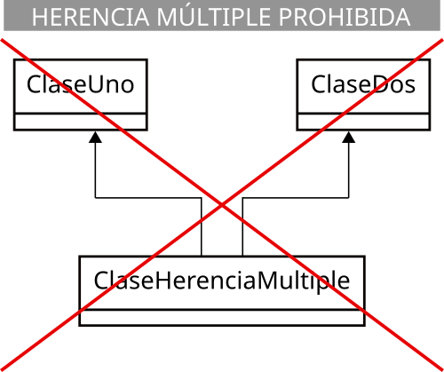

[⬅️ Tornar a l'índex de Programació](../) | [🏠 Portal Principal](../../) | [📘 UT5 Completa](../ut5-herencia-polimorfisme.md) | [🎨 **Obrir versió interactiva Material (amb índex lateral i mode fosc)**](../guia-completa/ut05/ut0503.html)

[⬅️ Anterior: 5.2 Composición de clases](../ut05/ut0502.md) | [➡️ Següent: 5.4 Clases y métodos abstractos (abstract)](../ut05/ut0504.md)

---

# 5.3 Herencia

Como ya has estudiado, la herencia es el mecanismo que permite definir una nueva clase a partir de otra, pudiendo añadir nuevas características, sin tener que volver a escribir todo el código de la clase base.

La clase de la que se hereda suele ser llamada *clase base*, *clase madre* o *superclase* (de la que hereda otra clase, y se heredarán todas aquellas características que la clase madre permita). A la clase que hereda se le suele llamar *clase hija*, clase derivada o *subclase* (que hereda de otra clase, y se heredan todas aquellas características que la clase madre permita).

Una clase derivada puede ser a su vez clase madre de otra que herede de ella y así sucesivamente dando lugar a una jerarquía de clases, excepto aquellas que estén en la parte de arriba de la jerarquía (sólo serán clases madre) o en la parte de abajo (sólo serán clases hijas).

Una clase hija no tiene acceso a los miembros privados de su clase madre, tan solo a los públicos (como cualquier parte del código tendría) y a los protegidos (a los que sólo tienen acceso las clases derivadas y las del mismo paquete). Aquellos miembros que sean privados en la clase base también habrán sido heredados, pero el acceso a ellos estará restringido al propio funcionamiento de la superclase y sólo se podrá acceder a ellos si la superclase ha dejado algún medio indirecto para hacerlo (por ejemplo a través de algún método).

Todos los miembros de la superclase, tanto atributos como métodos, son heredados por la subclase. Algunos de estos miembros heredados podrán ser redefinidos o sobrescritos (overriden) y también podrán añadirse nuevos miembros. De alguna manera podría decirse que estás "ampliando" la clase base con características adicionales o modificando algunas de ellas (proceso de especialización).


> 📝 **A tener en cuenta**
>
> Una clase derivada **extiende** la funcionalidad de la clase base sin tener que volver a escribir el código de la clase base.


## 1. Sintaxis de la herencia

En Java la herencia se indica mediante la palabra reservada `extends`:

```java
[modificador] class ClaseMadre {
  // Cuerpo de la clase
  ...
}

[modificador] class ClaseHija extends ClaseMadre {
  // Cuerpo de la clase
  ...
}
```

Imagina que tienes una clase `Persona` que contiene atributos como `nombre`, `apellidos` y `fecha de nacimiento`:

=== "Clase Persona"
    ```java
    public class Persona {
        String nombre;
        String apellidos;
        LocalDate fechaNacim;
        // ...
    }
    ```

=== "Ejemplo de herencia en Persona 😄"
    Tu navegador no soporta la reproducción de videos.

Es posible que, más adelante, necesites una clase `Alumno` que compartirá esos atributos (dado que todo alumno es una persona, pero con algunas características específicas que lo especializan). En tal caso tendrías la posibilidad de crear una clase `Alumno` que repitiera todos esos atributos o bien heredar de la clase `Persona`:

```java
public class Alumno extends Persona {
  String grupo;
  double notaMedia;
  ...
}
```

A partir de ahora, un objeto de la clase `Alumno` contendrá los atributos `grupo` y `notaMedia` (propios de la clase `Alumno`), pero también `nombre`, `apellidos` y `fechaNacim` (propios de su clase base `Persona` y que por tanto ha heredado).


<details markdown="1">
<summary><strong>☕ Ejemplo 3.01: Revisa con cuidado el siguiente ejemplo</strong></summary>

Imagina que también necesitas una clase `Profesor`, que contará con atributos como *nombre*, *apellidos*, *fecha de nacimiento*, *especialidad* y *salario*. ¿*Cómo crearías esa nueva clase y qué atributos le añadirías*?

**Solución**  

Está claro que un `Profesor` es otra especialización de `Persona`, al igual que lo era `Alumno`, así que podrías crear otra clase derivada de `Persona` y así aprovechar los atributos genéricos (*nombre*, *apellidos*, *fecha de nacimiento*) que posee todo objeto de tipo `Persona`. Tan solo faltaría añadirle sus atributos específicos (*especialidad* y *salario*):

```java
public class Profesor extends Persona {
    String especialidad;
    double salario;
    ...
}
```

</details>


## 2. Acceso a miembros heredados

Como ya has visto anteriormente, *no es posible acceder a miembros privados de una superclase*. Para poder acceder a ellos podrías pensar en hacerlos públicos, pero entonces estarías dando la opción de acceder a ellos a cualquier objeto externo y es probable que tampoco sea eso lo deseable. Para ello se inventó el modificador `protected` (*protegido*) que permite el acceso desde clases heredadas, pero no desde fuera de las clases (estrictamente hablando, desde fuera del paquete), que serían como miembros privados.

En la unidad dedicada a la utilización de clases ya estudiaste los posibles modificadores de acceso que podía tener un miembro: sin modificador (acceso de paquete), público, privado o protegido.

Aquí tienes de nuevo el resumen:

| modificador | Misma clase | Mismo paquete | Subclase | Otro paquete |
| --- | --- | --- | --- | --- |
| `public` | ✔ | ✔ | ✔ | ✔ |
| `protected` | ✔ | ✔ | ✔ | ❌ |
| Sin modificador (`package`) | ✔ | ✔ | ❌ | ❌ |
| `private` | ✔ | ❌ | ❌ | ❌ |


> ⚠️ **Los modificadores de acceso son excluyentes**
>
> Sólo se puede utilizar uno de ellos en la declaración de un atributo.


Si en el ejemplo anterior de la clase `Persona` se hubieran definido sus atributos como `private`:

```java
public class Persona {
  private String nombre;
  private String apellidos;
  ...
}
```

Al definir la clase `Alumno` como heredera de `Persona`, no habrías tenido acceso a esos atributos, pudiendo ocasionar un grave problema de operatividad al intentar manipular esa información. Por tanto, en estos casos lo más recomendable habría sido **declarar esos atributos como `protected` o bien sin modificador** (para que también tengan acceso a ellos otras clases del mismo paquete, si es que se considera oportuno):

```java
public class Persona {
  protected String nombre;
  protected String apellidos;
  ...
}
```


> ⚠️ **Privacidad de atributos**
>
> Sólo en aquellos casos en los que se desea explícitamente que un miembro de una clase no pueda ser accesible desde una clase derivada debería utilizarse el modificador `private`. En el resto de casos es recomendable utilizar `protected`, o bien no indicar modificador (acceso a nivel de paquete).


<details markdown="1">
<summary><strong>☕ Ejemplo 3.02: Revisa con cuidado el siguiente ejemplo</strong></summary>

Reescribe las clases `Alumno` y `Profesor` utilizando el modificador protected para sus atributos del mismo modo que se ha hecho para su superclase `Persona`.

**Solución**  

1) Clase `Alumno`. Se trata simplemente de añadir el modificador de acceso protected a los nuevos atributos que añade la clase:

```java
public class Alumno extends Persona {
    protected String grupo;
    protected double notaMedia;
    ...
}
```

2) Clase `Profesor` (exactamente igual que en la clase `Alumno`):

```java
public class Profesor extends Persona {
    protected String especialidad;
    protected double salario;
    ...
}
```

</details>


## 3. Utilización de miembros heredados

### 3.1. Atributos

Los atributos heredados por una clase son, a efectos prácticos, iguales que aquellos que sean definidos específicamente en la nueva clase derivada.

En el ejemplo anterior la clase `Persona` disponía de tres atributos y la clase `Alumno`, que heredaba de ella, añadía dos atributos más. Desde un punto de vista funcional podrías considerar que la clase `Alumno` tiene cinco atributos: tres por ser `Persona` (*nombre*, *apellidos*, *fecha de nacimiento*) y otros dos más por ser `Alumno` (*grupo* y *nota media*).


<details markdown="1">
<summary><strong>☕ Ejemplo 3.03: Revisa con cuidado el siguiente ejemplo</strong></summary>

Dadas las clases `Alumno` y `Profesor` que has utilizado anteriormente, implementa métodos *get* y *set* en las clases `Alumno` y `Profesor` para trabajar con sus cinco atributos (tres heredados más dos específicos).

**Solución**

1) Clase `Alumno`.  
Se trata de heredar de la clase `Persona` y por tanto utilizar con normalidad sus atributos heredados como si pertenecieran a la propia clase (de hecho se puede considerar que le pertenecen, dado que los ha heredado).

```java
import java.time.LocalDate;

public class Alumno extends Persona {

    protected String grupo;
    protected double notaMedia;

    // Método getXXXXX
    public String getNombre() {
        return nombre;
    }

    public String getApellidos() {
        return apellidos;
    }

    public LocalDate getFechaNacimiento() {
        return this.fechaNacimiento;
    }

    public String getGrupo() {
        return grupo;
    }

    public double getNotaMedia() {
        return notaMedia;
    }

    // Métodos setXXXXX
    public void setNombre(String nombre) {
        this.nombre = nombre;
    }

    public void setApellidos(String apellidos) {
        this.apellidos = apellidos;
    }

    public void setFechaNacimiento(LocalDate fechaNacimiento) {
        this.fechaNacimiento = fechaNacimiento;
    }

    public void setGrupo(String grupo) {
        this.grupo = grupo;
    }

    public void setNotaMedia(double notaMedia) {
        this.notaMedia = notaMedia;
    }
}
```

Si te fijas, puedes utilizar sin problema la referencia `this` a la propia clase con esos atributos heredados, pues pertenecen a la clase: `this.nombre`, `this.apellidos`, etc.

2) Clase `Profesor`.  
Seguimos exactamente el mismo procedimiento que con la clase `Alumno`.

```java
import java.time.LocalDate;

public class Profesor extends Persona {
    String especialidad;
    double salario;

    // Métodos getXXXXX
    public String getNombre() {
        return nombre;
    }

    public String getApellidos() {
        return apellidos;
    }

    public LocalDate getFechaNacimiento() {
        return this.fechaNacimiento;
    }

    public String getEspecialidad() {
        return especialidad;
    }

    public double getSalario() {
        return salario;
    }

    // Métodos setXXXXX
    public void setNombre(String nombre) {
        this.nombre = nombre;
    }

    public void setApellidos(String apellidos) {
        this.apellidos = apellidos;
    }

    public void setFechaNacimiento(LocalDate fechaNacimiento) {
        this.fechaNacimiento = fechaNacimiento;
    }

    public void setSalario(double salario) {
        this.salario = salario;
    }

    public void setESpecialidad(String especialidad) {
        this.especialidad = especialidad;
    }
}
```

Una conclusión que puedes extraer de este código es que has tenido que escribir los métodos `get` y `set` para los tres atributos heredados, pero ¿no habría sido posible definir esos seis métodos en la clase base y así estas dos clases derivadas hubieran también heredado esos métodos? La respuesta es afirmativa y de hecho es como lo vas a hacer a partir de ahora. De esa manera te habrías evitado tener que escribir seis métodos en la clase `Alumno` y otros seis en la clase `Profesor`.

> Así que, **recuerda!**   
> 
> **Se pueden heredar tanto los atributos como los métodos**.

Aquí tienes un ejemplo de cómo podrías haber definido la clase `Persona` para que luego se hubieran podido heredar de ella sus métodos (y no sólo sus atributos):

**Solución implementada correctamente (I)**

```java
import java.time.LocalDate;

public class Persona {
    protected String nombre;
    protected String apellidos;
    protected LocalDate fechaNacimiento;

    // Métodos getXXXXX
    public String getNombre() {
        return nombre;
    }

    public String getApellidos() {
        return apellidos;
}

    public LocalDate getFechaNacimiento() {
        return this.fechaNacimiento;
    }

    // Métodos setXXXXX
    public void setNombre(String nombre) {
        this.nombre = nombre;
    }

    public void setApellidos(String apellidos) {
        this.apellidos = apellidos;
        }

    public void setFechaNacimiento(LocalDate fechaNacimiento) {
        this.fechaNacimiento = fechaNacimiento;
    }
}
```

</details>


### 3.2. Métodos

Así que, visto el ejemplo del punto anterior, del mismo modo que se heredan los atributos, **también se heredan los métodos**, convirtiéndose a partir de ese momento en otros métodos más de la clase derivada, junto a los que hayan sido definidos específicamente.

En el ejemplo de la clase `Persona`, si dispusiéramos de métodos *get* y *set* para cada uno de sus tres atributos (*nombre*, *apellidos*, *fechaNacim*), tendrías seis métodos que podrían ser heredados por sus clases derivadas. Podrías decir entonces que la clase `Alumno`, derivada de `Persona`, tiene diez métodos:

- Seis por ser Persona (`getNombre`, `getApellidos`, `getFechaNacim`, `setNombre`, `setApellidos`, `setFechaNacim`).
- Oros cuatro más por ser Alumno (`getGrupo`, `setGrupo`, `getNotaMedia`, `setNotaMedia`).

Sin embargo, solo tendrías que definir esos cuatro últimos (los específicos) pues los genéricos ya los has heredado de la superclase.


<details markdown="1">
<summary><strong>☕ Ejemplo 3.04: Revisa con cuidado el siguiente ejemplo</strong></summary>

```java
public class Profesor extends Persona {
    String especialidad;
    double salario;

    // Métodos getXXXXX
    public String getEspecialidad() {
      return especialidad;
    }

    public double getSalario() {
      return salario;
    }

    // Métodos setXXXXX
    public void setSalario(double salario) {
      this.salario = salario;
    }

    public void setESpecialidad(String especialidad) {
      this.especialidad = especialidad;
    }
}    
```

</details>


## 4. Redefinición de métodos heredados

Una clase puede redefinir algunos de los métodos que ha heredado de su clase base. El nuevo método (especializado) sustituye al heredado. Esto se conoce como sobrescritura de métodos.

En cualquier caso, aunque un método sea sobrescrito o redefinido, aún es posible acceder a él a través de la referencia **`super`**, aunque sólo se podrá acceder a métodos de la clase madre y no a métodos de clases superiores en la jerarquía de herencia.


> ⚠️ **Accesibilidad de los métodos redefinidos**
>
> Los métodos redefinidos pueden ampliar su accesibilidad con respecto a la que ofrezca el método original de la superclase, pero nunca restringirla. Por ejemplo, si un método es declarado como protected o de paquete en la clase base, podría ser redefinido como public en una clase derivada.


> ⚠️ **Métodos estáticos**
>
> Los métodos estáticos o de clase no pueden ser sobrescritos. Los originales de la clase base permanecen inalterables a través de toda la jerarquía de herencia.


<details markdown="1">
<summary><strong>☕ Ejemplo 3.05: método obtener atributo apellidos de Alumno</strong></summary>

En el ejemplo de la clase `Alumno`, podrían redefinirse algunos de los métodos heredados. Por ejemplo, imagina que el método *getApellidos* devuelva la cadena "*Alumno:*" junto con los apellidos del alumno. En tal caso habría que reescribir ese método para realizara esa modificación:

```java
public String getApellidos () {
    return "Alumno: " + apellidos;
}
```

</details>


Cuando sobrescribas un método heredado en Java puedes (**no es necesario)** incluir la anotación **`@Override`**. Esto indicará al compilador que tu intención es sobrescribir el método de la clase madre. De este modo, si te equivocas (por ejemplo, al escribir el nombre del método) y no lo estás realmente sobrescribiendo, el compilador producirá un error y así podrás darte cuenta del fallo. En el caso del ejemplo anterior quedaría:


<details markdown="1">
<summary><strong>☕ Ejemplo 3.06: método obtener atributo apellidos de Alumno sobreescrito</strong></summary>

```java
@Override
public String getApellidos () {
    return "Alumno: " + apellidos;
}
```

</details>


<details markdown="1">
<summary><strong>☕ Ejemplo 3.07: Revisa con cuidado el siguiente ejemplo</strong></summary>

Dadas las clases `Persona`, `Alumno` y `Profesor` que has utilizado anteriormente, redefine el método `getNombre` para que devuelva la cadena "*Alumno:*", junto con el nombre del alumno, si se trata de un objeto de la clase `Alumno` o bien "*Profesor:*", junto con el nombre del profesor, si se trata de un objeto de la clase `Profesor`.

**Solución**  

1) Clase `Alumno`.  
Al heredar de la clase `Persona` tan solo es necesario escribir métodos para los nuevos atributos (métodos especializados de acceso a los atributos especializados), pues los métodos genéricos (de acceso a los atributos genéricos) ya forman parte de la clase al haberlos heredado. Esos son los métodos que se implementaron en el ejercicio anterior (`getGrupo`, `setGrupo`, etc.).

Ahora bien, hay que escribir otro método más, pues tienes que redefinir el método `getNombre` para que tenga un comportamiento un poco diferente al `getNombre` que se hereda de la clase base `Persona`:

```java
// Método getNombre
@Override
public String getNombre (){
    return "Alumno: " + this.nombre;
}
```

En este caso podría decirse que se "renuncia" al método heredado para redefinirlo con un comportamiento más especializado y acorde con la clase derivada.

2) Clase `Profesor`.  
Seguimos exactamente el mismo procedimiento que con la clase Alumno (redefinición del método `getNombre`).

```java
// Método getNombre
@Override
public String getNombre() {
    return "Profesor: " + this.nombre;
}
```

</details>


## 5. Ampliación de métodos heredados

Hasta ahora, has visto que para redefinir o sustituir un método de una superclase es suficiente con crear otro método en la subclase que tenga el mismo nombre que el método que se desea sobrescribir. Pero, en otras ocasiones, puede que lo que necesites no sea sustituir completamente el comportamiento del método de la superclase, sino simplemente ampliarlo.

Para poder hacer esto necesitas poder preservar el comportamiento antiguo (el de la superclase) y añadir el nuevo (el de la subclase). Para ello, puedes invocar desde el método "ampliador" de la clase derivada al método "ampliado" de la clase superior (teniendo ambos métodos el mismo nombre). ¿*Cómo se puede conseguir eso*? Puedes hacerlo mediante el uso de la referencia **`super`**.

La palabra reservada `super` es una referencia a la clase madre de la clase en la que te encuentres en cada momento (es algo similar a `this`, que representaba una referencia a la clase actual). De esta manera, podrías invocar a cualquier método de tu superclase (si es que se tiene acceso a él).


<details markdown="1">
<summary><strong>☕ Ejemplo 3.08: método mostrarDatos de Alumno</strong></summary>

Imagina que la clase `Persona` dispone de un método que permite mostrar el contenido de algunos datos personales de los objetos de este tipo (*nombre*, *apellidos*, etc.).

Por otro lado, la clase `Alumno` también necesita un método similar, pero que muestre también su información especializada (*grupo*, *nota media*, etc.). ¿Cómo podrías aprovechar el método de la superclase para no tener que volver a escribir su contenido en la subclase?

**Solución**  

Podría hacerse de una manera tan sencilla como la siguiente:

```java
public void mostrarDatos () {
  super.mostrarDatos();  // Llamada al método "mostrar" de la superclase
  // A continuación mostramos la información "especializada" de esta subclase
  System.out.prinln ("Grupo:" + this.grupo);
  System.out.prinln ("Nota media: " + this.notaMedia);
}
```

</details>


Este tipo de ampliaciones de métodos resultan especialmente útiles por ejemplo en el caso de los constructores, donde se podría ir llamando a los constructores de cada superclase encadenadamente hasta el constructor de la clase en la cúspide de la jerarquía (el constructor de la clase `Object`).


<details markdown="1">
<summary><strong>☕ Ejemplo 3.09: Revisa con cuidado el siguiente ejemplo</strong></summary>

Dadas las clases `Persona`, `Alumno` y `Profesor`, define un método `mostrarDatos()` para la clase `Persona`, que muestre el contenido de los atributos (datos personales) de un objeto de la clase `Persona`. A continuación, define sendos métodos `mostrarDatos()` especializados para las clases `Alumno` y `Profesor` que "amplíen" la funcionalidad del método mostrar original de la clase `Persona`.

**Solución**  

1) Método `mostrarDatos()` de la clase `Persona`.

```java
public void mostrarDatos() {
    DateTimeFormatter formatoFecha = DateTimeFormatter.ofPattern("dd/MM/yyyy");
    String stringFecha = formatoFecha.format(this.fechaNacimiento);

    System.out.println ("Nombre:" + this.nombre);
    System.out.println ("Apellidos:" + this.apellidos);
    System.out.printfln ("Fecha nacimiento:" + stringFecha);
}
```

2) Método `mostrarDatos()` de la clase `Alumno`. Llamamos al método mostrar de su clase madre (`Persona`) y luego añadimos la funcionalidad específica para la subclase `Alumno`:

```java
public void mostrarDatos() {
    super.mostrarDatos();  // Llamada al método "mostrarDatos" de la superclase
    // A continuación mostramos la información "especializada" de esta subclase
    System.out.println ("Grupo:" + this.grupo);
    System.out.println ("Nota media:" + this.notaMedia);
}
```

3) Método `mostrarDatos()` de la clase `Profesor`. Llamamos al método mostrar de su clase madre (`Persona`) y luego añadimos la funcionalidad específica para la subclase `Profesor`:

```java
public void mostrarDatos() {
    super.mostrarDatos();

    System.out.println ("Especialidad:" + this.especialidad);
    System.out.println ("Salario:" + this.salario);
}
```

</details>


## 6. Constructores y herencia

Recuerda que cuando estudiaste los constructores viste que un constructor de una clase puede llamar a otro constructor de la misma clase, previamente definido, a través de la referencia `this`. En estos casos, la utilización de `this` sólo podía hacerse en la primera línea de código del constructor.

Como ya has visto, un constructor de una clase derivada puede hacer algo parecido para llamar al constructor de su clase base mediante el uso de la palabra `super`. De esta manera, el constructor de una clase derivada puede llamar primero al constructor de su superclase para que inicialice los atributos heredados y posteriormente se inicializarán los atributos específicos de la clase: los no heredados.


> 📝 **A tener en cuenta al utilizar super en un constructor**
>
> Nuevamente, **esta llamada también debe ser la primera sentencia de un constructor** (con la única excepción de que exista una llamada a otro constructor de la clase mediante `this`).


Si no se incluye una llamada a `super()` dentro del constructor, el compilador incluye automáticamente una llamada al constructor por defecto de clase base (llamada a `super()`). Esto da lugar a una llamada en cadena de constructores de superclase hasta llegar a la clase más alta de la jerarquía (que en Java es la clase `Object`).

En el caso del constructor por defecto (el que crea el compilador si el programador no ha escrito ninguno), el compilador añade lo primero de todo, antes de la inicialización de los atributos a sus valores por defecto, una llamada al constructor de la clase base mediante la referencia `super`.

A la hora de destruir un objeto (método `finalize`) es importante llamar a los finalizadores en el orden inverso a como fueron llamados los constructores (primero se liberan los recursos de la clase derivada y después los de la clase base mediante la llamada `super.finalize()`).


<details markdown="1">
<summary><strong>☕ Ejemplo 3.10: Constructor de Alumno que hereda parte del constructor de Persona</strong></summary>

Si la clase `Persona` tuviera un constructor de este tipo:

```java
public Persona (String nombre, String apellidos, LocalDate fechaNacim) {
    this.nombe = nombre;
    this.apellidos = apellidos;
    this.fechaNacim = new LocalDate (fechaNacim);
}
```

Podrías llamarlo desde un constructor de una clase derivada (por ejemplo `Alumno`) de la siguiente forma:

```java
public Alumno (String nombre, String apellidos, LocalDate fechaNacim, String grupo, double notaMedia) {
    super (nombre, apellidos, fechaNacim);
    this.grupo = grupo;
    this.notaMedia = notaMedia;
}
```

</details>


En realidad se trata de otro recurso más para optimizar la reutilización de código, en este caso el del constructor, que aunque no es heredado, sí puedes invocarlo para no tener que reescribirlo.

## 7. La clase `Object` en Java

Todas las clases en Java son descendentes (directos o indirectos) de la clase Object. Esta clase define los estados y comportamientos básicos que deben tener todos los objetos. Entre estos comportamientos, se encuentran:

- La posibilidad de compararse.
- La capacidad de convertirse a cadenas.
- La habilidad de devolver la clase del objeto.

Entre los métodos que incorpora la clase `Object` y que por tanto hereda cualquier clase en Java tienes:

Principales métodos de la clase `Object`:

| Método | Descripción |
| --- | --- |
| `Object()` | Constructor. |
| `clone()` | Método clonador: crea y devuelve una copia del objeto ("clona" el objeto). |
| `boolean equals(Object obj)` | Indica si el objeto pasado como parámetro es igual a este objeto. |
| `void finalize()` | Método llamado por el recolector de basura cuando éste considera que no queda ninguna referencia a este objeto en el entorno de ejecución. |
| `int hashCode()` | Devuelve un código hash para el objeto. |
| `toString()` | Devuelve una representación del objeto en forma de String. |

La clase `Object` representa la superclase que se encuentra en la cúspide de la jerarquía de herencia en Java. Cualquier clase (incluso las que tú implementes) acaban heredando de ella.

## 8. Herencia múltiple

En determinados casos podrías considerar la posibilidad de que se necesite heredar de más de una clase, para así disponer de los miembros de dos (o más) clases disjuntas (que no derivan una de la otra). La herencia múltiple permite hacer eso: recoger las distintas características (atributos y métodos) de clases diferentes formando una nueva clase derivada de varias clases base.

El problema en estos casos es la posibilidad que existe de que se produzcan ambigüedades; así, si tuviéramos miembros con el mismo identificador en clases base diferentes, en tal caso, ¿qué miembro se hereda? Para evitar esto, los compiladores suelen solicitar que ante casos de ambigüedad, se especifique de manera explícita la clase de la cual se quiere utilizar un determinado miembro que pueda ser ambiguo.

Ahora bien, la posibilidad de herencia múltiple no está disponible en todos los lenguajes orientados a objetos.


> 🚨 **...¿lo estará en Java?**
>
> ... no existe la herencia múltiple de clases.
>
> 


---

[⬅️ Anterior: 5.2 Composición de clases](../ut05/ut0502.md) | [➡️ Següent: 5.4 Clases y métodos abstractos (abstract)](../ut05/ut0504.md) | [📑 Índex de Programació](../) | [🎨 Versió Web Material](../guia-completa/ut05/ut0503.html)
