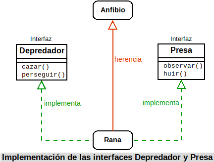
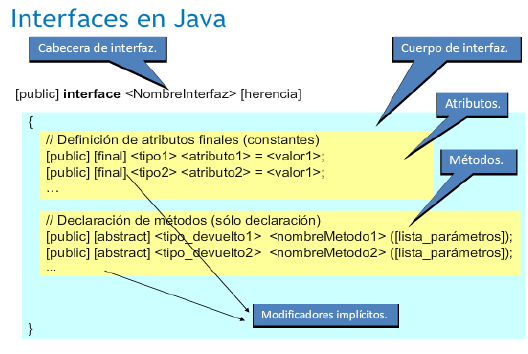
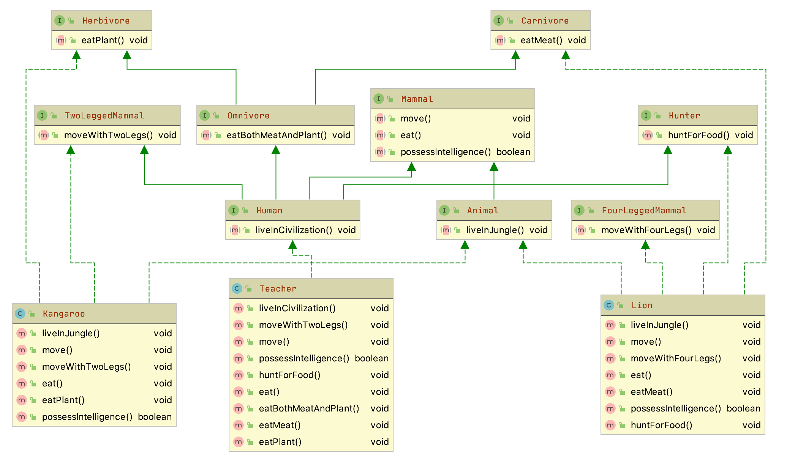

# 5.5 Interfaces

Has visto cómo la herencia permite definir especializaciones (o extensiones) de una clase base que ya existe sin tener que volver a repetir todo el código de ésta. Este mecanismo da la oportunidad de que la nueva clase especializada (o extendida) disponga de toda la interfaz que tiene su clase base.

También has estudiado cómo los métodos abstractos permiten establecer una interfaz para marcar las líneas generales de un comportamiento común de superclase que deberían compartir de todas las subclases.

Si llevamos al límite esta idea de interfaz, podrías llegar a tener una clase abstracta donde todos sus métodos fueran abstractos. De este modo estarías dando únicamente el marco de comportamiento, sin ningún método implementado, de las posibles subclases que heredarán de esa clase abstracta. La idea de una *interfaz* (o *interface*) es precisamente ésa: disponer de un mecanismo que permita especificar cuál debe ser el comportamiento que deben tener todos los objetos que formen parte de una determinada clasificación (no necesariamente jerárquica).

Una **interfaz** consiste principalmente en una **lista de declaraciones de métodos sin implementar, que caracterizan un determinado comportamiento**. Si se desea que una clase tenga ese comportamiento, tendrá que implementar esos métodos establecidos en la interfaz. En este caso no se trata de una relación de herencia (la clase B es una especialización de la clase A, o la subclase B es del tipo de la superclase A), sino más bien una relación "*de implementación de comportamientos*" (la clase B implementa los métodos establecidos en la interfaz A, o los comportamientos indicados por A son llevados a cabo por B; pero no que B sea de clase A).

Imagina que estás diseñando una aplicación que trabaja con clases que representan distintos tipos de animales. Algunas de las acciones que quieres que lleven a cabo están relacionadas con el hecho de que algunos animales sean depredadores (por ejemplo: *observar una presa*, *perseguirla*, *comérsela*, etc.) o sean presas (*observar*, *huir*, *esconderse*, etc.). Si creas la clase `León`, esta clase podría implementar una interfaz `Depredador`, mientras que otras clases como `Gacela` implementarían las acciones de la interfaz `Presa`. Por otro lado, podrías tener también el caso de la clase `Rana`, que implementaría las acciones de la interfaz `Depredador` (pues es cazador de pequeños insectos), pero también la de `Presa` (pues puede ser cazado y necesita las acciones necesarias para protegerse).



## 1. Concepto de interfaz

**Una interfaz en Java consiste esencialmente en una lista de declaraciones de métodos sin implementar, junto con un conjunto de constantes**.

Estos métodos sin implementar indican un comportamiento, un tipo de conducta, aunque no especifican cómo será ese comportamiento (implementación), pues eso dependerá de las características específicas de cada clase que decida implementar esa interfaz. Podría decirse que una interfaz se encarga de establecer qué comportamientos hay que tener (qué métodos), pero no dice nada de cómo deben llevarse a cabo esos comportamientos (implementación). Se indica sólo la forma, no la implementación.

En cierto modo podrías imaginar el concepto de interfaz como un guión que dice: "*este es el protocolo de comunicación que deben presentar todas las clases que implementen esta interfaz*". Se proporciona una lista de métodos públicos y, si quieres dotar a tu clase de esa interfaz, tendrás que definir todos y cada uno de esos métodos públicos.

> **📌 En conclusión**
> Una interfaz **se encarga de establecer unas líneas generales sobre los comportamientos (métodos)** que deberían tener los objetos de toda clase que implemente esa interfaz; es decir, que no indican lo que el objeto es (de eso se encarga la clase y sus superclases), sino acciones (capacidades) que el objeto debería ser capaz de realizar.
>
> Es por esto que el nombre de muchas interfaces en Java termina con sufijos del tipo "*‐able*", "*‐or*", "*‐ente*" y cosas del estilo, que significan algo así como capacidad o habilidad para hacer o ser receptores de algo (*configurable*, *serializable*, *modificable*, *clonable*, *ejecutable*, *administrador*, *servidor*, *buscador*, etc.), dando así la idea de que se tiene la capacidad de llevar a cabo el conjunto de acciones especificadas en la interfaz.

Imagínate por ejemplo la clase `Coche`, subclase de `Vehículo`. Los coches son vehículos a motor, lo cual implica una serie de acciones como, por ejemplo, arrancar el motor o detener el motor. Esa acción no la puedes heredar de `Vehículo`, pues no todos los vehículos tienen porqué ser a motor (piensa por ejemplo en una clase `Bicicleta`), y no puedes heredar de otra clase pues ya heredas de `Vehículo`. Una solución podría ser crear una interfaz `Arrancable`, que proporcione los métodos típicos de un objeto a motor (no necesariamente vehículos). De este modo la clase `Coche` sigue siendo subclase de `Vehículo`, pero también implementaría los comportamientos de la interfaz `Arrancable`, los cuales podrían ser también implementados por otras clases, hereden o no de `Vehículo` (por ejemplo una clase `Motocicleta` o bien una clase `Motosierra`). La clase `Coche` implementará su método arrancar de una manera, la clase `Motocicleta` lo hará de otra (aunque bastante parecida) y la clase `Motosierra` de otra forma probablemente muy diferente, pero todos tendrán su propia versión del método arrancar como parte de la interfaz `Arrancable`.

Según esta concepción, podrías hacerte la siguiente pregunta: ¿*podrá una clase implementar varias interfaces*? La respuesta en este caso sí es afirmativa.

> **📌 A tener en cuenta**
> Una clase puede adoptar distintos modelos de comportamiento establecidos en diferentes interfaces. Es decir **una clase puede implementar varias interfaces**.

### 1.1. ¿Clase abstracta o interfaz?

Observando el concepto de interfaz que se acaba de proponer, podría caerse en la tentación de pensar que es prácticamente lo mismo que una clase abstracta en la que todos sus métodos sean abstractos.

Es cierto que en ese sentido existe un gran parecido formal entre una clase abstracta y una interfaz, pudiéndose en ocasiones utilizar indistintamente una u otra para obtener un mismo fin. Pero, a pesar de ese gran parecido, existen algunas **diferencias**, no sólo formales, sino también conceptuales, muy importantes:

- Una clase no puede heredar de varias clases, aunque sean abstractas (herencia múltiple). Sin embargo sí puede implementar una o varias interfaces y además seguir heredando de una clase.
- Una interfaz no puede definir métodos (no implementa su contenido), tan solo los declara o enumera.
- Una interfaz puede hacer que dos clases tengan un mismo comportamiento independientemente de sus ubicaciones en una determinada jerarquía de clases (no tienen que heredar las dos de una misma superclase, pues no siempre es posible según la naturaleza y propiedades de cada clase).
- Una interfaz permite establecer un comportamiento de clase sin apenas dar detalles, pues esos detalles aún no son conocidos (dependerán del modo en que cada clase decida implementar la interfaz).
- Las interfaces tienen su propia jerarquía, diferente e independiente de la jerarquía de clases.

De todo esto puede deducirse que una clase abstracta proporciona una interfaz disponible sólo a través de la herencia. Sólo quien herede de esa clase abstracta dispondrá de esa interfaz. Si una clase no pertenece a esa misma jerarquía (no hereda de ella) no podrá tener esa interfaz. Eso significa que para poder disponer de la interfaz podrías:

1. Volver a escribirla para esa jerarquía de clases. Lo cual no parece una buena solución.
2. Hacer que la clase herede de la superclase que proporciona la interfaz que te interesa, sacándola de su jerarquía original y convirtiéndola en clase derivada de algo de lo que conceptualmente no debería ser una subclase. Es decir, estarías forzando una relación "es un" cuando en realidad lo más probable es que esa relación no exista. Tampoco parece la mejor forma de resolver el problema.

Sin embargo, una interfaz sí puede ser implementada por cualquier clase, permitiendo que clases que no tengan ninguna relación entre sí (pertenecen a distintas jerarquías) puedan compartir un determinado comportamiento (una interfaz) sin tener que forzar una relación de herencia que no existe entre ellas.

A partir de ahora podemos hablar de otra posible relación entre clases: la de compartir un determinado comportamiento (interfaz). Dos clases podrían tener en común un determinado conjunto de comportamientos sin que necesariamente exista una relación jerárquica entre ellas. Tan solo cuando haya realmente una relación de tipo "es un" se producirá herencia.

> **📌 A tener en cuenta**
> Si sólo vas a proporcionar una lista de métodos abstractos (interfaz), sin definiciones de métodos ni atributos de objeto, suele ser recomendable definir una interfaz antes que clase abstracta. Es más, cuando vayas a definir una supuesta clase base, puedes comenzar declarándola como interfaz y sólo cuando veas que necesitas definir métodos o variables miembro, puedes entonces convertirla en clase abstracta (no instanciable) o incluso en una clase instanciable.

## 2. Definición de interfaces

La declaración de una interfaz en Java es similar a la declaración de una clase, aunque con algunas variaciones:

- Se utiliza la palabra reservada `interface` en lugar de `class` .
- Puede utilizarse el modificador `public` . Si incluye este modificador la interfaz debe tener el mismo nombre que el archivo `.java` en el que se encuentra (exactamente igual que sucedía con las clases). Si no se indica el modificador `public` , el acceso será por omisión o "de paquete" (como sucedía con las clases).
- Todos los miembros de la interfaz (atributos y métodos) son `public` de manera implícita. No es necesario indicar el modificador `public` , aunque puede hacerse.
- Todos los atributos son de tipo `final` y `public` (tampoco es necesario especificarlo), es decir, constantes y públicos. Hay que darles un valor inicial.
- Todos los métodos son abstractos también de manera implícita (tampoco hay que indicarlo). No tienen cuerpo, tan solo la cabecera.


Como puedes observar, una interfaz consiste esencialmente en una lista de atributos finales (constantes) y métodos abstractos (sin implementar). Su sintaxis quedaría entonces:

```java
[public] interface <NombreInterfaz> {
  [public] [final] <tipo1> <atributo1> = <valor1>;
  [public] [final] <tipo2> <atributo2> = <valor2>;
  ...
  [public] [abstract] <tipo_devuelto1> <nombreMetodo1> ([lista_parámetros]);
  [public] [abstract] <tipo_devuelto2> <nombreMetodo2> ([lista_parámetros]);
  ...
}
```

Si te fijas, la declaración de los métodos termina en punto y coma, pues no tienen cuerpo, al igual que sucede con los métodos abstractos de las clases abstractas. El ejemplo de la interfaz `Depredador` que hemos visto antes podría quedar entonces así:

```java
public interface Depredador {
  void perseguir (Animal presa);
  void cazar (Animal presa);
  ...
}
```

Serán las clases que implementen esta interfaz (`León`, `Leopardo`, `Cocodrilo`, `Rana`, `Lagarto`, `Hombre`, etc.) las que definan cada uno de los métodos por dentro.

> **📌 Ejemplo 5.01: Revisa con cuidado el siguiente ejemplo**
> Crea una interfaz en Java cuyo nombre sea `Imprimible` y que contenga algunos métodos útiles para mostrar el contenido de una clase:
>
> **Solución**
>
> 1) Método `devolverContenidoString`, que crea un `String` con una representación de todo el contenido público (o que se decida que deba ser mostrado) del objeto y lo devuelve. El formato será una lista de pares "*nombre=valor*" de cada atributo separado por comas y la lista completa encerrada entre llaves: "`{<nombre_atributo_1>=<valor_atributo_1>, ..., <nombre_atributo_n>=<valor_atributo_n>}`".
>
> 2) Método `devolverContenidoArrayList`, que crea un `ArrayList` de `String` con una representación de todo el contenido público (o que se decida que deba ser mostrado) del objeto y lo devuelve.
>
> 3) Método `devolverContenidoHashMap`, similar al anterior, pero en lugar devolver en un `ArrayList` los valores de los atributos, se devuelve en una `HashMap` en forma de pares (`nombre`, `valor`).
> Se trata simplemente de declarar la interfaz e incluir en su interior esos tres métodos:
>
> Código Java
>
> 📋 Copiar
> JAVA
>
> `import java.util.ArrayList;
> import java.util.HashMap;
>
> public interface Imprimible {
>  String devolverContenidoString();
>  ArrayList devolverContenidoArrayList();
>  HashMap devolverContenidoHashMap();
> }`
>
> El cómo se implementarán cada uno de esos métodos dependerá exclusivamente de cada clase que decida implementar esta interfaz.

## 3. Implementación de interfaces

Como ya has visto, todas las clases que implementan una determinada interfaz están obligadas a proporcionar una definición (implementación) de los métodos de esa interfaz, adoptando el modelo de comportamiento propuesto por ésta.

Dada una interfaz, cualquier clase puede especificar dicha interfaz mediante el mecanismo denominado implementación de interfaces. Para ello se utiliza la palabra reservada *implements*:

```java
class NombreClase implements NombreInterfaz {
```

De esta manera, la clase está diciendo algo así como "*la interfaz indica los métodos que debo implementar, pero voy a ser yo (la clase) quien los implemente*".

Es posible indicar varios nombres de interfaces separándolos por comas:

```java
class NombreClase implements NombreInterfaz1, NombreInterfaz2,... {
```

Cuando una clase implementa una interfaz, tiene que **redefinir sus métodos nuevamente con acceso público**. Con otro tipo de acceso se producirá un error de compilación. Es decir, que del mismo modo que no se podían restringir permisos de acceso en la herencia de clases, tampoco se puede hacer en la implementación de interfaces.

Una vez implementada una interfaz en una clase, los métodos de esa interfaz tienen exactamente el mismo tratamiento que cualquier otro método, sin ninguna diferencia, pudiendo ser invocados, heredados, redefinidos, etc.

En el ejemplo de los *depredadores*, al definir la clase `León`, habría que indicar que implementa la interfaz `Depredador`:

```java
class Leon implements Depredador {
```

En realidad la definición completa de la clase `Leon` debería ser:

```java
class Leon extends Felino implements Depredador {
```

> **⚠️ Orden extends e implements**
> El orden de `extends` e `implements` es importante, primero se define la herencia y a continuación la interfaces que implementa.

Y en su interior habría que implementar aquellos métodos que contenga la interfaz:

```java
void perseguir (Animal presa) {
  // Implementación del método perseguir para un león
  ...
}
```

En el caso de clases que pudieran ser a la vez `Depredador` y `Presa`, tendrían que implementar ambas interfaces, como podría suceder con la clase `Rana`:

```java
class Rana implements Depredador, Presa {
```

Que de manera completa quedaría:

```java
class Rana extends Anfibio implements Depredador, Presa {
```

Y en su interior habría que implementar aquellos métodos que contengan ambas interfaces, tanto las de `Depredador` (localizar, cazar, etc.) como las de `Presa` (observar, huir, etc.).

> **📌 Ejemplo 5.02: Revisa con cuidado el siguiente ejemplo**
> Haz que las clases `Alumno` y `Profesor` implementen la interfaz `Imprimible` que se ha escrito en el ejercicio anterior.
>
> **Solución**
>
> La primera opción que se te puede ocurrir es pensar que en ambas clases habrá que indicar que implementan la interfaz `Imprimible` y por tanto definir los métodos que ésta incluye: `devolverContenidoString`, `devolverContenidoHashMap` y `devolverContenidoArrayList`.
>
> Si las clases `Alumno` y `Profesor` no heredaran de la misma clase habría que hacerlo obligatoriamente así, pues no comparten superclase y precisamente para eso sirven las interfaces: para implementar determinados comportamientos que no pertenecen a la estructura jerárquica de herencia en la que se encuentra una clase (de esta manera, clases que no tienen ninguna relación de herencia podrían compartir interfaz).
>
> Pero en este caso podríamos aprovechar que ambas clases sí son subclases de una misma superclase (heredan de la misma) y hacer que la interfaz `Imprimible` sea implementada directamente por la superclase (`Persona`) y de este modo ahorrarnos bastante código. Así no haría falta indicar explícitamente que `Alumno` y `Profesor` implementan la interfaz `Imprimible`, pues lo estarán haciendo de forma implícita al heredar de una clase que ya ha implementado esa interfaz (la clase `Persona`, que es padre de ambas).
>
> Una vez que los métodos de la interfaz estén implementados en la clase `Persona`, tan solo habrá que redefinir o ampliar los métodos de la interfaz para que se adapten a cada clase hija específica (`Alumno` o `Profesor`), ahorrándonos tener que escribir varias veces la parte de código que obtiene los atributos genéricos de la clase `Persona`.
>
> 1) Clase `Persona`.
>
> Indicamos que se va a implementar la interfaz `Imprimible`:
>
> ```java
> public abstract class Persona implements Imprimible {
> ...
> ```
>
> Definimos el método `devolverContenidoHashMap` a la manera de como debe ser implementado para la clase Persona. Podría quedar, por ejemplo, así:
>
> ```java
> @Override
> public HashMap devolverContenidoHashMap() {
>     // Creamos la HashMap que va a ser devuelta
>     HashMap contenido = new HashMap();
>     // Añadimos los atributos de la clase
>     DateTimeFormatter formatoFecha = DateTimeFormatter.ofPattern("dd/MM/yyyy");
>
>     String stringFecha = formatoFecha.format(this.fechaNacimiento);
>     contenido.put("nombre", this.nombre);
>     contenido.put("apellidos", this.apellidos);
>     contenido.put("fechaNacim", stringFecha);
>     // Devolvemos la HashMap
>     return contenido;
> }
> ```
>
> Del mismo modo, definimos también el método `devolverContenidoArrayList`:
>
> ```java
> @Override
> public ArrayList devolverContenidoArrayList() {
>     // Creamos la ArrayList que va a ser devuelta
>     ArrayList contenido = new ArrayList();
>     // Añadimos los atributos de la clase
>     DateTimeFormatter formato = DateTimeFormatter.ofPattern("d/MM/yyyy");
>
>     String stringFecha = formato.format(this.fechaNacim);
>     contenido.add(this.nombre);
>     contenido.add(this.apellidos);
>     contenido.add(stringFecha);
>     // Devolvemos la ArrayList
>     return contenido;
> }
> ```
>
> Y por último el método `devolverContenidoString`:
>
> ```java
> @Override
> public String devolverContenidoString() {
>     DateTimeFormatter formato = DateTimeFormatter.ofPattern("d/MM/yyyy");
>     String stringFecha = formato.format(this.fechaNacim);
>     String contenido = "{" + this.nombre + ", " + this.apellidos + ", " + stringFecha + "}";
> return contenido;
> }
> ```
>
> 2) Clase `Alumno`.
>
> Esta clase hereda de la clase Persona, de manera que heredará los tres métodos anteriores. Tan solo habrá que redefinirlos para que, aprovechando el código ya escrito en la superclase, se añada la funcionalidad específica que aporta esta subclase.
>
> ```java
> public class Alumno extends Persona {
> ...
> ```
>
> Como puedes observar no ha sido necesario incluir el `implements Imprimible`, pues el `extends Persona` lo lleva implícito dado que `Persona` ya implementaba ese interfaz. Lo que haremos entonces será llamar al método que estamos redefiniendo utilizando la referencia a la superclase `super`.
>
> El método `devolverContenidoHashMap` podría quedar, por ejemplo, así:
>
> ```java
> @Override
> public HashMap devolverContenidoHashMap() {
>     // Llamada al método de la superclase
>     HashMap contenido = super.devolverContenidoHashMap();
>     // Añadimos los atributos específicos de la clase
>     contenido.put("grupo", this.grupo);
>     contenido.put("notaMedia", this.notaMedia);
>     // Devolvemos la HashMap rellena
>     return contenido;
> }
> ```
>
> 3) Clase `Profesor`.
> En este caso habría que proceder exactamente de la misma manera que con la clase Alumno: redefiniendo los métodos de la interfaz `Imprimible` para añadir la funcionalidad específica que aporta esta subclase, en este caso mostraremos la redifinición del método `devolverContenidoArrayList()`:
>
> ```java
> @Override
> public ArrayList devolverContenidoArrayList() {
>     // Llamada al método de la superclase
>     ArrayList contenido = super.devolverContenidoArrayList();
>     // Añadimos los atributos específicos de la clase
>     contenido.add(this.especialidad);
>     contenido.add(this.salario);
>     // Devolvemos la ArrayList
>     return contenido;
> }
> ```
>
> y la redefinición del método `devolverContenidoString()`:
>
> ```java
> @Override
> public String devolverContenidoString() {
>     // Llamada al método de la superclase
>     String contenido = super.devolverContenidoString();
>     //Eliminamos el último carácter, que contiene una llave de cierre.
>     contenido = contenido.substring(0, contenido.length() - 1);
>     contenido = contenido + ", " + this.especialidad + ", " + this.salario + "}";
>     // Devolvemos el String creado.
>     return contenido;
> }
> ```

### 3.1. Un ejemplo de implementación de interfaces: la interfaz `Series`

En la forma tradicional de una interfaz, los métodos se declaran utilizando solo su tipo de devolución y firma. Son, esencialmente, métodos abstractos. Por lo tanto, cada clase que incluye dicha interfaz debe implementar todos sus métodos.

> **📌 A tener en cuenta**
> En una interfaz, los métodos son implícitamente públicos.

> **📌 A tener en cuenta**
> **Las variables declaradas en una interfaz no son variables de instancia**. En cambio, son implícitamente *public*, *final*, y *static*, y deben inicializarse. Por lo tanto, son esencialmente **constantes**.

Aquí hay un ejemplo de una definición de interfaz. Especifica la interfaz a una clase que genera una serie de números.

```java
public interface Series {
  int getSiguiente(); //Retorna el siguiente número de la serie
  void reiniciar();   //Reinicia
  void setComenzar(int x); //Establece un valor inicial
}
```

Esta interfaz se declara pública para que pueda ser implementada por código en cualquier paquete.

**Los métodos que implementan una interfaz deben declararse públicos.** Además, el tipo del método de implementación debe coincidir exactamente con el tipo especificado en la definición de la interfaz.

> **📌 Ejemplo 5.03**
> Aquí hay un ejemplo que implementa la interfaz de `Series` mostrada anteriormente. Crea una clase llamada `DeDos`, que genera una serie de números, cada uno mayor que el anterior.
>
> **Solución**
>
> Código Java
>
> 📋 Copiar
> JAVA
>
> `class DeDos implements Series {
>  int iniciar;
>  int valor;
>
>  DeDos(){
>  iniciar = 0;
>  valor = 0;
>  }
>
>  public int getSiguiente() {
>  valor += 2;
>  return valor;
>  }
>
>  public void reiniciar() {
>  valor = iniciar;
>  }
>
>  public void setComenzar(int x) {
>  iniciar = x;
>  valor = x;
>  }
> }`
>
> Observa que los métodos `getSiguiente()`, `reiniciar()` y `setComenzar()` se declaran utilizando el especificador de acceso público (`public`). Esto es necesario. Siempre que implementes un método definido por una interfaz, debe implementarse como público porque todos los miembros de una interfaz son implícitamente públicos.

> **📌 Ejemplo 5.04**
> Aquí hay una clase que demuestra `DeDos`:
>
> Solución
>
> Salida
> ```java
> class SeriesDemo {
>     public static void main(String[] args) {
>         DeDos ob = new DeDos();
>         for (int i=0; i<5; i++){
>             System.out.println("Siguiente valor es: " + ob.getSiguiente());
>         }
>         System.out.println("\nReiniciando");
>         ob.reiniciar();
>         for (int i=0; i<5; i++){
>             System.out.println("Siguiente valor es: " + ob.getSiguiente());
>         }
>         System.out.println("\nIniciando en 100");
>         ob.setComenzar(100);
>         for (int i=0; i<5; i++){
>             System.out.println("Siguiente valor es: " + ob.getSiguiente());
>         }
>     }
> }
> ```
> ```java
> Siguiente valor es: 2
> Siguiente valor es: 4
> Siguiente valor es: 6
> Siguiente valor es: 8
> Siguiente valor es: 10
> Reiniciando
> Siguiente valor es: 2
> Siguiente valor es: 4
> Siguiente valor es: 6
> Siguiente valor es: 8
> Siguiente valor es: 10
> Iniciando en 100
> Siguiente valor es: 102
> Siguiente valor es: 104
> Siguiente valor es: 106
> Siguiente valor es: 108
> Siguiente valor es: 110
> ```
> Está permitido y es común para las clases que implementan interfaces definir miembros adicionales propios. Por ejemplo, la siguiente versión de `DeDos` agrega el método `getAnterior()`, que devuelve el valor anterior:

> **📌 Ejemplo 5.05**
> Aquí hay una clase que demuestra `DeDos`:
>
> **Solución**
>
> Código Java
>
> 📋 Copiar
> JAVA
>
> `class DeDos implements Series {
>  int iniciar;
>  int valor;
>  int anterior;
>
>  DeDos(){
>  iniciar = 0;
>  valor = 0;
>  }
>
>  public int getSiguiente() {
>  anterior = valor;
>  valor += 2;
>  return valor;
>  }
>
>  public void reiniciar() {
>  valor = iniciar;
>  anterior = valor-2;
>  }
>
>  public void setComenzar(int x) {
>  iniciar = x;
>  valor = x;
>  anterior = x-2;
>  }
>
>  //Añadiendo un método que no está definido en Series
>  int getAnterior(){
>  return anterior;
>  }
> }`
>
> Observa que la adición de `getAnterior()` requirió un cambio en las implementaciones de los métodos definidos por `Series`. Sin embargo, dado que la interfaz con esos métodos permanece igual, el cambio es continuo y no rompe el código preexistente. Esta es una de las ventajas de las interfaces.

Como se explicó, cualquier cantidad de clases puede implementar una interfaz. Por ejemplo, aquí hay una clase llamada `DeTres` que genera una serie que consta de múltiplos de tres:

```java
public class DeTres implements Series{
    int iniciar;
    int valor;

    DeTres(){
        iniciar = 0;
        valor = 0;
    }

    public int getSiguiente() {
        valor += 3;
        return valor;
    }

    public void reiniciar() {
        valor = iniciar;
    }

    public void setComenzar(int x) {
        iniciar = x;
        valor = x;
    }
}
```

## 4. Simulación de la herencia múltiple mediante el uso de interfaces

> **📌 Almacenamiento de una interfaz**
> Una interfaz no tiene espacio de almacenamiento asociado (no se van a declarar objetos de un tipo de interfaz), es decir, no tiene implementación.

En algunas ocasiones es posible que interese representar la situación de que "una clase X es de tipo A, de tipo B, y de tipo C", siendo A, B, C clases disjuntas (no heredan unas de otras). Hemos visto que sería un caso de herencia múltiple que Java no permite.

Para poder simular algo así, podrías definir tres interfaces A, B, C que indiquen los comportamientos (métodos) que se deberían tener según se pertenezca a una supuesta clase A, B, o C, pero sin implementar ningún método concreto ni atributos de objeto (sólo interfaz).

De esta manera la clase X podría a la vez:

1. Implementar las interfaces A, B, C, que la dotarían de los comportamientos que deseaba heredar de las clases A, B, C.
2. Heredar de otra clase Y, que le proporcionaría determinadas características dentro de su taxonomía o jerarquía de objeto (atributos, métodos implementados y métodos abstractos).

En el ejemplo que hemos visto de las interfaces `Depredador` y `Presa`, tendrías un ejemplo de esto: la clase `Rana`, que es subclase de `Anfibio`, implementa una serie de comportamientos propios de un `Depredador` y, a la vez, otros más propios de una `Presa`. Esos comportamientos (métodos) no forman parte de la superclase `Anfibio`, sino de las interfaces. Si se decide que la clase `Rana` debe de llevar a cabo algunos otros comportamientos adicionales, podrían añadirse a una nueva interfaz y la clase `Rana` implementaría una tercera interfaz.

De este modo, con el mecanismo "**una herencia pero varias interfaces**", podrían conseguirse resultados similares a los obtenidos con la herencia múltiple.

Ahora bien, del mismo modo que sucedía con la herencia múltiple, puede darse el problema de la colisión de nombres al implementar dos interfaces que tengan un método con el mismo identificador. En tal caso puede suceder lo siguiente:

- Si los dos métodos tienen diferentes parámetros no habrá problema aunque tengan el mismo nombre pues se realiza una sobrecarga de métodos.
- Si los dos métodos tienen un valor de retorno de un tipo diferente, se producirá un error de compilación (al igual que sucede en la sobrecarga cuando la única diferencia entre dos métodos es ésa).
- Si los dos métodos son exactamente iguales en identificador, parámetros y tipo devuelto, entonces solamente se podrá implementar uno de los dos métodos. En realidad se trata de un solo método pues ambos tienen la misma interfaz (mismo identificador, mismos parámetros y mismo tipo devuelto).

> **⚠️ Nombres idénticos en diferentes interfaces**
> La utilización de nombres idénticos en diferentes interfaces que pueden ser implementadas a la vez por una misma clase puede causar, además del problema de la colisión de nombres, dificultades de legibilidad en el código, pudiendo dar lugar a confusiones. Si es posible **intenta evitar que se produzcan** este tipo de situaciones.

## 5. Herencia de interfaces

Las interfaces, al igual que las clases, también permiten la herencia. Para indicar que una interfaz hereda de otra se indica nuevamente con la palabra reservada `extends`. **Pero en este caso sí se permite la herencia múltiple de interfaces.** Si se hereda de más de una interfaz se indica con la lista de interfaces separadas por comas.

Por ejemplo, dadas las interfaces `InterfazUno` e `InterfazDos`:

```java
public interface InterfazUno {
  // Métodos y constantes de la interfaz Uno
}

public interface InterfazDos {
  // Métodos y constantes de la interfaz Dos
}
```

Podría definirse una nueva interfaz que heredara de ambas:

```java
public interface InterfazCompleja extends InterfazUno, InterfazDos {
  // Métodos y constantes de la interfaz compleja
}
```

> **📌 ¿Puede una clase implementar varias interfaces diferentes a la vez?**
> Observa el siguiente esquema UML:
> 
> Las clases `Kangaroo` y `Lion` implementan varias clases:
>
>  - `Kangaroo` : `Herbivore`, `TwoLeggedMammal` y `Animal`
>
>  - `Lion` : `Animal`, `FourLeggedMammal`, `Hunter` y `Carnivore`

> **📌 ¿Puede una interfaz heredar de varias interfaces diferentes a la vez?**
> Observa el anterior esquema UML:
> Lass interfaces `Human` y `Omnivore` heredan de varias interfaces:
>
> - `Human` : de `TwoLeggedMammal`, `Omnivore`, `Mammal` y `Hunter`
>
> - `Omnivore` : `Herbivore` y `Carnivore`.

> **📌 Ejemplo 5.06**
> Supongamos una situación en la que nos interesa dejar constancia de que ciertas clases deben implementar una funcionalidad teórica determinada, diferente en cada clase afectada. Estamos hablando, pues, de la definición de un método teórico que algunas clases deberán implementar.
>
> Un ejemplo real puede ser el método `calculoImporteJubilacion()` aplicable, de manera diferente, a muchas tipologías de trabajadores y, por tanto, podríamos pensar en diseñar una clase `Trabajador` en que uno de sus métodos fuera `calculoImporteJubilacion()`.
>
> Esta solución es válida si estamos diseñando una jerarquía de clases a partir de la clase `Trabajador` de la que cuelguen las clases correspondientes a las diferentes tipologías de trabajadores (*metalúrgicos*, *hostelería*, *informáticos*, *profesores*...). Además, disponemos del concepto de clase abstracta que cada subclase implemente obligatoriamente el método `calculoImporteJubilacion()`.
>
> Pero, ¿y si resulta que ya tenemos las clases `Profesor`, `Informatico`, `Hostelero` en otras jerarquías de clases? La solución consiste en hacer que estas clases derivaran de la clase `Trabajador`, sin abandonar la derivación que pudieran tener, sería factible en lenguajes orientados a objetos que soportaran la herencia múltiple, pero esto no es factible en el lenguaje Java.
> Para superar esta limitación, Java proporciona las interfaces.

> **📌 Definición de interfaz**
> Una interfaz es una **maqueta** contenedora de una lista de métodos abstractos y datos miembro (de tipos primitivos o de clases).
>
> Los atributos, si existen, son implícitamente considerados `static` y `final`.
>
> Los métodos, si existen, son implícitamente considerados `public`.

Para entender en qué nos pueden ayudar las interface, necesitamos saber:

- Una interfaz puede ser implementada por múltiples clases, de manera similar a como una clase puede ser superclase de múltiples clases.
- Las clases que implementan una interfaz están obligadas a sobrescribir todos los métodos definidos en la interfaz. Si la definición de alguno de los métodos a sobrescribir coincide con la definición de algún método heredado, este desaparece de la clase.
- Una clase puede implementar múltiples interfaces, a diferencia de la derivación, que sólo se permite una única clase base.
- Una interfaz introduce un nuevo tipo de dato, por la que nunca habrá ninguna instancia, pero sí objetos usuarios de la interfaz (objetos de las clases que implementan la interfaz). Todas las clases que implementan una interfaz son compatibles con el tipo introducido por la interfaz.
- Una interfaz no proporciona ninguna funcionalidad a un objeto (ya que la clase que implementa la interfaz es la que debe definir la funcionalidad de todos los métodos), pero en cambio proporciona la posibilidad de formar parte de la funcionalidad de otros objetos (pasándola por parámetro en métodos de otras clases).
- La existencia de las interfaces posibilita la existencia de una jerarquía de tipo (que no debe confundirse con la jerarquía de clases) que permite la herencia múltiple.
- Una interfaz no se puede instanciar, pero sí se puede hacer referencia. Así, si `I` es una interfaz y `C` es una clase que implementa la interfaz, se pueden declarar referencias al tipo `I` que apunten objetos de `C` :

```java
I obj = new C (<parámetros>);
```

- Las interfaces pueden heredar de otras interfaces y, a diferencia de la derivación de clases, pueden heredar de más de una interfaz.

Así, si diseñamos la interfaz `Trabajador`, podemos hacer que las clases ya existentes (`Profesor`, `Informatico`, `Hostelero` ...) la implementen y, por tanto, los objetos de estas clases, además de ser objetos de las superclases respectivas, pasan a ser considerados objetos usuarios del tipo `Trabajador`. Con esta actuación nos veremos obligados a implementar el método `calculoImporteJubilacion()` a todas las clases que implementen la interfaz.

Alguien no experimentado en la gestión de interfaces puede pensar: ¿*por qué tanto revuelo con las interfaces si hubiéramos podido diseñar directamente un método llamado `calculoImporteJubilacion()` en las clases afectadas sin necesidad de definir ninguna interfaz*?

La respuesta radica en el hecho de que la declaración de la interfaz lleva implícita la declaración del tipo `Trabajador` y, por tanto, podremos utilizar los objetos de todas las clases que implementen la interfaz en cualquier método de cualquier clase que tenga algún argumento referencia al tipo `Trabajador` como, por ejemplo, en un hipotético método de una hipotética clase llamada `Hacienda`:

```java
public void enviarBorradorIRPF(Trabajador t) {...}
```

Por el hecho de existir la interfaz `Trabajador`, todos los objetos de las clases que la implementan (`Profesor`, `Informatico`, `Hostelero` ...) se pueden pasar como parámetro en las llamadas al método `enviarBorradorIRPF(Trabajador t)`.

La sintaxis para declarar una interfaz es:

```java
[public] interface <NombreInterfaz> [extends <Nombreinterfaz1>, <Nombreinterfaz2>...] {
    <CuerpoInterfaz>
}
```

Las interfaces también se pueden asignar a un paquete. La inexistencia del modificador de acceso público hace que la interfaz sea accesible a nivel del paquete.

Para los nombres de las interfaces, se aconseja seguir el mismo criterio que para los nombres de las clases.

> **📌 Interfaces en la documentación de Java**
> En la documentación de Java, las interfaces se identifican rápidamente entre las clases porque están en cursiva.

La sintaxis para declarar una clase que implemente una o más interfaces es:

```java
[final] [public] class <NombreClase> [extends <NombreClaseBase>] implements <NombreInterfaz1>, <NomInterfaz2>... {
    <CuerpoDeLaClase>
}
```

Los métodos de las interfaces a implementar en la clase deben ser obligatoriamente de acceso público.

Así, por ejemplo:

```java
public interface DiasSemana {
    int LUNES = 1, MARTES = 2, MIERCOLES = 3, JUEVES = 4;
    int VIERNES = 5, SABADO = 6, DOMINGO = 7;
    String[] NOMBRES_DIAS = {"", "lunes", "martes", "miércoles", "jueves", "viernes", "sábado", "domingo"};
}
```

Esta definición nos permite utilizar las constantes declaradas en cualquier clase que implemente la interfaz, de manera tan simple como:

```java
System.out.println (DiasSemana.NOMBRES_DIAS[LUNES]);
```

> **📌 Ejemplo 5.07: diseño de interfaz e implementación en una clase**
> Se presentan un par de interfaces que incorporan datos (de tipo primitivo y de referencia en clase) y métodos y una clase que las implementa. En la declaración de la clase se ve que sólo implementa la interfaz `B`, pero como esta interfaz deriva de la interfaz `A` resulta que la clase está implementando las dos interfaces.
>
> ```java
> import java.util.Date;
>
> interface A {
>     Date ULTIMA_CREACION = new Date(0, 0, 1);
>     void metodoA();
> }
>
> interface B extends A {
>     int VALOR_B = 20;
>     // 1 −1 −1900
>     void metodoB();
> }
>
> public class Anexo5Interfaces implements B {
>     private long b;
>     private Date fechaCreacion = new Date();
>
>     public Anexo5Interfaces(int factor) {
>         b = VALOR_B * factor;
>         ULTIMA_CREACION.setTime(fechaCreacion.getTime());
>     }
>
>     @Override
>     public void metodoA() {
>         System.out.println("En metodoA, ULTIMA_CREACION = " + ULTIMA_CREACION);
>     }
>
>     @Override
>     public void metodoB() {
>         System.out.println("En metodoB, b = " + b);
>     }
>
>     public static void main(String args[]) {
>         System.out.println("Inicialmente, ULTIMA_CREACION = " + ULTIMA_CREACION);
>         Anexo5Interfaces obj = new Anexo5Interfaces(5);
>         obj.metodoA();
>         obj.metodoB();
>         A pa = obj;
>         B pb = obj;
>     }
> }
> ```
>
> Si lo ejecutamos obtendremos:
>
> ```java
> Inicialmente, ULTIMA_CREACION = Mon Jan 01 00:00:00 CET 1900
> En metodoA, ULTIMA_CREACION = Thu Aug 26 16:09:47 CEST 2021
> En metodoB, b = 100
> ```
>
> El ejemplo sirve para ilustrar algunos puntos:
>
> - Comprobamos que los datos miembro de las interfaces son `static` , ya que en el método `main()` hacemos referencia al dato miembro `ULTIMA_CREACION` sin indicar ningún objeto de la clase.
> - Si hubiéramos intentado modificar los datos `VALOR_B` o `ULTIMA_CREACION` no habríamos podido porque es final, pero en cambio sí podemos modificar el contenido del objeto `Date` apuntado por `ULTIMA_CREACION` , que corresponde al momento temporal de la última creación de un objeto ya cada nueva creación se actualiza su contenido.
> - En las dos últimas instrucciones del método `main()` vemos que podemos declarar variables `pa` y `pb` de las interfaces y utilizarlas para hacer referencia a objetos de la clase `EjemploInterfaz()` .
> - ¿Para qué podría servirnos `A pa = obj` ?
>   - **Abstracción** : Si solo estamos interesados en los métodos y propiedades de la interfaz A, podemos declarar la referencia como tipo *A* . Esto oculta la implementación específica de la clase y solo nos permite interactuar con los métodos definidos en *A* .
>   - **Flexibilidad** : Si más adelante cambiamos la implementación para que *obj* sea una instancia de otra clase que implementa *A* , no necesitaremos cambiar el código que sigue utilizando `pa` , ya que `pa` es solo de tipo *A* y puede apuntar a cualquier objeto que implemente esa interfaz.
>   - **Programación Orientada a Interfaces** : Es una buena práctica programar en función de interfaces en lugar de implementaciones concretas. Esto facilita la creación de código más modular y flexible, ya que las clases pueden intercambiarse fácilmente siempre que implementen la misma interfaz.

## 6. Funciones Lambda

Tal y como vimos en la unidad anterior, la implementación de los métodos de interfaces es muy susceptible de serlo a través de funciones lambda.

Imaginemos una clase `Persona`:

```java
class Persona{
    private String nombre;
    private int edad;
    ...
}
```

Y un ArrayList `personas` formada por objetos de tipo `Persona`:

```java
...
ArrayList<Persona> personas = new ArrayList<>();
personas.add(new Persona("Nacho", 52));
personas.add(new Persona("David", 47));
personas.add(new Persona("Pepe",  42));
personas.add(new Persona("Maria", 22));
personas.add(new Persona("Marta", 4));
...
```

Ahora queremos ordenar el `ArrayList` de `personas` de mayor a menor edad usando...
Implementación "tradicional" java: `Comparator` o`Comparable`

```java
...
class ComparadorPersona implements Comparator <Persona>{
    @Override
    public int compare(Persona p1, Persona p2){
        return p2.getEdad() - p1.getEdad();
    }
}
...
```

```java
...
personas.sort(new ComparadorPersona());
for (int i = 0; i < personas.size(); i++){
    System.out.println(personas.get(i));
}
...
```

Sin embargo, implementado con funciones Lambda seria...

```java
...
personas.sort((p1, p2) -> p2.getEdad() - p1.getEdad());
for (int i = 0; i < personas.size(); i++){
    System.out.println(personas.get(i));
}
...
```
