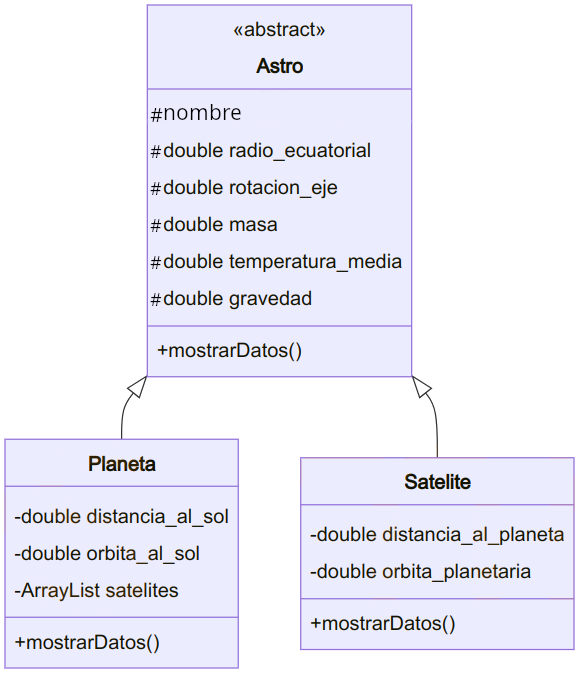

# Retos

> **📌 Empaquetar retos**
> Empaqueta las actividades, dentro de la carpeta **`ut05`**, en la carpeta **`retos`**.
>
> Las actividades programadas en esta sección **Retos** no son obligatorias.

### Reto 01

paquete: **`R01_preguntas`**

De cada pareja de afirmaciones **indica cuál es la verdadera**:

a. Se dice que instanciamos una clase cuando creamos objetos de dicha clase.

b. Se dice que instanciamos una clase cuando creamos una subclase de dicha clase.

c. Si una clase es abstracta no se puede instanciar.

d. Si una clase es abstracta no se puede heredar de ella.

e. Una clase abstracta tiene que tener métodos abstractos.

f. Una clase puede ser abstracta y no tener métodos abstractos.

g. Si una clase tiene métodos abstractos tiene que ser abstracta.

h. Una clase puede tener métodos abstractos y no ser abstracta.

i. Si una clase es abstracta sus subclases no pueden ser abstractas.

j. Una clase abstracta puede tener subclases que también sean abstractas.

k. Si un método es abstracto en una clase, tiene que ser no abstracto en la subclase, o bien, la subclase tiene que ser también abstracta.

l. Si un método es abstracto en una clase, no puede ser abstracto en las subclases.

m. Si un método se define final se tiene que reescribir en las subclases.

n. Si un método se define final no se puede reescribir en las subclases.

o. Una clase puede tener un método final y no ser una clase final.

p. Si una clase tiene un método final tiene que ser una clase final.

q. Si una clase se define final no se pueden definir subclases de ella.

r. Si una clase se define final no se puede instanciar.

s. Un método definido final y abstract resultaría inútil, puesto que nunca se podría implementar en las subclases.

t. Un método definido final y abstract podría resultar útil.

u. Una clase definida final y abstract resultaría inútil, puesto que no se podría instanciar ni heredar de ella.

v. Una clase definida final y abstract podría resultar útil.

---

### Reto 02

paquete: **`R02_alimento`**

a. Realiza una clase `Huevo` con un atributo `tamaño` (`S`, `M`, `L`, `XL`) con el método `toString`.

b. La clase `Huevo` está compuesta por dos clases internas, una `Clara` y otra `Yema`. Ambas clases tienen un atributo `color` y el método `toString`.

c. Realiza un método `main` en el que se cree un objeto de tipo `Huevo`, `Clara` y `Yema`, se le asigne valor a sus atributos y se muestren los valores.

---

### Reto 03 - Astros

paquete: **`R03_astros`**

Define una jerarquía de clases que permita almacenar datos sobre los planetas y satélites (lunas) que forman parte del sistema solar.

Algunos atributos que necesitaremos almacenar son:

- *Nombre*.
- *Masa del cuerpo*.
- *Diámetro medio* .
- *Período de rotación* sobre su propio eje.
- *Período de traslación* alrededor del cuerpo que orbitan.
- *Distancia media* a ese cuerpo.
- etc.

Define las clases necesarias conteniendo:

- Constructores.
- Métodos para recuperar y almacenas atributos.
- Método para mostrar la información del objeto.

Define un método, que dado un objeto del sistema solar (planeta o satélite), imprima toda la información que se dispone sobre el mismo (además de su lista de satélites si los tuviera).

El diagrama UML sería:

> Una posible solución sería crear una lista de objetos, insertar los planetas y satélites (directamente mediante código o solicitándolos por pantalla) y luego mostrar un pequeño menú que permita al usuario imprimir la información del astro que elija.
