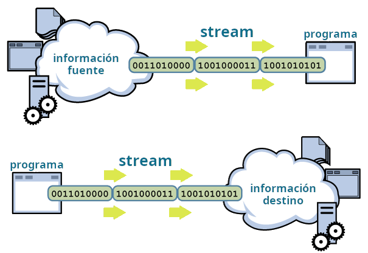
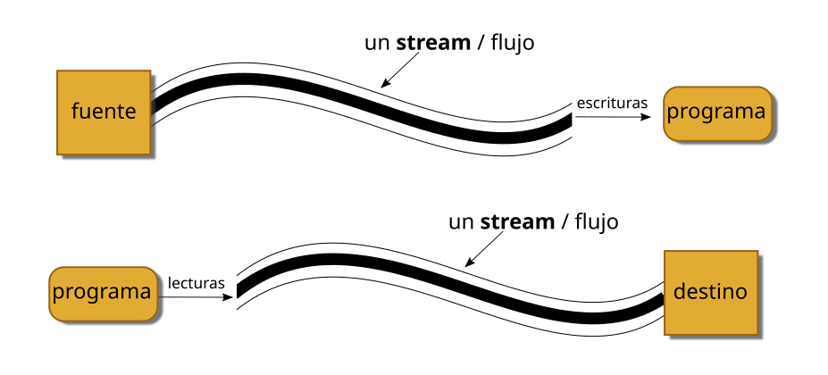
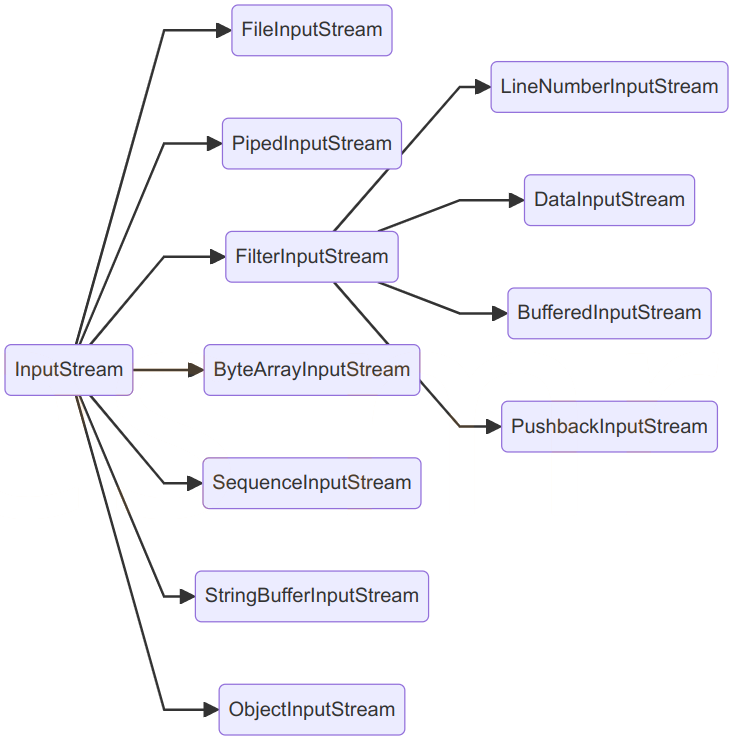
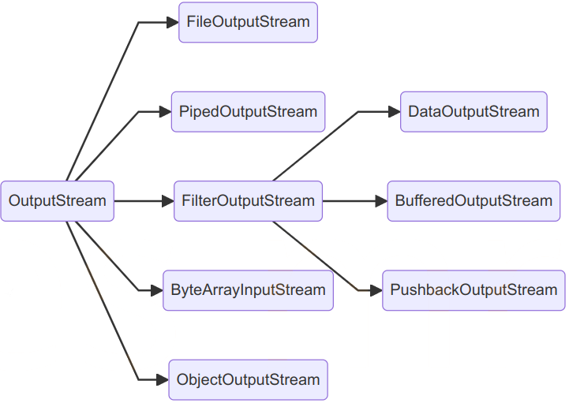
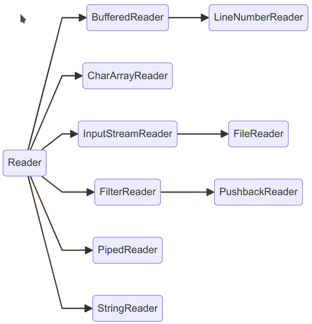
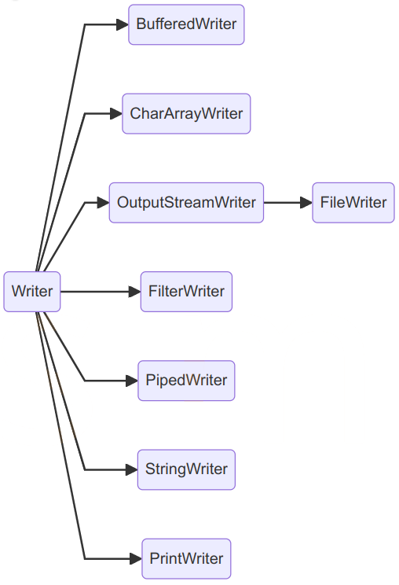
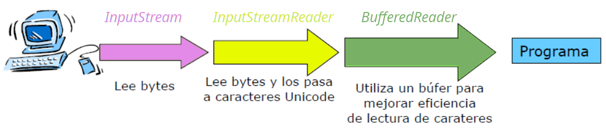
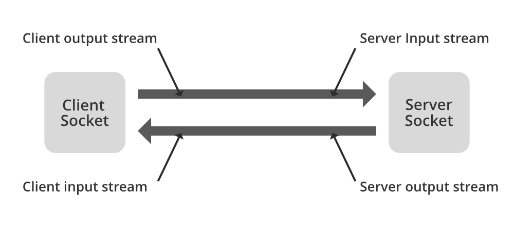

# ☕ UT6 — Lectura y Escritura de Información (Streams, Ficheros y Serialización)

> **📌 Informació Curricular de la Unitat (UT6)**
> **Resultat d'Aprenentatge:** RA5. Realiza operaciones de entrada y salida de información, utilizando procedimientos específicos del lenguaje y librerías de clases.
>
> **Índex ràpid d'apartats en aquesta pàgina:**
>
> - [**6.0 RA y Criterios de Evaluación**](#ut06ras) — [*(Obrir apartat individual)*](./ut06ras.md)
> - [**6.1 Streams (Flujos de entrada y salida)**](#ut0601) — [*(Obrir apartat individual)*](./ut0601.md)
> - [**6.2 Lectura y escritura de ficheros**](#ut0602) — [*(Obrir apartat individual)*](./ut0602.md)
> - [**6.3 Serialización de objetos**](#ut0603) — [*(Obrir apartat individual)*](./ut0603.md)
> - [**6.4 Comunicación por red: Sockets**](#ut0604) — [*(Obrir apartat individual)*](./ut0604.md)
> - [**6.5 Manejo del sistema de ficheros y carpetas (File / NIO)**](#ut0605) — [*(Obrir apartat individual)*](./ut0605.md)
> - [**Actividades prácticas UT6**](#ut06actividades) — [*(Obrir apartat individual)*](./ut06actividades.md)
> - [**Retos de programación UT6**](#ut06retos) — [*(Obrir apartat individual)*](./ut06retos.md)
> - [**Proyecto Intermodular UT6**](#ut06pi) — [*(Obrir apartat individual)*](./ut06pi.md)

---

# RA 6 - Escribe programas que manipulen información seleccionando y utilizando tipos avanzados de datos.

| Criterio de Evaluación | Apartado |
| --- | --- |
| h) Se han identificado las clases relacionadas con el tratamiento de documentos escritos en diferentes lenguajes de intercambio de datos. | A lo largo de toda la UT |
| i) Se han realizado programas que realicen manipulaciones sobre documentos escritos en diferentes lenguajes de intercambio de datos. | A lo largo de toda la UT |

# RA 5 - Realiza operaciones de entrada y salida de información, utilizando procedimientos específicos del lenguaje y librerías de clases.

| Criterio de Evaluación | Apartado |
| --- | --- |
| a) Se ha utilizado la consola para realizar operaciones de entrada y salida de información. | [6.1 Streams (Flujos)](./ut0601.md) |
| b) Se han aplicado formatos en la visualización de la información. | [6.1 Streams (Flujos)](./ut0601.md) |
| c) Se han reconocido las posibilidades de entrada / salida del lenguaje y las librerías asociadas. | [6.1 Streams (Flujos)](./ut0601.md) |
| d) Se han utilizado ficheros para almacenar y recuperar información. | [6.2 Ficheros](./ut0602.md) |
| e) Se han creado programas que utilicen diversos métodos de acceso al contenido de los ficheros. | A lo largo de toda la UT |

---

# 6.1 Streams (flujos)


Los programas Java realizan las operaciones de entrada y salida a través de lo que se denominan **streams** (traducido: *flujos*).


Un *stream* es una abstracción de todo aquello que produzca o consuma información. Podemos ver a este *stream* como una entidad lógica que, por otra parte, se encontrará vinculado con un dispositivo físico. La eficacia de esta forma de implementación radica en que las operaciones de entrada y salida que el programador necesita manejar son las mismas independientemente del dispositivo con el que estemos actuando. Será Java quien se encargue de manejar el dispositivo concreto, ya se trate del teclado, el monitor, un sistema de ficheros o un *socket* de red, etc., liberando a nuestro código de tener que saber con quién está interactuando.

## 1. Clasificación de los Streams

En Java los *streams* se materializan en un conjunto de clases y subclases, contenidas en el paquete `java.io`. Todas las clases para manejar *streams* parten, de cuatro clases abstractas:

| Streams | Orientados a **carácter** | Orientados a **bytes** |
| --- | --- | --- |
| para lectura | **`Reader`** | **`InputStream`** |
| para escritura | **`Writer`** | **`OutputStream`** |

### 1.1. Streams orientados a byte (byte streams)

Proporcionan un medio adecuado para el manejo de entradas y salidas de bytes y su uso lógicamente está orientado a la lectura y escritura de datos binarios. El tratamiento del flujo de bytes viene gobernado por dos clases abstractas que son **InputStream** y **OutputStream**.

Cada una de estas clases abstractas tiene varias subclases concretas que controlan las diferencias entre los distintos dispositivos de I/O que se pueden utilizar. Así mismo, estas dos clases son las que definen los métodos que sus subclases tendrán implementados y, de entre todas, destacan las operaciones `read()` y `write()` que leen y escriben bytes de datos respectivamente.




### 1.2. Streams orientados a carácter (character streams)

Proporciona un medio conveniente para el manejo de entradas y salidas de caracteres. Dichos flujos **usan codificación Unicode** y, por tanto, se pueden internacionalizar.

Este es un modo que Java nos proporciona para manejar caracteres, pero al nivel más bajo todas las operaciones de I/O son orientadas a byte. Al igual que el anterior, el flujo de caracteres también viene gobernado por dos clases abstractas: **Reader** y **Writer**. Dichas clases manejan flujos de caracteres Unicode; y también de ellas derivan subclases concretas que implementan los métodos definidos en ellas siendo los más destacados los métodos `read()` y `write()` que, en este caso, leen y escriben caracteres de datos respectivamente.



Como hemos comentado, tanto en `Reader` como en `InputStream` encontramos un método `read()`, en concreto `public int read()`. Se observa la diferencia entre estos dos métodos nos ayudará a comprender la diferencia entre los flujos orientados a byte y los orientados a carácter.

| método | devuelve |
| --- | --- |
| `int InputStream.read()` | valor entre 0 y 255 |
| `int Reader.read()` | valor entre 0 y 65535 |

A pesar de llamarse igual, `InputStream.read()` devuelve el siguiente byte de datos leído del *stream*. El valor que devuelve está entre 0 y 255 (ó -1 si se ha llegado al final del *stream*). Sin embargo, `Reader.read()`, devuelve un valor entre 0 y 65535 (ó -1 si se ha llegado al final del *stream*), correspondiente al siguiente carácter simple leído del *stream*.

## 2. Stream estándar

Existen una serie de *stream* de uso común a los cuales se denomina *stream estándar*. El sistema se encarga de crear estos *stream* automáticamente.

| stream | métodos |
| --- | --- |
| **System.in** Instancia de la clase `InputStream`: flujo de bytes de entrada. | Métodos: - `read()` permite leer un byte de la entrada como entero. - `skip(n)` ignora `n` bytes de la entrada. - `available()` número de bytes disponibles para leer en la entrada. |
| **System.out** Instancia de la clase `PrintStream`: flujo de bytes de salida. | Métodos: - para impresión de datos: `print()`, `println()`. - `flush()` vacía el buffer de salida escribiendo su contenido.. |
| **System.err** Funcionamiento similar a `System.out`. | Se utiliza para enviar mensajes de error (por ejemplo a un fichero de log o a la consola). |

Por defecto, `System.in`, `System.out` y `System.err` se encuentran asociados a la consola (teclado y pantalla), pero es posible redirigirlos a otras fuentes o destinos, como por ejemplo a un fichero.

## 3. Utilización de Streams

Para utilizar un *stream* hay que seguir una serie de pasos:

**Lectura**:

1º. Abrir el *stream* asociado a una fuente de datos (creación del objeto *stream*):

- Teclado.

- Fichero.

- Socket remoto.

2º. Mientras existan datos disponibles:

- Leer datos.

3º. Cerrar el *stream* (método `close`).

**Escritura**:

1º. Abrir el *stream* asociado a una fuente de datos (creación del objeto *stream*):

- Pantalla.

- Fichero.

- Socket local.

2º. Mientras existan datos disponibles:

- Escribir datos.

3º. Cerrar el *stream* (método `close`).

> **📌 A tener en cuenta:**
> - Los *streams estándar* ya se encarga el sistema de abrirlos y cerrarlos.
> - Un fallo en cualquier punto del proceso produce una `IOException` .

## 4. Las clases `InputStream` y `OutputStream`

Como hemos dicho anteriormente, proporcionan métodos para leer y escribir, respectivamente, un byte de información, a través de sus métodos `read()` y `write()`.

| clase | métodos | descripción |
| --- | --- | --- |
| **InputStream** | `int read()` | Lee un byte de información y lo devuelve como un entero cuyo valor estará entre 0 y 255. Si se detecta el final de los datos de entrada devuelve -1. |
| **OutputStream** | `write (int b)` | Escribe un byte de información en el *stream*. El parámetro es entero, pero si su valor es superior a 255 se escriben los 8 bits de menos peso (los más a la derecha). |

## 5. Las clases `Reader` y `Writer`

Permiten, respectivamente, leer y escribir un carácter en el *stream*.

| clase | métodos | descripción |
| --- | --- | --- |
| **Reader** | `int read()` | Lee un carácter unicode de información y lo devuelve como un entero cuyo valor estará entre 0 y 65565. Si se detecta el final de los datos de entrada devuelve -1. |
| **Writer** | `write (int c)` | Escribe un carácter unicode en el *stream*. El parámetro es entero y corresponderá al código Unicode del carácter que se escribe. |

## 6. Las clases `InputStreamReader` y `OutputStreamWriter`

Son clases que actúan de puente entre *streams* orientados a bytes y *streams* orientados a carácter. Podemos, por ejemplo, crear un `InputStreamReader` asociado a un `InputStream` y leer caracteres del `InputStream` asociado, a través del `InputStreamReader`.

| clase | métodos | descripción |
| --- | --- | --- |
| **InputStreamReader** | `InputStreamReader(inputStream)` `int read()` | Constructor: El objeto se crea a partir de un `InputStream` (orientado a byte). Leerá información del `inputStream` asociado y la devolverá en forma de caracteres. Se puede indicar el charset a utilizar. Lee un carácter del `InputStream` asociado. |
| **OutputStreamWriter** | `OutputStreamWriter(outputStream)` `write(int c)` | Constructor: Crea el objeto asociándolo a un `outputStream`, en el que escribirá bytes. Se puede indicar el charset a utilizar. Escribe el carácter indicado en el `OutputStream` asociado. |

## 7. Buffering

Las clases **`BufferedReader`**, **`BufferedWritter`**, **`BufferedInputStream`** y **`BufferedOutputStream`** permiten realizar *buffering*.

Situadas "*por delante*" de un *stream* acumulan las operaciones de lectura y escritura en una memoria o buffer y cuando hay suficiente información las operaciones se realizan finalmente sobre el dispositivo físico.

Mantienen las mismas operaciones de lectura y escritura que sus clases padre pero, como hemos dicho, reducen el número de accesos al dispositivo físico por el uso de *buffers*.

| clase | métodos | descripción |
| --- | --- | --- |
| **BufferedReader** **BufferedWriter** | `String readLine()` `void write(String s)` `void newLine()` | Además de los métodos heredados, encontramos otros que permiten leer Strings completos, escribir una línea completa de texto y hacer saltos de línea. |
| **BufferedInputStream** **BufferedOutputStream** |  | Mantienen las mismas operaciones de lectura y escritura que sus clases padre pero, como hemos dicho, reducen el número de accesos al dispositivo físico por el uso de buffers. |

## 8. `DataInputStream` y `DataOutputStream`

Realizan una transformación de la información antes de ser escrita o después de ser leída. Los bytes leídos o escritos se interpretan como datos correspondientes a los tipos primitivos de Java.

| clase | métodos | descripción |
| --- | --- | --- |
| **DataInputStream** **DataOutputStream** | `read()`, `readInt()`, `readDouble()`, `readUTF()` `write()`, `writeInt()`, `writeDouble()`, `writeUTF()` … | Que permiten leer y escribir información correspondiente a los distintos tipos de datos de Java. |

## 9. `PrintWriter`

| clase | métodos | descripción |
| --- | --- | --- |
| **PrintWriter** | `print()` `println()` | Esta clase (a la que pertenece `System.out`) tiene los métodos `print` y `println`, que escriben en el stream de salida datos binarios representados en forma de cadenas de caracteres. |

## 10. Combinación de Streams

En muchas ocasiones, una sola clase de las vistas no nos da la funcionalidad necesaria para poder hacer la tarea que se requiere. En tales casos es necesario combinar (anidar) varios *Streams* de manera que unos actúan como origen de información de los otros, o unos escriben sobre los otros.

En este caso tendríamos que combinar tres clases:



```java
BufferedReader b = new BufferedReader(new InputStreamReader(System.in));
```

> **📌 Ejemplo: estándar de salida**
> En el siguiente ejemplo se pide introducir texto hasta que se introduzca una línea con el texto "*salir*". Dicho texto se almacenará en un fichero `salida.txt`.
>
> El proceso debe de estar en un bloque `try..catch`.
>
> Código Java
>
> 📋 Copiar
> JAVA
>
> `package UT06.P1_Flujos;
>
> import java.io.BufferedReader;
> import java.io.FileWriter;
> import java.io.IOException;
> import java.io.InputStreamReader;
> import java.io.PrintWriter;
>
> public class P1_2_FlujoEstandarSalida {
>
>  public static void main(String[] args) {
>  try {
>  // stream de entrada
>  // System.in -> captura la entrada desde la consola
>  // InputStreamReader(System.in) -> convierte bytes de entrada estándar en caracteres
>  // BufferedReader -> para leer líneas completas de texto
>  BufferedReader br = new BufferedReader(
>  new InputStreamReader(System.in));
>  // stream de salida orientada a caracteres
>  PrintWriter out = new PrintWriter(new FileWriter("salida.txt", true));
>  String s;
>  while (!(s = br.readLine()).equals("salir")) {
>  out.println(s);
>  }
>  out.close();
>
>  } catch (IOException ex) {
>  System.out.println("Error: " + ex.getMessage());
>  }
>  }
> }`

> **📌 Un poquito de ...**

---

# 6.2 Ficheros

En ocasiones necesitamos que los datos que introduce el usuario o que produce un programa persistan cuando éste finaliza; es decir, que se conserven cuando el programa termina su ejecución. Para ello es necesario el uso de una base de datos o de ficheros, que permitan guardar los datos en un almacenamiento secundario como un pendrive, disco duro, DVD, etc.

Abordaremos distintos aspectos relacionados con el almacenamiento en ficheros:

- Introducción a conceptos básicos como los de registro y campo.
- Clasificación de los ficheros según el contenido y forma de acceso.
- Operaciones básicas con ficheros de distinto tipo.

## 1. Registros y campos

Llamamos **campo** a un dato en particular almacenado en una base de datos o fichero. Un campo puede ser el nombre de un cliente, la fecha de nacimiento de un alumno, el número de teléfono de un comercio. Los campos pueden ser de distintos tipos: alfanuméricos, numéricos, fechas, etc.

La agrupación de uno o más campos forman un **registro**. Un registro de alumno podría consistir, por ejemplo, de los siguientes campos:

```java
1. Número de expediente.
2. Nombre y apellidos.
3. Domicilio.
```

Un fichero puede estar formado por registros, lo cual dotaría al archivo de estructura. En un fichero de alumnos tendríamos un registro por cada alumno. Los campos del registro serían cada uno de los datos que se almacena del alumno: nº expediente, nombre, etc …

En Java no existen específicamente los conceptos de campo y registro. Lo más similar que conocemos son las clases (similares a un registro) y, dentro de las clases, los atributos (similares a campos).

Tampoco en Java los ficheros están formados por registros. Java considera los archivos simplemente como flujos secuenciales de bytes. Cuando se abre un fichero se asocia a él un flujo (*stream*) a través del cual se lee o escribe en el fichero.

Ejemplo de fichero:

```java
65255
José Mateo Ruiz
C/ Paz, …
56488
Ángela Lopez Villa
Av. Blas..
24645
Armando García Ledesma
C/ Tuej …
```

Ejemplo de registro en el fichero anterior:

```java
24645
Armando García Ledesma
C/ Tuej …
```

Ejemplo de campo en el registro anterior:

```java
Armando García Ledesma
```

## 2. Ficheros de texto VS ficheros binarios

Desde un punto de vista a muy bajo nivel, un fichero es un conjunto de bits almacenados en memoria secundaria, accesibles a través de una ruta y un nombre de archivo.

Este punto de vista a bajo nivel es demasiado simple, pues cuando se recupera y trata la información que contiene el fichero, esos bits se agrupan en unidades mayores que las dotan de significado. Así, dependiendo de cuál es el contenido del fichero (de cómo se interpretan los bits que contiene el fichero), podemos distinguir dos tipos de ficheros:

- Ficheros de texto (o de caracteres).
- Ficheros binarios (o de bytes).

Un **fichero de texto** está formado únicamente por caracteres. Los bits que contiene se interpretan atendiendo a una tabla de caracteres, ya sea ASCII o Unicode. Este tipo de ficheros se pueden abrir con un editor de texto plano y son, en general, legibles. Por ejemplo, los ficheros `.java` que contienen los programas que elaboramos, son ficheros de texto.

Por otro lado, los **ficheros binarios** contienen secuencias de bytes que se agrupan para representar otro tipo de información: números, sonidos, imágenes, etc. Un fichero binario se puede abrir también con un editor de texto plano pero, en este caso, el contenido será ininteligible. Existen muchos ejemplos de ficheros binarios: el archivo `.exe` que contiene la versión ejecutable de un programa es un fichero binario.

Las operaciones de lectura/escritura que utilizamos al acceder desde un programa a un fichero de texto están orientadas al carácter: leer o escribir un carácter, una secuencia de caracteres, una línea de texto, etc. En cambio las operaciones de lectura/escritura en ficheros binarios están orientadas a byte: se leen o escriben datos binarios, como enteros, bytes, double, etc.

## 3. Acceso secuencial VS acceso directo

Existen dos maneras de acceder a la información que contiene un fichero:

- Acceso secuencial.
- Acceso directo (o aleatorio).

Con **acceso secuencial**, para poder leer el byte que se encuentra en determinada posición del archivo es necesario leer, previamente, todos los bytes anteriores. Al escribir, los datos se sitúan en el archivo uno a continuación del otro, en el mismo orden en que se introducen. Es decir, la nueva información se coloca en el archivo a continuación de la que ya existe. No es posible realizar modificaciones de los datos existentes, tan solo añadir al final.

Sin embargo, con el **acceso directo**, es posible acceder a determinada posición (dirección) del fichero de manera directa y, posteriormente, hacer la operación de lectura o escritura deseada.

No siempre es necesario realizar un acceso directo a un archivo. En muchas ocasiones el procesamiento que realizamos de sus datos consiste en la escritura o lectura de todo el archivo siguiendo el orden en que se encuentran. Para ello basta con un acceso secuencial.

## 4. Streams para trabajar con ficheros

Para trabajar con ficheros disponemos de las siguientes clases:

| Streams para ficheros | Ficheros binarios | Ficheros de texto |
| --- | --- | --- |
| para lectura | **`FileInputStream`** | **`FileReader`** |
| para escritura | **`FileOutputStream`** | **`FileWriter`** |

- `FileInputStream` permite leer bytes de un fichero.
- `FileOutputStream` permite escribir bytes de un fichero.
- `FileReader` permite leer de un fichero uno o varios caracteres.
- `FileWriter` permite escribir en un fichero uno o varios caracteres o un String.

> **📌 Consulta**
> Consulta en la documentación los distintos constructores disponibles para estas clases.

> **📌 Ejemplo: crear un fichero**
> En el siguiente ejemplo vemos cómo crear un fichero de texto y escribir una frase en él.
>
> Código Java
>
> 📋 Copiar
> JAVA
>
> `package UT06.P2_Ficheros;
>
> import java.io.*;
>
> public class P2_1_CrearFichero {
>
>  public static void main(String[] args) {
>  FileWriter f = null;
>  try {
>  f = new FileWriter("texto.txt");
>  f.write("Este texto se escribe en el fichero\n\r");
>
>  } catch (IOException e) {
>  System.out.println("Problema al abrir o escribir ");
>
>  } finally {
>  if (f != null) {
>  try {
>  f.close();
>  } catch (IOException e) {
>  System.out.println("Problema al cerrar el fichero");
>  }
>  }
>  }
>  }
> }`
>
> La creación del `FileWriter` puede provocar `IOException`, lo mismo que el método `write`. Por ello las instrucciones se encuentran en un bloque `try-catch`.
>
> Al finalizar su uso, y tan pronto como sea posible, hay que cerrar los *streams* (`close`) .

> **📌 Ejemplo: sobreescribir un fichero**
> Es muy importante tener en cuenta que cuando se crea un `FileWriter` o un `FileOutputStream` y se escribe en él:
>
> - si el fichero no existe se crea.
>
>  - si el fichero existe, **su contenido se reemplaza** por el nuevo. El contenido previo que tuviera el fichero se pierde.
>
>  Vamos a ver una serie de ejemplos que muestren cómo leer y escribir secuencialmente sobre/en un fichero y también escribir en un fichero indicando que la información se añada a la que ya hay y no se reescriba el fichero. Para esto último usaremos el constructor de FileWriter que recibe dos parámetros; el primer parámetro es el nombre del fichero y el segundo parámetro, `append`, lo pasaremos con el valor *true*.
>
> El siguiente ejemplo muestra como añadir una línea al final de un fichero de texto.
>
> Código Java
>
> 📋 Copiar
> JAVA
>
> `package UT06.P2_Ficheros;
>
> import java.io.*;
>
> public class P2_2_SobreescribirFichero {
>
>  public static void main(String[] args) {
>  try (FileWriter f = new FileWriter("texto.txt", true);) {
>  f.write("Este texto se añade en el fichero\n\r");
>
>  } catch (IOException e) {
>  System.out.println("Problema al abrir o escribir ");
>  }
>  }
> }`
>
> En este ejemplo se ha utilizado la nueva sintaxis disponible para los bloques try-catch: lo que se denomina **`try with resource`**. Esta sintaxis permite crear un objeto en la cabecera del bloque try. El objeto creado se cerrará automáticamente al finalizar. El objeto debe pertenecer al interface Closeable, es decir, debe tener método close().

### 4.1. Lectura y escritura de información estructurada

Si observamos la documentación de las clases **FileInputStream** y **FileOutputStream** veremos que las operaciones de lectura y escritura son muy básicas y permiten únicamente leer o escribir uno o varios bytes. Es decir, son operaciones de muy bajo nivel. Si lo que queremos es escribir información binaria más compleja, como por ejemplo un dato de tipo `double`, `boolean` o `int`, tendríamos que hacerlo a través de un *stream* que permitiese ese tipo de operaciones y asociarlo al `FileInputStream` o `FileOutputStream`.

Podríamos, por ejemplo, asociar un `DataInputStream` a un `FileInputStream` para leer del fichero un dato de tipo `int`.

En ejemplos posteriores se ilustrará cómo asociar un *stream* a un `FileXXXStream`.

> **📌 Ejemplo: lectura de un fichero secuencial de texto**
> Leer un fichero de texto y mostrar el número de vocales que contiene.
>
> Código Java
>
> 📋 Copiar
> JAVA
>
> `package UT06.P2_Ficheros;
>
> import java.io.*;
>
> public class P2_3_LecturaSecuencialTexto {
>
>  final static String VOCALES = "aáàeééiíoóòuúüAÁÀEÉÈIÍOÓÒUÚÜ";
>
>  public static void main(String[] args) {
>  try (FileReader f = new FileReader(new File("texto.txt"));) {
>  int contadorVocales = 0;
>  int caracter;
>  while ((caracter = f.read()) != -1) {
>  char letra = (char) caracter;
>  if (VOCALES.indexOf(letra) != -1) {
>  contadorVocales++;
>  }
>  }
>  System.out.println("Numero de vocales: " + contadorVocales);
>
>  } catch (FileNotFoundException e) {
>  System.out.println("ERROR: Probrema al abrir el fichero");
>
>  } catch (IOException e) {
>  System.out.println("ERROR: Problema al leer");
>  }
>  }
> }`
>
> Observa que:
>
> - Para leer el fichero de texto usamos un `InputReader`.
> - Al crear el *stream* (`InputReader`) es posible indicar un objeto de tipo `File`.
> - La operación `read()` devuelve un entero. Para obtener el carácter correspondiente tenemos que hacer una conversión explícita de tipos.
> - La operación `read()` devuelve -1 cuando no queda información que leer del *stream*.
> - La guarda del bucle `while` combina una asignación con una comparación. En primer lugar se realiza la asignación y luego se compara carácter con -1.
> - `FileNotFoundException` sucede cuando el fichero no se puede abrir (no existe, permiso denegado, etc), mientras que `IOException` se lanzará si falla la operación `read().`

> **📌 Ejemplo: escritura de un fichero secuencial de texto**
> Dada una cadena escribirla en un fichero en orden inverso:
>
> Código Java
>
> 📋 Copiar
> JAVA
>
> `package UT06.P2_Ficheros;
>
> import java.io.*;
>
> public class P2_4_EscrituraSecuencialTexto {
>
>  final static String CADENA = "En un lugar de la mancha...";
>
>  public static void main(String[] args) {
>  try (FileWriter f = new FileWriter(new File("texto.txt"));) {
>  for (int i = CADENA.length() - 1; i >= 0; i--) {
>  f.write(CADENA.charAt(i));
>  }
>  System.out.println("FIN");
>
>  } catch (FileNotFoundException e) {
>  System.out.println("ERROR: Probrema al abrir el fichero");
>
>  } catch (IOException e) {
>  System.out.println("ERROR: Problema al escribir");
>
>  }
>  }
> }`
>
> Observa que:
>
> - Para escribir el fichero de texto usamos un `FileWriter`.
> - Tal y como se ha creado el *stream*, el fichero (si ya existe) se sobreescribirá.
> - El manejo de excepciones es como el del caso previo.

> **📌 Ejemplo: escritura de un fichero secuencial binario**
> Ya hemos visto que con `FileInputStream` y `FileOutputStream` se puede leer y escribir bytes de información de/a un archivo.
>
> Sin embargo esto puede no ser suficiente cuando la información que tenemos que leer o escribir es más compleja y los bytes se agrupan para representar distintos tipos de datos.
>
> Imaginemos por ejemplo que queremos guardar en un fichero “jugadores.dat”, el año de nacimiento y la estatura de cinco jugadores de baloncesto:
>
> Código Java
>
> 📋 Copiar
> JAVA
>
> `package UT06.P2_Ficheros;
>
> import java.io.*;
> import java.util.Scanner;
>
> public class P2_6_EscrituraSecuencialBinario {
>
>  public static void main(String[] args) {
>  Scanner tec = new Scanner(System.in);
>  try (DataOutputStream fs = new DataOutputStream(
>  new BufferedOutputStream(
>  new FileOutputStream("jugadores.dat")));) {
>  for (int i = 1; i <= 5; i++) {
>  //Pedimos datos al usuario
>  System.out.println(" ---- Jugador " + i + " -----");
>  System.out.print("Nombre: ");
>  String nombre = tec.nextLine();
>
>  System.out.print("Nacimiento: ");
>  int anyo = tec.nextInt();
>
>  System.out.print("Estatura: ");
>  double est = tec.nextDouble();
>  //Vaciar salto linea
>  tec.nextLine();
>
>  //Volcamos información al fichero
>  fs.writeUTF(nombre);
>  fs.writeInt(anyo);
>  fs.writeDouble(est);
>  }
>
>  } catch (FileNotFoundException e) {
>  System.out.println("ERROR: Probrema al abrir el fichero");
>
>  } catch (IOException e) {
>  System.out.println("ERROR: Problema al leer o escribir");
>
>  }
>  }
> }`
>
> Observa que:
>
> - Para escribir información binaria usamos un `DataInputStream` asociado al *stream*. La clase tiene métodos para escribir `int`, `byte`, `double`, `boolean`, etc.
> - Además, como hemos hecho en ejemplos previos, usamos un *buffer*. Fíjate como en el constructor se enlazan unas clases con otras.
> - A pesar de que en Java los ficheros son secuencias de bytes, estamos dotando al fichero de cierta estructura: primero aparece el nombre, luego el año y finalmente la estatura. Cada uno de estos tres datos constituirían un registro de formado por tres campos. Para poder recuperar información de un fichero binario es necesario conocer cómo se estructura ésta dentro del fichero.

> **📌 Ejemplo: lectura de un fichero secuencial binario**
> Código Java
>
> 📋 Copiar
> JAVA
>
> `package UT06.P2_Ficheros;
>
> import java.io.*;
> import java.util.Scanner;
>
> public class P2_7_LecturaSecuencialBinario {
>
>  public static void main(String[] args) {
>  Scanner tec = new Scanner(System.in);
>  try (DataInputStream fe = new DataInputStream(
>  new BufferedInputStream(
>  new FileInputStream("jugadores.dat")));) {
>  while (true) {
>  //Leemos nombre
>  System.out.println(fe.readUTF());
>  //leemos y desechamos resto de datos
>  fe.readInt();
>  fe.readDouble();
>  }
>
>  } catch (EOFException e) {
>  //Se lanzará cuando se llegue al final del fichero
>
>  } catch (FileNotFoundException e) {
>  System.out.println("ERROR: Probrema al abrir el fichero");
>
>  } catch (IOException e) {
>  System.out.println("ERROR: Problema al leer o escribir");
>
>  }
>  }
> }`
>
> Observa que:
>
> - A pesar de que necesitamos solamente el nombre de cada jugador, es necesario leer también el año y la estatura. No es posible acceder al nombre del segundo jugador sin leer previamente todos los datos del primer jugador.
> - La lectura se hace a través de un bucle infinito (**while (true)**), que finalizará cuando se llegue el final del fichero y al leer de nuevo se produzca la excepción **EOFException**.

## 5. Ficheros con buffering

Cualquier operación que implique acceder a memoria externa es muy costosa, por lo que es interesante intentar reducir al máximo las operaciones de lectura/escritura que realizamos sobre los ficheros, haciendo que cada operación lea o escriba muchos caracteres. Además, eso también permite operaciones de más alto nivel, como la de leer una línea completa y devolverla en forma de cadena.

En el libro *Head First Java*, describe los *buffers* de la siguiente forma: "*Si no hubiera buffers, sería como comprar sin un carrito: debería llevar los productos uno a uno hasta la caja. Los buffers te dan un lugar en el que dejar temporalmente las cosas hasta que está lleno. Por ello has de hacer menos viajes cuando usas el carrito.*"

Las clases `BufferedReader`, `BufferedWritter`, `BufferedInputStream` y `BufferedOutputStream` permiten realizar *buffering*. Situadas "por delante" de un *stream* de fichero acumulan las operaciones de lectura y escritura y cuando hay suficiente información se llevan finalmente al fichero.

> **📌 Recuerda**
> Recuerda la importancia de cerrar los flujos para asegurarte que se vacía el *buffer*.

> **📌 Ejemplo: usando buffers para leer y escribir de/en fichero**
> En el siguiente codigo se usan *buffers* para leer líneas de un fichero y escribirlas en otro convertidas a mayúsculas.
>
> Código Java
>
> 📋 Copiar
> JAVA
>
> `package UT06.P2_Ficheros;
>
> import java.io.*;
>
> public class P2_5_Buffers {
>
>  final static String ENTRADA = "texto.txt";
>  final static String SALIDA = "textoMayusculas.txt";
>
>  public static void main(String[] args) {
>  try (BufferedReader fe = new BufferedReader(new FileReader(ENTRADA));
>  BufferedWriter fs = new BufferedWriter(new FileWriter(SALIDA))){
>  String linea;
>  while ((linea = fe.readLine()) != null) {
>  fs.write(linea.toUpperCase());
>  fs.newLine();
>  }
>  System.out.println("FIN");
>
>  } catch (FileNotFoundException e) {
>  System.out.println("ERROR: Probrema al abrir el fichero");
>
>  } catch (IOException e) {
>  System.out.println("ERROR: Problema al leer o escribir");
>  }
>  }
> }`
>
> Observa que:
>
> - Usamos *buffers* tanto para leer como para escribir. Esto permite minimizar los accesos a disco.
> - Los *buffers* quedan asociados a un `FileReader` y `FileWriter` respectivamente. Realizamos las operaciones de lectura/escritura sobre las clases `Buffered…` y cuando es necesario la clase accede internamente al *stream* que maneja el fichero.
> - Es necesario escribir explícitamente los saltos de línea. Esto se hace mediante el método `newLine()`. Este método permite añadir un salto de línea sin preocuparnos de cuál es el carácter de salto de línea. El salto de línea es distinto en distintos sistemas: en unos es `\n`, en otros `\r`, en otros `\n\r`, …
> - `BufferedReader` dispone de un método para leer líneas completas (`readLine()`). Cuando se llega al final del fichero este método devuelve `null`.
> - Fíjate como en el bloque `try with resources` creamos varios objetos. Si la creación de cualquiera de ellos falla, se cerrarán todos los *stream* que se han abierto.

## 6. `try` VS `try with resources`

En ocasiones el propio IDE nos sugiere que usemos el bloque `try with resources` en lugar de un simple `try`, así una sentencia como esta:

```java
FileReader fr = new FileReader(path);
BufferedReader br = new BufferedReader(fr);
try {
    return br.readLine();
} finally {
    br.close();
    fr.close();
}
```

Acaba convertida en algo parecido a esta:

```java
static String readFirstLineFromFile(String path) throws IOException {
    try (FileReader fr = new FileReader(path);
         BufferedReader br = new BufferedReader(fr)) {
        return br.readLine();
    }
}   
```

> **📌 utilizar el método close() ??**
> La principal diferencia es que hasta Java 7 sólo se podía hacer como en la primera versión. Además, en la segunda versión nos "ahorramos" tener que cerrar los recursos, puesto que lo realizará automáticamente en caso de que se produzca algún error evitando así el enmascaramiento de excepciones. Por tanto, sigue siendo necesario cerrar el *stream* por ejemplo al usar un *buffer* para que se vacíe totalmente en el fichero de destino.

---

# 6.3 Serialización

Java facilita el almacenamiento y transmisión del estado de un objeto mediante un mecanismo conocido con el nombre de serialización.

La serialización de un objeto consiste en generar una secuencia de bytes lista para su almacenamiento o transmisión. Después, mediante la deserialización, el estado original del objeto se puede reconstruir.

Para que un objeto sea serializable, ha de implementar la interfaz `java.io.Serializable` (que lo único que hace es marcar el objeto como serializable, sin que tengamos que implementar ningún método).

```java
import java.io.*;

public class Persona implements Serializable {

    private String nombre;
    transient private int edad; //No se guardará al serializar
    private double salario;
    private Persona tutor;
    [...]
}
```

- Para que un objeto sea serializable, todas sus variables de instancia han de ser serializables.
- Todos los tipos primitivos en Java son serializables por defecto (igual que los arrays y otros muchos tipos estándar).
- Cuando queremos evitar que cualquier campo persista en un archivo, lo marcamos como transitorio (**`transient`**). No podemos marcar ningún método transitorio, solo campos.
- Para leer o escribir de/en un fichero binario que incluye información seriarizable se utilizará los *streams* **ObjectInpuStream** y **ObjectOutputStream** con los métodos **`readObject()`** y **`writeObject(ClaseSerializada obj)`** respectivamente.

> **📌 **
> El fichero con los objetos serializados almacena los datos en un formato propio de Java, por lo que no se puede leer fácilmente con un simple editor de texto (ni editar).

> **📌 Ejemplo: serialización**
> Código Java
>
> 📋 Copiar
> JAVA
>
> `package UT06.P3_Serializacion;
>
> import java.io.*;
>
> public class Persona implements Serializable {
>
>  private String nombre;
>  transient private int edad; //No se guardará al serializar
>  private double salario;
>  private Persona tutor;
>
>  public Persona(String nom, double salari) {
>  this.nombre = nom;
>  this.salario = salari;
>  edad = 0;
>  tutor = null;
>  }
>
>  public String getNombre() {
>  return nombre;
>  }
>
>  public int getEdad() {
>  return edad;
>  }
>
>  public double getSalario() {
>  return salario;
>  }
>
>  public Persona getTutor() {
>  return tutor;
>  }
>
>  public void incrementaEdad() {
>  edad++;
>  }
>
>  public void asignaTutor(Persona p) {
>  tutor = p;
>  }
> }`
>
> Ahora detallamos la clase para serializar o guardar la información en un archivo mediante el stream **ObjectOutputStream**:
>
> Código Java
>
> 📋 Copiar
> JAVA
>
> `package UT06.P3_Serializacion;
>
> import java.io.*;
>
> public class Guardar {
>
>  public static void main(String args[]) {
>  ObjectOutputStream salida;
>  Persona p1, p2, p3, p4;
>
>  p1 = new Persona("Vicent", 1200.0);
>  p2 = new Persona("Mireia", 1800.0);
>  p3 = new Persona("Josep", 2100.0);
>  p4 = new Persona("Marta", 850.0);
>
>  p1.asignaTutor(p2);
>  p2.asignaTutor(p3);
>  p3.asignaTutor(p4);
>
>  try {
>  salida = new ObjectOutputStream(new FileOutputStream("empleados.ser"));
>  salida.writeObject(p1);
>  salida.close();
>
>  } catch (IOException e) {
>  System.out.println("ERROR: Algún problema guardando a disco.");
>  }
>  }
> }`
>
> Como la clase `Persona` implementa `Serializable` significa que `p1` y todos los objetos referenciados por él (como `p2`, `p3`, `p4`) serán serializados en cadena.

---

# 6.4 Sockets

Los *sockets* son un mecanismo que nos permite establecer un enlace entre dos programas que se ejecutan independientes el uno del otro (generalmente un programa cliente y un programa servidor). Java, por medio de la librería `java.net`, nos provee dos clases: `Socket` para implementar la conexión desde el lado del cliente y **ServerSocket** que nos permitirá manipular la conexión desde el lado del servidor.

Cabe resaltar que tanto el cliente como el servidor no necesariamente deben estar implementados en Java, solo deben conocer sus direcciones IP y el puerto por el cual se comunicarán.



> **📌 Ejemplo**
> Para nuestro ejemplo de *sockets* implementaremos ambos (cliente y servidor) usando Java y se comunicarán usando el puerto 10000 (*elegir puertos en el rango de 1024 hasta 65535*).
>
> La secuencia de eventos en nuestro ejemplo será:
>
> 1. El servidor creará el *socket* y esperará a que el cliente se conecte o lo detengamos.
> 2. Por otro lado, el cliente abrirá la conexión con el servidor y le enviará una frase en minúsculas que escribirá el usuario y la enviará al servidor.
> 3. Una vez recibida la frase en minúsculas, el servidor la convertirá en mayúsculas y la devolverá al cliente.
> 4. El cliente mostrará la frase en mayúsculas recibida desde el servidor y cerrará la conexión.
> 5. El servidor quedará a la espera de una nueva conexión de otro cliente.
>
> Servidor
>
> Cliente
> ```java
> package UT06.P4_Sockets;
>
> import java.io.*;
> import java.net.*;
>
> public class TCPServidor {
>
>   public static void main(String[] args) throws IOException, ClassNotFoundException {
>     String FraseClient;
>     String FraseMajuscules;
>     ServerSocket serverSocket = new ServerSocket(10000);
>     Socket clientSocket;
>     ObjectInputStream entrada;
>     ObjectOutputStream eixida;
>
>     System.out.println("Servidor iniciado y escuchando por el puerto 10000");
>     while (true) {
>         clientSocket = serverSocket.accept();
>         entrada = new ObjectInputStream(clientSocket.getInputStream());
>         FraseClient = (String) entrada.readObject();
>
>         System.out.println("La frase recibida es: " + FraseClient);
>
>         eixida = new ObjectOutputStream(clientSocket.getOutputStream());
>         FraseMajuscules = FraseClient.toUpperCase();
>         System.out.println("El servidor devuelve la frase: " + FraseMajuscules);
>         eixida.writeObject(FraseMajuscules);
>
>         clientSocket.close();
>         System.out.println("Server esperando una nueva conexión...");
>     }
>   }
> }
> ```
> ```java
> package UT06.P4_Sockets;
>
> import java.io.*;
> import java.net.*;
> import java.util.Scanner;
>
> public class TCPClient {
>
>   public static void main(String[] args) throws IOException, ClassNotFoundException {
>     Socket socket;
>     ObjectInputStream entrada;
>     ObjectOutputStream eixida;
>     String frase;
>
>     socket = new Socket(InetAddress.getLocalHost(), 10000);
>     eixida = new ObjectOutputStream(socket.getOutputStream());
>
>     System.out.println("Introduce la frase a enviar en minúsculas");
>     Scanner in = new Scanner(System.in);
>     frase = in.nextLine();
>     System.out.println("Se envia la frase " + frase);
>     eixida.writeObject(frase);
>
>     entrada = new ObjectInputStream(socket.getInputStream());
>     System.out.println(
>             "La frase recibida es: " + (String) entrada.readObject());
>
>     socket.close();
>   }
> }
> ```

---

# 6.5 Manejo de ficheros y carpetas

## 1. La clase File

La clase `File` es una representación abstracta de ficheros y carpetas. Cuando creamos en Java un objeto de la clase `File` en representación de un fichero o carpeta concretos, no creamos el fichero al que se representa; es decir, el objeto `File` representa al archivo o carpeta de disco, pero no es el archivo o carpeta de disco.

La clase `File` dispone de métodos que permiten realizar determinadas operaciones sobre los ficheros. Podríamos, por ejemplo, crear un objeto de tipo `File` que represente a `c:\datos\libros.txt` (o `/home/abc/datos/libros.txt`) y, a través de ese objeto `File`, realizar consultas relativas al fichero `libros.txt`, como su tamaño, atributos, etc; o realizar operaciones sobre él: borrarlo, renombrarlo, …

## 2. Constructores

La clase `File` tiene varios constructores, que permiten referirse, de varias formas, al archivo que queremos representar:

| Método | Descripción |
| --- | --- |
| `public File (String ruta)` | Crea el objeto `File` a partir de la ruta indicada. Si se trata de un archivo tendrá que indicar la ruta y el nombre. |
| `public File (String ruta, String nombre)` | Permite indicar de forma separada la ruta del archivo y su nombre. |
| `public File (File ruta, String nombre)` | Permite indicar de forma separada la ruta del archivo y su nombre. En este caso la ruta está representada por otro objeto File. |
| `public File (URI uri)` | Crea el objeto File a partir de un objeto [URI](https://es.wikipedia.org/wiki/Identificador_de_recursos_uniforme) (Uniform Resource Identifier). Un URI permite representar un elemento siguiendo una sintaxis concreta, un estándar. |

## 3. Métodos

Aquí exponemos algunos métodos interesantes. Hay otros que puedes consultar en la documentación de Java.

| **Relacionados con el nombre del fichero** |  |
| --- | --- |
| `String getName()` | Devuelve el nombre del fichero o directorio al que representa el objeto (solo el nombre, sin la ruta). |
| `String getPath()` | Devuelve la ruta del fichero o directorio. La ruta obtenida es dependiente del sistema; es decir, contendrá el carácter de separación de directorios que esté establecido por defecto. Este separador está definido en public `static final String separator`. |
| `String getAbsolutePath()` | Devuelve la ruta absoluta del fichero o directorio. |
| `String getParent()` | Devuelve la ruta del directorio en que se encuentra el fichero o directorio representado. Devuelve `null` si no hay directorio padre. |

| **Para hacer comprobaciones** |  |
| --- | --- |
| `boolean exists()` `boolean canWrite()` `boolean canRead()` `boolean isFile()` `boolean isDirectory()` | Permite averiguar si el fichero existe. Permite averiguar si se puede escribir en el. Permite averiguar si se puede leer de él. Permite averiguar si se trata de un fichero o Permite averiguar dsi se trata de un directorio. |

| **Obtener información de un fichero** |  |
| --- | --- |
| `long length` | Devuelve el tamaño en bytes del archivo. El resultado es indefinido si se consulta sobre un directorio o una unidad. |
| `long lastModified` | Devuelve la fecha de la última modificación del archivo. Devuelve el número de milisegundos transcurridos desde el 1 de enero de 1970 |

| **Para trabajar con directorios** |  |
| --- | --- |
| `boolean mkdir()` | Crea el directorio al cual representa el objeto File. |
| `boolean mkdirs()` | Crea el directorio al cual representa el objeto File, incluyendo todos aquellos que sean necesarios y no existan. |
| `String[] list()` | Devuelve un array de `Strings` con los nombres de los ficheros y directorios que contiene el directorio al que representa el objeto File. |
| `String[] list(FileNameFilter filtro)` | Devuelve un array de `Strings` con los nombres de los ficheros y directorios que contiene el directorio al que representa el objeto File y que cumplen con determinado filtro. |
| `public File[] listFiles()` | Devuelve un array de objetos `File` que representan a los archivos y carpetas contenidos en el directorio al que se refiere el objeto File. |

| **Para hacer cambios** |  |
| --- | --- |
| `boolean renameTo(File nuevoNombre)` | Permite renombrar un archivo. Hay que tener en cuenta que la operación puede fracasar por muchas razones, y que será dependiente del sistema (por ejemplo: que no se pueda mover el fichero de un lugar a otro, que ya exista un fichero que coincide con el nuevo, etc). El método devuelve *true* solo si la operación se ha realizado con éxito. Existe un método move en la clase Files para mover archivos de una forma independiente del sistema. |
| `boolean delete()` | Elimina el archivo o la carpeta a la que representa el objeto File. Si se trata de una carpeta tendrá que estar vacía. Devuelve *true* si la operación tiene éxito. |
| `boolean createNewFile()` | Crea un archivo vacío. Devuelve *true* si la operación se realiza con éxito. |
| `File createTempFile(String prefijo, String sufijo)` | Crea un archivo vacío en la carpeta de archivos temporales. El nombre llevará el prefijo y sufijo indicados. Devuelve el objeto File que representa al nuevo archivo. |

> **📌 Ejemplo: manejo de ficheros y carpetas**
> ```java
> package UT06.P5_Manejo;
>
> import java.io.*;
> import java.util.*;
>
> public class P5_1_Manejo {
>
>   public static void main(String[] args) {
>      Scanner tec = new Scanner(System.in);
>      System.out.println("Introduce ruta absoluta de una carpeta");
>      String nombreCarpeta = tec.nextLine();
>      //Creamos objeto File para representar a la carpeta
>      File car = new File(nombreCarpeta);
>      //Comprobamos si existe
>      if (car.exists()) {
>         //¿Es una carpeta?
>         if (car.isDirectory()) {
>            if (car.canRead()) 
>                System.out.println("Lectura permitida");
>            else
>                System.out.println("Lectura no permitida");
>
>            if (car.canWrite())
>                System.out.println("Escritura permitida");
>            else
>                System.out.println("Escritura no permitida");
>
>            if (car.isHidden())
>                System.out.println("Carpeta aoculta");
>            else
>                System.out.println("Carpeta visible");
>
>            System.out.println("---- Contenido de la carpeta ----");
>            File[] contenido = car.listFiles();
>            for (File f : contenido) {
>                System.out.println(f.getName());
>            }
>         } else {
>             System.out.println("ERROR: " + car.getAbsolutePath() + " No es una carpeta");
>         }
>      } else {
>          System.out.println("ERROR: No existe la carpeta/archivo " + car.getAbsolutePath());
>      }
>   }
> }
> ```

---

# Actividades UT06

> **📌 Empaquetar actividades**
> Empaqueta las actividades, dentro de la carpeta **`ut06/bloqueX`**

---

## Bloque 6.0

### Actividad 01

Actividad **`A01_leeEdad`**

Escribir un programa que solicite al usuario su edad y, utilizando directamente `Scanner`, la lea de teclado y muestre por pantalla un mensaje del estilo "Su edad es 32 años".

### Actividad 02

Actividad **`A02_leeEdad`**

Repite la *Actividad 01* utilizando un `BufferedWriter` para escribirlo en un archivo llamado *edad.txt*.

### Actividad 03

Actividad **`A03_notas`**

Escribir un programa que almacene en un fichero las notas de (máximo) 20 alumnos. El programa tendrá el siguiente funcionamiento:

- En el fichero se guardarán como máximo 20 notas, pero se pueden guardar menos. El proceso de introducción de notas (y en consecuencia, el programa) finalizará cuando el usuario introduzca una nota no válida (menor que cero o mayor que 10).
- Al incio de la ejecución se pedirá al usuario el nombre que desea que tenga el archivo.
- Al finalizar la entrada de notas, se mostraran todas las introducidas por pantalla (leyendolas del mismo archivo).

### Actividad 04

Actividad **`A04_informacionFicheros`**

Implementa un programa que pida al usuario introducir por teclado una ruta del sistema de archivos (por ejemplo, `C:/Windows` o `Documentos`) y muestre información sobre dicha ruta (ver función más abajo). El proceso se repetirá una y otra vez hasta que el usuario introduzca una ruta vacía (tecla *intro*). Deberá manejar las posibles excepciones.

Necesitarás crear la función `void muestraInfoRuta(File ruta)` que dada una ruta de tipo `File` haga lo siguiente:

- Si es un archivo, mostrará por pantalla el nombre del archivo.
- Si es un directorio, mostrará por pantalla la lista de directorios y archivos que contiene (sus nombres).
- Si el path no existe lanzará un `FileNotFoundException` .

### Actividad 05

Actividad **`A05_informacionFicheros2`**

Partiendo de una copia del programa anterior, modifica la función `muestraInfoRuta`:

- En el caso de un directorio, mostrará la lista de directorios y archivos en orden alfabético. Es decir, primero los directorios en orden alfabético y luego los archivos en orden alfabético. Te será útil `Arrays.sort()` .
- Añade un segundo argumento `boolean info` que cuando sea `true` mostrará, junto a la información de cada directorio o archivo, su tamaño en bytes y la fecha de la última modificación. Cuando `info` sea `false` mostrará la información como en el Actividad anterior.

### Actividad 06

Actividad **`A06_escribirFichero2`**

Empaqueta toda esta actividad en: **`ut06/actividades/ce5d/`****gestionaLibros**

- ( `Autor` ) Crea la clase autor, con los atributos *nombre* , *año de nacimiento* y *nacionalidad* . Incorpora un constructor que reciba todos los datos y el método `toString()` .
- ( `Libro` ) Crea la clase Libro, con los atributos *titulo* , *año de edición* y *autor* (Objeto de la clase autor). Incorpora un constructor que reciba todos los datos y el método `toString()` .
- Escribe un programa ( `GuardaLibros` ) que cree tres libros y los almacene en el fichero `biblioteca.obj` .

> **Nota**: Las clases deberán implementar el interfaz `Serializable`.

### Actividad 07

Escribe un programa de nombre `LeeLibros`que lea los objetos del fichero `biblioteca.obj` y los muestre por pantalla.

### Actividad 08

Escribe un programa que, usando las clases `FileReader` y `FileWriter`:

- Escriba los caracteres de tu nombre en un fichero ( **nombre.txt** ).
- Lea el fichero creado y lo muestre por pantalla.
- Si abrimos el fichero creado con un editor de textos, ¿su contenido es legible?

### Actividad 09

Escribe un programa que, usando las clases `FileOutputStream` y `FileInputStream`,

- Escriba los caracteres de tu nombre en un fichero y los vaya añadiendo ( `nombres.log` ).
- Lea el fichero creado y lo muestre por pantalla.
- Si abrimos el fichero creado con un editor de textos, ¿su contenido es legible?

### Actividad 10

Escribe un programa que, utilizando entre otras la clase `DataOutputStream`, almacene en un fichero llamado `personas.dat` la información relativa a una serie de personas que va introduciendo el usuario desde teclado:

- `Nombre` (String)
- `Edad` (entero)
- `Peso` (double)
- `Estatura` (double)

La entrada del usuario terminará cuando se introduzca un nombre vacío.

> **Nota**: Utiliza la clase `Scanner` para leer desde teclado y los métodos `writeDouble`, `writeInt` y `writeUTF` de la clase `DataOutputStream` para escribir en el fichero.

Al finalizar el programa, abre el fichero resultante con un editor de texto ¿La información que contiene es legible?

### Actividad 11

Realizar un programa que lea la información del fichero `personas.dat` y la muestre por pantalla. Para determinar que no quedan más datos en el fichero podemos capturar la excepción `EOFException` .

### Actividad 12

Modifica el programa anterior para que el usuario, al comienzo del programa, pueda elegir si quiere añadir datos al fichero o sobre escribir la información que contiene.

### Actividad 13

> Para esta actividad utilizaremos el fichero de texto **[productos.txt](../docsActividades/productos.txt)**. Descárgalo en la carpeta `src/test`.

Se desea simular el funcionamiento de una máquina expendedora. Se trata de una expendedora sencilla que, por el momento, será capaz de dispensar únicamente un producto.

Su funcionamiento, a grandes rasgos, es el siguiente:

1. El cliente introduce dinero en la máquina. Al dinero introducido lo llamaremos `credito` .
2. Selecciona el producto que quiere comprar (ya hemos comentado que por el momento habrá un solo producto).
3. Si hay stock del producto seleccionado, la máquina dispensa el artículo elegido y devuelve el importe sobrante (diferencia entre el crédito introducido y el precio del producto).

Durante el proceso se pueden producir diversas incidencias, como por ejemplo, que el cliente no haya introducido suficiente crédito para comprar el producto, que no quede producto o que no haya cambio suficiente para la devolución. La máquina también da la posibilidad de solicitar la devolución del crédito sin realizar la compra.

**A**) Diseñar la **clase `Expendedora`** con los atributos y métodos que se describen a continuación.

- Atributos (privados):
- `credito`: Cantidad de dinero (en euros) introducida por el cliente.
- `stock` : Número de unidades que quedan en la máquina disponibles para la venta. Se reducirá con cada nueva venta.
- `precio` : Precio del único artículo que dispensa la máquina (en euros).
- `cambio` : Cambio del que dispone la máquina. El cambio disponible se reduce cada vez que se devuelve al cliente la diferencia entre el crédito introducido y el precio del producto comprado. El cambio nunca se ve incrementado por las compras de los clientes.
- `recaudación`: Representa la suma de las ventas realizadas por la máquina (en euros). Se ve incrementada con cada nueva compra.
- Métodos:
- Constructor: **`public Expendedora (double cambio, int stock, double precio)`**: Crea la expendedora inicializando los atributos cambio, stock y precio con los valores indicados en los parámetros). El crédito y la recaudación serán cero.
- Consultores:
  - **Métodos consultores** para los atributos crédito, cambio, y recaudación. **Los consultores para el stock y el precio** los haremos previendo que en el futuro la máquina pueda expender más de un tipo de producto. Para consultar el stock y el precio se indicará como parámetro el número de producto que se quiere consultar aunque, por el momento se ignorará el valor de dicho atributo. - **`public int getStock (int producto)`**: Devuelve el stock disponible del producto indicado. En esta versión simplificada se devolverá el valor del atributo stock, sea cual sea el valor de producto (no hacer caso, por ahora, del argumento `producto`). - **`public double getPrecio (int producto)`**: Devuelve el precio del producto indicado. En esta versión simplificada se devolverá el valor del atributo precio , sea cual sea el valor de producto (no hacer caso, por ahora, del argumento `producto`).
  - Modificadores: Para simplificar, consideramos que los atributos de la máquina solo van a cambiar por operaciones derivadas de su funcionamiento, por lo que **no proporcionamos modificadores públicos** .
  - Otros métodos:
  - **`public String toString()`**: Devuelve un `String` de la forma: Código Java 📋 Copiar JAVA `Crédito: 3.0 euros Cambio: 12.73 euros Stock: 12 unidades Recaudación: 127.87 euros`
  - **`public void introducirDinero(double importe)`**: Representa la operación mediante la cual el cliente añade dinero (crédito) a la máquina. Esta operación incrementa el crédito introducido por el cliente en el importe indicado como parámetro.
  - **`public double solicitarDevolucion()`** : Representa la operación mediante la cual el cliente solicita la devolución del crédito introducido sin realizar la compra. El método devuelve la cantidad de dinero que se devuelve al cliente.
  - **`public double comprarProducto(int producto) throws NoHayCambioException, NoHayProductoException, CreditoInsuficienteException`** : Representa la operación mediante la cual el cliente selecciona un producto para su compra. El método devuelve la cantidad de dinero que se devuelve al cliente. Si no se produce ninguna situación inesperada, se reduce el stock del producto, se devuelve el cambio, se pone el crédito a cero y se incrementa la recaudación. Si la venta no es posible se lanzará la excepción correspondiente a la situación que impide completar la venta.

**B**) La **clase `Producto`** permite representar uno de los artículos de los que vende una máquina expendedora. Para ello utilizaremos tres atributos privados `nombre` (`String`), `precio` (`double`) y `stock` (`int`), y los siguientes métodos:

- **`public Producto(String nombre, double precio, int stock)`** Constructor que inicializa el producto con los parámetros indicados.
- Consultores de los tres atributos: **`getNombre`** , **`getPrecio`** y **`getStock`** .
- **`public int decrementarStock()`** : decrementa en 1 el stock del producto y devuelve el stock resultante.

**C**) La **clase `TestExpendedora`** sirve para provar los métodos desarrollados en las clases `Expendedora` y `Producto`.

- (punto 1) Crea un Objeto de tipo `Expendedora` e inicializalo con: 12 unidades de stock, 5 euros de cambio y un precio de 3.75 euros. Muestra por pantalla su estado actual.
- (punto 2) Simula la introducción por parte del cliente de un billete de 5 euros y muestra el estado de la máquina `Expendedora` .
- (punto 3) Simula la compra de un `producto` y muestra la cantidad devuelta.
- (punto 4) Simula la introducción de una moneda de 2 euros y solicita la devolución sin realizar ninguna compra y muestra la cantidad devuelta.
- (punto 5) Intenta realizar una compra sin tener suficiente crédito y gestiona la excepción.
- (punto 6) Crea otro objeto de tipo `Expendedora` que inicialmente tenga 0 unidades de stock (el resto de valores a tu gusto), simula la compra de un producto teniendo suficiente crédito y cambio. Gestiona la excepción.
- (punto 7) Crea un último objeto de tipo `Expendedora` que inicialmente tenga 0 euros de cambio (el resto de valores a tu gusto), simula la compra de un producto para el que la máquina tenga que devolver algún importe, gestiona la excepción.
- (punto 8) Muestra las recaudaciones para las 3 máquinas expendedoras.

**D**) La **clase `Surtido`** representa una colección de productos. Para ello se usará un atributo `listaProductos`, array de `Productos`. El array se rellenará con los datos de productos extraídos de un fichero de texto y, una vez creado el surtido no será posible añadir o quitar productos. Así, el array de productos estará siempre completo y no es necesario ningún atributo que indique cuántos productos existen en el array.

Se implementarán los siguientes métodos:

- **`public Surtido() throws FileNotFoundException`** : crea el surtido con los datos de los productos que se encuentran en el fichero **[productos.txt](../docsActividades/productos.txt)** . El fichero tiene el siguiente formato:

```java
<nº de productos>
<nombre de producto> <precio> <stock>
<nombre de producto> <precio> <stock>
<nombre de producto> <precio> <stock>
...
```

Como vemos, la primera línea del fichero indica el número de productos que contiene el surtido. Este dato lo usaremos para dar al array de productos el tamaño adecuado.

- **`public int numProductos()`**: devuelve el número de productos que componen el surtido.
- **`public Producto getProducto(int numProducto)`**: devuelve el producto que ocupa la posición `numProducto` del surtido. La primera posición válida es la `1`. La posición `0` no se utiliza.
- **`public String[] getNombresProductos()`** : devuelve un array con los nombres de los productos. La posición `0` del array no se utilizará (será `null` ).

**E**) Crea una copia de la **clase** `Expendedora` y llámala **`ExpendedoraSurtido`**. Añadir los atributos y hacer los cambios necesarios en la clase para que sea capaz de dispensar varios productos usando la nueva clase `Surtido`. Por ejemplo, ya no tienen sentido los atributos stock y precio ya que pertenecen al `Surtido`.

Añade también el método `public String toStringSurtido()`, que muestre por pantalla el listado de productos con su nombre, precio y stock para mostrar al cliente que productos puede elegir. El código del producto coincidirá con su posición al leer el surtido.

**F**) Crea una copia de la **clase** `TestExpendedora` y renómbrala como **`TestExpendedora2`** para adaptarla a los cambios hechos en la clase `Expendedora` y usando la nueva posibilidad de comprar diferentes productos y usando solamente un único objeto `Expendedora`. Al final en lugar de mostrar la recaudación de las 3 máquinas expendedoras, muestra solo la de la única que hay y muestra el surtido.

### Actividad 14

> Para esta actividad utilizaremos el fichero de texto **[AirVostrum.txt](../docsActividades/AirVostrum.txt)**. Descárgalo en la carpeta `src/test`.

Se desea realizar una aplicación `GestorVuelos` para gestionar la reserva y cancelación de vuelos en una agencia de viajes. Dicha agencia trabaja únicamente con la compañía aérea *AirVostrum*, que ofrece vuelos desde/hacia varias ciudades de Europa. Se deben definir las clases que siguen, teniendo en cuenta que sus atributos serán privados y sus métodos sólo los que se indican en cada clase.

**A)** Implementación de la **clase `Vuelo`**, que permite representar un vuelo mediante los atributos:

- `identificador` ( `String` )
- `origen` ( `String` )
- `destino` ( `String` )
- `hSalida` (un tipo que te permita controlar la hora, no es un `String` ni un `int` , etc.)
- `hLlegada` (un tipo que te permita controlar la hora, no es un `String` ni un `int` , etc.)
- Además, cada vuelo dispone de 50 asientos, es decir, pueden viajar, como mucho, 50 pasajeros en cada vuelo. Para representarlos, se hará uso de `asiento` , un array de `String` (nombres de los pasajeros) junto con un atributo `numP` que indique el número actual de asientos reservados. Si el asiento `i` está reservado, `asiento[i]` contendrá el nombre del pasajero que lo ha reservado. Si no lo está, `asiento[i]` será `null` . En el array `asiento` , las posiciones impares pertenecen a asientos de ventanilla y las posiciones pares, a asientos de pasillo (la posición 0 no se utilizará).

En esta clase, se deben implementar los siguientes métodos:

- **`public Vuelo(String id, String orig, String dest, LocalTime hsal, LocalTime hlleg)`**: Constructor que crea un vuelo con identificador, ciudad de origen, ciudad de destino, hora de salida y hora de llegada indicados en los respectivos parámetros, y sin pasajeros.
- **`public String getIdentificador()`**: Devuelve el `identificador`
- **`public String getOrigen()`**: Devuelve `origen`.
- **`public String getDestino()`**: Devuelve `destino`.
- **`public boolean hayLibres()`**: Devuelve `true` si quedan asientos libres y `false` si no quedan.
- **`public boolean equals(Object o)`**: Dos vuelos son iguales si tienen el mismo identificador.
- **`public int reservarAsiento(String pas, char pref) throws VueloCompletoException`**: Si el vuelo ya está completo se lanza una excepción. Si no está completo, se reserva al pasajero `pas` el primer asiento libre en `pref`. El carácter `pref` será '`V`' o '`P`' en función de que el pasajero desee un asiento de ventanilla o de pasillo. En caso de que no quede ningún asiento libre en la preferencia indicada (`pref`), se reservará el primer asiento libre de la otra preferencia. El método devolverá el número de asiento que se le ha reservado. Este método hace uso del método privado `asientoLibre`, que se explica a continuación.
- **`private int asientoLibre(char pref)`**: Dado un tipo de asiento `pref` (pasillo '`P`' o ventanilla '`V`'), devuelve el primer asiento libre (el de menor numero) que encuentre de ese tipo. O devuelve `0` si no quedan asientos libres de tipo `pref`.
- **`public void cancelarReserva(int numAsiento)`**: Se cancela la reserva del asiento `numasiento`.
- **`public String toString()`**: Devuelve una `String` con los datos del vuelo y los nombres de los pasajeros, con el siguiente formato:

```java
Vuelo:
  AV101 Valencia París 19:05:00 21:00:00
Pasajeros (23):
  Asiento 1: Sonia Dominguez
  …
  Asiento 23: Fernando Romero
```

**B)** Diseñar e implementar una **clase `TestVuelo`** que permita probar la clase `Vuelo` y sus métodos. Para ello se desarrollará el método `main` en el que:

- Se cree el vuelo IB101 de Valencia a París, que sale a las 19:05 y llega a las 21:00
- Reservar:
- Un asiento de ventanilla a "Miguel Fernández"
- Un asiento de ventanilla a "Ana Folgado"
- Un asiento de pasillo a "David Más"
- Mostrar el vuelo por pantalla.
- Cancelar la reserva del asiento que indique el usuario.

**C)** Implementación de la **clase `Compañía`** para representar todos los vuelos de una compañía aérea. Una Compañía tiene un nombre y puede ofrecer, como mucho, 10 vuelos distintos. Para representarlos se utilizará `listaVuelos`, un array de objetos `Vuelo` junto con un atributo `numVuelos` que indique el número de vuelos que la compañía ofrece en un momento dado. Las operaciones de esta clase son:

- **`public Compania(String n) throws FileNotFoundException`**: Constructor de una compañía de nombre `n`. Cuando se crea una compañía, se invoca al método privado `leeVuelos()` para cargar la información de vuelos desde un fichero. Si el fichero no existe, se propaga la excepción `FileNotFoundException`
- **`private void leeVuelos() throws FileNotFoundException`**: Lee desde un fichero toda la información de los vuelos que ofrece la compañía y los va almacenando en el array de vuelos `listaVuelos`. El nombre del fichero coincide con el nombre de la compañía y tiene extensión `.txt`. La información de cada vuelo se estructura en el fichero como sigue:

```java
<Identificador>
<Origen>
<Destino>
<Hora de salida>
<Minuto de salida>
<Hora de llegada>
<Minuto de llegada>
...
...
```

Si el fichero no existe, se propaga la excepción `FileNotFoundException`.

- **`public Vuelo buscarVuelo(String id) throws ElementoNoEncontradoException`**: Dado un identificador de vuelo `id`, busca dicho vuelo en el array de vuelos `listaVuelos`. Si lo encuentra, lo devuelve. Si no, lanza `ElementoNoEncontradoException`.
- **`public void mostrarVuelosIncompletos(String o, String d)`**: Muestra por pantalla los vuelos con origen `o` y destino `d`, y que tengan asientos libres. Por ejemplo, vuelos con asientos libres de la compañía AirVostrum con origen Milán y destino Valencia:

```java
AirVostrum - Vuelo AV201 - Milán València - 14:25:00 16:20:00
AirVostrum - Vuelo AV202 - Mílán València - 21:40:00 23:35:00
```

**D)** En la **clase `GestorVuelos`** se probará el comportamiento de las clases anteriores. En esta clase se debe implementar el método `main` en el que, por simplificar, se pide únicamente:

- La creación de la compañía aérea `AirVostrum` . Se dispone de un fichero de texto **[AirVostrum.txt](../docsActividades/AirVostrum.txt)** , con la información de los vuelos que ofrece.
- Reserva de un asiento de ventanilla en un vuelo de *València* a *Milán* por parte de *Manuel* *Soler Roca* . Para ello:
- Mostraremos vuelos con origen *València* y destino *Milán* , que no estén completos.
- Pediremos al usuario el identificador del vuelo en que quiere hacer la reserva.
- Buscaremos el vuelo que tiene el identificador indicado. Si existe realizaremos la reserva y mostraremos un mensaje por pantalla. En caso contrario mostraremos un mensaje de error por pantalla.

---

# Retos

> **📌 Empaquetar retos**
> Empaqueta las actividades, dentro de la carpeta **`ut06`**, en la carpeta **`retos`**.
>
> Las actividades programadas en esta sección **Retos** no son obligatorias.

### Reto 01

Reto **`R01_leeNombre`**

Escribir un programa que solicite al usuario su nombre y, utilizando directamente `System.in`, lo lea de teclado y muestre por pantalla un mensaje del estilo "*Su nombre es Miguel*". Recuerda que `System.in` es un objeto de tipo `InputStream`. La clase `InputStream` permite **leer bytes** utilizando el método `read()`. Será tarea nuestra ir construyendo un `String` a partir de los bytes leídos. Prueba el programa de manera que el usuario incluya en su nombre algún carácter “extraño”, por ejemplo el símbolo "€" ¿*Funciona bien el programa*? ¿*Por qué*?

### Reto 02

Reto **`R02_leerNombre`**

Repite la *Actividad 01* utilizando un `BufferedReader` asociado a la entrada estándar. La clase `BufferedReader`, está orientada a leer caracteres en lugar de bytes. ¿Qué ocurre ahora si el usuario introduce un carácter "extraño" en su nombre?

### Reto 03

Reto **`R03_sumarEdades`**

Escribir método `void sumaEdades()` que lea de teclado las edades de una serie de personas y muestre cuánto suman. El método finalizará cuando el usuario introduzca una edad negativa.

Escribir un método `main` que llame al método anterior para probarlo.

- Modificar el método `main` de forma que, antes de llamar al método `sumaEdades` , se cambie la entrada estándar para que tome los datos del fichero `edades.txt` en lugar de leerlos de teclado.

### Reto 04

Reto **`R04_leerByte`**

`System.in` (`InputStream`) está orientado a lectura de bytes. Escribe un programa que lea un byte de teclado y muestre su valor (int) por pantalla. Pruébalo con un carácter “extraño”, por ejemplo ‘€’.

### Reto 05

Reto **`R05_leerCaracter`**

`InputStreamReader` (`StreamReader`) está orientado a caracteres. Escribe un programa que lea un carácter de teclado usando un `InputStreamReader` y muestre su valor (`int`) por pantalla. Pruébalo con un carácter “extraño”, por ejemplo ‘€’. ¿Se obtiene el mismo resultado que en el reto anterior?

### Reto 06

Reto **`R06_concatenar1`**

Escribe un programa que dados dos ficheros de texto `f1` y `f2` confeccione un tercer fichero `f3` cuyo contenido sea el de `f1` y a continuación el de `f2`.

### Reto 07

Reto **`R07_nombreApellidos`**

Implementa un programa que genere aleatoriamente nombres de persona (combinando nombres y apellidos de `usa_nombres.txt` y `usa_apellidos.txt`). Se le pedirá al usuario cuántos nombres de persona desea generar y a qué archivo **añadirlos** (por ejemplo `usa_personas.txt`).

### Reto 08

Reto **`R08_signoZodiaco`**

Programar un Servidor que reciba una fecha (previamente validada por el cliente) y nos diga cual es nuestro signo del zodíaco occidental y el animal que corresponde en el zodíaco oriental (animales).

### Reto 09

Reto **`R09_cuentaLineas`**

Escribe un programa que, sin utilizar la clase `Scanner`, muestre el número de líneas que contiene un fichero de texto. El nombre del fichero se solicitará al usuario al comienzo de la ejecución.

### Reto 10

Reto **`R10_diccionario`**

Implementa un programa que cree la carpeta `Diccionario` con tantos archivos como letras del abecedario (`A.txt`, `B.txt`… `Z.txt`). Introducirá en cada archivo las palabras de `diccionario.txt` que comiencen por dicha letra.

### Reto 11

Reto **`R11_cuentaPalabras`**

Escribe un programa que, sin utilizar la clase `Scanner`, muestre el número de palabras que contiene un fichero de texto. El nombre del fichero se solicitará al usuario al comienzo de la ejecución.

> **📌 Sugerencia**
> Lee el fichero, línea a línea y utiliza la clase `StringTokenizer` o bien el método `split` de la clase `String` para averiguar el nº de palabras.

### Reto 12

Reto **`R12_busquedaEnPi`**

Implementa un programa que pida al usuario un número de cualquier longitud, como por ejemplo "1234", y le diga al usuario si dicho número aparece en el primer millón de decimales del nº pi (están en el archivo `pi-million.txt`). No está permitido utilizar ninguna librería ni clase ni método que realice la búsqueda. Debes implementar el algoritmo de búsqueda tú.

### Reto 13

Reto **`R13__censura`**

Escribir un programa que sustituya por otras, ciertas palabras de un fichero de texto. Para ello, se desarrollará y llamará al método `void aplicaCensura(String entrada, String censura, String salida)`, que lee de un fichero de entrada y mediante un fichero de censura, crea el correspondiente fichero modificado. Por ejemplo:

Fichero de entrada:

```java
En un lugar de la Mancha, de cuyo nombre no quiero acordarme, no ha mucho tiempo que vivía un hidalgo de los de lanza en astillero
```

Fichero de censura:

```java
lugar sitio
quiero debo
hidalgo noble
```

Fichero de salida:

```java
En un sitio de la Mancha, de cuyo nombre no debo acordarme, no ha mucho tiempo que vivía un noble de los de lanza en astillero
```

> **Sugerencia**: Valora la posibilidad de cargar el fichero de censura en un mapa o par clave, valor.

### Reto 14

Reto **`R14_concatenar2`**

Escribe un programa que dados dos ficheros de texto `f1` y `f2`, añada al final de `f1` el contenido de `f2`. Es decir, como la Actividad 06, pero sin producir un nuevo fichero.

### Reto 15

Reto **`R15_iguales`**

Escribir un programa que compruebe si el contenido de dos ficheros es idéntico. Puesto que no sabemos de qué tipo de ficheros se trata, (de texto, binarios, …) habrá que hacer una comparación byte por byte.

### Reto 16

Reto **`R16_calculosPersonas`**

Realizar un programa que lea la información del fichero `personas.dat` y muestre por pantalla la estatura que tienen de media las personas cuya edad está entre 20 y 30 años.

---

# Ut06pi

- [Curso Java. Entrada Salida datos I. Vídeo 14](https://youtu.be/GFRkQm6JzJQ?si=B_0ZDMXg2VbWIFjB)
- [Curso Java. Entrada Salida datos II. Vídeo 15](https://youtu.be/Okr4kMCcBAc?si=-JJIDSKigS56PgOV)
- [Curso Java. Streams I. Accediendo a ficheros. Lectura. Vídeo 152](https://youtu.be/etQN4EfYN7k?si=snoICsHzxA4ocdsm)
- [Curso Java. Streams II. Accediendo a ficheros Escritura. Vídeo 153](https://youtu.be/E0H4OzW2_1Y?si=VhO18gHzmR8bFo4b)
- [Curso Java. Streams III. Usando buffers. Vídeo 154](https://youtu.be/YCCE4sbmWrw?si=GLmyVWFjo4pljPTJ)
- [Curso Java Streams IV. Leyendo archivos. Streams Byte I. Vídeo 155](https://youtu.be/38YBRnJtQEw?si=rorRdMP0BqFKczpn)
- [Curso Java. Streams V. Escribiendo archivos Streams Byte II. Vídeo 156](https://youtu.be/v6ctWhhTFrk?si=u9rCOhsTYEOevY8g)
- [Curso Java. Serialización. Vídeo 157](https://youtu.be/POj5owpInuY?si=QMGHpPgBW4bPu2Jy)
- [Curso Java. Serialización II. SerialVersionUID. Vídeo 158](https://youtu.be/cOm2-Kj_7Qs?si=nC7BoJ9bze20RJFW)
- [Curso Java. Sockets I. Vídeo 190](https://youtu.be/L0Y6hawPB-E?si=VWcvOPJIbkS-ox0k)
- [Curso Java. Manipulación archivos y directorios. Clase File I. Vídeo 159](https://youtu.be/TBzGXYqFq3w?si=0dcTmgAjlCJyd-P3)
- [Curso Java. Manipulación archivos y directorios. Clase File II. Vídeo 160](https://youtu.be/vTLho2lhSQg?si=eh0o69mMB9B6EXaU)

---
