[⬅️ Tornar a l'índex de Programació](./) | [🏠 Portal Principal](../) | [🎨 **Obrir versió interactiva Material (amb índex lateral i mode fosc)**](./guia-completa/ut07/) | [⬅️ UT6](ut6-fitxers-streams.md)

# ☕ UT7 — Acceso a Bases de Datos Relacionales y Orientadas a Objetos (JDBC, SQLite y Patrón DAO)

> 📌 **Resultat d'Aprenentatge i Continguts de la Unitat (UT7)**
> * **Referència Curricular:** RA8. Utiliza bases de datos orientadas a objetos, analizando sus características. / RA9. Gestiona información almacenada en bases de datos relacionales manteniendo la integridad y consistencia de los datos.
> * **Qualificació i Entorn:** `3a Avaluació · RA8 i RA9 · JDBC, Consultes SQL, PreparedStatement i DAO`

## 📑 Índex d'Apartats d'aquesta Unitat

* **[7.0 RA y Criterios de Evaluación](./ut07/ut07ras.md)** | *([🎨 Versió Web Material](./guia-completa/ut07/ut07ras.html))*
* **[7.1 Introducción a la persistencia en bases de datos](./ut07/ut0701.md)** | *([🎨 Versió Web Material](./guia-completa/ut07/ut0701.html))*
* **[7.2 Arquitectura y conectores JDBC](./ut07/ut0702.md)** | *([🎨 Versió Web Material](./guia-completa/ut07/ut0702.html))*
* **[7.3 Conexión a bases de datos desde Java](./ut07/ut0703.md)** | *([🎨 Versió Web Material](./guia-completa/ut07/ut0703.html))*
* **[7.4 ResultSet: Navegabilidad y concurrencia](./ut07/ut0704.md)** | *([🎨 Versió Web Material](./guia-completa/ut07/ut0704.html))*
* **[7.5 Consultas de selección (SELECT / executeQuery)](./ut07/ut0705.md)** | *([🎨 Versió Web Material](./guia-completa/ut07/ut0705.html))*
* **[7.6 Modificación de registros (UPDATE)](./ut07/ut0706.md)** | *([🎨 Versió Web Material](./guia-completa/ut07/ut0706.html))*
* **[7.7 Inserción de registros (INSERT)](./ut07/ut0707.md)** | *([🎨 Versió Web Material](./guia-completa/ut07/ut0707.html))*
* **[7.8 Borrado de registros (DELETE)](./ut07/ut0708.md)** | *([🎨 Versió Web Material](./guia-completa/ut07/ut0708.html))*
* **[7.9 Sentencias precompiladas (PreparedStatement)](./ut07/ut0709.md)** | *([🎨 Versió Web Material](./guia-completa/ut07/ut0709.html))*
* **[7.10 Trabajar con SQLite en Java](./ut07/ut0710.md)** | *([🎨 Versió Web Material](./guia-completa/ut07/ut0710.html))*
* **[7.11 Patrón de diseño DAO (Data Access Object)](./ut07/ut0711.md)** | *([🎨 Versió Web Material](./guia-completa/ut07/ut0711.html))*
* **[7.12 Repaso global de acceso a datos](./ut07/ut0712.md)** | *([🎨 Versió Web Material](./guia-completa/ut07/ut0712.html))*
* **[Actividades prácticas UT7](./ut07/ut07actividades.md)** | *([🎨 Versió Web Material](./guia-completa/ut07/ut07actividades.html))*
* **[Retos de programación UT7](./ut07/ut07retos.md)** | *([🎨 Versió Web Material](./guia-completa/ut07/ut07retos.html))*
* **[Proyecto Intermodular UT7](./ut07/ut07pi.md)** | *([🎨 Versió Web Material](./guia-completa/ut07/ut07pi.html))*

---

# RA 8 - Utiliza bases de datos orientadas a objetos, analizando sus características y aplicando técnicas para mantener la persistencia de la información.

| Criterio de Evaluación | Apartado | Bloque de actividades |
| --- | --- | --- |
| a) Se han identificado las características de las bases de datos orientadas a objetos. | [7.1 Introducción](./ut07/ut0701.md) |  |
| b) Se ha analizado su aplicación en el desarrollo de aplicaciones mediante lenguajes orientados a objetos. | [7.1 Introducción](./ut07/ut0701.md) | [Bloque 7.0](./ut07/ut07actividades.md#bloque-70) |
| c) Se han instalado sistemas gestores de bases de datos orientadas a objetos. | [7.2 JDBC](./ut07/ut0702.md)[7.10 Trabajar con Sqlite](./ut07/ut0710.md) |  |
| d) Se han clasificado y analizado los distintos métodos soportados por los sistemas gestores para la gestión de la información almacenada. | [7.4 Navegabilidad y concurrencia](./ut07/ut0704.md) |  |
| e) Se han creado bases de datos y las estructuras necesarias para el almacenamiento de objetos. | [7.10 Trabajar con Sqlite](./ut07/ut0710.md)[7.11 DAO](./ut07/ut0711.md) |  |
| f) Se han programado aplicaciones que almacenen objetos en las bases de datos creadas. | [7.11 DAO](./ut07/ut0711.md) | [Bloque 7.1](./ut07/ut07actividades.md#bloque-71) |
| g) Se han realizado programas para recuperar, actualizar y eliminar objetos de las bases de datos. | [7.11 DAO](./ut07/ut0711.md) | [Bloque 7.1](./ut07/ut07actividades.md#bloque-71) |
| h) Se han realizado programas para almacenar y gestionar tipos de datos estructurados, compuestos y relacionados. | [7.11 DAO](./ut07/ut0711.md) | [Bloque 7.1](./ut07/ut07actividades.md#bloque-71) |

# RA 9 - Gestiona información almacenada en bases de datos manteniendo la integridad y consistencia de los datos.

| Criterio de Evaluación | Apartado | Bloque de actividades |
| --- | --- | --- |
| a) Se han identificado las características y métodos de acceso a sistemas gestores de bases de datos. | [7.2 JDBC](./ut07/ut0702.md)[7.3 Acceso a BBDD](./ut07/ut0703.md) | [Bloque 7.2](./ut07/ut07actividades.md#bloque-72)[Bloque 7.3](./ut07/ut07actividades.md#bloque-73)[Bloque 7.7](./ut07/ut07actividades.md#bloque-77) |
| b) Se han programado conexiones con bases de datos. | [7.3 Acceso a BBDD](./ut07/ut0703.md) | [Bloque 7.2](./ut07/ut07actividades.md#bloque-72)[Bloque 7.3](./ut07/ut07actividades.md#bloque-73)[Bloque 7.7](./ut07/ut07actividades.md#bloque-77) |
| c) Se ha escrito un código para almacenar información en bases de datos. | [7.7 Inserción (insert)](./ut07/ut0707.md)[7.9 Sentencias predefinidas](./ut07/ut0709.md) | [Bloque 7.2](./ut07/ut07actividades.md#bloque-72)[Bloque 7.3](./ut07/ut07actividades.md#bloque-73)[Bloque 7.7](./ut07/ut07actividades.md#bloque-77) |
| d) Se han creado programas para recuperar y mostrar información almacenada en bases de datos. | [7.5 Consultas (Query)](./ut07/ut0705.md) | [Bloque 7.2](./ut07/ut07actividades.md#bloque-72)[Bloque 7.3](./ut07/ut07actividades.md#bloque-73)[Bloque 7.7](./ut07/ut07actividades.md#bloque-77) |
| e) Se han efectuado borrados y modificaciones sobre la información almacenada. | [7.6 Modificación (update)](./ut07/ut0706.md)[7.8 Borrado (delete)](./ut07/ut0708.md) | [Bloque 7.5](./ut07/ut07actividades.md#bloque-75)[Bloque 7.7](./ut07/ut07actividades.md#bloque-77) |
| f) Se han creado aplicaciones que muestren la información almacenada en bases de datos. | A lo largo de toda la UT | [Bloque 7.6](./ut07/ut07actividades.md#bloque-76)[Bloque 7.7](./ut07/ut07actividades.md#bloque-77) |
| g) Se han creado aplicaciones para gestionar la información presente en bases de datos. | A lo largo de toda la UT | [Bloque 7.7](./ut07/ut07actividades.md#bloque-77) |


---


# UT 7. Acceso a bases de datos

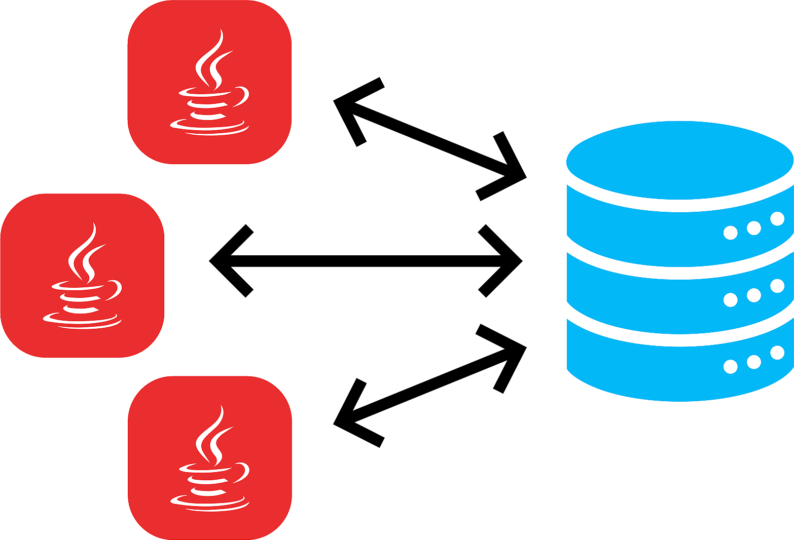

Hoy en día, la mayoría de aplicaciones informáticas necesitan almacenar y gestionar gran cantidad de datos.

Esos datos, se suelen guardar en **bases de datos relacionales**, ya que éstas son las más extendidas actualmente.

Las bases de datos relacionales permiten organizar los datos en **tablas** y esas tablas y datos se relacionan mediante campos clave. Además se trabaja con el lenguaje estándar conocido como **SQL**, para poder realizar las consultas que deseemos a la base de datos.


> 📝 **Base de datos relacional**
>
> Una base de datos relacional se puede definir de una manera simple como aquella que presenta la información en tablas con filas y columnas.


Una tabla es una serie de **filas** y **columnas** , en la que cada fila es un **registro** y cada columna es un **campo**. Un campo representa un dato de los elementos almacenados en la tabla (*NSS*, *nombre*, *etc*.). Cada registro representa un elemento de la tabla (la persona *Jose*, la persona *Carmen*, etc.)

No se permite que pueda aparecer dos o más veces el mismo registro, por lo que uno o más campos de la tabla forman lo que se conoce como **clave primaria** (atributo que se elige como identificador en una tabla, de manera que no haya dos registros iguales, sino que se diferencien al menos en esa clave). Por ejemplo, en el caso de una tabla que guarda datos de personas, el número de la seguridad social, podría elegirse como clave primaria, pues sabemos que aunque haya dos personas llamadas, por ejemplo, Juan Pérez Pérez, estamos seguros de que su número de seguridad social será distinto).

El sistema gestor de bases de datos, en inglés conocido como: **Database Management System** (**DBMS**) , gestiona el modo en que los datos se almacenan, mantienen y recuperan.

En el caso de una base de datos relacional, el sistema gestor de base de datos se denomina: **Relational Database Management System** (**RDBMS**).

Tradicionalmente, la programación de bases de datos ha sido como una Torre de Babel: gran cantidad de productos de bases de datos en el mercado, y cada uno “hablando” en su lenguaje privado con las aplicaciones.

Java, mediante **JDBC** (*Java Database Connectivity*, API que permite la ejecución de operaciones sobre bases de datos desde el lenguaje de programación Java, independientemente del sistema operativo donde se ejecute o de la base de datos a la cual se accede), permite simplificar el acceso a base de datos , proporcionando un lenguaje mediante el cual las aplicaciones pueden comunicarse con motores de bases de datos. Sun desarrolló este API para el acceso a bases de datos, con tres objetivos principales en mente:

- Ser un API con soporte de SQL: poder construir sentencias SQL e insertarlas dentro de llamadas al API de Java,
- Aprovechar la experiencia de los APIs de bases de datos existentes,
- Ser sencillo.


> 📝 **Qué es una API**
>
> **API**: *Application Programming Interface* (Interfaz de Programación de Aplicaciones). Conjunto de reglas y protocolos que permite a diferentes aplicaciones o sistemas comunicarse entre sí. En pocas palabras, actúa como un intermediario que permite que dos programas informáticos se comuniquen y compartan datos entre ellos de manera segura y eficiente. Las APIs se utilizan comúnmente en el desarrollo de software para permitir la integración de diferentes sistemas, la creación de aplicaciones de terceros y la automatización de procesos.  
>
> Un ejemplo sencillo de API podría ser el servicio de pronóstico del tiempo proporcionado por una compañía meteorológica. Imagina que tienes una aplicación de clima en tu teléfono. Esta aplicación necesita mostrar el pronóstico del tiempo actualizado, pero no tiene la capacidad de predecir el clima por sí misma.  
>
> En lugar de eso, la aplicación utiliza una API proporcionada por una empresa meteorológica. Esta API permite que la aplicación envíe una solicitud con la ubicación actual del usuario y, a cambio, recibe datos sobre el clima en esa ubicación. La API proporciona estos datos en un formato estructurado, como JSON o XML, que la aplicación puede interpretar y mostrar de manera comprensible para el usuario.  
>
> En resumen, la aplicación de clima utiliza la API de la empresa meteorológica para obtener datos actualizados sobre el pronóstico del tiempo sin tener que desarrollar su propio sistema de predicción meteorológica. La API actúa como un puente entre la aplicación y los recursos de la compañía meteorológica, permitiendo que la aplicación acceda y utilice esos recursos de manera fácil y eficiente.


## 1. Conexión a las BBDD: conectores

Dejemos de momento de lado el desfase Objeto-Relacional y centrémonos ahora en el acceso a Base de Datos Relacionales desde los lenguajes de programación. Lo razonaremos en general y lo aplicaremos a Java.

Desde la década de los 80 que existen a pleno rendimiento las bases de datos relacionales. Casi todos los Sistemas Gestores de Bases de Datos (excepto los más pequeños como *Access* o *Base* de LibreOffice) utilizan la arquitectura cliente-servidor. Esto significa que hay un ordenador central donde está instalado el Sistema Gestor de Bases de Datos Relacional que actúa como servidor, y habrá muchos clientes que se conectarán al servidor haciendo peticiones sobre la Base de Datos.

Los Sistemas Gestores de Bases de Datos inicialmente disponían de lenguajes de programación propios para poder hacer los accesos desde los clientes. Era muy consistente, pero a base de ser muy poco operativo:

- La empresa desarrolladora del SGBD debían mantener un lenguaje de programación, que resultaba necesariamente muy costoso, si no querían que quedara desfasado.
- Las empresas usuarias del SGBD, que se conectaban como clientes, se encontraban muy ligadas al servidor para tener que utilizar el lenguaje de programación para acceder al servidor, lo que no siempre se ajustaba a sus necesidades. Además, el plantearse cambiar de servidor, significaba que había que rehacer todos los programas, y por tanto una tarea de muchísima envergadura.

Para poder ser más operativos, había que desvincular los lenguajes de programación de los Sistemas Gestores de Bases de Datos utilizando unos estándares de conexión.


---


# 7.2 JDBC

Java puede conectarse con distintos SGBD y en diferentes sistemas operativos. Independientemente del método en que se almacenen los datos debe existir siempre un **mediador** entre la aplicación y el sistema de base de datos y en Java esa función la realiza **JDBC**.


> 📝 **El API JDBC**
>
> Para la conexión a las bases de datos utilizaremos el API estándar de JAVA denominada **JDBC** (*Java Data Base Connectivity*).


JDBC es un API incluido dentro del lenguaje Java para el acceso a bases de datos. Consiste en un conjunto de clases e interfaces escritas en Java que ofrecen un completo API para la programación con bases de datos, por lo tanto es la única solución 100% Java que permite el acceso a bases de datos.

JDBC es una especificación formada por una colección de interfaces y clases abstractas, que todos los fabricantes de drivers deben implementar si quieren realizar una implementación de su driver 100% Java y compatible con JDBC (JDBC-compliant driver). Debido a que JDBC está escrito completamente en Java también posee la ventaja de ser independiente de la plataforma.


> 📝 **A tener en cuenta**
>
> No será necesario escribir un programa para cada tipo de base de datos, una misma aplicación escrita utilizando JDBC podrá manejar bases de datos Oracle, Sybase, SQL Server, etc.


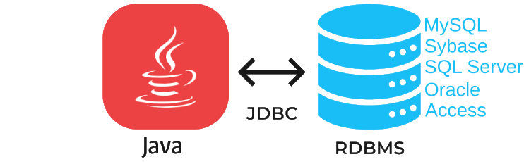

Además podrá ejecutarse en cualquier sistema operativo que posea una Máquina Virtual de Java, es decir, serán aplicaciones completamente independientes de la plataforma. Otras APIS que se suelen utilizar bastante para el acceso a bases de datos son DAO (Data Access Objects) y RDO (Remote Data Objects), y ADO (ActiveX Data Objects), pero el problema que ofrecen estas soluciones es que sólo son para plataformas Windows.

JDBC tiene sus clases en el paquete *java.sql* y otras extensiones en el paquete *javax.sql*.

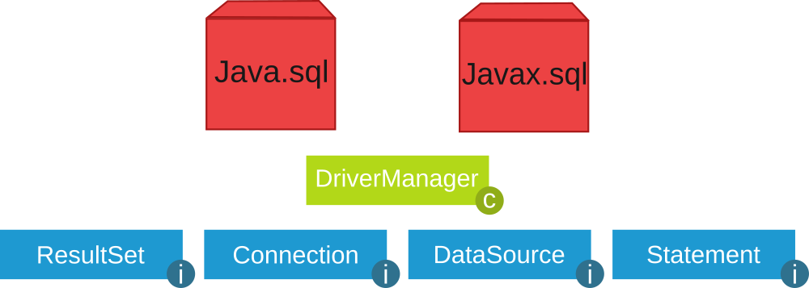

## 1. Funciones del JDBC

Básicamente el API JDBC hace posible la realización de las siguientes tareas:

- Establecer una conexión con una base de datos.
- Enviar sentencias SQL.
- Manipular datos.
- Procesar los resultados de la ejecución de las sentencias.

## 2. Drivers JDBC

Los drivers nos permiten conectarnos con una base de datos determinada. Existen **cuatro tipos de drivers JDBC**, cada tipo presenta una filosofía de trabajo diferente. A continuación se pasa a comentar cada uno de los drivers:

- **JDBC-ODBC bridge plus ODBC driver** (tipo 1): permite al programador acceder a fuentes de  datos ODBC existentes mediante JDBC. El JDBC-ODBC Bridge (puente JDBC-ODBC) implementa operaciones JDBC traduciéndolas a operaciones ODBC, se encuentra dentro del paquete *sun.jdbc.odbc* y contiene librerías nativas para acceder a ODBC.

Al ser usuario de ODBC depende de las dll de ODBC y eso limita la cantidad de plataformas en donde se puede ejecutar la aplicación.

- **Native-API partly-Java driver** (tipo 2): son similares a los drivers de tipo1, en tanto en cuanto  también necesitan una configuración en la máquina cliente. Este tipo de driver convierte llamadas JDBC a llamadas de Oracle, Sybase, Informix, DB2 u otros SGBD. Tampoco se pueden utilizar dentro de applets al poseer código nativo.
- **JDBC-Net pure Java driver** (tipo 3): Estos controladores están escritos en Java y se encargan de convertir las llamadas JDBC a un protocolo independiente de la base de datos y en la aplicación servidora utilizan las funciones nativas del sistema de gestión de base de datos mediante el uso de una biblioteca JDBC en el servidor. La ventaja de esta opción es la portabilidad.
- **JDBC de Java cliente** (tipo 4): Estos controladores están escritos en Java y se encargan de convertir las llamadas JDBC a un protocolo independiente de la base de datos y en la aplicación servidora utilizan las funciones nativas del sistema de gestión de base de datos sin necesidad de bibliotecas. La ventaja de esta opción es la portabilidad. Son como los drivers de *tipo 3* pero sin la figura del intermediario y tampoco requieren ninguna configuración en la máquina cliente. Los drivers de *tipo 4* se pueden utilizar para servidores Web de tamaño pequeño y medio, así como para intranets.

## 3. Instalación controlador MySql

1) El primer paso es descargar desde [https://www.mysql.com/products/connector/](https://www.mysql.com/products/connector/) el conector apropiado.

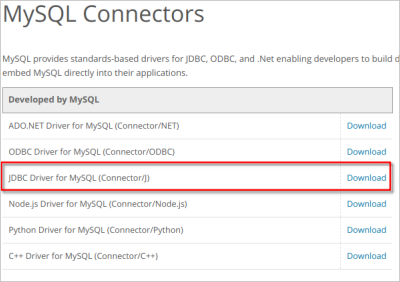

2) Elegir Sistema Operativo y versión (*Para Windows: Platform Independent en ZIP*):

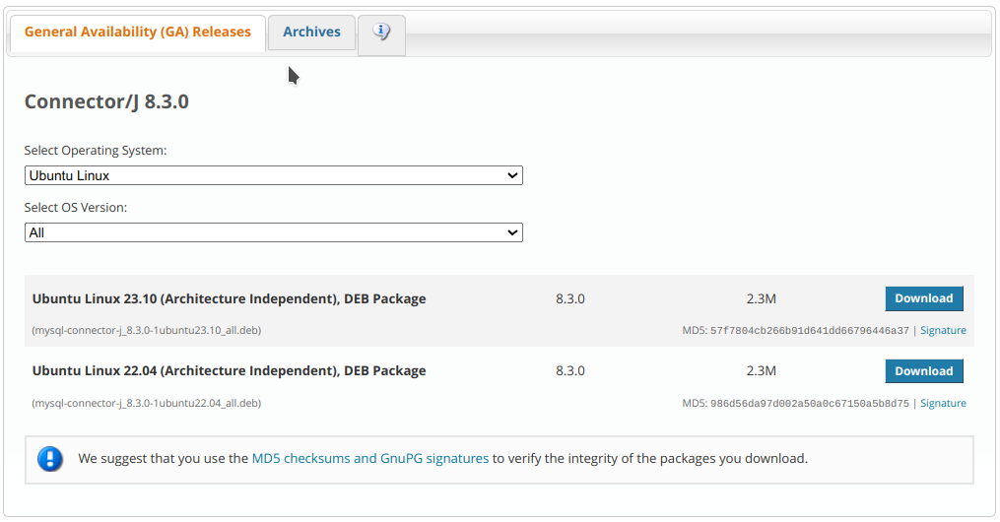

3) Haz clic en **Donwload** y selecciona la opción: **No thanks, just start download**

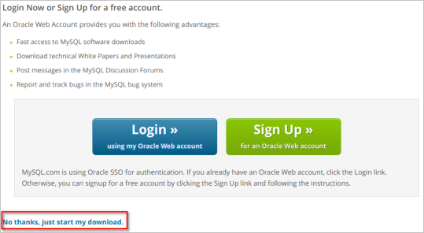

4) Ejecuta el fichero *deb* (en el caso de *Ubuntu*) descargado (**No necesario en Windows**):


5) Ahora deberemos añadir la librería *JDBC* a nuestro proyecto. Para ello copia el archivo `mysql-connector-java-x.x.x.jar` (en Ubuntu se encuentra en la ruta  `/usr/share/java`) en *JAVA PROJECTS -> Referenced Libraries* de *VS Code*:

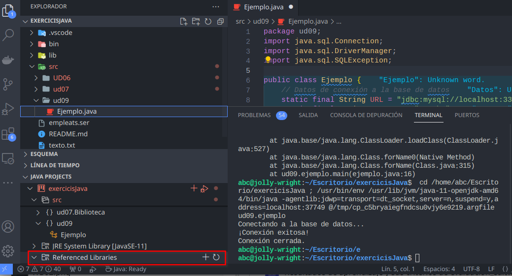

## 4. Carga del controlador JDBC y conexión con la BD

El primer paso para conectarnos a una base de datos mediante JDBC es cargar el controlador apropiado. Estos controladores se distribuyen en un archivo `.jar` que provee el fabricante del SGBD y deben estar accesibles por la aplicación.

Para cargar el controlador se usan las siguientes sentencias:

```java
// clase ConnectToMySql.java
import java.sql.*;

public class ConnectToMySql {
    // JDBC URL, usuario y contraseña de la base de datos  
    private static final String JDBC_URL = "jdbc:mysql://localhost:3306/prueba";
    private static final String USUARIO = "prueba";
    private static final String CONTRASEÑA = "1234";

    public static void main(String[] args) {
        try {
        // Dependiendo de a qué tipo de SGBD queramos conectar cargaremos un controlador u otro

            // Paso 1: Cargar el controlador JDBC de MySQL
            Class<?> c = Class.forName("com.mysql.cj.jdbc.Driver");
            System.out.println("Cargado: " + c.getName());

            //Definir la url de conexión y los parámetros de usuario y contraseña
            // Paso 2: Establecer la conexión con la base de datos
            Connection conexion = DriverManager.getConnection(JDBC_URL, USUARIO, CONTRASEÑA);   
            System.out.println("Conexión completada");

            // Paso 3: Aquí puedes realizar operaciones en la base de datos
            // ...

            // Paso 4: Cerrar la conexión
            conexion.close();
            System.out.println("Conexión cerrada correctamente.");

        } catch (ClassNotFoundException cnfe) {
            System.out.println("ERROR al no encontrarse la clase controlador JDBC: " + cnfe.getMessage());
        } catch (SQLException ex) {
            System.out.println("ERROR al conectar: " + ex.getMessage());
        }
    }
}
```

Observamos las siguientes cuestiones:

- Como ya hemos comentado alguna vez, la sentencia `Class.forName()` no sería necesaria en muchas aplicaciones. Pero nos asegura que hemos cargado el driver, y por tanto el `DriverManager` la sabrá manejar.
- El `DriverManager` es capaz de encontrar el driver adecuado a través de la url proporcionada (sobre todo si el driver está cargado en memoria), y es quien nos proporciona el objeto `Connection` por medio del método `getConnection()`. Existe otra forma de obtener el `Connection` por medio del objeto `Driver`, como veremos más adelante, pero también será pasando indirectamente por `DriverManager`.
- Si no se encuentra la clase del driver (por no tenerlo en las librerías del proyecto, o haber escrito mal su nombre) se producirá la excepción `ClassNotFoundException`. Es conveniente tratarla con `try ... catch`.
- Si no se puede establecer la conexión por alguna razón se producirá la excepción `SQLException`. Al igual que en el caso anterior, es conveniente tratarla con `try ... catch`.
- El objeto `Connection` mantendrá una conexión con la Base de Datos desde el momento de la creación hasta el momento de cerrarla con `close()`. Es muy importante cerrar la conexión, no sólo para liberar la memoria de nuestro ordenador (que al cerrar la aplicación liberaría), sino sobre todo para cerrar la sesión abierta en el Servidor de Bases de Datos.

### 4.1. Conexión alternativa mediante `Driver`

Una manera de conectar alternativa a las anteriores es utilizando el objeto `Driver`. La clase `java.sql.Driver` pertenece a la **API JDBC**, pero no es instanciable, y tan sólo es una interfaz, para que las clases `Driver` de los contenedores hereden de ella e implementen la manera exacta de acceder al SGBD correspondiente. Como no es instanciable (no podemos hacer `new Driver()`) la manera de crearlo es a través del método `getDriver()` del `DriverManager`, que seleccionará el driver adecuado a partir de la url. Ya sólo quedarán definir algunas propiedades, como el usuario y la contraseña, y obtener el `Connection` por medio del método `connect()`

La manera de conectar a través de un objeto `Driver` es más larga, pero más completa ya que se podrían especificar más cosas. Y quizás ayude a entender el montaje de los controladores de los diferentes SGBD en Java.

```java
import java.sql.Connection;
import java.sql.Driver;
import java.sql.DriverManager;
import java.sql.SQLException;
import java.util.Properties;

public class ConnectToMySqlDriver {
    // JDBC URL, usuario y contraseña de la base de datos  
    private static final String JDBC_URL = "jdbc:mysql://localhost:3306/prueba";
    private static final String USUARIO = "prueba";
    private static final String CONTRASEÑA = "1234";

    public static void main(String[] args)  {
        try{
            Driver driver = DriverManager.getDriver(JDBC_URL);

            Properties properties = new Properties();
            properties.setProperty("user", USUARIO);
            properties.setProperty("password", CONTRASEÑA);

            Connection conexion = driver.connect(JDBC_URL, properties);
            System.out.println("Conexión completada a través de Driver");

            // Cerrar la conexión
            conexion.close();
            System.out.println("Conexión cerrada correctamente.");
        } catch (SQLException ex) {
            System.out.println("ERROR al conectar: " + ex.getMessage());
        }
    }
}
```

## 5. Carga del controlador y de la conexión mediante el patrón Singleton

Este patrón de diseño está diseñado para restringir la creación de objetos pertenecientes a una clase.


> 📝 **El sino de Singleton**
>
> Su intención consiste en **garantizar que una clase sólo tenga una instancia** y proporcionar un punto de acceso global a ella. 
>
> El patrón `Singleton` se implementa creando en nuestra clase un método que crea una instancia del objeto sólo si todavía no existe alguna.


Para asegurar que la clase no puede ser instanciada nuevamente se regula el alcance del constructor haciéndolo privado. Las situaciones más habituales de aplicación de este patrón son aquellas en las que dicha clase ofrece un conjunto de utilidades comunes para todas las capas (como puede ser *el sistema de log*, *conexión a la base de datos*, …) o cuando cierto tipo de datos debe estar disponible para todos los demás objetos de la aplicación (en java no hay variables globales) El patrón *Singleton* provee una única instancia global gracias a que:

- La propia clase es responsable de crear la única instancia.
- Permite el acceso global a dicha instancia mediante un método de clase.
- Declara el constructor de clase como privado para que no sea instanciable directamente.

```java
/**
 @see https://stackoverflow.com/questions/6567839/if-i-use-a-singleton-class-for-a-database-connection-can-one-user-close-the-con
 Patron Singleton
 */
public class DatabaseConnection {
    // JDBC URL, usuario y contraseña de la base de datos  
    private static final String JDBC_URL = "jdbc:mysql://localhost:3306/prueba";
    private static final String USUARIO = "prueba";
    private static final String CONTRASEÑA = "1234";

    private static DatabaseConnection dbInstance; //Variable para almacenar la unica instancia de la clase
    private static java.sql.Connection conexion;

    private DatabaseConnection() {
        // El Constructor es privado!!
    }

    public static DatabaseConnection getInstance(){
        //Si no hay ninguna instancia...
        if(dbInstance == null){
            dbInstance = new DatabaseConnection();
        }
        return dbInstance;
    }

    public static java.sql.Connection getConnection(){
        if(conexion == null){
            try {
                conexion = java.sql.DriverManager.getConnection(JDBC_URL, USUARIO, CONTRASEÑA);
                System.out.println("Conexión realizada");

            } catch (java.sql.SQLException ex) {
                System.out.println("ERROR al conectar: " + ex.getMessage());
            }
        }
        return conexion;
    }
}
```

Para probar el patrón Singleton creamos, en la aplicación **[BlueJ](https://es.wikipedia.org/wiki/BlueJ)**, el siguiente ejemplo:

( 1 ) Se añaden las librerías desde *Herramientas -> Preferencias -> Librerías*

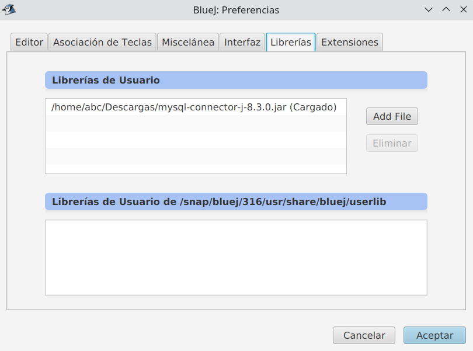

( 2 ) Creamos una nueva clase `DatabaseConnection` (añadir el código anterior) en *BlueJ*:

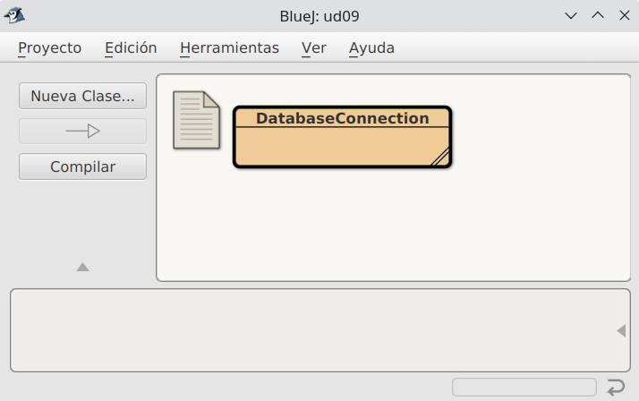

( 3 ) Vamos a crear una nueva clase `Test` para probar la conexión:

```java
import java.sql.*;
public class Test {
    static java.sql.Connection con = DatabaseConnection.getInstance().getConnection();
    public Test(){
        //De momento no hace nada
    }
}
```

  ( 4 ) Unir la clase Test con la clase DatabaseConnection.

( 5 ) Compilar ambas clases:

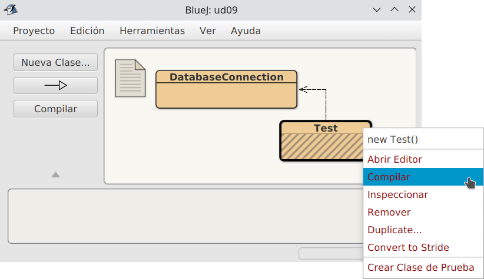

( 6 ) Lanzar varios test (para comprobar la única conexión a establecida):

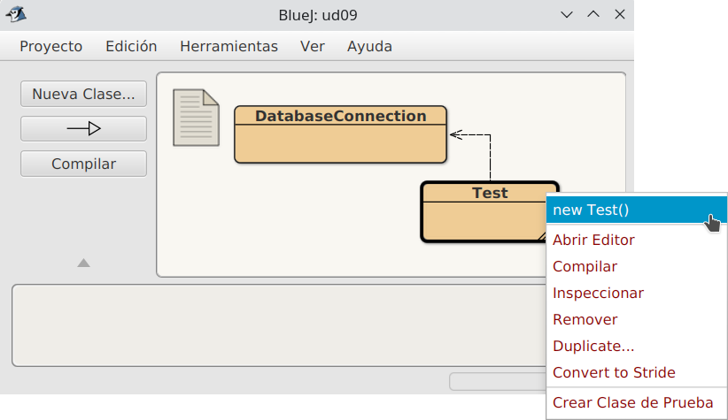

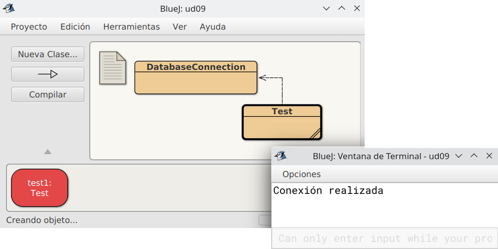


---


# 7.3 Acceso a BBDD

## 1. Cargar el Driver

En un proyecto Java que realice conexiones a bases de datos es necesario, antes que nada, utilizar `Class.forname(…).newInstance()` para cargar dinámicamente el Driver que vamos a utilizar. Esto solo es necesario hacerlo una vez en nuestro programa. Puede lanzar excepciones por lo que es necesario utilizar un bloque *try-catch*.

```java
try {
    Class.forName("com.mysql.cj.jdbc.Driver").newInstance();    

} catch (Exception e) {
    // manejamos el error
}
```

Hay que tener en cuenta que las clases y métodos utilizados para conectarse a una base de datos (explicados más adelante) funcionan con todos los drivers disponibles para Java (JDBC es solo uno, hay muchos más). Esto es posible ya que el estándar de Java solo los define como interfaces (*interface*) y cada librería driver los implementa (define las clases y su código). Por ello es necesario utilizar `Class.forName(…)` para indicarle a Java qué driver vamos a utilizar.

Este nivel de asbtracción facilita el desarrollo de proyectos ya que si necesitáramos utilizar otro sistema de base de datos (que no fuera *MySQL*) solo necesitaríamos cambiar la línea de código que carga el driver y poco más. Si cada sistema de base de datos necesitara que utilizáramos distintas clases y métodos todo sería mucho más complicado.

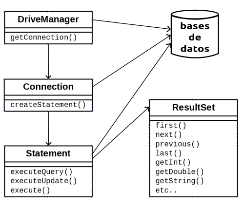

Las cuatro clases fundamentales que toda aplicación Java necesita para conectarse a una base de datos y ejecutar sentencias son: **`DriverManager`**, **`Connection`**, **`Statement`** y **`ResultSet`**.

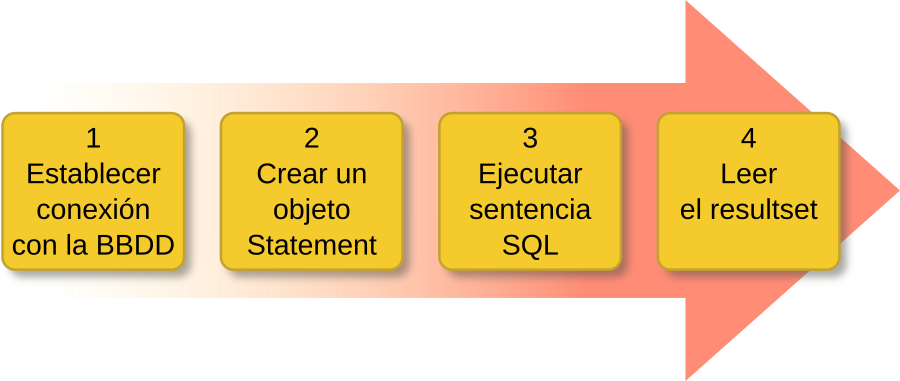

## 2. Clase `DriverManager`

**Paso 1: Establecer conexión con la BBDD**


> 📝 **Ejemplo de conexión según SGBD**

```java
/* Para MySQL:
    jdbc  --> driver
    mysql --> protocolo driver
    localhost:3306/gestionPedidos --> detalles de la conexión
*/
jdbc:mysql://localhost:3306/gestionPedidos

jdbc:odbc:DSN_gestionPedidos                  // para SQL Server

jdbc:oracle:juan@servidor:3306:gestionPedidos // para Oracle
```


Vamos a necesitar información adicional como son los datos de *usuario* y *contraseña*.

La clase **java.sql.DriverManager** es la capa gestora del driver JDBC. Se encarga de manejar el Driver apropiado y **permite crear conexiones con una base de datos** mediante el método estático **`getConnection()`** que tiene dos variantes:

```java
DriveManager.getConnection(String url)
// y
DriveManager.getConnection(String url, String user, String password)
```

Este método intentará establecer una conexión con la base de datos según la *URL* indicada. Opcionalmente se le puede pasar el *usuario* y *contraseña* como argumento (también se puede indicar en la propia *URL*). Si la conexión es satisfactoria devolverá un objeto **Connection**.


<details markdown="1">
<summary><strong>☕ Ejemplo de conexión a la base de datos prueba en localhost</strong></summary>

```java
String url = "jdbc:mysql://localhost:3306/prueba";
Connection conexion = DriverManager.getConnection(url,"root","");
```

</details>


Este método puede lanzar dos tipos de excepciones (que habrá que manejar con un *try-catch*):

- **SQLException**: la conexión no ha podido producirse. Puede ser por multitud de motivos como una URL mal formada, un error en la red, host o puerto incorrecto, base de datos no existente, usuario y contraseña no válidos, etc.
- **SQLTimeoutException**: se ha superado el *LoginTimeout* sin recibir respuesta del servidor.

## 3. Clase `Connection`

**Paso 2. Crear un objeto Statement**

Un objeto **java.sql.Connection representa una** **sesión de** **conexión con una base de datos**. Una aplicación puede tener tantas conexiones como necesite, ya sea con una o varias bases de datos.

El método más relevante es **`createStatement()`** que devuelve un objeto *Statement* asociado a dicha conexión que permite ejecutar sentencias SQL.

El método *createStatement()* también puede lanzar excepciones de tipo **SQLException**.

```java
Statement st = conexion.createStatement();
```

Cuando ya no la necesitemos es aconsejable **cerrar** **la conexión con `close()`** para liberar recursos:

```java
conexion.close();
```

## 4. Clase `Statement`

**Paso 3. Ejecutar sentencia SQL**

Un objeto **java.sql.Statement** permite **ejecutar** **sentencias SQL** **en** **la base de datos** a través de la conexión con la que se creó el *Statement* (ver *Paso 2*). Los tres métodos más comunes de ejecución de sentencias SQL son `executeQuery(…)`, `executeUpdate(…)` y `execute(…)`.

Estos tres métodos pueden lanzar excepciones de tipo **SQLException** y **SQLTimeoutException**.

- **`ResultSet executeQuery(String sql)`**: ejecuta la sentencia sql indicada (de tipo *SELECT*). Devuelve un objeto *ResultSet* con los datos proporcionados por el servidor.

```java
ResultSet rs = st.executeQuery("SELECT * FROM vendedores");
```

- **`int executeUpdate(String sql)`**: ejecuta la sentencia sql indicada (de tipo *DML* como por ejemplo *INSERT*, *UPDATE* o *DELETE*).  Devuelve un número de registros que han sido insertados, modificados o eliminados.

```java
int nr = st.executeUpdate ("INSERT INTO vendedores VALUES (1,'Pedro Gil', '2017-04-11', 15000);")
```

Cuando ya no lo necesitemos es aconsejable **cerrar el *statement* con `close()`** para liberar recursos:

```java
 st.close();
```


> 📝 **Nota**
>
> Podríamos decir que este *resultset* es una especie de *tabla virtual* que se almacena en memoria con la información en su interior.


## 5. Clase `ResultSet`

**Paso 4. Leer el resultset**

Un objeto **java.sql.ResultSet** contiene un conjunto de resultados (datos) obtenidos tras ejecutar una sentencia SQL, normalmente de tipo SELECT. Es una **estructura de datos en forma de tabla** con **registros (filas)** que podemos recorrer para acceder a la información de sus **campos (columnas)**.

*ResultSet* utiliza internamente un cursor que apunta al *registro actual* sobre el que podemos operar. Inicialmente dicho cursor está situado antes de la primera fila y disponemos de varios métodos para desplazar el cursor. El más común es **`next()`**:

- **`boolean next()`**: mueve el cursor al siguiente registro. Devuelve *true* si fue posible y *false* en caso contrario (si ya llegamos al final de la tabla).

Algunos de los métodos para obtener los datos del registro actual son:

- **`String getString(String columnLabel)`**: devuelve un dato *String* de la columna indicada por su nombre.


<details markdown="1">
<summary><strong>☕ Por ejemplo</strong></summary>

```java
rs.getString("nombre");
```

</details>


- **`String getString(int columnIndex)`**: devuelve un dato *String* de la columna indicada por su nombre (la primera columna es la 1, no la cero).


<details markdown="1">
<summary><strong>☕ Por ejemplo</strong></summary>

```java
rs.getString(2);
```

</details>


Existen métodos análogos a los anteriores para obtener valores de tipo *int*, *long*, *float*, *double*, *boolean*, *Date*, *Time*, *Array*, etc. Pueden consultarse todos en la [documentación oficial de Java](https://docs.oracle.com/en/java/javase/11/docs/api/java.sql/java/sql/ResultSet.html).

- **`int getInt(String columnLabel)`**
- **`int getInt(int columnIndex)`**
- **`double getDouble(String columnLabel)`**
- **`double getDouble(int columnIndex)`**
- **`boolean getBoolean(String columnLabel)`**
- **`boolean getBoolean(int columnIndex)`**
- **`Date getDate(String columnLabel)`**
- **`Date getDate(int columnIndex)`**
- etc.

Más adelante veremos cómo se realiza la modificación e inserción de datos.

Todos estos métodos pueden lanzar una **SQLException**.


<details markdown="1">
<summary><strong>☕ Ejemplo para recorrer un ResultSet llamado rs y mostrarlo por pantalla</strong></summary>

```java
while(rs.next()) {
    int id = rs.getInt("id");
    String nombre = rs.getString("nombre");
    Date fecha = rs.getDate("fecha_ingreso");
    float salario = rs.getFloat("salario");

    System.out.println(id + " " + nombre + " " + fecha + " " + salario);
}
```

</details>


<details markdown="1">
<summary><strong>✍️ Ejercicio previo: crear base de datos</strong></summary>

Para la realización de los ejercicios deberás crear una base de datos en tu SGBD (MySql) de nombre `pr_tuNombre`.
Para ello deberás de crear un usuario de nombre `pr_tuNombre` con contraseña `1234` y con una base de datos con el mismo nombre:

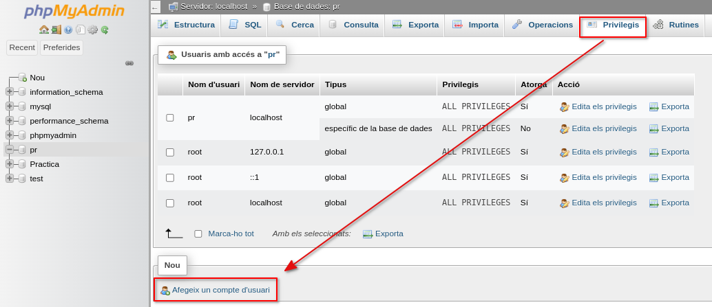
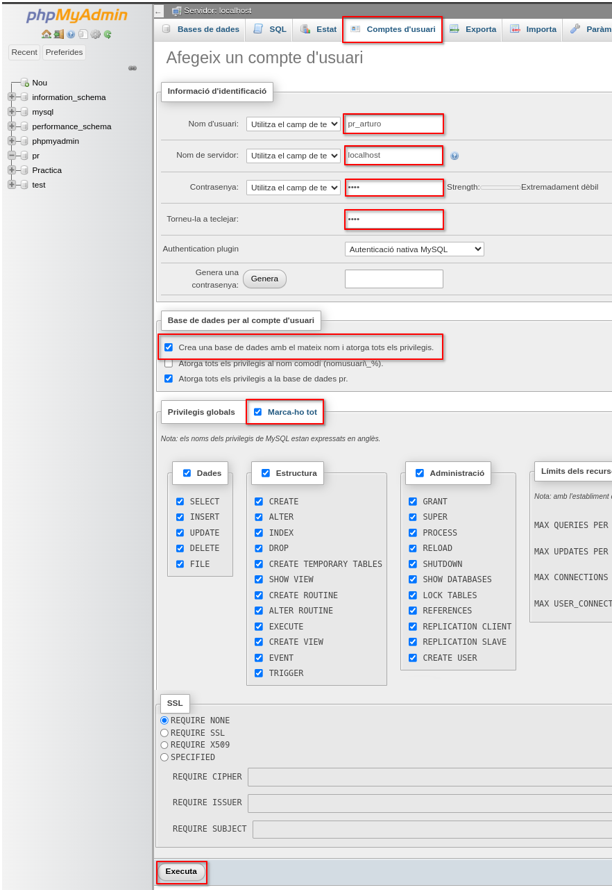

---

Descarga el fichero sql [**tablas.sql**](../../others/code/ut07/tablas.sql) e insértalas en tu base de datos.   

Para ello, ve a la pestaña de phpMyAdmin `Importa`, selecciona el fichero descargado anteriormente y ejecútalo.

</details>


<details markdown="1">
<summary><strong>☕ Ejemplo Connection, Statement y ResultSet</strong></summary>

=== "DbConnect.java"
    ```java
    public class DbConnect {
        // JDBC URL, usuario y contraseña de la base de datos  
        private static final String JDBC_URL = "jdbc:mysql://localhost:3306/pr_ana";
        private static final String USUARIO = "pr_ana";
        private static final String CONTRASEÑA = "1234";

        private static DbConnect dbInstance; //Variable para almacenar la unica instancia de la clase
        private static java.sql.Connection conexion;

        private DbConnect() {
            // El Constructor es privado!!
        }

        public static DbConnect getInstance(){
            //Si no hay ninguna instancia...
            if(dbInstance == null){
                dbInstance = new DbConnect();
            }
            return dbInstance;
        }

        public static java.sql.Connection getConnection(){
            if(conexion == null){
                try {
                    conexion = java.sql.DriverManager.getConnection(JDBC_URL, USUARIO, CONTRASEÑA);
                    System.out.println("Conexión realizada SINGLETON");

                } catch (java.sql.SQLException ex) {
                    System.out.println("ERROR al conectar: " + ex.getMessage());
                }
            }
            return conexion;
        }
    }
    ```

=== "Test.java"
    ```java
    import java.sql.*;

    public class Test {
        public static void main(String[] args) {
            //Paso 1: Crear y almacenar conexión
            DbConnect.getInstance();
            Connection conexion = DbConnect.getConnection();

            try {
                //Paso 2: Crear el statement
                Statement st = conexion.createStatement();

                // Paso 3: Aquí puedes realizar operaciones en la base de datos

                //Insert
                int nr = st.executeUpdate("INSERT INTO alumnos(nombre) VALUES ('Ana Asins');");
                //Update
                nr = st.executeUpdate("UPDATE alumnos SET edad = 28 WHERE nombre = 'Ana Asins';");

                //Select
                ResultSet rs = st.executeQuery("SELECT * FROM alumnos");
                //Recorrer datos devueltos
                while (rs.next()) {
                    String nombre = rs.getString("nombre");
                    int edad = rs.getInt("edad");

                    System.out.println("El alumno " + nombre + " tiene " +edad + " años.");
                }

                // Paso 4: Cerrar la conexión
                st.close();
                conexion.close();
                System.out.println("Conexión cerrada correctamente.");

            } catch (SQLException ex) {
                System.out.println("ERROR al conectar: " + ex.getMessage());
            }         
        }
    }
    ```

</details>


<details markdown="1">
<summary><strong>✍️ Siguiendo el ejemplo anterior...</strong></summary>

Después de esto, crea un ejercicio de nombre `ListarProveedores.java` en el que se liste todos los proveedores.

</details>


---


# 7.4 Navegabilidad y concurrencia

Cuando invocamos a **`createStatement()`** **sin** **argumentos**, como hemos visto anteriormente, al ejecutar sentencias SQL **obtendremos un ResultSet por defecto en el que el cursor solo puede moverse hacia adelante** **y los datos son de solo lectura**. A veces esto no es suficiente y necesitamos mayor funcionalidad.

Por ello el método *createStatement()* está sobrecargado (existen varias versiones de dicho método), lo cual nos permite invocarlo con argumentos en los que podemos especificar el funcionamiento.

- **`Statement createStatement (int resultSetType, int resultSetConcurrency)`**: devuelve un objeto *Statement* cuyos objetos ResultSet serán del tipo y concurrencia especificados. Los valores válidos son constantes definidas en *ResultSet*.

---

Valores válidos para el **argumento resultSetType** (indica el tipo de ResultSet):

- **`ResultSet.TYPE_FORWARD_ONLY`**: *ResultSet* **por defecto**, *forward-only* y *no-actualizable*.
    - Solo permite movimiento hacia delante con `next()`.
    - Sus datos NO se actualizan. Es decir, no reflejará cambios producidos en la base de datos. Contiene una instantánea del momento en el que se realizó la consulta.
- **`ResultSet.TYPE_SCROLL_INSENSITIVE`**: ResultSet *desplazable* y *no-actualizable*.
    - Permite libertad de movimiento del cursor con otros métodos como `first()`, `previous()`, `last()`, etc. además de `next()`.
    - Sus datos NO se actualizan, como en el caso anterior.
- **`ResultSet.TYPE_SCROLL_SENSITIVE`**: ResultSet *desplazable* y *actualizable*.
    - Permite libertad de movimientos del cursor, como en el caso anterior.
    - Sus datos SÍ se actualizan. Es decir, mientras el ResultSet esté abierto se actualizará automáticamente con los cambios producidos en la base de datos. Esto puede suceder incluso mientras se está recorriendo el ResultSet, lo cual puede ser conveniente o contraproducente según el caso.


> 📝 **Diferencia entre ResultSet.TYPE_SCROLL_INSENSITIVE y ResultSet.TYPE_SCROLL_SENSITIVE**
>
> ```java
> import java.sql.*;
> 
> public class EjemploScrollInsensitive {
>     private static final String JDBC_URL = "jdbc:mysql://localhost:3306/pr_tuNombre";
>     private static final String USUARIO = "pr_tuNombre";
>     private static final String PASSWD = "1234";   
> 
>     public static void main(String[] args) {
>         try (Connection con = DriverManager.getConnection(JDBC_URL, USUARIO, PASSWD);
>             Statement stmt = con.createStatement(ResultSet.TYPE_SCROLL_INSENSITIVE, ResultSet.CONCUR_READ_ONLY);
>             ResultSet rs = stmt.executeQuery("SELECT id, nombre FROM usuarios")) {
> 
>             // Mover a la primera fila
>             if (rs.first()) {
>                 System.out.println("primera fila: " + rs.getInt("id") + ", " + rs.getString("nombre"));
>             }
> 
>             // Mover a la última fila
>             if (rs.last()) {
>                 System.out.println("última fila: " + rs.getInt("id") + ", " + rs.getString("nombre"));
>             }
> 
>             // Simulamos un retraso y actualizamos la base de datos (en otra sesión)
>             System.out.println("Esperando las actualizaciones...");
>             Thread.sleep(10000); // Esperar 10 segundos
> 
>             // Mover a la primera fila otra vez
>             if (rs.first()) {
>                 System.out.println("primera fila después de esperar: " + rs.getInt("id") + ", " + rs.getString("nombre"));
>             }
> 
>         } catch (SQLException | InterruptedException ex) {
>             ex.printStackTrace();
>         }
>     }
> }
> ```
>
> En este ejemplo, incluso si la base de datos cambia mientras el programa está esperando (durante el `Thread.sleep(10000)`), el ResultSet no reflejará esos cambios cuando se vuelva a consultar la primera fila.  
>
> En caso de cambiar el valor `ResultSet.TYPE_SCROLL_INSENSITIVE` por `ResultSet.TYPE_SCROLL_SENSITIVE`, si hay cambios en la base de datos durante el tiempo de espera, el ResultSet reflejará esos cambios cuando se vuelva a consultar la primera fila. Por ejemplo, si se actualiza el nombre del primer registro en la base de datos mientras el programa espera, el nuevo nombre aparecerá en la salida.  
>
> Estos ejemplos demuestran cómo ResultSet.TYPE_SCROLL_INSENSITIVE no refleja cambios en la base de datos después de su creación, mientras que ResultSet.TYPE_SCROLL_SENSITIVE sí lo hace.
>
> ---


Valores válidos para el **argumento** **resultSet.Concurrency** (indica la concurrencia del ResultSet):

- **`ResultSet.CONCUR_READ_ONLY`**: solo lectura. Es el **valor por defecto**.
- **`ResultSet.CONCUR_UPDATABLE`**: permite modificar los datos almacenados en el ResultSet para luego aplicar los cambios sobre la base de datos (puedes insertar, actualizar y borrar filas). Más adelante se verá cómo).


> 📝 **A tener en cuenta**
>
> El *ResultSet* por defecto que se obtiene con *createStatement()* sin argumentos es el mismo que con *createStatement(ResultSet.TYPE_FORWARD_ONLY, ResultSet.CONCUR_READ_ONLY)*.


---


# 7.5 Consultas (Query)

## 1. Navegación de un `ResultSet`

Como ya se ha visto, en un objeto *ResultSet* se encuentran los resultados de la ejecución de una sentencia SQL. Por lo tanto, un objeto *ResultSet* contiene las filas que satisfacen las condiciones de una sentencia SQL, y ofrece métodos de navegación por los registros como `next()` que desplaza el cursos al siguiente registro del *ResultSet*.

Además de este método de desplazamiento básico, existen otros de desplazamiento libre que podremos utilizar siempre y cuando el *ResultSet* sea de tipo `ResultSet.TYPE_SCROLL_INSENSITIVE` o `ResultSet.TYPE_SCROLL_SENSITIVE` como se ha dicho antes.

Algunos de estos métodos son:

- **`void beforeFirst()`**: mueve el cursor antes de la primera fila.
- **`boolean first()`**: mueve el cursor a la primera fila.
- **`boolean next()`**: mueve el cursor a la siguiente fila. Permitido en todos los tipos de ResultSet.
- **`boolean previous()`**: mueve el cursor a la fila anterior.
- **`boolean last()`**: mueve el cursor a la última fila.
- **`void afterLast()`**: mover el cursor después de la última fila.
- **`boolean absolute(int row)`**: posiciona el cursor en el número de registro indicado. Hay que tener en cuenta que el primer registro es el 1, no el cero.


<details markdown="1">
<summary><strong>☕ Ejemplo absolute(n)</strong></summary>

`absolute(7)` desplazará el cursor al séptimo registro. Si  valor es negativo se posiciona en el número de registro indicado pero empezando a contar desde el final (el último es el -1). Por ejemplo si tiene 10 registros y llamamos `absolute(-2)` se desplazará al registro número 9.

</details>


- **`boolean relative(int registros)`**: desplaza el cursor un número relativo de registros, que puede ser positivo o negativo.


<details markdown="1">
<summary><strong>☕ Ejemplo relative(n)</strong></summary>

Si el cursor está en el registro 5 y llamamos a `relative(10)` se desplazará al registro número 15. Si luego llamamos a `relative(-4)` se desplazará al registro 11.

</details>


Los métodos que devuelven un tipo boolean devolverán *true* si ha sido posible mover el cursor a un registro válido, y *false* en caso contrario, por ejemplo si no tiene ningún registro o hemos saltado a un número de registro que no existe.

Todos estos métodos pueden producir una excepción de tipo *SQLException*.

También existen otros métodos relacionados con la posición del cursor.

- **`int getRow()`**: devuelve el número de registro actual. Cero si no hay registro actual.
- **`boolean isBeforeFirst()`**: devuelve *true* si el cursor está antes del primer registro.
- **`boolean isFirst()`**: devuelve *true* si el cursor está en el primer registro.
- **`boolean isLast()`**: devuelve *true* si el cursor está en el último registro.
- **`boolean isAfterLast()`**: devuelve *true* si el cursor está después del último registro.

## 2. Obteniendo datos del `ResultSet`

Los métodos *getXXX()* ofrecen los medios para recuperar los valores de las columnas (campos) de la fila (registro) actual del *ResultSet*. No es necesario que las columnas sean obtenidas utilizando un orden determinado.

Para designar una columna podemos utilizar su nombre o bien su número (empezando por 1).

Por ejemplo si la segunda columna de un objeto *ResultSet* se llama *título* y almacena datos de tipo *String*, se podrá recuperar su valor de las dos formas siguientes:

```java
// rs es un objeto ResultSet
String valor = rs.getString(2);
String valor = rs.getString("titulo");
```


> ⚠️ **Importante**
>
> Es importante tener en cuenta que las columnas se numeran de izquierda a derecha y que la primera es la número 1, no la cero.  
> También que las columnas no son case sensitive, es decir, no distinguen entre mayúsculas y minúsculas.


> 📝 **A tener en cuenta**
>
> La información referente a las columnas de un ResultSet se puede obtener llamando al **método getMetaData()** que devolverá un objeto *ResultSetMetaData* que contendrá el número, tipo y propiedades de las columnas del *ResultSet*.
> EJEMPLO:
>
> ```java
> import java.sql.*;
> 
> public class EjemploResultSetMetaData {
>     private static final String JDBC_URL = "jdbc:mysql://localhost:3306/pr_tuNombre";
>     private static final String USUARIO = "pr_tuNombre";
>     private static final String PASSWD = "1234";
> 
>     public static void main(String[] args) {
>         try (Connection con = DriverManager.getConnection(JDBC_URL, USUARIO, PASSWD);
>              Statement stmt = con.createStatement();
>              ResultSet rs = stmt.executeQuery("SELECT id, nombre, fecha_ingreso, salario FROM proveedores")) {
> 
>             // Obtener metadata del ResulSet
>             ResultSetMetaData rsmd = rs.getMetaData();
> 
>             // Obtener el número de columnas
>             int columnCount = rsmd.getColumnCount();
>             System.out.println("Número de columnas: " + columnCount);
> 
>             // Listar las columnas de detalles
>             for (int i = 1; i <= columnCount; i++) {
>                 String columnName = rsmd.getColumnName(i);
>                 String columnType = rsmd.getColumnTypeName(i);
>                 int columnDisplaySize = rsmd.getColumnDisplaySize(i);
>                 boolean isNullable = rsmd.isNullable(i) == ResultSetMetaData.columnNullable;
> 
>                 System.out.println("Columna " + i + ":");
>                 System.out.println("  Nombre: " + columnName);
>                 System.out.println("  Tipo: " + columnType);
>                 System.out.println("  Tamaño display: " + columnDisplaySize);
>                 System.out.println("  Nullable: " + isNullable);
>             }
> 
>             // Iterar sobre el conjunto de resultados
>             while (rs.next()) {
>                 for (int i = 1; i <= columnCount; i++) {
>                     System.out.print(rs.getString(i) + " ");
>                 }
>                 System.out.println();
>             }
> 
>         } catch (SQLException ex) {
>             System.out.println("Error de SQL: " + ex.getMessage());
>         }
>     }
> }   
> ```


Si conocemos el nombre de una columna, pero no su índice, el método **`findColumn()`** puede ser utilizado para obtener el número de columna, pasándole como argumento un objeto *String* que sea el nombre de la columna correspondiente, este método nos devolverá un entero que será el índice correspondiente a la columna.

## 3. Tipos de datos y conversiones

Cuando se lanza un método *getXXX()* determinado sobre un objeto ResultSet para obtener el valor de un campo del registro actual, el driver JDBC convierte el dato que se quiere recuperar al tipo Java especificado y entonces devuelve un valor Java adecuado. Por ejemplo si utilizamos el método *getString()* y el tipo del dato en la base de datos es *VARCHAR*, el driver JDBC convertirá el dato VARCHAR de tipo SQL a un objeto *String* de Java.

Algo parecido sucede con otros tipos de datos SQL como por ejemplo *DATE*. Podremos acceder a él tanto con *getDate()* como con *getString()*. La diferencia es que el primero devolverá un objeto Java de tipo *Date* y el segundo devolverá un *String*.

Siempre que sea posible el driver JDBC convertirá el tipo de dato almacenado en la base de datos al tipo solicitado por el método *getXXX()*, pero hay conversiones que no se pueden realizar y lanzarán una excepción, como por ejemplo si intentamos hacer un *getInt()* sobre un campo que no contiene un valor numérico.

## 4. Sentencias que no devuelven datos

Las ejecutamos con el método `executeUpdate`. Serán todas las sentencias SQL **excepto el SELECT**, que es la de consulta. Es decir, nos servirá para las siguientes sentencias:

- Sentencias que cambian las estructuras internas de la BD donde se guardan los datos (instrucciones conocidas con las siglas **DDL**, del inglés **Data Definition Language**), como por ejemplo `CREATE TABLE`, `CREATE VIEW`, `ALTER TABLE`, `DROP TABLE`, …,
- Sentencias para otorgar permisos a los usuarios existentes o crear otros nuevos (subgrupo de instrucciones conocidas como **DCL** o **Data Control Language**), como por ejemplo `GRANT`.
- Y también las sentencias para modificar los datos guardados utilizando las instrucciones `INSERT`, `UPDATE` y `DELETE`.

Aunque se trata de sentencias muy dispares, desde el punto de vista de la comunicación con el SGBD se comportan de manera muy similar, siguiendo el siguiente patrón:

1. Instanciación del `Statement` a partir de una conexión activa.
2. Ejecución de una sentencia SQL pasada por parámetro al método `executeUpdate`.
3. Cierre del objeto `Statement` instanciado.

Miremos este ejemplo, en el que vamos a crear una tabla muy sencilla en la Base de Datos MySql/network.


<details markdown="1">
<summary><strong>📝 Aquí tienes la clase DatabaseConnection</strong></summary>

```java
/**
 <br />* Write a description of class DatabaseConnection here.
 <br />*
 <br />* @author (Victor Ponz)
 <br />* @see <a href="https://stackoverflow.com/questions/6567839/if-i-use-a-singleton-class-for-a-database-connection-can-one-user-close-the-con">Stackoverflow Singleton</a>
 <br />* Patron Singleton
 <br />* ================
 <br />* Este patrón de diseño está diseñado para restringir la creación de objetos pertenecientes a una clase. Su intención consiste en garantizar que
 <br />* una clase sólo tenga una instancia y proporcionar un punto de acceso global a ella.
 <br />* El patrón Singleton se implementa creando en nuestra clase un método que crea una instancia del objeto sólo si todavía no existe alguna.
 <br />* Para asegurar que la clase no puede ser instanciada nuevamente se regula el alcance del constructor haciéndolo privado.
 <br />* Las situaciones más habituales de aplicación de este patrón son aquellas en las que dicha clase ofrece un conjunto de utilidades comunes
 <br />* para todas las capas (como puede ser el sistema de log, conexión a la base de datos, ...)
 <br />* o cuando cierto tipo de datos debe estar disponible para todos los demás objetos de la aplicación.
 <br />* El patrón Singleton provee una única instancia global gracias a que:
 <br />* - La propia clase es responsable de crear la única instancia.
 <br />* - Permite el acceso global a dicha instancia mediante un método de clase.
 <br />* - Declara el constructor de clase como privado para que no sea instanciable directamente.
 <br />*/
public class DatabaseConnection {
    private static DatabaseConnection dbInstance; //Variable para almacenar la unica instancia de la clase
    private static java.sql.Connection con;

    private DatabaseConnection() {
        // El Constructor es privado!!
    }

    public static DatabaseConnection getInstance(){
        //Si no hay ninguna instancia...
        if(dbInstance==null){
            dbInstance= new DatabaseConnection();
        }
        return dbInstance;
    }

    public static java.sql.Connection getConnection(){
        if(con == null){
            try {
                String host = "jdbc:mysql://localhost:3306/nombre-de-la-base-de-datos";
                String username = "root";
                String password = "sa";
                con = java.sql.DriverManager.getConnection( host, username, password );
                System.out.println("Conexión realizada");
            } catch (java.sql.SQLException ex) {
                System.out.println("Se ha producido un error al conectar: " + ex.getMessage());
            }
        }
        return con;
    }
}
```

</details>


```java
import java.sql.Connection; 
import java.sql.DriverManager; 
import java.sql.SQLException; 
import java.sql.Statement; 

public class Test {
  static java.sql.Connection con = DatabaseConnection.getInstance().getConnection(); 

  public Test(){ 
      //De momento no hace nada 
  }

  public void createTable() throws SQLException{ 
      Statement st = con.createStatement(); 
      st.executeUpdate("CREATE TABLE T1 (c1 varchar(50))"); 
      st.close(); 
  }
}
```

## 5. Sentencias que devuelven datos

Las ejecutamos con el método `executeQuery`. Servirá para la sentencia **SELECT** (sentencia de consulta). Los datos que nos devuelva esta sentencia las tendremos que guardar en un objeto de la clase `java.sql.ResultSet`, es decir conjunto de resultado. Por lo tanto, la ejecución de las consultas tendrá una forma similar a la siguiente:

```java
ResultSet rs = st.executeQuery(sentenciaSQL);
```

- El objeto `ResultSet` contiene el resultado de la consulta organizado por filas, por lo que en cada momento se puede consultar una fila.
- Para ir visitando todas las filas de una a una, iremos llamando el método `next()` del objeto `ResultSet`, ya que cada vez que se ejecute `next` avanzará a la siguiente fila.
- Inmediatamente después de una ejecución, el `ResultSet` se encuentra posicionado justo antes de la primera fila, por lo tanto para acceder a la primera fila será necesario ejecutar `next` una vez.
- Cuando las filas se acaban, el método `next` devolverá falso.

Desde cada fila se podrá acceder al valor de sus columnas con ayuda de varios métodos `getXXX` disponibles según el tipo de datos a devolver y pasando por parámetro el número de columna que deseamos obtener. El nombre de los métodos comienza por `get` seguido del nombre del tipo de datos. Así, si queremos recuperar la segunda columna, sabiendo que es un dato de tipo `String` habrá que ejecutar:

```java
rs.getString(2);
```

Las columnas se empiezan a contar a partir del **valor 1** (no cero). La mayor parte de los SGDB soportan la posibilidad de pasar por parámetro el nombre de la columna, pero no todos, así que normalmente se opta por el parámetro numérico.

Por ejemplo *MySql* sí que deja acceder por nombre, por tanto, suponiendo que el campo 1 se llama *id*, también se puede hacer:

```java
rs.getInt("id");
```

En este ejemplo accedemos a la tabla usuarios y mostramos todos sus registros

```java
public void getAllUsers() throws SQLException{ 
    Statement st = con.createStatement(); 
    ResultSet rs = st.executeQuery("SELECT FROM usuarios"); 
    while (rs.next()){ 
        System.out.print(rs.getInt(1) + "\t"); 
        system.out.print(rs.getString(2) + "\t"); 
        system.out.println(rs.getString(3)); 
    }
    //Siempre se debe cerrar
    st.close(); 
    rs.close(); 
}
```

## 6. Asegurar la liberación de recursos

Las instancias de `Connection` y las de `Statement` guardan, en memoria, mucha información relacionada con las ejecuciones realizadas. Además, mientras continúan activas mantienen en el SGBD una sesión abierta, que supondrá un conjunto importante de recursos abiertos, destinados a servir de forma eficiente las peticiones de los clientes. Es importante cerrar estos objetos para liberar recursos tanto del cliente como del servidor.

Si en un mismo método debemos cerrar un objeto `Statement` y el `Connection` a partir del cual la hemos creado, se deberá cerrar primero el `Statement` y después el `Connection`. Si lo hacemos al revés, cuando intentamos cerrar el `Statement` nos saltará una excepción de tipo `SQLException`, ya que el cierre de la conexión le habría dejado inaccesible.

Además de respetar el orden, asegurar la liberación de los recursos situando las operaciones de cierre dentro de un bloque `finally`. De este modo, aunque se produzcan errores, no se dejarán de ejecutar las instrucciones de cierre.

Hay que tener en cuenta todavía un detalle más cuando sea necesario realizar el cierre de varios objetos a la vez. En este caso, aunque las situamos una tras otra, todas las instrucciones de cierre dentro del bloque `finally`, no sería suficiente garantía para asegurar la ejecución de todos los cierres, ya que, si mientras se produce el cierre de uno de los objetos se lanza una excepción, los objetos invocados en una posición posterior a la del que se ha producido el error no se cerrarán.

La solución de este problema pasa por evitar el lanzamiento de cualquier excepción durante el proceso de cierre. Una posible forma es encapsular cada cierre entre sentencias `try-catch` dentro del `finally`.


<details markdown="1">
<summary><strong>☕ Aquí tienes un ejemplo</strong></summary>

```java
private void getAllUsers() {
    Statement st = null;
    ResultSet rs = null; 

    try { 
        st = con.createStatement(); 
        rs = st.executeQuery("SELECT * FROM usuarios"); 

        while (rs.next()){ 
            System.out.print(rs.getInt(1) + "\t"); 
            system.out.print(rs.getString(2) + "\t"); 
            System.out.println(rs.getString(3)); 
        }

    } catch(SQLException e){ 
        System.out.println "ERROR: " + e.getMessage());

    } finally { 
        try{ 
            //Siempre se debe cerrar todo lo abierto
            if (rs != null) {
                rs.close();
            }
        } catch (java.sql.SQLException ex){ 
            System.out+.printIn("ERROR: " + ex.getMessage()); 
        }

        try{ 
            //Siempre se debe cerrar todo lo abierto 
            if (st != null) {
                st.close();
            }
        } catch (java.sql.SQLException ex){ 
            System.out.printIn("ERROR: " + ex.getMessage()); 
        }
    }
}
```

</details>


---


# 7.6 Modificación (update)

Para poder modificar los datos que contiene un *ResultSet* necesitamos un *ResultSet* de tipo modificable. Para ello debemos utilizar la constante `ResultSet.CONCUR_UPDATABLE` al llamar al método `createStatement()` como se ha visto antes.

Para modificar los valores de un registro existente se utilizan una serie de métodos **`updateXXX()`** de *ResultSet*. Las *XXX* indican el tipo del dato y hay tantos distintos como sucede con los métodos *getXXX()* de este mismo interfaz: **updateString(), updateInt(), updateDouble(), updateDate(), etc.**

La diferencia es que **los métodos `updateXXX()` necesitan dos argumentos**:

- La columna que deseamos actualizar (por su nombre o por su número de columna).
- El valor que queremos almacenar en dicha columna (del tipo que sea).

Por ejemplo para modificar el campo *edad* almacenando el entero 28 habría que llamar al siguiente método, suponiendo que rs es un objeto *ResultSet*:

```java
rs.updateInt("edad", 28);
```

También podría hacerse de la siguiente manera, suponiendo que la columna *edad* es la segunda:

```java
rs.updateInt(2, 28);
```

Los métodos *updateXXX()* no devuelven ningún valor (son de tipo void). Si se produce algún error se lanzará una *SQLException*.

Posteriormente hay que **llamar al método `updateRow()` para que los cambios realizados se apliquen sobre la base de datos**. El *Driver JDBC* se encargará de ejecutar las sentencias SQL necesarias. Esta es una característica muy potente ya que nos facilita enormemente la tarea de modificar los datos de una base de datos. Este método devuelve *void*.

En resumen, el proceso para realizar la modificación de una fila de un *ResultSet* es el siguiente:

1. **Desplazamos el cursor** al registro que queremos modificar.
2. Llamamos a todos los métodos **updateXXX(*columna*, *valor a modificar*)** que necesitemos.
3. Llamamos a **`updateRow()`** para que los cambios se apliquen a la base de datos.


> ⚠️ **Importante**
>
> Es importante entender que **hay que llamar a `updateRow()` antes de desplazar el cursor**.  
> Si desplazamos el cursor antes de llamar a *updateRow()*, se perderán los cambios.


> 📝 **Nota**
>
> Si queremos **cancelar las modificaciones** **de un registro del ResultSet** podemos llamar a **`cancelRowUpdates()`**, que cancela todas las modificaciones realizadas sobre el registro actual.  
>
> Si ya hemos llamado a *updateRow()* el método *cancelRowUpdates()* no tendrá ningún efecto.


> ☕ **Ejemplo en Java**
>
> El siguiente código de ejemplo muestra cómo modificar el campo *direccion* del último registro de un *ResultSet* que contiene el resultado de una *SELECT* sobre la tabla de clientes. Supondremos que *conn* es un objeto *Connection* previamente creado:
>
> ```java
> // Creamos un Statement scrollable y modificable
> Statement st = conn.createStatement(ResultSet.TYPE_SCROLL_SENSITIVE, ResultSet.CONCUR_UPDATABLE);
> 
> // Ejecutamos un SELECT y obtenemos la tabla clientes en un ResultSet
> String sql = "SELECT * FROM clientes";
> ResultSet rs = st.executeQuery(sql);
> 
> // Vamos al último registro, lo modificamos y actualizamos la base de datos
> rs.last();
> rs.updateString("direccion", "C/ Pepe Ciges, 3");
> rs.updateRow();
> ```


---


# 7.7 Inserción (insert)

Para insertar nuevos registros necesitaremos utilizar, al menos, estos dos métodos:

- **`void moveToInsertRow()`**: desplaza el cursor al *registro de inserción*. Es un registro especial utilizado para insertar nuevos registros en el *ResultSet*. Posteriormente tendremos que llamar a los métodos *updateXXX()* ya conocidos para establecer los valores del registro de inserción. Para finalizar hay que llamar a *insertRow()*.
- **`void insertRow()`**: inserta el *registro de inserción* en el *ResultSet*, pasando a ser un registro normal más, y también lo inserta en la base de datos.


> ☕ **Ejemplo en Java**
>
> El siguiente código inserta un nuevo registro en la tabla *clientes*. Supondremos que *con* es un objeto *Connection* previamente creado:
>
> ```java
> // Creamos un Statement scrollable y modificable
> Statement st = con.createStatement(ResultSet.TYPE_SCROLL_SENSITIVE, ResultSet.CONCUR_UPDATABLE);
> 
> // Ejecutamos un SELECT y obtenemos la tabla clientes en un ResultSet
> String sql = "SELECT * FROM estudiantes";
> ResultSet rs = st.executeQuery(sql);
> 
> // Creamos un nuevo registro y lo insertamos
> rs.moveToInsertRow();
> rs.updateString(2,"Sandra");
> rs.updateDouble(3,"7.5");
> rs.insertRow();
> ```


Los campos cuyo valor no se haya establecido con *updateXXX()* tendrán un valor *NULL*. Si en la base de datos dicho campo no está configurado para admitir nulos se producirá una *SQLException*.

Tras insertar nuestro nuevo registro en el objeto ResultSet podremos volver a la anterior posición en la que se encontraba el cursor (antes de invocar *moveToInsertRow()* ) llamando al método **`moveToCurrentRow()`**. Este método sólo se puede utilizar en combinación con *moveToInsertRow()*.


<details markdown="1">
<summary><strong>☕ Ejemplo 1</strong></summary>

```java
public void insertUser(){ 
    Statement st = null; 
    String sql = "INSERT INTO estudiantes (nombre, promedio) VALUES ('Luís', 6.8)";
    try { 
        st = con.createStatement(); 
        st.executeUpdate(sql); 

    } catch (SQLException e)) {
        System.out.println("ERROR al insertar el usuario: " + e.getMessage()); 

    } finally { 
        try{ 
            //Siempre se debe cerrar todo lo abierta 
            if (st != null) {
                st.close(); 
            }
        } catch(java.sql.SQLException ex){ 
            System.out.println("ERROR: " + e.getMessage());
        }
    }
}
```

</details>


<details markdown="1">
<summary><strong>☕ Ejemplo 2: método pasándole nombre y contraseña</strong></summary>

```java
public void insertUsusario(String nombre, String contraseña){ 
    Statement st = null; 
    String sql = "INSERT INTO usuarios (nombre, contraseña) VALUES ('" + nombre + "', '" + contraseña + "')";
    try { 
        st = con.createStatement(); 
        st.executeUpdate(sql);

    } catch (SQLException e)) {
        System.out.println("ERROR al insertar el usuario: " + e.getMessage()); 

    } finally { 
        try{ 
            //Siempre se debe cerrar todo lo abierta 
            if (st != null) {
                st.close(); 
            }
        } catch(java.sql.SQLException ex){ 
            System.out.println("ERROR: " + e.getMessage());
        }
    }
}
```

</details>


---


# 7.8 Borrado (delete)

Para eliminar un registro solo hay que desplazar el cursor al registro deseado y llamar al método:

- **`void deleteRow()`**: elimina el registro actual del *ResultSet* y también de la base de datos.

El siguiente código borra el tercer registro de la tabla `clientes`:

```java
// Creamos un Statement scrollable y modificable
Statement stmt = conn.createStatement(ResultSet.TYPE_SCROLL_SENSITIVE, ResultSet.CONCUR_UPDATABLE);

// Ejecutamos un SELECT y obtenemos la tabla clientes en un ResultSet
String sql = "SELECT * FROM clientes";
ResultSet rs = stmt.executeQuery(sql);

// Desplazamos el cursor al tercer registro
rs.absolute(3)
rs.deleteRow();
```


---


# 7.9 Sentencias predefinidas

Para solucionar el problema de crear sentencias sql complejas, se utiliza **`PreparedStatement`**.

*JDBC* dispone de un objeto derivado del `Statement` que se llama `PreparedStatement`, al que se le pasa la sentencia *SQL* en el momento de crearlo, no en el momento de ejecutar la sentencia (como pasaba con `Statement`). Y además esta sentencia puede admitir parámetros, lo que nos puede ir muy bien en determinadas ocasiones.

De cualquier modo, `PreparedStatement` presenta ventajas sobre su antecesor `Statement` cuando nos toque trabajar con sentencias que se hayan de ejecutar varias veces. La razón es que cualquier sentencia *SQL*, cuando se envía al *SGBD* será compilada antes de ser ejecutada.

- Utilizando un objeto `Statement`, cada vez que hacemos una ejecución de una sentencia, ya sea vía `executeUpdate` o bien vía `executeQuery`, el *SGBD* la compilará, ya que le llegará en forma de cadena de caracteres.
- En cambio, en `PreparedStament` la sentencia nunca varía y por lo tanto se puede compilar y guardar dentro del mismo objeto, por lo que las siguientes veces que se ejecute no habrá que compilarse. Esto reducirá sensiblemente el tiempo de ejecución.

En algunos sistemas gestores, además, usar `PreparedStatements` puede llegar a suponer más ventajas, ya que utilizan la secuencia de bytes de la sentencia para detectar si se trata de una sentencia nueva o ya se ha servido con anterioridad. De esta manera se propicia que el sistema guarde las respuestas en la memoria caché, de manera que se puedan entregar de forma más rápida.

La principal diferencia de los objetos `PreparedStatement` en relación a los `Statement`, es que en los primeros se les pasa la sentencia *SQL* predefinida en el momento de crearlo. Como la sentencia queda predefinida, ni los métodos `executeUpdate` ni `executeQuery` requerirán ningún parámetro. Es decir, justo al revés que en el `Statement`.

Los **parámetros de la sentencia** se marcarán con el símbolo de interrogación (**`?`**). Se identificarán por la posición que ocupan en la sentencia, empezando a contar desde la izquierda a partir del número 1. El valor de los parámetros se asignará utilizando el método específico, de acuerdo con el tipo de datos a asignar. El nombre empezará por `set` y continuará con el nombre del tipo de datos (ejemplos: `setString`, `setInt`, `setLong`, `setBoolean` …). Todos estos métodos siguen la misma sintaxis:

```java
setXXXX(<posiciónEnLaSentenciaSQL>, <valor>);
```

Este es el mismo método para insertar un usuario pero usando `PreparedStatement`:

```java
public void insertUserPrepared(String nombre, String contraseña){ 
    PreparedStatement st = null; 
    String sql = "INSERT INTO usuarios (nombre, contraseña) VALUES (?, ?)";

    try { 
        st = con.prepareStatement(sql); 
        st.setString(1, nombre);
        st.setString(2, contraseña);
        st.executeUpdate(sql); 

    } catch (SQLException e) {
        System.out.println("ERROR al insertar el usuario: " + e.getMessage()); 

    } finally { 
        try{ 
            //Siempre se debe cerrar todo lo abierto
            if (st != null) {
                st.close(); 
            }
        } catch(java.sql.SQLException ex){ 
            System.out.println("ERROR: " + e.getMessage());
        }
    }
}
```

Podemos observar que, ahora, además, la sentencia sql es mucho más fácil de escribir.


<details markdown="1">
<summary><strong>☕ Ejemplo DAO con PreparedStatement</strong></summary>

=== "DbConnect.java"
    ```java
    public class DbConnect {
        // JDBC URL, usuario y contraseña de la base de datos  
        private static final String JDBC_URL = "jdbc:mysql://localhost:3306/pr_ana";
        private static final String USUARIO = "pr_ana";
        private static final String CONTRASEÑA = "1234";

        private static DbConnect dbInstance; //Variable para almacenar la unica instancia de la clase
        private static java.sql.Connection conexion;

        private DbConnect() {
            // El Constructor es privado!!
        }

        public static DbConnect getInstance(){
            //Si no hay ninguna instancia...
            if(dbInstance == null){
                dbInstance = new DbConnect();
            }
            return dbInstance;
        }

        public static java.sql.Connection getConnection(){
            if(conexion == null){
                try {
                    conexion = java.sql.DriverManager.getConnection(JDBC_URL, USUARIO, CONTRASEÑA);
                    System.out.println("Conexión realizada SINGLETON");

                } catch (java.sql.SQLException ex) {
                    System.out.println("ERROR al conectar: " + ex.getMessage());
                }
            }
            return conexion;
        }
    }
    ```

=== "AlumnoRepository.java"
    ```java
    import java.sql.*;

    public class AlumnoRepository {

        public int agregarAlumnoPrepared(String nombre, int edad) throws SQLException {
            int id = 0;
            String sql = "INSERT INTO alumnos (nombre, edad) VALUES (?, ?)";
            Connection con = DbConnect.getInstance().getConnection();
            try (PreparedStatement pst = con.prepareStatement(sql, Statement.RETURN_GENERATED_KEYS)) {

                pst.setString(1,nombre);
                pst.setInt(2, edad);

                int filasInsertadas = pst.executeUpdate();
                if (filasInsertadas > 0) {
                    ResultSet rs = pst.getGeneratedKeys();
                    if (rs.next()) {
                        id = rs.getInt(1);
                        System.out.println("Alumno insertado con id: " + id);
                    }
                }
            } 

            return id;
        }

        public void listarAlumnos() throws SQLException{
            Connection con = DbConnect.getInstance().getConnection();
            try (Statement st = con.createStatement()) {
                ResultSet rs = st.executeQuery("SELECT * FROM alumnos");
                //Recorrer datos devueltos
                while (rs.next()) {
                    String nombre = rs.getString("nombre");
                    int edad = rs.getInt("edad");

                    System.out.println("El alumno " + nombre + " tiene " +edad + " años.");
                }
            } 
        }

        public void obtenerAlumnoId(int id) throws SQLException {

            String sql = "SELECT * FROM alumnos WHERE id = ?";
            Connection con = DbConnect.getInstance().getConnection();

            try (PreparedStatement pst = con.prepareStatement(sql)) {

                pst.setInt(1, id);

                try (ResultSet rs = pst.executeQuery()) {

                    if (rs.next()) {
                        String nombre = rs.getString("nombre");
                        int edad = rs.getInt("edad");

                        System.out.println("Alumno:");
                        System.out.println("ID: " + id);
                        System.out.println("Nombre: " + nombre);
                        System.out.println("Edad: " + edad);
                    } else {
                        System.out.println("No existe ningún alumno con id " + id);
                    }
                }
            }
        }

        public void eliminarAlumnoId(int id) throws SQLException {

            String sql = "DELETE FROM alumnos WHERE id = ?";
            Connection con = DbConnect.getInstance().getConnection();
            try (PreparedStatement pst = con.prepareStatement(sql)) {

                pst.setInt(1, id);

                int filasEliminadas = pst.executeUpdate();

                if (filasEliminadas > 0) {
                    System.out.println("Alumno con id '" + id + "' eliminado.");
                } else {
                    System.out.println("No se encontró ningún alumno con el id '" + id);
                }
            }
        }  
    }
    ```

=== "Test.java"
    ```java
    import java.sql.*;
    import java.util.*;

    public class Test {
        public static void main(String[] args) {
            AlumnoRepository alumnoDAO = new AlumnoRepository();
            Scanner sc = new Scanner(System.in);

            try (Connection con = DbConnect.getInstance().getConnection()) {
                //Añadir nuevo alumno
                System.out.println("Introduce el nombre del nuevo alumno: ");
                String nom = sc.nextLine();
                System.out.println("Introduce la edad de " + nom + ":");
                int edad = sc.nextInt();

                int nuevoId = alumnoDAO.agregarAlumnoPrepared(nom, edad);

                //Mostrar información del alumno añadido
                if (nuevoId > 0) {
                    alumnoDAO.obtenerAlumnoId(nuevoId);
                }

                //Eliminar alumno
                if (nuevoId > 0) {
                    alumnoDAO.eliminarAlumnoId(nuevoId);
                }

                //Listar todos los alumnos
                alumnoDAO.listarAlumnos();

            } catch (SQLException ex) {
                System.out.println("ERROR al conectar: " + ex.getMessage());
            }         
        }
    }
    ```

</details>


<details markdown="1">
<summary><strong>✍️ Siguiendo el ejemplo anterior...</strong></summary>

Después de esto, crea un ejercicio similar usando la tabla **proveedores**

</details>


---


# 7.10 Trabajar con Sqlite

Para poder trabajar en casa, vamos a utilizar *Sqlite* que es un una base de datos sencilla que se guarda en un único archivo en disco.

Lo primero es instalar *SQLite*, en Ubuntu:

```bash
sudo apt install sqlite3
```

Si queréis hacerlo en *Windows*, podéis seguir las instrucciones en [http://www.sqlitetutorial.net/download-install-sqlite/](http://www.sqlitetutorial.net/download-install-sqlite/).

Para poder trabajar en *Java*, hemos de descargar el conector, desde [https://github.com/xerial/sqlite-jdbc/releases](https://github.com/xerial/sqlite-jdbc/releases).

Lo primero que hemos de hacer es crear una base de datos, desde la línea de comandos. Para ello nos situamos en el directorio del proyecto y la creamos en el directorio `bd` mediante el siguiente comando:

```java
cd directorio-del-proyecto
# directorio-del-proyecto: EjerciciosJava

mkdir bd
cd bd

sqlite network.bd
```

## 1. Instalar SQLiteStudio

Podemos instalar una aplicación gráfica como **SQLiteStudio** para trabajar (más fácilmente) con SQLite desde estos enlaces:

- [https://sqlitestudio.pl/](https://sqlitestudio.pl/) (Ubuntu) y
- [https://github.com/pawelsalawa/sqlitestudio/releases](https://github.com/pawelsalawa/sqlitestudio/releases) (otras plataformas),

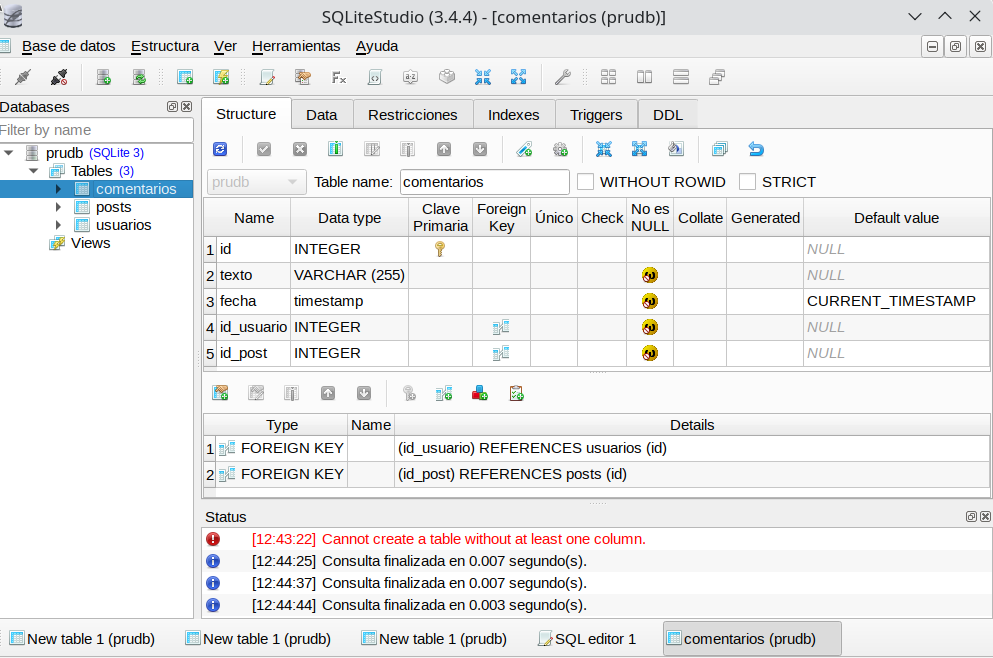

Mediante estos comandos creamos una base de datos en disco llamada **prudb.bd**.

```java
CREATE TABLE usuarios (
 id INTEGER PRIMARY KEY AUTOINCREMENT,
  nombre VARCHAR(50) NOT NULL,
  apellidos VARCHAR(255) NOT NULL
);

CREATE TABLE posts (
  id INTEGER PRIMARY KEY AUTOINCREMENT,
  texto VARCHAR(255) NOT NULL,
  likes INTEGER NOT NULL,
  fecha timestamp NOT NULL DEFAULT CURRENT_TIMESTAMP,
  id_usuario INTEGER NOT NULL,
  FOREIGN KEY (id_usuario) REFERENCES usuarios(id)
);

CREATE TABLE comentarios (
  id INTEGER PRIMARY KEY AUTOINCREMENT,
  texto VARCHAR(255) NOT NULL,
  fecha timestamp NOT NULL DEFAULT CURRENT_TIMESTAMP,
  id_usuario INTEGER  NOT NULL,
  id_post INTEGER  NOT NULL,
  FOREIGN KEY (id_usuario) REFERENCES usuarios(id),
  FOREIGN KEY (id_post) REFERENCES posts(id)
);
```

Ahora deberemos añadir la librería *JDBC* (fichero *.jar) a nuestro proyecto. Para ello copia el archivo `mysql-connector-java-x.x.x.jar` (en Ubuntu se encuentra en la ruta  `/usr/share/java`) en*JAVA PROJECTS -> Referenced Libraries*de*VS Code*:


Y ahora modificamos `DatabaseConnection`:

```java
 String host = "jdbc:sqlite:src/main/resources/network";
 con = java.sql.DriverManager.getConnection( host);
```

Y hacemos una prueba para ver si funciona:

```java
import java.sql.SQLException; 

public class Main { 

      public static void main(String[] args) { 
          // TODO Aute-generated mettod stub 
          Test t = new Test(); 
          t.insertUser(); 

          try {
              t.getellUsers(); 
          } catch (SQLException sqle) { 
              System.out.println(sqle.getMessage()); 
          }
          t.closeConnection(); 
      }
}
```

Y este debe ser el resultado:

```java
Conexión realizada
1   Janet   Espinosa
```

## 2. Ejemplos

Vamos a crear una pequeña base de datos para *Empleados* en Sqlite:

| **Num** | **Nom**bre | **Depart**amento | **Edad** | **Sueldo** |
| --- | --- | --- | --- | --- |
| 1 | Andreu | 10 | 32 | 1000.00 |
| 2 | Bernat | 20 | 28 | 1200.00 |
| 3 | Claudia | 10 | 26 | 1100.00 |
| 4 | Damià | 10 | 40 | 1500.00 |

Primero creamos un nuevo Proyecto en VSCode llamado `EmpleadosBD` y le añadimos la librería sqlite al build path.

Creamos también la base de datos mediante la línea de comandos:

```java
cd directorio-del-proyecto
mkdir bd
cd bd
sqlite empleados.bd
```

Copiamos el archivo `DatabaseConnection.java` del anterior proyecto y modificamos la cadena de conexión:

```java
String host = "jdbc:sqlite:./bd/empleados.bd";
con = java.sql.DriverManager.getConnection( host);
```

### 2.1. Crear tabla

Creamos una clase `CreateTable` para poder crear la tabla:

```java
import java.sql.SQLException; 
import java.sql.Statement; 

public class CreateTable {
    static java.sql.Connection con = DatabaseConnection.getInstance().getConnection(); 

    public static vold main(String[] args) { 
        Statement st = null; 
        String sql = "CREATE TABLE empleados ( " + 
                     " num INTEGER PRIMARY KEY, " + 
                     " nombre VARCHAR(255), " +
                     " departamento INTEGER, " + 
                     " edad INTEGER, " + 
                     " sueldo REAL);"; 
        try { 
            st = con.createStatement(); 
            st.executeUpdate(sql); 
        } catch (sQLException ex) { 
            system.out.println("Error " + ex.getMessage()); 
        } finally {
            try {
                if (st != null && !st.isClosed()) {
                    st.close(); 
                }
            } catch (SQLException ex) { 
                system.out.println ("No se ha podido cerrar el Statement por alguna razón");
            }
            try {
                if (con != null && !con.isClosed()) {
                    con.close(); 
                }
            } catch (SQLException ex) { 
                system.out.println ("No se ha podido cerrar el Statement por alguna razón");
            }
        }
    }
}
```

### 2.2. Insertar datos

Y creamos otra para insertar datos. Esta vez lo haremos con `PreparedStatement`:

```java
import java.sql.PreparedStatement; 
import java.sql.SQLException; 

public class InsertData { 
  static java.sql.Connection con = DatabaseConnection.getInstance().getConnection(); 

  public static void main(String[] args) { 
      PreparedStatement st = null;
      String sql = "INSERT INTO empleados (num, nombre, departamento, edad, sueldo) VALUES (?, ?, ?, ?, ?)"; 
      try { 
          st = con.prepareStatement(sql); 
          st.setlnt(1, 1); 
          st.setString(2, "Andreu"); 
          st.setlnt(3, 10); 
          st.setlnt(4, 32); 
          st.setDouble(5, 1000.0); 
          st.executeUpdate(); 

          st.setlnt(1, 2); 
          st.setString(2, "Bernat"); 
          st.setlnt(3, 20); 
          st.setlnt(4, 28); 
          st.setDouble(5, 1200.0); 
          st.executeUpdate(); 

          st.setlnt(1, 3); 
          st.setString(2, "Claudia"); 
          st.setlnt(3, 10); 
          st.setlnt(4, 26);
          st.setDouble(5, 1400.0); 
          st.executeUpdate(); 

          st.setlnt(1, 4); 
          st.setString(2, "Damián"); 
          st.setlnt(3, 10); 
          st.setlnt(4, 40); 
          st.setDouble(5, 1300.0); 
          st.executeUpdate(); 

      } catch (SQLException ex) { 
          System.out.println("Error " + ex.getMessage()); 

      } finally { 
          try { 
              if (st != null && !st.isClosed()) { 
                  st.close(); 
              } 
          } catch (SQLException ex) { 
              System.out.println("No se ha podido cerrar el Statement por alguna razón"); 
          } 

          try { 
              if (con != null && !con.isClosed()) { 
                  con.close(); 
              } 
          } catch (SQLException ex) { 
              System.out.println("No se ha podido cerrar Connection por alguna razón"); 
          } 
      }
  }
}
```

Esta es la versión con `Statement`:

```java
import java.sql.Statement; 
import java.sql.SQLException; 

public class InsertDataStatement { 
  static java.sql.Connection con = Databaseconnection.getInstance().getConnection(); 

  public static void main(String[] args) { 
      Statement st = null; 
      String sql = ""; 

      try { 
          st = con.createStatement();
          sql = "INSERT INTO EMPLEADOS (num, nombre, departamento, edad, sueldo) VALUES (5, 'Arturo', 10, 32, 1088.8)"; 
          st.executeUpdate(sql); 

          sql = "INSERT INTO EMPLEADOS (num, nombre, departamento, edad, sueldo) VALSES (6, 'Juan', 28, 28, 1280.8)";
          st.executeUpdate(sql); 

          sql = "INSERT INTO EMPLEADOS (num, nombre, departamento, edad, sueldo) VALUES (2, 'Martín', 10, 26, 1488.8)"; 
          st.executeUpdate(sql); 

      } catch (SQLEXCeptiOn ex) {
          System.ont.println("Error: "+ ex.getMesSege());

      } finally {
          try { 
              if (st != null && !st.isClosed()) {
                  st.close(); 
              }
          } catch (SQLException ex) { 
              System.out.println("No se ha podido cerrar el Statement por alguna razón");
          }
          try { 
              if (con != null && !con.isClosed()) {
                  con.close(); 
              }
          } catch (SQLException ex) { 
              System.out.println("No se ha podido cerrar el Statement por alguna razón");
          }
      }
  }
}
```

#### Consultar datos

Creamos una clase `getAllEmpleados` que nos devuelva todos los empleados:

```java
import java.sql.Resultset; 
import java.sql.SQLException; 
import java.sql.Statement; 

public class getAllEmpleados { 
    static java.sql.Connection con = DatabaseConnection.getInstance().getConnection(); 

    public static void main(String[] args) { 
        Statement st = null; 
        Resultset rs = null; 

        try {
            st = con.createStatement(); 
            rs = st.executeQuery("SELECT * FROM empleados"); 
            System.out.println("Núm. \tNombre \tDep \tEdad \tSueldo"); 
            System.out.println("------------------------------------------");
            while (rs.next()){ 
                System.out.print(rs.getInt(1) + "\t"); 
                system.out.print(rs.getString(2) + "\t"); 
                system.out.print(rs.getInt(3) + "\t"); 
                system.out.print(rs.getInt(4) + "\t"); 
                System.out.println(rs.getDouble(5)); 

        } catch(SQLException e) { 
                System.out.println("Se ha producido un error al leer los usuarios " + e.getMessage());           

        } finally { 
            try { 
                //Siempre se debe cerrar todo lo abierto 
                if (st != null) {
                    st.close(); 
                }
            } catch (java.sql.SQLException ex){
                System.out.println("Se ha producido un error: " + ex.getMessage()); 
            }
            try { 
                //Siempre se debe cerrar todo lo abierto 
                if (rs != null) {
                    rs.close(); 
                }
            } catch (java.sql.SQLException ex){
                System.out.println("Se ha producido un error: " + ex.getMessage()); 
            }
        }
    }
}
```

#### Modificar datos

Ahora modificamos los datos. Simplemente aumentamos el sueldo un 5% y modificamos el departamento del empleado 3, poniéndole el departamento 3.

```java
import java.sql.Statement; 
import java.sql.SQLException; 

public class ModifyData { 
  static java.sql.Connection con = Databaseconnection.getInstance().getConnection(); 

  public static void main(String[] args) { 
      Statement st = null; 
      String sql = "";
      try {
          st = con.createStatement(); 
          sql = "UPDATE EMPLEADOS SET sueldo = sueldo * 1.05";
          st.executeUpdate(sql);

          sql = "UPDATE EMPLEADOS SET departamento = 20 WHERE num = 3";
          st.executeUpdate(sql); 

      } catch (SQLException ex) { 
          system.out.printlnr("Error "+ ex.getMessage());

      } finally { 
          try { 
              if (st != null && !st.isClosed()) { 
                  st.close(); 
              } 
          } catch (SQLException ex) { 
              system.out.println("No se ha podido cerrar el Statement por alguna razón");
          }
          try { 
              if (con != null && !con.isClosed()) { 
                  con.close(); 
              } 
          } catch (SQLException ex) { 
              system.out.println("No se ha podido cerrar el Statement por alguna razón");
          }
      }
  }
}
```


---


# 7.11 DAO


> 📝 **Nota**
>
> Para realizar el ejemplo que seguiremos en este apartado (y en el **ejercicio 12: paquete `redes`**) utilizaremos el siguiente fichero sql [**redes.sql**](./redes.sql) sobre una base de datos nueva denominada `redes`.
> 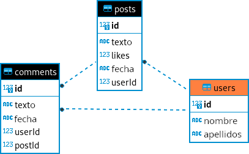


En programación existen una serie de estándares denominados [Patrones de Diseño](https://refactoring.guru/es/design-patterns) que debes conocer para poder programar según estos patrones y no reinventar la rueda.


> 📝 **Nota**
>
> Nosotros vamos a implementar “**Repository Pattern**” porque también os va a servir para cualquier aplicación tanto web, móvil o de escritorio.  
>
> Según la documentación de [Android](https://developer.android.com/codelabs/basic-android-kotlin-training-repository-pattern?hl=es-419#0):
>
> > *The repository pattern is**a design pattern that isolates the data layer from the rest of the app**. The data layer refers to the part of your app, separate from the UI, that handles the app’s data and business logic, exposing consistent APIs for the rest of your app to access this data.*


## 1. Patrón DAO (Data Access Object)

El patrón **DAO** es un patrón de diseño que **separa la lógica de acceso a datos de la lógica de negocio**. Proporciona una abstracción de acceso a datos donde cada entidad (como en el *ejercicio 12* de actividades: *Usuario*, *Post*, *Comentario*) tiene su propio DAO que maneja las operaciones **CRUD** (*Create*, *Read*, *Update*, *Delete*) específicas de esa entidad. Esto mejora la modularidad y la reutilización del código, ya que la lógica de acceso a datos está encapsulada en objetos DAO dedicados.

## 2. Implementación paso a paso

Vamos a implementar un ejemplo básico utilizando JDBC para interactuar con una base de datos relacional. Utilizaremos la estructura de base de datos que se proporciona en el *ejercicio 12: paquete `redes`*:

### 2.1. Paso 0: Definir la clase `DbConnect`

Para simplificar la implementar y conexión a la base de datos podemos crear la clase `DbConnect` (como ya hemos implementado anteriormente en algunos ejercicios):

```java
package ut07.redes;

import java.sql.Connection;
import java.sql.DriverManager;
import java.sql.SQLException;

public class DbConnect {
    private static final String JDBC_URL = "jdbc:mysql://localhost:3306/redes";
    private static final String USUARIO = "pr_tuNombre";
    private static final String PASSWORD = "pr_tuContraseña";

    private static DbConnect dbInstance; // Variable para almacenar la única instancia de la clase
    private static Connection con;

    // Constructor vacío privado para evitar la instanciación directa
    private DbConnect() {
    }

    // Método estático para obtener la instancia única (Singleton)
    public static DbConnect getInstance() {
        if (dbInstance == null) {
            dbInstance = new DbConnect();
        }
        return dbInstance;
    }

    // Método estático para obtener la conexión a la base de datos
    public Connection getConnection() throws SQLException {
        if (con == null || con.isClosed()) {
            con = DriverManager.getConnection(JDBC_URL, USUARIO, PASSWORD);
        }
        return con;
    }
}
```

### 2.2. Paso 1: Definir las clases de las entidades

Definiremos las clases `Usuario`, `Post`, `Comentario` que representan nuestras entidades:


<details markdown="1">
<summary><strong>☕ Por ejemplo: Usuario.java</strong></summary>

```java
package ut07.redes;

public class Usuario {
    private int id;
    private String nombre;
    private String apellido;

    // constructor
    public Usuario(int id, String nombre, String apellido) {
        this.id = id;
        this.nombre = nombre;
        this.apellido = apellido;
    }

    public int getId() {
        return id;
    }

    public void setId(int id) {
        this.id = id;
    }

    public String getNombre() {
        return nombre;
    }

    public void setNombre(String nombre) {
        this.nombre = nombre;
    }

    public String getApellido() {
        return apellido;
    }

    public void setApellido(String apellido) {
        this.apellido = apellido;
    }

    @Override
    public String toString() {
        return "Usuario [id=" + id + ", nombre=" + nombre + ", apellido=" + apellido + "]";
    }
}
```

</details>


### 2.3. Paso 2: Definir la interface DAO

Luego, definiremos la interfaz DAO para después implementarlas en cada entidad.


<details markdown="1">
<summary><strong>☕ Por ejemplo: IRepository.java</strong></summary>

```java
package ut07.redes;

import java.sql.SQLException;
import java.util.List;

public interface IRepository<T> {
    void crear(T entidad) throws SQLException;;      // C: Create
    T obtener(int id) throws SQLException;;          // R: Read
    List<T> obtenerTodos() throws SQLException;;     // R: Read (all)
    void actualizar(T entidad) throws SQLException;; // U: Update
    void eliminar(int id) throws SQLException;;      // D: Delete
}
```

</details>


### 2.4. Paso 3: Implementar las clases DAO

Luego, implementaremos las clases DAO para cada entidad utilizando JDBC para interactuar con la base de datos.


<details markdown="1">
<summary><strong>☕ Por ejemplo: UsuarioRepositoryImpl.java</strong></summary>

```java
package ut07.redes;

import java.sql.*;
import java.util.ArrayList;
import java.util.List;

public class UsuarioRepositoryImpl implements IRepository<Usuario> {
    private static final String INSERT_QUERY = "INSERT INTO users (name, lastName) VALUES (?, ?)";
    private static final String SELECT_BY_ID_QUERY = "SELECT * FROM users WHERE id = ?";
    private static final String SELECT_ALL_QUERY = "SELECT * FROM users";
    private static final String UPDATE_QUERY = "UPDATE users SET name = ?, lastName = ? WHERE id = ?";
    private static final String DELETE_QUERY = "DELETE FROM users WHERE id = ?";

    @Override
    public void crear(Usuario usuario)  throws SQLException {
        try (Connection con = DbConnect.getInstance().getConnection();
        PreparedStatement pst = con.prepareStatement(INSERT_QUERY, Statement.RETURN_GENERATED_KEYS)) {

            pst.setString(1, usuario.getNombre());
            pst.setString(2, usuario.getApellido());

            int filasInsertadas = pst.executeUpdate();
            if (filasInsertadas > 0) {
                ResultSet rs = pst.getGeneratedKeys();
                if (rs.next()) {
                    int id = rs.getInt(1);
                    usuario.setId(id);
                }
            }
        }    
    }

    @Override
    public Usuario obtener(int id)  throws SQLException {
        Usuario usuario = null;
        try (Connection con = DbConnect.getInstance().getConnection();
        PreparedStatement pst = con.prepareStatement(SELECT_BY_ID_QUERY)) {

            pst.setInt(1, id);
            ResultSet rs = pst.executeQuery();
            if (rs.next()) {
                String nombre = rs.getString("name");
                String apellido = rs.getString("lastName");
                usuario = new Usuario(id, nombre, apellido);
            }
        } 
        return usuario;
    }

    @Override
    public List<Usuario> obtenerTodos()  throws SQLException {
        List<Usuario> usuarios = new ArrayList<>();
        try (Connection con = DbConnect.getInstance().getConnection();
        Statement st = con.createStatement();
        ResultSet rs = st.executeQuery(SELECT_ALL_QUERY)) {

            while (rs.next()) {
                int id = rs.getInt("id");
                String nombre = rs.getString("name");
                String apellido = rs.getString("lastName");
                Usuario usuario = new Usuario(id, nombre, apellido);
                usuarios.add(usuario);
            }
        } 
        return usuarios;
    }

    @Override
    public void actualizar(Usuario usuario)  throws SQLException {
        try (Connection con = DbConnect.getInstance().getConnection();
        PreparedStatement pst = con.prepareStatement(UPDATE_QUERY)) {

            pst.setString(1, usuario.getNombre());
            pst.setString(2, usuario.getApellido());
            pst.setInt(3, usuario.getId());

            pst.executeUpdate();
        } 
    }

    @Override
    public void eliminar(int id)  throws SQLException {
        try (Connection con = DbConnect.getInstance().getConnection();
        PreparedStatement pst = con.prepareStatement(DELETE_QUERY)) {

            pst.setInt(1, id);

            pst.executeUpdate();
        } 
    }
}
```

</details>


### 2.5. Paso 4: Implementar la lógica de la aplicación

Finalmente, implementaremos la lógica de la aplicación en una clase principal `Main` donde podremos interactuar con los DAOs y la base de datos.


<details markdown="1">
<summary><strong>☕ Por ejemplo: Main.java</strong></summary>

```java
package ut07.redes;

import java.sql.Connection;
import java.sql.SQLException;
import java.time.LocalDate;
import java.util.List;
import java.util.Scanner;

public class Main {
    public static void main(String[] args) {
        Scanner entrada = new Scanner(System.in);

        IRepository<Usuario> usuarioDAO = new UsuarioRepositoryImpl();
        IRepository<Post> postDAO = new PostRepositoryImpl();
        // IRepository<Comentario> comentarioDAO = new ComentarioRepositoryImpl();

        try (Connection con = DbConnect.getInstance().getConnection()) {
            while (true) {
                menuPrincipal();
                int opcion = entrada.nextInt();
                entrada.nextLine(); // Limpiar el buffer del entrada

                switch (opcion) {
                    case 1:
                        gestionarUsuarios(entrada, usuarioDAO);
                        break;
                    case 2:
                        // gestionarPosts(entrada, postDAO);
                        break;
                    case 3:
                        // gestionarComentarios(entrada, comentarioDAO, usuarioDAO, postDAO);
                        break;
                    case 0:
                        System.out.println("Saliendo...");
                        entrada.close();
                        System.exit(0);
                    default:
                        System.out.println("Opción inválida. Intenta de nuevo.");
                }
            }
        } catch (SQLException e) {
            System.out.println("Error en la conexión con la base de datos: " + e.getMessage());
        }
    }

    private static void gestionarUsuarios(Scanner entrada, IRepository<Usuario> usuarioDAO) {
        while (true) {
            menuUsuarios();
            int opcion = entrada.nextInt();
            entrada.nextLine(); // Limpiar el buffer del entrada

            switch (opcion) {
                case 1:
                    System.out.print("Introduce el nombre del usuario: ");
                    String nombre = entrada.nextLine();
                    System.out.print("Introduce el apellido del usuario: ");
                    String apellido = entrada.nextLine();
                    Usuario nuevoUsuario = new Usuario(0, nombre, apellido); // El ID se genera automáticamente
                    try {
                        usuarioDAO.crear(nuevoUsuario);
                        System.out.println("Usuario creado con ID: " + nuevoUsuario.getId());
                    } catch (SQLException e) {
                        System.out.println("Error al crear usuario: " + e.getMessage());
                    }
                    break;
                case 2:
                    System.out.print("Introduce el ID del usuario a consultar: ");
                    int idUsuario = entrada.nextInt();
                    entrada.nextLine(); // Limpiar el buffer del entrada
                    try {
                        Usuario usuario = usuarioDAO.obtener(idUsuario);
                        if (usuario != null) {
                            System.out.println("Usuario encontrado:");
                            System.out.printf(" %-3d %-15s %-15s%n",
                                                usuario.getId(),
                                                usuario.getNombre(),
                                                usuario.getApellido());
                        } else {
                            System.out.println("No se encontró ningún usuario con ese ID.");
                        }
                    } catch (SQLException e) {
                        System.out.println("Error al obtener usuario: " + e.getMessage());
                    }
                    break;
                case 3:
                    try {
                        List<Usuario> usuarios = usuarioDAO.obtenerTodos();
                        if (!usuarios.isEmpty()) {
                            System.out.println("Listado de Usuarios:");
                            for (Usuario u : usuarios) {
                                System.out.println("ID: " + u.getId() + ", Nombre: " + u.getNombre() + ", Apellido: " + u.getApellido());
                            }
                        } else {
                            System.out.println("No hay usuarios registrados.");
                        }
                    } catch (SQLException e) {
                        System.out.println("Error al obtener todos los usuarios: " + e.getMessage());
                    }
                    break;
                case 4:
                    System.out.print("Introduce el ID del usuario a actualizar: ");
                    int idActualizar = entrada.nextInt();
                    entrada.nextLine(); // Limpiar el buffer del entrada
                    try {
                        Usuario usuarioActualizar = usuarioDAO.obtener(idActualizar);
                        if (usuarioActualizar != null) {
                            System.out.print("Introduce el nuevo nombre del usuario (deja en blanco para mantener el actual): ");
                            String nuevoNombre = entrada.nextLine();
                            if (!nuevoNombre.isEmpty()) {
                                usuarioActualizar.setNombre(nuevoNombre);
                            }

                            System.out.print("Introduce el nuevo apellido del usuario (deja en blanco para mantener el actual): ");
                            String nuevoApellido = entrada.nextLine();
                            if (!nuevoApellido.isEmpty()) {
                                usuarioActualizar.setApellido(nuevoApellido);
                            }
                            usuarioDAO.actualizar(usuarioActualizar);
                            System.out.println("Usuario actualizado correctamente.");
                        } else {
                            System.out.println("No se encontró ningún usuario con ese ID.");
                        }
                    } catch (SQLException e) {
                        System.out.println("Error al actualizar usuario: " + e.getMessage());
                    }
                    break;
                case 5:
                    System.out.print("Introduce el ID del usuario a eliminar: ");
                    int idEliminar = entrada.nextInt();
                    entrada.nextLine(); // Limpiar el buffer del entrada
                    try {
                        Usuario usuarioActualizar = usuarioDAO.obtener(idEliminar);
                        if (usuarioActualizar != null) {
                            // eliminar primero los comentarios y posts asociados al usuario
                            // PostRepositoryImpl.eliminarPostPorUsuario(idEliminar);
                            // luego eliminar el usuario
                            usuarioDAO.eliminar(idEliminar);
                            System.out.println("Usuario eliminado correctamente.");
                        } else {
                            System.out.println("No se encontró ningún usuario con ese ID.");
                        }
                    } catch (SQLException e) {
                        System.out.println("Error al eliminar usuario: " + e.getMessage());
                    }
                    break;
                case 0:
                    return;
                default:
                    System.out.println("Opción inválida. Intenta de nuevo.");
            }
        }
    }

    // private static void gestionarPosts(Scanner entrada, IRepository<Post> postDAO) {
    //     while (true) {
    //         menuPosts();
    //         int opcion = entrada.nextInt();
    //         entrada.nextLine(); // Limpiar el buffer del entrada

    //         switch (opcion) {
    //             case 1:
    //                 System.out.print("Introduce el texto del post: ");
    //                 String texto = entrada.nextLine();

    //                 System.out.println("Elige un usuario: ");

    //                 UsuarioRepositoryImpl usuarioRepository = new UsuarioRepositoryImpl();
    //                 List<Usuario> usuarios;
    //                 int usuarioId = 0;
    //                 try {
    //                     usuarios = usuarioRepository.obtenerTodos();
    //                     for (Usuario usuario : usuarios) {
    //                         System.out.println(usuario.getId() + " - " + usuario.getNombre() + " " + usuario.getApellido());
    //                     }
    //                     System.out.print("Introduce el ID del usuario que publica el post:  ");
    //                     usuarioId = entrada.nextInt();
    //                 } catch (SQLException e) {
    //                     System.out.println("ERROR: " + e.getMessage());
    //                 }

    //                 Post nuevoPost = new Post(0, texto, 0, LocalDate.now().toString(), usuarioId); // El ID se genera automáticamente
    //                 try {
    //                     postDAO.crear(nuevoPost);
    //                     System.out.println("Post creado con ID: " + nuevoPost.getId());
    //                 } catch (SQLException e) {
    //                     System.out.println("Error al crear post: " + e.getMessage());
    //                 }
    //                 break;
    //             case 2:

    //                 break;
    //             case 3:

    //                 break;
    //             case 4:

    //                 break;
    //             case 5:

    //                 break;
    //             case 0:
    //                 return;
    //             default:
    //                 System.out.println("Opción inválida. Intenta de nuevo.");
    //         }
    //     }
    // }

    // private static void gestionarComentarios(Connection con, Scanner entrada, IRepository<Comentario> comentarioDAO, IRepository<Usuario> usuarioDAO, IRepository<Post> postDAO) {
    //     // Implementar lógica similar a gestionarUsuarios para Comentarios
    // }

    // MENÚ PRINCIPAL: menuPrincipal()
    private static void menuPrincipal() {
        System.out.println("\nMenú Principal:");
        System.out.println("1. Gestionar Usuarios");
        System.out.println("2. Gestionar Posts");
        System.out.println("3. Gestionar Comentarios");
        System.out.println("0. Salir");
        System.out.print("Selecciona una opción:  ");
    }

    // MENÚ SECUNDARIO: menuUsuarios()
    private static void menuUsuarios() {
        System.out.println("\nMenú de Usuarios:");
        System.out.println("1. Crear usuario");
        System.out.println("2. Consultar usuario por ID");
        System.out.println("3. Listar todos los usuarios");
        System.out.println("4. Actualizar usuario");
        System.out.println("5. Eliminar usuario");
        System.out.println("0. Volver al menú principal");
        System.out.print("Selecciona una opción:  ");
    }

    // MENÚ SECUNDARIO: menuPosts()
    private static void menuPosts() {
        System.out.println("\nMenú de Posts:");
        System.out.println("1. Crear post");
        System.out.println("2. Consultar post por ID");
        System.out.println("3. Listar todos los posts");
        System.out.println("4. Actualizar post");
        System.out.println("5. Eliminar post");
        System.out.println("0. Volver al menú principal");
        System.out.print("Selecciona una opción:  ");
    }

    // MENÚ SECUNDARIO: menuPosts()
    private static void menuComentarios() {
        System.out.println("\nMenú de Comentarios:");
        System.out.println("1. Crear comentario");
        System.out.println("2. Consultar comentario por ID");
        System.out.println("3. Listar todos los comentarios");
        System.out.println("4. Actualizar comentario");
        System.out.println("5. Eliminar comentario");
        System.out.println("0. Volver al menú principal");
        System.out.print("Selecciona una opción:  ");
    }

}
```

</details>


### 2.6. Consideraciones

- **JDBC y SQL Queries:** Hemos utilizado JDBC para conectarnos y realizar operaciones en la base de datos. Es importante manejar excepciones y cerrar correctamente las conexiones y recursos.
- **Patrón DAO:** Este patrón nos ayuda a mantener un código organizado y aislado, separando la lógica de acceso a datos de la lógica de negocio.
- **Lógica de la aplicación:** En la clase `Main`, hemos implementado un menú interactivo que permite al usuario gestionar *usuarios*, *posts* y *comentarios* utilizando los métodos proporcionados por los DAOs.
- **Adaptabilidad:** Puedes expandir este ejemplo añadiendo más funcionalidades o haciendo ajustes según los requisitos de tu aplicación.


---


# 7.12 Repaso

## 1. Objetos JDBC

Como hemos visto en sesiones anteriores, hay tres tipos de objetos que utilizaremos en la interacción con nuestra Base de Datos al usar JDBC. Estos son:

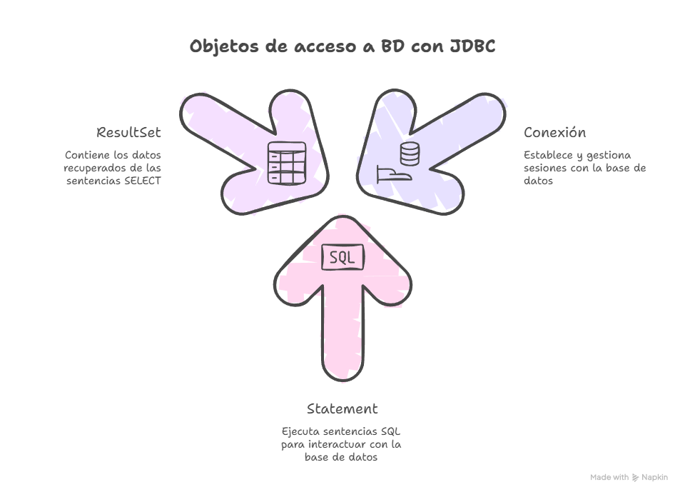

### 1.1 Connection

Nos va a permitir establecer y finzalizar la conexión a nuestra BD.

> En nuestras actividades, lo hemos realizado a través del archivo `DbConnect.java`:

```java
Connection con = DbConnect.getInstance().getConnection();
```

### 1.2 Statement o PreparedStatement

Nos permiten ejecutar sentencias SQL en la BD. Su principal diferencia reside en si la sentencia llevará parámetros (PreparedStatement) o no (Statement).

A lo largo de las actividades hemos visto dos funciones básicas de estos objetos:

- `executeQuery(sql)`: Se usa para las sentencias SQL de tipo **SELECT**.
- `executeUpdate()`: Se usa para todas aquellas sentencias SQL que modifican los datos de la BD (**INSERT, UPDATE, DELETE**).

```java
Statement st = con.createStatement();
ResultSet rs = st.executeQuery("SELECT * FROM alumnos");
```

```java
String sql = "INSERT INTO alumnos (nombre, edad) VALUES (?, ?)";
PreparedStatement pst = con.prepareStatement(sql)
pst.setString(1,nombre);
pst.setInt(2, edad);

int filasModificadas = pst.executeUpdate();
```


<details markdown="1">
<summary><strong>☕ Aclaraciones ejemplo anterior</strong></summary>

Vamos a analizar con calma el ejemplo que acabamos de ver para `PreparedStatement`:

1. El primer paso es prepara la sentencia SQL. Los `?` hacen referencia a aquellos datos que se incluiran como parámetros.
2. A continuación, se crea el objeto `PreparedStatement` usando el método `prepareStatement(sql)`.
3. Una vez creado este objeto, debemos añadir los parámetros que requiere la sentencia SQL declarada en el primer paso. Para ello, usaremos las funciones `setString()`, `setInt()`, `setDouble()`, etc.
4. Finalmente, con el uso del método `executeUpdate()` se haran efectivos los cambios en la BD. *¿Y qué es eso de `filasModificadas`? ¿Para que lo quiero?* La función `executeUpdate()` va a devolver *(return)* un número *(int)* que indica el **número de filas** modificadas en la BD. Este dato me permite conocer si la sentencia se ha ejecutado *(se han modificado más de 1 fila)* o no.

</details>


### 1.3 ResultSet

El último de los objetos estudiados contiene un conjunto de resultados (datos) obtenidos tras ejecutar una sentencia SQL de tipo **SELECT**.

Para acceder a sus datos vamos a necesitar varias funciones:

- `next()`: nos va a permitir recorrer la estructura. Es decir, mientras queden datos en ella, irá recorriendola para que podamos ir accediendo a las filas de la BD.

*Pero, ¿cómo me quedo con cada uno de los datos (columnas) almacenados?* Para ello contamos con los métodos:

- `getString(nombreColumna)`
- `getInt(nombreColumna)`
- `getDouble(nombreColumna)`

```java
ResultSet rs = pst.executeQuery();
//Recorrer datos devueltos
while (rs.next()) {
    String nombre = rs.getString("nombre");
    int edad = rs.getInt("edad");

    System.out.println("El alumno " + nombre + " tiene " +edad + " años.");
}
```

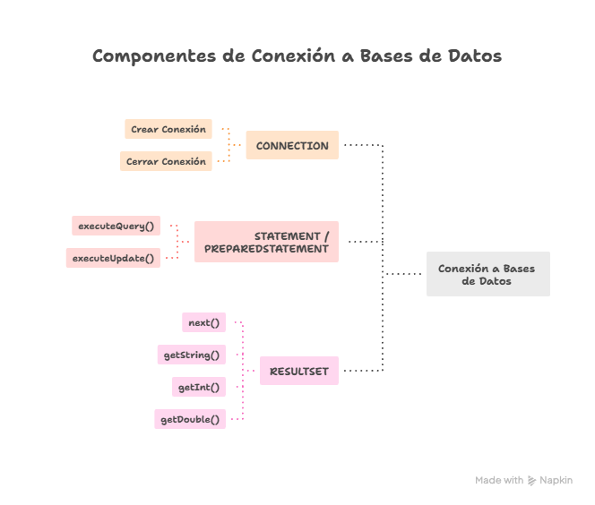

---

## 2. Control de excepciones

Una vez estudiados todos los objetos, sus usos y métodos, **¿Cómo puedo saber si debo usar las sentencias `try-catch` para controlar las excepciones?**

Usaremos este tipo de sentencias siempre que vayamos a realizar una conexión o cambios en la BD que pueden no tener exito *(por fallo de conexión, falta de driver, errores en el SQL, etc)*.

Algunos casos en los que **SIEMPRE** las usaremos son:

1. Al crear la conexión en el método principal *(main)*:

```java
try (Connection con = DbConnect.getInstance().getConnection()) {
    //Realizar acciones...
} catch (SQLException ex) {
    System.out.println("ERROR al conectar: " + ex.getMessage());
} 
```

1. Cada vez que creemos un `Statement` o `PreparedStatement` en los archivos de tipo *Repository*:

```java
try (Statement st = con.createStatement()) {
   //...
} 
```

```java
try (PreparedStatement pst = con.prepareStatement(sql)) {
    //...
}
```

---

## 3. Pasos para construir el método completo

Con toda la información anterior asimilada, **¿Qué pasos debo seguir para construir un método completo de consulta / modificación de BD?**

Mi primera tarea será analizar y decidir si voy mi método requiere el uso de `Statement` o `PreparedStatement`.

Con esta decisión tomada, los pasos serán los siguientes.

### 3.1 Pasos para Statement

1. Crear la conexión a la BD, es decir, el objeto `Connection`.
2. Crear el objeto `Statement` *(recuerda el uso de `try-catch`)*
3. Ejecutar la sentencia, usando `executeQuery(sql)` o `executeUpdate()`.
4. En caso de una sentencia *SELECT*, crear y recorrer el objeto `ResultSet`. En caso de una actualización, comprobar las filas modificadas.


<details markdown="1">
<summary><strong>☕ Analizemos un ejemplo completo con Statement</strong></summary>

```java
public void listarAlumnos() throws SQLException{
    Connection con = DbConnect.getInstance().getConnection();
    try (Statement st = con.createStatement()) {
        ResultSet rs = st.executeQuery("SELECT * FROM alumnos");
        //Recorrer datos devueltos
        while (rs.next()) {
            String nombre = rs.getString("nombre");
            int edad = rs.getInt("edad");

            System.out.println("El alumno " + nombre + " tiene " +edad + " años.");
        }
    } 
}
```

</details>


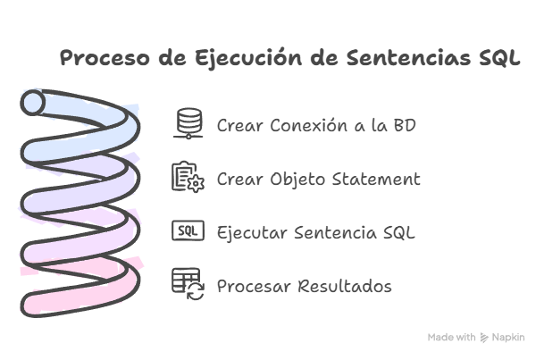

### 3.2 Pasos para PreparedStatement

1. Crear la conexión a la BD, es decir, el objeto `Connection`.
2. Preparar la sentencia SQL.
3. Crear el objeto `PreparedStatement` *(recuerda el uso de `try-catch`)*
4. Añadir los parámetros requeridos a la sentencia creada en el paso 2 con la ayuda de `setString(indice, parámetro)`, `setInt(indice, parámetro)`, etc.
5. Ejecutar la sentencia, usando `executeQuery(sql)` o `executeUpdate()`.
6. En caso de una sentencia *SELECT*, crear y recorrer el objeto `ResultSet`. En caso de una actualización, comprobar las filas modificadas.


<details markdown="1">
<summary><strong>☕ Analizemos un ejemplo de SELECT con PreparedStatement</strong></summary>

```java
public void listarPostsUsuario(int usuario) throws SQLException {
    Connection con = DbConnect.getInstance().getConnection();
    String sql = "SELECT * FROM posts WHERE usuario_id = ?";

    try (PreparedStatement pst = con.prepareStatement(sql)) {
        pst.setInt(1, usuario);

        ResultSet rs = pst.executeQuery();

        System.out.println("Posts del usuario " + usuario + ":");
        while (rs.next()) {
            int id = rs.getInt("id");
            String titulo = rs.getString("titulo");
            String contenido = rs.getString("contenido");
            String fecha = rs.getString("fecha_publicacion");

            System.out.println(id + ". " + titulo + ": " + contenido + " (" + fecha + ")");
        }
    }
}
```

</details>


<details markdown="1">
<summary><strong>☕ Analizemos un ejemplo de modificación con PreparedStatement</strong></summary>

```java
public void cambiarFecha(int id, String fecha) throws SQLException {
    Connection con = DbConnect.getInstance().getConnection();
    String sql = "UPDATE posts SET fecha_publicacion = ? WHERE id = ?";

    try (PreparedStatement pst = con.prepareStatement(sql)) {

        pst.setString(1, fecha);
        pst.setInt(2, id);

        int filasModificadas = pst.executeUpdate();

        if (filasModificadas > 0) {
            System.out.println("Post con id '" + id + "' modificado.");
        } else {
            System.out.println("No se encontró ningún posts para el id '" + id);
        }
    }
}
```

</details>


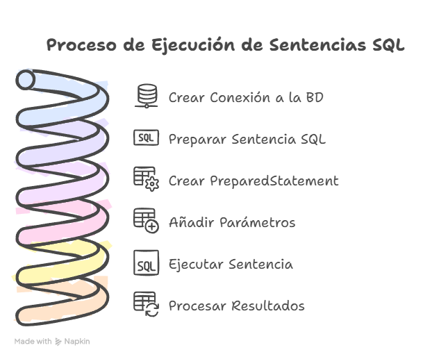


---


# Actividades UT07

## Bloque 7.0


> 💻 **Empaquetar actividades**
>
> Empaqueta las actividades, dentro de la carpeta **`ut07`**, en la carpeta **`/bloqueX`**.


### Actividad 01

Package: `A01_pedidos`

Desarrolla una clase **`Pedido`** que permita la gestión de pedidos en una base de datos orientada a objetos.

La tabla `pedidos` tiene las columnas `id`, `cliente`, `producto`, `cantidad`, `fecha`.

Implementa los métodos necesarios para:

- Crear un nuevo pedido para un cliente.
- Mostrar todos los pedidos de un cliente específico.
- Eliminar todos los pedidos de un cliente específico.

---

## Bloque 7.1

### Actividad 02

Package: `A02_posts`

Desarrolla una aplicación que permita gestionar los pedidos de una tienda.

La tabla `posts` tiene las columnas `id`, `usuario_id`, `titulo`, `contenido`, `fecha_publicacion`.

Implementa los métodos necesarios para:

- Registrar un nuevo posts.
- Mostrar los posts de un usuario específico.
- Eliminar todos los posts de un usuario específico.
- Cambiar la fecha de un post *(filtra por id)*.
- Mostrar todos los posts de la BBDD.

En el `main` de la clase `Test`, implementa un menú para que el usuario pueda ejecutar todas las funcionalidades anteriores.


<details markdown="1">
<summary><strong>☕ Ayuda menú</strong></summary>

```java
Scanner sc = new Scanner(System.in);
int opcion = 0;
PostsRepository postsDAO = new PostsRepository();

try (Connection con = DbConnect.getInstance().getConnection()) {
    do {
        System.out.println("\n MENÚ: ");
        System.out.println("1. Nuevo post");
        System.out.println("2. Mostrar posts de usuario");
        System.out.println("3. Eliminar posts usuario");
        System.out.println("4. Cambiar la fecha de un post");
        System.out.println("4. Mostrar todos los posts");
        System.out.println("0. Salir");
        System.out.print("Selecciona una opción: ");

        opcion = sc.nextInt();
        sc.nextLine(); // Limpiar buffer

        switch (opcion) {
            case 1:
                //Realizar acciones necesarias 
                break;
            case 2:
                //Realizar acciones necesarias
                System.out.println("Introduce el id de usuario:");
                int uid2 = sc.nextInt();

                postsDAO.listarPostsUsuario(uid2);
                break;
            case 3:
                //Realizar acciones necesarias
                break;
            case 4:
                //Realizar acciones necesarias 
                break;
            case 5:
                //Realizar acciones necesarias 
                break;
            case 0:
                System.out.println("Saliendo del sistema...");
                break;
            default:
                System.out.println("Opción inválida. Intenta de nuevo.");
        }
    } while (opcion != 0);
} catch (SQLException ex) {
        System.out.println("ERROR al conectar: " + ex.getMessage());
}
```

</details>


---

## Bloque 7.2

### Actividad 03

**Análisis de índices en una tabla**: Crea una aplicación que permita analizar los índices de una tabla en una base de datos relacional. Conéctate a la base de datos utilizando JDBC y muestra los índices asociados a la tabla `clientes`.

Operaciones:

- Mostrar los índices de la tabla.
- Comprobar si hay claves primarias o foráneas asociadas.

### Actividad 04

**`_04_GestionProductos`**: Supongamos que tienes una base de datos que almacena información sobre productos. La tabla `productos` tiene las siguientes columnas:

- `id`: Identificador único del producto (entero).
- `nombre`: Nombre del producto (cadena de texto).
- `precio`: Precio del producto (decimal).

Tu tarea es escribir un programa Java `_02_GestionProductos` que realice las siguientes operaciones utilizando los métodos proporcionados:

1. **`mostrarProductosPorPagina()`**: mostrar una página de productos cada vez que el usuario lo solicite. Cada página debe contener 5 productos. Implementa las funciones para mover el cursor a la primera página, página siguiente, página anterior, última página y una página específica utilizando el método `absolute(int row)`.
2. **`buscarProductoPorNombre(String nombre)`**: permitir al usuario buscar un producto por su nombre. Utiliza el método `relative(int registros)` para desplazar el cursor hacia adelante o hacia atrás según la coincidencia del nombre.

---

## Bloque 7.3

### Actividad 05

**`_05_GestionEmpleados`**: Tenemos nuestra base de datos **`pr_tuNombre`** que almacena información sobre *empleados*. La tabla `empleados` tiene las siguientes columnas:

- `id`: identificador único del empleado (entero).
- `nombre`: nombre del empleado (cadena de texto).
- `salario`: salario del empleado (decimal).

Es escribir un programa Java `_01_GestionEmpleados` que realice las siguientes operaciones utilizando diferentes tipos de resultado y opciones de concurrencia:

1. **`listarEmpleados`**: mostrar en la consola todos los empleados y sus salarios.
2. **`incrementoSalarioAnual`**: incrementar el salario de todos los empleados en un 10%.
3. **`eliminarEmpleadosSalario`**: eliminar todos los empleados cuyo salario sea menor que 3000€.
4. **`actualizarSalarioEmpleado`**: actualiza el salario de un empleado filtrado por *nombre*.
5. **`eliminarEmpleadoId`**: eliminar un empleado filtrado por *id*.

> En el `main` crea un menú que permita al usuario acceder a las diferentes funcionalidades.

### Actividad 06

**`_06_GestionVentas`**: Supongamos que tienes una base de datos que almacena información sobre ventas. La tabla `ventas` tiene las siguientes columnas:

- `id`: Identificador único de la venta (entero).
- `producto`: Nombre del producto vendido (cadena de texto).
- `cantidad`: Cantidad de productos vendidos (entero).
- `total`: Total de la venta (decimal).

Tu tarea es escribir un programa Java `_05_GestionVentas` que realice las siguientes operaciones utilizando los métodos proporcionados:

1. **Calcular el total de ventas**: Muestra al usuario la suma del precio total de las ventas almacenadas en el sistema.
2. **Buscar ventas por producto**: Permite al usuario ingresar el nombre de un producto y devuelve las ventas de ese producto.
3. **Calcular el total de € ganados con un producto**: Permite al usuario ingresar el nombre de un producto y devuelve el precio total de las ventas de dicho producto.

> En el `main` crea un menú que permita al usuario acceder a las diferentes funcionalidades.

### Actividad 07

**`_07_GestionLibros`**: Supongamos que tienes una base de datos que almacena información sobre libros. La tabla `libros` tiene las siguientes columnas:

- `id`: Identificador único del libro (entero).
- `titulo`: Título del libro (cadena de texto).
- `autor`: Nombre del autor del libro (cadena de texto).
- `anio_publicacion`: Año de publicación del libro (entero).

Tu tarea es escribir un programa Java que realice las siguientes operaciones utilizando los métodos proporcionados:

- **`buscarLibroPorAutor(String autor)`**: permite al usuario ingresar el nombre de un autor y muestra todos los libros escritos por ese autor.
- **`mostrarLibrosPorDecada(int decada)`**: permite al usuario ingresar una década y mostrar todos los libros publicados en esa década.


<details markdown="1">
<summary><strong>⚠️ Ayuda</strong></summary>

Sugerencia:

- Utiliza el método `preparedStatement(sql)` con una consulta en la que se listen los libros comprendidos en una década y ordenados de forma descendente por el `anio_publiacion`.
- Si el usuario me introduce la decada *1990*, la consulta SQL será: `SELECT * FROM libros WHERE anio_publicacion BETWEEN 1990 AND 1999 ORDER BY anio_publicacion DESC;`

</details>


> En el `main` crea un menú que permita al usuario acceder a las diferentes funcionalidades.

---

## Bloque 7.4

### Actividad 08

**`_08_GestionLibros`**: Supongamos que tienes una base de datos que almacena información sobre libros. La tabla `libros` tiene las siguientes columnas:

- `id`: Identificador único del libro (entero).
- `titulo`: Título del libro (cadena de texto).
- `autor`: Nombre del autor del libro (cadena de texto).
- `anio_publicacion`: Año de publicación del libro (entero).

Tu tarea es escribir un programa Java que realice las siguientes operaciones utilizando los métodos proporcionados:

- **`buscarLibroPorAutor(String autor)`**: permite al usuario ingresar el nombre de un autor y muestra todos los libros escritos por ese autor.
- **`mostrarLibrosPorDecada(int decada)`**: permite al usuario ingresar una década y mostrar todos los libros publicados en esa década.


<details markdown="1">
<summary><strong>⚠️ Ayuda</strong></summary>

Sugerencia:

- Utiliza el método `preparedStatement(sql)` con una consulta en la que se listen los libros comprendidos en una década y ordenados de forma descendente por el `anio_publiacion`.
- Si el usuario me introduce la decada *1990*, la consulta SQL será: `SELECT * FROM libros WHERE anio_publicacion BETWEEN 1990 AND 1999 ORDER BY anio_publicacion DESC;`

</details>


> En el `main` crea un menú que permita al usuario acceder a las diferentes funcionalidades.

### Actividad 09

**`_09_GestionEmpleados` (continuación)**: Continuando con el ejercicio de gestión de empleados, copia el programa `GestionEmpleados`, cambia el nombre a `_09_gestionEmpleados` y agrega algunas funcionalidades adicionales:

1. **Mostrar información del empleado por ID**: Permite al usuario ingresar el ID de un empleado y muestra toda la información relacionada con ese empleado. Utiliza el método `absolute(int row)` para posicionarte en el registro del empleado especificado.
2. **Buscar empleados por salario**: Permite al usuario ingresar un rango de salarios y mostrar todos los empleados cuyo salario esté dentro de ese rango. Utiliza el método `next()` para recorrer todas las filas y filtrar los empleados según el criterio de salario.

### Actividad 10

**`_10_GestionEstudiantes`**: Supongamos que tienes una base de datos que almacena información sobre estudiantes. La tabla `estudiantes` tiene las siguientes columnas:

- `id`: Identificador único del estudiante (entero).
- `nombre`: Nombre del estudiante (cadena de texto).
- `edad`: Edad del estudiante (entero).
- `promedio`: Promedio de calificaciones del estudiante (decimal).

Tu tarea es escribir un programa Java que realice las siguientes operaciones utilizando los métodos proporcionados:

1. **Mostrar la posición actual del estudiante**: Muestra la posición del estudiante actual en el conjunto de resultados. Utiliza el método `getRow()` para obtener el número de registro actual.
2. **Validar la posición del cursor**: Verifica si el cursor está antes del primer registro, en el primer registro, en el último registro o después del último registro. Utiliza los métodos `isBeforeFirst()`, `isFirst()`, `isLast()` e `isAfterLast()` para realizar estas verificaciones.

> En el `main` crea un menú que permita al usuario acceder a las diferentes funcionalidades.

### Actividad 11

**`_11_GestionProductos` (continuación)**: Continuando con el ejercicio de gestión de productos, copia el programa `GestionProductos`, cambia el nombre a `_11_gestionProductos` y y agrega algunas funcionalidades adicionales:

1. **Mostrar el número total de productos**: Muestra el número total de productos en la base de datos. Utiliza el método `getRow()` para obtener el número de registro actual y `last()` para mover el cursor a la última fila.
2. **Verificar si hay productos disponibles**: Verifica si hay algún producto disponible en la base de datos. Utiliza los métodos `isBeforeFirst()` e `isAfterLast()` para determinar si el cursor está antes del primer registro o después del último registro, respectivamente.

> En el `main` crea un menú que permita al usuario acceder a las diferentes funcionalidades.

---

## Bloque 7.5

### Actividad 12

`A12_GestionPosts` : Crea una aplicación que permita gestionar los posts y comentarios almacenados en una base de datos.

El usuario podrá:

- Modificar el título de un post. 

  ```java
  UPDATE posts SET titulo = ? WHERE id = ?
  ```
- Eliminar los posts obsoletos (aquellos con más de un año desde su publicación).

  ```java
  DELETE FROM posts WHERE fecha_publicacion < '2024-01-01'
  ```
- Añadir un comentario a un post.

  ```java
  INSERT INTO comentarios(usuario_id, post_id, contenido, fecha_comentario) VALUES (?, ?, ?, ?)
  ```
- Eliminar todos los comentarios de un post.

  ```java
  DELETE FROM comentarios WHERE post_id = ?
  ```
- Consultar los comentarios de un post **(Se debe mostrar el título del post y el nombre del usuario, no su id)**.


<details markdown="1">
<summary><strong>⚠️ Ayuda</strong></summary>

Para este caso necesitaremos tres métodos:

- El primero sacará toda la información de la tabla comentarios filtrando por el id del post buscado. Su SQL será:

  ```java
  SELECT * FROM comentarios WHERE post_id=?
  ```
- Una vez tengamos esta información, le pasaremos el id del usuario obtenido a otro método que nos devolverá su nombre:

  ```java
  public String nombreUsuario(int idUsuario) throws SQLException{
      //...RELLENAR...
  }
  ```

  Su SQL será:

  ```java
  SELECT nombre FROM usuarios WHERE id = ?
  ```
- Igual que lo hemos hecho para el usuario, necesitaremos un método que nos permita conocer el nombre de un post a partir de su id. **Basandote en el ejemplo anterior, ¿cómo lo harías?**

</details>


> En el `main` crea un menú que permita al usuario acceder a las diferentes funcionalidades.

### Actividad 13

`A13_ActualizaciónProductos` : Desarrolla una aplicación que permita actualizar los precios de los productos en la tabla `productos`.

Implementa:

- Método `actualizarPrecios()` que aplique un incremento del 10% a todos los productos cuyo precio sea inferior a 20 euros.

  ```java
  UPDATE productos SET precio = precio*1.10 WHERE precio < 20
  ```
- Método `actualizarPrecioID(double precio)` que actualice el precio de un producto determinado.

  ```java
  UPDATE productos SET precio = ? WHERE id = ?
  ```

> En el `main` crea un menú que permita al usuario acceder a las diferentes funcionalidades.

---

## Bloque 7.6


> ⚠️ **Archivos sql**
>
> Para realizar las actividades de este bloque deberás importar el archivo [**ventasYbanco.sql**](../../others/code/ut07/ventasYbanco.sql) en tu base de datos.


### Actividad 14

**`_14_ProductosObsoletos`**: Desarrolla una aplicación que permita gestionar los productos obsoletos de una tienda.

La tabla `orders` contiene los productos de la tabla `products` vendidos, con la cantidad y la fecha de cada compra.

Haz métodos para:

- Mostrar todos los pedidos realizados **Mostrando el nombre del producto *(tabla products)*, NO su id**.
- Mostrar los pedidos de un producto **(filtrado por nombre)**.
- **EXTRA:** Eliminar los productos obsoletos (hace más de un año que no se han vendido).

> En el `main` crea un menú que permita al usuario acceder a las diferentes funcionalidades.

### Actividad 15

**`_15_GestionClientesBanco`**: Supongamos que tienes una base de datos que almacena información sobre los clientes de un banco *(clients)* y sus cuentas bancarias *(accounts)*.

Tu tarea es escribir un programa Java que realice las siguientes operaciones:

1. Mostrar el nombre de todos los clientes junto con sus cuentas. 

  ```java
  SELECT * FROM accounts;
  SELECT nombre FROM clients WHERE id = ?;
  ```
2. Actualizar el teléfono de un cliente.

  ```java
  UPDATE clients SET telefono = ? WHERE id = ?;
  ```
3. Actualizar la dirección de un cliente.

  ```java
  UPDATE clients SET direccion = ? WHERE id = ?;
  ```
4. Mostrar el total de dinero almacenado en el banco. 

  ```java
  SELECT saldo FROM accounts;
  ```
5. Insertar un nuevo cliente. 

  ```java
  INSERT INTO clients(nombre, direccion, telefono) VALUES (?, ?, ?);
  ```
6. Insertar una nueva cuenta (asociada a un cliente).

  ```java
  INSERT INTO accounts(saldo, id_cliente) VALUES (?, ?);
  ```
7. Mostrar el cliente propietario de la cuenta con más dinero.

  ```java
  SELECT * FROM accounts ORDER BY saldo DESC LIMIT 1;
  SELECT nombre FROM clients WHERE id = ?;
  ```
8. Actualizar el dinero de una cuenta.

  ```java
  UPDATE accounts SET saldo = ? WHERE id = ?;
  ```
9. Eliminar una cuenta.

  ```java
  DELETE FROM accounts WHERE id = ?;
  ```
10. Eliminar un cliente y todas sus cuentas.

  ```java
  DELETE FROM accounts WHERE id_cliente = ?;
  DELETE FROM clients WHERE id = ?;
  ```

> En el `main` crea un menú que permita al usuario acceder a las diferentes funcionalidades.

### Actividad 16

**`_16_GestionPedidos`**: Supongamos que tienes una base de datos que almacena información sobre pedidos. La tabla `pedidos` tiene las siguientes columnas:

- `id`: Identificador único del pedido (entero).
- `cliente`: Nombre del cliente que realizó el pedido (cadena de texto).
- `producto`: Nombre del producto pedido (cadena de texto).
- `cantidad`: Cantidad del producto solicitada en el pedido (entero).
- `fecha`: Fecha en que se realizó el pedido (fecha).

Tu tarea es escribir un programa Java `_06_GestionPedidos` que realice las siguientes operaciones utilizando los métodos proporcionados:

1. **Listar pedidos por cliente**: Permite al usuario ingresar el nombre de un cliente y mostrar todos los pedidos realizados por ese cliente. Utiliza el método `relative(int registros)` para desplazarte a través de los registros según las coincidencias del cliente.
2. **Buscar pedidos por fecha**: Permite al usuario ingresar una fecha y mostrar todos los pedidos realizados en esa fecha. Utiliza el método `afterLast()` y `previous()` para mover el cursor al final y luego retroceder, así puedes comenzar desde la última fila.

### Actividad 17

**`_17_GestionEmpleados` (continuación)**: Continuando con el ejercicio de gestión de empleados del séptimo ejercicio, copia el programa `_10_GestionEmpleados` y agrega algunas funcionalidades adicionales:

1. **Verificar si hay empleados en la base de datos**: Verifica si hay algún empleado registrado en la base de datos. Utiliza los métodos `isBeforeFirst()` e `isAfterLast()` para determinar si el cursor está antes del primer registro o después del último registro, respectivamente.
2. **Mostrar el primer empleado**: Muestra la información del primer empleado en la base de datos. Utiliza el método `first()` para mover el cursor al primer registro y luego muestra la información del empleado.

### Actividad 18

**`_18_GestionClientes`**: Imagina que tienes una base de datos que almacena información sobre clientes. La tabla `clientes` tiene las siguientes columnas:

- `id`: Identificador único del cliente (entero).
- `nombre`: Nombre del cliente (cadena de texto).
- `correo`: Correo electrónico del cliente (cadena de texto).
- `telefono`: Número de teléfono del cliente (cadena de texto).

Tu tarea es escribir un programa Java `_11_GestionClientes` que realice las siguientes operaciones utilizando los métodos proporcionados:

1. **Mostrar la posición actual del cliente**: Muestra la posición actual del cliente en el conjunto de resultados. Utiliza el método `getRow()` para obtener el número de registro actual.
2. **Mostrar información del último cliente**: Muestra la información del último cliente en la base de datos. Utiliza el método `last()` para mover el cursor al último registro y luego muestra la información del cliente.

---

## Bloque 7.7


> 💻 **Empaquetar actividades**
>
> Empaqueta las actividades, dentro de la carpeta **`ut07`**, en la carpeta **`/bloque7`**.


## Actividad 19

Empaqueta toda esta actividad en: `ut07/actividades/ce6acdef/`redes

Crea una aplicación que nos permita gestionar la base de datos [**redes.sql**](../../others/code/ut07/redes.sql).


Debe tener un menú desde el que se puedan gestionar (*Create*, *Read*, *Update*, *Delete*) usuarios, posts y comentarios.


<details markdown="1">
<summary><strong>☕ Ayuda SQL</strong></summary>

- SELECT: 

  ```java
  SELECT * FROM comments;
  ```
- INSERT: 

  ```java
  INSERT INTO comments(texto, fecha, userId, postId) VALUES(?, ?, ?, ?);
  ```
- UPDATE: 

  ```java
  UPDATE comments SET texto = ? WHERE id = ?;
  ```
- DELETE: 

  ```java
  DELETE FROM comments WHERE id = ?;
  ```

</details>


---


# Retos

**[< volver a actividades](./ut07/ut07ac.md)**


> 💻 **Empaquetar retos**
>
> Empaqueta las actividades, dentro de la carpeta **`ut07`**, en la carpeta **`retos`**.
>
> Las actividades programadas en esta sección **Retos** no son obligatorias.


<details markdown="1">
<summary><strong>☕ Ejemplo de conexión y acceso a base de datos</strong></summary>

Veamos un ejemplo completo de conexión y acceso a una base de datos utilizando todos los elementos mencionados en este apartado.

```java
try {
  // Cargamos la clase que implementa el Driver
  Class.forName("com.mysql.cj.jdbc.Driver").newInstance();

  // Creamos una nueva conexión a la base de datos 'miBaseDeDatos'
  String jdbc_url = "jdbc:mysql://localhost:3306/pr_tuNombre";
  String usuario = "pr_tuNombre";
  String passwd = "tuContraseña";

  Connection conn = DriverManager.getConnection(jdbc_url,usuario,passwd);

  // Obtenemos un Statement de la conexión
  Statement st = conn.createStatement();

  // Ejecutamos una consulta SELECT para obtener la tabla vendedores
  String sql = "SELECT * FROM vendedores";

  ResultSet rs = st.executeQuery(sql);

  // Recorremos todo el ResultSet y mostramos sus datos

  while(rs.next()) {
    int id        = rs.getInt("id");
    String nombre = rs.getString("nombre");
    Date fecha    = rs.getDate("fecha_ingreso");
    float salario = rs.getFloat("salario");
    System.out.println(id + " " + nombre + " " + fecha + " " + salario);
  }

  // Cerramos el statement y la conexión
  st.close();
  conn.close();

} catch (SQLException e) {
    System.out.println("ERROR: " + e.getMessage());

} catch (Exception e) {
    System.out.println("ERROR: " + e.getMessage());
} finally {
    try{
        if (rs != null){
            rs.close();
        }
    } catch (){
        System.out.println("ERROR: " + e.getMessage());
    }
} finally {
    try{
        if (st != null){
            rs.close();
        }
    } catch (){
        System.out.println("ERROR: " + e.getMessage());
    }   
} finally {
    try{
        if (conn != null){
            rs.close();
        }
    } catch (){
        System.out.println("ERROR: " + e.getMessage());
    }   
}
```

</details>


### Reto 01

**Gestión de inventario en un sistema de tienda**: Crea una aplicación Java que gestione una base de datos de productos para una tienda.

La tabla `productos` contiene columnas como `id`, `nombre`, `precio` y `cantidad`.

Implementa una clase **`Producto`** y utiliza un método `mostrarInventario()` para mostrar la información de los productos almacenados en la base de datos.

Operaciones:

- Mostrar todos los productos en inventario.
- Consultar un producto específico por su ID.

---

### Reto 02

**Registro de empleados en una base de datos**: Crea una aplicación Java que permita registrar empleados en una base de datos.

La tabla `empleados` tiene columnas como `id`, `nombre`, `departamento`, y `salario`.

Implementa una clase **`Empleado`** y un método `registrarEmpleado()` que almacene los datos en la base de datos.

Operaciones:

- Registrar un nuevo empleado.
- Mostrar la lista de empleados registrados.

---

### Reto 03

**Identificación de las propiedades de una conexión JDBC**: Desarrolla un programa en Java que conecte a una base de datos utilizando JDBC.

El programa debe identificar y mostrar las propiedades de la conexión, como el nombre de la base de datos, el usuario actual, y las características del sistema gestor de bases de datos.

Operaciones:

- Mostrar la versión del sistema gestor de la base de datos.
- Mostrar el nombre del usuario conectado.

---

### Reto 04

**Registrar productos en una base de datos**: Crea una aplicación que permita registrar productos en una base de datos relacional.

La tabla `productos` contiene columnas como `id`, `nombre`, `precio`, `stock`.

Implementa un método para insertar un nuevo producto y almacenar la información.

Operaciones:

- Insertar un nuevo producto.
- Verificar si el producto se ha almacenado correctamente.

---

### Reto 05

**Registro de transacciones bancarias**: Desarrolla una aplicación que permita registrar transacciones en una tabla `transacciones` con columnas como `id`, `cuenta_origen`, `cuenta_destino`, `monto`, y `fecha`.

El programa debe almacenar la transacción en la base de datos.

Operaciones:

- Registrar una nueva transacción.
- Verificar si la transacción se ha registrado correctamente.

---

### Reto 06

**Consultar clientes en una base de datos**: Desarrolla una aplicación Java que permita consultar los datos de la tabla `clientes`.

Implementa un método `mostrarClientes()` que recupere y muestre todos los registros de clientes almacenados en la base de datos.

Operaciones:

- Mostrar todos los clientes.
- Consultar un cliente por su ID.

---

### Reto 07

**Mostrar el catálogo de una tienda en línea**: Crea una aplicación que conecte a la base de datos de una tienda en línea y muestre el catálogo de productos almacenados.

Los productos deben visualizarse con su `id`, `nombre`, `precio`, y `disponibilidad`.

Operaciones:

- Mostrar todos los productos disponibles.
- Consultar un producto por su nombre.

**[< volver a actividades](./ut07/ut07ac.md)**


---


# Ut07pi

- [https://www.youtube.com/watch?v=cFLsynl91B0](https://www.youtube.com/watch?v=cFLsynl91B0)
- [https://www.youtube.com/watch?v=TipyOAYGsdc](https://www.youtube.com/watch?v=TipyOAYGsdc)
- [https://www.youtube.com/watch?v=ENCwOv2lCms](https://www.youtube.com/watch?v=ENCwOv2lCms)
- [https://www.youtube.com/watch?v=U-fDVtRhguk](https://www.youtube.com/watch?v=U-fDVtRhguk)
- [https://www.youtube.com/watch?v=OOWg6m1B7uo](https://www.youtube.com/watch?v=OOWg6m1B7uo)
- [https://www.youtube.com/watch?v=FyNDNzeDEXs](https://www.youtube.com/watch?v=FyNDNzeDEXs)
- [https://www.youtube.com/watch?v=_gcqGA2Ltis](https://www.youtube.com/watch?v=_gcqGA2Ltis)
- [https://www.youtube.com/watch?v=K7ZS1RFQuNM](https://www.youtube.com/watch?v=K7ZS1RFQuNM)


---

