# Servicios de transferencia de ficheros

!!! note "Resultados de aprendizaje y criterios de evaluacion que se evaluarán en esta unidad."
    **Resultados de aprendizaje de la unidad didáctica:**

    * **RA3. Gestiona servicios de transferencia de ficheros describiendo sus características e instalando los servidores y clientes correspondientes.**
    * **RA6. Gestiona métodos de acceso y administración remota describiendo sus características e instalando los servicios correspondientes.**

    **Criterios de evaluación de la unidad didáctica:**

    * **RA3-CEa)** Se han reconocido las características y modos de funcionamiento del servicio de transferencia de ficheros.
    * **RA3-CEb)** Se ha instalado y configurado un servidor de transferencia de ficheros.
    * **RA3-CEc)** Se han creado usuarios y grupos para el acceso al servicio.
    * **RA3-CEd)** Se han configurado permisos de acceso, carpetas públicas y aislamiento de usuarios.
    * **RA3-CEe)** Se ha verificado el funcionamiento del servicio mediante clientes gráficos (FileZilla).
    * **RA3-CEf)** Se ha asegurado el servicio mediante el cifrado de datos y credenciales (FTPS / SSL / TLS).
    * **RA3-CEg)** Se han registrado y analizado los eventos y logs del servicio de transferencia de ficheros.
    * **RA3-CEh)** Se han aplicado medidas de seguridad y buenas prácticas en la parada del laboratorio.
    * **RA6-CEa)** Se han reconocido las características del acceso y administración remota.
    * **RA6-CEb)** Se han instalado y configurado servicios de administración remota (SSH / RDP).
    * **RA6-CEc)** Se han configurado métodos de autenticación mediante parejas de claves pública/privada.
    * **RA6-CEd)** Se han asegurado y bastionado los servicios de acceso remoto.
    * **RA6-CEe)** Se han transferido ficheros mediante canales seguros (SFTP / SCP).
    * **RA6-CEf)** Se han auditado accesos e interconexiones cruzadas entre sistemas heterogéneos.

    **Plan de entregas y evidencias en Aules:**

    | Tarea | Criterio | Título de la Práctica | Fichero a entregar en Aules |
    |---|:---:|---|---|
    | **Tarea 5** | RA3-CEa | Cuestionario teórico de protocolos de transferencia | *Realización en línea en Aules (Sin entrega de archivo)* |
    | **Tarea 6** | RA3-CEbcd-1 | **[Windows Server]** Instalación y configuración de IIS FTP y OpenSSH en AWS | `RA3-CEbcd-1-NombreApellidos.pdf` |
    | **Tarea 7** | RA3-CEe-1 | **[Windows Server]** Transferencia de ficheros con FileZilla y diagnóstico de modo pasivo | `RA3-CEe-1-NombreApellidos.pdf` |
    | **Tarea 8** | RA3-CEd-1 | **[Windows Server]** Aislamiento de usuarios (`LocalUser`), acceso anónimo y permisos NTFS | `RA3-CEd-1-NombreApellidos.pdf` |
    | **Tarea 9** | RA3-CEf-1 | **[Windows Server]** Seguridad y cifrado con FTPS (Certificado SSL/TLS en IIS) | `RA3-CEf-1-NombreApellidos.pdf` |
    | **Tarea 10** | RA6-CEbcd-1 | **[Windows Server]** Administración remota y bastionado de SSH con PuTTY y PuTTYgen | `RA6-CEbcd-1-NombreApellidos.pdf` |
    | **Tarea 11** | RA6-CEe-1 | **[Windows Server]** Transferencia segura SFTP/SCP y auditoría de Logs IIS y Wireshark | `RA6-CEe-1-NombreApellidos.pdf` |
    | **Tarea 12** | RA3-CEbcd-2 | **[Ubuntu Server]** Instalación de `vsftpd`, modo pasivo, jaula `chroot` y pruebas en FileZilla | `RA3-CEbcd-2-NombreApellidos.pdf` |
    | **Tarea 13** | RA3-CEg / RA6-CEf | **[Ubuntu Server]** Seguridad FTPS con OpenSSL, claves SSH y auditoría de logs en Linux | `RA3-CEg-RA6-CEf-NombreApellidos.pdf` |
    | **Tarea 14** | RA3-CEf-2 | **[Inter-Servidores]** Pruebas cruzadas bidireccionales Windows ↔ Ubuntu en AWS Cloud | `RA3-CEf-2-NombreApellidos.pdf` |
    | **Tarea 15** | RA3-CEh | **[Proyecto Final]** Infraestructura corporativa (*TechCatadau S.L.*) y cierre de costes en AWS | `RA3-CEh-NombreApellidos.pdf` |

---

## 1 - Introducción

La transferencia de archivos en red es un servicio fundamental en cualquier infraestructura informática que permite el intercambio de ficheros entre ordenadores a través de una red local o de Internet. 

El protocolo estándar tradicional para esta función es **FTP (File Transfer Protocol)**, diseñado según la arquitectura **cliente-servidor**. A lo largo de esta unidad aprenderemos a desplegar y configurar servidores FTP en entornos reales en la nube pública (**Amazon Web Services - AWS**), administrándolos tanto en **Windows Server** como en **Ubuntu Server**, y realizando transferencias desde clientes gráficos como **FileZilla** y conexiones de consola seguras mediante **PuTTY (SSH)**.

---

## 2 - Conceptos y definición

### 2.1 La doble conexión de FTP: Canal de control y Canal de datos

A diferencia de protocolos como HTTP o SSH, que utilizan una única conexión para todo, FTP utiliza **dos conexiones TCP independientes**:

* **Canal de control (Puerto 21 TCP):** Se establece en primer lugar y permanece abierto durante toda la sesión. Por él viajan únicamente las órdenes del protocolo (usuario, contraseña, comandos `LIST`, `RETR`, `STOR`, etc.) y las respuestas numéricas del servidor (códigos `220`, `230`, `226`, etc.).
* **Canal de datos (Puertos variables TCP):** Se abre temporalmente cada vez que se solicita transferir un archivo o listar el contenido de un directorio. Una vez completada la transferencia de datos, esta conexión se cierra.

```text
  [ Cliente FTP ]                                      [ Servidor FTP ]
         │                                                    │
         │─────── Canal de Control (Puerto 21 TCP) ──────────>│ (Comandos y respuestas)
         │                                                    │
         │<====== Canal de Datos (Puertos Pasivos TCP) ======>│ (Archivos y listados)
```

---

### 2.2 Modos de transferencia: Modo Activo vs Modo Pasivo

La forma en que se establece el canal de datos determina el modo de funcionamiento:

* **Modo Activo (Standard / PORT):**  
  El cliente se conecta al puerto 21 del servidor. Cuando se solicita transferir datos, el cliente indica un puerto al que escuchar y es el **servidor quien intenta conectarse hacia el cliente** (desde su puerto 20 hacia el puerto del cliente).  
  *Inconveniente:* En redes actuales, los cortafuegos y routers con NAT del lado del cliente bloquean esta conexión entrante desde el servidor, por lo que el modo activo casi nunca funciona a través de Internet.

* **Modo Pasivo (PASV):**  
  El cliente envía la orden `PASV` por el canal de control. El servidor abre un puerto TCP aleatorio y le responde al cliente indicándole a qué puerto debe conectarse. Es el **cliente quien inicia ambas conexiones hacia el servidor**.  
  *Requisito en la Nube (AWS):* Para que el modo pasivo funcione a través de Internet y del NAT de Amazon Web Services, el administrador debe:
  1. Definir un **rango fijo de puertos pasivos** en la configuración del servidor.
  2. Indicar al servidor cuál es su **dirección IP pública externa**.
  3. Abrir ese rango de puertos en el **Security Group de AWS** y en el firewall del sistema operativo.

---

### 2.3 Seguridad en la transferencia: FTP vs FTPS vs SFTP

| Protocolo | Mecanismo de Seguridad | Puerto por Defecto | Descripción |
|---|---|:---:|---|
| **FTP** | Ninguno (Texto claro) | TCP 21 (+ datos) | Las credenciales y los datos viajan sin cifrar. Vulnerable a ataques de intercepción (*sniffing*). |
| **FTPS** | Cifrado SSL/TLS | TCP 21 o 990 | Protocolo FTP tradicional encapsulado en una capa de cifrado TLS/SSL mediante certificados digitales. |
| **SFTP** | Cifrado SSH | TCP 22 | **No es FTP**. Es un subsistema del protocolo SSH que permite transferir ficheros y gestionar sistemas de archivos de forma completamente cifrada por el puerto 22. |

---

## 3 - Software de transferencia de ficheros

### 3.1 Software de servidor
* **Internet Information Services (IIS - Servicio FTP):** Servidor FTP nativo integrado en sistemas operativos Microsoft Windows Server. Se administra mediante la consola gráfica del Administrador de IIS (`inetmgr`).
* **vsftpd (Very Secure FTP Daemon):** Servidor FTP por excelencia en entornos Linux. Destaca por su alta velocidad, estabilidad y seguridad. Se configura mediante el fichero de texto `/etc/vsftpd.conf`.

### 3.2 Software de cliente
* **FileZilla Client:** Cliente gráfico multiplataforma de referencia que muestra en paralelo el árbol de directorios local y remoto, soportando arrastrar y soltar, reanudación de descargas y gestión de sitios.
* **PuTTY:** Cliente gráfico de acceso remoto mediante SSH para sistemas Windows que permite administrar la consola de sistemas remotos.
* **Clientes de terminal (CLI):** Comandos nativos de consola como `ftp`, `sftp` y `curl`.

---

## 4 - Buenas prácticas y medidas de seguridad

* **Principio de mínimo privilegio:** No permitir el acceso al servidor FTP al usuario Administrador / root. Crear usuarios estándar dedicados exclusivamente al servicio.
* **Enjaulado en directorio raíz (chroot):** Bloquear a los usuarios dentro de su directorio asignado para impedir que naveguen hacia carpetas críticas del sistema operativo.
* **Acotación de puertos pasivos:** No dejar los puertos pasivos al azar; definir un rango estricto y abrir únicamente esos puertos en los grupos de seguridad.
* **Control de costes en la nube:** Detener las instancias en AWS (`Stop instance`) al terminar las clases para no consumir el saldo asignado al laboratorio.

---

## 5 - Tarea RA3-CEa - Métodos y protocolos de transferencia de ficheros

!!! exercise "Trabajo a realizar."
    Para esta evaluación, deberéis responder a las preguntas de comprensión teórica sobre protocolos de red, la diferencia entre canal de control y canal de datos, los modos activo y pasivo, y la comparativa de seguridad entre FTP, FTPS y SFTP.
    
    El cuestionario se responderá directamente en la plataforma **Aules** dentro de la actividad **RA3-CEa - Cuestionario teórico de protocolos de transferencia**.

!!! info "Realización del cuestionario en Aules"
    Esta tarea **no requiere entregar ningún archivo ni captura**.

    * **Tipo de actividad:** Cuestionario en línea en **Aules**.
    * **Calificación:** Se registrará automáticamente en la plataforma al finalizar y enviar el cuestionario.
    * **Contenido evaluado:** Conceptos teóricos de los apartados 1, 2, 3 y 4 de esta unidad.

---

## 6 Tarea RA3-CEbcd-1 - Instalación y configuración de IIS FTP en Windows Server en AWS

!!! warning "Obligatorio seguir las normas para la presentación de trabajos escritos."
    Todas las evidencias deberán incluir capturas de pantalla completas donde se aprecie claramente el nombre del equipo, usuario y la fecha/hora.

---

### 6.0 Lanzamiento de la instancia EC2 de Windows Server 2022 en AWS

1. Iniciar el laboratorio de **AWS Academy Learner Lab** pulsando **Start Lab** y, cuando el indicador superior pase a verde, hacer clic en **AWS** para abrir la consola de administración.
2. En la consola de **EC2** -> **Instances** -> pulsar en el botón naranja **Launch instances** (*Lanzar instancias*) y configurar la máquina con los siguientes parámetros técnicos:

| Parámetro de configuración | Valor requerido |
|---|---|
| **Name (Nombre)** | `Servidor_FTPSSH` |
| **Application and OS Images (AMI)** | `Microsoft Windows Server 2022 Base` (64 bits x86) |
| **Instance type (Tipo de instancia)** | `t2.medium` o `t3.medium` (2 vCPU, 4 GiB RAM — recomendado para fluidez gráfica en Windows Server) |
| **Key pair (login)** | `vockey` (par de claves RSA `.pem` proporcionado por AWS Academy) |
| **Network settings** | Asignar IP pública automáticamente (*Auto-assign public IP: Enable*) |
| **Configure storage** | `30 GiB` gp3 (SSD de uso general) |

3. Descargar desde la página de **AWS Academy** (botón **AWS Details** -> **Download PEM**) el archivo `labsuser.pem` (o `vockey.pem`), necesario para descifrar la contraseña del usuario `Administrator`.

> 📷 **Realizar captura de pantalla** del resumen de creación de la instancia `Servidor_FTPSSH` en AWS EC2 mostrando su estado `Running`, el tipo de instancia y su dirección IPv4 pública.

---

### 6.1 Preparación de la instancia en AWS y apertura de puertos

Antes de configurar los servicios en la máquina, debemos garantizar que el **Security Group** de AWS autorice las conexiones RDP, SSH y los puertos requeridos por FTP.

1. Acceder a la consola de AWS -> **EC2** -> en el menú lateral izquierdo desplegar **Network & Security** y hacer clic en **Security Groups** (o *Grupos de seguridad*).

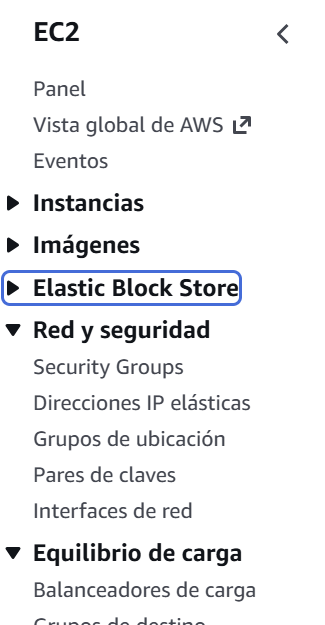
*Figura 1: Acceso a Security Groups en la sección Network & Security de EC2.*

2. En el panel superior, hacer clic en el botón naranja **Create security group** (*Crear grupo de seguridad*).

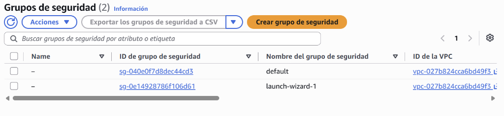
*Figura 2: Creación de un nuevo grupo de seguridad desde el panel de EC2.*

3. Indicar los detalles básicos del grupo (**Basic details**):
   * **Security group name:** `grup-servidors-ftp-ssh`
   * **Description:** `Regles per a RDP, SSH i FTP amb ports passius`
   * **VPC:** La VPC asignada por defecto en el laboratorio.

!!! tip "Regla de nomenclatura en AWS"
    En Amazon Web Services, el nombre de un grupo de seguridad **no puede comenzar por el prefijo `sg-`**, ya que AWS lo reserva internamente para los identificadores únicos del sistema (ej: `sg-0123456789abcdef`). Por ello nombramos el grupo como **`grup-servidors-ftp-ssh`** o **`servidores-ftp-ssh`**.

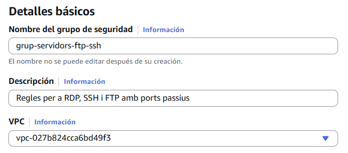
*Figura 3: Configuración del nombre, descripción y VPC del nuevo grupo de seguridad.*


4. En la sección **Inbound rules** (*Reglas de entrada*), pulsar en el botón **Add rule** (*Agregar regla*):

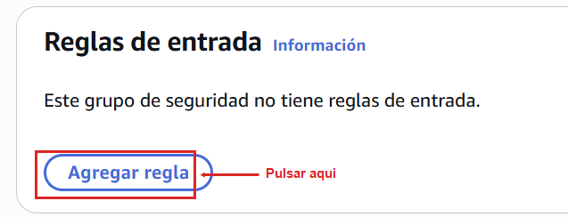
*Figura 4: Ubicación del botón Add rule para definir las aperturas de puertos.*

Añadir las 5 reglas requeridas:
   * **RDP:** Puerto `3389` TCP (para administrar gráficamente la máquina).
   * **SSH:** Puerto `22` TCP (para el servidor OpenSSH).
   * **FTP Control:** Puerto `21` TCP.
   * **FTP Pasivo (Windows):** Rango de puertos `50000-50100` TCP.
   * **FTP Pasivo (Ubuntu):** Rango de puertos `40000-40100` TCP.

> 📷 **Realizar captura de pantalla** de la tabla de reglas de entrada del Security Group donde se vean los puertos 21, 22, 3389, 50000-50100 y 40000-40100.

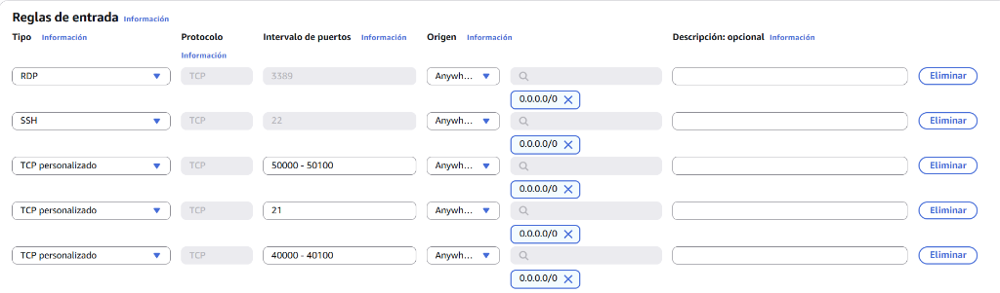
*Figura 5: Definición completa de las 5 reglas de entrada (RDP, SSH, FTP 21 y rangos pasivos).*

5. Bajar hasta el final de la página y pulsar el botón naranja **Create security group**:

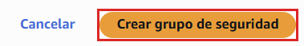
6. Una vez creado, se mostrará el panel resumen del grupo de seguridad con sus 5 reglas activas:

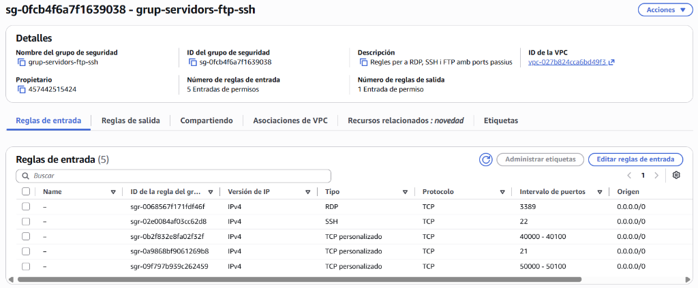
*Figura 7: Resumen del grupo de seguridad grup-servidors-ftp-ssh con sus 5 reglas de entrada operativas.*

7. **Asignación del grupo a la instancia Windows Server:**
   * En el menú lateral izquierdo, hacer clic en **Instances** (*Instancias*).
   * Marcar la casilla de `Servidor_FTPSSH`.
   * En el menú superior, pulsar en **Actions** -> **Security** -> **Change security groups**.

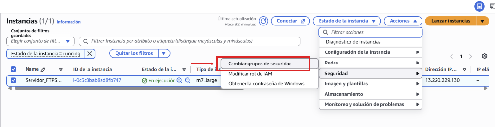
*Figura 8: Opción Change security groups en el menú Actions de la instancia.*

   * Seleccionar `grup-servidors-ftp-ssh`, eliminar el grupo anterior (`launch-wizard-1`) y hacer clic en el botón naranja **Save** (*Guardar*).

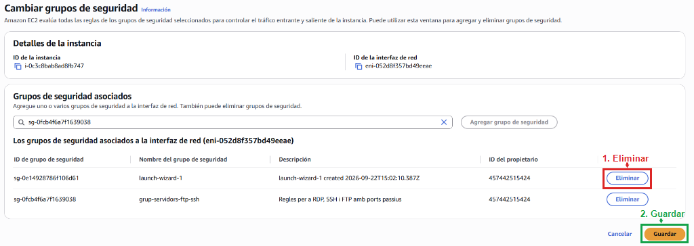
*Figura 9: Ventana de asociación del grupo grup-servidors-ftp-ssh y eliminación del grupo anterior.*

!!! tip "¿Por qué eliminamos launch-wizard-1? ¿Seguirá funcionando el RDP?"
    Al desasociar el grupo `launch-wizard-1` y dejar únicamente `grup-servidors-ftp-ssh`, garantizamos que toda la seguridad se centraliza en un único grupo ordenado y limpio. **No perderás el acceso por RDP**, ya que en el nuevo grupo hemos añadido explícitamente la regla de entrada para el puerto TCP `3389` (RDP).

---

### 6.2 Conexión RDP a la instancia de Windows Server

1. Comprobar que la instancia está en estado `Running` y con `2/2 checks passed` (*2/2 comprobaciones superadas*).
2. Descargar el archivo `.rdp` desde el botón **Connect** -> pestaña **RDP client** -> **Download remote desktop file** (o abrir `mstsc`).
3. Descifrar la contraseña de `Administrator` utilizando vuestro archivo de clave privada `vockey.pem` (o `labsuser.pem`) pulsando en **Get password**.
4. Conectarse al escritorio remoto de Windows Server.

!!! warning "Solo para usuarios con nombre de equipo vinculado a un dominio o SICE"
    Ir a *More choices* -> *Use a different account* e introducir `.\Administrator` en vez de solamente `Administrator`.

> 📷 **Realizar captura de pantalla** del escritorio de Windows Server recién conectado mostrando el Administrador del Servidor (*Server Manager*).

---

### 6.3 Instalación del rol Servidor FTP (IIS) y Servidor OpenSSH

1. En el **Administrador del Servidor** (*Server Manager*), pulsar en el enlace central **Add roles and features** (o en el menú superior **Manage** -> **Add Roles and Features**).

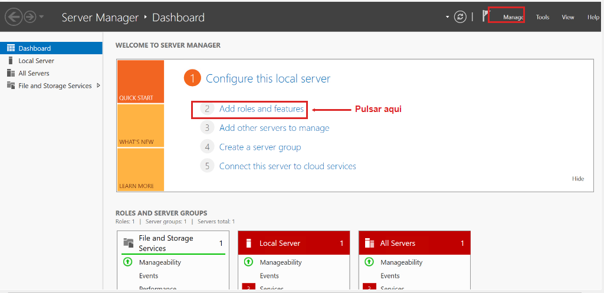
*Figura 10: Acceso al asistente para agregar roles y características desde el Administrador del Servidor (Server Manager).*

2. Avanzar por las pantallas preliminares (*Before You Begin*, *Installation Type* y *Server Selection*) manteniendo los valores por defecto pulsando **Next**.
3. En la pantalla **Server Roles**:
   * Marcar la casilla **Web Server (IIS)** (si aparece la ventana emergente solicitando características requeridas, confirmar haciendo clic en **Add Features**).
4. Avanzar por **Features** y **Web Server Role (IIS)** hasta llegar a la pantalla **Role Services**:
   * Desplegar la categoría **FTP Server** y marcar las casillas **FTP Service** y **FTP Extensibility**.
   * Verificar que en *Management Tools* queda marcada la **IIS Management Console**.

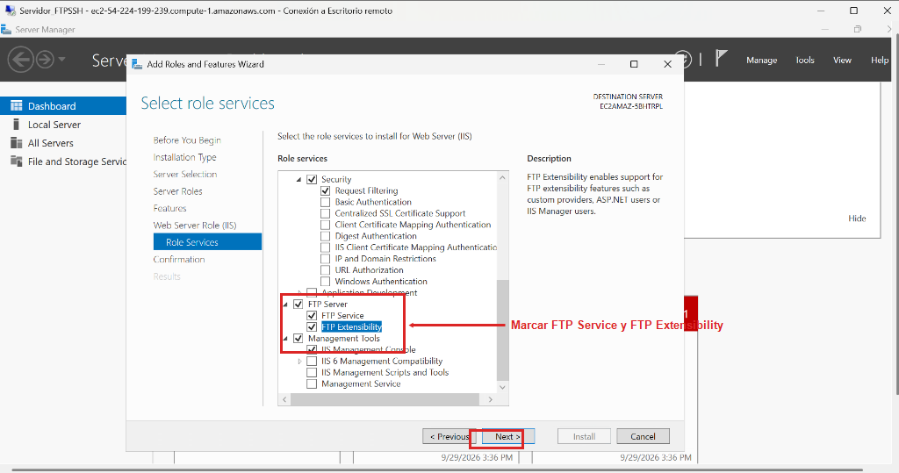
*Figura 11: Selección de los servicios de rol FTP Service y FTP Extensibility en el asistente de instalación.*

5. En la pantalla **Confirmation**, revisar los elementos y pulsar el botón **Install**.
6. Una vez completado el proceso, la barra de progreso mostrará el mensaje **Installation succeeded** y se activará el botón **Close**.

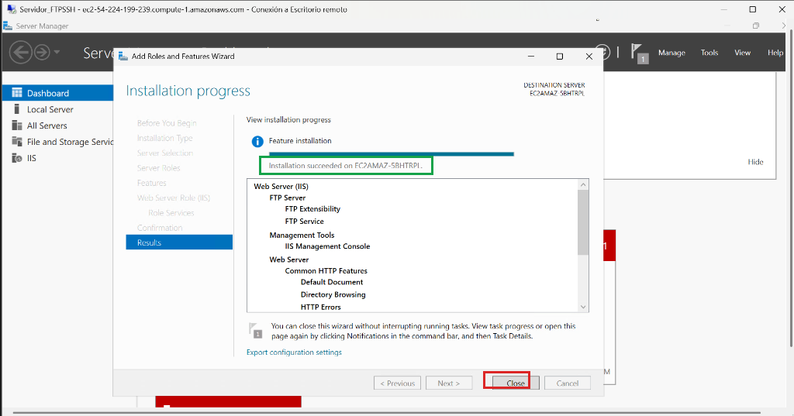
*Figura 12: Barra de instalación completada con éxito para el Servidor Web (IIS) y el Servicio FTP.*

7. Pulsar en el botón **Close** para cerrar el asistente.

---

### 6.3.1 Comprobación y activación del Servidor OpenSSH (Método Gráfico)

En las imágenes oficiales de Windows Server proporcionadas por Amazon Web Services (AWS EC2), la característica de **OpenSSH Server** ya viene preinstalada en el sistema como característica opcional (*Optional feature*), por lo que únicamente es necesario verificar su presencia e iniciar su servicio.

**Comprobación gráfica mediante Configuración:**
1. Pulsar en el botón **Inicio** de Windows -> hacer clic en el icono de **Configuración** (*Settings* - icono de rueda dentada).
2. Entrar en la sección **System** -> **Optional features** (o buscar `optional` en el buscador superior).
3. En la sección **Added features** (Características añadidas), escribir `ssh` en el filtro de búsqueda.
4. Comprobar que **OpenSSH Server** figura ya como instalado (no pulsar el botón *Remove*; pulsar en **Close** para cerrar la ventana).

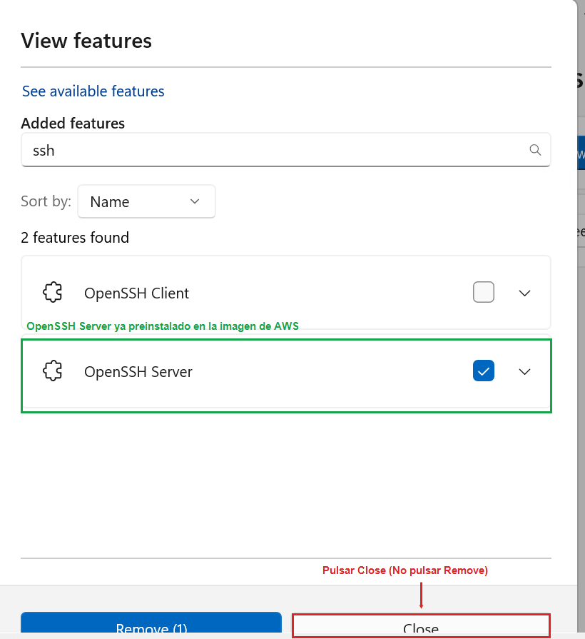
*Figura 13: Comprobación de la característica OpenSSH Server ya preinstalada en la imagen EC2 de AWS.*

**Inicio y arranque del servicio OpenSSH (Consola gráfica de Servicios):**
1. Pulsar `Windows + R`, escribir `services.msc` y pulsar Enter (o desde *Server Manager* -> menú superior *Tools* -> *Services*).
2. Localizar en la lista el servicio **OpenSSH SSH Server**.
3. Hacer clic derecho sobre él -> **Propiedades** (*Properties*):
   * Cambiar el **Tipo de inicio** (*Startup type*) a **Automático** (*Automatic*).
   * Pulsar en el botón **Iniciar** (*Start*).
   * Pulsar **OK**.

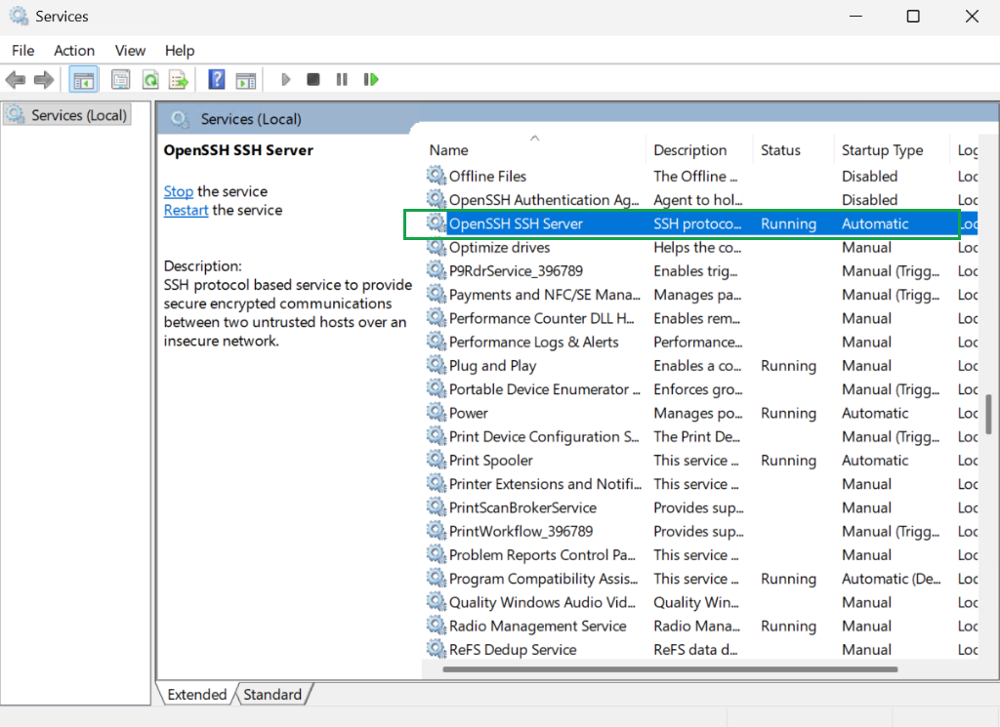
*Figura 14: Consola gráfica de Servicios mostrando OpenSSH SSH Server en estado En ejecución (Running) y con tipo de inicio Automático.*

!!! tip "Alternativa rápida por PowerShell para administradores de sistemas"
    Si prefieres instalar y activar OpenSSH por línea de comandos, abre una consola de **PowerShell como Administrador** y ejecuta:
    ```powershell
    Add-WindowsCapability -Online -Name OpenSSH.Server~~~~0.0.1.0
    Start-Service sshd
    Set-Service -Name sshd -StartupType Automatic
    ```

---

### 6.4 Creación de usuarios locales para el servicio

1. Pulsar clic derecho sobre el botón Inicio de Windows -> **Computer Management** (o ejecutar `compmgmt.msc`).
2. En el panel izquierdo, desplegar **Local Users and Groups** -> carpeta **Users**.
3. Clic derecho en el panel central -> **New User...**:
   * **User name:** `alumne_redes`
   * **Full name:** `Alumne Redes`
   * **Description:** `Usuari per a proves de transferència`
   * **Password:** `Smx2026..@` (y confirmar la contraseña).
   * Desmarcar **User must change password at next logon**.
   * Marcar **User cannot change password** y **Password never expires**.
   * Pulsar en **Create** y luego en **Close**.

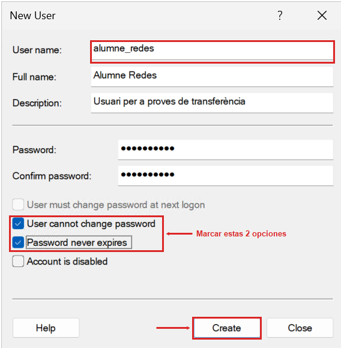
*Figura 15: Ventana de creación del usuario local alumne_redes con las directivas de contraseña configuradas.*

4. Hacer doble clic sobre el usuario `alumne_redes` en la lista -> pestaña **Member Of**:
   * Pulsar en **Add...** -> escribir `Remote Desktop Users` -> pulsar en **Check Names** y **OK**.
   * Pulsar de nuevo en **Add...** -> escribir `Administrators` -> pulsar en **Check Names** y **OK** (imprescindible en las instancias Windows Server de AWS para que el servidor **OpenSSH** autorice el inicio de sesión por SSH y SFTP en el puerto `22`).
   * Comprobar que el usuario pertenece a los tres grupos (`Administrators`, `Remote Desktop Users` y `Users`), y pulsar en **Apply** y **OK**.

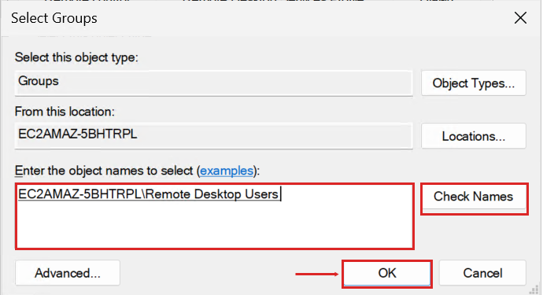
*Figura 16: Selección y comprobación del grupo Remote Desktop Users para el usuario alumne_redes.*

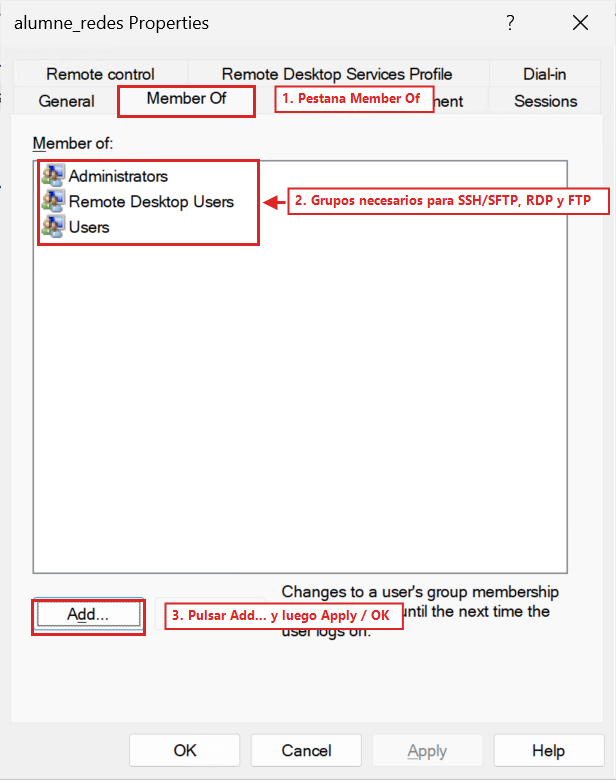
*Figura 16b: Pestaña Member Of mostrando al usuario alumne_redes dentro de Administrators, Remote Desktop Users y Users.*

> 📷 **Realizar captura de pantalla** de la ventana de propiedades (*Properties* -> *Member Of*) del usuario `alumne_redes` mostrando su pertenencia a los grupos `Administrators`, `Remote Desktop Users` y `Users`.

---

### 6.5 Configuración de Compatibilidad de Firewall de FTP y Modo Pasivo en IIS (FTP Firewall Support)

1. Abrir **Internet Information Services (IIS) Manager** (escribir `inetmgr` en Inicio o desde *Server Manager* -> *Tools* -> *Internet Information Services (IIS) Manager*).
2. En el panel izquierdo (*Connections*), hacer clic sobre el nombre del servidor (nodo raíz).
3. En el panel central, localizar la sección **FTP** y hacer doble clic sobre el icono **FTP Firewall Support**:

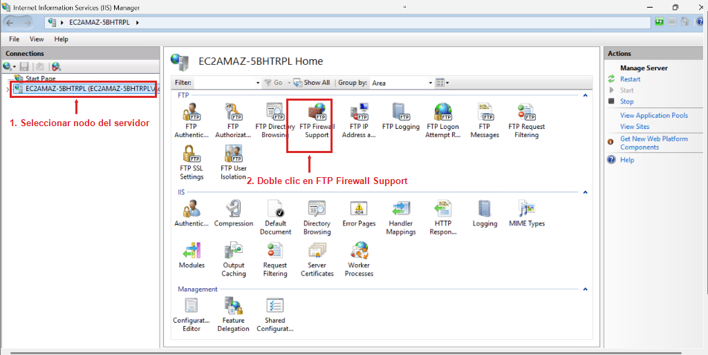
*Figura 17: Selección del nodo raíz del servidor y acceso a FTP Firewall Support en el Administrador de IIS.*

4. Para obtener la dirección IPv4 pública de la máquina virtual, volver a la pestaña del navegador con la consola de **AWS EC2** -> **Instancias** -> seleccionar `Servidor_FTPSSH` y, en la pestaña inferior **Detalles** (*Details*), copiar la **Dirección IPv4 pública** (pulsando sobre el icono de los dos cuadraditos azules situado a la izquierda de la IP):

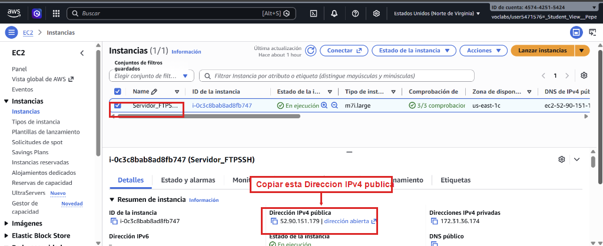
*Figura 18: Localización y copia de la Dirección IPv4 pública de la instancia en la consola de AWS EC2.*

5. De vuelta en la ventana **FTP Firewall Support** de IIS, configurar los parámetros del canal de datos pasivo:
   * **Data Channel Port Range:** Escribir `50000-50100`.
   * **External IP Address of Firewall:** Pegar la **Dirección IPv4 pública actual** de vuestra instancia en AWS (en nuestro ejemplo, `52.90.151.179`).
   * En el panel lateral derecho (*Actions*), hacer clic en **Apply**.

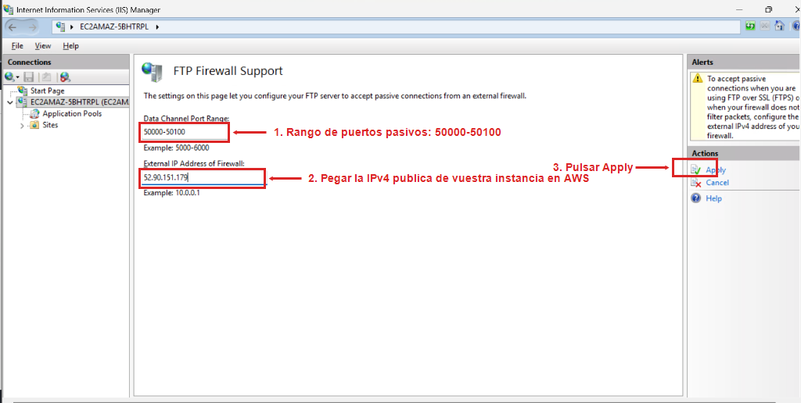
*Figura 19: Configuración del rango de puertos pasivos (50000-50100) y la dirección IPv4 pública externa de AWS.*

6. Al pulsar en **Apply**, aparecerá una ventana informativa recordando que es necesario abrir también dicho rango de puertos en el cortafuegos del sistema (lo cual realizaremos en el apartado 6.7). Pulsar en **OK**.

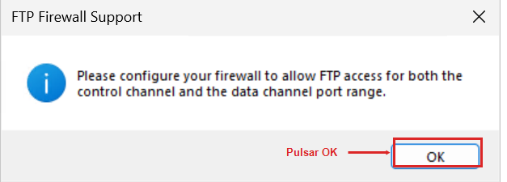
*Figura 19b: Aviso informativo recordando configurar la regla de puertos en el Firewall de Windows.*

!!! warning "¡No olvides poner la IPv4 Pública de AWS!"
    En Amazon Web Services la máquina virtual solo conoce su IP privada interna (`172.31.x.x`). Si dejas en blanco el campo **External IP Address of Firewall**, el servidor FTP responderá a los clientes externos con su IP privada y **FileZilla fallará al listar los directorios** en modo pasivo. Además, recuerda que si detienes y vuelves a iniciar la instancia en otro día de clase, deberás actualizar aquí la nueva IP pública.

> 📷 **Realizar captura de pantalla** del panel FTP Firewall Support con el rango de puertos 50000-50100 y la IP pública de AWS introducidos.

---

### 6.6 Creación del sitio FTP en IIS (Add FTP Site)

1. En el panel izquierdo de IIS (*Connections*), desplegar el servidor, hacer clic derecho sobre la carpeta **Sites** y seleccionar **Add FTP Site...**:

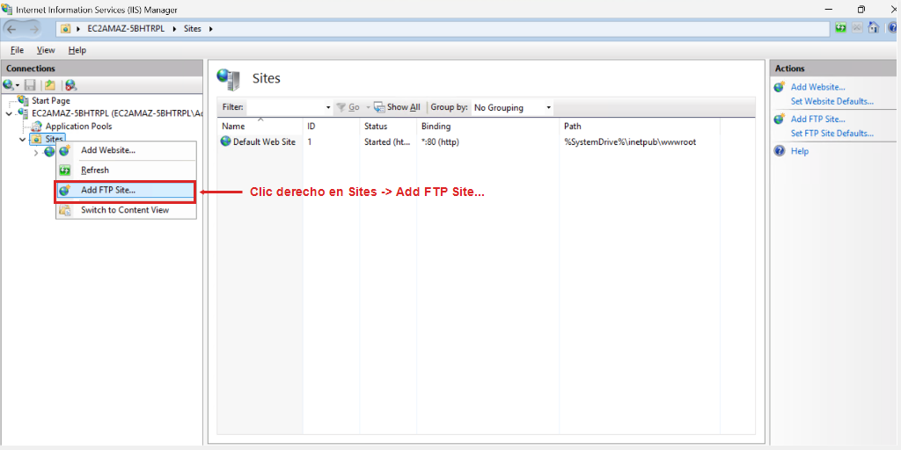
*Figura 20: Menú contextual sobre la carpeta Sites para añadir un nuevo sitio FTP.*

2. **Site Information:**
   * **FTP site name:** `FTP-AULA`
   * **Physical path:** `C:\inetpub\ftproot` -> Pulsar **Next**.

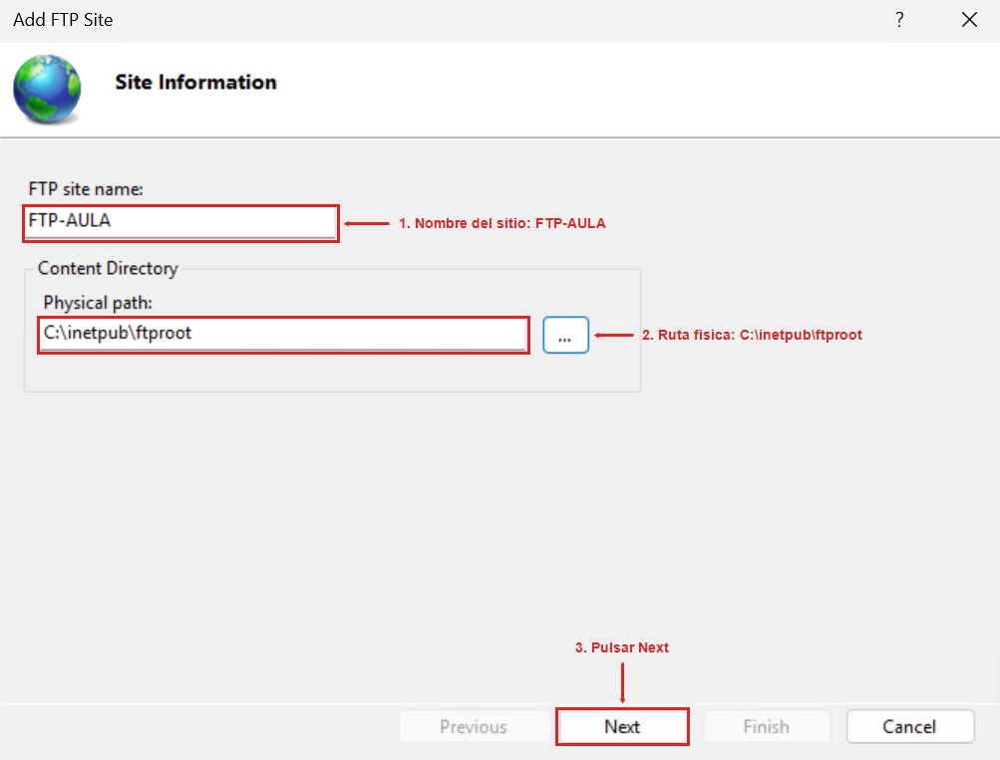
*Figura 21: Definición del nombre del sitio (FTP-AULA) y su directorio raíz físico (C:\inetpub\ftproot).*

3. **Binding and SSL Settings:**
   * **IP Address:** *All Unassigned* | **Port:** `21`.
   * **SSL:** Marcar **No SSL** -> Pulsar **Next**.

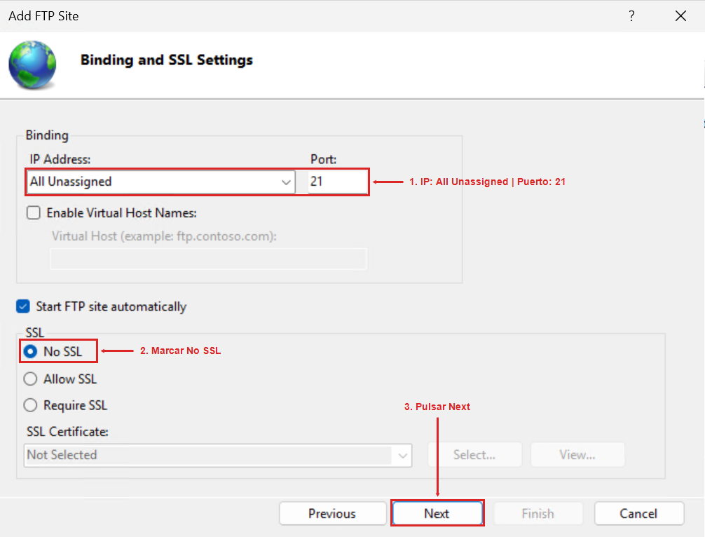
*Figura 22: Configuración del puerto de control 21 TCP y desactivación inicial de SSL.*

4. **Authentication and Authorization Information:**
   * **Authentication:** Marcar **Basic**.
   * **Authorization:** Seleccionar **Specified users** y escribir debajo `alumne_redes`.
   * **Permissions:** Marcar **Read** y **Write** -> Pulsar **Finish**.

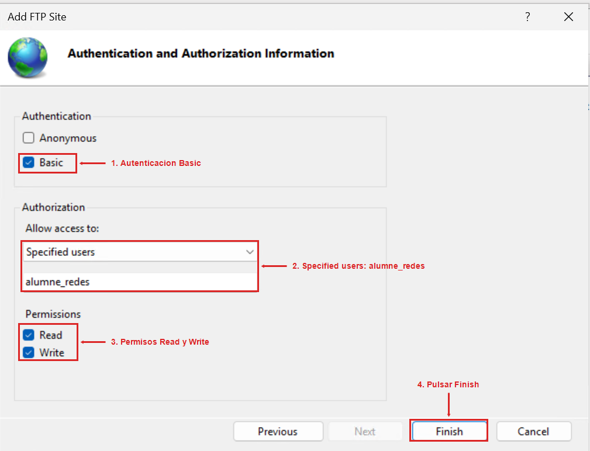
*Figura 23: Habilitación de autenticación básica y permisos de lectura y escritura para el usuario alumne_redes.*

5. Una vez finalizado el asistente, comprobar que el sitio `FTP-AULA` aparece en la lista de **Sites** en estado **Started (ftp)** escuchando por el puerto `21`:

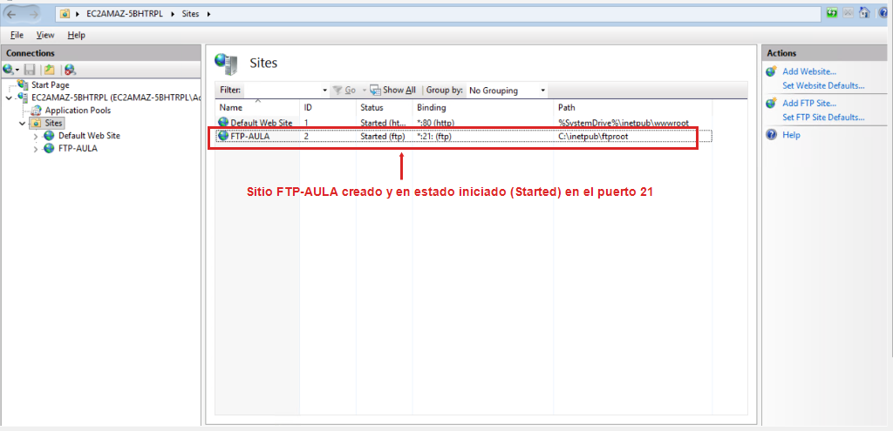
*Figura 24: Sitio FTP-AULA activo y en estado iniciado (Started) en el Administrador de IIS.*

> 📷 **Realizar captura de pantalla** de IIS Manager mostrando el sitio `FTP-AULA` creado y en estado iniciado (*Started*).

---

### 6.6.1 Asignación de permisos NTFS de escritura sobre C:\inetpub\ftproot

Por defecto, Windows Server concede únicamente permisos de **lectura** al grupo de usuarios estándar sobre el directorio físico `C:\inetpub\ftproot`. Aunque en IIS hayamos autorizado *Read* y *Write* para `alumne_redes`, cuando un usuario intenta subir un fichero, Windows comprueba **tanto los permisos FTP de IIS como los permisos NTFS del sistema de archivos** (aplicando siempre el más restrictivo). Por ello, debemos otorgar el permiso **Modify** (*Modificar*) al usuario `alumne_redes` en la carpeta:

1. Abrir el **Explorador de archivos** de Windows, navegar hasta `C:\inetpub`, hacer **clic derecho** sobre la carpeta **`ftproot`** y seleccionar **Properties** (*Propiedades*):

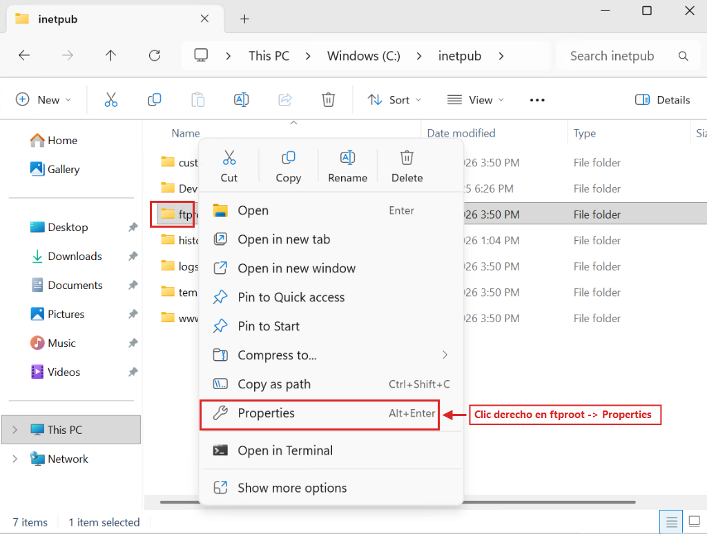
*Figura 24b: Acceso a las propiedades de la carpeta física C:\inetpub\ftproot desde el Explorador de archivos.*

2. En la ventana **ftproot Properties**, abrir la pestaña superior **Security** (*Seguridad*) y pulsar en el botón **Edit...** (*Editar...*):

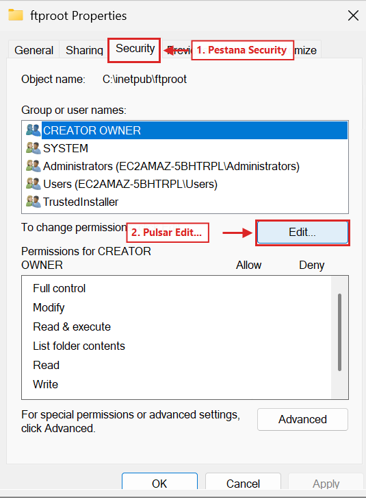
*Figura 24c: Pestaña Security de las propiedades de ftproot y acceso a la edición de permisos NTFS.*

3. En la ventana de permisos, hacer clic en el botón **Add...**, escribir `alumne_redes`, pulsar en **Check Names** para resolver el nombre local completo y hacer clic en **OK**:

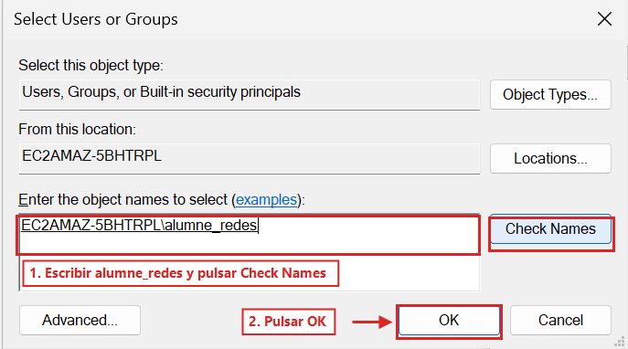
*Figura 24d: Adición del usuario local alumne_redes a la lista de control de acceso (ACL) de la carpeta.*

4. Con el usuario **Alumne Redes (`alumne_redes`)** seleccionado en la lista superior, marcar la casilla **Modify** (*Modificar*) en la columna **Allow** (lo cual activará automáticamente también el permiso *Write*). Finalmente, pulsar en **Apply** y en **OK**:

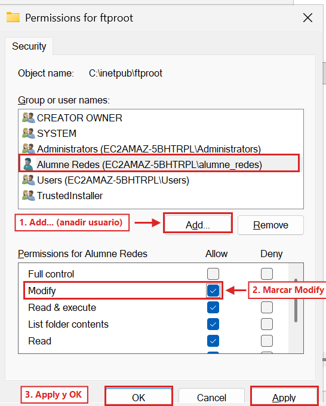
*Figura 24e: Concesión del permiso NTFS Modify (lectura, escritura y modificación) al usuario alumne_redes sobre C:\inetpub\ftproot.*

!!! tip "Permisos válidos tanto para FTP (puerto 21) como para SFTP/SSH (puerto 22)"
    Al asignar estos permisos NTFS directamente a la cuenta local `alumne_redes` sobre `C:\inetpub\ftproot`, el usuario no solo podrá subir y borrar archivos conectándose por **FTP tradicional o FTPS (puerto 21)**, sino que también tendrá acceso completo a dicho directorio cuando se conecte mediante **SSH o SFTP (puerto 22)**.

---

### 6.7 Regla en el Firewall de Windows Defender

1. En el **Administrador del Servidor** (*Server Manager*), desplegar el menú superior **Tools** y seleccionar **Windows Defender Firewall with Advanced Security** (o pulsar `Windows + R` y ejecutar `wf.msc`):

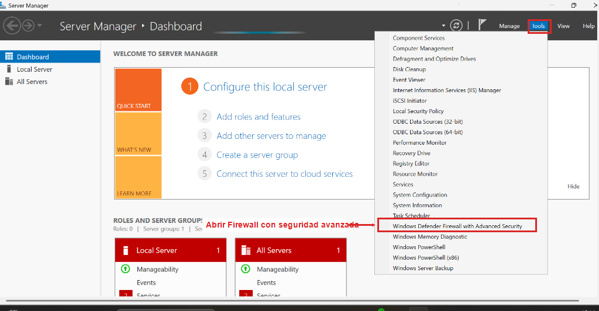
*Figura 25: Apertura de Windows Defender Firewall with Advanced Security desde el menú Tools de Server Manager.*

2. En el árbol izquierdo, seleccionar **Inbound Rules** (*Reglas de entrada*) y en la columna derecha (*Actions*) hacer clic en **New Rule...**:

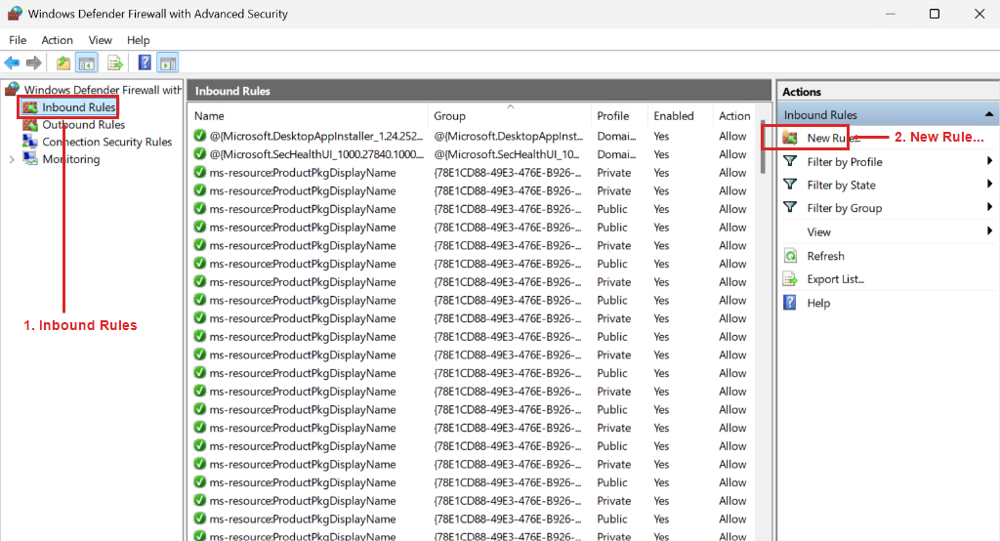
*Figura 26: Selección de Inbound Rules y creación de una nueva regla de entrada.*

3. Configurar los pasos del asistente **New Inbound Rule Wizard**:
   * **Rule Type:** Marcar **Port** y pulsar **Next**.

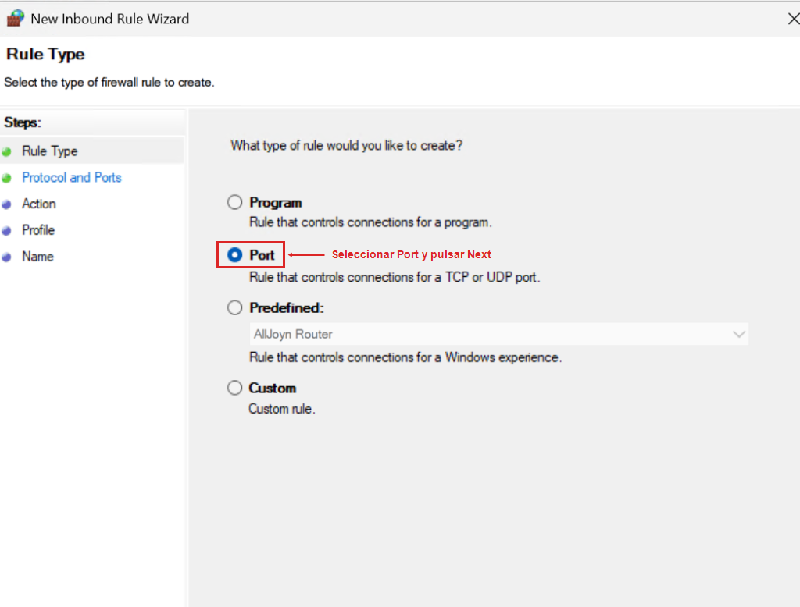
*Figura 27: Selección de regla basada en puerto (Port).*

   * **Protocol and Ports:** Marcar **TCP**, seleccionar **Specific local ports** e introducir el rango `50000-50100` (o escribir directamente `22, 50000-50100` para dejar abierto a la vez el puerto `22` de **OpenSSH Server / SFTP** en el Firewall de Windows). Pulsar **Next**.

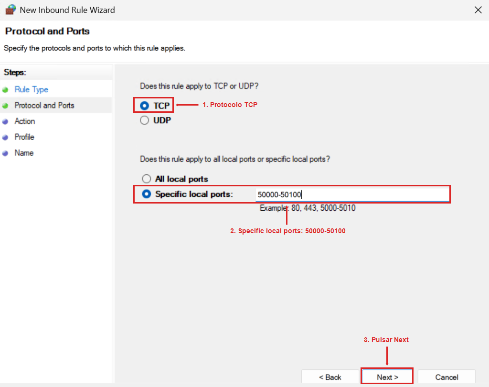
*Figura 28: Apertura del rango de puertos TCP 50000-50100 para el canal de datos pasivo.*

!!! tip "Añadir el puerto 22 (SSH/SFTP) a la regla del Firewall de Windows"
    En las imágenes de Windows Server de AWS, aunque *OpenSSH Server* viene preinstalado, el Firewall de Windows Defender trae cerrado el puerto `22` TCP. Si ya habías creado la regla solo con `50000-50100`, puedes hacer **doble clic** sobre la regla creada (`FTP Pasivo Datos (50000-50100)`), ir a la pestaña **Protocols and Ports**, cambiar *Local port* a **`22, 50000-50100`** y pulsar **Apply** y **OK**:

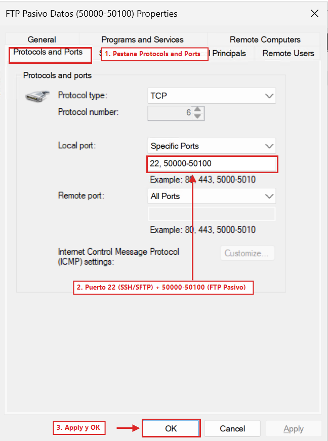
*Figura 28b: Pestaña Protocols and Ports permitiendo simultáneamente el puerto 22 (SSH/SFTP) y el rango 50000-50100 (FTP Pasivo).*

   * **Action:** Marcar **Allow the connection** y pulsar **Next**.

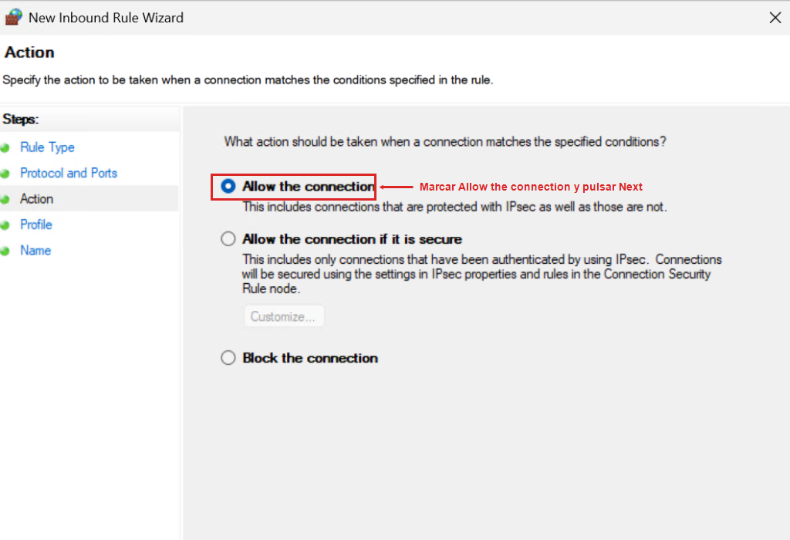
*Figura 29: Autorización de las conexiones entrantes (Allow the connection).*

   * **Profile:** Mantener marcados los tres perfiles (**Domain**, **Private** y **Public**) y pulsar **Next**.
   * **Name:** Escribir `FTP Pasivo Datos (50000-50100)` y pulsar **Finish**.

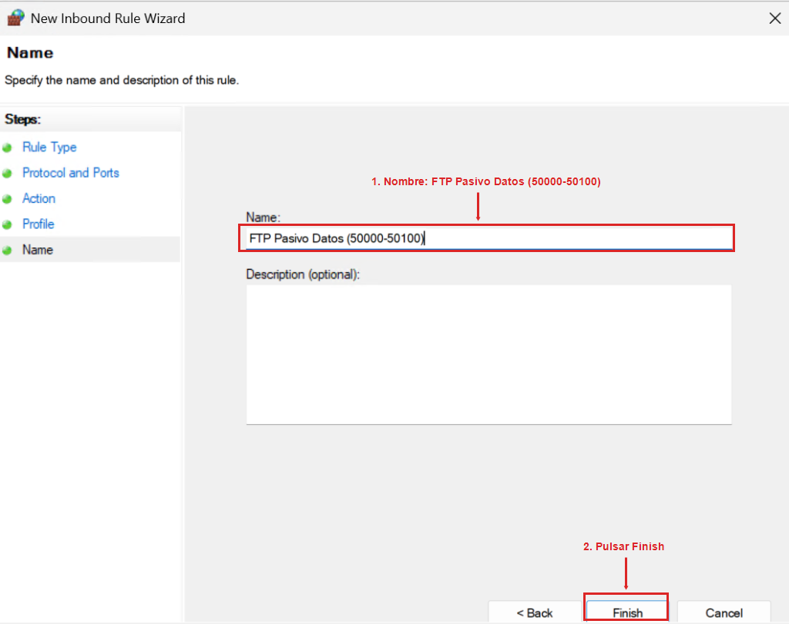
*Figura 30: Nombre descriptivo de la regla para identificar los puertos pasivos de FTP.*

4. **Reiniciar el servicio FTP** para aplicar todos los cambios:
   * Abrir la consola gráfica de **Services** (`services.msc` o desde *Server Manager* -> *Tools* -> *Services*).
   * Localizar **Microsoft FTP Service**, hacer clic derecho sobre él y pulsar en **Restart**.

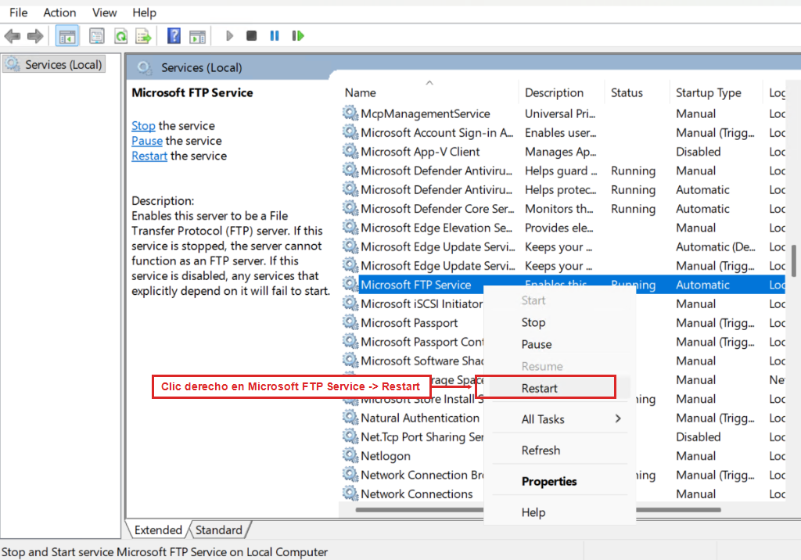
*Figura 31: Reinicio del servicio Microsoft FTP Service desde la consola gráfica de Servicios.*

> 📷 **Realizar captura de pantalla** de la regla `FTP Pasivo Datos (50000-50100)` creada en el Firewall de Windows y del servicio `Microsoft FTP Service` en ejecución.

!!! warning "Entrega de la tarea"
    Elaborar un documento con todas las evidencias de esta práctica (reglas de Security Group en AWS, conexión RDP, instalación de roles IIS FTP y OpenSSH Server, creación del usuario local `alumne_redes`, configuración de firewall de FTP y modo pasivo en IIS, y regla del Firewall de Windows Defender).

    * **Nombre del fichero:** `RA3-CEbcd-1-NombreApellidos.pdf` (ejemplo: `RA3-CEbcd-1-JoanPerez.pdf`).
    * **Entrega:** Subir el archivo en formato PDF a la tarea correspondiente de **Aules** antes de la fecha límite.

---

## 7 Tarea RA3-CEe-1 - [Windows Server] Transferencia de ficheros con FileZilla y diagnóstico de modo pasivo

!!! warning "Obligatorio seguir las normas para la presentación de trabajos escritos."
    Todas las evidencias deberán incluir capturas de pantalla completas donde se aprecie claramente el nombre del equipo, usuario y la fecha/hora.

Una vez instalado y configurado el servidor FTP en **Windows Server (`Servidor_FTPSSH`)**, vamos a verificar inmediatamente desde nuestro equipo del aula que el canal de control (`21` TCP) y el canal de datos en **modo pasivo** (`50000-50100` TCP) funcionan correctamente antes de avanzar a configuraciones más complejas.

---

### 7.1 Conexión y transferencia hacia Windows Server con FileZilla

1. Abrir **FileZilla Client** en vuestro ordenador del aula.
2. En la barra superior de **Conexión rápida** introducir:
   * **Servidor:** `<IP_PUBLICA_WINDOWS>` (en nuestro ejemplo, `52.90.151.179`)
   * **Nombre de usuario:** `alumne_redes`
   * **Contraseña:** `Smx2026..@`
   * **Puerto:** `21` (si se deja en blanco, FileZilla utiliza por defecto el puerto `21`)
3. Pulsar en el botón **Conexión rápida**.
4. Al tratarse inicialmente de una conexión FTP estándar sin cifrar (antes de configurar FTPS en la Tarea 9), FileZilla mostrará la ventana emergente **Conexión FTP insegura** (*Este servidor no es compatible con FTP sobre TLS*). Pulsar en **Aceptar**:

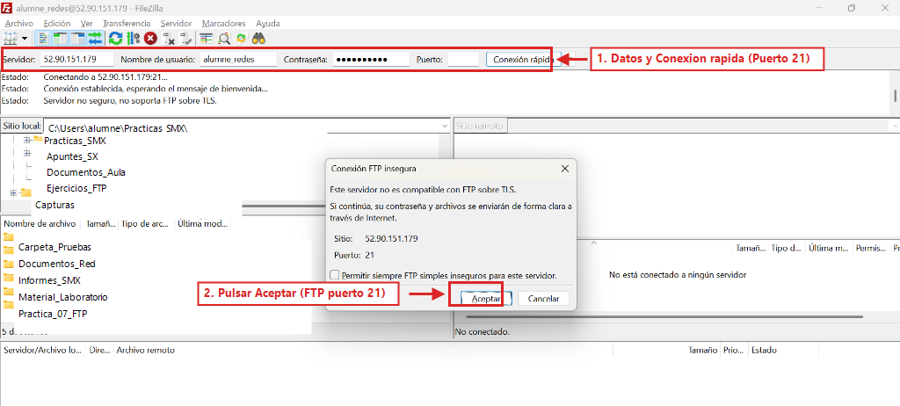
*Figura 32: Introducción de credenciales en la barra de Conexión rápida de FileZilla y confirmación del diálogo de conexión FTP en el puerto 21.*

5. Comprobar que en el log de conexión superior aparece el listado correcto del directorio (`Directorio "/" listado correctamente`) gracias al modo pasivo configurado.
6. Crear en vuestro PC un archivo llamado `Prova_ftp.txt` (o `prueba_win.txt`) y subirlo arrastrándolo al panel derecho (Sitio remoto `/`). Comprobar en la pestaña inferior **Transferencias satisfactorias (1)** que el fichero se ha transferido sin errores:

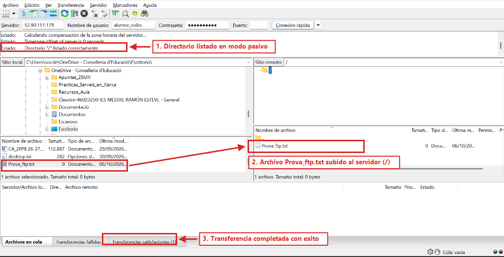
*Figura 33: Directorio raíz listado en modo pasivo y archivo Prova_ftp.txt transferido con éxito al servidor Windows Server.*

> 📷 **Realizar captura de pantalla** de FileZilla mostrando la conexión exitosa en modo pasivo y el archivo subido al servidor Windows Server.

---

### 7.2 Diagnóstico de avería: Bloqueo del modo pasivo por cortafuegos o IP externa

* **Escenario de la incidencia:** Un usuario introduce su usuario y contraseña en FileZilla correctamente (`230 User logged in`), pero justo después la conexión se queda congelada mostrando `Comando: MLSD` o `LIST` y tras 20 segundos devuelve `Error: Conexión superó el tiempo de espera. No se pudo recuperar el listado del directorio`.
* **Causa técnica:** El canal de control (puerto `21`) está abierto, pero el canal de datos pasivo (`50000-50100`) está bloqueado por el Firewall de Windows Defender (`wf.msc`), por el Security Group de AWS, o bien se olvidó introducir la IPv4 pública de AWS en **FTP Firewall Support** de IIS.
* **Comprobación práctica:**
  1. Verificar en el log superior de FileZilla que el servidor responde al comando `PASV` con la IP pública correcta y un puerto del rango `50000-50100`.
  2. Verificar en Windows Server que la regla `FTP Pasivo Datos (50000-50100)` está activa en `wf.msc`.

!!! warning "Entrega de la tarea"
    Elaborar un documento con las capturas de pantalla de la conexión realizada con FileZilla Client hacia Windows Server, mostrando el aviso inicial de protocolo sin cifrar, el listado correcto del directorio en modo pasivo y la transferencia del fichero (`Prova_ftp.txt`) completada con éxito.

    * **Nombre del fichero:** `RA3-CEe-1-NombreApellidos.pdf` (ejemplo: `RA3-CEe-1-JoanPerez.pdf`).
    * **Entrega:** Subir el archivo en formato PDF a la tarea correspondiente de **Aules** antes de la fecha límite.

---

## 8 Tarea RA3-CEd-1 - [Windows Server] Aislamiento de usuarios (User Isolation), carpeta pública y permisos NTFS

!!! warning "Obligatorio seguir las normas para la presentación de trabajos escritos."
    Todas las evidencias deberán incluir capturas de pantalla completas donde se aprecie claramente el nombre del equipo, usuario y la fecha/hora.

En un entorno empresarial real, cada departamento o usuario debe disponer de un espacio privado exclusivo para almacenar sus ficheros confidenciales, sin que otros usuarios puedan acceder ni manipularlos. Además, suele habilitarse una carpeta pública compartida (para catálogos, formularios o drivers) accesible por cualquier usuario de forma anónima, pero con permisos estrictos de solo lectura.

---

### 8.1 Creación de usuarios departamentales y estructura LocalUser en Windows Server

1. Abrir **Computer Management** (`compmgmt.msc`).
2. Desplegar **Local Users and Groups** -> carpeta **Users**.
3. Crear dos usuarios locales nuevos (**New User...**):
   * **User 1:** `usuari_ventas` (Password: `Smx2026..@`).
   * **User 2:** `usuari_compras` (Password: `Smx2026..@`).
   * Para ambos usuarios: desmarcar **User must change password at next logon**, y marcar **User cannot change password** y **Password never expires**.
4. Abrir **File Explorer** en `C:\inetpub\ftproot` y crear la siguiente estructura exacta de carpetas y archivos de prueba dentro de `LocalUser` (en IIS, cuando se activa el aislamiento por nombre de usuario, los usuarios locales entran en `LocalUser\<usuario>` y el usuario `anonymous` entra automáticamente en `LocalUser\Public`):
   ```text
   C:\inetpub\ftproot\
   └── LocalUser\
       ├── alumne_redes\
       ├── usuari_ventas\
       │   └── informe_ventas_privado.txt
       ├── usuari_compras\
       │   └── presupuesto_compras_privado.txt
       └── Public\
           └── catalogo_empresa_2026.pdf
   ```
5. Conceder permisos NTFS de modificación (**Modify**) a `usuari_ventas` sobre su carpeta `C:\inetpub\ftproot\LocalUser\usuari_ventas` y a `usuari_compras` sobre `C:\inetpub\ftproot\LocalUser\usuari_compras` (pestaña **Security** -> **Edit...** -> **Add...**), manteniendo la carpeta `LocalUser\Public` únicamente con permisos de lectura para `IUSR` / `Users`:

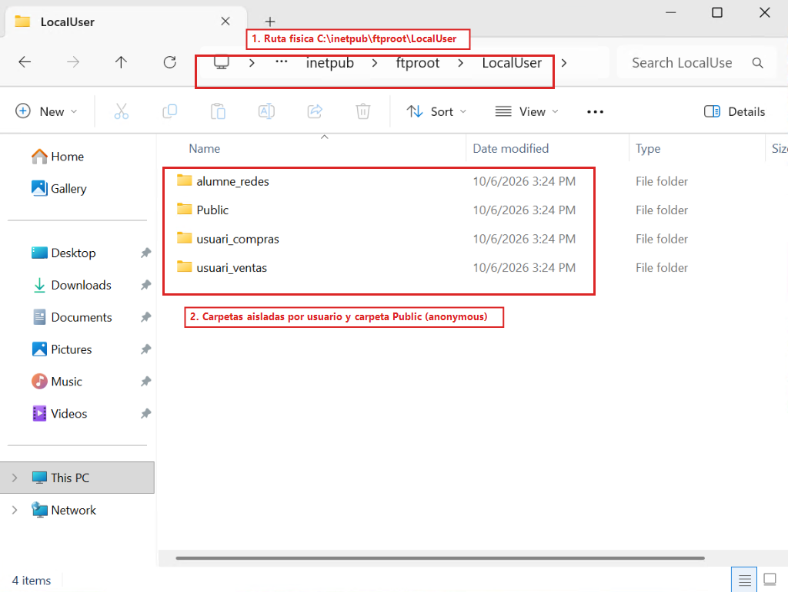
*Figura 33b: Estructura física de carpetas en C:\inetpub\ftproot\LocalUser para usuarios locales aislados y carpeta Public para acceso anónimo.*

> 📷 **Realizar captura de pantalla** de File Explorer en Windows Server mostrando la estructura de carpetas dentro de `C:\inetpub\ftproot\LocalUser`.

---

### 8.2 Configuración del Aislamiento de Usuarios en IIS (FTP User Isolation)

1. Abrir **Internet Information Services (IIS) Manager** (`inetmgr`).
2. Desplegar el servidor -> carpeta **Sites** -> hacer clic sobre el sitio **`FTP-AULA`**.
3. En el panel central, hacer doble clic sobre el icono **FTP User Isolation**.
4. Dentro de *Isolate users. Restrict users to the following directory:*, seleccionar la opción: **User name directory (disable global virtual directories)**.
5. En el panel lateral derecho (*Actions*), hacer clic en **Apply**:

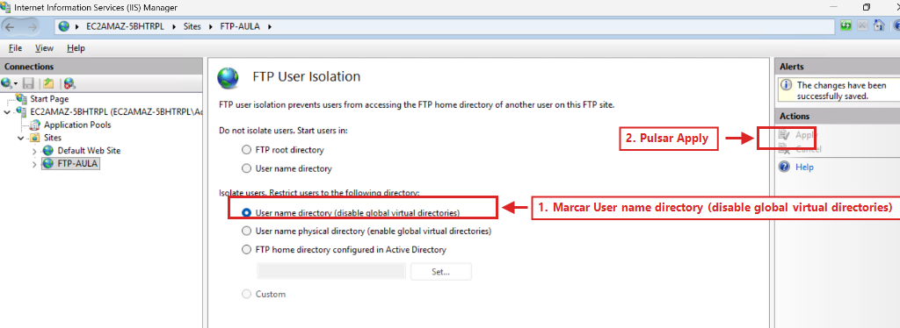
*Figura 33c: Activación de la directiva User name directory (disable global virtual directories) en FTP User Isolation.*

---

### 8.3 Configuración de Acceso Anónimo (Solo Lectura) y Reglas de Autorización

1. En IIS, seleccionar el sitio **`FTP-AULA`** -> hacer doble clic en el icono **FTP Authentication**:
   * Seleccionar **Anonymous Authentication** y en el panel derecho (*Actions*) pulsar en **Enable** para que su estado pase a **Enabled** (junto con **Basic Authentication** en **Enabled**).
2. Volver al sitio **`FTP-AULA`** -> hacer doble clic en el icono **FTP Authorization Rules**:
   * Pulsar en **Add Allow Rule...** en el panel derecho:
     - **Regla 1 (Usuarios departamentales con Lectura y Escritura):** Seleccionar **Specified users**, escribir `alumne_redes, usuari_ventas, usuari_compras` y marcar los permisos **Read** y **Write** -> pulsar **OK**.
     - **Regla 2 (Usuarios anónimos con Solo Lectura):** Pulsar de nuevo en **Add Allow Rule...**, seleccionar **All anonymous users** y en *Permissions* marcar únicamente **Read** (manteniendo **Write** desmarcado) -> pulsar **OK**:

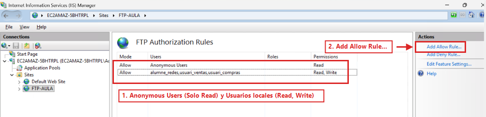
*Figura 33d: Reglas de autorización en FTP Authorization Rules concediendo solo lectura a Anonymous Users y lectura/escritura a los usuarios locales.*

---

### 8.4 Verificación del aislamiento y permisos desde FileZilla

1. Abrir **FileZilla Client** en vuestro PC del aula.
2. **Prueba de usuario aislado (`usuari_ventas`):**
   * En la barra de **Conexión rápida**, introducir Servidor `<IP_PUBLICA_WINDOWS>`, Nombre de usuario `usuari_ventas`, Contraseña `Smx2026..@` y Puerto `21` -> pulsar **Conexión rápida**.
   * Comprobar que accede directamente a su raíz privada (`/`) donde ve exclusivamente su archivo `informe_ventas_privado.txt`, sin posibilidad de subir de nivel ni ver la carpeta de `usuari_compras`:

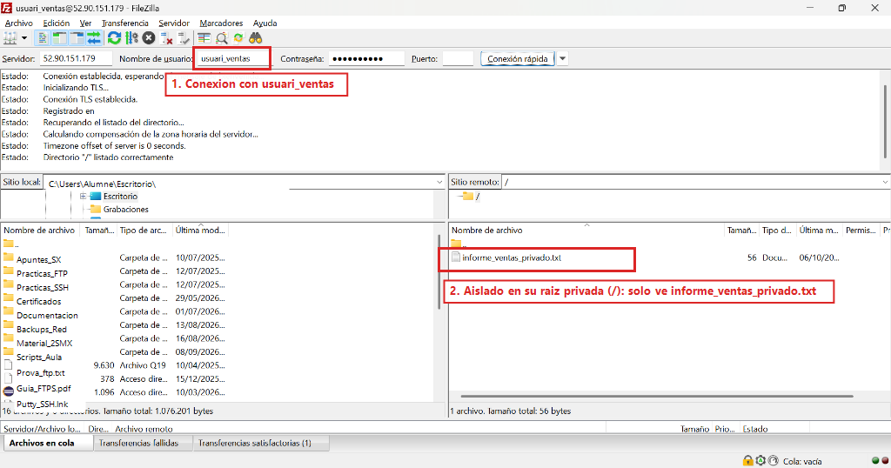
*Figura 33e: Usuario usuari_ventas enjaulado en su directorio privado viendo únicamente informe_ventas_privado.txt.*

3. **Prueba de usuario anónimo (`anonymous` - Solo Lectura):**
   * En la barra de **Conexión rápida**, introducir Servidor `<IP_PUBLICA_WINDOWS>`, Nombre de usuario `anonymous` (o dejar usuario y contraseña en blanco) y Puerto `21` -> pulsar **Conexión rápida**.
   * Comprobar que accede directamente a la carpeta pública (`LocalUser\Public`) y ve el archivo `catalogo_empresa_2026.pdf` (pudiendo descargarlo sin problema).
   * Intentar **borrar `catalogo_empresa_2026.pdf`** (o subir un archivo desde el panel izquierdo hacia el servidor).
   * Comprobar que el servidor FTP deniega la escritura o el borrado devolviendo el código de error **`Respuesta: 550 Access is denied`**:

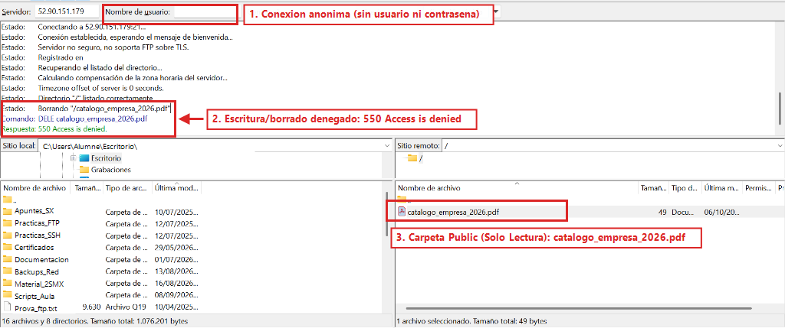
*Figura 33f: Acceso anónimo de solo lectura a la carpeta Public con denegación de borrado/escritura (550 Access is denied).*

> 📷 **Realizar captura de pantalla** de FileZilla mostrando la vista privada de `usuari_ventas` y otra captura mostrando el error `550 Access is denied` al intentar subir o borrar un fichero como usuario `anonymous`.

---

### 8.5 Diagnóstico de avería: Error 550 en usuarios locales por discrepancia de permisos NTFS

* **Escenario de la incidencia:** El usuario `usuari_ventas` se conecta por FTP correctamente, pero al intentar subir un fichero o crear una carpeta en su propio directorio recibe `Respuesta: 550 Access is denied`.
* **Causa técnica:** Aunque en IIS Manager las *FTP Authorization Rules* permitan escribir (`Read, Write`), los permisos de seguridad del sistema de ficheros de Windows (**NTFS**) de la carpeta física `C:\inetpub\ftproot\LocalUser\usuari_ventas` no conceden permiso de modificación (`Modify`) al usuario local.
* **Resolución:** Hacer clic derecho sobre la carpeta del usuario -> **Properties** -> pestaña **Security** -> **Edit...** -> **Add...** -> añadir al usuario y marcar **Modify** y **Write**.

!!! warning "Entrega de la tarea"
    Elaborar un documento con las evidencias del aislamiento y permisos en Windows Server: estructura de carpetas en `C:\inetpub\ftproot\LocalUser` y `Public`, configuración de `FTP User Isolation` y `FTP Authorization Rules` en IIS, y comprobación en FileZilla con el usuario privado `usuari_ventas` y el usuario `anonymous` (mostrando el error de solo lectura `550 Access is denied`).

    * **Nombre del fichero:** `RA3-CEd-1-NombreApellidos.pdf` (ejemplo: `RA3-CEd-1-JoanPerez.pdf`).
    * **Entrega:** Subir el archivo en formato PDF a la tarea correspondiente de **Aules** antes de la fecha límite.

---

## 9 Tarea RA3-CEf-1 - [Windows Server] Seguridad y cifrado con FTPS (FTP sobre TLS/SSL)

!!! warning "Obligatorio seguir las normas para la presentación de trabajos escritos."
    Todas las evidencias deberán incluir capturas de pantalla completas donde se aprecie claramente el nombre del equipo, usuario y la fecha/hora.

El protocolo FTP tradicional transmite contraseñas y datos en texto claro sin cifrar. En esta tarea aseguraremos nuestro servidor **Windows Server (`Servidor_FTPSSH`)** mediante **FTPS (FTP sobre SSL/TLS)**, creando un certificado digital autofirmado en IIS e implementando cifrado obligatorio.

---

### 9.1 Creación de un Certificado Digital Autofirmado en Windows Server

1. Abrir **Internet Information Services (IIS) Manager** (`inetmgr`).
2. En el panel izquierdo (*Connections*), hacer clic sobre el **nombre del servidor** (nodo raíz).
3. En el panel central, dentro del bloque **IIS**, hacer doble clic en el icono **Server Certificates**:

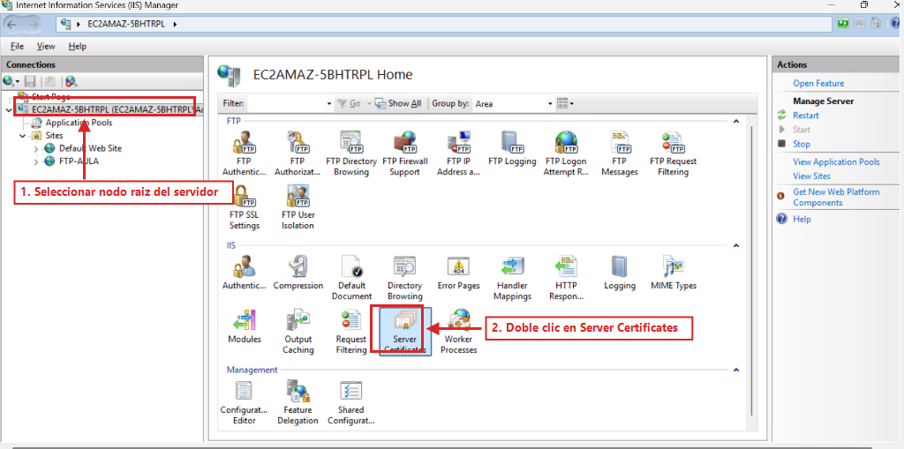
*Figura 36: Selección del nodo raíz del servidor y acceso a Server Certificates en IIS Manager.*

4. En el panel lateral derecho (*Actions*), hacer clic en el enlace **Create Self-Signed Certificate...**:

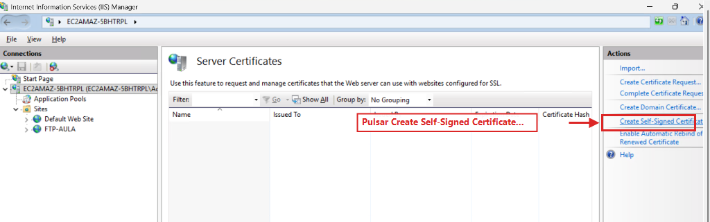
*Figura 37: Acceso al asistente de creación de certificado autofirmado.*

5. En la ventana **Specify Friendly Name**:
   * **Specify a friendly name for the certificate:** `Certificado-FTPs-Aula`
   * **Select a certificate store for the new certificate:** Mantener seleccionado `Personal`.
   * Pulsar en **OK**.

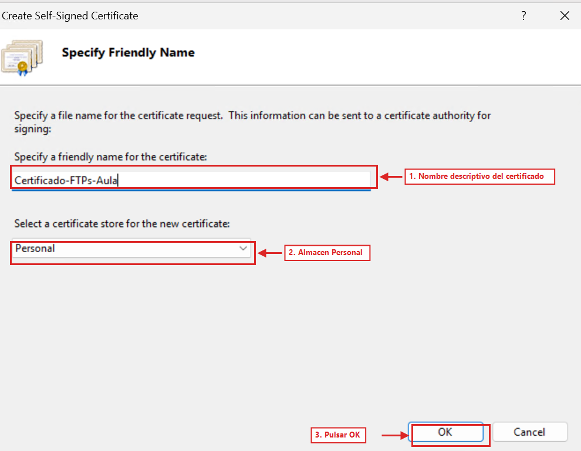
*Figura 38: Configuración del nombre descriptivo Certificado-FTPs-Aula en el almacén Personal.*

6. Comprobar que el certificado `Certificado-FTPs-Aula` aparece listado en el panel central de **Server Certificates** con su fecha de caducidad (*Expiration Date*) y su huella (*Certificate Hash*):

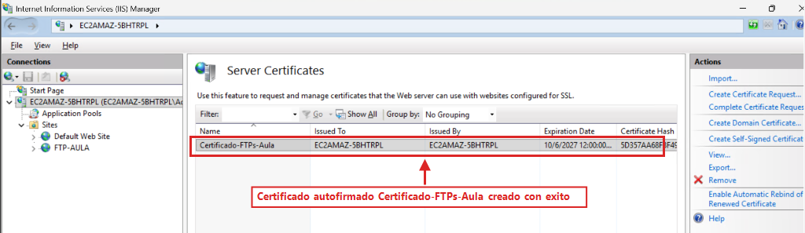
*Figura 39: Certificado digital Certificado-FTPs-Aula generado en el servidor.*

> 📷 **Realizar captura de pantalla** del panel Server Certificates mostrando el nuevo certificado creado con su fecha de caducidad y emisor.

---

### 9.2 Configuración del cifrado SSL en el sitio FTP (FTP SSL Settings)

1. En el panel izquierdo de IIS, desplegar **Sites** y hacer clic sobre el sitio FTP **`FTP-AULA`**.
2. En el panel central, hacer doble clic en el icono **FTP SSL Settings**:

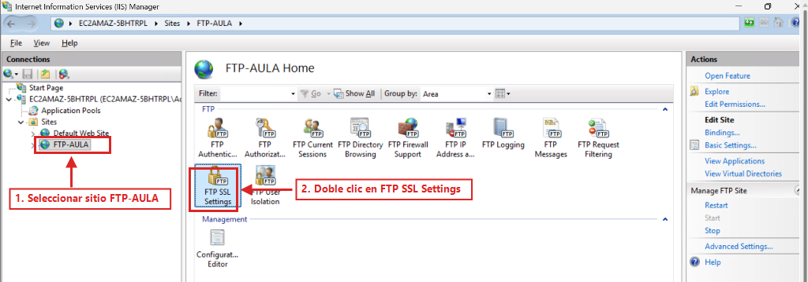
*Figura 40: Selección del sitio FTP-AULA y apertura de FTP SSL Settings.*

3. Configurar el cifrado del sitio:
   * En el desplegable **SSL Certificate**, seleccionar `Certificado-FTPs-Aula`.
   * En la directiva **SSL Policy**, marcar **Require SSL connections**.
   * En el panel lateral derecho (*Actions*), hacer clic en **Apply**.

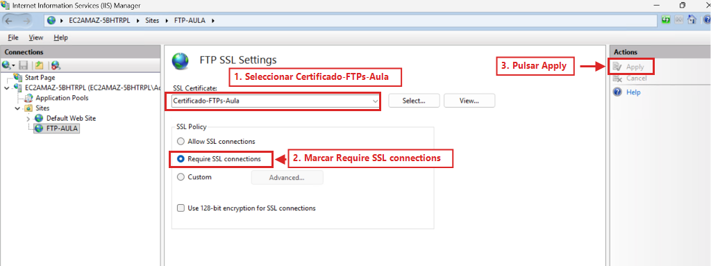
*Figura 41: Asignación del certificado Certificado-FTPs-Aula y activación de Require SSL connections en FTP SSL Settings.*

4. Reiniciar el sitio FTP pulsando en **Restart** dentro de la sección *Manage FTP Site* de la columna derecha de IIS (o reiniciando **Microsoft FTP Service** desde `services.msc`).

---

### 9.3 Conexión segura con FileZilla y validación de certificado TLS

1. Abrir **FileZilla Client** en vuestro PC del aula.
2. Conectar hacia el servidor en el puerto **`21`** (podéis hacerlo directamente desde la barra de **Conexión rápida** introduciendo Servidor `<IP_PUBLICA_WINDOWS>`, Usuario `alumne_redes`, Contraseña `Smx2026..@` y Puerto `21`, ya que FileZilla negocia automáticamente **FTP explícito sobre TLS** si el servidor lo soporta, o bien guardando el perfil en **Archivo** -> **Gestor de sitios...** con cifrado *Requiere FTP explícito sobre TLS*).
3. Pulsar en **Conexión rápida** (o **Conectar**).
4. Al establecer la negociación segura en el puerto `21`, aparecerá la ventana emergente **Certificado desconocido**:
   * Revisar la información del bloque **Certificado**: huella digital (**SHA-256**) y período de validez, así como los **Detalles de la sesión** (`Protocolo: TLS1.2`, `Cifrado: AES-256-GCM`).
   * Marcar la casilla **Confiar siempre en este certificado en futuras sesiones**.
   * Pulsar en **Aceptar**:

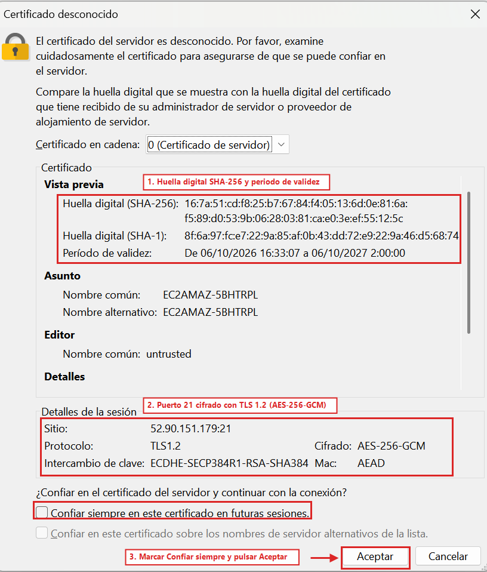
*Figura 42: Verificación del certificado digital autofirmado (SHA-256) y sesión cifrada TLS 1.2 (AES-256-GCM) en el puerto 21.*

5. Comprobar en el panel de log de FileZilla que se negocia el cifrado del canal de datos (`Respuesta: 200 PBSZ command successful` y `Comando: PROT P` -> `200 PROT command successful`) y se lista el directorio raíz (`Directorio "/" listado correctamente`).
6. En la barra de estado inferior derecha de FileZilla, comprobar que aparece el **icono del candado cerrado** indicando que tanto el canal de control como el canal de datos viajan cifrados mediante TLS 1.2:

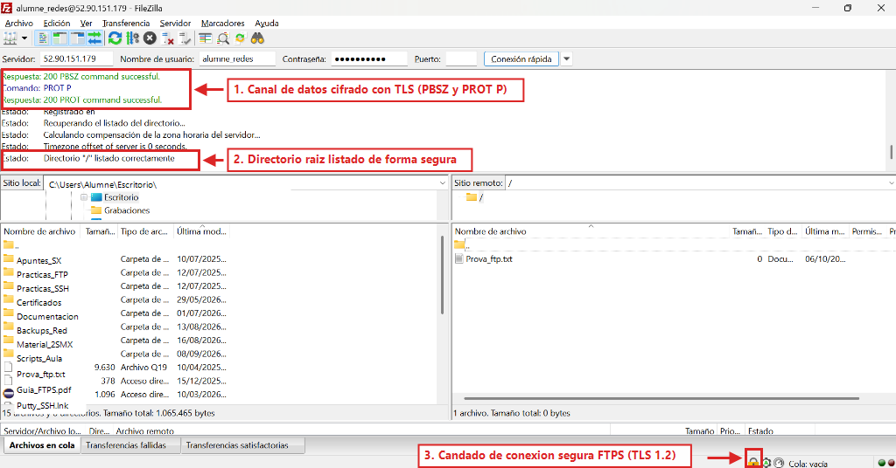
*Figura 43: Conexión FTPS establecida en el puerto 21 con cifrado del canal de datos (PROT P) y candado de seguridad activo.*

> 📷 **Realizar captura de pantalla** de la ventana del certificado en FileZilla mostrando la huella digital SHA-256 y de FileZilla conectado con el candado de conexión segura activo.

!!! warning "Entrega de la tarea"
    Elaborar un documento con las evidencias de la creación del certificado digital autofirmado `Certificado-FTPs-Aula` en IIS, la configuración de la directiva `Require SSL connections` en el sitio FTP, y las capturas en FileZilla con la validación de la huella digital SHA-256 y el icono del candado de conexión segura.

    * **Nombre del fichero:** `RA3-CEf-1-NombreApellidos.pdf` (ejemplo: `RA3-CEf-1-JoanPerez.pdf`).
    * **Entrega:** Subir el archivo en formato PDF a la tarea correspondiente de **Aules** antes de la fecha límite.

---

## 10 Tarea RA6-CEbcd-1 - [Windows Server] Administración remota y bastionado de SSH con PuTTY y PuTTYgen

!!! warning "Obligatorio seguir las normas para la presentación de trabajos escritos."
    Todas las evidencias deberán incluir capturas de pantalla completas donde se aprecie claramente el nombre del equipo, usuario y la fecha/hora.

El acceso por contraseña convencional está expuesto a ataques de fuerza bruta. En esta tarea aprovecharemos el servicio **OpenSSH Server** que dejamos activo en **Windows Server (`Servidor_FTPSSH`)** en el apartado 6.3.1 para conectar remotamente por el puerto `22` con **PuTTY**, generar un par de claves asimétricas con **PuTTYgen** y bastionar el servidor deshabilitando el acceso por contraseña.

---

### 10.1 Conexión SSH básica hacia Windows Server con PuTTY

1. Abrir **PuTTY** en vuestro PC del aula.
2. En el campo **Host Name (or IP address)** introducir la **IP pública de Windows Server** (`<IP_PUBLICA_WINDOWS>`), **Port** `22` y **Connection type** `SSH`.
3. Pulsar en **Open**, aceptar la clave host del servidor (`Accept`) e iniciar sesión con el usuario `alumne_redes` y su contraseña (`Smx2026..@`).
4. Ejecutar los comandos `whoami` y `hostname` para verificar que estamos dentro de la consola remota de Windows Server:

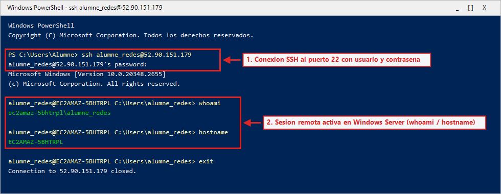
*Figura 45: Inicio de sesión remota SSH en el puerto 22 hacia Windows Server y comprobación de usuario y nombre de host.*

---

### 10.2 Generación del par de claves con PuTTYgen

1. En vuestro ordenador del aula, abrir **PuTTYgen** (*PuTTY Key Generator*).
2. En la parte inferior (*Parameters*), mantener seleccionado el tipo de clave **RSA** (`2048` bits) o **EdDSA (Ed25519)**.
3. Pulsar en el botón **Generate** y mover continuamente el cursor del ratón sobre el área vacía para generar entropía criptográfica aleatoria.
4. En el campo **Key comment**, escribir: `alumne_redes@ies-mre`.
5. Pulsar en **Save private key** (confirmar guardar sin contraseña de paso para este laboratorio) y guardarla como `clave_privada_smx.ppk` en vuestra carpeta de trabajo.
6. En el cuadro superior que indica *Public key for pasting into OpenSSH authorized_keys file*, seleccionar y **copiar todo el texto completo de la clave pública** (`ssh-rsa AAAA...`).

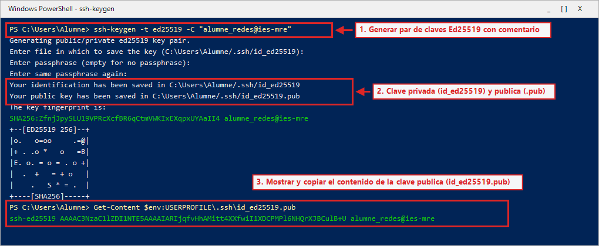
*Figura 46: Generación del par de claves asimétricas y visualización de la clave pública.*

> 📷 **Realizar captura de pantalla** de la ventana de PuTTYgen mostrando la clave generada y el comentario `alumne_redes@ies-mre`.

---

### 10.3 Instalación de la clave pública en Windows Server y ajuste de sshd_config

1. En el Escritorio Remoto (RDP) de **Windows Server**:
   * Abrir el **Bloc de notas (Notepad)** como Administrador.
   * Abrir el fichero `C:\ProgramData\ssh\sshd_config` (seleccionando *All Files `(*.*)`* en el diálogo de apertura).
   * Bajar hasta las dos últimas líneas del archivo (`Match Group administrators` y `AuthorizedKeysFile __PROGRAMDATA__/ssh/administrators_authorized_keys`) y **comentarlas añadiendo una almohadilla `#` delante de cada una** para que Windows utilice siempre la carpeta `.ssh` estándar de cada usuario:
     ```ini
     #Match Group administrators
     #       AuthorizedKeysFile __PROGRAMDATA__/ssh/administrators_authorized_keys
     ```
   * Guardar el archivo (`File` -> `Save`).
2. Crear la carpeta `C:\Users\alumne_redes\.ssh` (si no existe) y dentro de ella crear con **Notepad** el archivo **`authorized_keys`** (sin extensión `.txt`), pegando en una sola línea la clave pública copiada desde PuTTYgen.
3. Reiniciar el servicio **OpenSSH SSH Server** desde la consola gráfica `services.msc`.

---

### 10.4 Conexión automática mediante clave privada en PuTTY

1. Abrir **PuTTY** en vuestro PC del aula:
   * **Host Name:** IP pública de Windows Server (`<IP_PUBLICA_WINDOWS>`). **Port:** `22`.
2. En el árbol izquierdo, desplegar **Connection** -> **SSH** -> **Auth** -> **Credentials**.
3. En el campo **Private key file for authentication**, hacer clic en **Browse...** y seleccionar vuestro archivo `clave_privada_smx.ppk`.
4. En el menú izquierdo, ir a **Connection** -> **Data** y en **Auto-login username** escribir `alumne_redes`.
5. Volver arriba a **Session**, escribir en *Saved Sessions* el nombre `Windows-Clave-SSH` y pulsar **Save**.
6. Pulsar en **Open** y comprobar que la terminal muestra:
   ```text
   Using username "alumne_redes".
   Authenticating with public key "alumne_redes@ies-mre"
   ```
   accediendo directamente a la consola de Windows Server **sin pedir contraseña**.

---

### 10.5 Bastionado del servidor SSH en Windows Server (Deshabilitar contraseña)

1. En **Windows Server**, volver a abrir `C:\ProgramData\ssh\sshd_config` con **Notepad (como Administrador)**.
2. Localizar o añadir las directivas de autenticación para permitir únicamente llave criptográfica y prohibir contraseñas:
   ```ini
   PubkeyAuthentication yes
   PasswordAuthentication no
   ```
3. Guardar los cambios y reiniciar el servicio **OpenSSH SSH Server** en `services.msc`.
4. Abrir una nueva ventana limpia de **PuTTY** poniendo solo la IP de Windows Server (sin cargar la clave `.ppk`) e intentar entrar como `alumne_redes`: comprobar que el servidor rechaza inmediatamente el acceso devolviendo:
   ```text
   No supported authentication methods available (server sent: publickey)
   ```

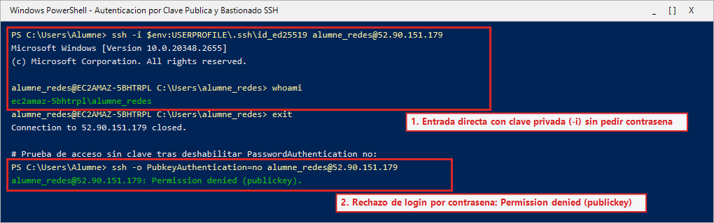
*Figura 47: Inicio de sesión automático mediante clave privada y denegación de acceso por contraseña tras el bastionado.*

> 📷 **Realizar captura de pantalla** de PuTTY entrando sin contraseña con la clave pública (`Authenticating with public key`) y otra captura mostrando el bloqueo `No supported authentication methods available (server sent: publickey)` al intentar conectar sin clave.

!!! warning "Entrega de la tarea"
    Elaborar un documento con las evidencias en Windows Server de la conexión SSH inicial con PuTTY, la generación del par de claves en PuTTYgen, la instalación de la clave pública en `authorized_keys`, el inicio de sesión automático sin contraseña y el rechazo de conexión por contraseña tras el bastionado.

    * **Nombre del fichero:** `RA6-CEbcd-1-NombreApellidos.pdf` (ejemplo: `RA6-CEbcd-1-JoanPerez.pdf`).
    * **Entrega:** Subir el archivo en formato PDF a la tarea correspondiente de **Aules** antes de la fecha límite.

---

## 11 Tarea RA6-CEe-1 - [Windows Server] Transferencia segura con SFTP/SCP y auditoría de Logs y Wireshark

!!! warning "Obligatorio seguir las normas para la presentación de trabajos escritos."
    Todas las evidencias deberán incluir capturas de pantalla completas donde se aprecie claramente el nombre del equipo, usuario y la fecha/hora.

Para completar todo el bloque práctico sobre **Windows Server (`Servidor_FTPSSH`)**, realizaremos transferencias seguras por el puerto `22` mediante **SFTP** y **SCP**, y auditaremos tanto los registros de actividad W3C de IIS como los paquetes de red capturados con **Wireshark**.

---

### 11.1 Transferencia gráfica por SFTP hacia Windows Server en FileZilla (Puerto 22)

1. Abrir **FileZilla Client**.
2. Conectar por **SFTP** desde la barra de **Conexión rápida** (indicando la IP pública de Windows Server, usuario `alumne_redes`, contraseña `Smx2026..@` y el **Puerto `22`**) o desde **Archivo** -> **Gestor de sitios...** -> **Nuevo sitio** (`SFTP-Windows`) seleccionando el protocolo **SFTP - SSH File Transfer Protocol** y cargando vuestro archivo de clave privada `.ppk`.
3. En la primera conexión SSH/SFTP, FileZilla mostrará la ventana de seguridad **Clave de sitio desconocida** con el algoritmo (`ssh-ed25519`) y la huella criptográfica (**Fingerprint `SHA256`**) del servidor. Pulsar en **Aceptar**:

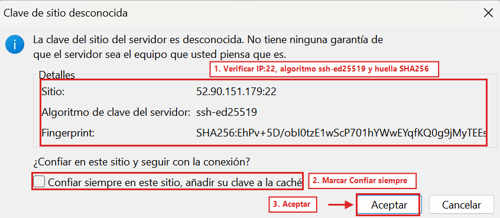
*Figura 34: Verificación de la clave host SSH (ssh-ed25519 y huella SHA256) al establecer conexión SFTP en el puerto 22.*

4. Comprobar que en el log superior se negocia la conexión SFTP a través de SSH (`Hostkey is trusted` y `Directorio "/C:/Users/alumne_redes" listado correctamente`) y que en la barra de estado inferior derecha de FileZilla aparece el **icono del candado dorado cerrado**:

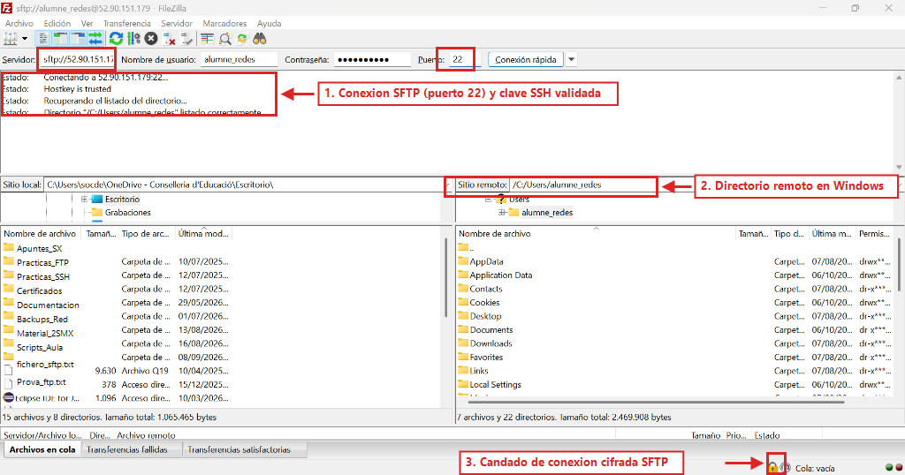
*Figura 35: Conexión SFTP activa en el puerto 22 hacia Windows Server con listado del directorio remoto y candado de conexión cifrada.*

5. Subir un archivo de prueba (`fichero_sftp.txt`) y verificar que la transferencia cifrada concluye con éxito.

> 📷 **Realizar captura de pantalla** de FileZilla conectado por el protocolo SFTP al puerto 22 de Windows Server mostrando la transferencia completada y el icono del candado inferior.

---

### 11.2 Transferencia por línea de comandos mediante SCP hacia Windows Server

1. En vuestro ordenador del aula, abrir una ventana de **Windows PowerShell**.
2. Crear un archivo local de prueba y enviarlo hacia Windows Server mediante `scp`:
   ```powershell
   Set-Content -Path .\backup_aula.txt -Value "Copia de seguridad realizada mediante SCP - 2SMX"
   scp .\backup_aula.txt alumne_redes@<IP_PUBLICA_WINDOWS>:C:/Users/alumne_redes/
   ```
3. Comprobar en la consola la barra de progreso al `100%` y descargar el archivo de vuelta con un nuevo nombre (`fichero_recuperado.txt`) para verificar su integridad:
   ```powershell
   scp alumne_redes@<IP_PUBLICA_WINDOWS>:C:/Users/alumne_redes/backup_aula.txt .\fichero_recuperado.txt
   Get-Content .\fichero_recuperado.txt
   ```

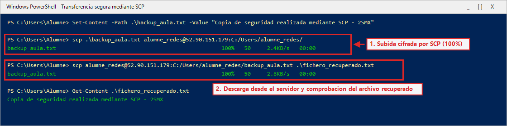
*Figura 48: Subida y descarga segura de archivos hacia Windows Server por línea de comandos mediante SCP sobre el puerto 22.*

> 📷 **Realizar captura de pantalla** de PowerShell ejecutando los comandos `scp` de subida y descarga mostrando la transferencia completada al `100%`.

---

### 11.3 Auditoría de registros de actividad en Windows Server (Logs W3C de IIS)

1. En Windows Server, abrir **File Explorer** y navegar a la ruta donde IIS almacena los registros de FTP:
   ```text
   C:\inetpub\logs\LogFiles\FTPSVC1\
   ```
2. Abrir el fichero de log más reciente (`u_exAAMMDD.log`, por ejemplo `u_ex261006.log`) con **Notepad**:

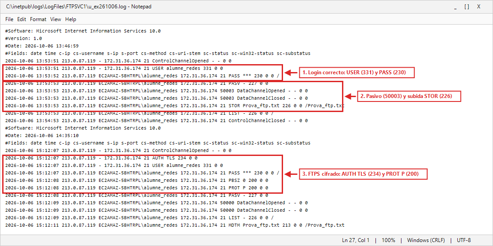
*Figura 44: Inspección en Notepad del fichero de registro W3C (u_ex261006.log) mostrando la autenticación (230), apertura de puertos pasivos (50000-50003), subida de archivo (STOR Prova_ftp.txt -> 226) y negociación FTPS (AUTH TLS -> 234 y PROT P -> 200).*

3. Identificar en el log los códigos de estado de vuestras operaciones:
   * `234`: Negociación de cifrado `AUTH TLS` aceptada.
   * `230`: Inicio de sesión correcto (`PASS ***`).
   * `227`: Entrada en Modo Pasivo (`PASV`).
   * `226`: Transferencia de archivo completada (`STOR Prova_ftp.txt`).
   * `550`: Permiso denegado (cuando el usuario `anonymous` intentó borrar el catálogo).

> 📷 **Realizar captura de pantalla** del fichero de log de IIS en Notepad destacando una línea con un comando de subida exitoso (`STOR` con código `226`) y la negociación FTPS (`AUTH TLS` con código `234`).

---

### 11.4 Auditoría de tráfico con Wireshark: FTP en texto claro vs. FTPS y SFTP cifrados

Para comprobar empíricamente por qué nunca debe utilizarse FTP sin cifrar, capturaremos con **Wireshark** en el PC del aula el tráfico hacia nuestro Windows Server aplicando el filtro `ftp || tls || ssh`:

* **En FTP plano (sin SSL):** Wireshark muestra en texto claro `Request: USER alumne_redes` y **`Request: PASS Smx2026..@`**.
* **En FTPS (`Require SSL`):** Tras `AUTH TLS`, todo viaja cifrado como **`TLSv1.2 Application Data`**.
* **En SFTP (Puerto `22`):** Todo viaja blindado como **`SSHv2 Encrypted packet`**.

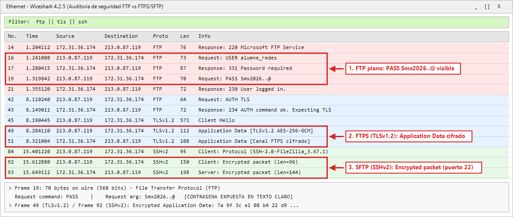
*Figura 44b: Auditoría en Wireshark contrastando la exposición de credenciales en FTP plano (Request: PASS Smx2026..@) frente al tráfico cifrado en FTPS (TLSv1.2 Application Data) y SFTP (SSHv2 Encrypted packet).*

> 📷 **Realizar captura de pantalla** de Wireshark mostrando los paquetes cifrados `TLSv1.2 Application Data` (FTPS) y `SSHv2 Encrypted packet` (SFTP).

!!! warning "Entrega de la tarea"
    Elaborar un documento con las evidencias en Windows Server de: transferencia gráfica SFTP en FileZilla (puerto 22), transferencia por línea de comandos con `scp`, auditoría del fichero de log de IIS (`u_exAAMMDD.log`) en Notepad y captura de tráfico en Wireshark.

    * **Nombre del fichero:** `RA6-CEe-1-NombreApellidos.pdf` (ejemplo: `RA6-CEe-1-JoanPerez.pdf`).
    * **Entrega:** Subir el archivo en formato PDF a la tarea correspondiente de **Aules** antes de la fecha límite.

---

## 12 Tarea RA3-CEbcd-2 - [Ubuntu Server] Instalación de vsftpd, modo pasivo, jaula chroot y pruebas en FileZilla

!!! warning "Obligatorio seguir las normas para la presentación de trabajos escritos."
    Todas las evidencias deberán incluir capturas de pantalla completas donde se aprecie claramente el nombre del equipo, usuario y la fecha/hora.

Una vez completadas y verificadas todas las prácticas sobre Windows Server, pasamos al segundo bloque del laboratorio desplegando el servicio de transferencia de ficheros en **Linux (`Ubuntu Server 24.04 LTS`)** mediante el demonio **`vsftpd`**. *(Mientras trabajes exclusivamente en esta tarea y en la Tarea 13, puedes mantener detenida la máquina de Windows Server para ahorrar saldo en AWS Academy).*

---

### 12.0 Lanzamiento de la instancia EC2 de Ubuntu Server 24.04 LTS en AWS

1. En la consola de **AWS EC2** -> **Instances** -> pulsar en **Launch instances** (*Lanzar instancias*) y desplegar la segunda máquina virtual del laboratorio con las siguientes especificaciones:

| Parámetro de configuración | Valor requerido |
|---|---|
| **Name (Nombre)** | `Ubuntu_FTPSSH` |
| **Application and OS Images (AMI)** | `Ubuntu Server 24.04 LTS (HVM), SSD Volume Type` (64 bits x86) |
| **Instance type (Tipo de instancia)** | `t2.micro` o `t3.micro` (1 vCPU, 1 GiB RAM) |
| **Key pair (login)** | `vockey` (o par de claves del laboratorio) |
| **Network settings (Security group)** | Seleccionar **Select existing security group** y elegir **`grup-servidors-ftp-ssh`** (creado en el apartado 6.1) |
| **Configure storage** | `8 GiB` o `10 GiB` gp3 (SSD) |

2. Esperar a que la instancia pase a estado `Running` y anotar su **Dirección IPv4 pública**.

> 📷 **Realizar captura de pantalla** del panel de instancias de AWS EC2 mostrando la instancia `Ubuntu_FTPSSH` en ejecución (`Running`) con el grupo de seguridad `grup-servidors-ftp-ssh` asignado.

---

### 12.1 Verificación de puertos en el Security Group de Ubuntu

1. En la consola de AWS -> **EC2** -> comprobar que el Security Group (`grup-servidors-ftp-ssh`) asociado a la instancia `Ubuntu_FTPSSH` tiene abiertos los puertos:
   * Puerto `22` TCP (SSH).
   * Puerto `21` TCP (FTP Control).
   * Rango de puertos `40000-40100` TCP (FTP Pasivo en Linux).

---

### 12.2 Instalación del servicio vsftpd

1. Conectarse a la instancia `Ubuntu_FTPSSH` por SSH utilizando PuTTY (cargando la clave del laboratorio o desde AWS EC2 Instance Connect / terminal).
2. Actualizar el índice de repositorios e instalar el paquete `vsftpd`:
   ```bash
   sudo apt update && sudo apt install -y vsftpd
   ```

---

### 12.3 Configuración de modo pasivo, NAT y jaula chroot en /etc/vsftpd.conf

1. Abrir el fichero de configuración principal del servicio:
   ```bash
   sudo nano /etc/vsftpd.conf
   ```
2. Modificar o añadir al final las siguientes directivas para habilitar la escritura de usuarios locales, el enjaulado (`chroot`) en su directorio personal y el rango de puertos pasivos para el NAT de AWS:
   ```ini
   # Acceso de usuarios locales con permisos de escritura
   anonymous_enable=NO
   local_enable=YES
   write_enable=YES
   local_umask=022

   # Enjaulado (chroot jail) de usuarios en su directorio /home/<usuario>
   chroot_local_user=YES
   allow_writeable_chroot=YES

   # Configuración de modo pasivo para AWS Cloud
   pasv_enable=YES
   pasv_min_port=40000
   pasv_max_port=40100
   pasv_address=<TU_IP_PUBLICA_UBUNTU>
   ```

> 📷 **Realizar captura de pantalla** del fichero `/etc/vsftpd.conf` editado donde se aprecien las directivas `chroot_local_user=YES`, `pasv_enable=YES`, `pasv_address` y el rango `40000-40100`.

---

### 12.4 Creación de usuarios locales y activación del servicio

1. Crear los usuarios `alumne_redes` y `usuari_ventas` en Ubuntu Server:
   ```bash
   sudo adduser alumne_redes
   # Asignar la contraseña: Smx2026..@
   sudo adduser usuari_ventas
   # Asignar la contraseña: Smx2026..@
   ```
2. Reiniciar el servicio `vsftpd` y verificar que se encuentra activo (`active (running)`):
   ```bash
   sudo systemctl restart vsftpd
   sudo systemctl status vsftpd
   ```

> 📷 **Realizar captura de pantalla** de la terminal de Ubuntu mostrando el estado `active (running)` del servicio `vsftpd`.

---

### 12.5 Prueba de transferencia y verificación de enjaulado (chroot) desde FileZilla

1. Abrir **FileZilla Client** en vuestro PC del aula y conectar hacia **Ubuntu Server**:
   * **Servidor:** `<IP_PUBLICA_UBUNTU>`
   * **Nombre de usuario:** `alumne_redes` (y posteriormente probar con `usuari_ventas`)
   * **Contraseña:** `Smx2026..@`
   * **Puerto:** `21`
2. Subir un archivo llamado `prueba_ubuntu.txt` y comprobar que la transferencia en modo pasivo (`40000-40100`) se completa con éxito.
3. Verificar que gracias a la directiva `chroot_local_user=YES`, el usuario aparece enjaulado en `/` (que corresponde físicamente a `/home/usuari_ventas`), impidiendo que pueda subir de nivel hacia `/home` o `/etc`.

> 📷 **Realizar captura de pantalla** de FileZilla conectado a Ubuntu Server mostrando la subida de `prueba_ubuntu.txt` y el enjaulado del usuario en su directorio raíz `/`.

!!! warning "Entrega de la tarea"
    Elaborar un documento con las evidencias del despliegue en Ubuntu Server: instancia `Ubuntu_FTPSSH` en ejecución en AWS, fichero `/etc/vsftpd.conf` configurado con modo pasivo y `chroot`, estado `active (running)` del servicio `vsftpd` y capturas en FileZilla subiendo `prueba_ubuntu.txt` con el usuario enjaulado.

    * **Nombre del fichero:** `RA3-CEbcd-2-NombreApellidos.pdf` (ejemplo: `RA3-CEbcd-2-JoanPerez.pdf`).
    * **Entrega:** Subir el archivo en formato PDF a la tarea correspondiente de **Aules** antes de la fecha límite.

---

## 13 Tarea RA3-CEg / RA6-CEf - [Ubuntu Server] Seguridad FTPS con OpenSSL, claves SSH y auditoría de logs en Linux

!!! warning "Obligatorio seguir las normas para la presentación de trabajos escritos."
    Todas las evidencias deberán incluir capturas de pantalla completas donde se aprecie claramente el nombre del equipo, usuario y la fecha/hora.

En esta tarea aseguraremos nuestro servidor **Ubuntu Server (`Ubuntu_FTPSSH`)** implementando cifrado **FTPS con OpenSSL**, configurando el acceso **SSH por clave pública** y auditando los registros del sistema en `/var/log/`.

---

### 13.1 Configuración de FTPS (TLS/SSL) en Ubuntu Server con OpenSSL y vsftpd

1. En la consola SSH de **`Ubuntu_FTPSSH`**, generar un certificado digital autofirmado X.509 RSA de `2048 bits` válido por 365 días en `/etc/ssl/private/vsftpd.pem`:
   ```bash
   sudo openssl req -x509 -nodes -days 365 -newkey rsa:2048 \
     -keyout /etc/ssl/private/vsftpd.pem \
     -out /etc/ssl/private/vsftpd.pem
   ```
2. Cumplimentar los datos identificativos del certificado cuando los solicite OpenSSL:
   * **Country Name (2 letter code):** `ES`
   * **State or Province Name:** `Valencia`
   * **Locality Name:** `Catadau`
   * **Organization Name:** `IES Mestre Ramon Esteve`
   * **Organizational Unit Name:** `2SMX - Serveis en Xarxa`
   * **Common Name (FQDN):** `ftp.iesmre.local`
3. Restringir los permisos del archivo `.pem`:
   ```bash
   sudo chmod 600 /etc/ssl/private/vsftpd.pem
   ```
4. Editar `/etc/vsftpd.conf` (`sudo nano /etc/vsftpd.conf`) y añadir al final el bloque de cifrado SSL/TLS obligatorio:
   ```ini
   # Cifrado explicito FTPS (TLS/SSL) en vsftpd
   ssl_enable=YES
   allow_anon_ssl=NO
   force_local_data_ssl=YES
   force_local_logins_ssl=YES
   ssl_tlsv1=YES
   ssl_sslv2=NO
   ssl_sslv3=NO
   require_ssl_reuse=NO
   ssl_ciphers=HIGH
   rsa_cert_file=/etc/ssl/private/vsftpd.pem
   rsa_private_key_file=/etc/ssl/private/vsftpd.pem
   ```

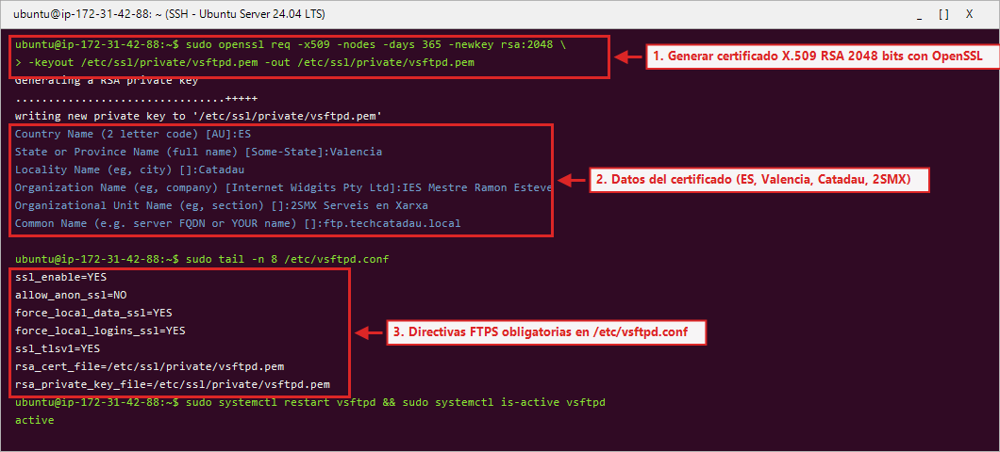
*Figura 43b: Generación del certificado autofirmado X.509 con OpenSSL y configuración de las directivas de cifrado TLS obligatorio en /etc/vsftpd.conf.*

5. Reiniciar `vsftpd` (`sudo systemctl restart vsftpd`) y conectar desde **FileZilla Client** hacia la IP pública de Ubuntu en el puerto `21`: comprobar que aparece la ventana **Certificado desconocido** con los datos de `IES Mestre Ramon Esteve (Catadau)` y que al aceptarlo se activa el candado de seguridad.

> 📷 **Realizar captura de pantalla** de la generación del certificado con `openssl` en Ubuntu y de la ventana del certificado en FileZilla al conectar por FTPS a Ubuntu Server.

---

### 13.2 Instalación de la clave pública SSH y bastionado en Ubuntu Server

1. En la sesión SSH de **Ubuntu Server** (conectado como `alumne_redes`), crear el directorio `.ssh` e instalar la misma clave pública que generamos en PuTTYgen en la Tarea 10:
   ```bash
   mkdir -p ~/.ssh
   chmod 700 ~/.ssh
   nano ~/.ssh/authorized_keys
   # Pegar la clave pública ssh-rsa ... en una sola línea, guardar (Ctrl+O) y salir (Ctrl+X)
   chmod 600 ~/.ssh/authorized_keys
   ```
2. Probar desde **PuTTY** en vuestro PC que podéis entrar a `Ubuntu_FTPSSH` con el usuario `alumne_redes` y el fichero `clave_privada_smx.ppk` sin que pida contraseña.
3. Bastionar el servidor SSH de Ubuntu editando `/etc/ssh/sshd_config`:
   ```bash
   sudo nano /etc/ssh/sshd_config
   ```
   Asegurar las directivas `PubkeyAuthentication yes` y `PasswordAuthentication no`, y reiniciar el servicio (`sudo systemctl restart ssh`).

---

### 13.3 Auditoría de registros en Ubuntu Server (vsftpd.log y auth.log)

1. En la consola SSH de Ubuntu Server, consultar las últimas transferencias registradas por `vsftpd` (descomentando `xferlog_enable=YES` en `/etc/vsftpd.conf` si no estuviera activo):
   ```bash
   sudo tail -n 25 /var/log/vsftpd.log
   ```
2. Consultar el registro de autenticaciones y accesos SSH del sistema:
   ```bash
   sudo cat /var/log/auth.log | grep -E "sshd.*(Accepted|Failed)" | tail -n 20
   ```
3. Identificar en la salida la dirección IP pública del cliente y el método de autenticación empleado (`publickey` o `password`).

> 📷 **Realizar captura de pantalla** de la terminal de Ubuntu mostrando las últimas líneas del registro `/var/log/vsftpd.log` y de `/var/log/auth.log`.

!!! warning "Entrega de la tarea"
    Elaborar un informe técnico con las evidencias en Ubuntu Server de: la generación del certificado OpenSSL y conexión FTPS en FileZilla, la autenticación por clave pública SSH en Ubuntu y la auditoría de los ficheros `/var/log/vsftpd.log` y `/var/log/auth.log`.

    * **Nombre del fichero:** `RA3-CEg-RA6-CEf-NombreApellidos.pdf` (ejemplo: `RA3-CEg-RA6-CEf-JoanPerez.pdf`).
    * **Entrega:** Subir el archivo en formato PDF a la tarea correspondiente de **Aules** antes de la fecha límite.

---

## 14 Tarea RA3-CEf-2 - Pruebas cruzadas inter-servidores en AWS Cloud

!!! warning "Obligatorio seguir las normas para la presentación de trabajos escritos."
    Todas las evidencias deberán incluir capturas de pantalla completas donde se aprecie claramente el nombre del equipo, usuario y la fecha/hora.

En esta tarea comprobaremos la interoperabilidad bidireccional conectando los dos servidores entre sí a través de la nube de Amazon Web Services.

---

### 14.1 Conexión FTP y SSH desde Ubuntu Server hacia Windows Server

1. Desde la sesión SSH de **Ubuntu Server**, transferir un fichero al servidor Windows Server mediante `curl`:
   ```bash
   echo "Hola desde Linux hacia Windows Server en AWS" > saludo_linux.txt
   curl --ssl-reqd -k -T saludo_linux.txt -u alumne_redes:Smx2026..@ ftp://<IP_PUBLICA_WINDOWS>/
   ```
   *(Nota: incluimos `--ssl-reqd -k` dado que el servidor Windows exige cifrado explícito FTPS con certificado autofirmado).*
2. Desde la misma consola de Ubuntu Server, iniciar una sesión remota SSH hacia el servidor Windows:
   ```bash
   ssh alumne_redes@<IP_PUBLICA_WINDOWS>
   ```

> 📷 **Realizar captura de pantalla** de la consola de Ubuntu mostrando la subida del fichero por FTP/FTPS y la apertura de sesión SSH en Windows.

---

### 14.2 Conexión FTP y SSH desde Windows Server hacia Ubuntu Server

1. Dentro de vuestro escritorio remoto de **Windows Server**, abrir PuTTY (o PowerShell) hacia la **IP pública de Ubuntu Server** en el puerto `22` con `alumne_redes`.
2. Probar la subida o descarga de un fichero hacia Ubuntu Server mediante `curl` o `scp`.

> 📷 **Realizar captura de pantalla** de la conexión realizada desde dentro de Windows Server hacia Ubuntu Server.

!!! warning "Entrega de la tarea"
    Elaborar un documento con las evidencias de las conexiones cruzadas inter-servidores en AWS: transferencia FTPS mediante `curl` y sesión SSH remota desde Ubuntu hacia Windows Server, y conexión remota desde Windows Server hacia Ubuntu Server.

    * **Nombre del fichero:** `RA3-CEf-2-NombreApellidos.pdf` (ejemplo: `RA3-CEf-2-JoanPerez.pdf`).
    * **Entrega:** Subir el archivo en formato PDF a la tarea correspondiente de **Aules** antes de la fecha límite.

---

## 15 Tarea RA3-CEh - Proyecto Integrador Final: Infraestructura corporativa de TechCatadau S.L. en AWS y control de costes

!!! warning "Obligatorio seguir las normas para la presentación de trabajos escritos."
    Todas las evidencias deberán incluir capturas de pantalla completas donde se aprecie claramente el nombre del equipo, usuario y la fecha/hora.

En este proyecto final de la unidad pondréis en práctica de forma autónoma todos los conocimientos adquiridos para desplegar la infraestructura completa de intercambio seguro de ficheros y copias de seguridad de la empresa **TechCatadau S.L.** sobre vuestras dos instancias de AWS (`Servidor_FTPSSH` y `Ubuntu_FTPSSH`), finalizando con el protocolo obligatorio de parada y control de costes en la nube.

---

### 15.1 Despliegue departamental aislado y cifrado en TechCatadau S.L.

La dirección técnica de **TechCatadau S.L.** solicita configurar un entorno corporativo con **4 departamentos aislados** y un **repositorio público institucional**:

1. **Cuentas departamentales y estructura de directorios en Windows Server (`Servidor_FTPSSH`):**
   * Asegurar la existencia de las 4 cuentas locales departamentales en `compmgmt.msc` (con contraseña `Smx2026..@`):
     - `usuari_direccion` (Departamento de Dirección)
     - `usuari_ventas` (Departamento Comercial y Ventas)
     - `usuari_compras` (Departamento de Compras y Proveedores)
     - `usuari_soporte` (Departamento de Soporte Técnico IT)
   * Crear dentro de `C:\inetpub\ftproot\LocalUser\` las carpetas aisladas correspondientes y sus documentos corporativos iniciales:
     ```text
     C:\inetpub\ftproot\LocalUser\
     ├── usuari_direccion\
     │   └── plan_estrategico_2026.txt
     ├── usuari_ventas\
     │   └── informe_ventas_privado.txt
     ├── usuari_compras\
     │   └── presupuesto_compras_privado.txt
     ├── usuari_soporte\
     │   └── inventario_servidores_aws.txt
     └── Public\
         ├── catalogo_empresa_2026.pdf
         └── normativa_seguridad_2026.pdf
     ```
   * Configurar los **permisos NTFS** (`Modify` para cada usuario exclusivamente en su carpeta departamental) y las **FTP Authorization Rules** en IIS (Lectura/Escritura para los 4 departamentos; **Solo Lectura** para `Anonymous Users`).
   * Verificar que el sitio opera exclusivamente bajo **FTPS (`Require SSL connections`)**.

> 📷 **Realizar captura de pantalla** de FileZilla validando el acceso aislado de `usuari_direccion` y `usuari_soporte` bajo conexión cifrada FTPS (con el candado activo).

---

### 15.2 Automatización de copia de seguridad cruzada mediante script SCP

Para garantizar la continuidad de negocio ante fallos, el departamento de Soporte Técnico debe programar un script de respaldo que empaquete los documentos corporativos de `C:\inetpub\ftproot\LocalUser` en Windows Server y los envíe de forma cifrada y desatendida mediante **SCP (con clave pública SSH)** hacia el servidor de respaldo **Ubuntu Server (`Ubuntu_FTPSSH`)**:

1. En **Windows Server** (o desde vuestro equipo de administración), crear el script `C:\Scripts\backup_techcatadau.ps1` con el siguiente contenido:
   ```powershell
   $fecha = Get-Date -Format "yyyyMMdd_HHmm"
   $origen = "C:\inetpub\ftproot\LocalUser"
   $archivoZip = "C:\Scripts\backup_ftproot_$fecha.zip"
   $servidorUbuntu = "alumne_redes@<IP_PUBLICA_UBUNTU>:~/backups_windows/"

   # 1. Comprimir toda la estructura departamental del FTP
   Compress-Archive -Path "$origen\*" -DestinationPath $archivoZip -Force

   # 2. Transferir el paquete cifrado por SCP usando clave privada SSH (sin pedir contraseña)
   scp -i "$env:USERPROFILE\.ssh\id_ed25519" $archivoZip $servidorUbuntu

   Write-Host "Copia de seguridad $archivoZip enviada con exito a Ubuntu Server."
   ```
2. En **Ubuntu Server**, crear la carpeta destino `mkdir -p ~/backups_windows`, ejecutar el script desde PowerShell y comprobar con `ls -lh ~/backups_windows` en Ubuntu que el archivo `.zip` se ha recibido íntegramente al `100%`.

> 📷 **Realizar captura de pantalla** de la ejecución del script `backup_techcatadau.ps1` transfiriendo el archivo `.zip` por SCP al `100%` y su comprobación en el directorio `~/backups_windows` de Ubuntu Server.

---

### 15.3 Lista de comprobación en vivo en el aula (Checklist de validación)

Antes de proceder al apagado definitivo del laboratorio, verificad que vuestra infraestructura supera los **6 puntos de control** de la auditoría técnica:

| Nº | Prueba de verificación | Resultado esperado | Estado |
|:---:|---|---|---:|
| **1** | Conexión FTP sin cifrar (Texto plano) | Rechazada por el servidor (`534 Policy requires SSL`) | ☐ OK |
| **2** | Conexión FTPS (TLS 1.2) con `usuari_direccion` | Acceso enjaulado a su carpeta viendo solo `plan_estrategico_2026.txt` con candado TLS | ☐ OK |
| **3** | Conexión FTPS con usuario `anonymous` | Ve `normativa_seguridad_2026.pdf`, puede descargarlo pero recibe `550 Access is denied` al borrar | ☐ OK |
| **4** | Conexión SSH por contraseña convencional | Rechazada tras el bastionado (`Permission denied (publickey)`) | ☐ OK |
| **5** | Conexión SSH / SFTP con clave privada | Acceso directo sin contraseña en el puerto `22` | ☐ OK |
| **6** | Ejecución de `backup_techcatadau.ps1` | Archivo `.zip` comprimido y recibido por SCP en `Ubuntu_FTPSSH` | ☐ OK |

---

### 15.4 Cierre del laboratorio y control de costes en AWS

!!! warning "¡Obligatorio al finalizar cada sesión de trabajo!"
    Los laboratorios de AWS Academy disponen de un crédito limitado (\$50). Dejar las instancias encendidas consume saldo continuamente y puede provocar que os quedéis sin horas de laboratorio antes de que termine el curso.

1. **Desconexión de las sesiones activas:** Cerrar las ventanas de Escritorio Remoto (RDP), FileZilla, Wireshark y las sesiones de PuTTY/PowerShell abiertas en vuestro ordenador.
2. **Detener las instancias en AWS (`Stop instance`):**
   * Volver a la consola de AWS -> **EC2** -> **Instances** (*Instancias*).
   * Seleccionar las casillas de vuestras dos máquinas: **`Servidor_FTPSSH`** y **`Ubuntu_FTPSSH`**.
   * Hacer clic en **Instance state** -> **Stop instance** (*Detener la instancia*).
   * Esperar hasta que en la columna de estado aparezca claramente **Stopped** (*Detenido*) en ambas instancias.

> 📷 **Realizar captura de pantalla** del panel de instancias de EC2 mostrando ambas máquinas (`Servidor_FTPSSH` y `Ubuntu_FTPSSH`) en estado `Stopped` (*Detenido*).

3. **Cerrar el laboratorio:** Volver a la pestaña de **AWS Academy** (Vocareum) y pulsar en el botón rojo superior **`End Lab`**.

!!! warning "Entrega de la tarea"
    Elaborar un documento final que incluya:
    1. Las evidencias del despliegue departamental de **TechCatadau S.L.** (`usuari_direccion`, `usuari_ventas`, `usuari_compras`, `usuari_soporte` y carpeta `Public`).
    2. La ejecución del script automatizado `backup_techcatadau.ps1` enviando la copia de seguridad `.zip` por SCP hacia Ubuntu Server.
    3. La captura de la consola de instancias de AWS EC2 mostrando todas las máquinas virtuales en estado **`Stopped`** (*Detenido*), demostrando la aplicación de buenas prácticas de ahorro y gestión de recursos en la nube.

    * **Nombre del fichero:** `RA3-CEh-NombreApellidos.pdf` (ejemplo: `RA3-CEh-JoanPerez.pdf`).
    * **Entrega:** Subir el archivo en formato PDF a la tarea correspondiente de **Aules** antes de la fecha límite.


